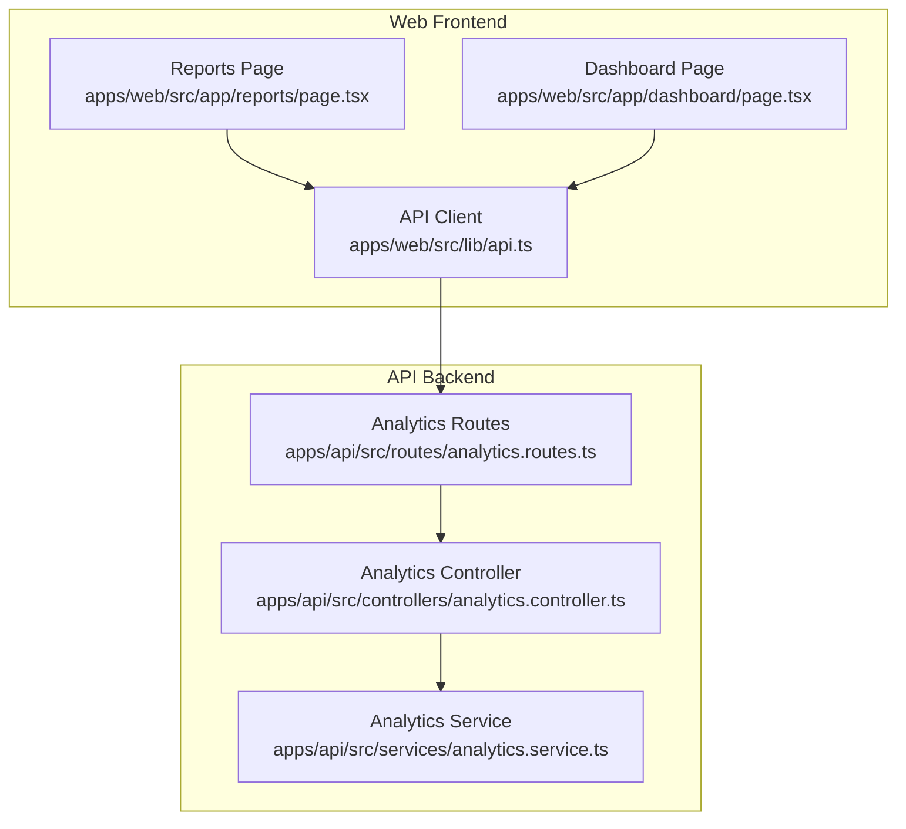
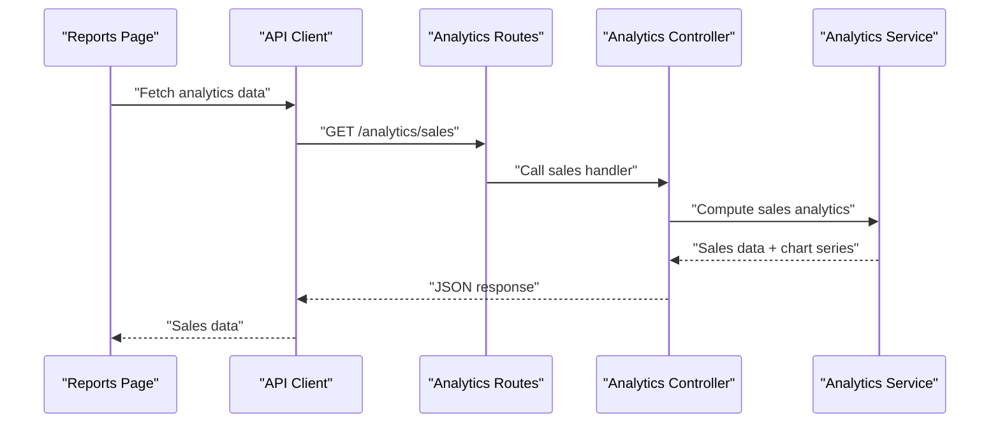
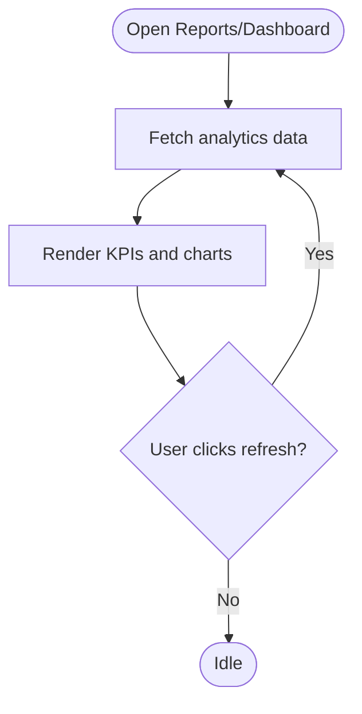
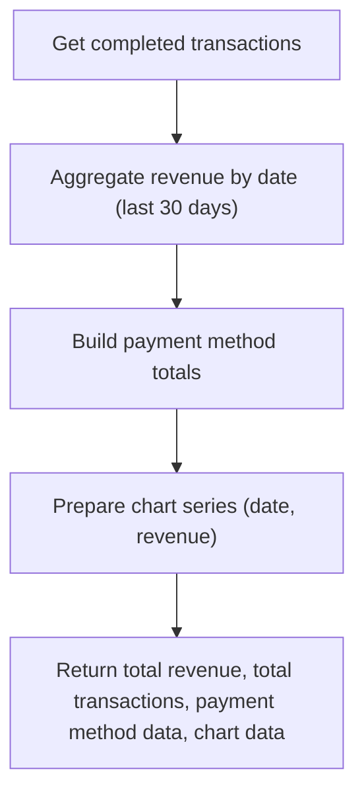
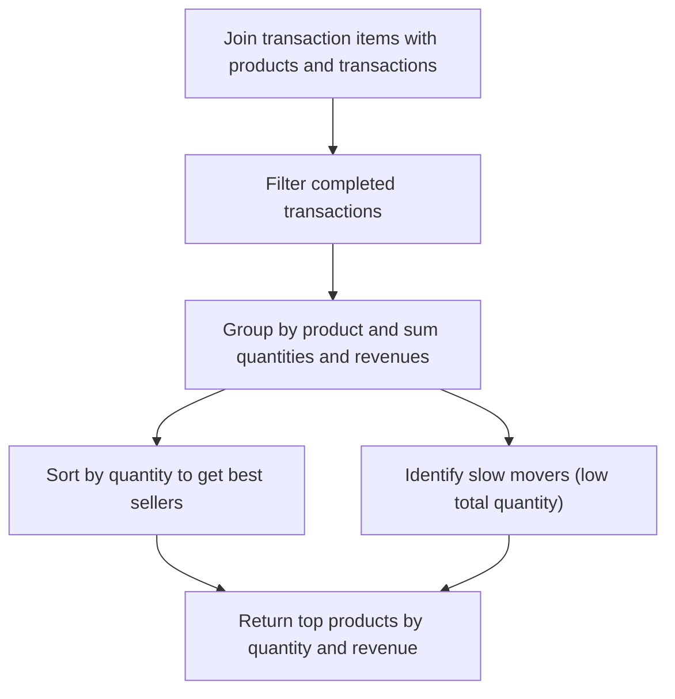
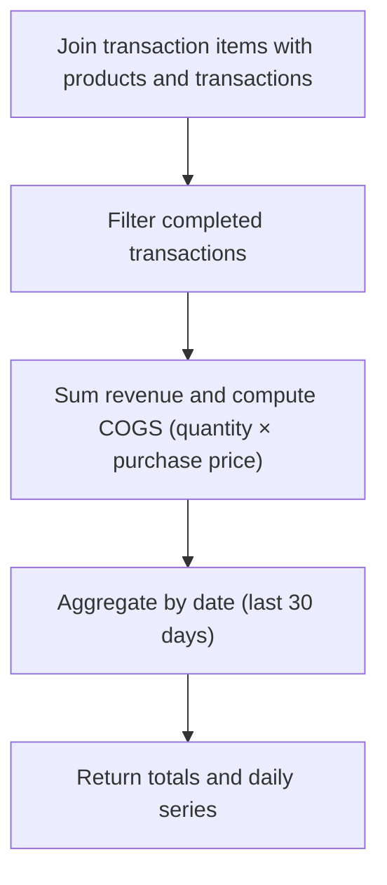
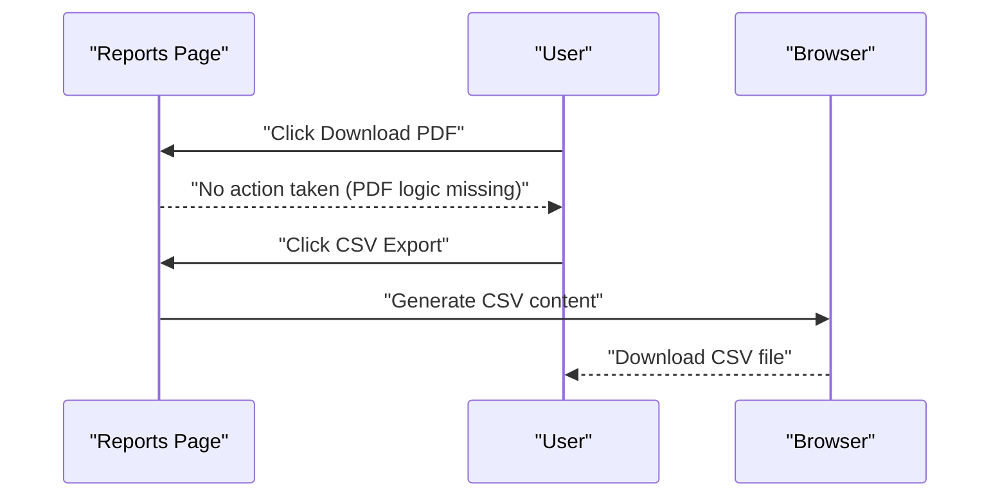
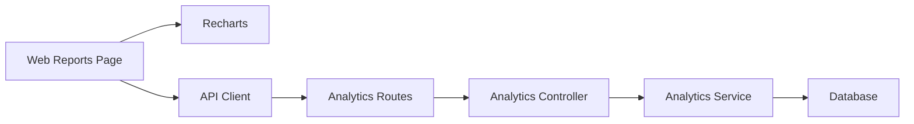

# Analytics & Reporting

<cite>
**Referenced Files in This Document**
- [analytics.controller.ts](file://apps/api/src/controllers/analytics.controller.ts)
- [analytics.routes.ts](file://apps/api/src/routes/analytics.routes.ts)
- [analytics.service.ts](file://apps/api/src/services/analytics.service.ts)
- [page.tsx](file://apps/web/src/app/reports/page.tsx)
- [page.tsx](file://apps/web/src/app/dashboard/page.tsx)
- [api.ts](file://apps/web/src/lib/api.ts)
- [package.json](file://apps/web/package.json)
</cite>

## Table of Contents
1. [Introduction](#introduction)
2. [Project Structure](#project-structure)
3. [Core Components](#core-components)
4. [Architecture Overview](#architecture-overview)
5. [Detailed Component Analysis](#detailed-component-analysis)
6. [Dependency Analysis](#dependency-analysis)
7. [Performance Considerations](#performance-considerations)
8. [Troubleshooting Guide](#troubleshooting-guide)
9. [Conclusion](#conclusion)
10. [Appendices](#appendices)

## Introduction
This document describes the analytics and reporting capabilities of the ARHAT POS business intelligence system. It covers dashboard design, key performance indicators, sales and product reporting, customer analytics, financial reporting, export functionality, real-time updates, data visualization, and custom report generation. The backend provides analytics endpoints, while the frontend renders dashboards and enables exports.

## Project Structure
The analytics and reporting features span the API backend and the Next.js web frontend:
- Backend: Analytics controller and service expose endpoints for sales, product, customer, and profit-and-loss analytics.
- Frontend: Reports page aggregates analytics data and presents it with charts and export capabilities. The dashboard page displays revenue trends.

**Diagram sources**
- [analytics.routes.ts](file://apps/api/src/routes/analytics.routes.ts)
- [analytics.controller.ts](file://apps/api/src/controllers/analytics.controller.ts)
- [analytics.service.ts](file://apps/api/src/services/analytics.service.ts)
- [page.tsx](file://apps/web/src/app/reports/page.tsx)
- [page.tsx](file://apps/web/src/app/dashboard/page.tsx)
- [api.ts](file://apps/web/src/lib/api.ts)

**Section sources**
- [analytics.routes.ts](file://apps/api/src/routes/analytics.routes.ts)
- [analytics.controller.ts](file://apps/api/src/controllers/analytics.controller.ts)
- [analytics.service.ts](file://apps/api/src/services/analytics.service.ts)
- [page.tsx](file://apps/web/src/app/reports/page.tsx)
- [page.tsx](file://apps/web/src/app/dashboard/page.tsx)
- [api.ts](file://apps/web/src/lib/api.ts)

## Core Components
- Analytics controller: Exposes endpoints for dashboard summary, sales analytics, product analytics, customer analytics, and profit-and-loss.
- Analytics service: Implements data aggregation queries, computes KPIs, and prepares chart series for the last 7 days and last 30 days.
- Web reports page: Fetches analytics concurrently, renders KPI cards and charts, and supports CSV export.
- Dashboard page: Renders a revenue area chart for the last 7 days.
- Export support: CSV export for sales, product, and customer tabs; PDF export button present but logic not implemented in the referenced file.

Key analytics endpoints:
- GET /analytics/dashboard-summary
- GET /analytics/sales
- GET /analytics/products
- GET /analytics/customers
- GET /analytics/profit-loss

**Section sources**
- [analytics.controller.ts](file://apps/api/src/controllers/analytics.controller.ts)
- [analytics.service.ts](file://apps/api/src/services/analytics.service.ts)
- [page.tsx](file://apps/web/src/app/reports/page.tsx)
- [page.tsx](file://apps/web/src/app/dashboard/page.tsx)

## Architecture Overview
The analytics pipeline follows a standard request-response pattern:
- Frontend requests analytics data via API client.
- Routes map HTTP endpoints to controller actions.
- Controller delegates to service for database queries and computations.
- Service returns structured analytics data (KPIs, chart series, lists).
- Frontend renders dashboards and export controls.

**Diagram sources**
- [analytics.routes.ts](file://apps/api/src/routes/analytics.routes.ts)
- [analytics.controller.ts](file://apps/api/src/controllers/analytics.controller.ts)
- [analytics.service.ts](file://apps/api/src/services/analytics.service.ts)
- [page.tsx](file://apps/web/src/app/reports/page.tsx)
- [api.ts](file://apps/web/src/lib/api.ts)

## Detailed Component Analysis

### Dashboard Design and Real-Time Updates
- Dashboard page displays a revenue trend chart for the last 7 days using Recharts.
- Reports page aggregates multiple analytics datasets concurrently and renders KPI cards and charts.
- Refresh button triggers a refetch of analytics data.

**Diagram sources**
- [page.tsx](file://apps/web/src/app/reports/page.tsx)
- [page.tsx](file://apps/web/src/app/dashboard/page.tsx)

**Section sources**
- [page.tsx](file://apps/web/src/app/dashboard/page.tsx)
- [page.tsx](file://apps/web/src/app/reports/page.tsx)

### Key Performance Indicators (KPIs)
- Today’s revenue and transaction count
- Active products count
- Top selling products (by quantity)
- Revenue chart for the last 7 days

These KPIs are computed and returned by the analytics service and rendered in the dashboard.

**Section sources**
- [analytics.service.ts](file://apps/api/src/services/analytics.service.ts)
- [page.tsx](file://apps/web/src/app/dashboard/page.tsx)

### Sales Reporting
- Daily sales analysis: Revenue chart for the last 7 days.
- Monthly sales analysis: Revenue chart for the last 30 days.
- Payment method distribution: Cash, QRIS, Transfer, and others.
- Total revenue and total transactions aggregated over the selected period.

**Diagram sources**
- [analytics.service.ts](file://apps/api/src/services/analytics.service.ts)

**Section sources**
- [analytics.service.ts](file://apps/api/src/services/analytics.service.ts)

### Product Reporting
- Best-selling products: Top N products by quantity sold.
- Slow-moving inventory: Products with low or zero movement over the period.
- Inventory turnover: Computed in the service using COGS and average inventory.

**Diagram sources**
- [analytics.service.ts](file://apps/api/src/services/analytics.service.ts)

**Section sources**
- [analytics.service.ts](file://apps/api/src/services/analytics.service.ts)

### Customer Reporting
- Top customers: Sorted by total spent.
- Repeat customer analysis: Available via transaction counts per customer.
- Retention metrics: Not explicitly implemented in the referenced service; can be derived from customer transaction history.

**Section sources**
- [analytics.service.ts](file://apps/api/src/services/analytics.service.ts)

### Financial Reporting
- Profit and loss: Revenue, cost of goods sold (COGS), and gross profit computed over the last 30 days.
- COGS calculation: Quantity sold × purchase price per product.
- Chart series: Daily revenue and COGS for the last 30 days.

**Diagram sources**
- [analytics.service.ts](file://apps/api/src/services/analytics.service.ts)

**Section sources**
- [analytics.service.ts](file://apps/api/src/services/analytics.service.ts)

### Export Functionality
- CSV export: Implemented for Sales, Product, and Customer tabs. Generates downloadable CSV files with appropriate headers and rows.
- PDF export: Button exists in the UI but export logic is not present in the referenced file.

**Diagram sources**
- [page.tsx](file://apps/web/src/app/reports/page.tsx)

**Section sources**
- [page.tsx](file://apps/web/src/app/reports/page.tsx)

### Data Visualization with Recharts
- Dashboard page uses AreaChart to visualize revenue trends for the last 7 days.
- Reports page uses similar patterns to render charts for sales and other analytics.

**Section sources**
- [page.tsx](file://apps/web/src/app/dashboard/page.tsx)
- [page.tsx](file://apps/web/src/app/reports/page.tsx)

### Custom Report Generation
- The reports page aggregates multiple analytics datasets concurrently and allows exporting each tab’s data.
- Future enhancements could include date-range filters and drill-down menus for deeper insights.

**Section sources**
- [page.tsx](file://apps/web/src/app/reports/page.tsx)

## Dependency Analysis
- Frontend depends on Recharts for visualization and on the API client for data fetching.
- Backend depends on database queries and joins across transactions, transaction items, and products.
- Routes depend on controller handlers; controllers depend on service implementations.

**Diagram sources**
- [page.tsx](file://apps/web/src/app/reports/page.tsx)
- [api.ts](file://apps/web/src/lib/api.ts)
- [analytics.routes.ts](file://apps/api/src/routes/analytics.routes.ts)
- [analytics.controller.ts](file://apps/api/src/controllers/analytics.controller.ts)
- [analytics.service.ts](file://apps/api/src/services/analytics.service.ts)

**Section sources**
- [package.json](file://apps/web/package.json)
- [analytics.routes.ts](file://apps/api/src/routes/analytics.routes.ts)
- [analytics.controller.ts](file://apps/api/src/controllers/analytics.controller.ts)
- [analytics.service.ts](file://apps/api/src/services/analytics.service.ts)
- [page.tsx](file://apps/web/src/app/reports/page.tsx)
- [api.ts](file://apps/web/src/lib/api.ts)

## Performance Considerations
- Concurrent data fetching: The reports page fetches multiple analytics endpoints in parallel to reduce load time.
- Aggregation windows: Using 7-day and 30-day windows balances responsiveness with meaningful insights.
- Chart data padding: Ensures all dates in the window are represented, preventing gaps in visualizations.
- Future improvements: Add pagination for large datasets, server-side filtering, and caching for repeated queries.

[No sources needed since this section provides general guidance]

## Troubleshooting Guide
- If analytics fail to load, verify:
  - Network connectivity to the API.
  - Authentication and tenant context.
  - Database connectivity and schema integrity.
- Common issues:
  - Missing export logic for PDF: Implement PDF generation or disable the button.
  - Empty charts: Confirm date range selection and timezone handling.
  - Slow performance: Consider adding indexes on transaction timestamps and tenant ID.

**Section sources**
- [page.tsx](file://apps/web/src/app/reports/page.tsx)
- [api.ts](file://apps/web/src/lib/api.ts)

## Conclusion
ARHAT POS provides a solid foundation for business analytics with dashboard summaries, sales and product insights, customer analytics, and financial reporting. The frontend integrates Recharts for visualization and offers CSV export for quick sharing. Enhancements such as PDF export, advanced filtering, and drill-down capabilities would further strengthen the reporting suite.

[No sources needed since this section summarizes without analyzing specific files]

## Appendices

### Endpoint Reference
- GET /analytics/dashboard-summary
- GET /analytics/sales
- GET /analytics/products
- GET /analytics/customers
- GET /analytics/profit-loss

**Section sources**
- [analytics.routes.ts](file://apps/api/src/routes/analytics.routes.ts)
- [analytics.controller.ts](file://apps/api/src/controllers/analytics.controller.ts)