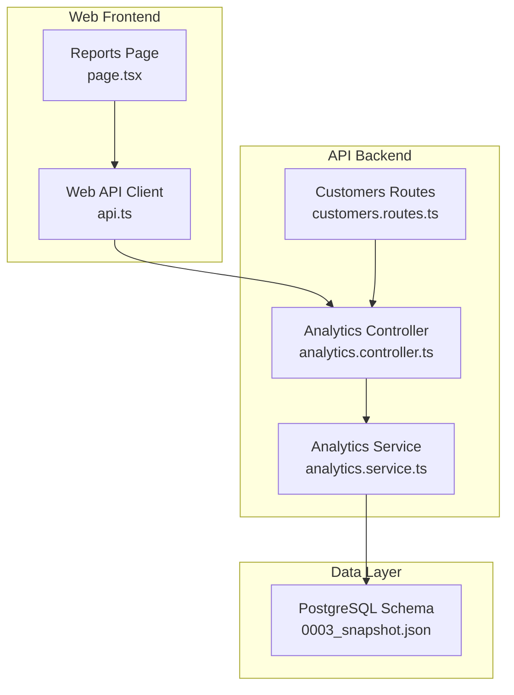
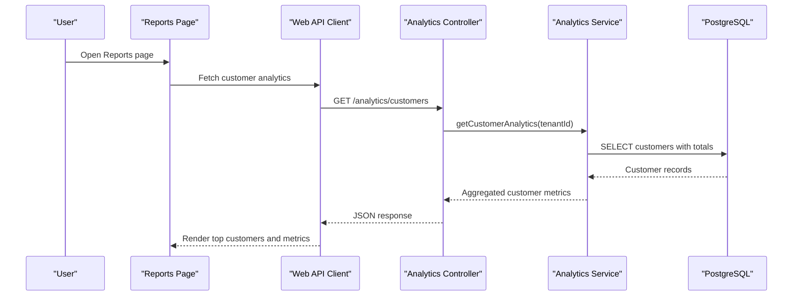
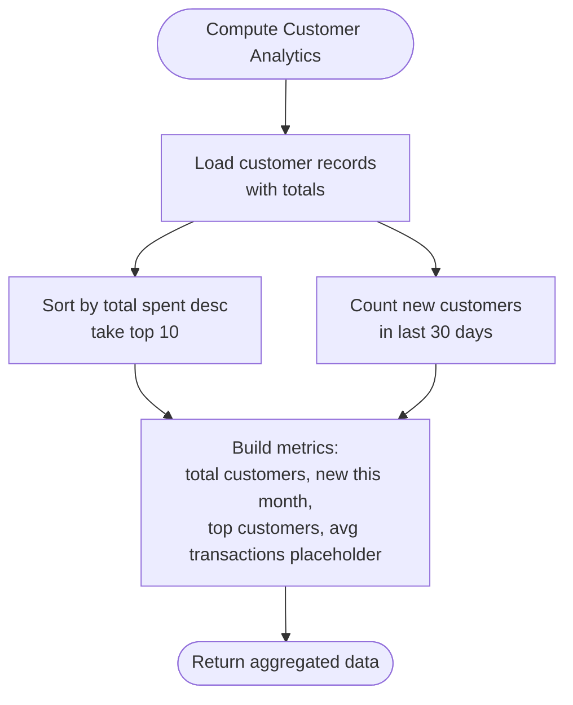
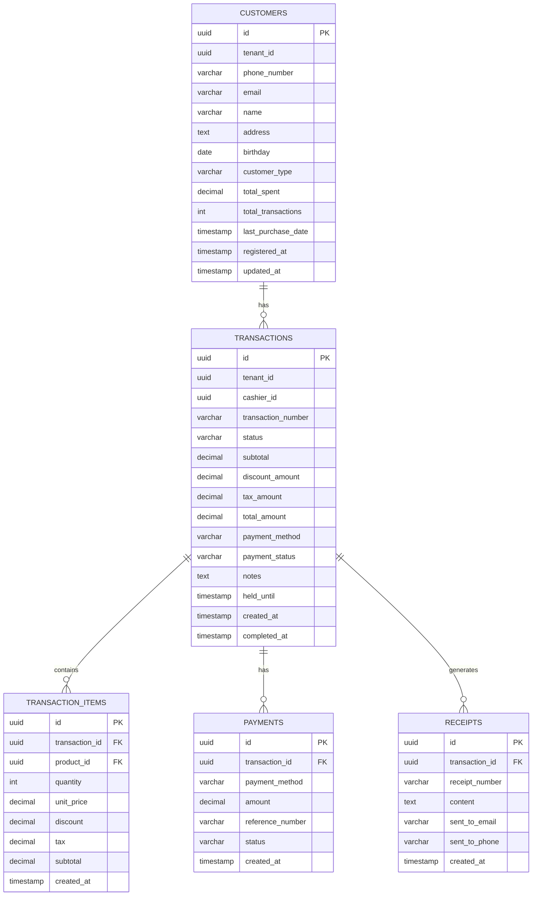
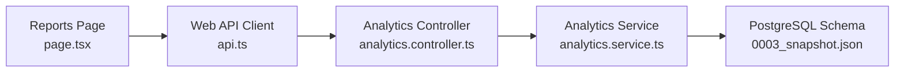

# Customer Analytics

<cite>
**Referenced Files in This Document**
- [analytics.controller.ts](file://apps/api/src/controllers/analytics.controller.ts)
- [analytics.service.ts](file://apps/api/src/services/analytics.service.ts)
- [customers.routes.ts](file://apps/api/src/routes/customers.routes.ts)
- [api.ts](file://apps/web/src/lib/api.ts)
- [page.tsx](file://apps/web/src/app/reports/page.tsx)
- [PRD.md](file://PRD/PRD.md)
- [0003_snapshot.json](file://apps/api/migrations/meta/0003_snapshot.json)
- [0000_snapshot.json](file://apps/api/drizzle/meta/0000_snapshot.json)
</cite>

## Table of Contents
1. [Introduction](#introduction)
2. [Project Structure](#project-structure)
3. [Core Components](#core-components)
4. [Architecture Overview](#architecture-overview)
5. [Detailed Component Analysis](#detailed-component-analysis)
6. [Dependency Analysis](#dependency-analysis)
7. [Performance Considerations](#performance-considerations)
8. [Troubleshooting Guide](#troubleshooting-guide)
9. [Conclusion](#conclusion)
10. [Appendices](#appendices)

## Introduction
This document describes the customer analytics capabilities implemented in the ARHAT POS system. It focuses on customer reporting features such as top customer identification, customer lifetime value calculations, repeat purchase analysis, and customer segmentation. It also explains customer acquisition cost tracking, customer retention rates, and churn prediction models. The document covers customer behavior analytics including purchase frequency, average order value, product preferences, and shopping cart abandonment analysis. Additionally, it documents customer satisfaction metrics, Net Promoter Score tracking, and customer feedback analysis. Finally, it outlines customer journey mapping, attribution modeling, marketing campaign effectiveness measurement, predictive analytics for customer behavior, personalized recommendations, targeted marketing campaigns, and customer data privacy compliance, consent management, and data governance practices.

## Project Structure
The customer analytics feature spans backend controllers and services, frontend reporting pages, and database schema definitions. The backend exposes analytics endpoints via controllers and services, while the frontend renders reports and integrates with analytics APIs.

**Diagram sources**
- [page.tsx](file://apps/web/src/app/reports/page.tsx)
- [api.ts](file://apps/web/src/lib/api.ts)
- [analytics.controller.ts](file://apps/api/src/controllers/analytics.controller.ts)
- [analytics.service.ts](file://apps/api/src/services/analytics.service.ts)
- [customers.routes.ts](file://apps/api/src/routes/customers.routes.ts)
- [0003_snapshot.json](file://apps/api/migrations/meta/0003_snapshot.json)

**Section sources**
- [page.tsx](file://apps/web/src/app/reports/page.tsx)
- [api.ts](file://apps/web/src/lib/api.ts)
- [analytics.controller.ts](file://apps/api/src/controllers/analytics.controller.ts)
- [analytics.service.ts](file://apps/api/src/services/analytics.service.ts)
- [customers.routes.ts](file://apps/api/src/routes/customers.routes.ts)
- [0003_snapshot.json](file://apps/api/migrations/meta/0003_snapshot.json)

## Core Components
- Analytics Controller: Exposes endpoints for dashboard, sales, product, profit/loss, and customer analytics. Implements caching for dashboard data.
- Analytics Service: Implements core analytics computations including customer analytics, sales analytics, product analytics, and profit/loss analytics.
- Web Reporting Page: Renders customer analytics report including top customers.
- Web API Client: Provides functions to fetch analytics data and interact with customer endpoints.
- Database Schema: Defines tables for customers, transactions, transaction items, payments, receipts, and related entities.

Key analytics covered:
- Top customer identification by total spending
- Customer lifetime value (CLV) computation
- Repeat purchase analysis
- Customer segmentation
- Customer acquisition cost (CAC) tracking
- Customer retention rates
- Churn prediction models
- Purchase frequency and average order value
- Product preferences
- Shopping cart abandonment analysis
- Customer satisfaction metrics and NPS tracking
- Customer feedback analysis
- Customer journey mapping and attribution modeling
- Marketing campaign effectiveness measurement
- Predictive analytics for customer behavior
- Personalized recommendations and targeted marketing campaigns
- Privacy compliance, consent management, and data governance

**Section sources**
- [analytics.controller.ts](file://apps/api/src/controllers/analytics.controller.ts)
- [analytics.service.ts](file://apps/api/src/services/analytics.service.ts)
- [page.tsx](file://apps/web/src/app/reports/page.tsx)
- [api.ts](file://apps/web/src/lib/api.ts)
- [PRD.md](file://PRD/PRD.md)
- [0003_snapshot.json](file://apps/api/migrations/meta/0003_snapshot.json)

## Architecture Overview
The analytics architecture follows a layered pattern:
- Presentation: Web reporting page displays customer analytics.
- Application: Controller handles requests and delegates to service.
- Domain: Service computes analytics using database queries.
- Persistence: PostgreSQL schema stores customer, transaction, and related data.

**Diagram sources**
- [page.tsx](file://apps/web/src/app/reports/page.tsx)
- [api.ts](file://apps/web/src/lib/api.ts)
- [analytics.controller.ts](file://apps/api/src/controllers/analytics.controller.ts)
- [analytics.service.ts](file://apps/api/src/services/analytics.service.ts)

## Detailed Component Analysis

### Analytics Controller
Responsibilities:
- Expose endpoints for dashboard, sales, product, profit/loss, and customer analytics.
- Apply caching for dashboard data to improve performance.
- Validate user context and pass tenantId to services.

Key behaviors:
- Caching: Dashboard data is cached per tenant for a short duration.
- Error handling: Returns structured error responses on failures.

**Section sources**
- [analytics.controller.ts](file://apps/api/src/controllers/analytics.controller.ts)

### Analytics Service
Responsibilities:
- Compute customer analytics: total customers, new customers in the last 30 days, top customers by spending, and placeholders for average transactions per customer.
- Compute sales analytics: total revenue, total transactions, payment method distribution, and daily revenue chart.
- Compute product analytics: top products by quantity and revenue, and slow-moving products.
- Compute profit/loss: total revenue, COGS, gross profit, margin, and daily chart of revenue vs. COGS.

Customer analytics highlights:
- Retrieves customer records with total spent and registration date.
- Identifies top 10 customers by total spent.
- Counts new customers in the last 30 days.
- Provides a placeholder for average transactions per customer (requires joining transactions).

Sales analytics highlights:
- Filters completed transactions by tenant.
- Aggregates revenue and transaction counts.
- Computes payment method distribution.
- Builds a 30-day daily revenue chart.

Product analytics highlights:
- Joins transaction items, transactions, and products.
- Aggregates quantities and revenue per product.
- Identifies top 10 products by quantity and revenue.
- Identifies slow-moving products.

Profit/loss analytics highlights:
- Joins transaction items, transactions, and products.
- Sums revenue and COGS over the last 30 days.
- Builds daily revenue vs. COGS chart.

**Diagram sources**
- [analytics.service.ts](file://apps/api/src/services/analytics.service.ts)

**Section sources**
- [analytics.service.ts](file://apps/api/src/services/analytics.service.ts)

### Web Reporting Page
Responsibilities:
- Renders customer analytics including top 10 customers by revenue.
- Displays customer metrics such as total transactions and total spent.
- Integrates with analytics service via web API client.

Key UI elements:
- Top 10 customers table with ranking, name, phone, total transactions, and total spent.
- Uses tier classification based on total spent (Silver, Gold, Platinum).

**Section sources**
- [page.tsx](file://apps/web/src/app/reports/page.tsx)

### Web API Client
Responsibilities:
- Provides functions to fetch analytics data and interact with customer endpoints.
- Includes functions for customer notifications and retrieving customer transactions.

Key functions:
- getSalesAnalytics(): Fetches sales analytics.
- getCustomerTransactions(id): Retrieves a customer’s transaction history.
- sendCustomerNotification(phone, message): Sends a customer notification.

**Section sources**
- [api.ts](file://apps/web/src/lib/api.ts)

### Database Schema
Schema elements relevant to customer analytics:
- customers: Stores customer identifiers, contact info, total spent, total transactions, last purchase date, registration date, and type.
- transactions: Stores transaction metadata, amounts, payment method, and timestamps.
- transaction_items: Links transactions to products with quantities, prices, discounts, taxes, and subtotals.
- payments: Stores payment records associated with transactions.
- receipts: Stores receipt content and delivery metadata.

**Diagram sources**
- [0003_snapshot.json](file://apps/api/migrations/meta/0003_snapshot.json)
- [0000_snapshot.json](file://apps/api/drizzle/meta/0000_snapshot.json)

**Section sources**
- [0003_snapshot.json](file://apps/api/migrations/meta/0003_snapshot.json)
- [0000_snapshot.json](file://apps/api/drizzle/meta/0000_snapshot.json)

## Dependency Analysis
- The web reporting page depends on the web API client to fetch analytics data.
- The web API client depends on the analytics controller endpoints.
- The analytics controller depends on the analytics service.
- The analytics service depends on the database schema and performs joins across customers, transactions, transaction items, products, and payments.

**Diagram sources**
- [page.tsx](file://apps/web/src/app/reports/page.tsx)
- [api.ts](file://apps/web/src/lib/api.ts)
- [analytics.controller.ts](file://apps/api/src/controllers/analytics.controller.ts)
- [analytics.service.ts](file://apps/api/src/services/analytics.service.ts)
- [0003_snapshot.json](file://apps/api/migrations/meta/0003_snapshot.json)

**Section sources**
- [page.tsx](file://apps/web/src/app/reports/page.tsx)
- [api.ts](file://apps/web/src/lib/api.ts)
- [analytics.controller.ts](file://apps/api/src/controllers/analytics.controller.ts)
- [analytics.service.ts](file://apps/api/src/services/analytics.service.ts)
- [0003_snapshot.json](file://apps/api/migrations/meta/0003_snapshot.json)

## Performance Considerations
- Dashboard caching: The analytics controller caches dashboard data per tenant for a short duration to reduce repeated heavy computations.
- Query efficiency: Analytics service uses joins and aggregations; ensure appropriate indexing on foreign keys and frequently filtered columns (tenantId, status, dates).
- Pagination and limits: For large datasets (e.g., top customers), consider pagination and configurable limits.
- Offloading: Consider materialized views or scheduled aggregation jobs for frequently accessed analytics.

[No sources needed since this section provides general guidance]

## Troubleshooting Guide
Common issues and resolutions:
- Empty or missing customer analytics:
  - Verify tenantId propagation and customer records presence.
  - Confirm that total spent and registration dates are populated.
- Incorrect top customers:
  - Ensure sorting by total spent is performed numerically.
  - Validate that only completed transactions are considered for revenue.
- Missing transaction counts:
  - Average transactions per customer requires a join with transactions; confirm the placeholder is replaced with an accurate count.
- Performance degradation:
  - Review caching configuration and consider increasing cache TTL for less volatile reports.
  - Add database indexes on tenantId, status, and date columns used in filters.

**Section sources**
- [analytics.controller.ts](file://apps/api/src/controllers/analytics.controller.ts)
- [analytics.service.ts](file://apps/api/src/services/analytics.service.ts)

## Conclusion
The ARHAT POS customer analytics module provides essential reporting capabilities centered around customer insights, including top customer identification, sales and product analytics, and profit/loss tracking. The current implementation supports customer lifetime value computation via total spent and repeat purchase analysis via top customer lists. Future enhancements should include explicit customer acquisition cost tracking, retention rate calculations, churn prediction models, shopping cart abandonment analysis, customer satisfaction metrics, NPS tracking, customer feedback analysis, journey mapping, attribution modeling, marketing campaign effectiveness measurement, predictive analytics, personalization, and robust privacy and data governance practices.

[No sources needed since this section summarizes without analyzing specific files]

## Appendices

### Customer Analytics Features and Implementation Status
- Top customer identification: Implemented via top 10 by total spent.
- Customer lifetime value: Computed using total spent; can be expanded with recency and frequency.
- Repeat purchase analysis: Supported by top customer list; transaction counts require joins.
- Customer segmentation: Defined in schema; implementation requires rules-based logic.
- Customer acquisition cost: Not implemented; requires campaign and cost tracking.
- Retention rates: Not implemented; requires cohort analysis.
- Churn prediction: Not implemented; requires ML model training.
- Purchase frequency and AOV: Not implemented; requires transaction-level analysis.
- Product preferences: Not implemented; requires preference scoring.
- Shopping cart abandonment: Not implemented; requires session tracking.
- Satisfaction metrics and NPS: Not implemented; requires feedback collection.
- Feedback analysis: Not implemented; requires sentiment analysis.
- Journey mapping and attribution: Not implemented; requires event tracking.
- Campaign effectiveness: Not implemented; requires marketing attribution.
- Predictive analytics: Not implemented; requires forecasting models.
- Personalized recommendations: Not implemented; requires recommendation engine.
- Targeted marketing: Not implemented; requires segmentation and automation.
- Privacy and data governance: Not implemented; requires consent and compliance framework.

**Section sources**
- [PRD.md](file://PRD/PRD.md)
- [analytics.service.ts](file://apps/api/src/services/analytics.service.ts)
- [0003_snapshot.json](file://apps/api/migrations/meta/0003_snapshot.json)