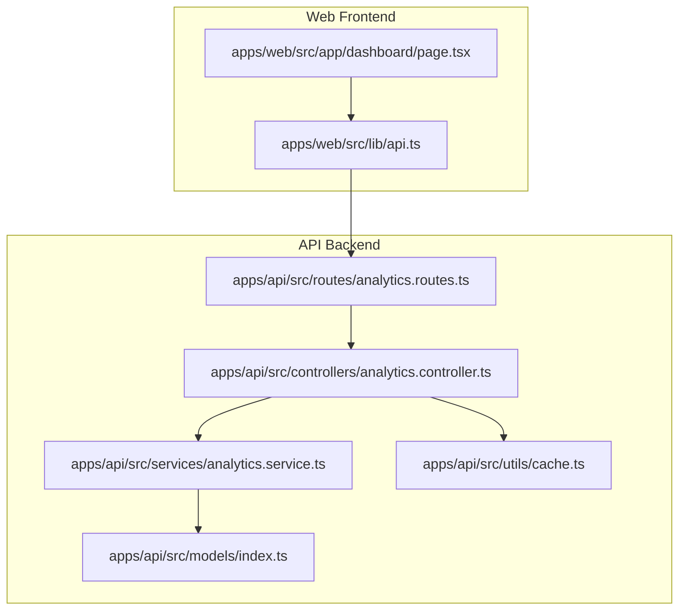
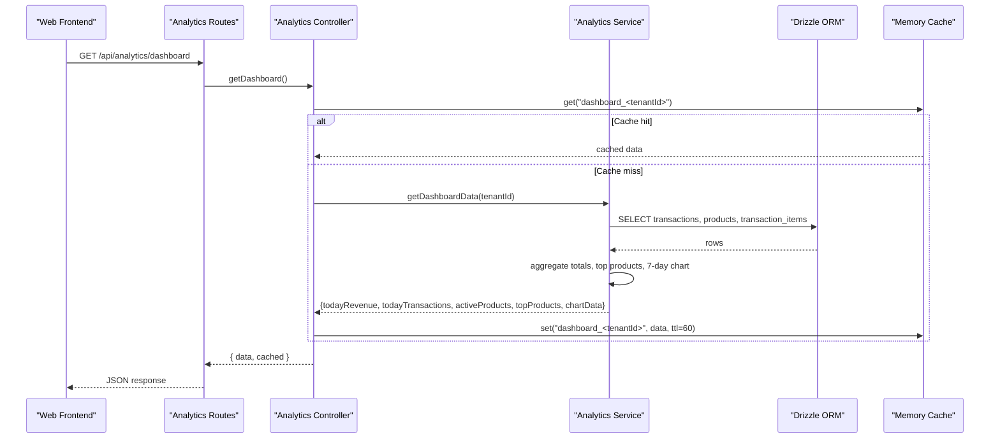
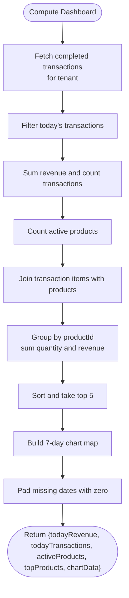
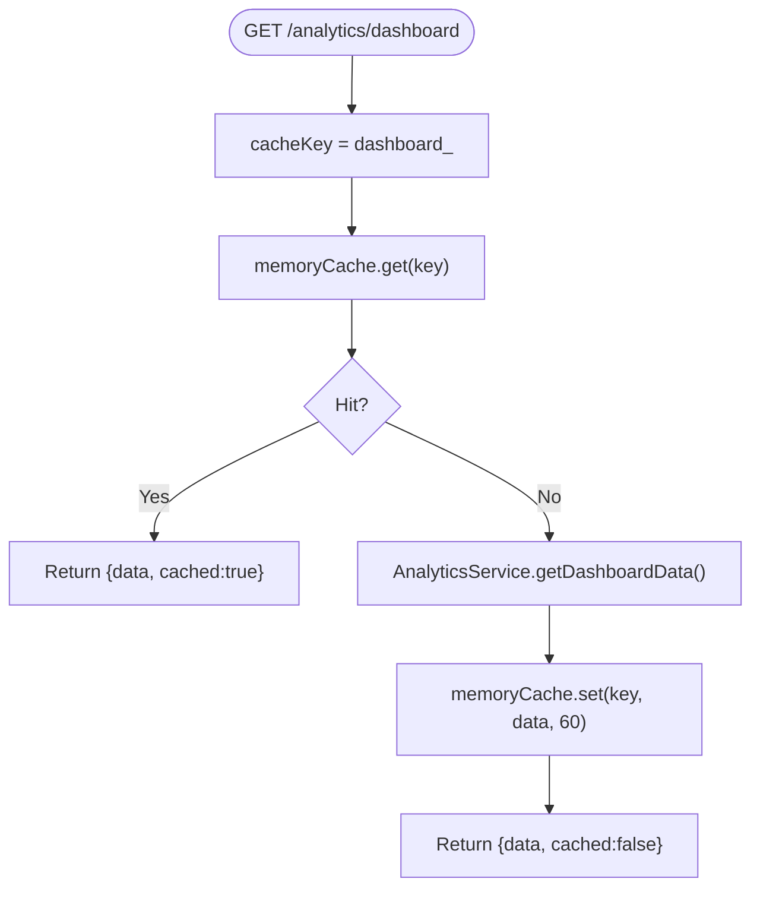
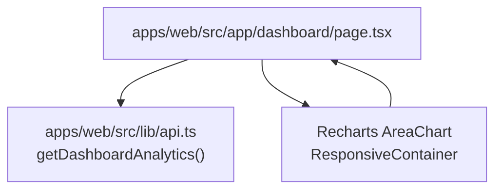
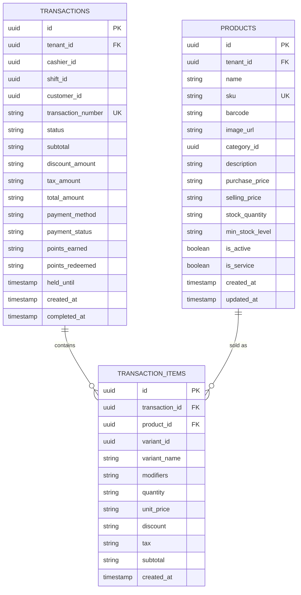
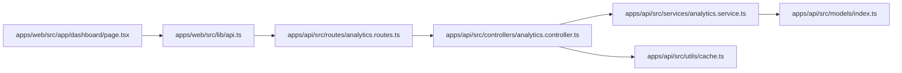

# Dashboard Analytics

<cite>
**Referenced Files in This Document**
- [analytics.controller.ts](file://apps/api/src/controllers/analytics.controller.ts)
- [analytics.routes.ts](file://apps/api/src/routes/analytics.routes.ts)
- [analytics.service.ts](file://apps/api/src/services/analytics.service.ts)
- [cache.ts](file://apps/api/src/utils/cache.ts)
- [page.tsx](file://apps/web/src/app/dashboard/page.tsx)
- [api.ts](file://apps/web/src/lib/api.ts)
- [index.ts](file://apps/api/src/models/index.ts)
</cite>

## Table of Contents
1. [Introduction](#introduction)
2. [Project Structure](#project-structure)
3. [Core Components](#core-components)
4. [Architecture Overview](#architecture-overview)
5. [Detailed Component Analysis](#detailed-component-analysis)
6. [Dependency Analysis](#dependency-analysis)
7. [Performance Considerations](#performance-considerations)
8. [Troubleshooting Guide](#troubleshooting-guide)
9. [Conclusion](#conclusion)
10. [Appendices](#appendices)

## Introduction
This document describes the ARHAT POS dashboard analytics system for KPI monitoring. It covers the main dashboard metrics (daily sales revenue, total transactions count, top products, and 7-day revenue chart), the backend aggregation logic, caching strategy, API endpoints, and the frontend visualization using Recharts. It also outlines configuration options for thresholds and alerts, and provides guidance on performance, refresh intervals, and cache invalidation.

## Project Structure
The dashboard analytics spans two applications:
- Backend API (Hono + Drizzle ORM): exposes analytics endpoints, computes KPIs, and caches results.
- Frontend Web (Next.js): renders the dashboard UI, fetches analytics data, and visualizes with Recharts.

**Diagram sources**
- [page.tsx:1-166](file://apps/web/src/app/dashboard/page.tsx#L1-L166)
- [api.ts:226-236](file://apps/web/src/lib/api.ts#L226-L236)
- [analytics.routes.ts:1-15](file://apps/api/src/routes/analytics.routes.ts#L1-L15)
- [analytics.controller.ts:1-63](file://apps/api/src/controllers/analytics.controller.ts#L1-L63)
- [analytics.service.ts:1-383](file://apps/api/src/services/analytics.service.ts#L1-L383)
- [cache.ts:1-56](file://apps/api/src/utils/cache.ts#L1-L56)
- [index.ts:1-307](file://apps/api/src/models/index.ts#L1-L307)

**Section sources**
- [analytics.routes.ts:1-15](file://apps/api/src/routes/analytics.routes.ts#L1-L15)
- [analytics.controller.ts:1-63](file://apps/api/src/controllers/analytics.controller.ts#L1-L63)
- [analytics.service.ts:1-383](file://apps/api/src/services/analytics.service.ts#L1-L383)
- [cache.ts:1-56](file://apps/api/src/utils/cache.ts#L1-L56)
- [page.tsx:1-166](file://apps/web/src/app/dashboard/page.tsx#L1-L166)
- [api.ts:226-236](file://apps/web/src/lib/api.ts#L226-L236)
- [index.ts:1-307](file://apps/api/src/models/index.ts#L1-L307)

## Core Components
- Dashboard controller: orchestrates analytics retrieval and applies in-memory caching keyed by tenant.
- Analytics service: performs SQL queries via Drizzle ORM, aggregates data in JavaScript, and formats KPIs and charts.
- Memory cache: lightweight in-memory cache with TTL for API optimization.
- Frontend dashboard: fetches dashboard data, renders KPI cards, and displays a 7-day revenue area chart using Recharts.

**Section sources**
- [analytics.controller.ts:5-21](file://apps/api/src/controllers/analytics.controller.ts#L5-L21)
- [analytics.service.ts:6-129](file://apps/api/src/services/analytics.service.ts#L6-L129)
- [cache.ts:9-53](file://apps/api/src/utils/cache.ts#L9-L53)
- [page.tsx:10-165](file://apps/web/src/app/dashboard/page.tsx#L10-L165)
- [api.ts:226-236](file://apps/web/src/lib/api.ts#L226-L236)

## Architecture Overview
The dashboard pipeline:
- Frontend requests analytics/dashboard.
- API route authenticates and delegates to controller.
- Controller checks memory cache; if miss, calls service to compute KPIs.
- Service executes SQL queries, aggregates data, and returns structured results.
- Controller caches the result and returns JSON to the client.
- Frontend renders KPIs and charts.

**Diagram sources**
- [analytics.routes.ts:7-12](file://apps/api/src/routes/analytics.routes.ts#L7-L12)
- [analytics.controller.ts:6-21](file://apps/api/src/controllers/analytics.controller.ts#L6-L21)
- [analytics.service.ts:6-129](file://apps/api/src/services/analytics.service.ts#L6-L129)
- [cache.ts:18-38](file://apps/api/src/utils/cache.ts#L18-L38)
- [api.ts:226-236](file://apps/web/src/lib/api.ts#L226-L236)

## Detailed Component Analysis

### Dashboard Metrics and Aggregation Logic
- Daily sales revenue and transactions count:
  - Filters completed transactions for the current calendar day.
  - Sums total amounts and counts transactions.
- Active products:
  - Counts active products per tenant.
- Top products (best sellers):
  - Joins transaction items with products and transactions to compute total quantity and revenue per product; sorts and slices top 5.
- 7-day revenue chart:
  - Builds a date-keyed map of daily revenue for the last 7 days; ensures all dates are present (including zeros).

**Diagram sources**
- [analytics.service.ts:6-129](file://apps/api/src/services/analytics.service.ts#L6-L129)

**Section sources**
- [analytics.service.ts:6-129](file://apps/api/src/services/analytics.service.ts#L6-L129)

### Real-Time Updates and Caching Strategy
- Real-time behavior:
  - The dashboard endpoint returns a cached flag indicating whether the data came from cache.
  - The frontend currently loads data once on mount and does not poll for updates.
- Caching:
  - In-memory cache keyed by tenant ID with 60-second TTL.
  - Cache key pattern: dashboard_<tenantId>.
  - Cache miss triggers recomputation; cache hit returns immediately.

**Diagram sources**
- [analytics.controller.ts:9-17](file://apps/api/src/controllers/analytics.controller.ts#L9-L17)
- [cache.ts:18-38](file://apps/api/src/utils/cache.ts#L18-L38)

**Section sources**
- [analytics.controller.ts:6-21](file://apps/api/src/controllers/analytics.controller.ts#L6-L21)
- [cache.ts:9-53](file://apps/api/src/utils/cache.ts#L9-L53)

### Dashboard API Endpoints and Response Formats
- Authentication:
  - All analytics routes are protected by an auth middleware.
- Endpoints:
  - GET /api/analytics/dashboard → Returns dashboard summary with cached flag.
  - GET /api/analytics/sales → Returns total revenue, total transactions, payment method breakdown, and 30-day chart.
  - GET /api/analytics/products → Returns top products by quantity and revenue, plus slow-moving products.
  - GET /api/analytics/profit-loss → Returns total revenue, COGS, gross profit, margin, and 30-day profit series.
  - GET /api/analytics/customers → Returns total customers, new this month, top customers, and placeholders for average transactions per customer.
- Response shape (dashboard):
  - data.todayRevenue: number
  - data.todayTransactions: number
  - data.activeProducts: number
  - data.topProducts: array of { id, name, totalQuantity, totalRevenue }
  - data.chartData: array of { name, date, revenue }
  - cached: boolean

**Section sources**
- [analytics.routes.ts:7-12](file://apps/api/src/routes/analytics.routes.ts#L7-L12)
- [analytics.controller.ts:6-61](file://apps/api/src/controllers/analytics.controller.ts#L6-L61)
- [analytics.service.ts:6-129](file://apps/api/src/services/analytics.service.ts#L6-L129)
- [api.ts:226-236](file://apps/web/src/lib/api.ts#L226-L236)

### Frontend Dashboard Implementation
- Data fetching:
  - Uses a dedicated function to call /api/analytics/dashboard and attaches Authorization header.
- Rendering:
  - Displays three KPI cards: Today’s Revenue, Today’s Transactions, Active Products.
  - Renders a 7-day revenue area chart using Recharts with responsive container, tooltips, and gradient fill.
  - Shows top products list with rank, name, quantity sold, and total revenue.
- UX:
  - Skeleton loading during initial fetch.
  - Friendly empty-state messaging when no active products or transactions are present.
  - Error boundary wrapping for robustness.

**Diagram sources**
- [page.tsx:10-165](file://apps/web/src/app/dashboard/page.tsx#L10-L165)
- [api.ts:226-236](file://apps/web/src/lib/api.ts#L226-L236)

**Section sources**
- [page.tsx:10-165](file://apps/web/src/app/dashboard/page.tsx#L10-L165)
- [api.ts:226-236](file://apps/web/src/lib/api.ts#L226-L236)

### Data Model Relationships (for context)
The analytics rely on joins among transactions, transaction_items, and products. The models define foreign keys and indexes supporting these queries.

**Diagram sources**
- [index.ts:119-157](file://apps/api/src/models/index.ts#L119-L157)
- [index.ts:57-74](file://apps/api/src/models/index.ts#L57-L74)

**Section sources**
- [index.ts:57-157](file://apps/api/src/models/index.ts#L57-L157)

## Dependency Analysis
- Controller depends on:
  - AnalyticsService for computation.
  - memoryCache for caching.
- AnalyticsService depends on:
  - Drizzle ORM models and queries.
  - SQL joins across transactions, transaction_items, and products.
- Frontend depends on:
  - api.ts for authenticated fetch.
  - Recharts for visualization.

**Diagram sources**
- [page.tsx:1-166](file://apps/web/src/app/dashboard/page.tsx#L1-L166)
- [api.ts:226-236](file://apps/web/src/lib/api.ts#L226-L236)
- [analytics.routes.ts:1-15](file://apps/api/src/routes/analytics.routes.ts#L1-L15)
- [analytics.controller.ts:1-63](file://apps/api/src/controllers/analytics.controller.ts#L1-L63)
- [analytics.service.ts:1-383](file://apps/api/src/services/analytics.service.ts#L1-L383)
- [cache.ts:1-56](file://apps/api/src/utils/cache.ts#L1-L56)
- [index.ts:1-307](file://apps/api/src/models/index.ts#L1-L307)

**Section sources**
- [analytics.controller.ts:1-63](file://apps/api/src/controllers/analytics.controller.ts#L1-L63)
- [analytics.service.ts:1-383](file://apps/api/src/services/analytics.service.ts#L1-L383)
- [cache.ts:1-56](file://apps/api/src/utils/cache.ts#L1-L56)
- [page.tsx:1-166](file://apps/web/src/app/dashboard/page.tsx#L1-L166)
- [api.ts:226-236](file://apps/web/src/lib/api.ts#L226-L236)
- [index.ts:1-307](file://apps/api/src/models/index.ts#L1-L307)

## Performance Considerations
- Data volume and aggregation:
  - Aggregations are performed in JavaScript after fetching relevant rows. For very large datasets, consider pushing aggregations to SQL to reduce memory and bandwidth.
- Indexes and queries:
  - Ensure createdAt and transactionNumber indexes are leveraged for filtering and sorting.
- Caching:
  - Current TTL is 60 seconds. For read-heavy dashboards, consider shorter intervals and staggered refreshes.
- Frontend rendering:
  - Recharts components are efficient, but large chart arrays can still impact rendering. Consider downsampling or virtualization for long time series.
- Network and offline:
  - The frontend handles session expiration and falls back to cached data where applicable. Integrate periodic refetches and optimistic updates for improved UX.

[No sources needed since this section provides general guidance]

## Troubleshooting Guide
- Session expired:
  - The frontend clears the token cookie and redirects to login when receiving a 401.
- Dashboard shows empty state:
  - The frontend displays a friendly message when activeProducts and todayTransactions are zero.
- Error boundaries:
  - The dashboard page wraps content in an error boundary to prevent crashes and surface errors gracefully.

**Section sources**
- [api.ts:17-27](file://apps/web/src/lib/api.ts#L17-L27)
- [page.tsx:48-68](file://apps/web/src/app/dashboard/page.tsx#L48-L68)

## Conclusion
The dashboard analytics system combines efficient backend aggregation with a lightweight in-memory cache and a clean frontend visualization layer. The current implementation focuses on simplicity and immediate insights, with clear room to scale by optimizing queries, refining cache policies, and enhancing frontend refresh strategies.

[No sources needed since this section summarizes without analyzing specific files]

## Appendices

### Configuration Options and Extensibility
- Metric thresholds and alerts:
  - Not implemented in the current codebase. To add, define threshold constants and integrate alert triggers in the analytics service or a dedicated notifications module.
- Custom KPI definitions:
  - Extend AnalyticsService methods to compute additional metrics and expose new endpoints via analytics.routes.ts and controllers.
- Cache tuning:
  - Adjust TTL values and consider tenant-scoped invalidation when data changes occur (e.g., after transactions complete).

[No sources needed since this section provides general guidance]