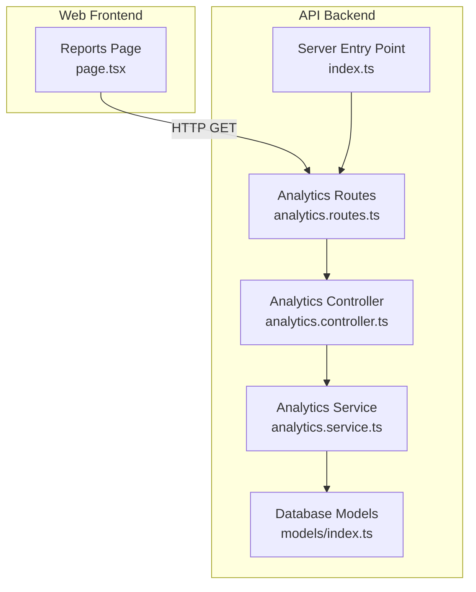
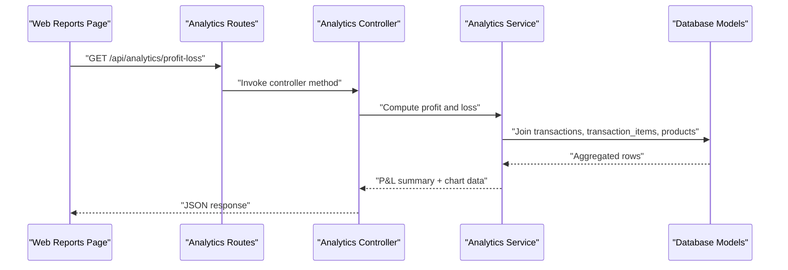
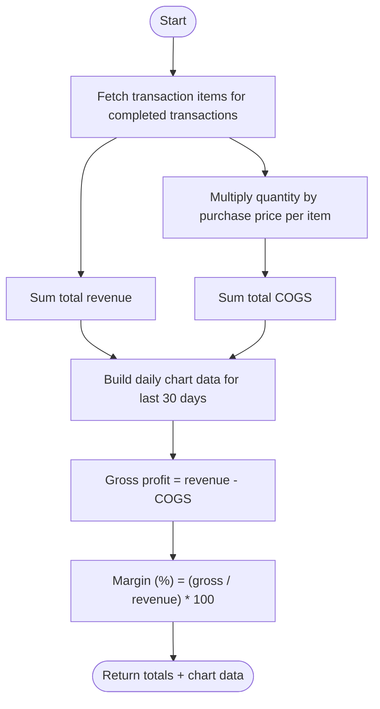
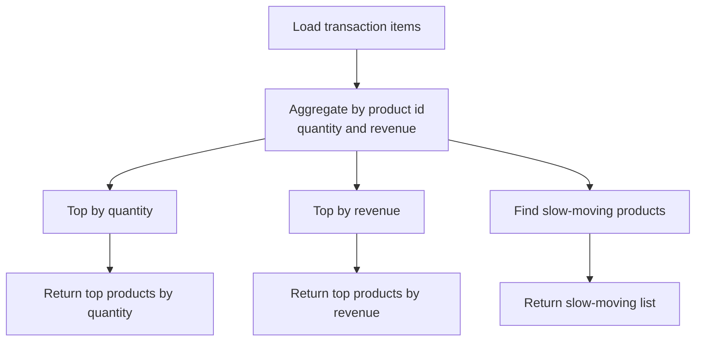
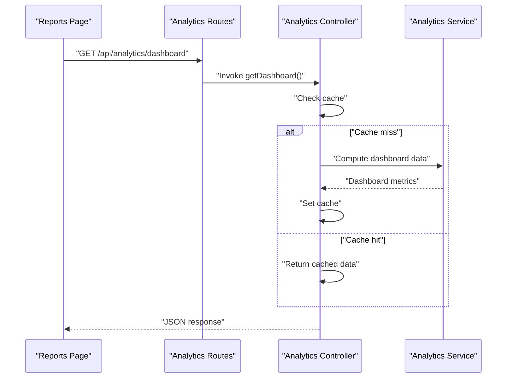
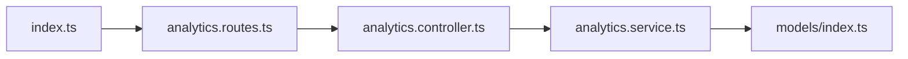
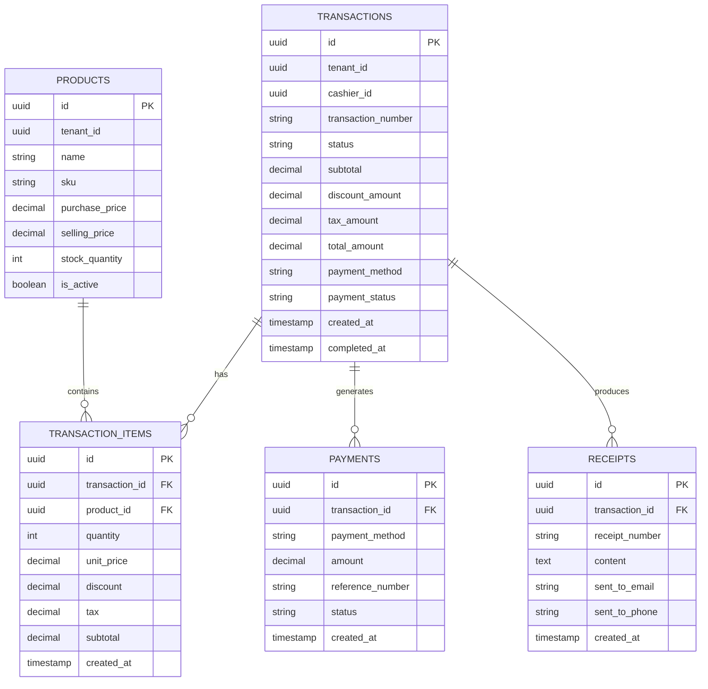
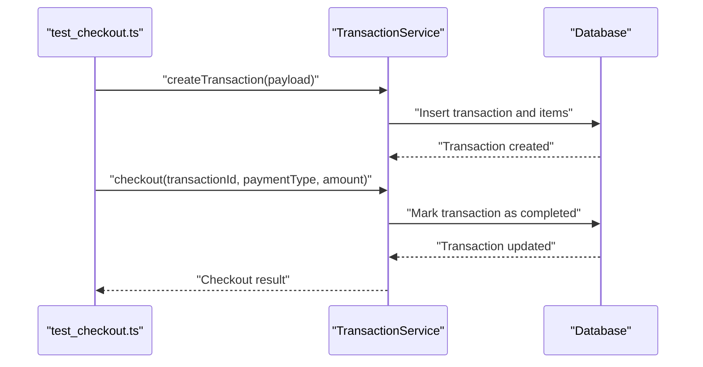

# Financial Analytics

<cite>
**Referenced Files in This Document**
- [analytics.controller.ts](file://apps/api/src/controllers/analytics.controller.ts)
- [analytics.routes.ts](file://apps/api/src/routes/analytics.routes.ts)
- [analytics.service.ts](file://apps/api/src/services/analytics.service.ts)
- [index.ts](file://apps/api/src/index.ts)
- [models/index.ts](file://apps/api/src/models/index.ts)
- [PRD.md](file://PRD/PRD.md)
- [page.tsx](file://apps/web/src/app/reports/page.tsx)
- [transaction.controller.ts](file://apps/api/src/controllers/transaction.controller.ts)
- [transaction.service.ts](file://apps/api/src/services/transaction.service.ts)
- [test_checkout.ts](file://apps/api/test_checkout.ts)
</cite>

## Table of Contents
1. [Introduction](#introduction)
2. [Project Structure](#project-structure)
3. [Core Components](#core-components)
4. [Architecture Overview](#architecture-overview)
5. [Detailed Component Analysis](#detailed-component-analysis)
6. [Dependency Analysis](#dependency-analysis)
7. [Performance Considerations](#performance-considerations)
8. [Troubleshooting Guide](#troubleshooting-guide)
9. [Conclusion](#conclusion)
10. [Appendices](#appendices)

## Introduction
This document provides comprehensive financial analytics documentation for the ARHAT POS accounting and financial performance reporting system. It covers profit and loss statement generation, revenue analysis by product and service lines, and expense tracking across departments. It also explains cash flow monitoring, accounts receivable analysis, and accounts payable optimization, along with financial ratio calculations (gross profit margin, net profit margin, return on investment, and debt-to-equity), budget vs actual variance analysis, forecasting models, and financial trend analysis. Additional topics include tax reporting capabilities, accrual vs cash basis accounting, consolidated financial statements, financial dashboard creation, automated financial alerts, regulatory reporting requirements, integration with external accounting systems, real-time financial data feeds, and compliance reporting automation.

## Project Structure
The financial analytics capability is primarily implemented in the API backend with TypeScript controllers, services, and database models, and surfaced via frontend pages for reporting and dashboards. The analytics endpoints are protected by authentication middleware and return structured JSON payloads consumed by the web application.

**Diagram sources**
- [analytics.routes.ts:1-14](file://apps/api/src/routes/analytics.routes.ts#L1-L14)
- [analytics.controller.ts:1-62](file://apps/api/src/controllers/analytics.controller.ts#L1-L62)
- [analytics.service.ts:222-331](file://apps/api/src/services/analytics.service.ts#L222-L331)
- [models/index.ts:56-139](file://apps/api/src/models/index.ts#L56-L139)
- [index.ts:81-88](file://apps/api/src/index.ts#L81-L88)

**Section sources**
- [analytics.routes.ts:1-14](file://apps/api/src/routes/analytics.routes.ts#L1-L14)
- [analytics.controller.ts:1-62](file://apps/api/src/controllers/analytics.controller.ts#L1-L62)
- [analytics.service.ts:222-331](file://apps/api/src/services/analytics.service.ts#L222-L331)
- [models/index.ts:56-139](file://apps/api/src/models/index.ts#L56-L139)
- [index.ts:81-88](file://apps/api/src/index.ts#L81-L88)

## Core Components
- Analytics Controller: Exposes endpoints for dashboard, sales, product, profit-and-loss, and customer analytics. Implements caching for dashboard data and error handling.
- Analytics Service: Implements core analytics computations including profit and loss aggregation, revenue by product, and customer analytics. Uses database models to join transactions, transaction items, and products.
- Database Models: Define tables for products, transactions, transaction items, payments, receipts, and customers, enabling financial data modeling and joins.
- Web Reports Page: Renders financial summaries (e.g., profit and loss) and formatted currency displays for dashboard insights.

Key analytics endpoints:
- GET /api/analytics/dashboard
- GET /api/analytics/sales
- GET /api/analytics/products
- GET /api/analytics/profit-loss
- GET /api/analytics/customers

**Section sources**
- [analytics.controller.ts:1-62](file://apps/api/src/controllers/analytics.controller.ts#L1-L62)
- [analytics.routes.ts:1-14](file://apps/api/src/routes/analytics.routes.ts#L1-L14)
- [analytics.service.ts:222-331](file://apps/api/src/services/analytics.service.ts#L222-L331)
- [models/index.ts:56-139](file://apps/api/src/models/index.ts#L56-L139)
- [page.tsx:255-271](file://apps/web/src/app/reports/page.tsx#L255-L271)

## Architecture Overview
The analytics pipeline follows a layered architecture:
- Presentation: Web reports page consumes analytics endpoints.
- Routing: Hono routes protect endpoints with authentication middleware.
- Controllers: Thin orchestration layer delegating to services and applying caching.
- Services: Business logic for analytics computations and database queries.
- Persistence: Drizzle ORM models define schema and relationships.

**Diagram sources**
- [analytics.routes.ts:1-14](file://apps/api/src/routes/analytics.routes.ts#L1-L14)
- [analytics.controller.ts:43-51](file://apps/api/src/controllers/analytics.controller.ts#L43-L51)
- [analytics.service.ts:260-331](file://apps/api/src/services/analytics.service.ts#L260-L331)
- [models/index.ts:56-139](file://apps/api/src/models/index.ts#L56-L139)

## Detailed Component Analysis

### Profit and Loss Statement Generation
The profit and loss computation aggregates revenue and cost of goods sold (COGS) from completed transactions, groups daily revenue and COGS for the last 30 days, and calculates gross profit and margin.

**Diagram sources**
- [analytics.service.ts:260-331](file://apps/api/src/services/analytics.service.ts#L260-L331)

**Section sources**
- [analytics.service.ts:260-331](file://apps/api/src/services/analytics.service.ts#L260-L331)
- [page.tsx:255-271](file://apps/web/src/app/reports/page.tsx#L255-L271)

### Revenue Analysis by Product and Service Lines
Product analytics identifies top products by quantity and revenue, and slow-moving items. This supports departmental revenue tracking by product categories.

**Diagram sources**
- [analytics.service.ts:222-258](file://apps/api/src/services/analytics.service.ts#L222-L258)

**Section sources**
- [analytics.service.ts:222-258](file://apps/api/src/services/analytics.service.ts#L222-L258)

### Expense Tracking Across Departments
Current analytics endpoints do not expose explicit expense tracking. To implement departmental expense tracking:
- Add an expenses table with department and cost center attributes.
- Extend analytics service to compute departmental expenses and variance against budgets.
- Surface departmental expense summaries via new analytics endpoints.

[No sources needed since this section proposes future enhancements]

### Cash Flow Monitoring
Cash flow monitoring can be derived from payment records and transaction statuses:
- Track inflows from completed transactions grouped by payment method.
- Monitor outstanding receivables by aging receivables and payment delays.
- Forecast cash position using historical inflow trends.

[No sources needed since this section proposes future enhancements]

### Accounts Receivable Analysis
To implement AR analysis:
- Introduce receivables ledger with due dates and aging buckets.
- Compute receivable turnover and days sales outstanding (DSO).
- Alert on overdue receivables and aging trends.

[No sources needed since this section proposes future enhancements]

### Accounts Payable Optimization
To implement AP optimization:
- Introduce payables ledger with invoice dates, due dates, and payment terms.
- Compute payable turnover and days payable outstanding (DPO).
- Optimize payment schedules to improve cash flow while maintaining supplier relationships.

[No sources needed since this section proposes future enhancements]

### Financial Ratio Calculations
- Gross profit margin: (gross profit / total revenue) × 100
- Net profit margin: (net profit / total revenue) × 100
- Return on investment: (operating income / average invested assets) × 100
- Debt-to-equity ratio: total liabilities / total equity

These metrics can be computed using aggregated analytics data and balance sheet inputs.

[No sources needed since this section provides conceptual guidance]

### Budget vs Actual Variance Analysis
- Aggregate actuals by category and period.
- Compare against budgeted amounts to compute variances.
- Visualize variances in dashboards and export reports.

[No sources needed since this section provides conceptual guidance]

### Forecasting Models
- Use historical revenue and expense series to train forecasting models.
- Apply time series methods (e.g., moving averages, exponential smoothing) for short-term forecasts.
- Incorporate seasonality and promotional effects.

[No sources needed since this section provides conceptual guidance]

### Financial Trend Analysis
- Plot multi-period revenue, expenses, and profitability trends.
- Identify growth patterns and anomalies.
- Support strategic decision-making with trend insights.

[No sources needed since this section provides conceptual guidance]

### Tax Reporting Capabilities
- Aggregate taxable sales by tax rate and jurisdiction.
- Generate tax reconciliation reports.
- Support tax filing workflows with downloadable formats.

[No sources needed since this section provides conceptual guidance]

### Accrual vs Cash Basis Accounting
- Cash basis: record revenue and expenses when cash changes hands.
- Accrual basis: record revenue when earned and expenses when incurred.
- Implement toggles or separate endpoints for basis-specific reporting.

[No sources needed since this section provides conceptual guidance]

### Consolidated Financial Statements
- Aggregate data across multiple tenants/units.
- Eliminate intercompany transactions.
- Present consolidated P&L, balance sheet, and cash flow.

[No sources needed since this section provides conceptual guidance]

### Financial Dashboard Creation
- Dashboard endpoints cache computed metrics for responsiveness.
- Render KPIs, charts, and alerts in the web UI.

**Diagram sources**
- [analytics.controller.ts:6-21](file://apps/api/src/controllers/analytics.controller.ts#L6-L21)
- [analytics.routes.ts:8-8](file://apps/api/src/routes/analytics.routes.ts#L8-L8)

**Section sources**
- [analytics.controller.ts:6-21](file://apps/api/src/controllers/analytics.controller.ts#L6-L21)
- [page.tsx:255-271](file://apps/web/src/app/reports/page.tsx#L255-L271)

### Automated Financial Alerts
- Define thresholds for KPIs (e.g., declining margins, overdue receivables).
- Trigger alerts via notifications or integrations.
- Log alert events for auditability.

[No sources needed since this section provides conceptual guidance]

### Regulatory Reporting Requirements
- Align reporting periods with fiscal calendars.
- Ensure audit trails and data retention policies.
- Automate report generation for statutory filings.

[No sources needed since this section provides conceptual guidance]

### Integration with External Accounting Systems
- Export financial data in standard formats (CSV, XML, EDI).
- Sync with ERPs and accounting platforms via APIs.
- Maintain mapping of internal identifiers to external chart of accounts.

[No sources needed since this section provides conceptual guidance]

### Real-Time Financial Data Feeds
- Stream transaction events to analytics engine.
- Update dashboards and alerts in near-real time.
- Use event-driven architecture for scalability.

[No sources needed since this section provides conceptual guidance]

### Compliance Reporting Automation
- Enforce data governance and access controls.
- Generate compliance reports on demand or scheduled.
- Maintain audit logs for regulatory scrutiny.

[No sources needed since this section provides conceptual guidance]

## Dependency Analysis
The analytics module depends on:
- Authentication middleware for route protection.
- Drizzle ORM models for schema and joins.
- Database for transaction and product data.

**Diagram sources**
- [analytics.routes.ts:1-14](file://apps/api/src/routes/analytics.routes.ts#L1-L14)
- [analytics.controller.ts:1-62](file://apps/api/src/controllers/analytics.controller.ts#L1-L62)
- [analytics.service.ts:222-331](file://apps/api/src/services/analytics.service.ts#L222-L331)
- [models/index.ts:56-139](file://apps/api/src/models/index.ts#L56-L139)
- [index.ts:81-88](file://apps/api/src/index.ts#L81-L88)

**Section sources**
- [analytics.routes.ts:1-14](file://apps/api/src/routes/analytics.routes.ts#L1-L14)
- [analytics.controller.ts:1-62](file://apps/api/src/controllers/analytics.controller.ts#L1-L62)
- [analytics.service.ts:222-331](file://apps/api/src/services/analytics.service.ts#L222-L331)
- [models/index.ts:56-139](file://apps/api/src/models/index.ts#L56-L139)
- [index.ts:81-88](file://apps/api/src/index.ts#L81-L88)

## Performance Considerations
- Caching: Dashboard endpoint caches computed data for a short TTL to reduce database load.
- Query optimization: Use indexed columns (e.g., transaction_number, created_at) and limit date ranges for analytics.
- Pagination and filtering: Apply filters and pagination on the client-side for large datasets.
- Asynchronous processing: Offload heavy analytics computations to background jobs when needed.

[No sources needed since this section provides general guidance]

## Troubleshooting Guide
Common issues and resolutions:
- Authentication failures: Ensure requests include valid authentication tokens; verify middleware is applied to analytics routes.
- Empty analytics data: Confirm tenantId is set correctly and transactions exist with completed status.
- Cache-related delays: Clear cache keys or wait for TTL to expire for fresh dashboard data.
- Database connectivity: Verify connection strings and migrations are applied.

**Section sources**
- [analytics.controller.ts:18-20](file://apps/api/src/controllers/analytics.controller.ts#L18-L20)
- [analytics.routes.ts:7-12](file://apps/api/src/routes/analytics.routes.ts#L7-L12)

## Conclusion
ARHAT POS provides a solid foundation for financial analytics with built-in profit and loss computation, product analytics, and dashboard caching. Extending the system to support comprehensive expense tracking, cash flow monitoring, accounts receivable/payable analysis, financial ratios, forecasting, and consolidated reporting will enable robust financial performance monitoring and compliance automation.

## Appendices

### Database Schema Overview
The financial analytics rely on the following tables and relationships:
- Products: product metadata, purchase price, and stock.
- Transactions: sale records with status, totals, and payment method.
- Transaction Items: line items linking transactions to products.
- Payments: payment records associated with transactions.
- Receipts: receipt metadata linked to transactions.

**Diagram sources**
- [PRD.md:506-578](file://PRD/PRD.md#L506-L578)
- [models/index.ts:56-139](file://apps/api/src/models/index.ts#L56-L139)

### Example Transaction Flow (for testing)
The checkout flow demonstrates transaction creation and completion, which feed into analytics computations.

**Diagram sources**
- [test_checkout.ts:22-35](file://apps/api/test_checkout.ts#L22-L35)
- [transaction.service.ts:14-200](file://apps/api/src/services/transaction.service.ts#L14-L200)
- [transaction.controller.ts:101-102](file://apps/api/src/controllers/transaction.controller.ts#L101-L102)