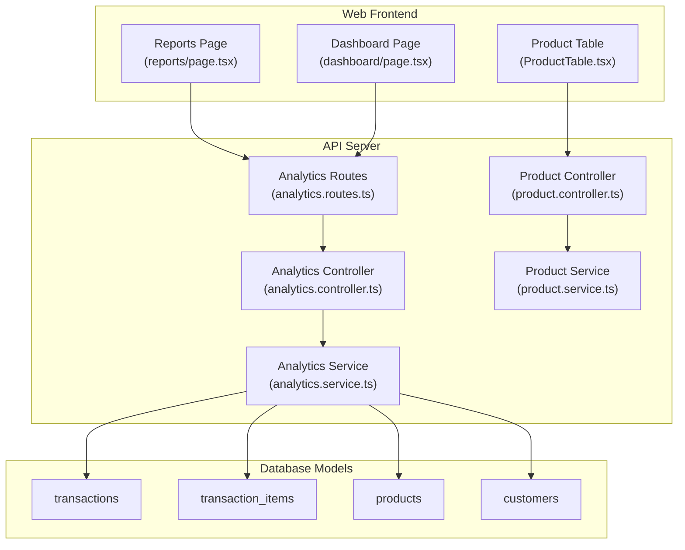
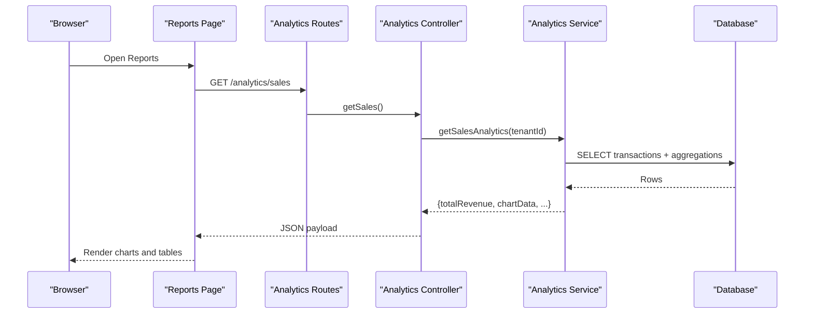
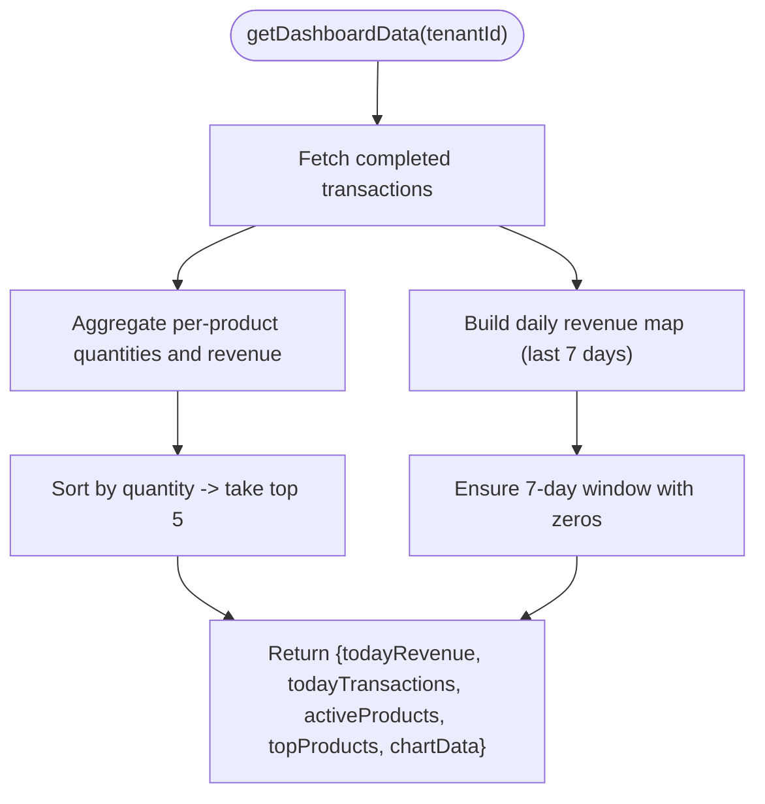
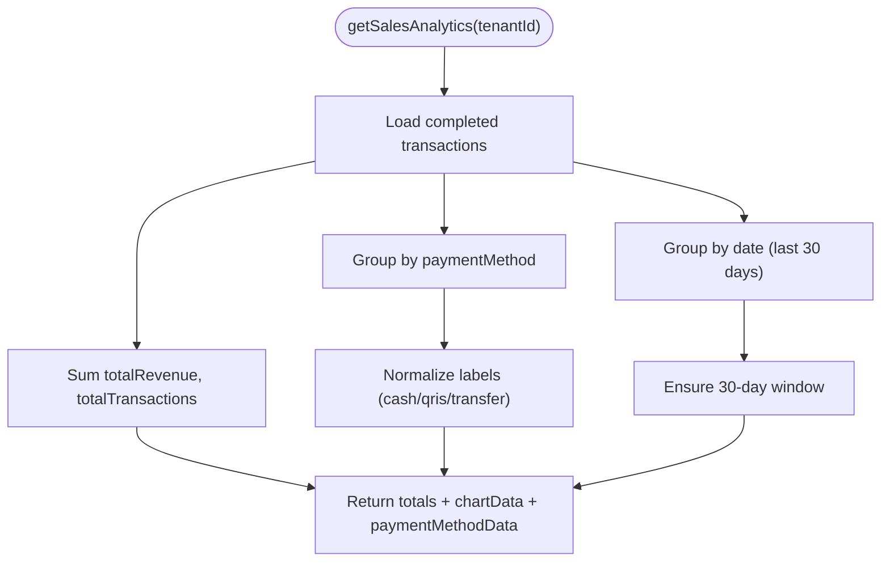
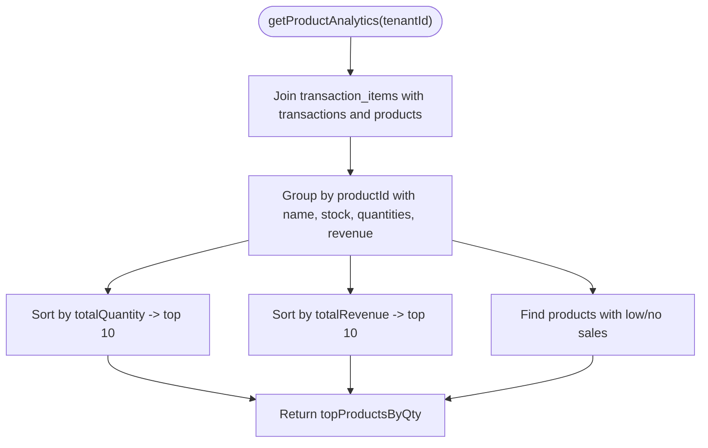
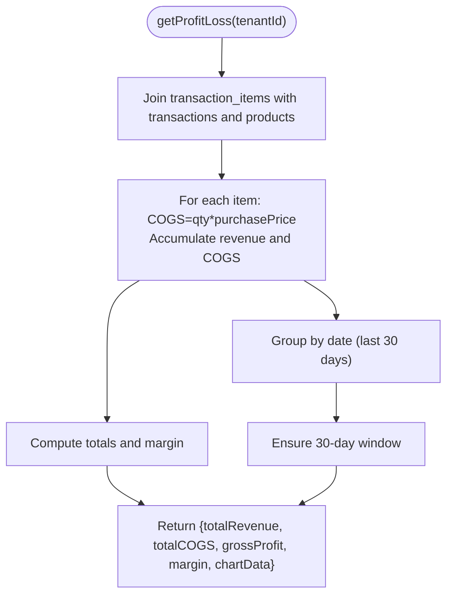
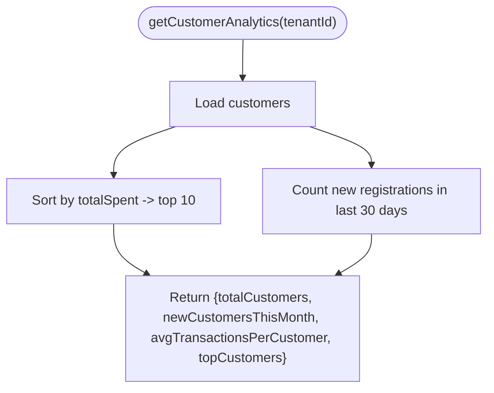
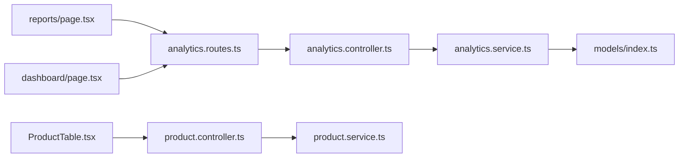

# Product Analytics

<cite>
**Referenced Files in This Document**
- [analytics.controller.ts](file://apps/api/src/controllers/analytics.controller.ts)
- [analytics.service.ts](file://apps/api/src/services/analytics.service.ts)
- [analytics.routes.ts](file://apps/api/src/routes/analytics.routes.ts)
- [index.ts](file://apps/api/src/index.ts)
- [models/index.ts](file://apps/api/src/models/index.ts)
- [reports/page.tsx](file://apps/web/src/app/reports/page.tsx)
- [dashboard/page.tsx](file://apps/web/src/app/dashboard/page.tsx)
- [product.controller.ts](file://apps/api/src/controllers/product.controller.ts)
- [product.service.ts](file://apps/api/src/services/product.service.ts)
- [ProductTable.tsx](file://apps/web/src/components/products/ProductTable.tsx)
- [PRD.md](file://PRD/PRD.md)
</cite>

## Table of Contents
1. [Introduction](#introduction)
2. [Project Structure](#project-structure)
3. [Core Components](#core-components)
4. [Architecture Overview](#architecture-overview)
5. [Detailed Component Analysis](#detailed-component-analysis)
6. [Dependency Analysis](#dependency-analysis)
7. [Performance Considerations](#performance-considerations)
8. [Troubleshooting Guide](#troubleshooting-guide)
9. [Conclusion](#conclusion)
10. [Appendices](#appendices)

## Introduction
This document explains the product analytics capabilities in ARHAT POS, focusing on inventory and product performance analysis. It covers best-selling products, slow-moving inventory, product category performance, stock turnover, profitability and margins, COGS calculations, customer analytics, and the reporting dashboards. It also outlines inventory monitoring features present in the system and highlights areas where advanced analytics (e.g., forecasting, markdown optimization, product lifecycle and seasonality) are not currently implemented.

## Project Structure
The analytics feature spans backend API services and controllers, database models, and frontend reporting pages:
- Backend routes expose analytics endpoints protected by authentication.
- Controllers delegate requests to services that query the database and compute aggregates.
- Frontend dashboards consume analytics endpoints and render charts and summaries.

**Diagram sources**
- [analytics.routes.ts:1-15](file://apps/api/src/routes/analytics.routes.ts#L1-L15)
- [analytics.controller.ts:1-63](file://apps/api/src/controllers/analytics.controller.ts#L1-L63)
- [analytics.service.ts:1-383](file://apps/api/src/services/analytics.service.ts#L1-L383)
- [product.controller.ts:1-73](file://apps/api/src/controllers/product.controller.ts#L1-L73)
- [product.service.ts:1-139](file://apps/api/src/services/product.service.ts#L1-L139)
- [models/index.ts:119-157](file://apps/api/src/models/index.ts#L119-L157)
- [reports/page.tsx:1-416](file://apps/web/src/app/reports/page.tsx#L1-L416)
- [dashboard/page.tsx:1-165](file://apps/web/src/app/dashboard/page.tsx#L1-L165)
- [ProductTable.tsx:1-118](file://apps/web/src/components/products/ProductTable.tsx#L1-L118)

**Section sources**
- [analytics.routes.ts:1-15](file://apps/api/src/routes/analytics.routes.ts#L1-L15)
- [analytics.controller.ts:1-63](file://apps/api/src/controllers/analytics.controller.ts#L1-L63)
- [analytics.service.ts:1-383](file://apps/api/src/services/analytics.service.ts#L1-L383)
- [models/index.ts:119-157](file://apps/api/src/models/index.ts#L119-L157)
- [reports/page.tsx:1-416](file://apps/web/src/app/reports/page.tsx#L1-L416)
- [dashboard/page.tsx:1-165](file://apps/web/src/app/dashboard/page.tsx#L1-L165)
- [ProductTable.tsx:1-118](file://apps/web/src/components/products/ProductTable.tsx#L1-L118)

## Core Components
- Analytics endpoints:
  - Dashboard summary (today’s revenue, transactions, active products, top products, 7-day sales chart).
  - Sales analytics (30-day revenue, daily chart, payment method distribution).
  - Product analytics (top products by quantity and revenue, slow-moving inventory).
  - Profit and loss (revenue, COGS, gross profit, margin, 30-day profit chart).
  - Customer analytics (total customers, new this month, top customers).
- Data sources:
  - Transactions, transaction items, products, and customers tables.
- Frontend dashboards:
  - Reports page with tabs for summary, sales, P&L, product performance, and customers.
  - Dashboard page showing live summary and top products.
  - Product table for SKU-level product listing and status.

**Section sources**
- [analytics.controller.ts:5-62](file://apps/api/src/controllers/analytics.controller.ts#L5-L62)
- [analytics.service.ts:6-129](file://apps/api/src/services/analytics.service.ts#L6-L129)
- [analytics.service.ts:131-200](file://apps/api/src/services/analytics.service.ts#L131-L200)
- [analytics.service.ts:202-258](file://apps/api/src/services/analytics.service.ts#L202-L258)
- [analytics.service.ts:260-331](file://apps/api/src/services/analytics.service.ts#L260-L331)
- [analytics.service.ts:333-381](file://apps/api/src/services/analytics.service.ts#L333-L381)
- [reports/page.tsx:15-416](file://apps/web/src/app/reports/page.tsx#L15-L416)
- [dashboard/page.tsx:10-165](file://apps/web/src/app/dashboard/page.tsx#L10-L165)
- [ProductTable.tsx:11-118](file://apps/web/src/components/products/ProductTable.tsx#L11-L118)

## Architecture Overview
The analytics pipeline follows a clean separation of concerns:
- Routes define endpoint contracts and apply authentication.
- Controllers orchestrate request handling and caching.
- Services encapsulate data access and computation logic.
- Models define the schema for transactions, products, and customers.
- Frontend pages fetch analytics data and render visualizations.

**Diagram sources**
- [analytics.routes.ts:8-12](file://apps/api/src/routes/analytics.routes.ts#L8-L12)
- [analytics.controller.ts:23-31](file://apps/api/src/controllers/analytics.controller.ts#L23-L31)
- [analytics.service.ts:131-200](file://apps/api/src/services/analytics.service.ts#L131-L200)

**Section sources**
- [analytics.routes.ts:1-15](file://apps/api/src/routes/analytics.routes.ts#L1-L15)
- [analytics.controller.ts:1-63](file://apps/api/src/controllers/analytics.controller.ts#L1-L63)
- [analytics.service.ts:1-383](file://apps/api/src/services/analytics.service.ts#L1-L383)

## Detailed Component Analysis

### Dashboard Analytics
- Computes today’s revenue and transaction counts, active product count, top 5 best-selling products by quantity, and a 7-day sales chart.
- Uses in-app caching keyed by tenant to reduce repeated heavy queries.

**Diagram sources**
- [analytics.service.ts:6-129](file://apps/api/src/services/analytics.service.ts#L6-L129)

**Section sources**
- [analytics.controller.ts:6-21](file://apps/api/src/controllers/analytics.controller.ts#L6-L21)
- [analytics.service.ts:6-129](file://apps/api/src/services/analytics.service.ts#L6-L129)
- [dashboard/page.tsx:10-165](file://apps/web/src/app/dashboard/page.tsx#L10-L165)

### Sales Analytics
- Aggregates total revenue and transaction counts over the last 30 days.
- Builds payment method breakdown and daily revenue series for charting.

**Diagram sources**
- [analytics.service.ts:131-200](file://apps/api/src/services/analytics.service.ts#L131-L200)

**Section sources**
- [analytics.controller.ts:23-31](file://apps/api/src/controllers/analytics.controller.ts#L23-L31)
- [analytics.service.ts:131-200](file://apps/api/src/services/analytics.service.ts#L131-L200)
- [reports/page.tsx:208-253](file://apps/web/src/app/reports/page.tsx#L208-L253)

### Product Analytics
- Identifies top products by units sold and revenue.
- Flags slow-moving inventory as products with minimal or zero sales over the selected period.

**Diagram sources**
- [analytics.service.ts:202-258](file://apps/api/src/services/analytics.service.ts#L202-L258)

**Section sources**
- [analytics.controller.ts:33-41](file://apps/api/src/controllers/analytics.controller.ts#L33-L41)
- [analytics.service.ts:202-258](file://apps/api/src/services/analytics.service.ts#L202-L258)
- [reports/page.tsx:292-347](file://apps/web/src/app/reports/page.tsx#L292-L347)

### Profit and Loss Analytics
- Calculates total revenue and COGS (quantity × purchase price) from transaction items.
- Produces a 30-day chart of revenue and profit (revenue − COGS) and computes margin percentage.

**Diagram sources**
- [analytics.service.ts:260-331](file://apps/api/src/services/analytics.service.ts#L260-L331)

**Section sources**
- [analytics.controller.ts:43-51](file://apps/api/src/controllers/analytics.controller.ts#L43-L51)
- [analytics.service.ts:260-331](file://apps/api/src/services/analytics.service.ts#L260-L331)
- [reports/page.tsx:255-290](file://apps/web/src/app/reports/page.tsx#L255-L290)

### Customer Analytics
- Retrieves customer records, computes top customers by spending, counts new customers in the last 30 days, and prepares placeholders for average transactions per customer.

**Diagram sources**
- [analytics.service.ts:333-381](file://apps/api/src/services/analytics.service.ts#L333-L381)

**Section sources**
- [analytics.controller.ts:53-61](file://apps/api/src/controllers/analytics.controller.ts#L53-L61)
- [analytics.service.ts:333-381](file://apps/api/src/services/analytics.service.ts#L333-L381)
- [reports/page.tsx:349-408](file://apps/web/src/app/reports/page.tsx#L349-L408)

### Product Lifecycle and Seasonality
- Not implemented in the current codebase. The existing analytics service does not compute seasonal trends, adoption curves, or turnover ratios. These would require:
  - Monthly/quarterly aggregation windows.
  - Category-level rollups.
  - Additional fields such as product launch dates and historical sales volumes.

[No sources needed since this section analyzes absence of features]

### Demand Forecasting and Markdown Optimization
- Not implemented. The system lacks predictive models or pricing recommendation engines. Future enhancements could leverage time-series features (e.g., 30-day sales) to build simple forecasting baselines and markdown suggestion rules.

[No sources needed since this section analyzes absence of features]

### Product Recommendation Algorithms
- Not implemented. No collaborative filtering or association rule mining is present. Recommendation could be built on co-purchase patterns from transaction items.

[No sources needed since this section analyzes absence of features]

### Product Mix Analysis and Cross-Selling
- The analytics service does not compute product affinity or basket analysis. Cross-selling opportunities would require association analysis across transaction items.

[No sources needed since this section analyzes absence of features]

### Product Bundling Recommendations
- Not implemented. No logic exists to suggest bundles based on co-occurrence or demand patterns.

[No sources needed since this section analyzes absence of features]

### SKU-Level Reporting
- The product table displays SKU, name, category, price, stock, and status. SKU-level analytics (e.g., per-SKU turnover) are not computed in the current analytics service.

**Section sources**
- [ProductTable.tsx:11-118](file://apps/web/src/components/products/ProductTable.tsx#L11-L118)
- [analytics.service.ts:202-258](file://apps/api/src/services/analytics.service.ts#L202-L258)

### Supplier Performance Metrics
- Not implemented. Supplier metrics would require supplier entities, purchase orders, and delivery performance tracking, none of which are present in the current models.

[No sources needed since this section analyzes absence of features]

### Inventory Analytics: Stock Levels, Reorder Points, Supply Chain Efficiency
- Current analytics focus on sales and profitability; dedicated inventory analytics (turnover, reorder point tracking, supply chain KPIs) are not exposed via the analytics endpoints.
- The PRD outlines inventory features such as stock adjustments, low stock alerts, stock opname, transfers, and expired products, indicating inventory management exists separately from analytics.

**Section sources**
- [PRD.md:636-774](file://PRD/PRD.md#L636-L774)
- [analytics.service.ts:202-258](file://apps/api/src/services/analytics.service.ts#L202-L258)

## Dependency Analysis
- Routes depend on the controller.
- Controller depends on the service.
- Service depends on database models and performs joins across transactions, transaction items, products, and customers.
- Frontend dashboards depend on analytics endpoints.

**Diagram sources**
- [analytics.routes.ts:1-15](file://apps/api/src/routes/analytics.routes.ts#L1-L15)
- [analytics.controller.ts:1-63](file://apps/api/src/controllers/analytics.controller.ts#L1-L63)
- [analytics.service.ts:1-383](file://apps/api/src/services/analytics.service.ts#L1-L383)
- [models/index.ts:57-117](file://apps/api/src/models/index.ts#L57-L117)
- [reports/page.tsx:1-416](file://apps/web/src/app/reports/page.tsx#L1-L416)
- [dashboard/page.tsx:1-165](file://apps/web/src/app/dashboard/page.tsx#L1-L165)
- [ProductTable.tsx:1-118](file://apps/web/src/components/products/ProductTable.tsx#L1-L118)
- [product.controller.ts:1-73](file://apps/api/src/controllers/product.controller.ts#L1-L73)
- [product.service.ts:1-139](file://apps/api/src/services/product.service.ts#L1-L139)

**Section sources**
- [analytics.routes.ts:1-15](file://apps/api/src/routes/analytics.routes.ts#L1-L15)
- [analytics.controller.ts:1-63](file://apps/api/src/controllers/analytics.controller.ts#L1-L63)
- [analytics.service.ts:1-383](file://apps/api/src/services/analytics.service.ts#L1-L383)
- [models/index.ts:57-117](file://apps/api/src/models/index.ts#L57-L117)
- [reports/page.tsx:1-416](file://apps/web/src/app/reports/page.tsx#L1-L416)
- [dashboard/page.tsx:1-165](file://apps/web/src/app/dashboard/page.tsx#L1-L165)
- [ProductTable.tsx:1-118](file://apps/web/src/components/products/ProductTable.tsx#L1-L118)
- [product.controller.ts:1-73](file://apps/api/src/controllers/product.controller.ts#L1-L73)
- [product.service.ts:1-139](file://apps/api/src/services/product.service.ts#L1-L139)

## Performance Considerations
- Caching: Dashboard analytics are cached per tenant for short intervals to reduce database load.
- Aggregation strategy: JavaScript-side aggregation avoids complex SQL casting issues and simplifies maintenance.
- Pagination and limits: Some endpoints limit top lists (e.g., top 5, top 10), reducing payload sizes.
- Recommendations:
  - Add database indexes on frequently filtered columns (e.g., tenantId, status, createdAt).
  - Consider materialized summaries for high-cardinality dimensions (categories, SKUs).
  - Partition transaction tables by time for large datasets.

**Section sources**
- [analytics.controller.ts:9-15](file://apps/api/src/controllers/analytics.controller.ts#L9-L15)
- [analytics.service.ts:68-85](file://apps/api/src/services/analytics.service.ts#L68-L85)
- [analytics.service.ts:238-239](file://apps/api/src/services/analytics.service.ts#L238-L239)

## Troubleshooting Guide
- Authentication: All analytics routes are protected by an auth middleware; ensure valid tokens are included in requests.
- Tenant scoping: Analytics are scoped to the authenticated user’s tenant; verify tenantId propagation.
- Data freshness: Dashboard analytics are cached; refresh the page to bypass cache if needed.
- Missing categories: Product analytics do not compute category performance; include category fields in product records to enable future category-level rollups.
- Payment method normalization: Payment method labels are normalized to localized names; confirm upstream data consistency.

**Section sources**
- [analytics.routes.ts:7](file://apps/api/src/routes/analytics.routes.ts#L7)
- [analytics.controller.ts:9-15](file://apps/api/src/controllers/analytics.controller.ts#L9-L15)
- [analytics.service.ts:175-178](file://apps/api/src/services/analytics.service.ts#L175-L178)

## Conclusion
ARHAT POS provides robust sales, product performance, profitability, and customer analytics through dedicated endpoints and intuitive dashboards. Inventory analytics remain focused on sales and profitability, while inventory operational features (adjustments, low stock alerts, opname) are documented in the PRD. Advanced analytics such as forecasting, markdown optimization, product lifecycle insights, and supplier performance are not implemented and represent opportunities for future enhancement.

## Appendices

### API Endpoints Summary
- GET /analytics/dashboard → Dashboard summary and charts
- GET /analytics/sales → 30-day sales, payment method distribution
- GET /analytics/products → Top products by quantity/revenue, slow-moving items
- GET /analytics/profit-loss → Revenue, COGS, gross profit, margin, 30-day profit chart
- GET /analytics/customers → Customer counts, new this month, top customers

**Section sources**
- [analytics.routes.ts:8-12](file://apps/api/src/routes/analytics.routes.ts#L8-L12)
- [analytics.controller.ts:6-61](file://apps/api/src/controllers/analytics.controller.ts#L6-L61)