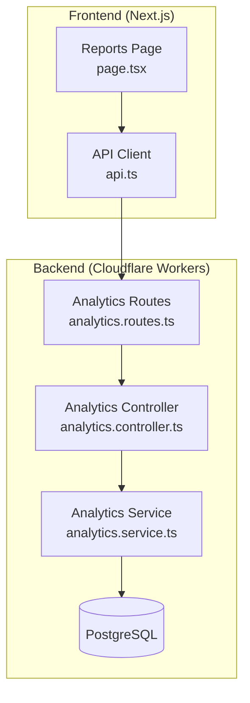
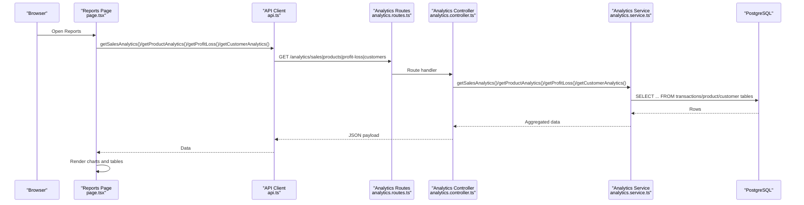
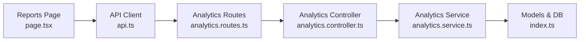

# Sales Analytics

<cite>
**Referenced Files in This Document**
- [analytics.controller.ts](file://apps/api/src/controllers/analytics.controller.ts)
- [analytics.service.ts](file://apps/api/src/services/analytics.service.ts)
- [analytics.routes.ts](file://apps/api/src/routes/analytics.routes.ts)
- [index.ts](file://apps/api/src/models/index.ts)
- [page.tsx](file://apps/web/src/app/reports/page.tsx)
- [api.ts](file://apps/web/src/lib/api.ts)
- [PRD.md](file://PRD/PRD.md)
- [README.md](file://README.md)
</cite>

## Table of Contents
1. [Introduction](#introduction)
2. [Project Structure](#project-structure)
3. [Core Components](#core-components)
4. [Architecture Overview](#architecture-overview)
5. [Detailed Component Analysis](#detailed-component-analysis)
6. [Dependency Analysis](#dependency-analysis)
7. [Performance Considerations](#performance-considerations)
8. [Troubleshooting Guide](#troubleshooting-guide)
9. [Conclusion](#conclusion)
10. [Appendices](#appendices)

## Introduction
This document describes the sales analytics capabilities of the ARHAT POS revenue tracking and analysis system. It covers reporting features such as daily sales trends, monthly patterns, and profitability insights, along with product performance analytics, customer insights, and export functionality. It also outlines filtering options, forecasting considerations, and integration points with the POS backend and frontend.

## Project Structure
The analytics system spans the backend API (Cloudflare Workers/Hono) and the frontend Next.js application:
- Backend exposes analytics endpoints and aggregates data from the database.
- Frontend renders charts and tables, supports CSV export, and triggers analytics refresh.

**Diagram sources**
- [analytics.routes.ts:1-15](file://apps/api/src/routes/analytics.routes.ts#L1-L15)
- [analytics.controller.ts:1-63](file://apps/api/src/controllers/analytics.controller.ts#L1-L63)
- [analytics.service.ts:1-383](file://apps/api/src/services/analytics.service.ts#L1-L383)
- [page.tsx:1-416](file://apps/web/src/app/reports/page.tsx#L1-L416)
- [api.ts:482-520](file://apps/web/src/lib/api.ts#L482-L520)

**Section sources**
- [analytics.routes.ts:1-15](file://apps/api/src/routes/analytics.routes.ts#L1-L15)
- [analytics.controller.ts:1-63](file://apps/api/src/controllers/analytics.controller.ts#L1-L63)
- [analytics.service.ts:1-383](file://apps/api/src/services/analytics.service.ts#L1-L383)
- [page.tsx:1-416](file://apps/web/src/app/reports/page.tsx#L1-L416)
- [api.ts:482-520](file://apps/web/src/lib/api.ts#L482-L520)

## Core Components
- Analytics controller: Exposes endpoints for dashboard, sales, product, profit/loss, and customer analytics. Implements lightweight caching for dashboard data.
- Analytics service: Aggregates sales, product performance, profitability, and customer metrics from the database. Builds time-series charts and ranking lists.
- Analytics routes: Defines REST endpoints under /analytics and applies authentication middleware.
- Frontend reports page: Renders analytics charts and tables, supports CSV export, and refreshes data.
- API client: Provides typed functions to call analytics endpoints and handles authentication.

Key analytics endpoints:
- GET /analytics/dashboard
- GET /analytics/sales
- GET /analytics/products
- GET /analytics/profit-loss
- GET /analytics/customers

**Section sources**
- [analytics.controller.ts:1-63](file://apps/api/src/controllers/analytics.controller.ts#L1-L63)
- [analytics.service.ts:1-383](file://apps/api/src/services/analytics.service.ts#L1-L383)
- [analytics.routes.ts:1-15](file://apps/api/src/routes/analytics.routes.ts#L1-L15)
- [api.ts:482-520](file://apps/web/src/lib/api.ts#L482-L520)

## Architecture Overview
The analytics pipeline follows a clear separation of concerns:
- Data access: Drizzle ORM queries against PostgreSQL tables for transactions, products, and customers.
- Aggregation: Analytics service computes totals, rankings, and time-series data in-memory for flexibility and performance.
- Presentation: Frontend renders charts (Recharts) and tables, and exports CSV for selected tabs.

**Diagram sources**
- [analytics.routes.ts:1-15](file://apps/api/src/routes/analytics.routes.ts#L1-L15)
- [analytics.controller.ts:1-63](file://apps/api/src/controllers/analytics.controller.ts#L1-L63)
- [analytics.service.ts:1-383](file://apps/api/src/services/analytics.service.ts#L1-L383)
- [page.tsx:1-416](file://apps/web/src/app/reports/page.tsx#L1-L416)
- [api.ts:482-520](file://apps/web/src/lib/api.ts#L482-L520)

## Detailed Component Analysis

### Analytics Controller
Responsibilities:
- Enforces authentication via middleware.
- Caches dashboard analytics for short intervals.
- Delegates analytics computation to the service layer.
- Returns structured JSON responses.

Notable behaviors:
- Dashboard data is cached by tenant ID for 60 seconds.
- Other analytics endpoints return fresh data on each request.

**Section sources**
- [analytics.controller.ts:1-63](file://apps/api/src/controllers/analytics.controller.ts#L1-L63)

### Analytics Service
Core aggregations:
- Dashboard: Today’s revenue and transaction count, active product count, top 5 best-selling products, 7-day revenue chart.
- Sales: Total revenue, total transactions, payment method distribution, 30-day revenue chart.
- Products: Top 10 by quantity sold, top 10 by revenue, “slow-moving” products (low/no sales).
- Profit & Loss: Total revenue, total COGS, gross profit, margin percentage, daily revenue-profit chart.
- Customers: Total customers, new customers in the last 30 days, top 10 customers by spending, placeholders for additional metrics.

Time-series construction:
- Builds dense arrays for fixed windows (7 days, 30 days) ensuring zero values for missing dates.
- Uses date truncation to day-level granularity.

Payment method normalization:
- Maps internal identifiers to localized labels (e.g., cash, QRIS, transfer).

**Section sources**
- [analytics.service.ts:1-383](file://apps/api/src/services/analytics.service.ts#L1-L383)

### Analytics Routes
- Mounts analytics endpoints under /analytics.
- Applies authentication middleware to all routes.

**Section sources**
- [analytics.routes.ts:1-15](file://apps/api/src/routes/analytics.routes.ts#L1-L15)

### Frontend Reports Page
Capabilities:
- Tabs: Summary, Sales, P&L, Product Performance, Customers.
- Charts: Line charts for trends, bar/pie charts for distributions.
- Export: CSV export for Sales (daily revenue), Product Performance (top products by quantity), and Customers (top spenders).
- Refresh: Manual reload of analytics data.

**Section sources**
- [page.tsx:1-416](file://apps/web/src/app/reports/page.tsx#L1-L416)

### API Client
Exports:
- getSalesAnalytics(), getProductAnalytics(), getProfitLoss(), getCustomerAnalytics().

**Section sources**
- [api.ts:482-520](file://apps/web/src/lib/api.ts#L482-L520)

### Database Models (Analytics Data Sources)
Key tables used by analytics:
- transactions: transaction metadata, amounts, timestamps, payment method.
- transaction_items: per-item quantity, unit/subtotal.
- products: product info, purchase price, stock.
- customers: customer profile, total spent.

Indexes supporting analytics:
- transactions.created_at index aids time-range scans.
- transactions.transaction_number index supports lookup.

**Section sources**
- [index.ts:119-157](file://apps/api/src/models/index.ts#L119-L157)

## Dependency Analysis
The analytics subsystem exhibits clean layering:
- Frontend depends on API client functions.
- API routes depend on controller handlers.
- Controllers depend on service methods.
- Services depend on Drizzle ORM and database tables.

**Diagram sources**
- [page.tsx:1-416](file://apps/web/src/app/reports/page.tsx#L1-L416)
- [api.ts:482-520](file://apps/web/src/lib/api.ts#L482-L520)
- [analytics.routes.ts:1-15](file://apps/api/src/routes/analytics.routes.ts#L1-L15)
- [analytics.controller.ts:1-63](file://apps/api/src/controllers/analytics.controller.ts#L1-L63)
- [analytics.service.ts:1-383](file://apps/api/src/services/analytics.service.ts#L1-L383)
- [index.ts:119-157](file://apps/api/src/models/index.ts#L119-L157)

**Section sources**
- [page.tsx:1-416](file://apps/web/src/app/reports/page.tsx#L1-L416)
- [api.ts:482-520](file://apps/web/src/lib/api.ts#L482-L520)
- [analytics.routes.ts:1-15](file://apps/api/src/routes/analytics.routes.ts#L1-L15)
- [analytics.controller.ts:1-63](file://apps/api/src/controllers/analytics.controller.ts#L1-L63)
- [analytics.service.ts:1-383](file://apps/api/src/services/analytics.service.ts#L1-L383)
- [index.ts:119-157](file://apps/api/src/models/index.ts#L119-L157)

## Performance Considerations
- In-memory aggregation: The service performs aggregation in JavaScript after fetching rows, which simplifies queries and avoids complex SQL casting issues. This pattern scales well for typical UMKM workloads.
- Time-series density: Fixed-length arrays for 7-day and 30-day windows ensure consistent rendering and predictable memory usage.
- Caching: Dashboard endpoint caches results per tenant for short intervals to reduce load.
- Index usage: Existing indexes on transaction timestamps support efficient range scans for time-based analytics.

Recommendations:
- For very large datasets, consider pre-aggregating time-series in materialized views or partitioned tables.
- Batch processing for historical re-aggregation if schema evolves frequently.

**Section sources**
- [analytics.controller.ts:1-63](file://apps/api/src/controllers/analytics.controller.ts#L1-L63)
- [analytics.service.ts:1-383](file://apps/api/src/services/analytics.service.ts#L1-L383)
- [index.ts:119-157](file://apps/api/src/models/index.ts#L119-L157)

## Troubleshooting Guide
Common issues and resolutions:
- Unauthorized access: Ensure the user is authenticated; API client adds Authorization header automatically.
- Empty or stale data: Use the refresh button on the Reports page to force fresh data retrieval.
- Export limitations: Currently CSV export is supported for Sales, Product Performance, and Customers tabs. Other tabs will show a message indicating unavailability.
- Dashboard latency: Dashboard data is cached for 60 seconds; wait or refresh to see updates.

Operational checks:
- Verify analytics endpoints return 200 OK.
- Confirm database connectivity and indexes exist on transaction timestamps.

**Section sources**
- [page.tsx:56-112](file://apps/web/src/app/reports/page.tsx#L56-L112)
- [api.ts:17-27](file://apps/web/src/lib/api.ts#L17-L27)
- [analytics.controller.ts:1-63](file://apps/api/src/controllers/analytics.controller.ts#L1-L63)

## Conclusion
ARHAT POS provides a practical, real-time sales analytics solution tailored for UMKMs. The backend efficiently aggregates sales, product performance, profitability, and customer insights, while the frontend delivers intuitive charts, tables, and CSV exports. While advanced forecasting and multi-dimensional segmentation are not currently implemented, the modular architecture supports future enhancements such as predictive modeling and expanded filters.

## Appendices

### Supported Analytics Capabilities
- Daily sales trends: 7-day revenue chart on Dashboard and Sales tab.
- Monthly sales patterns: 30-day revenue chart on Sales tab.
- Profitability: Total revenue, COGS, gross profit, margin, and daily revenue-profit chart.
- Product performance: Top 10 by quantity and revenue, slow-moving products.
- Customer insights: Top 10 spenders, total/new customers in 30 days.
- Export: CSV for Sales, Product Performance, and Customers tabs.

**Section sources**
- [analytics.service.ts:6-129](file://apps/api/src/services/analytics.service.ts#L6-L129)
- [analytics.service.ts:131-200](file://apps/api/src/services/analytics.service.ts#L131-L200)
- [analytics.service.ts:202-258](file://apps/api/src/services/analytics.service.ts#L202-L258)
- [analytics.service.ts:260-331](file://apps/api/src/services/analytics.service.ts#L260-L331)
- [analytics.service.ts:333-381](file://apps/api/src/services/analytics.service.ts#L333-L381)
- [page.tsx:56-86](file://apps/web/src/app/reports/page.tsx#L56-L86)

### Filtering Options
Current filters available in the UI:
- Date ranges: The 7-day and 30-day windows are built-in; no explicit date picker is present in the reports page.
- Product categories: Not exposed in the current analytics UI.
- Sales channels: Payment method distribution is available; channel segmentation is not exposed.
- Geographic regions: No outlet/region filters in the current analytics UI.
- Sales representatives: Not exposed in the current analytics UI.
- Customer segments: Not exposed in the current analytics UI.

Note: The PRD indicates planned reporting features including weekly/monthly/yearly sales and category/channel breakdowns, which may be implemented in later phases.

**Section sources**
- [page.tsx:1-416](file://apps/web/src/app/reports/page.tsx#L1-L416)
- [PRD.md:1216-1248](file://PRD/PRD.md#L1216-L1248)

### Forecasting and Targets
- Forecasting algorithms: Not implemented in the current codebase.
- Revenue projections: Not implemented.
- Sales targets: Not implemented.

The PRD outlines future roadmap items including AI sales analytics and stock forecasting, indicating potential direction for these features.

**Section sources**
- [PRD.md:539-556](file://PRD/PRD.md#L539-L556)

### Export Functionality
- Formats: CSV export is implemented for Sales, Product Performance, and Customers tabs.
- PDF/Excel: Not implemented in the current UI.

**Section sources**
- [page.tsx:56-86](file://apps/web/src/app/reports/page.tsx#L56-L86)

### Real-time Monitoring and Alerts
- Real-time monitoring: Dashboard displays today’s revenue and transactions; refresh to update.
- Automated alerts: Not implemented for sales thresholds in the current codebase.
- Accounting integration: Not implemented in the current codebase.

**Section sources**
- [analytics.controller.ts:1-63](file://apps/api/src/controllers/analytics.controller.ts#L1-L63)
- [README.md:300-327](file://README.md#L300-L327)