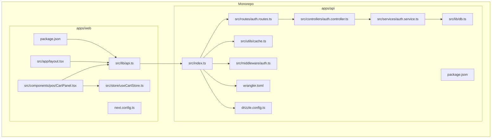
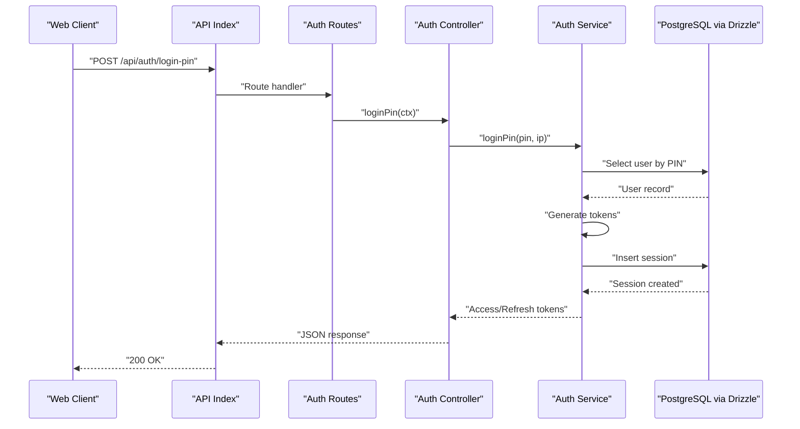
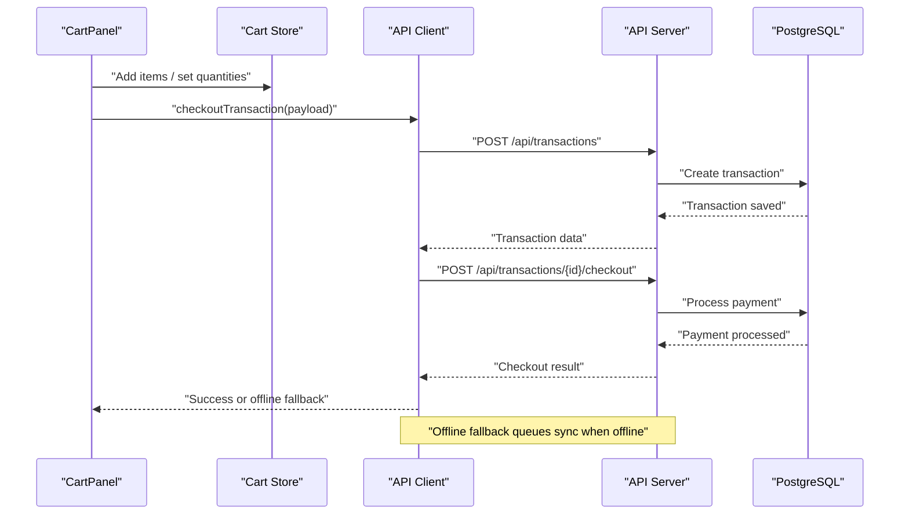
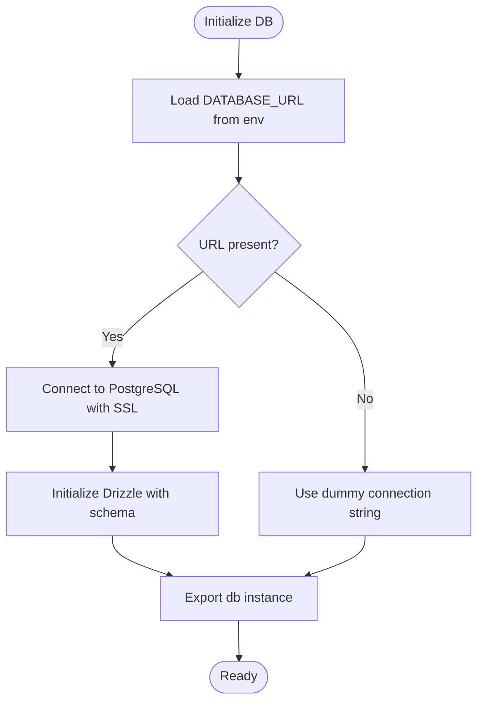
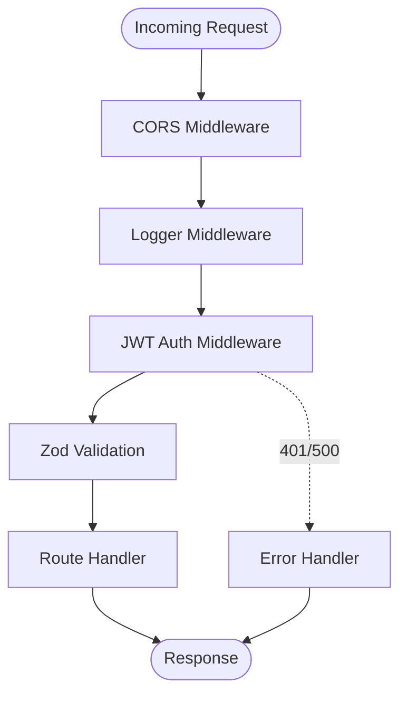
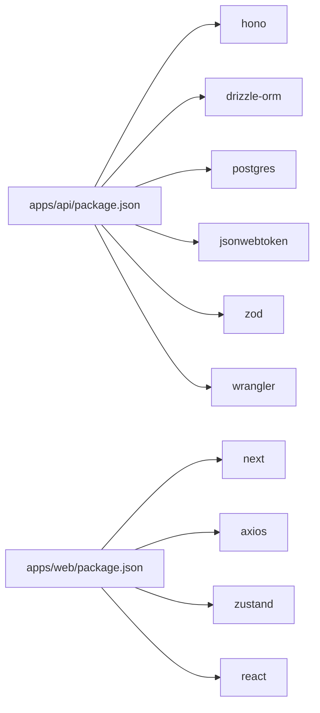
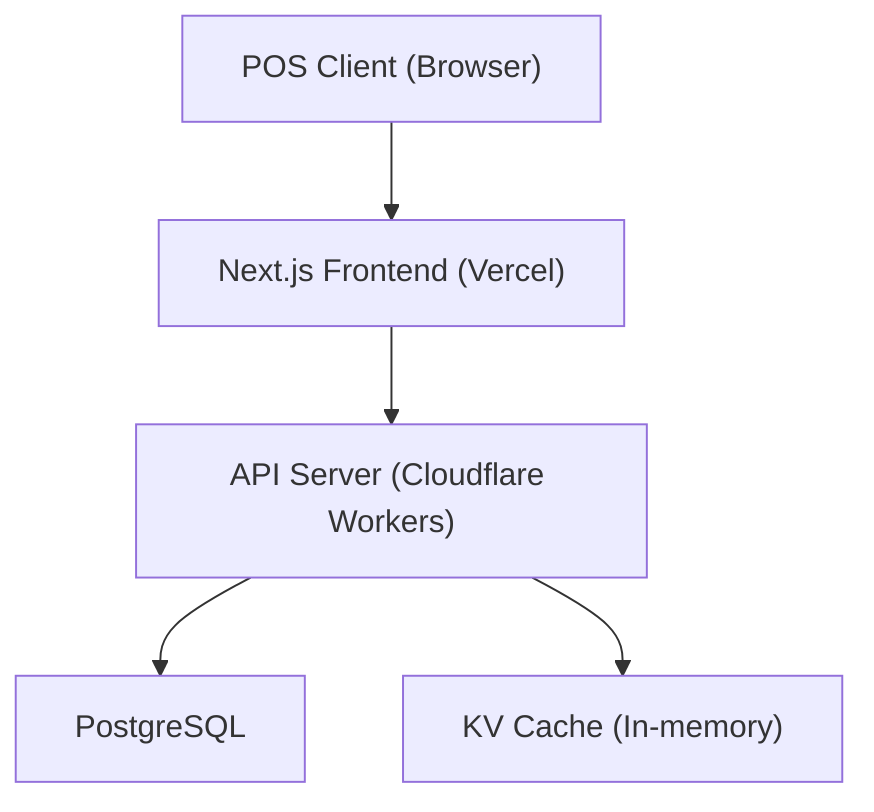

# Architecture & Design

<cite>
**Referenced Files in This Document**
- [apps/api/package.json](file://apps/api/package.json)
- [apps/api/src/index.ts](file://apps/api/src/index.ts)
- [apps/api/wrangler.toml](file://apps/api/wrangler.toml)
- [apps/api/drizzle.config.ts](file://apps/api/drizzle.config.ts)
- [apps/api/src/lib/db.ts](file://apps/api/src/lib/db.ts)
- [apps/api/src/utils/cache.ts](file://apps/api/src/utils/cache.ts)
- [apps/api/src/middleware/auth.ts](file://apps/api/src/middleware/auth.ts)
- [apps/api/src/controllers/auth.controller.ts](file://apps/api/src/controllers/auth.controller.ts)
- [apps/api/src/services/auth.service.ts](file://apps/api/src/services/auth.service.ts)
- [apps/api/src/routes/auth.routes.ts](file://apps/api/src/routes/auth.routes.ts)
- [apps/web/package.json](file://apps/web/package.json)
- [apps/web/src/app/layout.tsx](file://apps/web/src/app/layout.tsx)
- [apps/web/src/lib/api.ts](file://apps/web/src/lib/api.ts)
- [apps/web/src/components/pos/CartPanel.tsx](file://apps/web/src/components/pos/CartPanel.tsx)
- [apps/web/src/store/useCartStore.ts](file://apps/web/src/store/useCartStore.ts)
- [apps/web/next.config.ts](file://apps/web/next.config.ts)
</cite>

## Table of Contents
1. [Introduction](#introduction)
2. [Project Structure](#project-structure)
3. [Core Components](#core-components)
4. [Architecture Overview](#architecture-overview)
5. [Detailed Component Analysis](#detailed-component-analysis)
6. [Dependency Analysis](#dependency-analysis)
7. [Performance Considerations](#performance-considerations)
8. [Troubleshooting Guide](#troubleshooting-guide)
9. [Conclusion](#conclusion)
10. [Appendices](#appendices)

## Introduction
This document describes the architecture and design of the ARHAT POS system. It explains the monorepo structure separating the API and web applications, the layered architecture pattern (presentation, business logic, data access), and the microservices-like organization of features via dedicated controllers, services, and routes. It also documents the serverless deployment strategy using Cloudflare Workers for the backend API and Vercel for the frontend, along with the database architecture using Drizzle ORM with PostgreSQL, caching strategies, and storage solutions. Cross-cutting concerns such as security, monitoring, and scalability are addressed, and system boundaries, component interactions, data flows, and integration patterns are illustrated with diagrams.

## Project Structure
The repository follows a monorepo layout with two primary applications:
- apps/api: A TypeScript-based backend built with Hono, deployed as a Cloudflare Worker.
- apps/web: A Next.js frontend application deployed to Vercel.

Key characteristics:
- Shared tooling and configuration via workspace packages and root configuration files.
- Feature-based organization within the API: controllers, services, routes, middleware, and utilities.
- Frontend organized by pages, components, stores, and shared libraries.



**Diagram sources**
- [apps/api/src/index.ts:1-99](file://apps/api/src/index.ts#L1-L99)
- [apps/api/wrangler.toml:1-10](file://apps/api/wrangler.toml#L1-L10)
- [apps/api/drizzle.config.ts:1-13](file://apps/api/drizzle.config.ts#L1-L13)
- [apps/api/src/lib/db.ts:1-27](file://apps/api/src/lib/db.ts#L1-L27)
- [apps/api/src/utils/cache.ts:1-56](file://apps/api/src/utils/cache.ts#L1-L56)
- [apps/api/src/middleware/auth.ts:1-34](file://apps/api/src/middleware/auth.ts#L1-L34)
- [apps/api/src/controllers/auth.controller.ts:1-91](file://apps/api/src/controllers/auth.controller.ts#L1-L91)
- [apps/api/src/services/auth.service.ts:1-254](file://apps/api/src/services/auth.service.ts#L1-L254)
- [apps/api/src/routes/auth.routes.ts:1-18](file://apps/api/src/routes/auth.routes.ts#L1-L18)
- [apps/web/package.json:1-40](file://apps/web/package.json#L1-L40)
- [apps/web/src/app/layout.tsx:1-60](file://apps/web/src/app/layout.tsx#L1-L60)
- [apps/web/src/lib/api.ts:1-618](file://apps/web/src/lib/api.ts#L1-L618)
- [apps/web/src/components/pos/CartPanel.tsx:1-497](file://apps/web/src/components/pos/CartPanel.tsx#L1-L497)
- [apps/web/src/store/useCartStore.ts:1-184](file://apps/web/src/store/useCartStore.ts#L1-L184)

**Section sources**
- [apps/api/package.json:1-37](file://apps/api/package.json#L1-L37)
- [apps/web/package.json:1-40](file://apps/web/package.json#L1-L40)

## Core Components
- Backend API (Cloudflare Worker):
  - Entry point registers routes, middleware, CORS, logging, health checks, and OpenAPI documentation.
  - Uses Hono for routing and Zod for request validation.
  - Implements JWT-based authentication middleware and error handling.
  - Integrates Drizzle ORM with PostgreSQL for data persistence.
  - Provides in-memory cache utility for optimization.

- Frontend Web Application (Next.js):
  - Centralized API client encapsulates HTTP calls, authentication headers, session handling, and offline fallbacks.
  - POS-focused UI components orchestrate cart operations, checkout, and transaction workflows.
  - Zustand store manages cart state, discounts, taxes, and held transactions.

- Database and Caching:
  - Drizzle configuration and migrations define the schema and evolve the database.
  - PostgreSQL connection configured via environment variables.
  - In-memory cache utility supports TTL-based caching.

- Deployment:
  - API: Wrangler configuration for Cloudflare Workers deployment.
  - Web: Next.js configuration and environment variables for Vercel deployment.

**Section sources**
- [apps/api/src/index.ts:1-99](file://apps/api/src/index.ts#L1-L99)
- [apps/api/src/middleware/auth.ts:1-34](file://apps/api/src/middleware/auth.ts#L1-L34)
- [apps/api/src/lib/db.ts:1-27](file://apps/api/src/lib/db.ts#L1-L27)
- [apps/api/src/utils/cache.ts:1-56](file://apps/api/src/utils/cache.ts#L1-L56)
- [apps/api/drizzle.config.ts:1-13](file://apps/api/drizzle.config.ts#L1-L13)
- [apps/web/src/lib/api.ts:1-618](file://apps/web/src/lib/api.ts#L1-L618)
- [apps/web/src/components/pos/CartPanel.tsx:1-497](file://apps/web/src/components/pos/CartPanel.tsx#L1-L497)
- [apps/web/src/store/useCartStore.ts:1-184](file://apps/web/src/store/useCartStore.ts#L1-L184)
- [apps/api/wrangler.toml:1-10](file://apps/api/wrangler.toml#L1-L10)
- [apps/web/next.config.ts:1-17](file://apps/web/next.config.ts#L1-L17)

## Architecture Overview
The system follows a layered architecture:
- Presentation Layer (apps/web): Next.js pages, components, and stores.
- Business Logic Layer (apps/api): Controllers, Services, and middleware.
- Data Access Layer (apps/api): Drizzle ORM with PostgreSQL.

Feature boundaries are enforced by organizing each major feature into its own controller, service, and route module. The API is exposed via Cloudflare Workers and consumed by the Next.js frontend.

```mermaid
graph TB
subgraph "Presentation Layer"
WEB_APP["Next.js App<br/>Pages & Components"]
API_CLIENT["API Client<br/>HTTP + Auth + Offline"]
CART_STORE["Cart Store<br/>Zustand"]
end
subgraph "Business Logic Layer"
CONTROLLERS["Controllers<br/>Route Handlers"]
SERVICES["Services<br/>Domain Logic"]
MIDDLEWARE["Middleware<br/>Auth, Logging, Errors"]
end
subgraph "Data Access Layer"
DRIZZLE["Drizzle ORM"]
PG_DB["PostgreSQL"]
KV_CACHE["KV Cache<br/>In-memory TTL"]
end
subgraph "Deployment"
CF_WORKERS["Cloudflare Workers"]
VERCEL["Vercel"]
end
WEB_APP --> API_CLIENT
API_CLIENT --> CONTROLLERS
CONTROLLERS --> SERVICES
SERVICES --> DRIZZLE
DRIZZLE --> PG_DB
SERVICES --> KV_CACHE
CONTROLLERS --> MIDDLEWARE
CF_WORKERS <- --> API_CLIENT
VERCEL <- --> WEB_APP
```

**Diagram sources**
- [apps/api/src/index.ts:1-99](file://apps/api/src/index.ts#L1-L99)
- [apps/api/src/controllers/auth.controller.ts:1-91](file://apps/api/src/controllers/auth.controller.ts#L1-L91)
- [apps/api/src/services/auth.service.ts:1-254](file://apps/api/src/services/auth.service.ts#L1-L254)
- [apps/api/src/middleware/auth.ts:1-34](file://apps/api/src/middleware/auth.ts#L1-L34)
- [apps/api/src/lib/db.ts:1-27](file://apps/api/src/lib/db.ts#L1-L27)
- [apps/api/src/utils/cache.ts:1-56](file://apps/api/src/utils/cache.ts#L1-L56)
- [apps/web/src/lib/api.ts:1-618](file://apps/web/src/lib/api.ts#L1-L618)
- [apps/web/src/store/useCartStore.ts:1-184](file://apps/web/src/store/useCartStore.ts#L1-L184)

## Detailed Component Analysis

### Authentication Flow
The authentication flow demonstrates the layered architecture:
- Presentation: Login via PIN or credentials.
- Business Logic: Controllers validate input with Zod, Services authenticate users and manage sessions.
- Data Access: Services query users, insert sessions, and manage tokens.



**Diagram sources**
- [apps/api/src/index.ts:1-99](file://apps/api/src/index.ts#L1-L99)
- [apps/api/src/routes/auth.routes.ts:1-18](file://apps/api/src/routes/auth.routes.ts#L1-L18)
- [apps/api/src/controllers/auth.controller.ts:1-91](file://apps/api/src/controllers/auth.controller.ts#L1-L91)
- [apps/api/src/services/auth.service.ts:1-254](file://apps/api/src/services/auth.service.ts#L1-L254)
- [apps/api/src/lib/db.ts:1-27](file://apps/api/src/lib/db.ts#L1-L27)

**Section sources**
- [apps/api/src/controllers/auth.controller.ts:72-89](file://apps/api/src/controllers/auth.controller.ts#L72-L89)
- [apps/api/src/services/auth.service.ts:179-209](file://apps/api/src/services/auth.service.ts#L179-L209)
- [apps/api/src/middleware/auth.ts:1-34](file://apps/api/src/middleware/auth.ts#L1-L34)

### POS Checkout Workflow
The POS checkout workflow integrates frontend components with backend APIs and demonstrates offline-first behavior.



**Diagram sources**
- [apps/web/src/components/pos/CartPanel.tsx:54-103](file://apps/web/src/components/pos/CartPanel.tsx#L54-L103)
- [apps/web/src/lib/api.ts:75-119](file://apps/web/src/lib/api.ts#L75-L119)
- [apps/api/src/index.ts:1-99](file://apps/api/src/index.ts#L1-L99)

**Section sources**
- [apps/web/src/components/pos/CartPanel.tsx:12-139](file://apps/web/src/components/pos/CartPanel.tsx#L12-L139)
- [apps/web/src/lib/api.ts:75-119](file://apps/web/src/lib/api.ts#L75-L119)

### Database Schema and Migration
Drizzle configuration defines schema location and migration outputs. The database connection is established via environment variables and SSL enforcement.



**Diagram sources**
- [apps/api/src/lib/db.ts:1-27](file://apps/api/src/lib/db.ts#L1-L27)
- [apps/api/drizzle.config.ts:1-13](file://apps/api/drizzle.config.ts#L1-L13)

**Section sources**
- [apps/api/src/lib/db.ts:9-26](file://apps/api/src/lib/db.ts#L9-L26)
- [apps/api/drizzle.config.ts:5-12](file://apps/api/drizzle.config.ts#L5-L12)

### Security and Middleware
Security is enforced through:
- CORS configuration allowing controlled origins.
- JWT-based authentication middleware verifying tokens and attaching user context.
- Zod-based request validation in controllers.
- Environment variables for secrets and database URLs.



**Diagram sources**
- [apps/api/src/index.ts:19-44](file://apps/api/src/index.ts#L19-L44)
- [apps/api/src/middleware/auth.ts:1-34](file://apps/api/src/middleware/auth.ts#L1-L34)
- [apps/api/src/controllers/auth.controller.ts:6-23](file://apps/api/src/controllers/auth.controller.ts#L6-L23)

**Section sources**
- [apps/api/src/index.ts:19-44](file://apps/api/src/index.ts#L19-L44)
- [apps/api/src/middleware/auth.ts:5-33](file://apps/api/src/middleware/auth.ts#L5-L33)
- [apps/api/src/controllers/auth.controller.ts:25-89](file://apps/api/src/controllers/auth.controller.ts#L25-L89)

## Dependency Analysis
- API depends on:
  - Hono for routing and middleware.
  - Drizzle ORM and PostgreSQL driver for database access.
  - Zod for request validation.
  - JSON Web Token for authentication.
  - Wrangler for Cloudflare Workers deployment.

- Web depends on:
  - Next.js runtime and configuration.
  - Axios for HTTP requests.
  - Zustand for state management.
  - Local IndexedDB for offline caching and sync queue.



**Diagram sources**
- [apps/api/package.json:13-35](file://apps/api/package.json#L13-L35)
- [apps/web/package.json:11-28](file://apps/web/package.json#L11-L28)

**Section sources**
- [apps/api/package.json:13-35](file://apps/api/package.json#L13-L35)
- [apps/web/package.json:11-28](file://apps/web/package.json#L11-L28)

## Performance Considerations
- API:
  - Use the in-memory cache utility for short-lived reads; consider migrating to a distributed cache (e.g., Redis) in production.
  - Enable compression and minimize payload sizes.
  - Batch and paginate heavy queries (e.g., transactions, analytics).

- Frontend:
  - Leverage offline caching and IndexedDB for reduced network latency.
  - Debounce search and reduce re-renders using Zustand selectors.
  - Lazy-load components and images.

- Database:
  - Ensure proper indexing on frequently queried columns (e.g., user email, product SKU).
  - Use connection pooling and SSL for secure connections.

[No sources needed since this section provides general guidance]

## Troubleshooting Guide
Common issues and resolutions:
- Missing DATABASE_URL:
  - Symptom: Database initialization failure or null db instance.
  - Resolution: Set DATABASE_URL in environment variables for Cloudflare Workers and local development.

- Missing JWT_SECRET/JWT_REFRESH_SECRET:
  - Symptom: Unauthorized errors or token generation failures.
  - Resolution: Configure JWT secrets in environment variables.

- CORS errors:
  - Symptom: Browser blocking API requests.
  - Resolution: Update allowed origins in CORS middleware.

- Session expiration:
  - Symptom: 401 responses and redirect to login.
  - Resolution: Refresh token flow and cookie management in the API client.

**Section sources**
- [apps/api/src/lib/db.ts:10-15](file://apps/api/src/lib/db.ts#L10-L15)
- [apps/api/src/middleware/auth.ts:14-18](file://apps/api/src/middleware/auth.ts#L14-L18)
- [apps/api/src/index.ts:19-35](file://apps/api/src/index.ts#L19-L35)
- [apps/web/src/lib/api.ts:17-27](file://apps/web/src/lib/api.ts#L17-L27)

## Conclusion
ARHAT POS employs a clean, layered architecture with a clear separation between presentation, business logic, and data access. The monorepo structure enables cohesive development and deployment of the API and web applications. The microservices-like organization of features promotes maintainability and scalability. Serverless deployment via Cloudflare Workers and Vercel ensures cost-effective, globally distributed hosting. The combination of Drizzle ORM, PostgreSQL, in-memory caching, and offline-first frontend capabilities delivers a robust, responsive point-of-sale solution.

[No sources needed since this section summarizes without analyzing specific files]

## Appendices

### System Context Diagram


**Diagram sources**
- [apps/api/src/index.ts:1-99](file://apps/api/src/index.ts#L1-L99)
- [apps/api/src/lib/db.ts:1-27](file://apps/api/src/lib/db.ts#L1-L27)
- [apps/api/src/utils/cache.ts:1-56](file://apps/api/src/utils/cache.ts#L1-L56)
- [apps/web/src/lib/api.ts:1-618](file://apps/web/src/lib/api.ts#L1-L618)

### Component Breakdown
- API Entry Point:
  - Registers routes, middleware, health checks, and OpenAPI documentation.
- Controllers:
  - Validate requests and delegate to services.
- Services:
  - Encapsulate business logic, integrate with database and external systems.
- Middleware:
  - Enforce CORS, logging, authentication, and error handling.
- Database:
  - Drizzle ORM with PostgreSQL and migration support.
- Frontend:
  - API client with offline fallback, cart store, and POS components.

**Section sources**
- [apps/api/src/index.ts:1-99](file://apps/api/src/index.ts#L1-L99)
- [apps/api/src/controllers/auth.controller.ts:1-91](file://apps/api/src/controllers/auth.controller.ts#L1-L91)
- [apps/api/src/services/auth.service.ts:1-254](file://apps/api/src/services/auth.service.ts#L1-L254)
- [apps/api/src/middleware/auth.ts:1-34](file://apps/api/src/middleware/auth.ts#L1-L34)
- [apps/api/src/lib/db.ts:1-27](file://apps/api/src/lib/db.ts#L1-L27)
- [apps/web/src/lib/api.ts:1-618](file://apps/web/src/lib/api.ts#L1-L618)
- [apps/web/src/store/useCartStore.ts:1-184](file://apps/web/src/store/useCartStore.ts#L1-L184)