# Data Flow & Processing

<cite>
**Referenced Files in This Document**
- [apps/api/src/index.ts](file://apps/api/src/index.ts)
- [apps/api/src/middleware/auth.ts](file://apps/api/src/middleware/auth.ts)
- [apps/api/src/middleware/errorHandler.ts](file://apps/api/src/middleware/errorHandler.ts)
- [apps/api/src/utils/cache.ts](file://apps/api/src/utils/cache.ts)
- [apps/api/src/lib/db.ts](file://apps/api/src/lib/db.ts)
- [apps/api/src/models/index.ts](file://apps/api/src/models/index.ts)
- [apps/api/src/routes/transaction.routes.ts](file://apps/api/src/routes/transaction.routes.ts)
- [apps/api/src/controllers/transaction.controller.ts](file://apps/api/src/controllers/transaction.controller.ts)
- [apps/api/src/services/transaction.service.ts](file://apps/api/src/services/transaction.service.ts)
- [apps/api/src/services/whatsapp.service.ts](file://apps/api/src/services/whatsapp.service.ts)
- [apps/api/src/controllers/whatsapp.controller.ts](file://apps/api/src/controllers/whatsapp.controller.ts)
- [apps/web/src/lib/api.ts](file://apps/web/src/lib/api.ts)
- [apps/web/src/store/useCartStore.ts](file://apps/web/src/store/useCartStore.ts)
- [apps/web/src/components/pos/CartPanel.tsx](file://apps/web/src/components/pos/CartPanel.tsx)
- [apps/web/src/contexts/AuthContext.tsx](file://apps/web/src/contexts/AuthContext.tsx)
</cite>

## Table of Contents
1. [Introduction](#introduction)
2. [Project Structure](#project-structure)
3. [Core Components](#core-components)
4. [Architecture Overview](#architecture-overview)
5. [Detailed Component Analysis](#detailed-component-analysis)
6. [Dependency Analysis](#dependency-analysis)
7. [Performance Considerations](#performance-considerations)
8. [Troubleshooting Guide](#troubleshooting-guide)
9. [Conclusion](#conclusion)

## Introduction
This document explains the ARHAT POS data flow architecture and processing patterns across three layers:
- Presentation layer (Next.js web app): user interactions, state management, offline-first UX, and API orchestration.
- Business logic layer (Hono API): route handlers, controllers, services, and in-memory caching.
- Data access layer (Drizzle ORM): PostgreSQL schema, queries, and transactions.

It details the request/response flow from frontend components to API controllers, service layer, and database operations. It also documents the middleware pipeline (authentication, error handling, logging, CORS), data transformation patterns, caching strategies, state management, and integration patterns with external services such as WhatsApp messaging and image storage.

## Project Structure
The system is organized into two applications:
- apps/web: Next.js frontend with components, stores, and API wrappers.
- apps/api: Hono-based backend with routes, controllers, services, middleware, and database models.

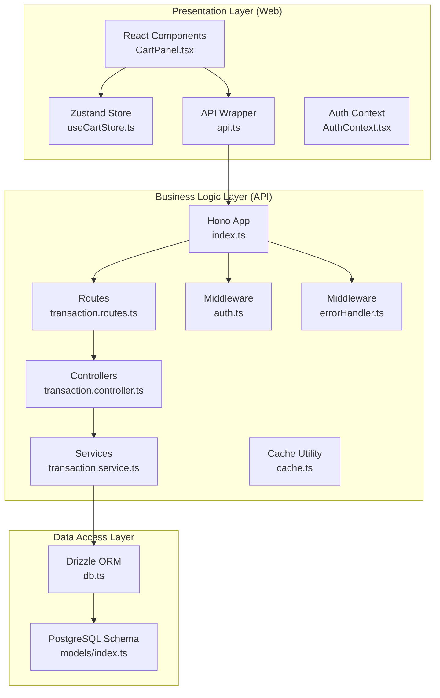

**Diagram sources**
- [apps/api/src/index.ts:1-99](file://apps/api/src/index.ts#L1-L99)
- [apps/api/src/routes/transaction.routes.ts:1-23](file://apps/api/src/routes/transaction.routes.ts#L1-L23)
- [apps/api/src/controllers/transaction.controller.ts:1-142](file://apps/api/src/controllers/transaction.controller.ts#L1-L142)
- [apps/api/src/services/transaction.service.ts:1-414](file://apps/api/src/services/transaction.service.ts#L1-L414)
- [apps/api/src/middleware/auth.ts:1-34](file://apps/api/src/middleware/auth.ts#L1-L34)
- [apps/api/src/middleware/errorHandler.ts:1-11](file://apps/api/src/middleware/errorHandler.ts#L1-L11)
- [apps/api/src/utils/cache.ts:1-56](file://apps/api/src/utils/cache.ts#L1-L56)
- [apps/api/src/lib/db.ts:1-27](file://apps/api/src/lib/db.ts#L1-L27)
- [apps/api/src/models/index.ts:1-307](file://apps/api/src/models/index.ts#L1-L307)
- [apps/web/src/lib/api.ts:1-618](file://apps/web/src/lib/api.ts#L1-L618)
- [apps/web/src/store/useCartStore.ts:1-184](file://apps/web/src/store/useCartStore.ts#L1-L184)
- [apps/web/src/contexts/AuthContext.tsx:1-84](file://apps/web/src/contexts/AuthContext.tsx#L1-L84)

**Section sources**
- [apps/api/src/index.ts:1-99](file://apps/api/src/index.ts#L1-L99)
- [apps/web/src/lib/api.ts:1-618](file://apps/web/src/lib/api.ts#L1-L618)

## Core Components
- Presentation layer
  - Zustand store manages cart items, held transactions, taxes, and discounts.
  - API wrapper encapsulates HTTP calls, token injection, error handling, offline fallbacks, and image uploads.
  - Auth context validates session and redirects unauthenticated users.
- Business logic layer
  - Hono app configures CORS, logging, health checks, and routes.
  - Route handlers enforce authentication and delegate to controllers.
  - Controllers call services and trigger asynchronous integrations (e.g., WhatsApp receipts).
  - Services encapsulate transactional database operations, stock adjustments, and customer points.
  - In-memory cache utility supports lightweight caching for optimization.
- Data access layer
  - Drizzle ORM connects to PostgreSQL using a schema-first approach.
  - Models define normalized tables for tenants, users, products, transactions, payments, stock movements, and WhatsApp messages.

**Section sources**
- [apps/web/src/store/useCartStore.ts:1-184](file://apps/web/src/store/useCartStore.ts#L1-L184)
- [apps/web/src/lib/api.ts:1-618](file://apps/web/src/lib/api.ts#L1-L618)
- [apps/web/src/contexts/AuthContext.tsx:1-84](file://apps/web/src/contexts/AuthContext.tsx#L1-L84)
- [apps/api/src/index.ts:1-99](file://apps/api/src/index.ts#L1-L99)
- [apps/api/src/routes/transaction.routes.ts:1-23](file://apps/api/src/routes/transaction.routes.ts#L1-L23)
- [apps/api/src/controllers/transaction.controller.ts:1-142](file://apps/api/src/controllers/transaction.controller.ts#L1-L142)
- [apps/api/src/services/transaction.service.ts:1-414](file://apps/api/src/services/transaction.service.ts#L1-L414)
- [apps/api/src/utils/cache.ts:1-56](file://apps/api/src/utils/cache.ts#L1-L56)
- [apps/api/src/lib/db.ts:1-27](file://apps/api/src/lib/db.ts#L1-L27)
- [apps/api/src/models/index.ts:1-307](file://apps/api/src/models/index.ts#L1-L307)

## Architecture Overview
The system follows a layered architecture:
- Presentation: Next.js components and stores orchestrate user actions and API calls.
- Business logic: Hono routes, controllers, and services implement domain workflows.
- Data access: Drizzle ORM executes SQL with explicit transactions for consistency.

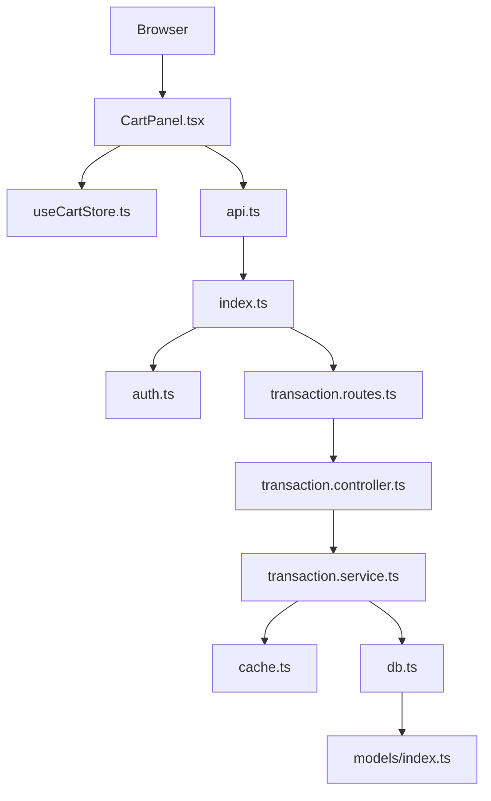

**Diagram sources**
- [apps/web/src/components/pos/CartPanel.tsx:1-497](file://apps/web/src/components/pos/CartPanel.tsx#L1-L497)
- [apps/web/src/store/useCartStore.ts:1-184](file://apps/web/src/store/useCartStore.ts#L1-L184)
- [apps/web/src/lib/api.ts:1-618](file://apps/web/src/lib/api.ts#L1-L618)
- [apps/api/src/index.ts:1-99](file://apps/api/src/index.ts#L1-L99)
- [apps/api/src/middleware/auth.ts:1-34](file://apps/api/src/middleware/auth.ts#L1-L34)
- [apps/api/src/routes/transaction.routes.ts:1-23](file://apps/api/src/routes/transaction.routes.ts#L1-L23)
- [apps/api/src/controllers/transaction.controller.ts:1-142](file://apps/api/src/controllers/transaction.controller.ts#L1-L142)
- [apps/api/src/services/transaction.service.ts:1-414](file://apps/api/src/services/transaction.service.ts#L1-L414)
- [apps/api/src/utils/cache.ts:1-56](file://apps/api/src/utils/cache.ts#L1-L56)
- [apps/api/src/lib/db.ts:1-27](file://apps/api/src/lib/db.ts#L1-L27)
- [apps/api/src/models/index.ts:1-307](file://apps/api/src/models/index.ts#L1-L307)

## Detailed Component Analysis

### Authentication and Authorization Pipeline
- CORS and logging are applied globally.
- Authentication middleware verifies Authorization bearer tokens and attaches user context.
- Error handler converts domain errors to JSON responses with appropriate status codes.

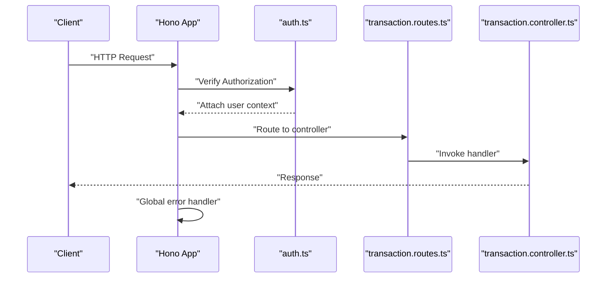

**Diagram sources**
- [apps/api/src/index.ts:1-99](file://apps/api/src/index.ts#L1-L99)
- [apps/api/src/middleware/auth.ts:1-34](file://apps/api/src/middleware/auth.ts#L1-L34)
- [apps/api/src/middleware/errorHandler.ts:1-11](file://apps/api/src/middleware/errorHandler.ts#L1-L11)
- [apps/api/src/routes/transaction.routes.ts:1-23](file://apps/api/src/routes/transaction.routes.ts#L1-L23)
- [apps/api/src/controllers/transaction.controller.ts:1-142](file://apps/api/src/controllers/transaction.controller.ts#L1-L142)

**Section sources**
- [apps/api/src/index.ts:1-99](file://apps/api/src/index.ts#L1-L99)
- [apps/api/src/middleware/auth.ts:1-34](file://apps/api/src/middleware/auth.ts#L1-L34)
- [apps/api/src/middleware/errorHandler.ts:1-11](file://apps/api/src/middleware/errorHandler.ts#L1-L11)

### Transaction Creation and Checkout Workflow
- Frontend composes a cart, computes totals, and calls the API to create a transaction.
- The controller delegates to the service, which inserts transaction headers and items.
- Checkout updates status, records payments, deducts stock (including BOM for raw materials), and adjusts customer points.
- Asynchronous WhatsApp receipt is triggered after creation.

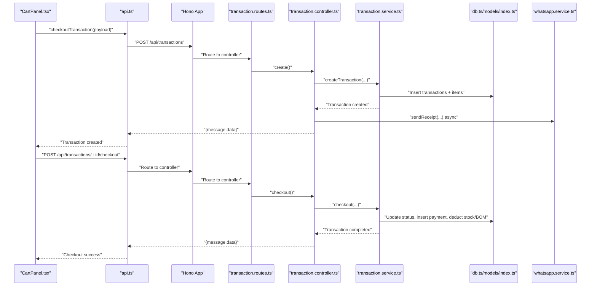

**Diagram sources**
- [apps/web/src/components/pos/CartPanel.tsx:1-497](file://apps/web/src/components/pos/CartPanel.tsx#L1-L497)
- [apps/web/src/lib/api.ts:1-618](file://apps/web/src/lib/api.ts#L1-L618)
- [apps/api/src/routes/transaction.routes.ts:1-23](file://apps/api/src/routes/transaction.routes.ts#L1-L23)
- [apps/api/src/controllers/transaction.controller.ts:1-142](file://apps/api/src/controllers/transaction.controller.ts#L1-L142)
- [apps/api/src/services/transaction.service.ts:1-414](file://apps/api/src/services/transaction.service.ts#L1-L414)
- [apps/api/src/lib/db.ts:1-27](file://apps/api/src/lib/db.ts#L1-L27)
- [apps/api/src/models/index.ts:1-307](file://apps/api/src/models/index.ts#L1-L307)
- [apps/api/src/services/whatsapp.service.ts:1-127](file://apps/api/src/services/whatsapp.service.ts#L1-L127)

**Section sources**
- [apps/web/src/components/pos/CartPanel.tsx:1-497](file://apps/web/src/components/pos/CartPanel.tsx#L1-L497)
- [apps/web/src/lib/api.ts:1-618](file://apps/web/src/lib/api.ts#L1-L618)
- [apps/api/src/controllers/transaction.controller.ts:1-142](file://apps/api/src/controllers/transaction.controller.ts#L1-L142)
- [apps/api/src/services/transaction.service.ts:1-414](file://apps/api/src/services/transaction.service.ts#L1-L414)
- [apps/api/src/services/whatsapp.service.ts:1-127](file://apps/api/src/services/whatsapp.service.ts#L1-L127)

### Offline Fallback and Sync Flow
- The frontend detects network failures and enqueues offline transactions.
- A dedicated endpoint performs offline sync by creating and immediately checking out transactions.
- The controller triggers the same checkout logic and optional WhatsApp receipt.

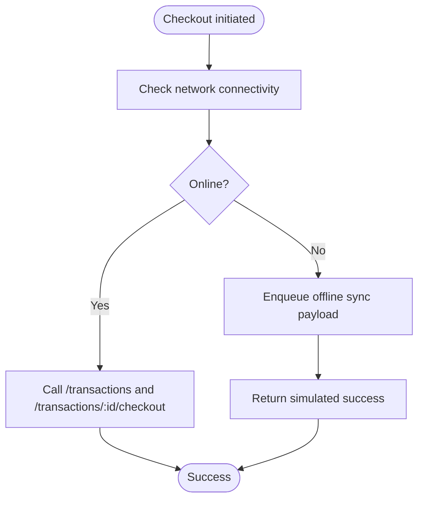

**Diagram sources**
- [apps/web/src/lib/api.ts:1-618](file://apps/web/src/lib/api.ts#L1-L618)
- [apps/api/src/controllers/transaction.controller.ts:57-86](file://apps/api/src/controllers/transaction.controller.ts#L57-L86)
- [apps/api/src/services/transaction.service.ts:107-234](file://apps/api/src/services/transaction.service.ts#L107-L234)

**Section sources**
- [apps/web/src/lib/api.ts:1-618](file://apps/web/src/lib/api.ts#L1-L618)
- [apps/api/src/controllers/transaction.controller.ts:57-86](file://apps/api/src/controllers/transaction.controller.ts#L57-L86)
- [apps/api/src/services/transaction.service.ts:107-234](file://apps/api/src/services/transaction.service.ts#L107-L234)

### WhatsApp Integration Patterns
- Receipts: On transaction creation, the controller triggers an asynchronous receipt send via the service, which persists a pending message and attempts immediate delivery.
- Notifications: The API exposes endpoints to queue notifications and verify webhooks for external providers.
- Queue processing: A background-friendly method processes pending messages in batches.

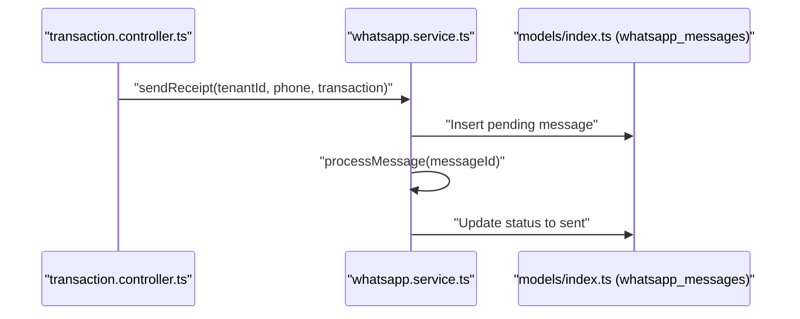

**Diagram sources**
- [apps/api/src/controllers/transaction.controller.ts:27-31](file://apps/api/src/controllers/transaction.controller.ts#L27-L31)
- [apps/api/src/services/whatsapp.service.ts:9-36](file://apps/api/src/services/whatsapp.service.ts#L9-L36)
- [apps/api/src/models/index.ts:260-275](file://apps/api/src/models/index.ts#L260-L275)

**Section sources**
- [apps/api/src/controllers/transaction.controller.ts:1-142](file://apps/api/src/controllers/transaction.controller.ts#L1-L142)
- [apps/api/src/services/whatsapp.service.ts:1-127](file://apps/api/src/services/whatsapp.service.ts#L1-L127)
- [apps/api/src/models/index.ts:1-307](file://apps/api/src/models/index.ts#L1-L307)

### Data Transformation and Validation Patterns
- Frontend transforms cart items into transaction payloads, computes totals, taxes, and discounts, and optionally attaches customer and WhatsApp phone metadata.
- Backend validates presence of required fields and uses typed services to ensure consistent data shapes for persistence and calculations.

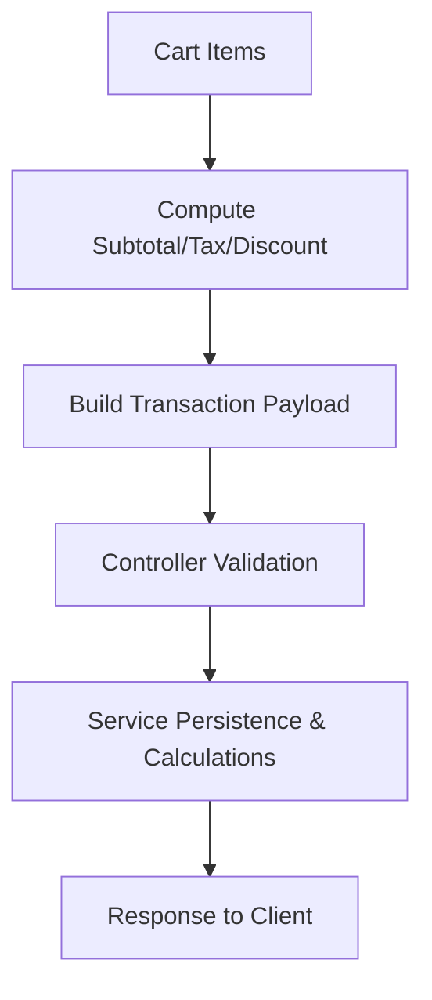

**Diagram sources**
- [apps/web/src/components/pos/CartPanel.tsx:54-103](file://apps/web/src/components/pos/CartPanel.tsx#L54-L103)
- [apps/web/src/lib/api.ts:75-119](file://apps/web/src/lib/api.ts#L75-L119)
- [apps/api/src/controllers/transaction.controller.ts:16-37](file://apps/api/src/controllers/transaction.controller.ts#L16-L37)
- [apps/api/src/services/transaction.service.ts:31-102](file://apps/api/src/services/transaction.service.ts#L31-L102)

**Section sources**
- [apps/web/src/components/pos/CartPanel.tsx:1-497](file://apps/web/src/components/pos/CartPanel.tsx#L1-L497)
- [apps/web/src/lib/api.ts:1-618](file://apps/web/src/lib/api.ts#L1-L618)
- [apps/api/src/controllers/transaction.controller.ts:1-142](file://apps/api/src/controllers/transaction.controller.ts#L1-L142)
- [apps/api/src/services/transaction.service.ts:1-414](file://apps/api/src/services/transaction.service.ts#L1-L414)

### State Management Approaches
- Cart state is managed with Zustand, enabling fine-grained updates, derived computations (subtotal, total discount), and persisted held transactions.
- Auth context centralizes session checks and navigation redirection.

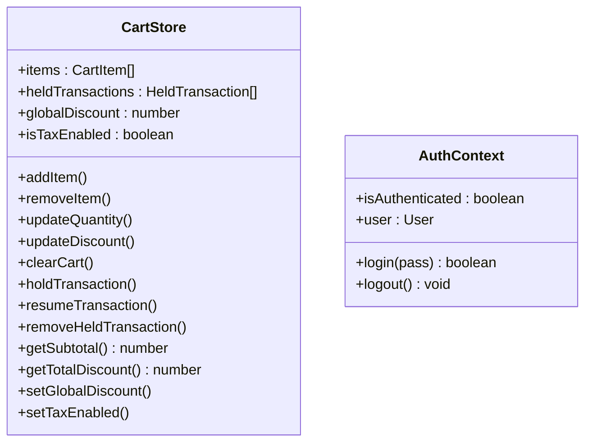

**Diagram sources**
- [apps/web/src/store/useCartStore.ts:1-184](file://apps/web/src/store/useCartStore.ts#L1-L184)
- [apps/web/src/contexts/AuthContext.tsx:1-84](file://apps/web/src/contexts/AuthContext.tsx#L1-L84)

**Section sources**
- [apps/web/src/store/useCartStore.ts:1-184](file://apps/web/src/store/useCartStore.ts#L1-L184)
- [apps/web/src/contexts/AuthContext.tsx:1-84](file://apps/web/src/contexts/AuthContext.tsx#L1-L84)

### Caching Strategies
- In-memory cache utility provides TTL-based caching for frequently accessed data to reduce load.
- Frontend caches product/customer lists locally and falls back to cache on network failure.

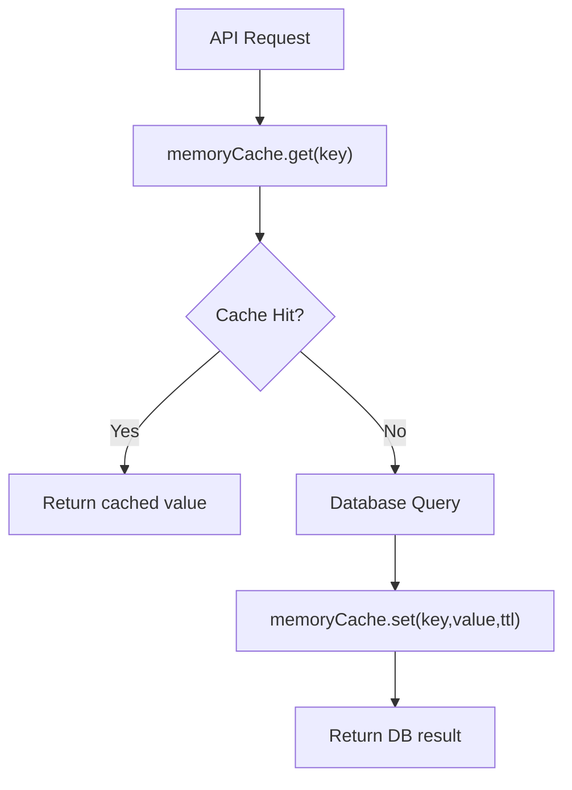

**Diagram sources**
- [apps/api/src/utils/cache.ts:1-56](file://apps/api/src/utils/cache.ts#L1-L56)
- [apps/web/src/lib/api.ts:42-64](file://apps/web/src/lib/api.ts#L42-L64)
- [apps/web/src/lib/api.ts:418-438](file://apps/web/src/lib/api.ts#L418-L438)

**Section sources**
- [apps/api/src/utils/cache.ts:1-56](file://apps/api/src/utils/cache.ts#L1-L56)
- [apps/web/src/lib/api.ts:1-618](file://apps/web/src/lib/api.ts#L1-L618)

### Image Upload Integration
- The frontend uploads images via multipart/form-data to the backend upload route.
- The API wraps the upload response with a standardized shape for client consumption.

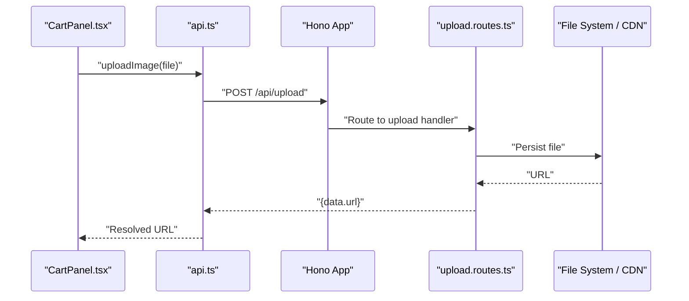

**Diagram sources**
- [apps/web/src/lib/api.ts:211-224](file://apps/web/src/lib/api.ts#L211-L224)
- [apps/web/src/components/pos/CartPanel.tsx:1-497](file://apps/web/src/components/pos/CartPanel.tsx#L1-L497)

**Section sources**
- [apps/web/src/lib/api.ts:1-618](file://apps/web/src/lib/api.ts#L1-L618)

## Dependency Analysis
- Controllers depend on services for business logic.
- Services depend on Drizzle ORM and models for data access.
- Routes depend on controllers and authentication middleware.
- The API depends on middleware for cross-cutting concerns.
- Frontend depends on API wrapper and stores for state and network operations.

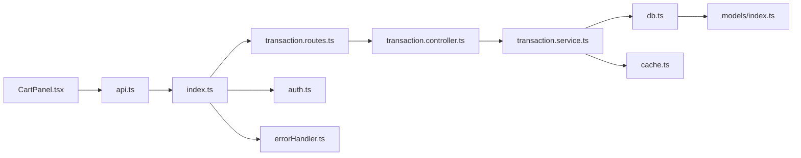

**Diagram sources**
- [apps/web/src/components/pos/CartPanel.tsx:1-497](file://apps/web/src/components/pos/CartPanel.tsx#L1-L497)
- [apps/web/src/lib/api.ts:1-618](file://apps/web/src/lib/api.ts#L1-L618)
- [apps/api/src/index.ts:1-99](file://apps/api/src/index.ts#L1-L99)
- [apps/api/src/routes/transaction.routes.ts:1-23](file://apps/api/src/routes/transaction.routes.ts#L1-L23)
- [apps/api/src/controllers/transaction.controller.ts:1-142](file://apps/api/src/controllers/transaction.controller.ts#L1-L142)
- [apps/api/src/services/transaction.service.ts:1-414](file://apps/api/src/services/transaction.service.ts#L1-L414)
- [apps/api/src/lib/db.ts:1-27](file://apps/api/src/lib/db.ts#L1-L27)
- [apps/api/src/models/index.ts:1-307](file://apps/api/src/models/index.ts#L1-L307)
- [apps/api/src/middleware/auth.ts:1-34](file://apps/api/src/middleware/auth.ts#L1-L34)
- [apps/api/src/middleware/errorHandler.ts:1-11](file://apps/api/src/middleware/errorHandler.ts#L1-L11)
- [apps/api/src/utils/cache.ts:1-56](file://apps/api/src/utils/cache.ts#L1-L56)

**Section sources**
- [apps/api/src/index.ts:1-99](file://apps/api/src/index.ts#L1-L99)
- [apps/api/src/routes/transaction.routes.ts:1-23](file://apps/api/src/routes/transaction.routes.ts#L1-L23)
- [apps/api/src/controllers/transaction.controller.ts:1-142](file://apps/api/src/controllers/transaction.controller.ts#L1-L142)
- [apps/api/src/services/transaction.service.ts:1-414](file://apps/api/src/services/transaction.service.ts#L1-L414)
- [apps/api/src/lib/db.ts:1-27](file://apps/api/src/lib/db.ts#L1-L27)
- [apps/api/src/models/index.ts:1-307](file://apps/api/src/models/index.ts#L1-L307)
- [apps/api/src/middleware/auth.ts:1-34](file://apps/api/src/middleware/auth.ts#L1-L34)
- [apps/api/src/middleware/errorHandler.ts:1-11](file://apps/api/src/middleware/errorHandler.ts#L1-L11)
- [apps/api/src/utils/cache.ts:1-56](file://apps/api/src/utils/cache.ts#L1-L56)
- [apps/web/src/lib/api.ts:1-618](file://apps/web/src/lib/api.ts#L1-L618)
- [apps/web/src/components/pos/CartPanel.tsx:1-497](file://apps/web/src/components/pos/CartPanel.tsx#L1-L497)

## Performance Considerations
- Use the in-memory cache for hot-path reads to reduce database load.
- Batch process pending WhatsApp messages to avoid blocking transaction responses.
- Prefer database transactions for write-heavy workflows (e.g., checkout) to maintain consistency.
- Offload long-running tasks (e.g., sending receipts) to minimize latency.

[No sources needed since this section provides general guidance]

## Troubleshooting Guide
- Authentication failures: Verify Authorization header format and JWT_SECRET configuration. The middleware throws explicit unauthorized errors for missing or invalid tokens.
- Network errors during checkout: The frontend falls back to enqueueing offline sync and returns a simulated success response. Inspect the offline queue and retry mechanism.
- Database initialization: Missing DATABASE_URL logs a critical warning and initializes a dummy client; ensure environment variables are configured in production.
- Error responses: Centralized error handler returns structured JSON with error messages and status codes.

**Section sources**
- [apps/api/src/middleware/auth.ts:1-34](file://apps/api/src/middleware/auth.ts#L1-L34)
- [apps/api/src/middleware/errorHandler.ts:1-11](file://apps/api/src/middleware/errorHandler.ts#L1-L11)
- [apps/api/src/lib/db.ts:1-27](file://apps/api/src/lib/db.ts#L1-L27)
- [apps/web/src/lib/api.ts:98-118](file://apps/web/src/lib/api.ts#L98-L118)

## Conclusion
ARHAT POS implements a clean layered architecture with well-defined boundaries between presentation, business logic, and data access. The request/response flow is predictable, leveraging middleware for cross-cutting concerns, services for transactional business rules, and Drizzle ORM for robust persistence. The frontend emphasizes resilience with offline fallbacks, while the backend integrates external services like WhatsApp through asynchronous queues. Together, these patterns support scalable, maintainable, and user-friendly point-of-sale operations.