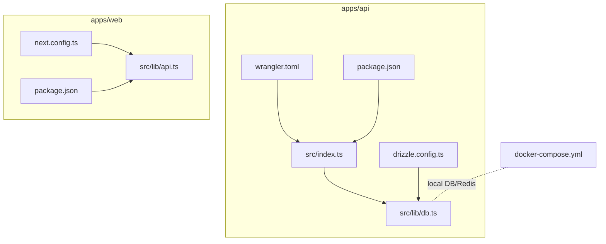
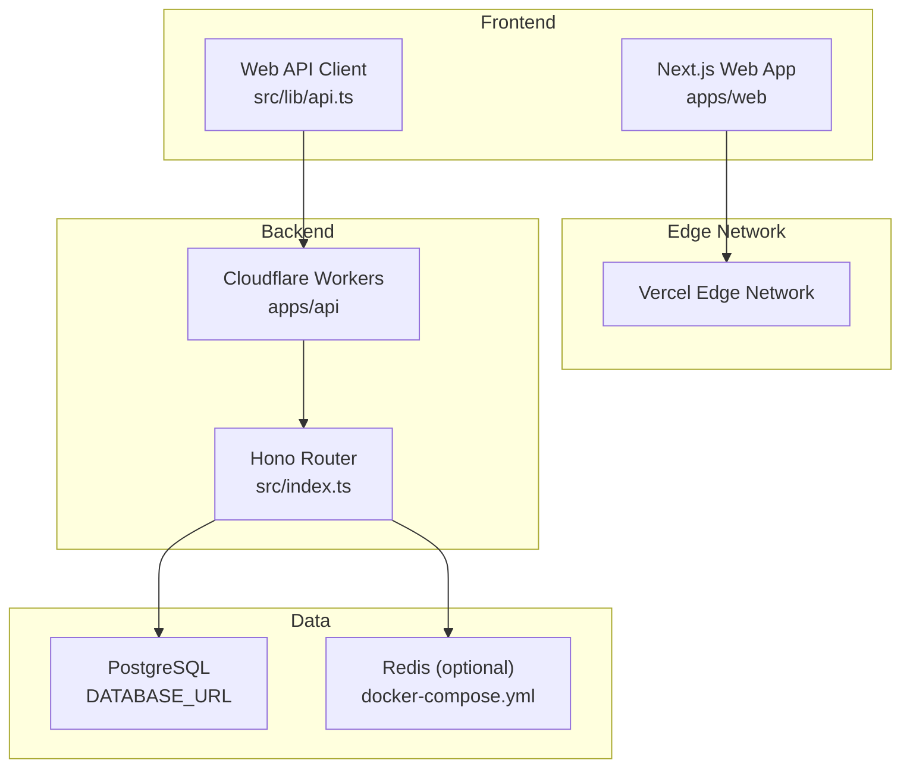
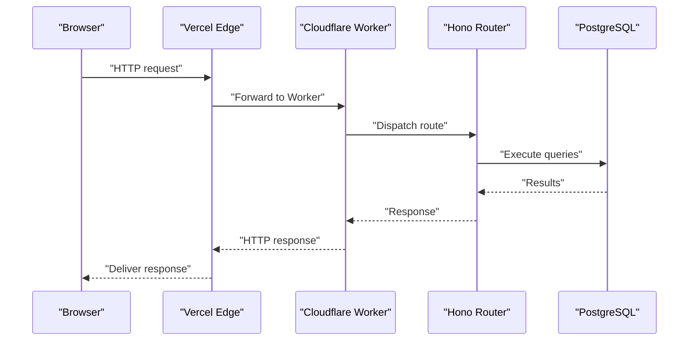
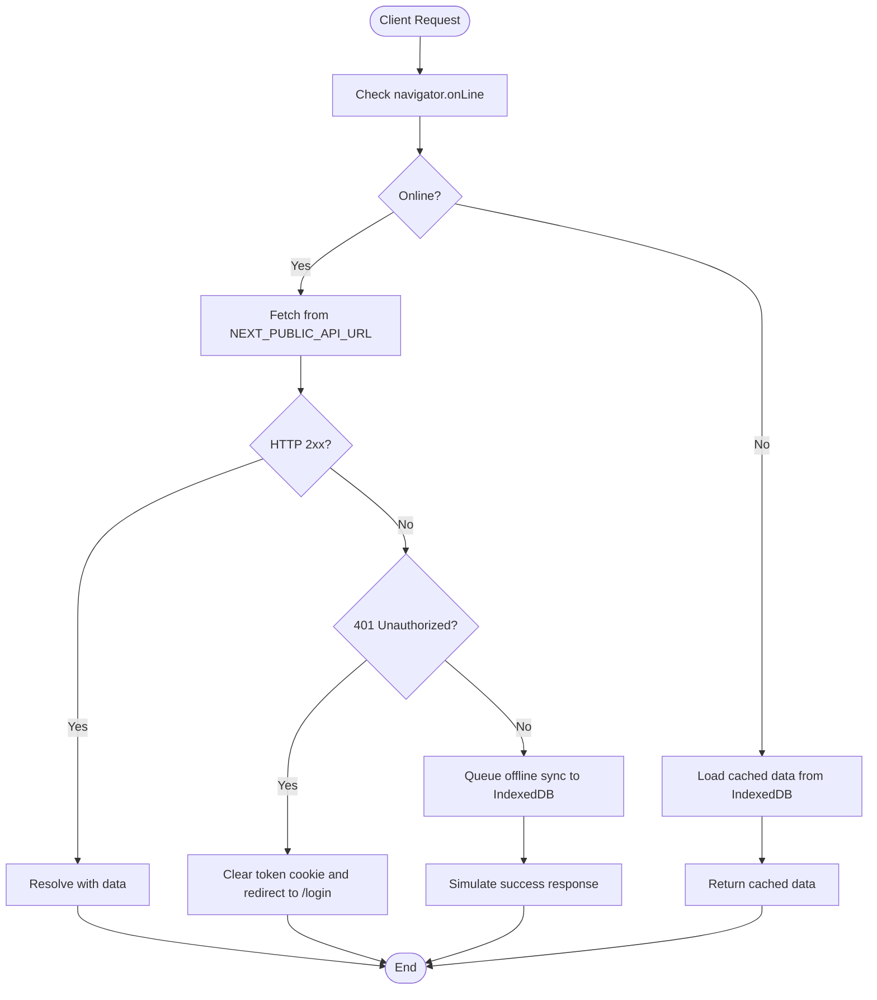
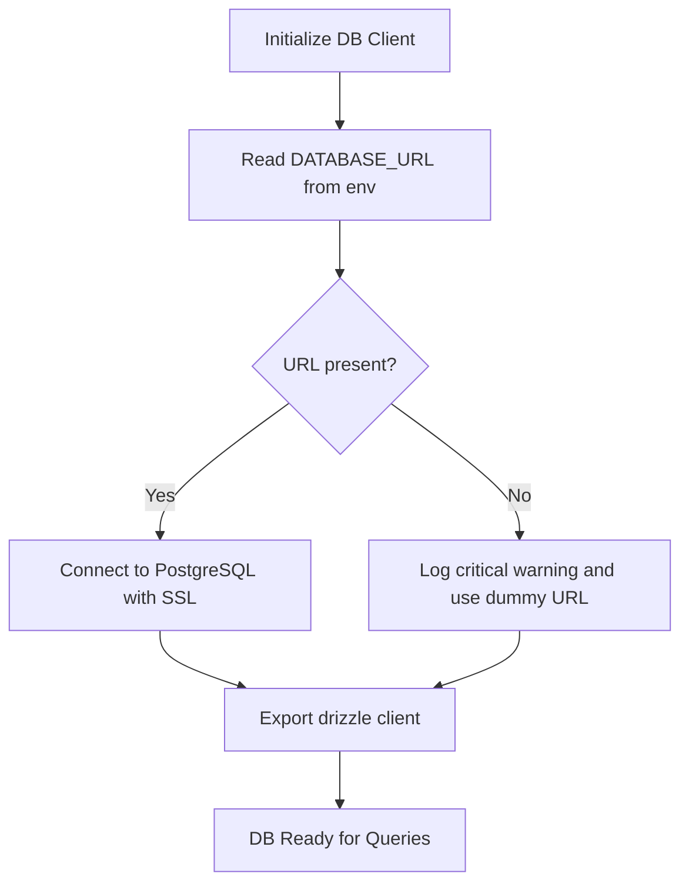
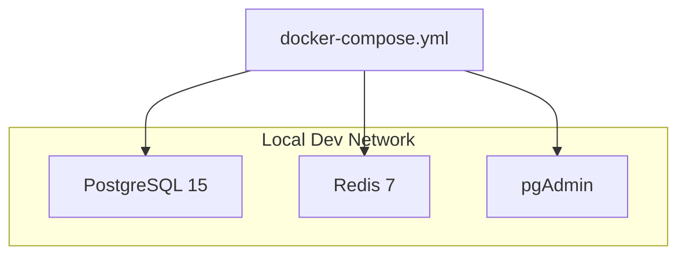
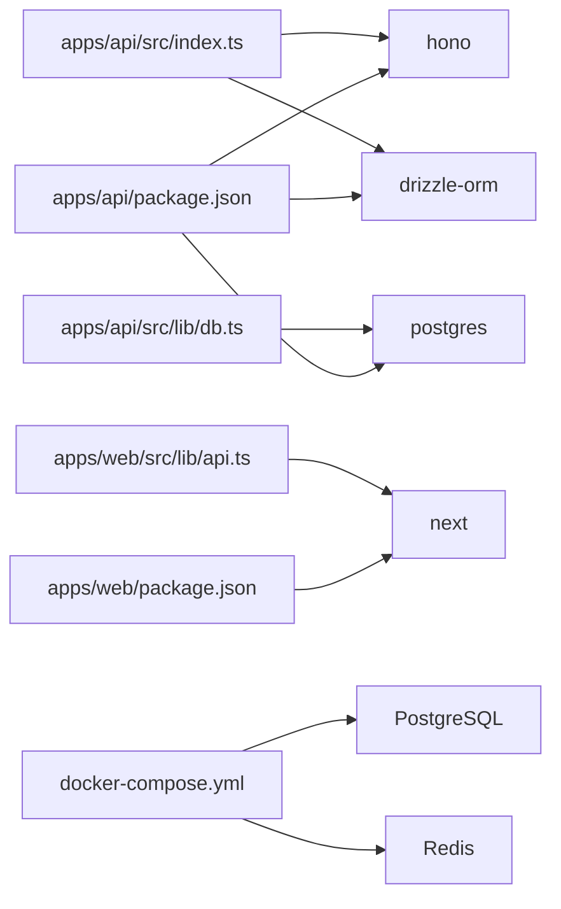
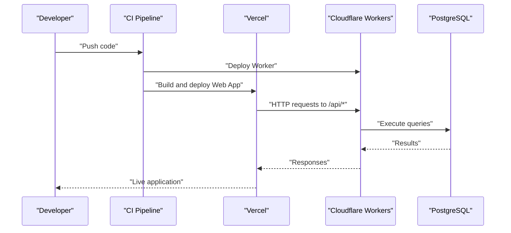

# Deployment Architecture

<cite>
**Referenced Files in This Document**
- [wrangler.toml](file://apps/api/wrangler.toml)
- [package.json](file://apps/api/package.json)
- [index.ts](file://apps/api/src/index.ts)
- [db.ts](file://apps/api/src/lib/db.ts)
- [drizzle.config.ts](file://apps/api/drizzle.config.ts)
- [docker-compose.yml](file://docker-compose.yml)
- [next.config.ts](file://apps/web/next.config.ts)
- [api.ts](file://apps/web/src/lib/api.ts)
- [package.json](file://apps/web/package.json)
</cite>

## Table of Contents
1. [Introduction](#introduction)
2. [Project Structure](#project-structure)
3. [Core Components](#core-components)
4. [Architecture Overview](#architecture-overview)
5. [Detailed Component Analysis](#detailed-component-analysis)
6. [Dependency Analysis](#dependency-analysis)
7. [Performance Considerations](#performance-considerations)
8. [Troubleshooting Guide](#troubleshooting-guide)
9. [Conclusion](#conclusion)
10. [Appendices](#appendices)

## Introduction
This document describes the deployment architecture and cloud infrastructure for ARHAT POS. It covers the serverless backend powered by Cloudflare Workers, the frontend hosted on Vercel with static site generation and edge optimization, Docker-based local development, and CI/CD automation patterns. It also outlines scaling, load balancing, and disaster recovery considerations grounded in the repository's configuration and code.

## Project Structure
The repository follows a monorepo layout with two primary applications:
- Backend API: Cloudflare Workers-based serverless service under apps/api
- Frontend Web App: Next.js application under apps/web

Key deployment-related artifacts:
- Cloudflare Workers configuration and deployment scripts
- Vercel configuration for frontend hosting and edge optimization
- Docker Compose for local development databases and services
- Drizzle ORM configuration for database migrations and schema management

**Diagram sources**
- [wrangler.toml:1-10](file://apps/api/wrangler.toml#L1-L10)
- [package.json:1-37](file://apps/api/package.json#L1-L37)
- [index.ts:1-99](file://apps/api/src/index.ts#L1-L99)
- [db.ts:1-27](file://apps/api/src/lib/db.ts#L1-L27)
- [drizzle.config.ts:1-13](file://apps/api/drizzle.config.ts#L1-L13)
- [next.config.ts:1-17](file://apps/web/next.config.ts#L1-L17)
- [api.ts:1-618](file://apps/web/src/lib/api.ts#L1-L618)
- [docker-compose.yml:1-43](file://docker-compose.yml#L1-L43)

**Section sources**
- [wrangler.toml:1-10](file://apps/api/wrangler.toml#L1-L10)
- [package.json:1-37](file://apps/api/package.json#L1-L37)
- [index.ts:1-99](file://apps/api/src/index.ts#L1-L99)
- [db.ts:1-27](file://apps/api/src/lib/db.ts#L1-L27)
- [drizzle.config.ts:1-13](file://apps/api/drizzle.config.ts#L1-L13)
- [docker-compose.yml:1-43](file://docker-compose.yml#L1-L43)
- [next.config.ts:1-17](file://apps/web/next.config.ts#L1-L17)
- [api.ts:1-618](file://apps/web/src/lib/api.ts#L1-L618)
- [package.json:1-40](file://apps/web/package.json#L1-L40)

## Core Components
- Cloudflare Workers API
  - Entry point and routing are defined in the backend index module
  - Wrangler configuration specifies the Worker name, entry file, compatibility date, and environment variables
  - Scripts include development, build, and deployment commands
- Database Layer
  - Drizzle ORM configuration reads DATABASE_URL from environment variables
  - PostgreSQL client initialization with SSL requirement and fallback handling
- Frontend Application
  - Next.js configuration enables remote image optimization and sets up API base URL via environment variable
  - Client-side API module encapsulates HTTP calls, authentication headers, and offline behavior
- Local Development
  - Docker Compose provisions PostgreSQL, Redis, and pgAdmin for local testing and development

**Section sources**
- [index.ts:1-99](file://apps/api/src/index.ts#L1-L99)
- [wrangler.toml:1-10](file://apps/api/wrangler.toml#L1-L10)
- [package.json:5-11](file://apps/api/package.json#L5-L11)
- [drizzle.config.ts:1-13](file://apps/api/drizzle.config.ts#L1-L13)
- [db.ts:1-27](file://apps/api/src/lib/db.ts#L1-L27)
- [next.config.ts:1-17](file://apps/web/next.config.ts#L1-L17)
- [api.ts:1-618](file://apps/web/src/lib/api.ts#L1-L618)
- [docker-compose.yml:1-43](file://docker-compose.yml#L1-L43)

## Architecture Overview
The system is composed of:
- Cloudflare Workers runtime hosting the backend API
- Vercel hosting the frontend with edge network optimization
- PostgreSQL database managed via Drizzle migrations
- Optional Redis for caching (as defined in Docker Compose)
- CDN and edge caching through Vercel’s global network

**Diagram sources**
- [index.ts:1-99](file://apps/api/src/index.ts#L1-L99)
- [db.ts:1-27](file://apps/api/src/lib/db.ts#L1-L27)
- [drizzle.config.ts:1-13](file://apps/api/drizzle.config.ts#L1-L13)
- [api.ts:1-618](file://apps/web/src/lib/api.ts#L1-L618)
- [docker-compose.yml:1-43](file://docker-compose.yml#L1-L43)

## Detailed Component Analysis

### Cloudflare Workers Backend
- Configuration
  - Worker name, entry point, compatibility date, and compatibility flags are defined
  - Environment variables placeholder for NODE_ENV and DB connection strings
- Routing and Middleware
  - CORS policy configured with allowed origins and credentials support
  - Request logging enabled globally
  - Health check endpoint exposed
  - OpenAPI documentation served via embedded Swagger UI
  - Route registration for authentication, products, transactions, analytics, inventory, customers, settings, users, shifts, WhatsApp, and raw materials
- Deployment
  - Wrangler deploy command with minification for production builds
  - Development script uses tsx watcher for local iteration

**Diagram sources**
- [index.ts:1-99](file://apps/api/src/index.ts#L1-L99)
- [db.ts:1-27](file://apps/api/src/lib/db.ts#L1-L27)

**Section sources**
- [wrangler.toml:1-10](file://apps/api/wrangler.toml#L1-L10)
- [package.json:5-11](file://apps/api/package.json#L5-L11)
- [index.ts:19-92](file://apps/api/src/index.ts#L19-L92)

### Frontend on Vercel
- Static Site Generation and Edge Optimization
  - Next.js configuration enables remote image optimization for specific domains
  - API base URL is controlled via NEXT_PUBLIC_API_URL environment variable
- Offline Behavior and Caching
  - Client-side API module handles authentication tokens, session expiration, and offline fallbacks
  - IndexedDB-backed offline synchronization queue for transaction operations
- Build and Runtime
  - Scripts for development, build, and start are defined in the frontend package.json

**Diagram sources**
- [api.ts:1-618](file://apps/web/src/lib/api.ts#L1-L618)
- [next.config.ts:1-17](file://apps/web/next.config.ts#L1-L17)

**Section sources**
- [next.config.ts:1-17](file://apps/web/next.config.ts#L1-L17)
- [api.ts:1-618](file://apps/web/src/lib/api.ts#L1-L618)
- [package.json:5-10](file://apps/web/package.json#L5-L10)

### Database and Migrations
- Drizzle Configuration
  - Schema path, migration output directory, dialect, and credential URL sourced from environment
- Client Initialization
  - PostgreSQL client creation with SSL requirement and fallback to dummy URL if DATABASE_URL is missing
  - Graceful error handling to avoid crashes during initialization
- Migration Tooling
  - Drizzle Kit commands can be used to generate and apply migrations based on the schema

**Diagram sources**
- [drizzle.config.ts:1-13](file://apps/api/drizzle.config.ts#L1-L13)
- [db.ts:1-27](file://apps/api/src/lib/db.ts#L1-L27)

**Section sources**
- [drizzle.config.ts:1-13](file://apps/api/drizzle.config.ts#L1-L13)
- [db.ts:1-27](file://apps/api/src/lib/db.ts#L1-L27)

### Local Development with Docker
- Services
  - PostgreSQL 15 with persistent volume and pgAdmin for database administration
  - Redis 7 for optional caching needs
  - Shared bridge network for inter-service communication
- Ports
  - PostgreSQL mapped to host port 5432
  - Redis mapped to host port 6379
  - pgAdmin exposed on port 5050

**Diagram sources**
- [docker-compose.yml:1-43](file://docker-compose.yml#L1-L43)

**Section sources**
- [docker-compose.yml:1-43](file://docker-compose.yml#L1-L43)

## Dependency Analysis
- Backend API depends on:
  - Hono router for request handling and routing
  - Drizzle ORM and PostgreSQL client for data persistence
  - Environment variables for configuration (e.g., DATABASE_URL)
- Frontend depends on:
  - Next.js runtime and Vercel edge network for hosting and optimization
  - Client-side API module for backend communication
  - Environment variables for API base URL
- Local development ties backend to Dockerized services for consistent data access

**Diagram sources**
- [package.json:13-24](file://apps/api/package.json#L13-L24)
- [index.ts:1-17](file://apps/api/src/index.ts#L1-L17)
- [db.ts:1-4](file://apps/api/src/lib/db.ts#L1-L4)
- [package.json:11-28](file://apps/web/package.json#L11-L28)
- [api.ts:1-618](file://apps/web/src/lib/api.ts#L1-L618)
- [docker-compose.yml:1-43](file://docker-compose.yml#L1-L43)

**Section sources**
- [package.json:13-24](file://apps/api/package.json#L13-L24)
- [index.ts:1-17](file://apps/api/src/index.ts#L1-L17)
- [db.ts:1-4](file://apps/api/src/lib/db.ts#L1-L4)
- [package.json:11-28](file://apps/web/package.json#L11-L28)
- [api.ts:1-618](file://apps/web/src/lib/api.ts#L1-L618)
- [docker-compose.yml:1-43](file://docker-compose.yml#L1-L43)

## Performance Considerations
- Edge Hosting and Caching
  - Vercel’s edge network reduces latency and improves performance for global users
  - Remote image optimization minimizes bandwidth usage for product images
- Serverless Scaling
  - Cloudflare Workers scale automatically with request volume; keep cold starts in mind by minimizing initialization work
- Database Optimization
  - Use SSL connections and connection pooling where applicable
  - Keep migrations minimal and incremental to reduce downtime during deploys
- Frontend Resilience
  - Offline-first design with IndexedDB ensures continuity during network failures
  - Debounce and batch API calls to reduce redundant network traffic

[No sources needed since this section provides general guidance]

## Troubleshooting Guide
- Missing DATABASE_URL
  - Symptom: Warning about missing DATABASE_URL and fallback to dummy URL
  - Action: Set DATABASE_URL in environment variables for both local and deployed environments
- CORS Issues
  - Symptom: Blocked cross-origin requests
  - Action: Ensure ALLOWED_ORIGINS includes the frontend origin; verify credentials and preflight handling
- Authentication Failures
  - Symptom: 401 responses leading to token clearing and redirect to login
  - Action: Verify token presence and expiration; confirm backend auth endpoints are reachable
- Offline Sync Failures
  - Symptom: Transactions queued but not processed after connectivity restoration
  - Action: Inspect IndexedDB queue and retry mechanism; ensure backend endpoints are reachable

**Section sources**
- [db.ts:10-24](file://apps/api/src/lib/db.ts#L10-L24)
- [index.ts:19-35](file://apps/api/src/index.ts#L19-L35)
- [api.ts:17-27](file://apps/web/src/lib/api.ts#L17-L27)

## Conclusion
ARHAT POS leverages a modern, serverless backend on Cloudflare Workers paired with a Vercel-hosted frontend for optimal global performance and scalability. The architecture supports offline-first experiences, robust database migrations via Drizzle, and streamlined local development with Docker. By adhering to the outlined configuration and operational practices, teams can achieve reliable deployments, efficient scaling, and resilient disaster recovery.

[No sources needed since this section summarizes without analyzing specific files]

## Appendices

### CI/CD and Environment Management
- Recommended Practices
  - Use separate environment variables for staging and production (NODE_ENV, DATABASE_URL, NEXT_PUBLIC_API_URL)
  - Automate deployments using CI pipelines that trigger on branch pushes or tags
  - Store secrets in platform-managed secret stores; avoid committing sensitive values to version control
  - Validate migrations and database connectivity in pre-deploy checks
- Deployment Commands
  - Backend: Wrangler deploy command with minified build
  - Frontend: Next.js build and start scripts orchestrated by Vercel

**Section sources**
- [wrangler.toml:5-10](file://apps/api/wrangler.toml#L5-L10)
- [package.json:7-7](file://apps/api/package.json#L7-L7)
- [package.json:6-9](file://apps/web/package.json#L6-L9)

### Infrastructure Diagrams

#### End-to-End Deployment Flow

**Diagram sources**
- [index.ts:80-92](file://apps/api/src/index.ts#L80-L92)
- [api.ts:1-618](file://apps/web/src/lib/api.ts#L1-L618)
- [db.ts:1-27](file://apps/api/src/lib/db.ts#L1-L27)