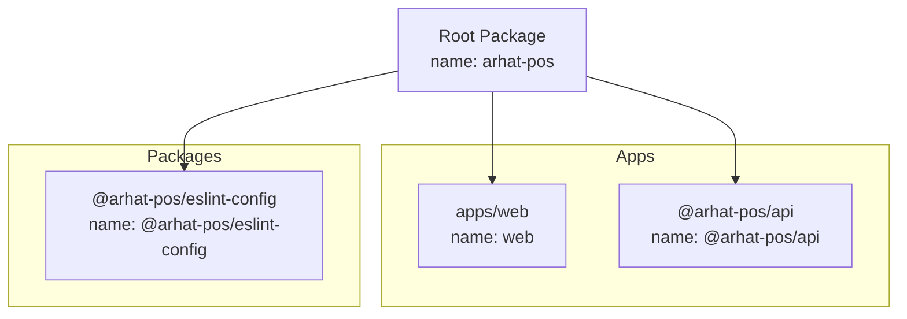
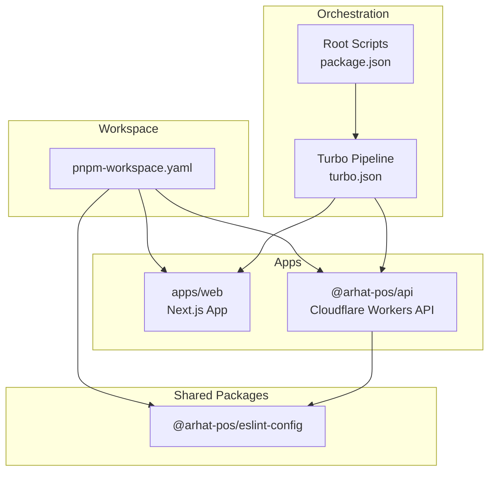
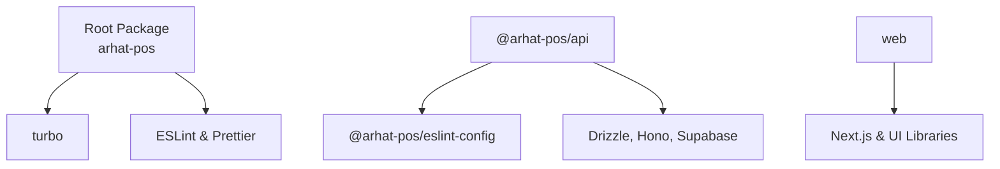

# Monorepo Structure

<cite>
**Referenced Files in This Document**
- [pnpm-workspace.yaml](file://pnpm-workspace.yaml)
- [turbo.json](file://turbo.json)
- [package.json](file://package.json)
- [apps/web/package.json](file://apps/web/package.json)
- [apps/api/package.json](file://apps/api/package.json)
- [packages/eslint-config/package.json](file://packages/eslint-config/package.json)
</cite>

## Table of Contents
1. [Introduction](#introduction)
2. [Project Structure](#project-structure)
3. [Core Components](#core-components)
4. [Architecture Overview](#architecture-overview)
5. [Detailed Component Analysis](#detailed-component-analysis)
6. [Dependency Analysis](#dependency-analysis)
7. [Performance Considerations](#performance-considerations)
8. [Troubleshooting Guide](#troubleshooting-guide)
9. [Conclusion](#conclusion)

## Introduction
This document explains the monorepo structure and workspace management for ARHAT POS, focusing on pnpm workspace configuration, Turbo build system setup, shared packages, and development workflows. It also covers how shared dependencies are managed across applications, the role of ESLint configuration packages, and practical guidance for maintaining consistency and performance in a multi-package environment.

## Project Structure
The repository organizes code into three primary areas:
- apps: Application packages (Next.js web app and a Cloudflare Workers API)
- packages: Shared packages (ESLint config, TypeScript configs, UI components, and shared types)
- root: Workspace configuration and orchestration via pnpm and Turbo

Workspace discovery pattern:
- pnpm discovers packages under apps and packages via the declared globs
- Root scripts delegate to Turbo for cross-package tasks

**Diagram sources**
- [pnpm-workspace.yaml:1-10](file://pnpm-workspace.yaml#L1-L10)
- [package.json:1-30](file://package.json#L1-L30)
- [apps/web/package.json:1-40](file://apps/web/package.json#L1-L40)
- [apps/api/package.json:1-37](file://apps/api/package.json#L1-L37)
- [packages/eslint-config/package.json:1-6](file://packages/eslint-config/package.json#L1-L6)

**Section sources**
- [pnpm-workspace.yaml:1-10](file://pnpm-workspace.yaml#L1-L10)
- [package.json:1-30](file://package.json#L1-L30)

## Core Components
- pnpm workspace configuration defines package discovery and build allowances for specific dependencies.
- Turbo orchestrates pipeline tasks across packages with caching and dependency-aware execution.
- Root scripts provide unified commands for development, building, testing, linting, type checking, and formatting.
- Shared ESLint configuration package centralizes lint rules for consistent enforcement across packages.

Key responsibilities:
- pnpm workspace: Declares package locations and optional build toggles for native dependencies.
- Turbo: Defines task pipelines, cache behavior, and inter-package dependency ordering.
- Root scripts: Delegates to Turbo for scalable task execution.
- Shared ESLint package: Provides reusable lint presets for apps and packages.

**Section sources**
- [pnpm-workspace.yaml:1-10](file://pnpm-workspace.yaml#L1-L10)
- [turbo.json:1-28](file://turbo.json#L1-L28)
- [package.json:10-18](file://package.json#L10-L18)
- [packages/eslint-config/package.json:1-6](file://packages/eslint-config/package.json#L1-L6)

## Architecture Overview
The monorepo architecture leverages pnpm for dependency hoisting and workspace linking, and Turbo for task orchestration and caching. The Next.js web app and the Cloudflare Workers API are separate packages that can share common tooling and configurations via the packages directory.

**Diagram sources**
- [turbo.json:1-28](file://turbo.json#L1-L28)
- [package.json:10-18](file://package.json#L10-L18)
- [pnpm-workspace.yaml:1-10](file://pnpm-workspace.yaml#L1-L10)
- [apps/web/package.json:1-40](file://apps/web/package.json#L1-L40)
- [apps/api/package.json:1-37](file://apps/api/package.json#L1-L37)
- [packages/eslint-config/package.json:1-6](file://packages/eslint-config/package.json#L1-L6)

## Detailed Component Analysis

### pnpm Workspace Configuration
Purpose:
- Declares package discovery patterns for apps and packages.
- Enables selective build allowances for native dependencies (e.g., esbuild, msw, sharp, unrs-resolver, workerd).

Behavior:
- Packages under apps and packages are included automatically.
- Build allowances can be toggled per dependency to control native compilation during CI or constrained environments.

Best practices:
- Keep globs minimal and explicit to avoid unintended package inclusion.
- Use build allowances judiciously to prevent unnecessary native builds in CI.

**Section sources**
- [pnpm-workspace.yaml:1-10](file://pnpm-workspace.yaml#L1-L10)

### Turbo Build System Setup
Pipeline definition highlights:
- build: Depends on upstream packages (^build), caches outputs (dist, .next), and is cache-enabled.
- lint, type-check, test: Defined without outputs and cache disabled to ensure correctness and reproducibility.
- dev: Persistent task with cache disabled to support long-running development servers.

Root scripts:
- dev, build, test, lint, type-check, format are delegated to Turbo for cross-package execution.
- prepare installs Husky hooks for Git integration.

Recommendations:
- Add globalDependencies for environment files (.env.local) to ensure secrets are available across tasks.
- Consider adding outputs for lint/type-check/test if you want caching behavior.

**Section sources**
- [turbo.json:1-28](file://turbo.json#L1-L28)
- [package.json:10-18](file://package.json#L10-L18)

### Apps: Next.js Web App
Package characteristics:
- Private package with Next.js-specific scripts and dependencies.
- Includes UI libraries, state management, and design-related tooling.

Integration points:
- Uses shared ESLint configuration via the root ESLint package.
- Leverages Tailwind CSS v4 and related tooling.

Development patterns:
- Run dev/build/start via Next.js scripts.
- Use lint script for ESLint checks.

**Section sources**
- [apps/web/package.json:1-40](file://apps/web/package.json#L1-L40)

### Apps: Cloudflare Workers API
Package characteristics:
- Private package with a Cloudflare Workers entrypoint and deployment scripts.
- Uses Drizzle ORM, Supabase client, and Hono server framework.

Integration points:
- Consumes shared ESLint configuration via workspace protocol.
- Uses Vitest for testing and Wrangler for deployment.

Development patterns:
- Use dev to watch and run local TypeScript entrypoint.
- Use deploy to build and push to Cloudflare Workers.

**Section sources**
- [apps/api/package.json:1-37](file://apps/api/package.json#L1-L37)

### Shared Packages: ESLint Config
Package characteristics:
- Provides a reusable ESLint configuration package.
- Consumed by apps and other packages via workspace protocol.

Usage:
- Installed as @arhat-pos/eslint-config with workspace:* version to link to the local package.

Benefits:
- Centralized lint rules across the monorepo.
- Consistent developer experience and code quality enforcement.

**Section sources**
- [packages/eslint-config/package.json:1-6](file://packages/eslint-config/package.json#L1-L6)
- [apps/api/package.json:26-26](file://apps/api/package.json#L26-L26)

### TypeScript Configuration and Shared UI Components
Observation:
- The packages directory includes folders for eslint-config, types, typescript-config, and ui.
- TypeScript configuration files referenced in the project structure are not present in the repository snapshot.

Implications:
- Shared TypeScript configs and UI components are planned but not yet materialized in this snapshot.
- The absence of tsconfig.json files in the referenced apps indicates that per-app TS configs are used instead of centralized ones.

Recommendations:
- Implement shared TypeScript configs in packages/typescript-config to reduce duplication and enforce consistent compiler options.
- Develop shared UI components in packages/ui to promote reuse across apps.

**Section sources**
- [pnpm-workspace.yaml:2-3](file://pnpm-workspace.yaml#L2-L3)

## Dependency Analysis
Workspace dependencies and relationships:
- Root package depends on Turbo and other tooling for orchestration.
- API package depends on the shared ESLint configuration via workspace protocol.
- Both apps depend on tooling and frameworks defined in their respective package.json files.

**Diagram sources**
- [package.json:19-28](file://package.json#L19-L28)
- [apps/api/package.json:13-35](file://apps/api/package.json#L13-L35)
- [apps/web/package.json:11-38](file://apps/web/package.json#L11-L38)
- [packages/eslint-config/package.json:1-6](file://packages/eslint-config/package.json#L1-L6)

**Section sources**
- [package.json:19-28](file://package.json#L19-L28)
- [apps/api/package.json:13-35](file://apps/api/package.json#L13-L35)
- [apps/web/package.json:11-38](file://apps/web/package.json#L11-L38)
- [packages/eslint-config/package.json:1-6](file://packages/eslint-config/package.json#L1-L6)

## Performance Considerations
- Turbo caching: Enable caching for build tasks and consider enabling cache for lint/type-check/test if appropriate for your workflow.
- Parallelization: Use turbo run dev --parallel to start multiple apps concurrently.
- Lockfile stability: Keep pnpm-lock.yaml updated to ensure deterministic installs across environments.
- Workspace linking: Prefer workspace protocol for internal packages to avoid redundant installs.

## Troubleshooting Guide
Common issues and resolutions:
- Missing shared TypeScript configs: Implement packages/typescript-config and reference them from apps to avoid duplication.
- Native dependency builds in CI: Configure pnpm workspace build allowances to disable problematic native builds.
- Inconsistent linting: Ensure all packages consume @arhat-pos/eslint-config via workspace protocol to maintain uniform rules.
- Task caching: If lint/type-check/test results appear stale, temporarily disable cache or add outputs to turbo.json for those tasks.

**Section sources**
- [pnpm-workspace.yaml:4-9](file://pnpm-workspace.yaml#L4-L9)
- [turbo.json:7-8](file://turbo.json#L7-L8)
- [turbo.json:10-21](file://turbo.json#L10-L21)
- [packages/eslint-config/package.json:1-6](file://packages/eslint-config/package.json#L1-L6)

## Conclusion
ARHAT POS employs a pragmatic monorepo setup using pnpm for workspace management and Turbo for task orchestration. The current structure supports two distinct apps with a shared ESLint configuration package. To maximize benefits—such as improved developer velocity, consistent code quality, and simplified dependency management—the repository should evolve by adding shared TypeScript configurations and UI components under packages. Adopting these enhancements will further streamline development workflows and strengthen cross-package consistency.