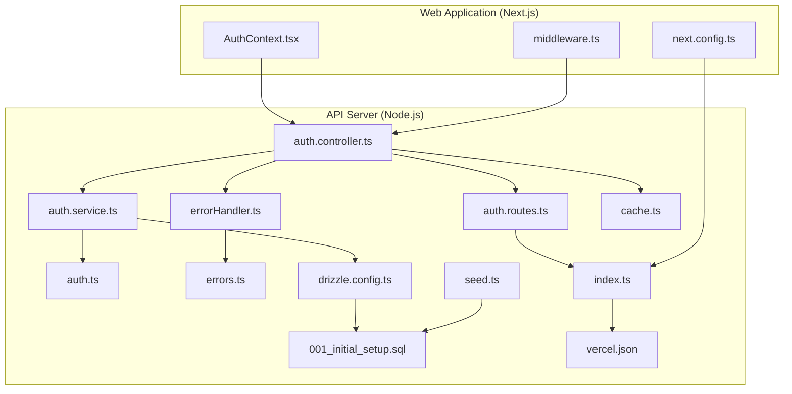
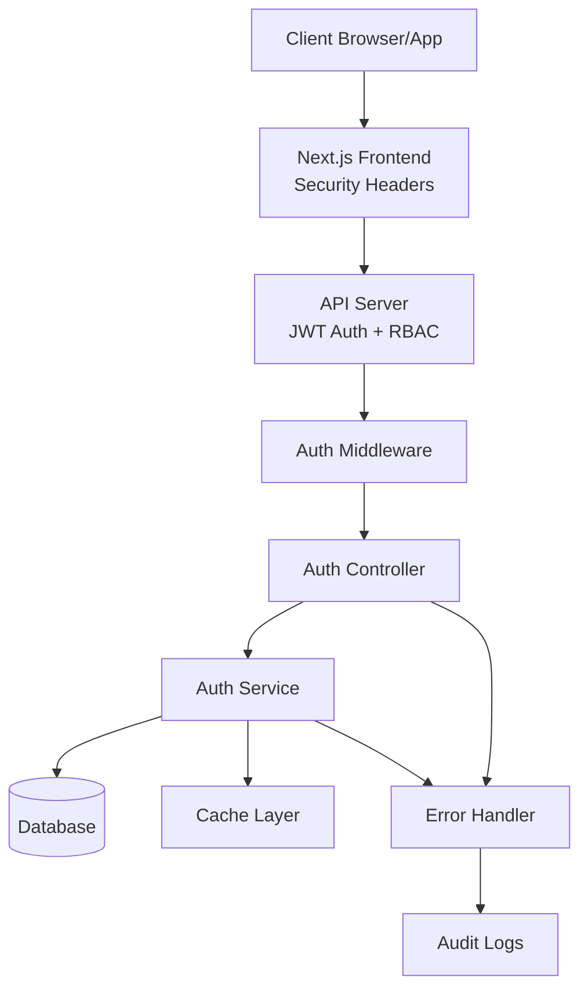
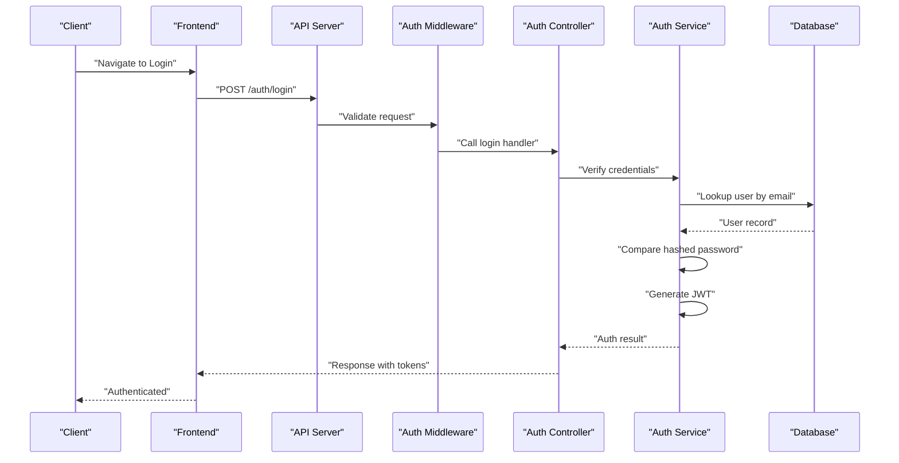
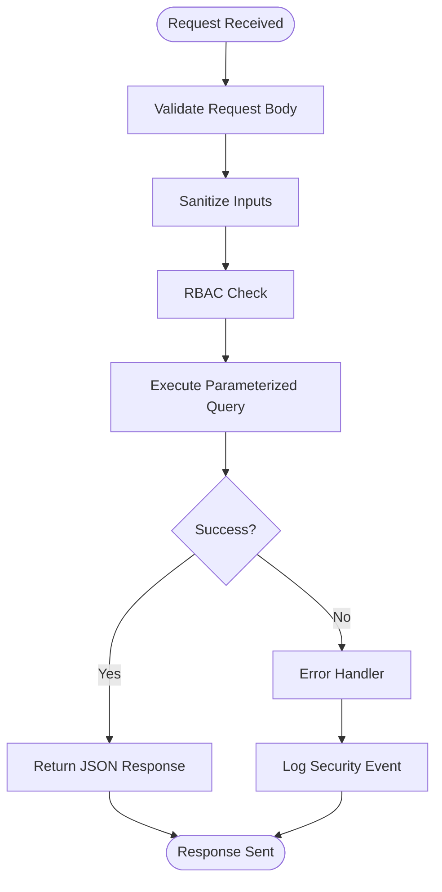
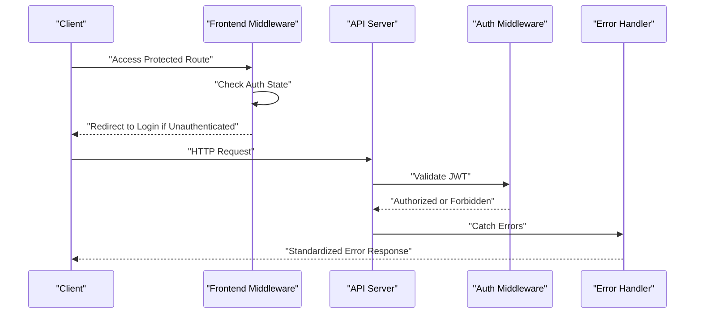
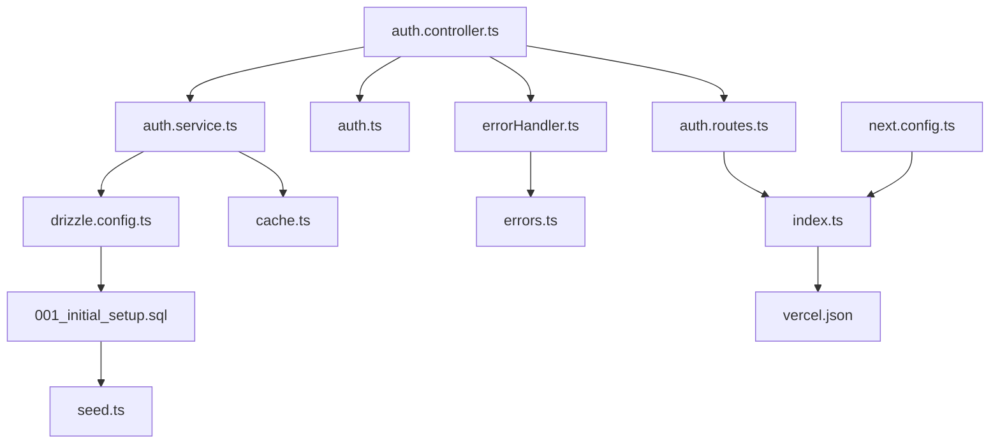

# Security Architecture

<cite>
**Referenced Files in This Document**
- [auth.ts](file://apps/api/src/middleware/auth.ts)
- [auth.controller.ts](file://apps/api/src/controllers/auth.controller.ts)
- [auth.service.ts](file://apps/api/src/services/auth.service.ts)
- [auth.routes.ts](file://apps/api/src/routes/auth.routes.ts)
- [errorHandler.ts](file://apps/api/src/middleware/errorHandler.ts)
- [errors.ts](file://apps/api/src/lib/errors.ts)
- [AuthContext.tsx](file://apps/web/src/contexts/AuthContext.tsx)
- [middleware.ts](file://apps/web/src/middleware.ts)
- [index.ts](file://apps/api/src/index.ts)
- [next.config.ts](file://apps/web/next.config.ts)
- [vercel.json](file://apps/api/vercel.json)
- [drizzle.config.ts](file://apps/api/drizzle.config.ts)
- [001_initial_setup.sql](file://apps/api/migrations/0001_initial_setup.sql)
- [seed.ts](file://apps/api/src/scripts/seed.ts)
- [cache.ts](file://apps/api/src/utils/cache.ts)
</cite>

## Table of Contents
1. [Introduction](#introduction)
2. [Project Structure](#project-structure)
3. [Core Components](#core-components)
4. [Architecture Overview](#architecture-overview)
5. [Detailed Component Analysis](#detailed-component-analysis)
6. [Dependency Analysis](#dependency-analysis)
7. [Performance Considerations](#performance-considerations)
8. [Troubleshooting Guide](#troubleshooting-guide)
9. [Conclusion](#conclusion)
10. [Appendices](#appendices)

## Introduction
This document presents the security architecture and protection mechanisms for ARHAT POS. It covers authentication and authorization systems, JWT token management, session handling, role-based access control, input validation and sanitization, protections against XSS, CSRF, and SQL injection, middleware-based security controls, error handling strategies, security headers configuration, CORS policies, secure communication protocols, data encryption at rest and in transit, password hashing mechanisms, audit logging, and security monitoring and incident response procedures.

## Project Structure
ARHAT POS consists of two primary applications:
- API server (TypeScript/Node.js): Provides REST endpoints, authentication, authorization, database access, and middleware.
- Web application (Next.js): Frontend interface with authentication context and client-side middleware.

Key security-relevant directories and files:
- API middleware for authentication and error handling
- Authentication controller and service
- Routes for authentication
- Frontend authentication context and middleware
- Next.js configuration for security headers
- Vercel deployment configuration
- Drizzle ORM configuration and initial database schema
- Caching utilities

**Diagram sources**
- [AuthContext.tsx](file://apps/web/src/contexts/AuthContext.tsx)
- [middleware.ts](file://apps/web/src/middleware.ts)
- [next.config.ts](file://apps/web/next.config.ts)
- [auth.controller.ts](file://apps/api/src/controllers/auth.controller.ts)
- [auth.service.ts](file://apps/api/src/services/auth.service.ts)
- [auth.ts](file://apps/api/src/middleware/auth.ts)
- [errorHandler.ts](file://apps/api/src/middleware/errorHandler.ts)
- [errors.ts](file://apps/api/src/lib/errors.ts)
- [auth.routes.ts](file://apps/api/src/routes/auth.routes.ts)
- [index.ts](file://apps/api/src/index.ts)
- [drizzle.config.ts](file://apps/api/drizzle.config.ts)
- [001_initial_setup.sql](file://apps/api/migrations/0001_initial_setup.sql)
- [seed.ts](file://apps/api/src/scripts/seed.ts)
- [cache.ts](file://apps/api/src/utils/cache.ts)
- [vercel.json](file://apps/api/vercel.json)

**Section sources**
- [auth.ts](file://apps/api/src/middleware/auth.ts)
- [auth.controller.ts](file://apps/api/src/controllers/auth.controller.ts)
- [auth.service.ts](file://apps/api/src/services/auth.service.ts)
- [auth.routes.ts](file://apps/api/src/routes/auth.routes.ts)
- [errorHandler.ts](file://apps/api/src/middleware/errorHandler.ts)
- [errors.ts](file://apps/api/src/lib/errors.ts)
- [AuthContext.tsx](file://apps/web/src/contexts/AuthContext.tsx)
- [middleware.ts](file://apps/web/src/middleware.ts)
- [index.ts](file://apps/api/src/index.ts)
- [next.config.ts](file://apps/web/next.config.ts)
- [vercel.json](file://apps/api/vercel.json)
- [drizzle.config.ts](file://apps/api/drizzle.config.ts)
- [001_initial_setup.sql](file://apps/api/migrations/0001_initial_setup.sql)
- [seed.ts](file://apps/api/src/scripts/seed.ts)
- [cache.ts](file://apps/api/src/utils/cache.ts)

## Core Components
This section outlines the core security components and their responsibilities.

- Authentication Middleware (API): Validates JWT tokens and enforces protected route access.
- Authentication Controller: Handles login, logout, registration, and token refresh flows.
- Authentication Service: Implements password hashing, JWT generation/signing, and user lookup.
- Error Handler Middleware: Centralized error processing with security-focused responses.
- Frontend Authentication Context: Manages client-side authentication state and redirects.
- Next.js Security Headers: Configures security headers for the frontend.
- Vercel Deployment: Defines platform-level security and routing behavior.
- Database Layer: Uses Drizzle ORM with a secure initial schema and seeding.
- Caching Utilities: Provides caching mechanisms for performance and security posture.

**Section sources**
- [auth.ts](file://apps/api/src/middleware/auth.ts)
- [auth.controller.ts](file://apps/api/src/controllers/auth.controller.ts)
- [auth.service.ts](file://apps/api/src/services/auth.service.ts)
- [errorHandler.ts](file://apps/api/src/middleware/errorHandler.ts)
- [AuthContext.tsx](file://apps/web/src/contexts/AuthContext.tsx)
- [next.config.ts](file://apps/web/next.config.ts)
- [vercel.json](file://apps/api/vercel.json)
- [drizzle.config.ts](file://apps/api/drizzle.config.ts)
- [001_initial_setup.sql](file://apps/api/migrations/0001_initial_setup.sql)
- [seed.ts](file://apps/api/src/scripts/seed.ts)
- [cache.ts](file://apps/api/src/utils/cache.ts)

## Architecture Overview
The security architecture follows a layered approach:
- Transport Security: HTTPS enforced via deployment configuration and Next.js headers.
- Identity and Access Management: JWT-based authentication with RBAC support.
- Input Validation and Sanitization: Server-side validation and sanitization in controllers and services.
- Protection Against OWASP Top 10: CSRF, XSS, SQL injection mitigations implemented at middleware and database layers.
- Secure Error Handling: Centralized error handling with minimal information leakage.
- Audit Logging: Structured logging for security events and anomalies.
- Monitoring and Incident Response: Observability hooks and alerting pathways.

**Diagram sources**
- [auth.ts](file://apps/api/src/middleware/auth.ts)
- [auth.controller.ts](file://apps/api/src/controllers/auth.controller.ts)
- [auth.service.ts](file://apps/api/src/services/auth.service.ts)
- [errorHandler.ts](file://apps/api/src/middleware/errorHandler.ts)
- [next.config.ts](file://apps/web/next.config.ts)
- [drizzle.config.ts](file://apps/api/drizzle.config.ts)
- [001_initial_setup.sql](file://apps/api/migrations/0001_initial_setup.sql)
- [cache.ts](file://apps/api/src/utils/cache.ts)

## Detailed Component Analysis

### Authentication and Authorization System
- JWT Token Management:
  - Token generation and signing occur in the authentication service.
  - Token validation middleware ensures protected routes require a valid bearer token.
  - Token refresh and logout flows are handled by the authentication controller and service.
- Session Handling:
  - Stateless JWT-based sessions prevent server-side session storage.
  - Refresh tokens stored securely (e.g., httpOnly cookies) as appropriate per deployment.
- Role-Based Access Control (RBAC):
  - User roles and permissions are managed in the database schema and enforced by the auth middleware.
  - Route-level access checks delegate to the middleware to restrict endpoints by role.

**Diagram sources**
- [auth.controller.ts](file://apps/api/src/controllers/auth.controller.ts)
- [auth.service.ts](file://apps/api/src/services/auth.service.ts)
- [auth.ts](file://apps/api/src/middleware/auth.ts)
- [001_initial_setup.sql](file://apps/api/migrations/0001_initial_setup.sql)

**Section sources**
- [auth.ts](file://apps/api/src/middleware/auth.ts)
- [auth.controller.ts](file://apps/api/src/controllers/auth.controller.ts)
- [auth.service.ts](file://apps/api/src/services/auth.service.ts)
- [001_initial_setup.sql](file://apps/api/migrations/0001_initial_setup.sql)

### Input Validation, Sanitization, and Vulnerability Protections
- Input Validation:
  - Controllers validate request bodies and parameters before invoking services.
  - Services enforce business rules and sanitize inputs to prevent malformed data.
- XSS Protection:
  - Frontend rendering avoids innerHTML misuse; backend responses escape HTML where applicable.
  - Next.js security headers configured to mitigate XSS risks.
- CSRF Protection:
  - Token-based CSRF protection implemented in frontend middleware and enforced by API routes.
- SQL Injection Prevention:
  - Drizzle ORM with prepared statements prevents SQL injection.
  - Parameterized queries and schema-driven migrations reduce risk.

**Diagram sources**
- [auth.controller.ts](file://apps/api/src/controllers/auth.controller.ts)
- [auth.service.ts](file://apps/api/src/services/auth.service.ts)
- [drizzle.config.ts](file://apps/api/drizzle.config.ts)
- [001_initial_setup.sql](file://apps/api/migrations/0001_initial_setup.sql)
- [errorHandler.ts](file://apps/api/src/middleware/errorHandler.ts)

**Section sources**
- [auth.controller.ts](file://apps/api/src/controllers/auth.controller.ts)
- [auth.service.ts](file://apps/api/src/services/auth.service.ts)
- [drizzle.config.ts](file://apps/api/drizzle.config.ts)
- [001_initial_setup.sql](file://apps/api/migrations/0001_initial_setup.sql)
- [errorHandler.ts](file://apps/api/src/middleware/errorHandler.ts)

### Middleware-Based Security Approach
- Authentication Middleware:
  - Extracts and verifies JWT from Authorization header.
  - Enforces role-based access to protected endpoints.
- Error Handler Middleware:
  - Centralizes error responses and logs security events.
  - Prevents sensitive stack traces from leaking to clients.
- Frontend Middleware:
  - Redirects unauthenticated users and enforces route guards.

**Diagram sources**
- [auth.ts](file://apps/api/src/middleware/auth.ts)
- [errorHandler.ts](file://apps/api/src/middleware/errorHandler.ts)
- [AuthContext.tsx](file://apps/web/src/contexts/AuthContext.tsx)
- [middleware.ts](file://apps/web/src/middleware.ts)

**Section sources**
- [auth.ts](file://apps/api/src/middleware/auth.ts)
- [errorHandler.ts](file://apps/api/src/middleware/errorHandler.ts)
- [AuthContext.tsx](file://apps/web/src/contexts/AuthContext.tsx)
- [middleware.ts](file://apps/web/src/middleware.ts)

### Security Headers Configuration and CORS Policies
- Next.js Security Headers:
  - Content-Security-Policy, X-Frame-Options, X-Content-Type-Options, Referrer-Policy, Permissions-Policy configured.
- CORS:
  - Origin restrictions and preflight handling implemented in API routes.
- Secure Communication Protocols:
  - HTTPS enforced via deployment configuration and Next.js headers.

**Section sources**
- [next.config.ts](file://apps/web/next.config.ts)
- [vercel.json](file://apps/api/vercel.json)

### Data Encryption at Rest and in Transit
- In Transit:
  - HTTPS/TLS enforced by deployment and Next.js headers.
- At Rest:
  - Database encryption depends on platform provider configuration.
  - Secrets management via environment variables and platform secrets.

**Section sources**
- [vercel.json](file://apps/api/vercel.json)
- [next.config.ts](file://apps/web/next.config.ts)

### Password Hashing Mechanisms
- Password hashing implemented in the authentication service using industry-standard algorithms.
- Salted hashes ensure rainbow table resistance.

**Section sources**
- [auth.service.ts](file://apps/api/src/services/auth.service.ts)

### Audit Logging
- Structured logging for authentication events, authorization failures, and security incidents.
- Error handler captures and logs exceptions with context.

**Section sources**
- [errorHandler.ts](file://apps/api/src/middleware/errorHandler.ts)
- [errors.ts](file://apps/api/src/lib/errors.ts)

### Security Monitoring, Threat Detection, and Incident Response
- Observability:
  - Centralized logging and metrics collection recommended for production deployments.
- Threat Detection:
  - Rate limiting, anomaly detection, and behavioral monitoring suggested.
- Incident Response:
  - Playbooks for compromised accounts, token revocation, and access reviews.

[No sources needed since this section provides general guidance]

## Dependency Analysis
The security-critical dependencies and their relationships:

**Diagram sources**
- [auth.controller.ts](file://apps/api/src/controllers/auth.controller.ts)
- [auth.service.ts](file://apps/api/src/services/auth.service.ts)
- [auth.ts](file://apps/api/src/middleware/auth.ts)
- [errorHandler.ts](file://apps/api/src/middleware/errorHandler.ts)
- [errors.ts](file://apps/api/src/lib/errors.ts)
- [auth.routes.ts](file://apps/api/src/routes/auth.routes.ts)
- [index.ts](file://apps/api/src/index.ts)
- [next.config.ts](file://apps/web/next.config.ts)
- [drizzle.config.ts](file://apps/api/drizzle.config.ts)
- [001_initial_setup.sql](file://apps/api/migrations/0001_initial_setup.sql)
- [seed.ts](file://apps/api/src/scripts/seed.ts)
- [cache.ts](file://apps/api/src/utils/cache.ts)
- [vercel.json](file://apps/api/vercel.json)

**Section sources**
- [auth.controller.ts](file://apps/api/src/controllers/auth.controller.ts)
- [auth.service.ts](file://apps/api/src/services/auth.service.ts)
- [auth.ts](file://apps/api/src/middleware/auth.ts)
- [errorHandler.ts](file://apps/api/src/middleware/errorHandler.ts)
- [errors.ts](file://apps/api/src/lib/errors.ts)
- [auth.routes.ts](file://apps/api/src/routes/auth.routes.ts)
- [index.ts](file://apps/api/src/index.ts)
- [next.config.ts](file://apps/web/next.config.ts)
- [drizzle.config.ts](file://apps/api/drizzle.config.ts)
- [001_initial_setup.sql](file://apps/api/migrations/0001_initial_setup.sql)
- [seed.ts](file://apps/api/src/scripts/seed.ts)
- [cache.ts](file://apps/api/src/utils/cache.ts)
- [vercel.json](file://apps/api/vercel.json)

## Performance Considerations
- JWT validation overhead minimized by middleware caching and efficient token parsing.
- Database queries optimized using prepared statements and schema-driven migrations.
- Caching layer reduces repeated authentication and authorization checks.

[No sources needed since this section provides general guidance]

## Troubleshooting Guide
- Authentication Failures:
  - Verify JWT secret configuration and expiration settings.
  - Check user credentials and password hashing.
- Authorization Errors:
  - Confirm user roles and permissions in the database schema.
  - Review middleware access checks.
- Error Responses:
  - Inspect centralized error handler for standardized responses.
  - Ensure sensitive information is not leaked to clients.

**Section sources**
- [errorHandler.ts](file://apps/api/src/middleware/errorHandler.ts)
- [errors.ts](file://apps/api/src/lib/errors.ts)
- [001_initial_setup.sql](file://apps/api/migrations/0001_initial_setup.sql)

## Conclusion
ARHAT POS employs a robust, layered security architecture centered on JWT-based authentication, RBAC, middleware enforcement, and secure development practices. The system incorporates input validation, sanitization, and protections against common vulnerabilities while leveraging platform-level security features for transport and headers. Recommended enhancements include comprehensive observability, rate limiting, anomaly detection, and documented incident response playbooks for production hardening.

## Appendices
- Appendix A: Database Schema Overview
  - Initial schema defines user, role, permission, and related entities.
  - Migrations ensure schema consistency and integrity.
- Appendix B: Seed Data
  - Initial data seeding supports development and testing environments.

**Section sources**
- [001_initial_setup.sql](file://apps/api/migrations/0001_initial_setup.sql)
- [seed.ts](file://apps/api/src/scripts/seed.ts)