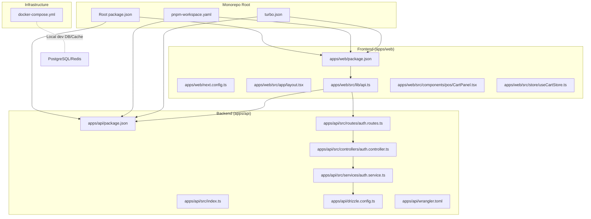
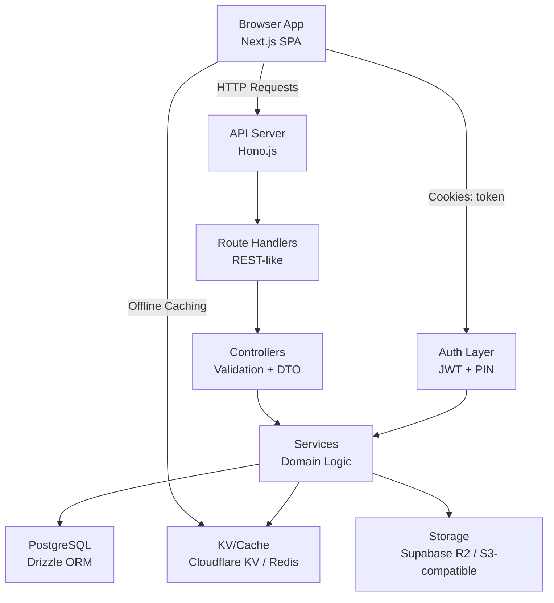
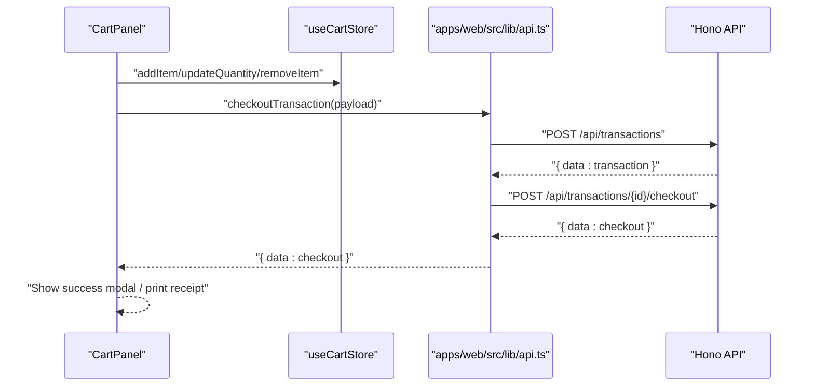
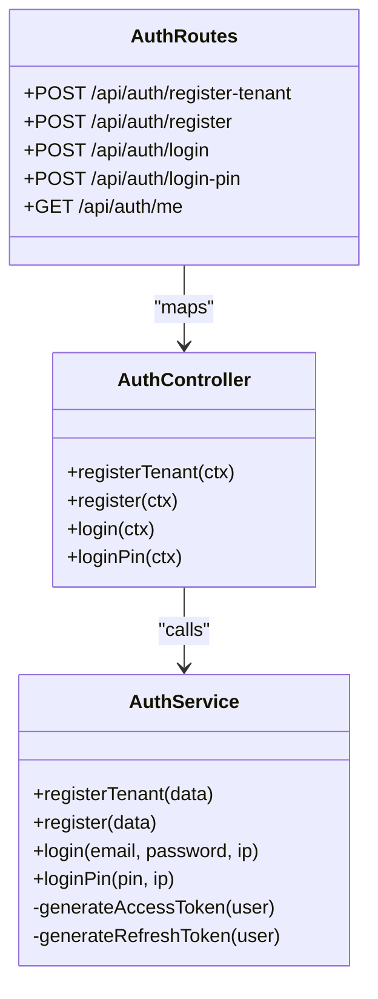
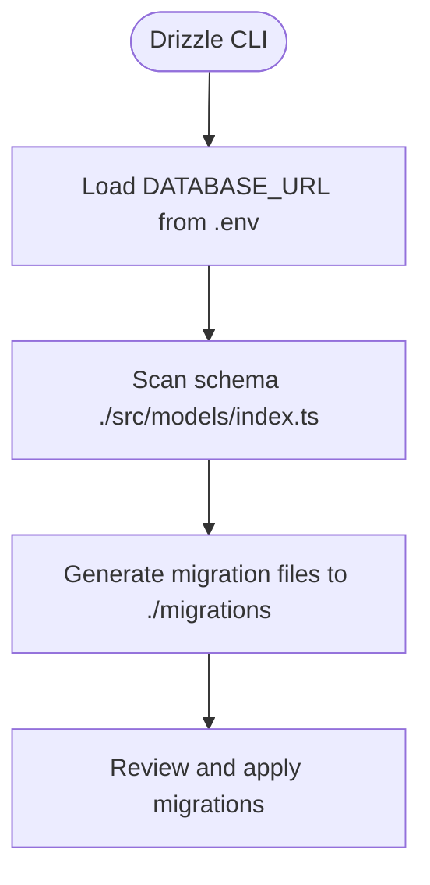
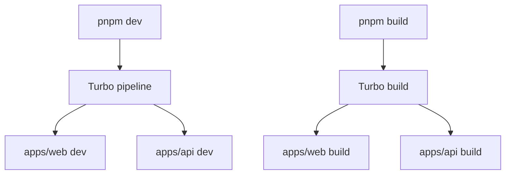
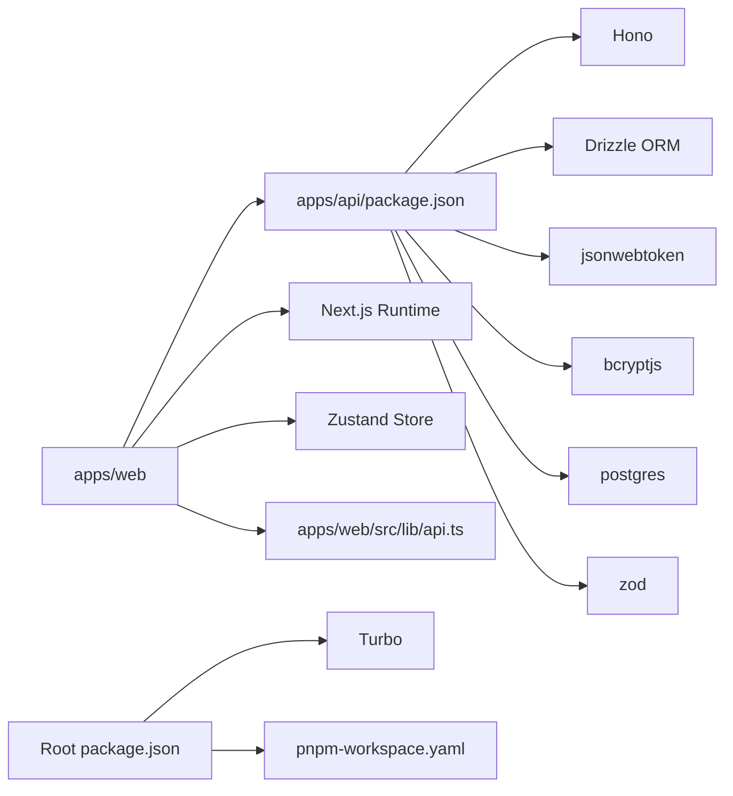

# System Overview

<cite>
**Referenced Files in This Document**
- [README.md](file://README.md)
- [package.json](file://package.json)
- [pnpm-workspace.yaml](file://pnpm-workspace.yaml)
- [turbo.json](file://turbo.json)
- [apps/api/package.json](file://apps/api/package.json)
- [apps/web/package.json](file://apps/web/package.json)
- [apps/api/src/index.ts](file://apps/api/src/index.ts)
- [apps/api/src/controllers/auth.controller.ts](file://apps/api/src/controllers/auth.controller.ts)
- [apps/api/src/routes/auth.routes.ts](file://apps/api/src/routes/auth.routes.ts)
- [apps/api/src/services/auth.service.ts](file://apps/api/src/services/auth.service.ts)
- [apps/web/src/lib/api.ts](file://apps/web/src/lib/api.ts)
- [apps/web/src/app/layout.tsx](file://apps/web/src/app/layout.tsx)
- [apps/web/src/components/pos/CartPanel.tsx](file://apps/web/src/components/pos/CartPanel.tsx)
- [apps/web/src/store/useCartStore.ts](file://apps/web/src/store/useCartStore.ts)
- [apps/api/drizzle.config.ts](file://apps/api/drizzle.config.ts)
- [docker-compose.yml](file://docker-compose.yml)
- [apps/api/wrangler.toml](file://apps/api/wrangler.toml)
- [apps/web/next.config.ts](file://apps/web/next.config.ts)
</cite>

## Table of Contents
1. [Introduction](#introduction)
2. [Project Structure](#project-structure)
3. [Core Components](#core-components)
4. [Architecture Overview](#architecture-overview)
5. [Detailed Component Analysis](#detailed-component-analysis)
6. [Dependency Analysis](#dependency-analysis)
7. [Performance Considerations](#performance-considerations)
8. [Troubleshooting Guide](#troubleshooting-guide)
9. [Conclusion](#conclusion)
10. [Appendices](#appendices)

## Introduction
ARHAT POS is a cloud-based Point of Sale and business management platform designed for Indonesian UMKM. It integrates POS transactions, inventory management, customer relationship management (CRM), reporting, and WhatsApp notifications into a single system. The platform targets diverse business types including retail stores, cafes, restaurants, laundries, workshops, and multi-outlet enterprises. The system emphasizes real-time insights, operational digitization, and scalable growth from startup to enterprise scale.

Key goals:
- Digitize daily operations and reduce manual record-keeping errors
- Provide real-time dashboards and sales analytics
- Enable multi-outlet and subscription-based growth
- Deliver responsive, offline-aware experiences for field workers

**Section sources**
- [README.md:1-574](file://README.md#L1-L574)

## Project Structure
The repository follows a monorepo architecture using pnpm workspaces and Turbo for orchestration:
- apps/web: Next.js 16 frontend application (React 19, TypeScript)
- apps/api: Hono.js API server (Cloudflare Workers-compatible)
- packages: Shared configs and UI packages
- Root scripts and pipeline orchestrate builds, tests, and linting across apps

**Diagram sources**
- [package.json:1-30](file://package.json#L1-L30)
- [pnpm-workspace.yaml:1-10](file://pnpm-workspace.yaml#L1-L10)
- [turbo.json:1-28](file://turbo.json#L1-L28)
- [apps/web/package.json:1-40](file://apps/web/package.json#L1-L40)
- [apps/api/package.json:1-37](file://apps/api/package.json#L1-L37)
- [apps/web/next.config.ts:1-17](file://apps/web/next.config.ts#L1-L17)
- [apps/web/src/app/layout.tsx:1-60](file://apps/web/src/app/layout.tsx#L1-L60)
- [apps/web/src/lib/api.ts:1-618](file://apps/web/src/lib/api.ts#L1-L618)
- [apps/web/src/components/pos/CartPanel.tsx:1-497](file://apps/web/src/components/pos/CartPanel.tsx#L1-L497)
- [apps/web/src/store/useCartStore.ts:1-184](file://apps/web/src/store/useCartStore.ts#L1-L184)
- [apps/api/src/index.ts:1-99](file://apps/api/src/index.ts#L1-L99)
- [apps/api/src/routes/auth.routes.ts:1-18](file://apps/api/src/routes/auth.routes.ts#L1-L18)
- [apps/api/src/controllers/auth.controller.ts:1-91](file://apps/api/src/controllers/auth.controller.ts#L1-L91)
- [apps/api/src/services/auth.service.ts:1-254](file://apps/api/src/services/auth.service.ts#L1-L254)
- [apps/api/drizzle.config.ts:1-13](file://apps/api/drizzle.config.ts#L1-L13)
- [apps/api/wrangler.toml:1-10](file://apps/api/wrangler.toml#L1-L10)
- [docker-compose.yml:1-43](file://docker-compose.yml#L1-L43)

**Section sources**
- [package.json:1-30](file://package.json#L1-L30)
- [pnpm-workspace.yaml:1-10](file://pnpm-workspace.yaml#L1-L10)
- [turbo.json:1-28](file://turbo.json#L1-L28)

## Core Components
- Frontend (Next.js Web Application)
  - Built with React 19, TypeScript, Tailwind CSS, and Shadcn/UI
  - Provides POS, product management, inventory, CRM, analytics, and user management views
  - Offline-first UX via IndexedDB caching and sync queues
- Backend (Hono.js API Server)
  - Minimal, fast HTTP framework with middleware support
  - Modular route/controller/service layers
  - Drizzle ORM for schema-driven database operations
  - Authentication via JWT and PIN-based login
- Monorepo Orchestration
  - pnpm workspaces for shared dependencies and linking
  - Turbo pipeline for incremental builds, caching, and parallelization
- Infrastructure
  - Local development with Docker Compose (PostgreSQL, Redis, pgAdmin)
  - Cloudflare Workers for API deployment (wrangler.toml)
  - Supabase storage/cache placeholders in tech stack

**Section sources**
- [apps/web/package.json:1-40](file://apps/web/package.json#L1-L40)
- [apps/api/package.json:1-37](file://apps/api/package.json#L1-L37)
- [apps/api/src/index.ts:1-99](file://apps/api/src/index.ts#L1-L99)
- [apps/web/src/lib/api.ts:1-618](file://apps/web/src/lib/api.ts#L1-L618)
- [docker-compose.yml:1-43](file://docker-compose.yml#L1-L43)
- [apps/api/wrangler.toml:1-10](file://apps/api/wrangler.toml#L1-L10)
- [README.md:403-515](file://README.md#L403-L515)

## Architecture Overview
The system separates concerns across frontend and backend while maintaining a cohesive API contract. The frontend consumes REST-like endpoints exposed by the backend, with offline capabilities and optimistic updates. The backend exposes modular routes grouped by domain (authentication, products, transactions, analytics, inventory, CRM, shifts, users, and WhatsApp). Authentication is handled centrally, returning JWT tokens stored in cookies for subsequent requests.

**Diagram sources**
- [apps/web/src/lib/api.ts:1-618](file://apps/web/src/lib/api.ts#L1-L618)
- [apps/api/src/index.ts:1-99](file://apps/api/src/index.ts#L1-L99)
- [apps/api/src/routes/auth.routes.ts:1-18](file://apps/api/src/routes/auth.routes.ts#L1-L18)
- [apps/api/src/controllers/auth.controller.ts:1-91](file://apps/api/src/controllers/auth.controller.ts#L1-L91)
- [apps/api/src/services/auth.service.ts:1-254](file://apps/api/src/services/auth.service.ts#L1-L254)
- [apps/api/drizzle.config.ts:1-13](file://apps/api/drizzle.config.ts#L1-L13)
- [apps/api/wrangler.toml:1-10](file://apps/api/wrangler.toml#L1-L10)
- [docker-compose.yml:1-43](file://docker-compose.yml#L1-L43)

## Detailed Component Analysis

### Frontend: Next.js Web Application
- Layout and PWA registration establish global providers and app shell
- API client encapsulates base URL, auth headers, and offline fallback logic
- POS panel orchestrates cart state, taxes, discounts, and payment flows
- Zustand store manages cart items, held transactions, and totals

**Diagram sources**
- [apps/web/src/components/pos/CartPanel.tsx:1-497](file://apps/web/src/components/pos/CartPanel.tsx#L1-L497)
- [apps/web/src/store/useCartStore.ts:1-184](file://apps/web/src/store/useCartStore.ts#L1-L184)
- [apps/web/src/lib/api.ts:75-119](file://apps/web/src/lib/api.ts#L75-L119)
- [apps/api/src/index.ts:80-99](file://apps/api/src/index.ts#L80-L99)

**Section sources**
- [apps/web/src/app/layout.tsx:1-60](file://apps/web/src/app/layout.tsx#L1-L60)
- [apps/web/src/lib/api.ts:1-618](file://apps/web/src/lib/api.ts#L1-L618)
- [apps/web/src/components/pos/CartPanel.tsx:1-497](file://apps/web/src/components/pos/CartPanel.tsx#L1-L497)
- [apps/web/src/store/useCartStore.ts:1-184](file://apps/web/src/store/useCartStore.ts#L1-L184)

### Backend: Hono.js API Server
- Central app initializes CORS, logging, health checks, and routes
- Modular routing groups endpoints by domain
- Controllers validate payloads and delegate to services
- Services implement business logic, database transactions, and token generation
- Drizzle config defines schema location and database credentials

**Diagram sources**
- [apps/api/src/routes/auth.routes.ts:1-18](file://apps/api/src/routes/auth.routes.ts#L1-L18)
- [apps/api/src/controllers/auth.controller.ts:1-91](file://apps/api/src/controllers/auth.controller.ts#L1-L91)
- [apps/api/src/services/auth.service.ts:1-254](file://apps/api/src/services/auth.service.ts#L1-L254)

**Section sources**
- [apps/api/src/index.ts:1-99](file://apps/api/src/index.ts#L1-L99)
- [apps/api/src/routes/auth.routes.ts:1-18](file://apps/api/src/routes/auth.routes.ts#L1-L18)
- [apps/api/src/controllers/auth.controller.ts:1-91](file://apps/api/src/controllers/auth.controller.ts#L1-L91)
- [apps/api/src/services/auth.service.ts:1-254](file://apps/api/src/services/auth.service.ts#L1-L254)

### Data Access and Schema
- Drizzle Kit configuration points to the schema and migration output
- PostgreSQL is used for relational data (local via Docker Compose)
- Development environment variables are loaded via dotenv in the config

**Diagram sources**
- [apps/api/drizzle.config.ts:1-13](file://apps/api/drizzle.config.ts#L1-L13)

**Section sources**
- [apps/api/drizzle.config.ts:1-13](file://apps/api/drizzle.config.ts#L1-L13)
- [docker-compose.yml:1-43](file://docker-compose.yml#L1-L43)

### Build and Dev Orchestration
- Root package.json scripts leverage Turbo to run dev/build/test/lint in parallel across apps
- Turbo pipeline defines caching, outputs, and inter-dependency ordering
- pnpm workspace declares package locations and build allowances

**Diagram sources**
- [package.json:10-18](file://package.json#L10-L18)
- [turbo.json:4-26](file://turbo.json#L4-L26)
- [pnpm-workspace.yaml:1-10](file://pnpm-workspace.yaml#L1-L10)

**Section sources**
- [package.json:10-18](file://package.json#L10-L18)
- [turbo.json:4-26](file://turbo.json#L4-L26)
- [pnpm-workspace.yaml:1-10](file://pnpm-workspace.yaml#L1-L10)

## Dependency Analysis
- Frontend depends on:
  - API client for HTTP communication
  - Zustand for state management
  - UI libraries (Tailwind, Shadcn/UI, Recharts)
- Backend depends on:
  - Hono for routing and middleware
  - Drizzle ORM for schema and queries
  - JSON Web Token for auth
  - Bcrypt for password hashing
  - Postgres driver for database connectivity
- Monorepo tooling:
  - pnpm for workspace management
  - Turbo for pipeline orchestration

**Diagram sources**
- [apps/web/package.json:1-40](file://apps/web/package.json#L1-L40)
- [apps/web/src/lib/api.ts:1-618](file://apps/web/src/lib/api.ts#L1-L618)
- [apps/api/package.json:1-37](file://apps/api/package.json#L1-L37)
- [package.json:10-18](file://package.json#L10-L18)
- [pnpm-workspace.yaml:1-10](file://pnpm-workspace.yaml#L1-L10)

**Section sources**
- [apps/web/package.json:1-40](file://apps/web/package.json#L1-L40)
- [apps/api/package.json:1-37](file://apps/api/package.json#L1-L37)
- [apps/web/src/lib/api.ts:1-618](file://apps/web/src/lib/api.ts#L1-L618)

## Performance Considerations
- Frontend
  - Offline-first design: IndexedDB caching and sync queues improve resilience and perceived performance
  - Client-side calculations for taxes and discounts reduce server load during checkout
  - Component-level state management with Zustand minimizes re-renders
- Backend
  - Hono’s minimal footprint reduces overhead
  - Drizzle ORM encourages efficient queries and schema evolution
  - Caching layer (KV/Redis) can accelerate frequent reads
- Build and Dev
  - Turbo caching and incremental builds speed up local iteration
  - Parallel execution of tasks reduces feedback loops

[No sources needed since this section provides general guidance]

## Troubleshooting Guide
Common areas to inspect:
- Authentication failures
  - Verify JWT secrets and PIN logic in the service layer
  - Confirm cookie presence and expiration handling in the API client
- Network errors and offline behavior
  - Check offline sync queue and IndexedDB fallback logic
  - Validate API base URL and CORS origins
- Database connectivity
  - Ensure DATABASE_URL is present and Drizzle config loads environment variables
  - Confirm local PostgreSQL availability via Docker Compose

**Section sources**
- [apps/api/src/services/auth.service.ts:179-209](file://apps/api/src/services/auth.service.ts#L179-L209)
- [apps/web/src/lib/api.ts:17-27](file://apps/web/src/lib/api.ts#L17-L27)
- [apps/web/src/lib/api.ts:99-118](file://apps/web/src/lib/api.ts#L99-L118)
- [apps/api/drizzle.config.ts:1-13](file://apps/api/drizzle.config.ts#L1-L13)
- [docker-compose.yml:1-43](file://docker-compose.yml#L1-L43)

## Conclusion
ARHAT POS combines a modern frontend built on Next.js with a lightweight, modular backend powered by Hono.js. The monorepo structure, driven by pnpm and Turbo, enables scalable development and deployment. The system’s offline-first UX, robust authentication, and modular domain APIs position it well for UMKM growth, from single-store operations to multi-outlet environments. As the platform evolves, the architecture supports further enhancements in caching, storage, and observability aligned with the documented roadmap.

[No sources needed since this section summarizes without analyzing specific files]

## Appendices

### System Boundaries and Functional Domains
- Authentication & User Management
  - Registration, login, PIN-based login, session management
- Point of Sale (POS)
  - Product search, cart management, taxes, discounts, payment methods, receipts
- Product Management
  - CRUD, categories, variants, import/export
- Inventory Management
  - Stock in/out/adjustment/transfer, opname, movement history
- CRM
  - Customer database, purchase history, segmentation, WhatsApp notifications
- Analytics & Reporting
  - Sales, product, profit/loss, and customer analytics
- Multi-Outlet & Settings
  - Outlet management, shift management, user management

**Section sources**
- [README.md:97-372](file://README.md#L97-L372)

### Deployment Topology
- Development
  - Next.js app runs locally; API runs via tsx watcher or Cloudflare Workers
  - PostgreSQL and Redis provisioned via Docker Compose
- Production (Growth Stage)
  - Migrate to VPS with Docker, Nginx reverse proxy
  - Backend can evolve to Golang/Gin while preserving app structure

**Section sources**
- [apps/api/wrangler.toml:1-10](file://apps/api/wrangler.toml#L1-L10)
- [docker-compose.yml:1-43](file://docker-compose.yml#L1-L43)
- [README.md:482-515](file://README.md#L482-L515)