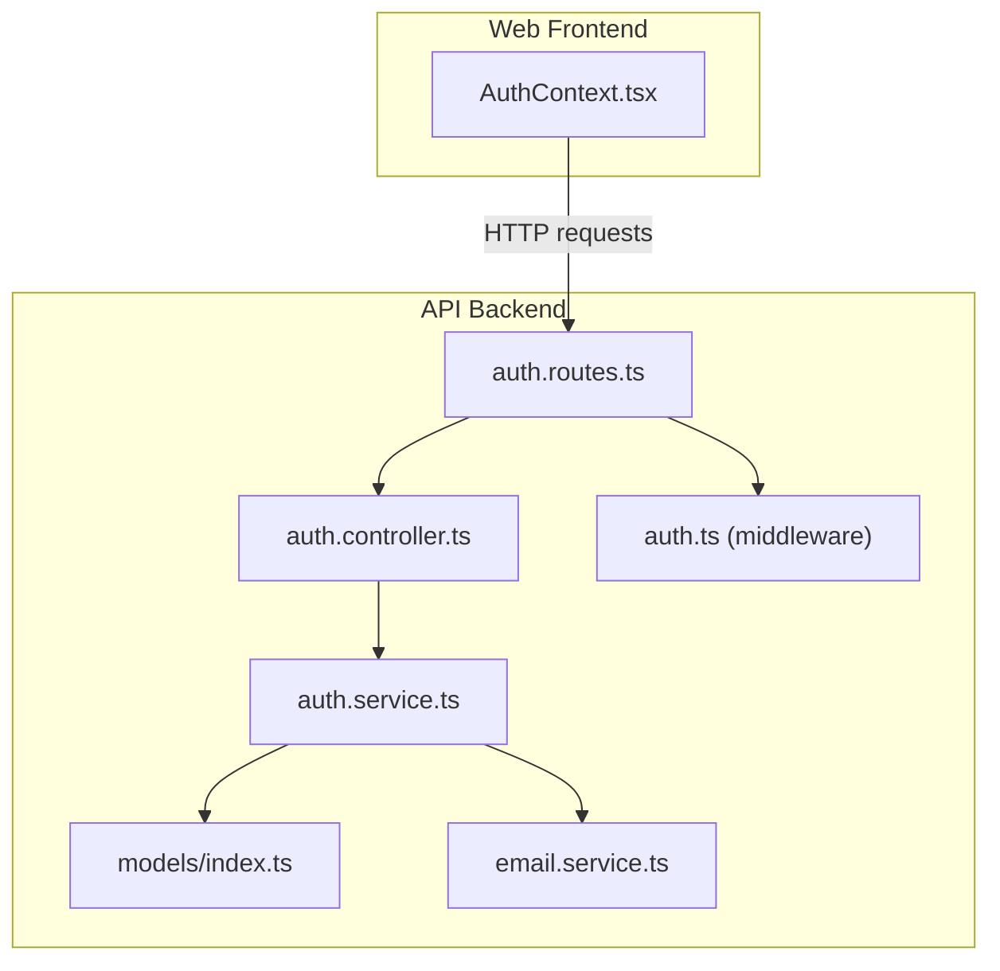
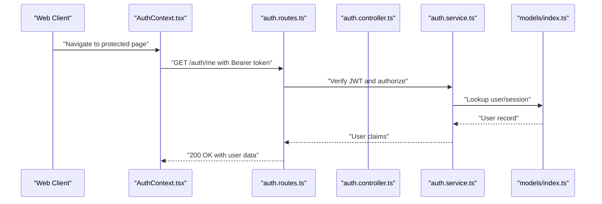
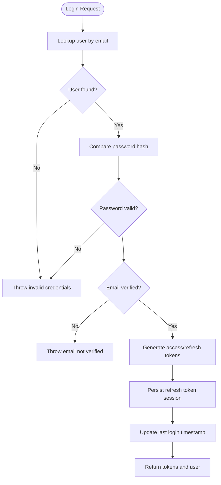
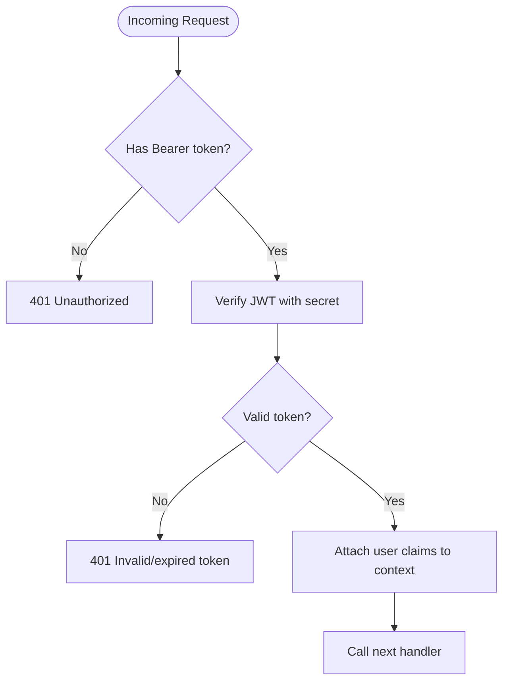
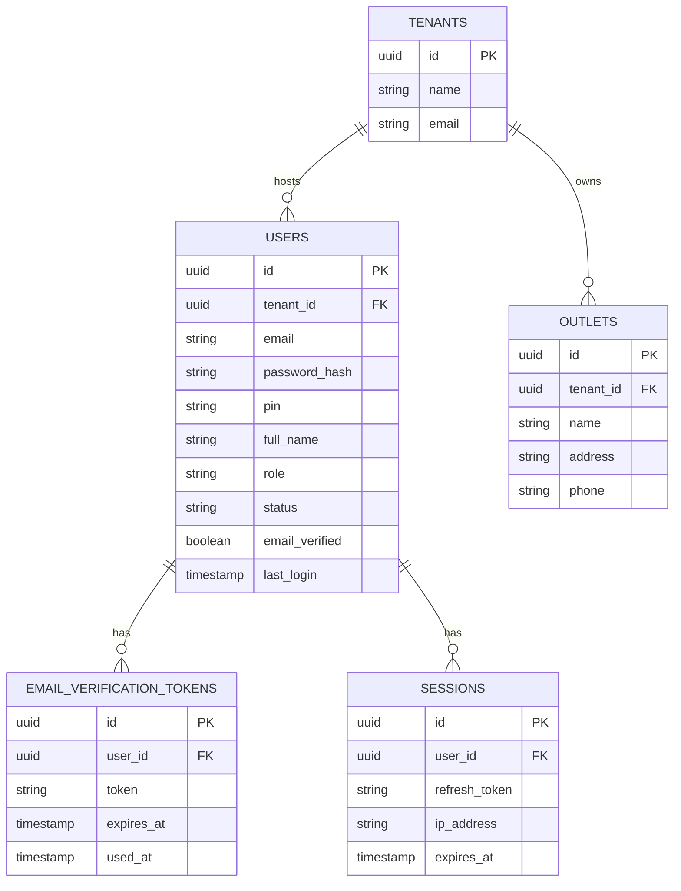
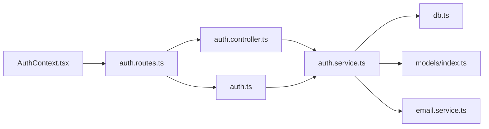

# Authentication & Authorization

<cite>
**Referenced Files in This Document**
- [auth.controller.ts](file://apps/api/src/controllers/auth.controller.ts)
- [auth.service.ts](file://apps/api/src/services/auth.service.ts)
- [auth.ts](file://apps/api/src/middleware/auth.ts)
- [auth.routes.ts](file://apps/api/src/routes/auth.routes.ts)
- [AuthContext.tsx](file://apps/web/src/contexts/AuthContext.tsx)
- [models/index.ts](file://apps/api/src/models/index.ts)
- [db.ts](file://apps/api/src/lib/db.ts)
- [email.service.ts](file://apps/api/src/services/email.service.ts)
- [package.json](file://apps/api/package.json)
</cite>

## Table of Contents
1. [Introduction](#introduction)
2. [Project Structure](#project-structure)
3. [Core Components](#core-components)
4. [Architecture Overview](#architecture-overview)
5. [Detailed Component Analysis](#detailed-component-analysis)
6. [Dependency Analysis](#dependency-analysis)
7. [Performance Considerations](#performance-considerations)
8. [Security Best Practices](#security-best-practices)
9. [Troubleshooting Guide](#troubleshooting-guide)
10. [Conclusion](#conclusion)

## Introduction
This document explains the authentication and authorization mechanisms for ARHAT POS. It covers user registration, login, PIN-based login, email verification, JWT access and refresh tokens, session management, middleware protection, RBAC roles, and frontend authentication state management. It also highlights current implementation gaps (such as password reset and MFA) and outlines recommended mitigations for common security risks.

## Project Structure
Authentication spans backend controllers, services, middleware, database models, and the frontend authentication context. The backend uses Hono for routing, Drizzle ORM for database access, bcrypt for password hashing, and jsonwebtoken for JWT generation and verification.

**Diagram sources**
- [auth.routes.ts:1-18](file://apps/api/src/routes/auth.routes.ts#L1-L18)
- [auth.controller.ts:1-91](file://apps/api/src/controllers/auth.controller.ts#L1-L91)
- [auth.service.ts:1-254](file://apps/api/src/services/auth.service.ts#L1-L254)
- [auth.ts:1-34](file://apps/api/src/middleware/auth.ts#L1-L34)
- [models/index.ts:1-307](file://apps/api/src/models/index.ts#L1-L307)
- [email.service.ts:1-9](file://apps/api/src/services/email.service.ts#L1-L9)
- [AuthContext.tsx:1-84](file://apps/web/src/contexts/AuthContext.tsx#L1-L84)

**Section sources**
- [auth.routes.ts:1-18](file://apps/api/src/routes/auth.routes.ts#L1-L18)
- [auth.controller.ts:1-91](file://apps/api/src/controllers/auth.controller.ts#L1-L91)
- [auth.service.ts:1-254](file://apps/api/src/services/auth.service.ts#L1-L254)
- [auth.ts:1-34](file://apps/api/src/middleware/auth.ts#L1-L34)
- [models/index.ts:1-307](file://apps/api/src/models/index.ts#L1-L307)
- [email.service.ts:1-9](file://apps/api/src/services/email.service.ts#L1-L9)
- [AuthContext.tsx:1-84](file://apps/web/src/contexts/AuthContext.tsx#L1-L84)

## Core Components
- Authentication controller: Validates inputs, delegates to service, and returns structured responses.
- Authentication service: Implements registration, login, PIN login, token generation, session creation, and password hashing.
- Authentication middleware: Extracts and verifies JWT access tokens.
- Routes: Expose endpoints for registration, login, PIN login, and profile retrieval.
- Models: Define users, sessions, email verification tokens, password reset tokens, tenants, and outlets.
- Email service: Provides mock methods for sending verification and password reset emails.
- Frontend AuthContext: Manages authentication state, token persistence, and redirects.

Key implementation highlights:
- Password hashing via bcrypt.
- Access and refresh tokens via jsonwebtoken.
- Session persistence for refresh tokens.
- Role-based fields stored on users (role defaults to cashier).
- Email verification token storage and email delivery hook.

**Section sources**
- [auth.controller.ts:1-91](file://apps/api/src/controllers/auth.controller.ts#L1-L91)
- [auth.service.ts:1-254](file://apps/api/src/services/auth.service.ts#L1-L254)
- [auth.ts:1-34](file://apps/api/src/middleware/auth.ts#L1-L34)
- [auth.routes.ts:1-18](file://apps/api/src/routes/auth.routes.ts#L1-L18)
- [models/index.ts:20-55](file://apps/api/src/models/index.ts#L20-L55)
- [email.service.ts:1-9](file://apps/api/src/services/email.service.ts#L1-L9)
- [AuthContext.tsx:1-84](file://apps/web/src/contexts/AuthContext.tsx#L1-L84)

## Architecture Overview
The authentication flow integrates frontend and backend components. The frontend stores tokens and sends Authorization headers; the backend validates tokens and enforces access control.

**Diagram sources**
- [AuthContext.tsx:33-62](file://apps/web/src/contexts/AuthContext.tsx#L33-L62)
- [auth.routes.ts:12-15](file://apps/api/src/routes/auth.routes.ts#L12-L15)
- [auth.controller.ts:56-71](file://apps/api/src/controllers/auth.controller.ts#L56-L71)
- [auth.service.ts:140-177](file://apps/api/src/services/auth.service.ts#L140-L177)
- [models/index.ts:20-31](file://apps/api/src/models/index.ts#L20-L31)

## Detailed Component Analysis

### Authentication Controller
Responsibilities:
- Validates request payloads using Zod schemas.
- Delegates to the service layer for registration, login, and PIN login.
- Returns standardized success responses with HTTP status codes.

Notable behaviors:
- Registration requires email, password, full name, and tenantId.
- Login requires email and password; PIN login accepts a numeric PIN.
- On successful login, returns access and refresh tokens plus user info.

**Section sources**
- [auth.controller.ts:6-18](file://apps/api/src/controllers/auth.controller.ts#L6-L18)
- [auth.controller.ts:26-54](file://apps/api/src/controllers/auth.controller.ts#L26-L54)
- [auth.controller.ts:56-89](file://apps/api/src/controllers/auth.controller.ts#L56-L89)

### Authentication Service
Responsibilities:
- Registration:
  - Validates password strength.
  - Hashes passwords using bcrypt.
  - Creates tenant, outlet, and admin user in a transaction.
  - Generates and persists an email verification token and triggers email delivery.
- Login:
  - Verifies credentials against hashed passwords.
  - Ensures email is verified before allowing login.
  - Generates access and refresh tokens.
  - Creates a session record with expiry.
  - Updates last login timestamp.
- PIN Login:
  - Finds user by PIN and performs similar token and session steps.
- Token Management:
  - Access token payload includes user ID, email, role, and tenant ID.
  - Refresh token payload includes user ID.
  - Both tokens expire in seven days.
- Session Management:
  - Stores refresh token with IP address and expiry.
  - Enforces session expiry during refresh token usage.

**Diagram sources**
- [auth.service.ts:140-177](file://apps/api/src/services/auth.service.ts#L140-L177)
- [auth.service.ts:226-250](file://apps/api/src/services/auth.service.ts#L226-L250)

**Section sources**
- [auth.service.ts:10-83](file://apps/api/src/services/auth.service.ts#L10-L83)
- [auth.service.ts:85-138](file://apps/api/src/services/auth.service.ts#L85-L138)
- [auth.service.ts:140-209](file://apps/api/src/services/auth.service.ts#L140-L209)
- [auth.service.ts:226-250](file://apps/api/src/services/auth.service.ts#L226-L250)

### Authentication Middleware
Responsibilities:
- Extracts Authorization header.
- Verifies JWT using the configured secret.
- Attaches user claims to context for downstream handlers.
- Rejects missing or invalid tokens.

**Diagram sources**
- [auth.ts:5-33](file://apps/api/src/middleware/auth.ts#L5-L33)

**Section sources**
- [auth.ts:1-34](file://apps/api/src/middleware/auth.ts#L1-L34)

### Routes and Protected Endpoints
Endpoints:
- POST /auth/register-tenant: Register a tenant with owner/admin user and initial outlet.
- POST /auth/register: Register a new user and issue a verification token.
- POST /auth/login: Authenticate via email/password.
- POST /auth/login-pin: Authenticate via PIN.
- GET /auth/me: Protected endpoint returning authenticated user claims.

Protection:
- GET /auth/me is guarded by the auth middleware.

**Section sources**
- [auth.routes.ts:7-15](file://apps/api/src/routes/auth.routes.ts#L7-L15)

### Frontend Authentication Context
Responsibilities:
- Detects presence of a token cookie.
- Fetches user profile from /auth/me using Authorization header.
- Maintains authentication state and provides logout.
- Redirects unauthenticated users away from protected pages.

Behavioral notes:
- Reads token from cookie and uses it for subsequent requests.
- Clears token and navigates to login on logout.

**Section sources**
- [AuthContext.tsx:27-81](file://apps/web/src/contexts/AuthContext.tsx#L27-L81)

### Data Models for Authentication
Key tables:
- users: Stores user credentials, role, status, email verification, and last login.
- sessions: Stores refresh tokens with expiry and IP address.
- email_verification_tokens: Stores verification tokens linked to users.
- password_reset_tokens: Declared but not implemented in current code.
- tenants and outlets: Support multi-tenant architecture.

**Diagram sources**
- [models/index.ts:20-55](file://apps/api/src/models/index.ts#L20-L55)
- [models/index.ts:3-18](file://apps/api/src/models/index.ts#L3-L18)

**Section sources**
- [models/index.ts:20-55](file://apps/api/src/models/index.ts#L20-L55)

## Dependency Analysis
External libraries and integrations:
- bcryptjs: Password hashing.
- jsonwebtoken: JWT signing and verification.
- drizzle-orm/postgres-js: Database access.
- dotenv: Environment variable loading.
- zod: Request validation.

**Diagram sources**
- [auth.controller.ts:1-4](file://apps/api/src/controllers/auth.controller.ts#L1-L4)
- [auth.service.ts:1-7](file://apps/api/src/services/auth.service.ts#L1-L7)
- [db.ts:1-27](file://apps/api/src/lib/db.ts#L1-L27)
- [models/index.ts:1-307](file://apps/api/src/models/index.ts#L1-L307)
- [email.service.ts:1-9](file://apps/api/src/services/email.service.ts#L1-L9)
- [auth.ts:1-34](file://apps/api/src/middleware/auth.ts#L1-L34)
- [auth.routes.ts:1-18](file://apps/api/src/routes/auth.routes.ts#L1-L18)
- [AuthContext.tsx:1-84](file://apps/web/src/contexts/AuthContext.tsx#L1-L84)

**Section sources**
- [package.json:13-24](file://apps/api/package.json#L13-L24)

## Performance Considerations
- Token lifetime: Access and refresh tokens expire in seven days. Consider shorter access token lifetimes with automatic refresh to reduce risk while minimizing re-auth prompts.
- Session storage: Refresh tokens are persisted; ensure database indexing on refresh_token and expires_at for efficient lookup.
- Validation overhead: Zod validation occurs on every request; keep schemas minimal and reuse compiled schemas where possible.
- Password hashing cost: bcrypt salt rounds are fixed at 10; evaluate performance under load and adjust if needed.

## Security Best Practices
- Secrets management:
  - Ensure JWT and refresh secrets are configured in environment variables and not hardcoded.
  - Rotate secrets periodically and invalidate sessions after rotation.
- Token transport:
  - Store access tokens in memory only; persist refresh tokens securely (e.g., httpOnly cookies) when feasible.
  - Enforce HTTPS in production to protect tokens in transit.
- Input validation:
  - Continue using Zod schemas to sanitize and validate all inputs.
- Rate limiting:
  - Apply rate limits to login and registration endpoints to mitigate brute force attacks.
- Audit logging:
  - Log failed login attempts, token verification failures, and user session events for monitoring.
- Email verification:
  - Enforce email verification before allowing login; currently enforced in login flow.
- Password policies:
  - Enforce minimum password length and complexity; consider adding password history and expiry.
- Multi-factor authentication (MFA):
  - Not implemented yet; consider TOTP or SMS-based MFA with backup codes.
- Password reset:
  - password_reset_tokens table exists; implement password reset flow with secure token handling and email delivery.

**Section sources**
- [auth.ts:14-18](file://apps/api/src/middleware/auth.ts#L14-L18)
- [auth.service.ts:157-159](file://apps/api/src/services/auth.service.ts#L157-L159)
- [models/index.ts:41-47](file://apps/api/src/models/index.ts#L41-L47)

## Troubleshooting Guide
Common issues and resolutions:
- Missing or invalid Authorization header:
  - Symptom: 401 Unauthorized on protected routes.
  - Resolution: Ensure frontend sets Bearer token in Authorization header.
- Invalid or expired JWT:
  - Symptom: 401 Invalid or expired token.
  - Resolution: Trigger token refresh using stored refresh token; if unavailable, prompt user to log in again.
- Database connectivity:
  - Symptom: Startup warnings about missing DATABASE_URL.
  - Resolution: Configure DATABASE_URL environment variable; otherwise, server may fail to connect to the database.
- Email verification:
  - Symptom: Login blocked until email is verified.
  - Resolution: Complete email verification flow; verification tokens are generated during registration.
- PIN login:
  - Symptom: Invalid PIN errors.
  - Resolution: Ensure user has a PIN set; PIN login bypasses password checks.

**Section sources**
- [auth.ts:8-10](file://apps/api/src/middleware/auth.ts#L8-L10)
- [auth.ts:31](file://apps/api/src/middleware/auth.ts#L31)
- [db.ts:12-15](file://apps/api/src/lib/db.ts#L12-L15)
- [auth.service.ts:157-159](file://apps/api/src/services/auth.service.ts#L157-L159)
- [auth.controller.ts:75-77](file://apps/api/src/controllers/auth.controller.ts#L75-L77)

## Conclusion
ARHAT POS implements a solid foundation for authentication and authorization with bcrypt-based password hashing, JWT access/refresh tokens, session persistence, and role-aware user records. The frontend context handles token storage and protected route access. Areas for improvement include password reset, multi-factor authentication, stricter password policies, and comprehensive audit logging. By addressing these gaps and applying the recommended security practices, the system can achieve robust protection against common threats.