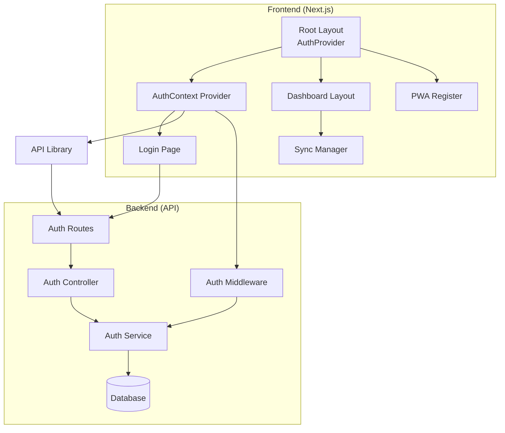
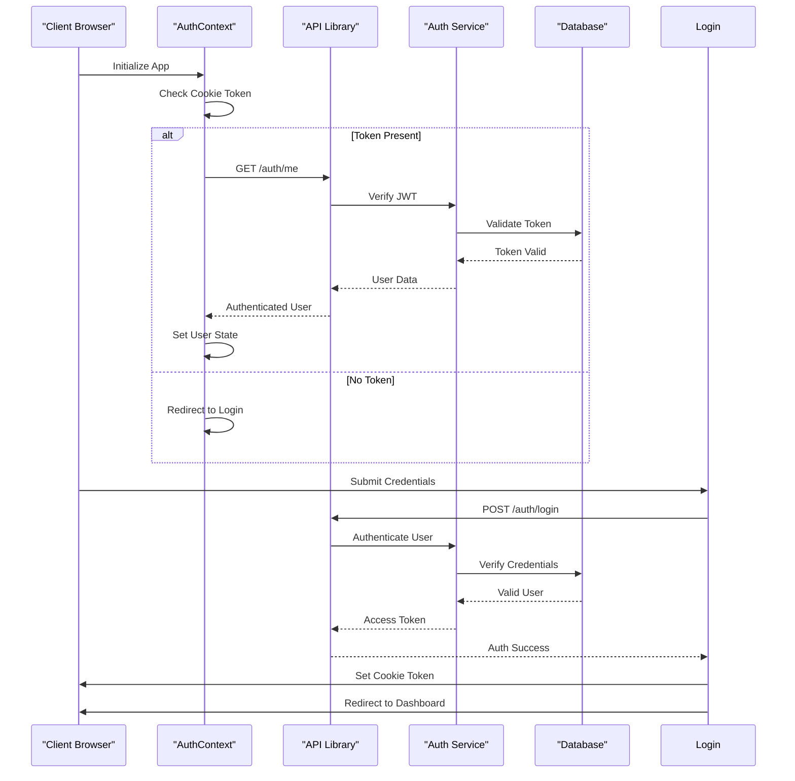
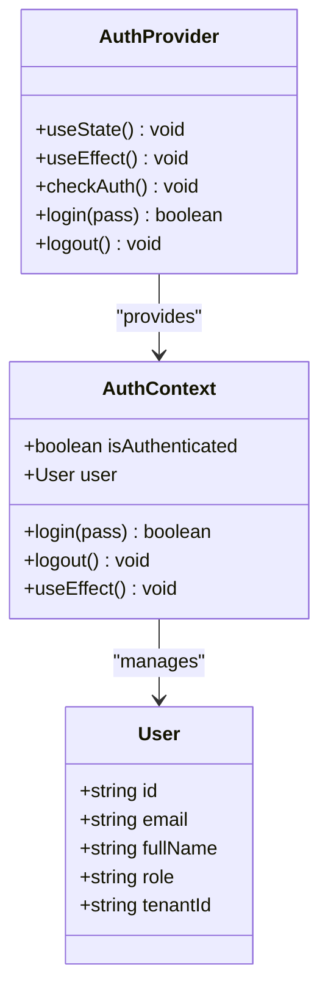
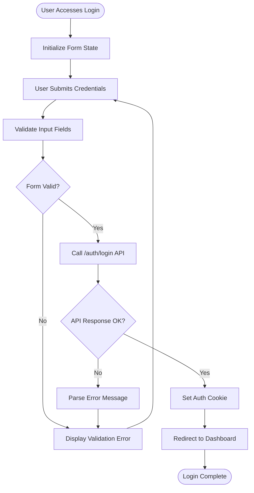
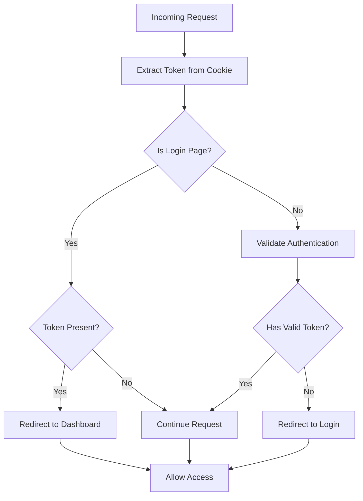
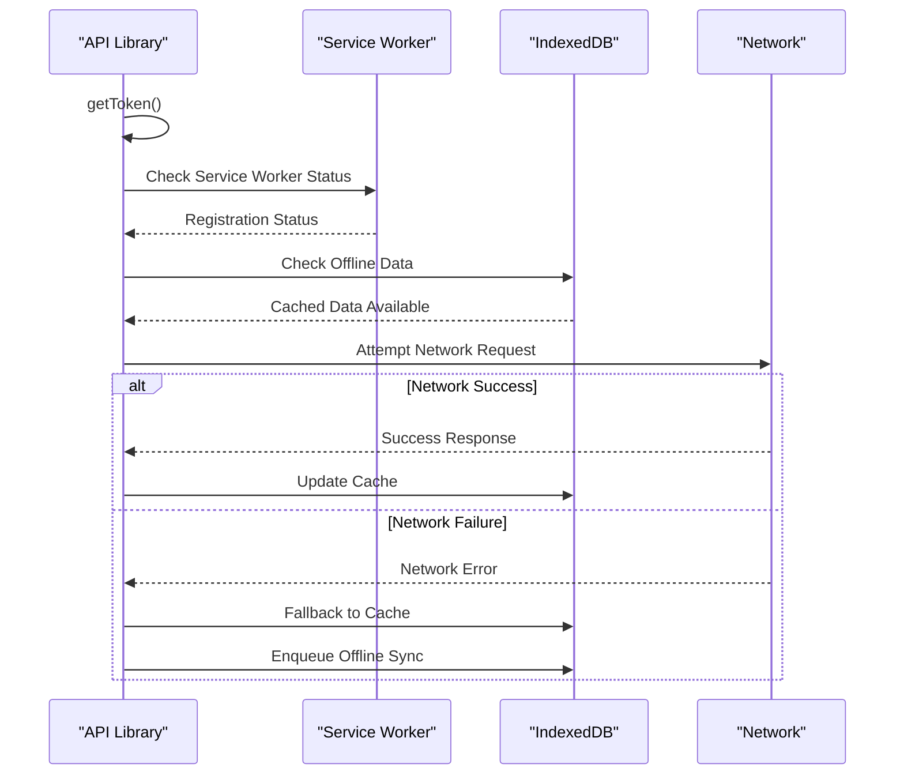
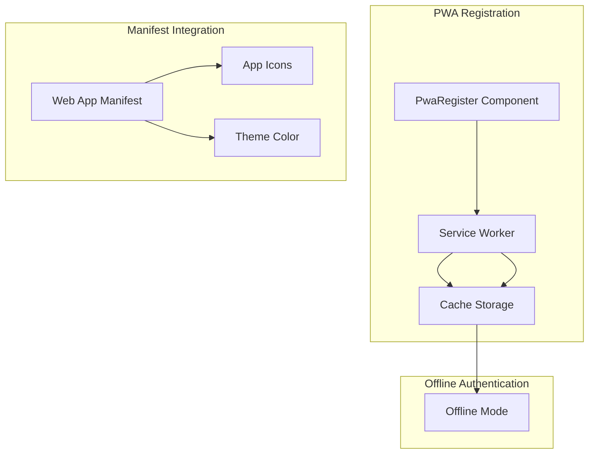
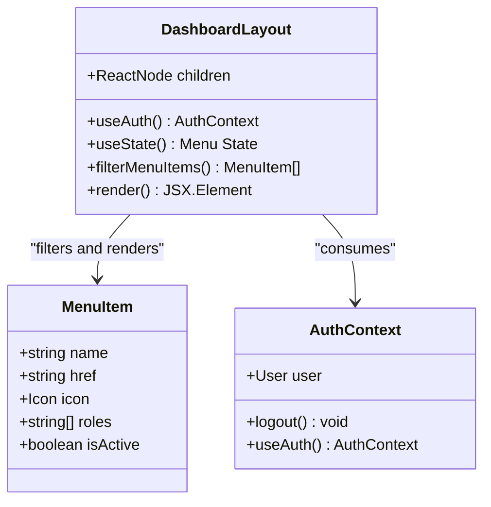
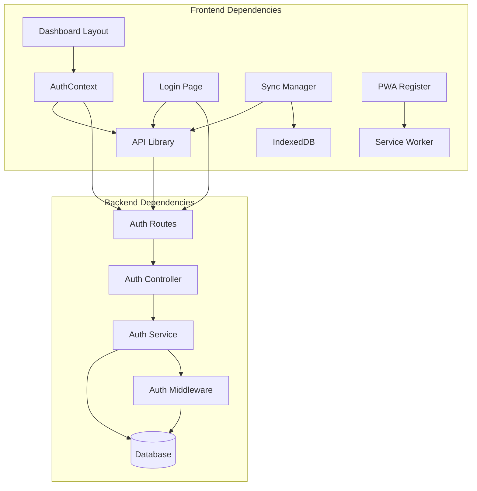

# Frontend Authentication Integration

<cite>
**Referenced Files in This Document**
- [AuthContext.tsx](file://apps/web/src/contexts/AuthContext.tsx)
- [login/page.tsx](file://apps/web/src/app/auth/login/page.tsx)
- [middleware.ts](file://apps/web/src/middleware.ts)
- [api.ts](file://apps/web/src/lib/api.ts)
- [DashboardLayout.tsx](file://apps/web/src/components/layout/DashboardLayout.tsx)
- [PwaRegister.tsx](file://apps/web/src/components/PwaRegister.tsx)
- [sw.js](file://apps/web/public/sw.js)
- [layout.tsx](file://apps/web/src/app/layout.tsx)
- [manifest.ts](file://apps/web/src/app/manifest.ts)
- [SyncManager.tsx](file://apps/web/src/components/SyncManager.tsx)
- [indexeddb.ts](file://apps/web/src/lib/indexeddb.ts)
- [auth.controller.ts](file://apps/api/src/controllers/auth.controller.ts)
- [auth.service.ts](file://apps/api/src/services/auth.service.ts)
- [auth.routes.ts](file://apps/api/src/routes/auth.routes.ts)
- [auth.middleware.ts](file://apps/api/src/middleware/auth.ts)
</cite>

## Table of Contents
1. [Introduction](#introduction)
2. [Project Structure](#project-structure)
3. [Core Components](#core-components)
4. [Architecture Overview](#architecture-overview)
5. [Detailed Component Analysis](#detailed-component-analysis)
6. [Dependency Analysis](#dependency-analysis)
7. [Performance Considerations](#performance-considerations)
8. [Troubleshooting Guide](#troubleshooting-guide)
9. [Conclusion](#conclusion)

## Introduction
This document provides comprehensive documentation for the frontend authentication integration in ARHAT POS. It covers the AuthContext implementation, state management for authenticated users, session persistence, authentication flow in the Next.js frontend, protected route handling, navigation guards, communication with backend authentication APIs, error handling, and PWA authentication considerations including offline access patterns.

## Project Structure
The authentication system spans both the frontend Next.js application and the backend API service. The frontend implements authentication state management, protected routing, and offline capabilities, while the backend provides secure authentication endpoints and middleware for token verification.

**Diagram sources**
- [layout.tsx:41-59](file://apps/web/src/app/layout.tsx#L41-L59)
- [AuthContext.tsx:27-81](file://apps/web/src/contexts/AuthContext.tsx#L27-L81)
- [login/page.tsx:10-41](file://apps/web/src/app/auth/login/page.tsx#L10-L41)
- [auth.routes.ts:1-17](file://apps/api/src/routes/auth.routes.ts#L1-L17)
- [auth.controller.ts:25-90](file://apps/api/src/controllers/auth.controller.ts#L25-L90)
- [auth.service.ts:9-254](file://apps/api/src/services/auth.service.ts#L9-L254)
- [auth.middleware.ts:1-33](file://apps/api/src/middleware/auth.ts#L1-L33)

**Section sources**
- [layout.tsx:1-60](file://apps/web/src/app/layout.tsx#L1-L60)
- [AuthContext.tsx:1-84](file://apps/web/src/contexts/AuthContext.tsx#L1-L84)

## Core Components
The authentication system consists of several key components working together to provide secure, persistent, and resilient authentication:

### AuthContext Provider
The central state management component that maintains authentication state, user data, and provides login/logout functionality. It handles automatic token validation and redirects unauthenticated users to the login page.

### Login Page Implementation
A dedicated login interface that communicates with backend authentication endpoints, handles user credentials, and establishes authenticated sessions.

### Protected Route Handling
Middleware-based protection for sensitive routes with automatic redirection and navigation guards.

### API Communication Layer
Centralized API library that manages authentication tokens, handles 401 responses, and provides offline fallback capabilities.

### PWA Integration
Service worker registration and offline-first caching strategies for seamless authentication experiences.

**Section sources**
- [AuthContext.tsx:5-25](file://apps/web/src/contexts/AuthContext.tsx#L5-L25)
- [login/page.tsx:10-41](file://apps/web/src/app/auth/login/page.tsx#L10-L41)
- [middleware.ts:4-17](file://apps/web/src/middleware.ts#L4-L17)
- [api.ts:17-27](file://apps/web/src/lib/api.ts#L17-L27)

## Architecture Overview
The authentication architecture follows a client-server model with JWT-based authentication and comprehensive offline support:

**Diagram sources**
- [AuthContext.tsx:33-62](file://apps/web/src/contexts/AuthContext.tsx#L33-L62)
- [login/page.tsx:17-41](file://apps/web/src/app/auth/login/page.tsx#L17-L41)
- [auth.service.ts:140-177](file://apps/api/src/services/auth.service.ts#L140-L177)
- [auth.controller.ts:56-71](file://apps/api/src/controllers/auth.controller.ts#L56-L71)

## Detailed Component Analysis

### AuthContext Implementation
The AuthContext provides comprehensive authentication state management with automatic token validation and user session persistence.

**Diagram sources**
- [AuthContext.tsx:5-25](file://apps/web/src/contexts/AuthContext.tsx#L5-L25)
- [AuthContext.tsx:27-81](file://apps/web/src/contexts/AuthContext.tsx#L27-L81)

Key features of the AuthContext implementation:
- Automatic token detection via cookie parsing
- Periodic user validation against `/auth/me` endpoint
- Conditional routing based on authentication state
- Comprehensive error handling and cleanup
- Integration with Next.js navigation for seamless redirects

**Section sources**
- [AuthContext.tsx:27-84](file://apps/web/src/contexts/AuthContext.tsx#L27-L84)

### Login Page Implementation
The login page provides a secure authentication interface with comprehensive error handling and user feedback mechanisms.

**Diagram sources**
- [login/page.tsx:17-41](file://apps/web/src/app/auth/login/page.tsx#L17-L41)
- [api.ts:28-40](file://apps/web/src/lib/api.ts#L28-L40)

The login implementation includes:
- Real-time form validation and error display
- Loading state management during authentication
- Secure token storage in cookies
- User-friendly error messaging
- Seamless navigation to protected routes

**Section sources**
- [login/page.tsx:10-143](file://apps/web/src/app/auth/login/page.tsx#L10-L143)

### Protected Route Handling and Navigation Guards
The middleware system provides robust protection for sensitive routes with intelligent redirect logic.

**Diagram sources**
- [middleware.ts:4-17](file://apps/web/src/middleware.ts#L4-L17)

The middleware enforces:
- Automatic redirection for unauthenticated users
- Prevention of direct access to login page when authenticated
- Targeted route protection for sensitive areas
- Configurable URL patterns for protection

**Section sources**
- [middleware.ts:1-22](file://apps/web/src/middleware.ts#L1-L22)

### Session Persistence and Token Management
The system implements comprehensive session persistence using cookies and centralized token management.

**Diagram sources**
- [api.ts:17-27](file://apps/web/src/lib/api.ts#L17-L27)
- [indexeddb.ts:88-146](file://apps/web/src/lib/indexeddb.ts#L88-L146)
- [sw.js:1-19](file://apps/web/public/sw.js#L1-L19)

Key persistence features:
- Centralized token extraction and header management
- Automatic 401 handling with session cleanup
- Comprehensive offline fallback mechanisms
- Service worker-based caching strategies
- IndexedDB-based offline data synchronization

**Section sources**
- [api.ts:4-16](file://apps/web/src/lib/api.ts#L4-L16)
- [api.ts:17-27](file://apps/web/src/lib/api.ts#L17-L27)

### PWA Authentication Considerations
The PWA implementation ensures authentication continuity across offline scenarios and provides enhanced user experience.

**Diagram sources**
- [PwaRegister.tsx:5-22](file://apps/web/src/components/PwaRegister.tsx#L5-L22)
- [sw.js:1-19](file://apps/web/public/sw.js#L1-L19)
- [manifest.ts:3-25](file://apps/web/src/app/manifest.ts#L3-L25)

PWA authentication features:
- Service worker registration for offline capability
- Progressive Web App manifest configuration
- Icon and theme customization for native app appearance
- Offline-first caching strategies
- Enhanced user experience with app-like behavior

**Section sources**
- [PwaRegister.tsx:1-23](file://apps/web/src/components/PwaRegister.tsx#L1-L23)
- [sw.js:1-19](file://apps/web/public/sw.js#L1-L19)
- [manifest.ts:1-26](file://apps/web/src/app/manifest.ts#L1-L26)

### Protected Component Rendering
The DashboardLayout demonstrates comprehensive protected component rendering with role-based access control and dynamic menu generation.

**Diagram sources**
- [DashboardLayout.tsx:23-181](file://apps/web/src/components/layout/DashboardLayout.tsx#L23-L181)

Protected component features:
- Role-based menu filtering and access control
- Dynamic user information display
- Responsive navigation with mobile support
- Integrated logout functionality
- Real-time authentication state updates

**Section sources**
- [DashboardLayout.tsx:1-182](file://apps/web/src/components/layout/DashboardLayout.tsx#L1-L182)

## Dependency Analysis
The authentication system exhibits well-structured dependencies with clear separation of concerns and minimal coupling between components.

**Diagram sources**
- [AuthContext.tsx:40-43](file://apps/web/src/contexts/AuthContext.tsx#L40-L43)
- [api.ts:17-27](file://apps/web/src/lib/api.ts#L17-L27)
- [auth.routes.ts:1-17](file://apps/api/src/routes/auth.routes.ts#L1-L17)
- [auth.service.ts:9-254](file://apps/api/src/services/auth.service.ts#L9-L254)

Key dependency characteristics:
- Loose coupling between frontend and backend components
- Centralized API communication layer
- Clear separation between authentication logic and presentation
- Modular service architecture with distinct responsibilities

**Section sources**
- [AuthContext.tsx:1-84](file://apps/web/src/contexts/AuthContext.tsx#L1-L84)
- [api.ts:1-618](file://apps/web/src/lib/api.ts#L1-L618)

## Performance Considerations
The authentication system incorporates several performance optimizations and resilience mechanisms:

### Token Validation Efficiency
- Single token extraction per validation cycle
- Efficient cookie parsing using regular expressions
- Minimal API calls with automatic retry logic
- Caching of validated user data to reduce server load

### Offline Performance
- IndexedDB-based local caching reduces network dependency
- Service worker caching for static assets and API responses
- Intelligent fallback mechanisms for degraded network conditions
- Background sync queue processing for delayed operations

### Memory Management
- Proper cleanup of event listeners and timers
- Efficient state updates using React hooks
- Minimal DOM manipulation for improved rendering performance
- Optimized component re-renders based on authentication state changes

## Troubleshooting Guide

### Common Authentication Issues

**Session Timeout or Expired Tokens**
- Symptom: 401 Unauthorized errors on protected routes
- Resolution: Automatic token cleanup and redirect to login page
- Prevention: Regular token refresh and proper error handling

**Login Failures**
- Symptom: Persistent login errors despite correct credentials
- Resolution: Check backend authentication logs and token generation
- Prevention: Implement comprehensive input validation and error reporting

**Offline Authentication Problems**
- Symptom: Unable to access protected routes without internet
- Resolution: Verify service worker registration and IndexedDB availability
- Prevention: Implement graceful degradation and clear user feedback

**Navigation Guard Issues**
- Symptom: Users can access protected routes directly
- Resolution: Review middleware configuration and URL patterns
- Prevention: Test middleware with various route combinations

**Section sources**
- [AuthContext.tsx:47-53](file://apps/web/src/contexts/AuthContext.tsx#L47-L53)
- [api.ts:19-26](file://apps/web/src/lib/api.ts#L19-L26)
- [SyncManager.tsx:48-57](file://apps/web/src/components/SyncManager.tsx#L48-L57)

## Conclusion
The ARHAT POS frontend authentication integration provides a robust, secure, and resilient authentication system that seamlessly integrates with the backend API service. The implementation demonstrates best practices in state management, session persistence, offline capabilities, and user experience design.

Key strengths of the implementation include:
- Comprehensive authentication state management with automatic validation
- Robust protected routing with intelligent navigation guards
- Advanced offline capabilities with IndexedDB and service workers
- Seamless PWA integration for enhanced user experience
- Modular architecture with clear separation of concerns
- Comprehensive error handling and user feedback mechanisms

The system successfully balances security requirements with usability, providing a reliable foundation for the ARHAT POS application while maintaining flexibility for future enhancements and scaling requirements.