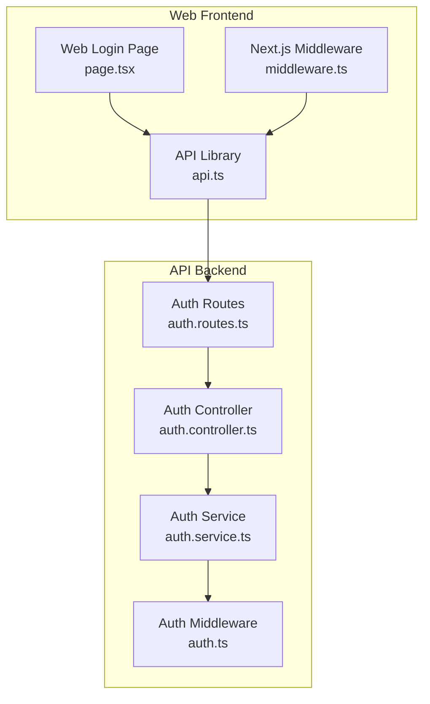
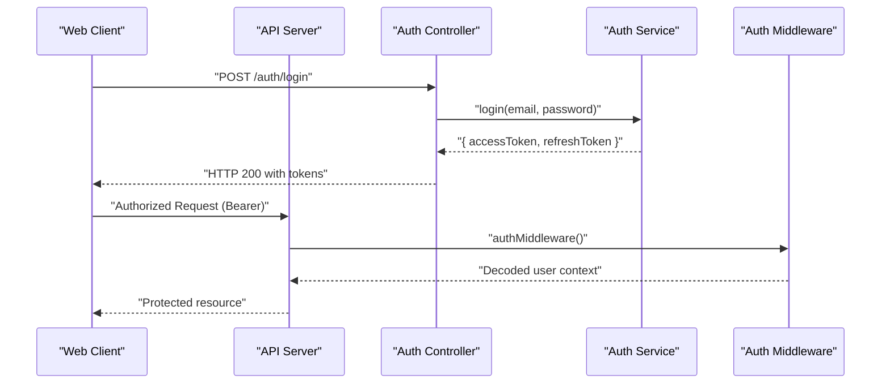
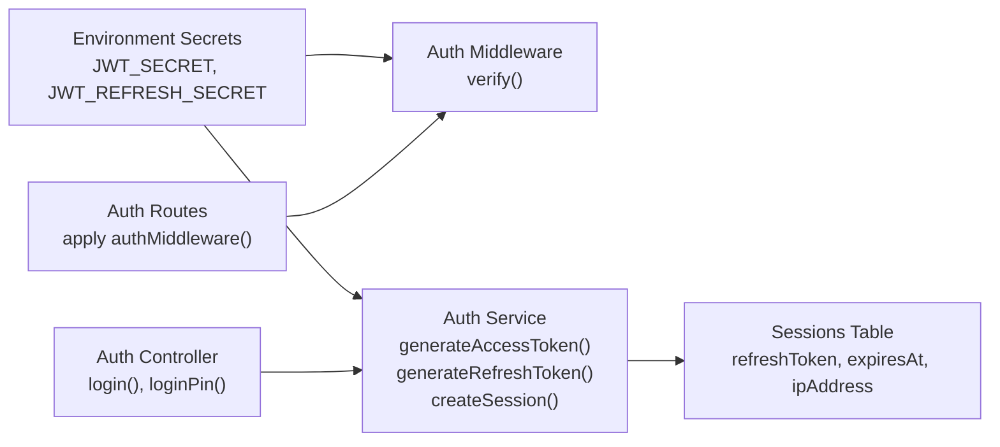

# JWT Token Management

<cite>
**Referenced Files in This Document**
- [auth.ts](file://apps/api/src/middleware/auth.ts)
- [auth.service.ts](file://apps/api/src/services/auth.service.ts)
- [auth.controller.ts](file://apps/api/src/controllers/auth.controller.ts)
- [auth.routes.ts](file://apps/api/src/routes/auth.routes.ts)
- [api.ts](file://apps/web/src/lib/api.ts)
- [middleware.ts](file://apps/web/src/middleware.ts)
- [page.tsx](file://apps/web/src/app/auth/login/page.tsx)
</cite>

## Table of Contents
1. [Introduction](#introduction)
2. [Project Structure](#project-structure)
3. [Core Components](#core-components)
4. [Architecture Overview](#architecture-overview)
5. [Detailed Component Analysis](#detailed-component-analysis)
6. [Dependency Analysis](#dependency-analysis)
7. [Performance Considerations](#performance-considerations)
8. [Troubleshooting Guide](#troubleshooting-guide)
9. [Conclusion](#conclusion)

## Introduction
This document explains JWT token management in ARHAT POS, covering token generation, payload structure, expiration policies, refresh mechanisms, validation procedures, storage strategies, automatic renewal, and logout functionality. It also documents security considerations, best practices, and the integration between the authentication service and middleware for token validation.

## Project Structure
The JWT implementation spans three layers:
- Backend API (Hono server) with authentication middleware and service/controller logic
- Frontend web application with token storage, propagation, and logout handling
- Shared routing configuration that applies authentication middleware to protected routes

**Diagram sources**
- [auth.routes.ts:1-20](file://apps/api/src/routes/auth.routes.ts#L1-L20)
- [auth.controller.ts:1-120](file://apps/api/src/controllers/auth.controller.ts#L1-L120)
- [auth.service.ts:170-253](file://apps/api/src/services/auth.service.ts#L170-L253)
- [auth.ts:1-33](file://apps/api/src/middleware/auth.ts#L1-L33)
- [api.ts:1-40](file://apps/web/src/lib/api.ts#L1-L40)
- [middleware.ts:1-21](file://apps/web/src/middleware.ts#L1-L21)
- [page.tsx:1-41](file://apps/web/src/app/auth/login/page.tsx#L1-L41)

**Section sources**
- [auth.ts:1-33](file://apps/api/src/middleware/auth.ts#L1-L33)
- [auth.service.ts:170-253](file://apps/api/src/services/auth.service.ts#L170-L253)
- [auth.controller.ts:1-120](file://apps/api/src/controllers/auth.controller.ts#L1-L120)
- [auth.routes.ts:1-20](file://apps/api/src/routes/auth.routes.ts#L1-L20)
- [api.ts:1-40](file://apps/web/src/lib/api.ts#L1-L40)
- [middleware.ts:1-21](file://apps/web/src/middleware.ts#L1-L21)
- [page.tsx:1-41](file://apps/web/src/app/auth/login/page.tsx#L1-L41)

## Core Components
- Authentication middleware validates Authorization headers and decodes JWTs
- Authentication service generates access tokens and refresh tokens, and manages sessions
- Authentication controller exposes login endpoints and delegates to the service
- Web frontend stores tokens in cookies, attaches them to requests, and handles logout
- Next.js middleware enforces route protection via cookie presence

Key JWT payload fields:
- Access token payload includes: userId, email, role, tenantId
- Refresh token payload includes: userId

Expiration policy:
- Both access and refresh tokens expire after 7 days

**Section sources**
- [auth.ts:5-32](file://apps/api/src/middleware/auth.ts#L5-L32)
- [auth.service.ts:226-240](file://apps/api/src/services/auth.service.ts#L226-L240)
- [auth.controller.ts:60-120](file://apps/api/src/controllers/auth.controller.ts#L60-L120)
- [api.ts:4-40](file://apps/web/src/lib/api.ts#L4-L40)
- [middleware.ts:4-17](file://apps/web/src/middleware.ts#L4-L17)

## Architecture Overview
The system uses bearer tokens propagated via Authorization headers. The backend middleware verifies tokens and injects user context into the request. The frontend stores tokens in cookies and automatically attaches them to outgoing requests.

**Diagram sources**
- [auth.controller.ts:60-120](file://apps/api/src/controllers/auth.controller.ts#L60-L120)
- [auth.service.ts:170-253](file://apps/api/src/services/auth.service.ts#L170-L253)
- [auth.ts:5-32](file://apps/api/src/middleware/auth.ts#L5-L32)
- [api.ts:27-40](file://apps/web/src/lib/api.ts#L27-L40)

## Detailed Component Analysis

### Backend Authentication Middleware
Responsibilities:
- Extracts Authorization header
- Validates Bearer token format
- Verifies JWT signature using environment-provided secret
- Injects user identity (userId, tenantId, role, email) into request context
- Throws unauthorized error on missing/invalid/expired tokens

Security considerations:
- Requires JWT_SECRET to be configured
- Uses jsonwebtoken verify with provided secret
- Enforces strict header parsing

**Section sources**
- [auth.ts:5-32](file://apps/api/src/middleware/auth.ts#L5-L32)

### Authentication Service
Responsibilities:
- Generates access tokens with 7-day expiry containing userId, email, role, tenantId
- Generates refresh tokens with 7-day expiry containing userId
- Creates session records with refresh tokens and expiry timestamps
- Provides login flows (email/password and PIN)

Implementation highlights:
- Access token payload: userId, email, role, tenantId
- Refresh token payload: userId
- Session persistence includes IP address and expiry

**Section sources**
- [auth.service.ts:226-253](file://apps/api/src/services/auth.service.ts#L226-L253)
- [auth.service.ts:178-198](file://apps/api/src/services/auth.service.ts#L178-L198)

### Authentication Controller
Responsibilities:
- Exposes login endpoint for email/password
- Exposes login-pin endpoint for PIN-based authentication
- Returns access and refresh tokens upon successful authentication
- Delegates to service layer for token generation and session creation

**Section sources**
- [auth.controller.ts:60-120](file://apps/api/src/controllers/auth.controller.ts#L60-L120)
- [auth.routes.ts:1-20](file://apps/api/src/routes/auth.routes.ts#L1-L20)

### Frontend Token Storage and Propagation
Responsibilities:
- Stores access token in HTTP-only cookie named "token"
- Automatically attaches Authorization: Bearer header to all API requests
- Redirects to login when receiving 401 Unauthorized
- Supports PIN-based login flow

Storage strategy:
- Cookie "token" with 24-hour max-age for access tokens
- Automatic header injection via fetch wrapper

**Section sources**
- [api.ts:4-40](file://apps/web/src/lib/api.ts#L4-L40)
- [page.tsx:23-41](file://apps/web/src/app/auth/login/page.tsx#L23-L41)

### Next.js Middleware Protection
Responsibilities:
- Blocks unauthenticated requests by redirecting to login
- Allows authenticated requests to protected pages
- Prevents access to login page when already authenticated

**Section sources**
- [middleware.ts:4-17](file://apps/web/src/middleware.ts#L4-L17)

### Logout Functionality
Logout is handled by clearing the "token" cookie and redirecting to the login page. The frontend clears the cookie on 401 responses and on explicit user action.

**Section sources**
- [api.ts:19-26](file://apps/web/src/lib/api.ts#L19-L26)

## Dependency Analysis
The authentication flow depends on:
- Environment secrets for signing tokens
- Database session storage for refresh tokens
- Middleware applied to protected routes
- Cookie-based storage in the browser

**Diagram sources**
- [auth.ts:14-19](file://apps/api/src/middleware/auth.ts#L14-L19)
- [auth.service.ts:226-253](file://apps/api/src/services/auth.service.ts#L226-L253)
- [auth.routes.ts:1-20](file://apps/api/src/routes/auth.routes.ts#L1-L20)

**Section sources**
- [auth.ts:14-19](file://apps/api/src/middleware/auth.ts#L14-L19)
- [auth.service.ts:226-253](file://apps/api/src/services/auth.service.ts#L226-L253)
- [auth.routes.ts:1-20](file://apps/api/src/routes/auth.routes.ts#L1-L20)

## Performance Considerations
- Token verification occurs on every protected request; keep middleware lightweight
- Consider adding token introspection caching for high-traffic scenarios
- Use short-lived access tokens with refresh token rotation to minimize long-term exposure
- Ensure database session queries are indexed on refreshToken and expiresAt

## Troubleshooting Guide
Common issues and resolutions:
- Missing JWT_SECRET: Middleware throws server misconfiguration error; configure environment variable
- Invalid or expired token: Middleware rejects request with unauthorized error; re-authenticate
- 401 responses: Frontend clears cookie and redirects to login; verify token validity and server time synchronization
- Route protection bypass: Ensure authMiddleware is applied to all protected routes

**Section sources**
- [auth.ts:16-18](file://apps/api/src/middleware/auth.ts#L16-L18)
- [auth.ts](file://apps/api/src/middleware/auth.ts#L31)
- [api.ts:19-26](file://apps/web/src/lib/api.ts#L19-L26)
- [auth.routes.ts:1-20](file://apps/api/src/routes/auth.routes.ts#L1-L20)

## Conclusion
ARHAT POS implements a straightforward JWT-based authentication system with bearer tokens stored in cookies and validated by a centralized middleware. Access tokens carry essential user claims and expire in 7 days, while refresh tokens enable session management persisted in the database. The frontend automatically attaches tokens to requests and handles logout on 401 responses. To enhance security, consider rotating secrets, shortening token lifetimes, and implementing refresh token revocation and device binding.