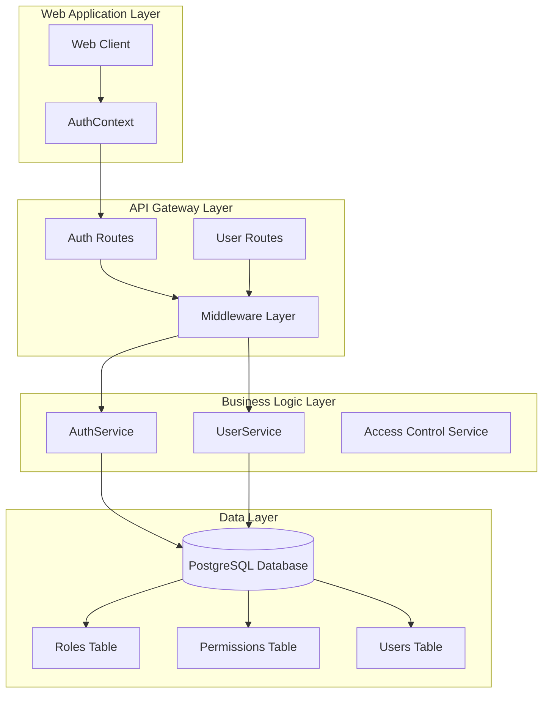
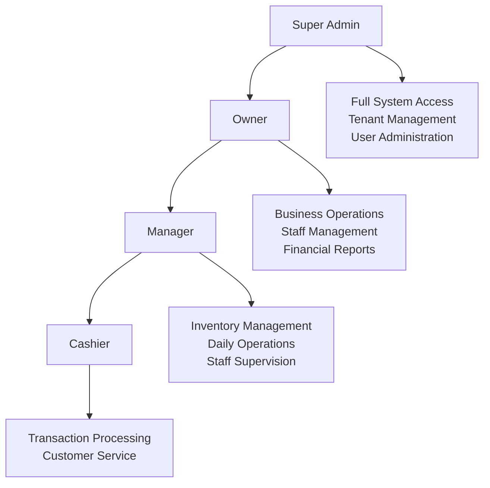
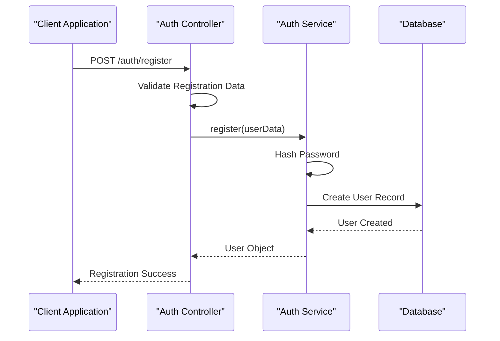
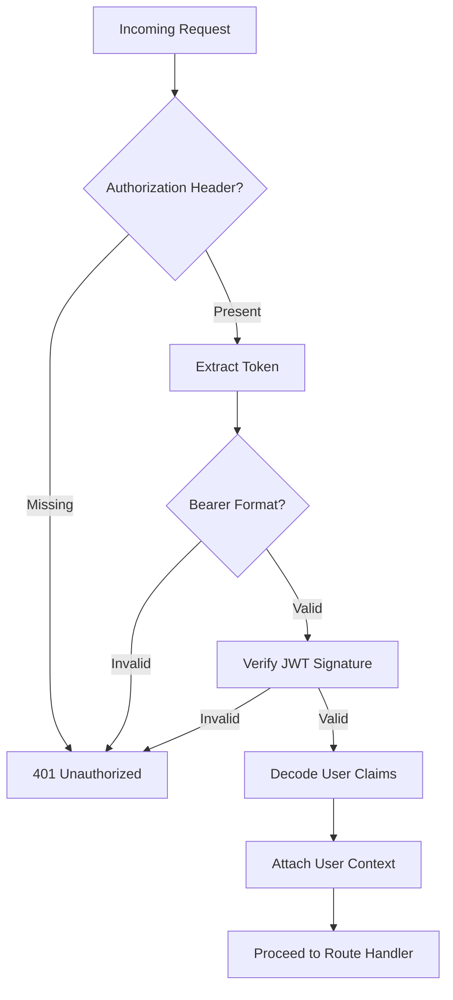
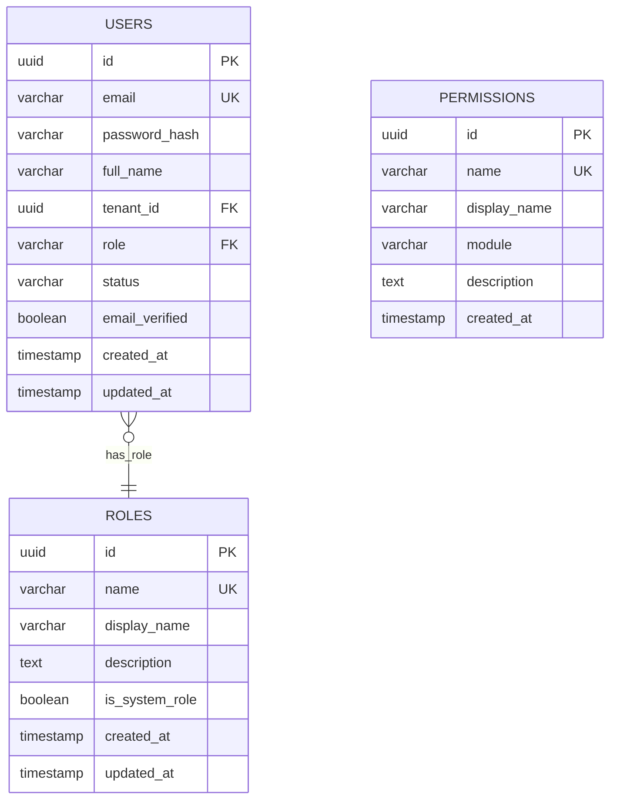

# Role-Based Access Control (RBAC) System

<cite>
**Referenced Files in This Document**
- [001_initial_setup.sql](file://apps/api/migrations/001_initial_setup.sql)
- [auth.middleware.ts](file://apps/api/src/middleware/auth.ts)
- [auth.middleware.js](file://apps/api/src/middleware/auth.js)
- [auth.service.ts](file://apps/api/src/services/auth.service.ts)
- [auth.service.js](file://apps/api/src/services/auth.service.js)
- [auth.controller.ts](file://apps/api/src/controllers/auth.controller.ts)
- [auth.controller.js](file://apps/api/src/controllers/auth.controller.js)
- [auth.routes.ts](file://apps/api/src/routes/auth.routes.ts)
- [AuthContext.tsx](file://apps/web/src/contexts/AuthContext.tsx)
- [users.routes.ts](file://apps/api/src/routes/users.routes.ts)
- [users.routes.js](file://apps/api/src/routes/users.routes.js)
- [users.controller.ts](file://apps/api/src/controllers/users.controller.ts)
- [users.controller.js](file://apps/api/src/controllers/users.controller.js)
- [users.service.ts](file://apps/api/src/services/users.service.ts)
- [users.service.js](file://apps/api/src/services/users.service.js)
</cite>

## Table of Contents
1. [Introduction](#introduction)
2. [System Architecture](#system-architecture)
3. [User Roles and Permissions](#user-roles-and-permissions)
4. [Role Assignment Process](#role-assignment-process)
5. [Authorization Middleware Implementation](#authorization-middleware-implementation)
6. [Permission Checking Mechanisms](#permission-checking-mechanisms)
7. [Role Storage and Validation](#role-storage-and-validation)
8. [Tenant Management Integration](#tenant-management-integration)
9. [Route Protection Examples](#route-protection-examples)
10. [Component-Based Permission Rendering](#component-based-permission-rendering)
11. [API Endpoint Access Control](#api-endpoint-access-control)
12. [Security Considerations](#security-considerations)
13. [Troubleshooting Guide](#troubleshooting-guide)
14. [Conclusion](#conclusion)

## Introduction

The Role-Based Access Control (RBAC) system in ARHAT POS provides a comprehensive authorization framework that manages user access levels across different business entities. This system ensures that users can only access features and data appropriate to their designated roles within the organization hierarchy.

The RBAC implementation consists of four primary user roles: Super Admin, Owner, Manager, and Cashier, each with distinct permissions and access levels. The system integrates seamlessly with the tenant management architecture, allowing multi-tenant support where each business entity maintains its own user hierarchy and access controls.

## System Architecture

The RBAC system follows a distributed architecture pattern with clear separation of concerns across authentication, authorization, and permission management layers.

**Diagram sources**
- [auth.routes.ts:1-17](file://apps/api/src/routes/auth.routes.ts#L1-L17)
- [auth.middleware.ts:1-24](file://apps/api/src/middleware/auth.ts#L1-L24)
- [auth.service.ts:45-82](file://apps/api/src/services/auth.service.ts#L45-L82)

## User Roles and Permissions

The RBAC system defines four hierarchical user roles, each with specific permissions and access levels:

### Super Admin
- **Highest system privilege level**
- Full access to all system features and configurations
- Can manage other administrators and system-wide settings
- Has unrestricted access to tenant management and user administration
- Can modify system-wide policies and configurations

### Owner
- **Business entity administrator**
- Full access to business-specific features and data
- Can manage business operations and staff
- Has access to financial reports and business analytics
- Can create and manage business locations/outlets

### Manager
- **Operational supervisor**
- Can manage day-to-day business operations
- Has access to inventory management and staff supervision
- Limited access to financial reporting compared to Owner
- Can approve certain operational decisions within predefined limits

### Cashier
- **Front-line operational user**
- Limited to transaction processing capabilities
- Can access point-of-sale functionality
- Restricted to basic customer service features
- Cannot access administrative or financial systems

**Section sources**
- [001_initial_setup.sql:112-117](file://apps/api/migrations/001_initial_setup.sql#L112-L117)

## Role Assignment Process

The role assignment process occurs during user registration and initialization phases within the tenant management system.

### Initial Tenant Setup
When a new tenant is registered, the system automatically creates:
1. **Tenant Administrator (Admin)**: Assigned the 'admin' role during tenant creation
2. **Headquarters Outlet**: Created as the primary business location
3. **Initial User Account**: Registered with administrative privileges

### User Registration Flow
New user registration follows this sequence:
1. Validation of registration data against Zod schemas
2. Password hashing and verification
3. Tenant association and role assignment
4. User account creation with status tracking

**Diagram sources**
- [auth.controller.ts:41-54](file://apps/api/src/controllers/auth.controller.ts#L41-L54)
- [auth.service.ts:85-103](file://apps/api/src/services/auth.service.ts#L85-L103)

**Section sources**
- [auth.controller.ts:1-54](file://apps/api/src/controllers/auth.controller.ts#L1-L54)
- [auth.service.ts:45-82](file://apps/api/src/services/auth.service.ts#L45-L82)

## Authorization Middleware Implementation

The authorization middleware serves as the central gatekeeper for all protected routes, implementing JWT-based authentication and role validation.

### Authentication Flow
The middleware performs the following validation steps:
1. Extracts Authorization header from incoming requests
2. Validates Bearer token format
3. Verifies JWT signature using configured secrets
4. Decodes user claims (userId, tenantId, role, email)
5. Attaches user context to request for downstream processing

### Token Structure and Claims
The JWT tokens contain essential user information:
- **userId**: Unique identifier for the authenticated user
- **tenantId**: Business entity identifier for multi-tenant isolation
- **role**: User's assigned role with permission hierarchy
- **email**: User's contact information for identification

**Diagram sources**
- [auth.middleware.ts:3-24](file://apps/api/src/middleware/auth.ts#L3-L24)

**Section sources**
- [auth.middleware.ts:1-24](file://apps/api/src/middleware/auth.ts#L1-L24)
- [auth.middleware.js:1-24](file://apps/api/src/middleware/auth.js#L1-L24)

## Permission Checking Mechanisms

The system implements a dual-layer permission checking mechanism combining role-based access control and resource-level authorization.

### Role-Based Authorization
Permission enforcement is primarily handled through role hierarchy validation:
- Higher-level roles inherit permissions from lower-level roles
- Super Admin can override any restriction
- Owner has broad business permissions but limited system-level access
- Manager and Cashier roles have progressively restricted access

### Resource-Level Authorization
Beyond role-based checks, the system implements resource-level validation:
- Tenant isolation ensures users cannot access other business entities
- User ownership validation prevents unauthorized data access
- Context-aware permissions adjust based on current operation context

### Middleware Integration
Permission checking integrates with route handlers through:
- Route-specific middleware chains
- Dynamic permission evaluation based on request context
- Centralized error handling for authorization failures

## Role Storage and Validation

The RBAC system stores role definitions and user assignments in PostgreSQL database tables with comprehensive indexing and constraints.

### Database Schema Design
The schema includes three primary tables:

#### Roles Table
Stores role definitions with unique constraints and system role indicators:
- **id**: UUID primary key with auto-generated values
- **name**: Unique role identifier (super_admin, owner, manager, cashier)
- **display_name**: Human-readable role names
- **description**: Role purpose and scope
- **is_system_role**: Boolean flag for system-critical roles
- **created_at/updated_at**: Timestamp tracking

#### Users Table Integration
User records maintain role assignments through:
- **role**: Foreign key reference to roles table
- **tenantId**: Multi-tenant isolation field
- **status**: Active/inactive user state tracking

#### Permissions Table
Extensible permission system supporting granular access control:
- **name**: Unique permission identifier
- **display_name**: Descriptive permission names
- **module**: Functional area classification
- **description**: Permission scope explanation

**Diagram sources**
- [001_initial_setup.sql:99-128](file://apps/api/migrations/001_initial_setup.sql#L99-L128)

**Section sources**
- [001_initial_setup.sql:95-128](file://apps/api/migrations/001_initial_setup.sql#L95-L128)

## Tenant Management Integration

The RBAC system integrates deeply with the tenant management architecture, ensuring proper isolation and access control across business entities.

### Multi-Tenant Architecture
Each tenant operates as an isolated business entity with:
- **Independent user hierarchies**: Users belong exclusively to their tenant
- **Separate data silos**: Financial and operational data remain isolated
- **Role-based access within tenant**: Permissions apply only within tenant boundaries

### Tenant Initialization Process
New tenant creation follows a structured initialization sequence:
1. Tenant record creation with unique identifier
2. Headquarters outlet establishment
3. Initial administrator user creation
4. Default role assignment and permission setup

### User Context Management
The system maintains tenant context throughout user sessions:
- User requests include tenant identification
- Database queries filter by tenant context
- Session management preserves tenant boundaries

## Route Protection Examples

The RBAC system implements comprehensive route protection through middleware integration and route-specific authorization requirements.

### Protected Route Patterns
Common protected route patterns include:
- **Authentication Required**: All user-facing routes require valid session
- **Role-Specific Access**: Administrative routes restricted to higher-level roles
- **Tenant Isolation**: User data access limited to authorized tenant

### Route Handler Integration
Protected routes integrate with authorization middleware:
- Middleware validates user credentials and role
- Route handlers receive authorized user context
- Error handling provides appropriate HTTP responses

### Example Route Configurations
Typical route protection scenarios:
- **User Management**: Restricted to Owner and Super Admin roles
- **Financial Reporting**: Limited to Owner and Manager roles
- **Point-of-Sale Operations**: Available to Manager and Cashier roles
- **System Configuration**: Exclusive to Super Admin role

## Component-Based Permission Rendering

The frontend implements dynamic permission-based UI rendering through React context and component composition patterns.

### Authentication Context Integration
The AuthContext provides centralized user state management:
- **User Profile Access**: Current user data available throughout application
- **Role Information**: Role-based permissions accessible to UI components
- **Authentication State**: Login/logout state tracking for UI updates

### Conditional Component Rendering
Components implement permission-based visibility:
- **Role Checks**: Components render based on user role hierarchy
- **Feature Flags**: UI elements conditionally displayed based on permissions
- **Navigation Updates**: Menu items and navigation paths adapt to user roles

### UI State Management
Permission-driven UI updates occur through:
- **Context Providers**: Centralized state management for user permissions
- **Component Composition**: Higher-order components wrap permission logic
- **State Synchronization**: UI reflects real-time permission changes

## API Endpoint Access Control

The backend implements comprehensive API endpoint access control through route-level middleware and service-layer authorization.

### Endpoint Protection Strategies
API endpoints employ multiple layers of protection:
- **Authentication Middleware**: Validates user credentials for all protected endpoints
- **Authorization Middleware**: Enforces role-based access control per endpoint
- **Input Validation**: Sanitizes and validates all request parameters
- **Response Filtering**: Limits sensitive data exposure based on permissions

### Service Layer Integration
Authorization extends to service layer operations:
- **Data Access Control**: Services filter data based on user permissions
- **Operation Validation**: Business operations validate user authorization
- **Audit Logging**: Permission-based actions logged for compliance

### Error Handling and Responses
Consistent error handling for authorization failures:
- **Standardized Error Codes**: 401 for authentication failures, 403 for authorization failures
- **Descriptive Error Messages**: Clear indication of permission requirements
- **Logging and Monitoring**: Authorization events tracked for security analysis

## Security Considerations

The RBAC system implements multiple security measures to protect against unauthorized access and maintain system integrity.

### Token Security
JWT implementation includes:
- **Secure Secret Management**: Environment-based secret configuration
- **Token Expiration**: Controlled session lifetimes with refresh mechanisms
- **Signature Verification**: Cryptographic validation of token authenticity

### Data Protection
Security measures for sensitive data:
- **Multi-Tenant Isolation**: Database-level separation of tenant data
- **Field-Level Encryption**: Sensitive data encryption where appropriate
- **Audit Trails**: Comprehensive logging of authorization events

### Attack Prevention
Protection against common security threats:
- **Brute Force Prevention**: Rate limiting and account lockout mechanisms
- **CSRF Protection**: Cross-site request forgery prevention
- **Input Sanitization**: Comprehensive validation and sanitization

## Troubleshooting Guide

Common issues and resolution strategies for the RBAC system.

### Authentication Issues
**Problem**: Users unable to log in or access protected routes
**Symptoms**: 401 Unauthorized errors on protected endpoints
**Resolution Steps**:
1. Verify JWT token validity and expiration
2. Check token signature against configured secrets
3. Confirm user account status and role assignments
4. Validate tenant membership and access permissions

### Authorization Problems
**Problem**: Users experiencing unexpected permission restrictions
**Symptoms**: 403 Forbidden errors despite expected access
**Resolution Steps**:
1. Verify user role assignments in database
2. Check tenant isolation boundaries
3. Review route-specific authorization requirements
4. Confirm permission inheritance from higher roles

### Session Management Issues
**Problem**: Session timeouts or persistent login problems
**Symptoms**: Frequent logout or inability to maintain session
**Resolution Steps**:
1. Check JWT token expiration settings
2. Verify refresh token generation and storage
3. Review client-side session storage mechanisms
4. Confirm server-side session cleanup processes

### Multi-Tenant Conflicts
**Problem**: Users accessing data from incorrect tenants
**Symptoms**: Cross-tenant data exposure or access denials
**Resolution Steps**:
1. Verify tenant ID in user records
2. Check tenant context in authorization middleware
3. Review database queries for tenant filtering
4. Confirm session tenant isolation

## Conclusion

The RBAC system in ARHAT POS provides a robust foundation for multi-tenant access control with clear role hierarchies and comprehensive permission management. The system successfully balances security requirements with usability, enabling effective business operations while maintaining strict access controls.

Key strengths of the implementation include:
- **Clear Role Hierarchy**: Well-defined permission levels with logical inheritance
- **Multi-Tenant Support**: Secure isolation between business entities
- **Comprehensive Coverage**: Protection across authentication, authorization, and data access
- **Scalable Architecture**: Extensible design supporting future permission requirements

The system provides a solid foundation for business growth while maintaining security and compliance requirements across all organizational levels.