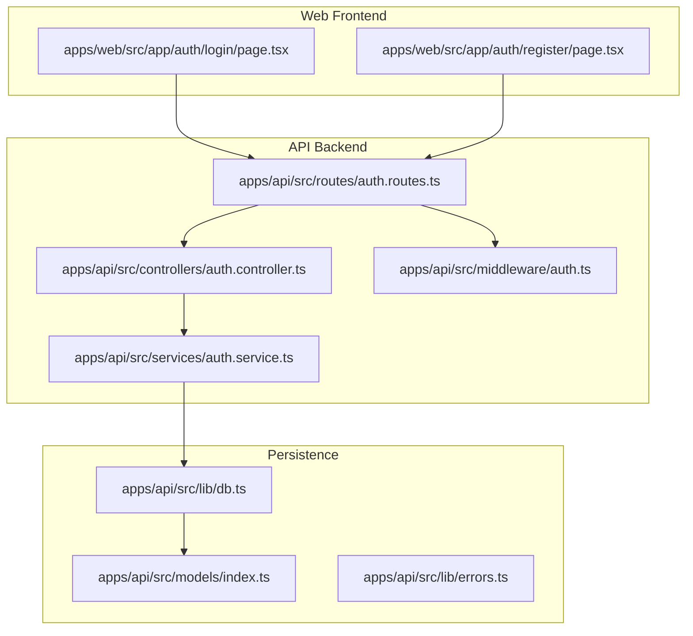
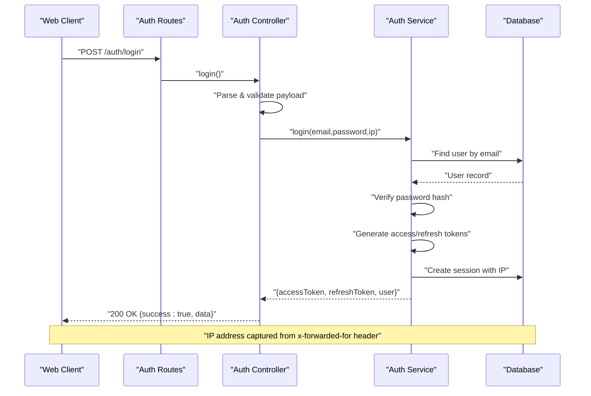
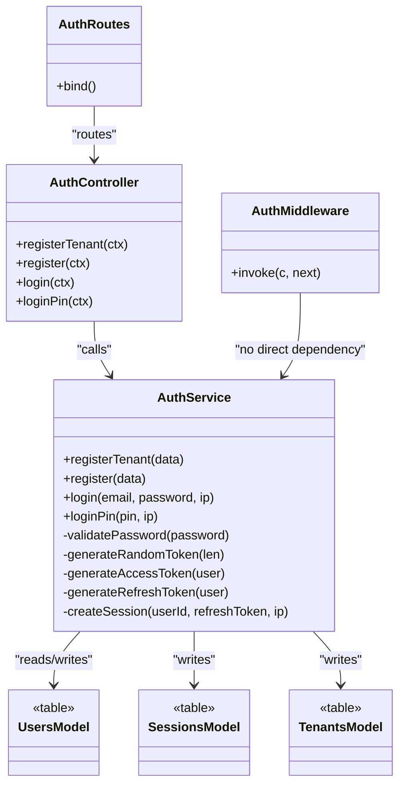

# User Authentication Flow

<cite>
**Referenced Files in This Document**
- [auth.controller.ts](file://apps/api/src/controllers/auth.controller.ts)
- [auth.service.ts](file://apps/api/src/services/auth.service.ts)
- [auth.ts](file://apps/api/src/middleware/auth.ts)
- [auth.routes.ts](file://apps/api/src/routes/auth.routes.ts)
- [index.ts](file://apps/api/src/models/index.ts)
- [errors.ts](file://apps/api/src/lib/errors.ts)
- [db.ts](file://apps/api/src/lib/db.ts)
- [login\page.tsx](file://apps/web/src/app/auth/login/page.tsx)
- [register\page.tsx](file://apps/web/src/app/auth/register/page.tsx)
</cite>

## Table of Contents
1. [Introduction](#introduction)
2. [Project Structure](#project-structure)
3. [Core Components](#core-components)
4. [Architecture Overview](#architecture-overview)
5. [Detailed Component Analysis](#detailed-component-analysis)
6. [Dependency Analysis](#dependency-analysis)
7. [Performance Considerations](#performance-considerations)
8. [Troubleshooting Guide](#troubleshooting-guide)
9. [Conclusion](#conclusion)

## Introduction
This document explains the complete user authentication flow in ARHAT POS, covering:
- User registration (including tenant creation)
- Login via email/password
- PIN-based login
- Request/response schemas and validation rules
- Error handling mechanisms
- Controller, service, and middleware implementation
- Step-by-step workflows
- Security measures including IP address tracking
- Practical examples for implementing each authentication method

## Project Structure
Authentication spans three layers:
- Frontend (Next.js pages) for user input and token storage
- Backend API (Hono) for routing and controllers
- Services and persistence for business logic and data

**Diagram sources**
- [auth.routes.ts:1-18](file://apps/api/src/routes/auth.routes.ts#L1-L18)
- [auth.controller.ts:1-91](file://apps/api/src/controllers/auth.controller.ts#L1-L91)
- [auth.service.ts:1-254](file://apps/api/src/services/auth.service.ts#L1-L254)
- [auth.ts:1-34](file://apps/api/src/middleware/auth.ts#L1-L34)
- [index.ts:1-307](file://apps/api/src/models/index.ts#L1-L307)
- [db.ts:1-27](file://apps/api/src/lib/db.ts#L1-L27)
- [errors.ts:1-8](file://apps/api/src/lib/errors.ts#L1-L8)
- [login\page.tsx:1-143](file://apps/web/src/app/auth/login/page.tsx#L1-L143)
- [register\page.tsx:1-182](file://apps/web/src/app/auth/register/page.tsx#L1-L182)

**Section sources**
- [auth.routes.ts:1-18](file://apps/api/src/routes/auth.routes.ts#L1-L18)
- [auth.controller.ts:1-91](file://apps/api/src/controllers/auth.controller.ts#L1-L91)
- [auth.service.ts:1-254](file://apps/api/src/services/auth.service.ts#L1-L254)
- [auth.ts:1-34](file://apps/api/src/middleware/auth.ts#L1-L34)
- [index.ts:1-307](file://apps/api/src/models/index.ts#L1-L307)
- [db.ts:1-27](file://apps/api/src/lib/db.ts#L1-L27)
- [errors.ts:1-8](file://apps/api/src/lib/errors.ts#L1-L8)
- [login\page.tsx:1-143](file://apps/web/src/app/auth/login/page.tsx#L1-L143)
- [register\page.tsx:1-182](file://apps/web/src/app/auth/register/page.tsx#L1-L182)

## Core Components
- Controllers define request parsing, validation, and response formatting.
- Services encapsulate business logic, hashing, token generation, session creation, and database operations.
- Middleware enforces authorization for protected routes.
- Routes bind endpoints to controllers.
- Models define the schema for users, sessions, tokens, and related entities.
- Frontend pages submit credentials and manage tokens.

Key responsibilities:
- Validation: Zod schemas in controllers; additional checks in services.
- Security: Password hashing, JWT signing, IP capture for sessions.
- Persistence: Drizzle ORM with PostgreSQL.

**Section sources**
- [auth.controller.ts:1-91](file://apps/api/src/controllers/auth.controller.ts#L1-L91)
- [auth.service.ts:1-254](file://apps/api/src/services/auth.service.ts#L1-L254)
- [auth.ts:1-34](file://apps/api/src/middleware/auth.ts#L1-L34)
- [auth.routes.ts:1-18](file://apps/api/src/routes/auth.routes.ts#L1-L18)
- [index.ts:20-55](file://apps/api/src/models/index.ts#L20-L55)
- [errors.ts:1-8](file://apps/api/src/lib/errors.ts#L1-L8)

## Architecture Overview
The authentication system follows a layered architecture:
- Web frontend collects credentials and stores tokens.
- API routes accept requests and delegate to controllers.
- Controllers parse and validate payloads, then call services.
- Services perform business logic and persist data.
- Middleware secures protected routes.

**Diagram sources**
- [auth.routes.ts:7-10](file://apps/api/src/routes/auth.routes.ts#L7-L10)
- [auth.controller.ts:55-71](file://apps/api/src/controllers/auth.controller.ts#L55-L71)
- [auth.service.ts:140-177](file://apps/api/src/services/auth.service.ts#L140-L177)
- [db.ts:1-27](file://apps/api/src/lib/db.ts#L1-L27)

## Detailed Component Analysis

### Controllers: Request Parsing, Validation, and Responses
- Register Tenant: Validates payload using Zod; delegates to service; returns 201 on success.
- Register: Validates payload; ensures unique email; hashes password; creates verification token and sends email.
- Login: Parses email/password; captures IP from headers; authenticates and issues tokens.
- Login PIN: Requires PIN; authenticates by PIN; issues tokens and records session with IP.

Validation rules:
- Email must be valid; password minimum lengths differ by endpoint.
- Tenant registration requires tenant name, email, password, full name.
- Standard registration requires email, password, full name, tenant ID.
- Login requires email and password.
- PIN login requires a non-empty PIN.

Error handling:
- Zod validation failures return 400.
- Business logic errors (e.g., invalid credentials, duplicate email) raise AppError with appropriate status codes.

Security note:
- IP address is extracted from the "x-forwarded-for" header and stored with the refresh token session.

**Section sources**
- [auth.controller.ts:6-18](file://apps/api/src/controllers/auth.controller.ts#L6-L18)
- [auth.controller.ts:25-91](file://apps/api/src/controllers/auth.controller.ts#L25-L91)
- [errors.ts:1-8](file://apps/api/src/lib/errors.ts#L1-L8)

### Services: Business Logic and Persistence
Responsibilities:
- Password hashing using bcrypt.
- JWT generation for access and refresh tokens.
- Session creation with expiration and IP tracking.
- User lookup by email or PIN.
- Tenant and admin user creation during tenant registration.
- Verification token generation and email notification.

Key flows:
- login(email, password, ip):
  - Lookup user by email.
  - Compare hashed password.
  - Verify email is verified.
  - Generate tokens.
  - Create session with IP and expiry.
  - Update last login timestamp.

- loginPin(pin, ip):
  - Lookup user by PIN.
  - Generate tokens.
  - Create session with IP and expiry.
  - Update last login timestamp.

- register(data):
  - Validate password strength.
  - Hash password.
  - Insert user.
  - Create email verification token and send email.

- registerTenant(data):
  - Transactionally create tenant, HQ outlet, and admin user.

Security measures:
- Tokens signed with secrets from environment variables.
- Sessions stored with IP address for auditability.
- Passwords hashed with bcrypt.

**Section sources**
- [auth.service.ts:9-254](file://apps/api/src/services/auth.service.ts#L9-L254)
- [index.ts:20-55](file://apps/api/src/models/index.ts#L20-L55)

### Middleware: Authorization Enforcement
- Extracts Authorization header.
- Validates Bearer token against configured JWT secret.
- Decodes token and attaches user info to context.
- Rejects missing or invalid tokens with 401.

Usage:
- Applied to "/auth/me" to return authenticated user profile.

**Section sources**
- [auth.ts:1-34](file://apps/api/src/middleware/auth.ts#L1-L34)
- [auth.routes.ts:12-15](file://apps/api/src/routes/auth.routes.ts#L12-L15)

### Routes: Endpoint Bindings
- POST /auth/register-tenant
- POST /auth/register
- POST /auth/login
- POST /auth/login-pin
- GET /auth/me (protected by middleware)

**Section sources**
- [auth.routes.ts:1-18](file://apps/api/src/routes/auth.routes.ts#L1-L18)

### Models: Data Schema
Relevant tables and fields:
- users: id, tenantId, email, passwordHash, pin, fullName, role, status, emailVerified, lastLogin
- sessions: id, userId, refreshToken, ipAddress, expiresAt
- emailVerificationTokens: id, userId, token, expiresAt, usedAt
- tenants: id, name, email
- outlets: id, tenantId, name, address, phone

IP tracking:
- sessions.ipAddress captures the client IP for auditability.

**Section sources**
- [index.ts:20-55](file://apps/api/src/models/index.ts#L20-L55)

### Frontend: Login and Registration Pages
- Login page:
  - Submits email/password to /auth/login.
  - On success, stores access token in cookie and navigates to dashboard.
- Registration page:
  - Submits tenant data to /auth/register-tenant.
  - On success, automatically attempts login to /auth/login and stores token.

**Section sources**
- [login\page.tsx:17-41](file://apps/web/src/app/auth/login/page.tsx#L17-L41)
- [register\page.tsx:19-56](file://apps/web/src/app/auth/register/page.tsx#L19-L56)

## Dependency Analysis

**Diagram sources**
- [auth.controller.ts:25-91](file://apps/api/src/controllers/auth.controller.ts#L25-L91)
- [auth.service.ts:9-254](file://apps/api/src/services/auth.service.ts#L9-L254)
- [auth.ts:5-33](file://apps/api/src/middleware/auth.ts#L5-L33)
- [auth.routes.ts:1-18](file://apps/api/src/routes/auth.routes.ts#L1-L18)
- [index.ts:20-55](file://apps/api/src/models/index.ts#L20-L55)

**Section sources**
- [auth.controller.ts:1-91](file://apps/api/src/controllers/auth.controller.ts#L1-L91)
- [auth.service.ts:1-254](file://apps/api/src/services/auth.service.ts#L1-L254)
- [auth.ts:1-34](file://apps/api/src/middleware/auth.ts#L1-L34)
- [auth.routes.ts:1-18](file://apps/api/src/routes/auth.routes.ts#L1-L18)
- [index.ts:20-55](file://apps/api/src/models/index.ts#L20-L55)

## Performance Considerations
- Password hashing uses bcrypt with a work factor suitable for server environments; acceptable latency for interactive login.
- Token generation and session creation are lightweight operations.
- Database queries use single-row lookups by unique fields (email, token), minimizing scan overhead.
- Consider connection pooling and indexing for high concurrency.

## Troubleshooting Guide
Common issues and resolutions:
- Invalid email or password:
  - Symptom: 401 Unauthorized.
  - Cause: Wrong credentials or unverified email.
  - Resolution: Verify credentials and ensure email verification is completed.
- Duplicate email:
  - Symptom: 409 Conflict.
  - Cause: Email already registered.
  - Resolution: Use another email or reset password.
- Missing or invalid token:
  - Symptom: 401 Unauthorized on protected routes.
  - Cause: Missing "Authorization: Bearer ..." header or invalid/expired token.
  - Resolution: Re-authenticate to obtain a new access token.
- JWT secrets not configured:
  - Symptom: 500 Internal Server Error during token verification.
  - Cause: Missing JWT_SECRET environment variable.
  - Resolution: Set JWT_SECRET and restart the service.
- PIN not found:
  - Symptom: 401 Unauthorized.
  - Cause: No user with the provided PIN.
  - Resolution: Ensure PIN is set for the user.
- Validation errors:
  - Symptom: 400 Bad Request.
  - Cause: Missing fields or invalid format.
  - Resolution: Match the schema requirements (email format, password length, PIN presence).

Operational tips:
- Capture and log IP addresses for suspicious activity using sessions.ipAddress.
- Monitor token expiry and refresh token rotation.
- Ensure DATABASE_URL is configured to avoid initialization failures.

**Section sources**
- [auth.service.ts:140-209](file://apps/api/src/services/auth.service.ts#L140-L209)
- [auth.ts:8-32](file://apps/api/src/middleware/auth.ts#L8-L32)
- [db.ts:9-24](file://apps/api/src/lib/db.ts#L9-L24)
- [auth.controller.ts:34-37](file://apps/api/src/controllers/auth.controller.ts#L34-L37)

## Conclusion
ARHAT POS implements a secure, layered authentication system:
- Robust validation and error handling at the controller level.
- Strong cryptographic practices (bcrypt, JWT) at the service level.
- IP-aware session tracking for improved security.
- Clear separation of concerns across routes, controllers, services, and middleware.
- Frontend integration that simplifies user onboarding and login.