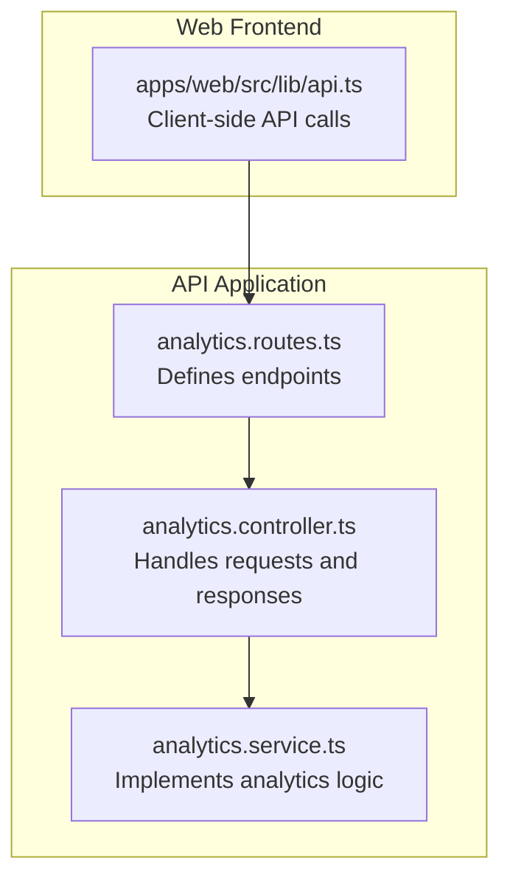
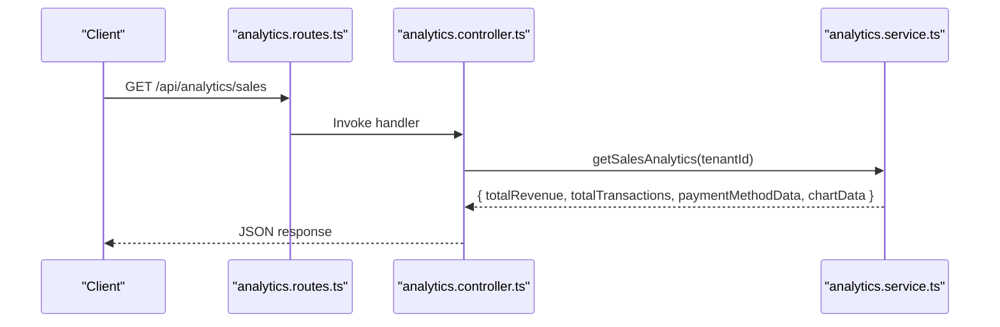
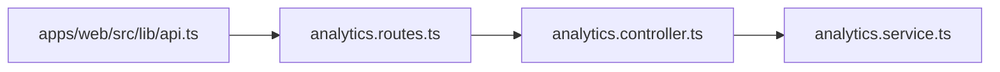

# Analytics & Reporting API

<cite>
**Referenced Files in This Document**
- [analytics.routes.ts](file://apps/api/src/routes/analytics.routes.ts)
- [analytics.controller.ts](file://apps/api/src/controllers/analytics.controller.ts)
- [analytics.service.ts](file://apps/api/src/services/analytics.service.ts)
- [api.ts](file://apps/web/src/lib/api.ts)
</cite>

## Table of Contents
1. [Introduction](#introduction)
2. [Project Structure](#project-structure)
3. [Core Components](#core-components)
4. [Architecture Overview](#architecture-overview)
5. [Detailed Component Analysis](#detailed-component-analysis)
6. [Dependency Analysis](#dependency-analysis)
7. [Performance Considerations](#performance-considerations)
8. [Troubleshooting Guide](#troubleshooting-guide)
9. [Conclusion](#conclusion)
10. [Appendices](#appendices)

## Introduction
This document provides comprehensive API documentation for the Analytics and Reporting module. It covers endpoint definitions, request/response formats, filtering mechanisms, aggregation behavior, supported output formats, export capabilities, real-time dashboard metrics, historical trend analysis, and integration patterns with business intelligence tools. The module exposes endpoints for sales performance, product analytics, profit and loss, customer analytics, and a dashboard summary.

## Project Structure
The Analytics module follows a layered architecture:
- Routes define the HTTP endpoints and attach authentication middleware.
- Controllers handle request parsing, invoke service logic, and format responses.
- Services encapsulate data retrieval, aggregation, and computation.
- The frontend integrates with these endpoints to render dashboards and reports.

**Diagram sources**
- [analytics.routes.ts:1-15](file://apps/api/src/routes/analytics.routes.ts#L1-L15)
- [analytics.controller.ts:1-60](file://apps/api/src/controllers/analytics.controller.ts#L1-L60)
- [analytics.service.ts:1-400](file://apps/api/src/services/analytics.service.ts#L1-L400)
- [api.ts:220-510](file://apps/web/src/lib/api.ts#L220-L510)

**Section sources**
- [analytics.routes.ts:1-15](file://apps/api/src/routes/analytics.routes.ts#L1-L15)
- [analytics.controller.ts:1-60](file://apps/api/src/controllers/analytics.controller.ts#L1-L60)
- [analytics.service.ts:1-400](file://apps/api/src/services/analytics.service.ts#L1-L400)
- [api.ts:220-510](file://apps/web/src/lib/api.ts#L220-L510)

## Core Components
- Routes: Mount analytics endpoints under /api/analytics and apply authentication middleware.
- Controller: Delegates analytics queries to the service and returns structured JSON responses.
- Service: Implements analytics computations, aggregations, and chart data generation.

Key endpoint coverage:
- GET /api/analytics/dashboard: Real-time dashboard metrics.
- GET /api/analytics/sales: Sales performance metrics.
- GET /api/analytics/products: Product analytics.
- GET /api/analytics/profit-loss: Profit and loss analytics.
- GET /api/analytics/customers: Customer analytics.

Filtering and aggregation:
- Tenant scoping via user context.
- Date range filtering is supported in the underlying service logic for historical trends.
- Aggregation functions include totals, counts, averages, and ratios (e.g., margins).
- Chart data is generated for time-series visualizations.

Output formats and export:
- JSON responses for consumption by dashboards and BI tools.
- Export capabilities are not explicitly defined in the current implementation; clients can serialize returned JSON for downstream use.

Real-time and historical:
- Real-time metrics include today’s revenue, transaction count, active products, and top products.
- Historical trend analysis is available for sales and profit/loss over a rolling window.

Integration:
- Frontend client calls endpoints and handles responses for rendering charts and tables.
- BI tools can consume JSON responses and build custom visualizations.

**Section sources**
- [analytics.routes.ts:6-12](file://apps/api/src/routes/analytics.routes.ts#L6-L12)
- [analytics.controller.ts:1-60](file://apps/api/src/controllers/analytics.controller.ts#L1-L60)
- [analytics.service.ts:116-220](file://apps/api/src/services/analytics.service.ts#L116-L220)
- [api.ts:226-510](file://apps/web/src/lib/api.ts#L226-L510)

## Architecture Overview
The analytics pipeline follows a clean separation of concerns:
- Route layer validates and authenticates requests.
- Controller layer extracts tenant context and invokes services.
- Service layer performs database queries, aggregations, and computes chart series.

**Diagram sources**
- [analytics.routes.ts:8-8](file://apps/api/src/routes/analytics.routes.ts#L8-L8)
- [analytics.controller.ts:1-60](file://apps/api/src/controllers/analytics.controller.ts#L1-L60)
- [analytics.service.ts:131-199](file://apps/api/src/services/analytics.service.ts#L131-L199)

## Detailed Component Analysis

### Endpoint: GET /api/analytics/dashboard
- Purpose: Provides real-time dashboard metrics including today’s revenue, transaction count, active products, top products, and a 30-day revenue chart.
- Request
  - Path: /api/analytics/dashboard
  - Method: GET
  - Authentication: Required (tenant-scoped)
- Response
  - Fields:
    - todayRevenue: number
    - todayTransactions: number
    - activeProducts: number
    - topProducts: array of product records
    - chartData: array of daily revenue entries
- Notes
  - Tenant scoping is applied via the authenticated user context.
  - Chart data spans a 30-day rolling window.

**Section sources**
- [analytics.routes.ts:7-7](file://apps/api/src/routes/analytics.routes.ts#L7-L7)
- [analytics.controller.ts:1-38](file://apps/api/src/controllers/analytics.controller.ts#L1-L38)
- [analytics.service.ts:116-129](file://apps/api/src/services/analytics.service.ts#L116-L129)

### Endpoint: GET /api/analytics/sales
- Purpose: Returns sales performance metrics including total revenue, total transactions, payment method distribution, and a 30-day revenue chart.
- Request
  - Path: /api/analytics/sales
  - Method: GET
  - Query parameters:
    - start_date: optional date filter
    - end_date: optional date filter
  - Authentication: Required (tenant-scoped)
- Response
  - Fields:
    - totalRevenue: number
    - totalTransactions: number
    - paymentMethodData: array of { label, value }
    - chartData: array of { date, revenue }
- Notes
  - Date range filtering is supported in the service logic for historical analysis.
  - Payment method distribution aggregates completed transactions.

**Section sources**
- [analytics.routes.ts:8-8](file://apps/api/src/routes/analytics.routes.ts#L8-L8)
- [analytics.controller.ts:1-38](file://apps/api/src/controllers/analytics.controller.ts#L1-L38)
- [analytics.service.ts:131-199](file://apps/api/src/services/analytics.service.ts#L131-L199)

### Endpoint: GET /api/analytics/products
- Purpose: Provides product-level analytics including quantities sold, subtotal per product, and stock levels for completed transactions.
- Request
  - Path: /api/analytics/products
  - Method: GET
  - Query parameters:
    - start_date: optional date filter
    - end_date: optional date filter
  - Authentication: Required (tenant-scoped)
- Response
  - Fields:
    - productId: string
    - productName: string
    - quantity: number
    - subtotal: number
    - stock: number
- Notes
  - Aggregations are computed from transaction items joined with transactions and products.
  - Date range filtering supports historical trend analysis.

**Section sources**
- [analytics.routes.ts:9-9](file://apps/api/src/routes/analytics.routes.ts#L9-L9)
- [analytics.controller.ts:1-38](file://apps/api/src/controllers/analytics.controller.ts#L1-L38)
- [analytics.service.ts:202-270](file://apps/api/src/services/analytics.service.ts#L202-L270)

### Endpoint: GET /api/analytics/profit-loss
- Purpose: Computes revenue, cost of goods, gross profit, and margin over time for completed transactions.
- Request
  - Path: /api/analytics/profit-loss
  - Method: GET
  - Query parameters:
    - start_date: optional date filter
    - end_date: optional date filter
  - Authentication: Required (tenant-scoped)
- Response
  - Fields:
    - totalRevenue: number
    - totalCOGS: number
    - grossProfit: number
    - margin: number (percentage)
    - chartData: array of { date, revenue, profit }
- Notes
  - COGS is derived from product analytics and transaction item costs.
  - Margin is calculated as (revenue - COGS) / revenue * 100.

**Section sources**
- [analytics.routes.ts:10-10](file://apps/api/src/routes/analytics.routes.ts#L10-L10)
- [analytics.controller.ts:39-48](file://apps/api/src/controllers/analytics.controller.ts#L39-L48)
- [analytics.service.ts:240-269](file://apps/api/src/services/analytics.service.ts#L240-L269)

### Endpoint: GET /api/analytics/customers
- Purpose: Returns customer analytics including total customer count, new customers in the last 30 days, and customer spending profiles.
- Request
  - Path: /api/analytics/customers
  - Method: GET
  - Query parameters:
    - start_date: optional date filter
    - end_date: optional date filter
  - Authentication: Required (tenant-scoped)
- Response
  - Fields:
    - totalCustomers: number
    - newCustomersThisMonth: number
    - customers: array of customer records with metrics
- Notes
  - New customer detection uses a 30-day threshold.
  - Date range filtering enables historical cohort analysis.

**Section sources**
- [analytics.routes.ts:11-11](file://apps/api/src/routes/analytics.routes.ts#L11-L11)
- [analytics.controller.ts:49-58](file://apps/api/src/controllers/analytics.controller.ts#L49-L58)
- [analytics.service.ts:271-320](file://apps/api/src/services/analytics.service.ts#L271-L320)

### Data Filtering Patterns
- Tenant scoping: All endpoints rely on the authenticated user’s tenant identifier.
- Date range filtering: Implemented in service logic for sales, product, and profit/loss analytics.
- Payment method segmentation: Available in sales analytics for payment mix insights.

**Section sources**
- [analytics.controller.ts:1-60](file://apps/api/src/controllers/analytics.controller.ts#L1-L60)
- [analytics.service.ts:131-199](file://apps/api/src/services/analytics.service.ts#L131-L199)

### Report Generation Workflows
- Sales report:
  - Fetch /api/analytics/sales with optional date range.
  - Render total revenue, transaction count, payment method distribution, and 30-day chart.
- Product performance report:
  - Fetch /api/analytics/products with optional date range.
  - Aggregate by product and rank by quantity/subtotal.
- Profit and loss report:
  - Fetch /api/analytics/profit-loss with optional date range.
  - Compute margin and visualize revenue vs. profit over time.
- Customer behavior report:
  - Fetch /api/analytics/customers with optional date range.
  - Segment by acquisition period and spending tiers.

**Section sources**
- [analytics.routes.ts:7-11](file://apps/api/src/routes/analytics.routes.ts#L7-L11)
- [analytics.controller.ts:1-60](file://apps/api/src/controllers/analytics.controller.ts#L1-L60)
- [analytics.service.ts:131-320](file://apps/api/src/services/analytics.service.ts#L131-L320)

### Integration with Business Intelligence Tools
- Consume JSON responses from analytics endpoints.
- Build dashboards using external BI platforms by importing JSON data.
- Use exportable JSON for offline analysis and custom reporting.

**Section sources**
- [api.ts:226-510](file://apps/web/src/lib/api.ts#L226-L510)

## Dependency Analysis

**Diagram sources**
- [analytics.routes.ts:1-15](file://apps/api/src/routes/analytics.routes.ts#L1-L15)
- [analytics.controller.ts:1-60](file://apps/api/src/controllers/analytics.controller.ts#L1-L60)
- [analytics.service.ts:1-400](file://apps/api/src/services/analytics.service.ts#L1-L400)
- [api.ts:226-510](file://apps/web/src/lib/api.ts#L226-L510)

**Section sources**
- [analytics.routes.ts:1-15](file://apps/api/src/routes/analytics.routes.ts#L1-L15)
- [analytics.controller.ts:1-60](file://apps/api/src/controllers/analytics.controller.ts#L1-L60)
- [analytics.service.ts:1-400](file://apps/api/src/services/analytics.service.ts#L1-L400)
- [api.ts:226-510](file://apps/web/src/lib/api.ts#L226-L510)

## Performance Considerations
- Aggregation queries join multiple tables; ensure appropriate indexing on transaction timestamps, tenant identifiers, and foreign keys.
- Time-series chart generation iterates over a fixed window; keep the window size reasonable to avoid large payloads.
- Consider pagination for large datasets (e.g., customer lists) if extended use cases require it.

## Troubleshooting Guide
- Authentication failures: Ensure requests include valid tenant-scoped credentials.
- Empty or minimal data: Verify date range filters and tenant scoping.
- Service errors: The controller catches exceptions and returns structured error messages; inspect the error payload for details.

**Section sources**
- [analytics.controller.ts:1-60](file://apps/api/src/controllers/analytics.controller.ts#L1-L60)
- [analytics.service.ts:123-127](file://apps/api/src/services/analytics.service.ts#L123-L127)

## Conclusion
The Analytics and Reporting module provides a robust foundation for real-time dashboards and historical trend analysis. It supports tenant-scoped queries, flexible date filtering, and structured JSON responses suitable for integration with BI tools. Future enhancements could include explicit export endpoints and expanded segmentation options.

## Appendices

### Endpoint Reference Summary
- GET /api/analytics/dashboard
  - Response fields: todayRevenue, todayTransactions, activeProducts, topProducts, chartData
- GET /api/analytics/sales
  - Response fields: totalRevenue, totalTransactions, paymentMethodData, chartData
- GET /api/analytics/products
  - Response fields: productId, productName, quantity, subtotal, stock
- GET /api/analytics/profit-loss
  - Response fields: totalRevenue, totalCOGS, grossProfit, margin, chartData
- GET /api/analytics/customers
  - Response fields: totalCustomers, newCustomersThisMonth, customers

**Section sources**
- [analytics.routes.ts:7-11](file://apps/api/src/routes/analytics.routes.ts#L7-L11)
- [analytics.controller.ts:1-60](file://apps/api/src/controllers/analytics.controller.ts#L1-L60)
- [analytics.service.ts:116-320](file://apps/api/src/services/analytics.service.ts#L116-L320)