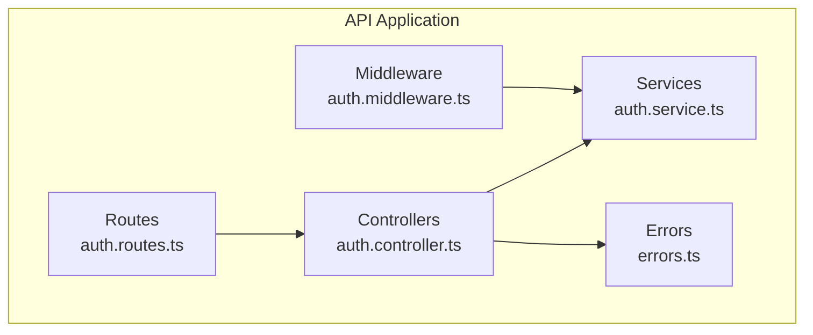
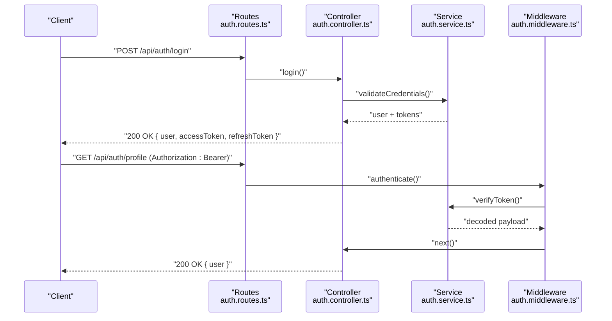
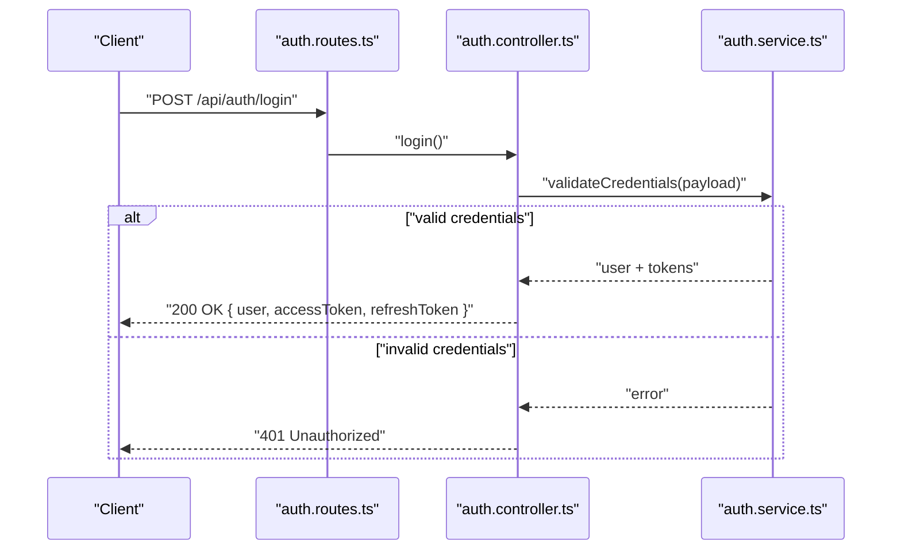
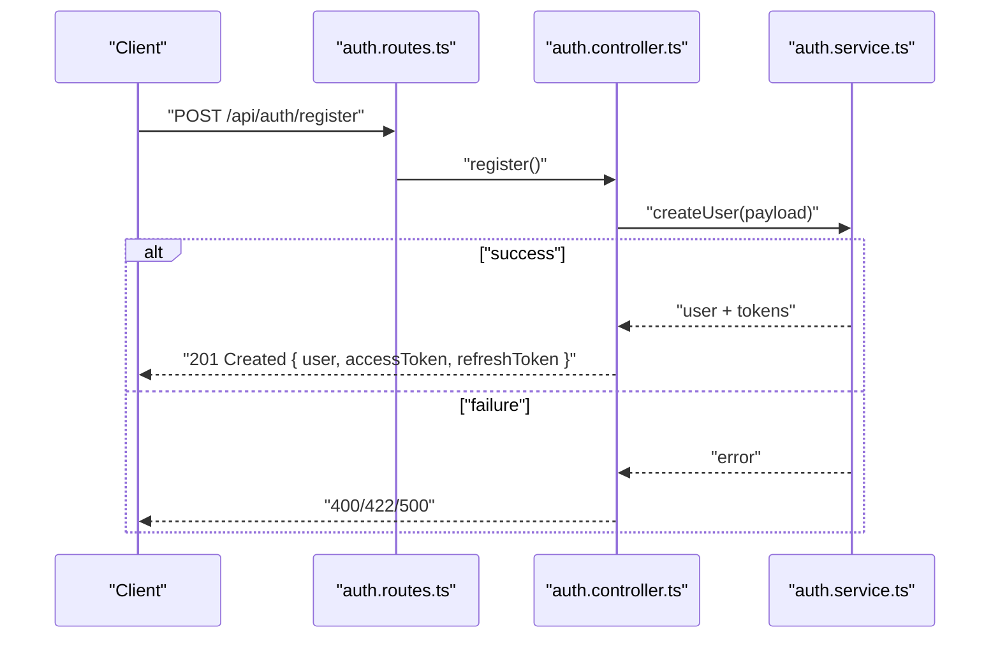
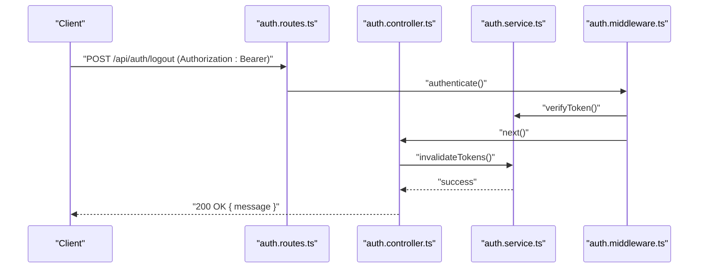
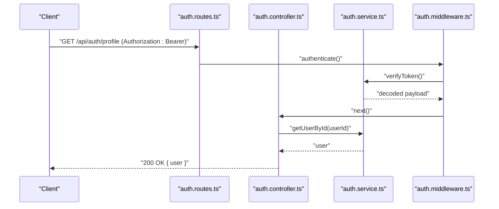
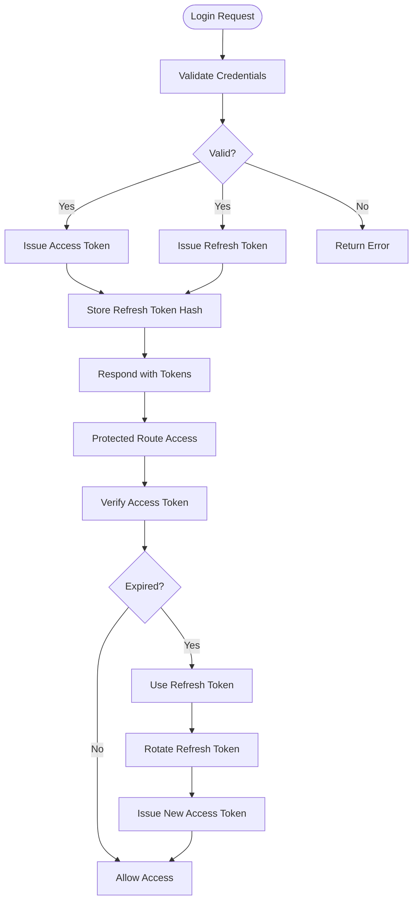
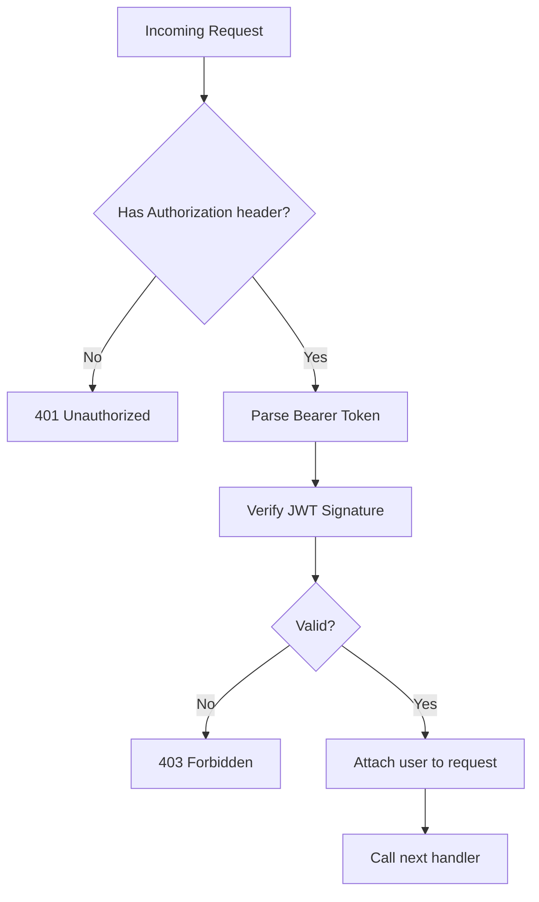
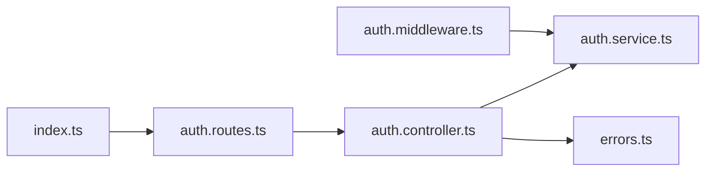

# Authentication API

<cite>
**Referenced Files in This Document**
- [auth.controller.ts](file://apps/api/src/controllers/auth.controller.ts)
- [auth.routes.ts](file://apps/api/src/routes/auth.routes.ts)
- [auth.service.ts](file://apps/api/src/services/auth.service.ts)
- [auth.middleware.ts](file://apps/api/src/middleware/auth.ts)
- [errors.ts](file://apps/api/src/lib/errors.ts)
- [index.ts](file://apps/api/src/index.ts)
</cite>

## Table of Contents
1. [Introduction](#introduction)
2. [Project Structure](#project-structure)
3. [Core Components](#core-components)
4. [Architecture Overview](#architecture-overview)
5. [Detailed Component Analysis](#detailed-component-analysis)
6. [Dependency Analysis](#dependency-analysis)
7. [Performance Considerations](#performance-considerations)
8. [Troubleshooting Guide](#troubleshooting-guide)
9. [Conclusion](#conclusion)

## Introduction
This document provides comprehensive API documentation for the Authentication module. It covers all authentication endpoints, request/response schemas, authentication requirements, error handling, JWT token generation, refresh token handling, password hashing, session management, middleware authentication flow, role-based access control, and security considerations. Practical examples illustrate login/logout workflows, token validation, and protected route access patterns.

## Project Structure
The Authentication module is implemented in the API application under apps/api. Key components include:
- Controllers: handle HTTP requests and responses for authentication
- Routes: define endpoint URLs and bind controllers
- Services: encapsulate business logic for authentication operations
- Middleware: enforce authentication and authorization
- Errors: standardized error handling utilities

**Diagram sources**
- [auth.routes.ts](file://apps/api/src/routes/auth.routes.ts)
- [auth.controller.ts](file://apps/api/src/controllers/auth.controller.ts)
- [auth.service.ts](file://apps/api/src/services/auth.service.ts)
- [auth.middleware.ts](file://apps/api/src/middleware/auth.ts)
- [errors.ts](file://apps/api/src/lib/errors.ts)

**Section sources**
- [auth.routes.ts](file://apps/api/src/routes/auth.routes.ts)
- [auth.controller.ts](file://apps/api/src/controllers/auth.controller.ts)
- [auth.service.ts](file://apps/api/src/services/auth.service.ts)
- [auth.middleware.ts](file://apps/api/src/middleware/auth.ts)
- [errors.ts](file://apps/api/src/lib/errors.ts)

## Core Components
- Authentication Controller: Implements endpoints for login, registration, logout, and profile retrieval
- Authentication Service: Handles password hashing, token generation, refresh token management, and user validation
- Authentication Middleware: Validates JWT tokens and enforces protected route access
- Error Utilities: Provides consistent error responses for authentication failures

**Section sources**
- [auth.controller.ts](file://apps/api/src/controllers/auth.controller.ts)
- [auth.service.ts](file://apps/api/src/services/auth.service.ts)
- [auth.middleware.ts](file://apps/api/src/middleware/auth.ts)
- [errors.ts](file://apps/api/src/lib/errors.ts)

## Architecture Overview
The authentication flow integrates routes, controllers, services, and middleware to provide secure user authentication and session management.

**Diagram sources**
- [auth.routes.ts](file://apps/api/src/routes/auth.routes.ts)
- [auth.controller.ts](file://apps/api/src/controllers/auth.controller.ts)
- [auth.service.ts](file://apps/api/src/services/auth.service.ts)
- [auth.middleware.ts](file://apps/api/src/middleware/auth.ts)

## Detailed Component Analysis

### Authentication Endpoints

#### POST /api/auth/login
- Purpose: Authenticate a user and return access and refresh tokens
- Request body schema: Includes credentials (e.g., email and password)
- Response schema: Returns user profile, access token, and refresh token
- Authentication requirement: None
- Error handling: Invalid credentials, account disabled, server errors

**Diagram sources**
- [auth.routes.ts](file://apps/api/src/routes/auth.routes.ts)
- [auth.controller.ts](file://apps/api/src/controllers/auth.controller.ts)
- [auth.service.ts](file://apps/api/src/services/auth.service.ts)

**Section sources**
- [auth.routes.ts](file://apps/api/src/routes/auth.routes.ts)
- [auth.controller.ts](file://apps/api/src/controllers/auth.controller.ts)
- [auth.service.ts](file://apps/api/src/services/auth.service.ts)

#### POST /api/auth/register
- Purpose: Register a new user account
- Request body schema: Includes user details (e.g., name, email, password)
- Response schema: Returns created user profile and initial tokens
- Authentication requirement: None
- Error handling: Duplicate email, invalid input, server errors

**Diagram sources**
- [auth.routes.ts](file://apps/api/src/routes/auth.routes.ts)
- [auth.controller.ts](file://apps/api/src/controllers/auth.controller.ts)
- [auth.service.ts](file://apps/api/src/services/auth.service.ts)

**Section sources**
- [auth.routes.ts](file://apps/api/src/routes/auth.routes.ts)
- [auth.controller.ts](file://apps/api/src/controllers/auth.controller.ts)
- [auth.service.ts](file://apps/api/src/services/auth.service.ts)

#### POST /api/auth/logout
- Purpose: Terminate current session by invalidating tokens
- Request body schema: Optional (depends on implementation)
- Response schema: Confirmation of logout success
- Authentication requirement: Requires valid access token
- Error handling: Token missing, invalid token, server errors

**Diagram sources**
- [auth.routes.ts](file://apps/api/src/routes/auth.routes.ts)
- [auth.controller.ts](file://apps/api/src/controllers/auth.controller.ts)
- [auth.service.ts](file://apps/api/src/services/auth.service.ts)
- [auth.middleware.ts](file://apps/api/src/middleware/auth.ts)

**Section sources**
- [auth.routes.ts](file://apps/api/src/routes/auth.routes.ts)
- [auth.controller.ts](file://apps/api/src/controllers/auth.controller.ts)
- [auth.service.ts](file://apps/api/src/services/auth.service.ts)
- [auth.middleware.ts](file://apps/api/src/middleware/auth.ts)

#### GET /api/auth/profile
- Purpose: Retrieve authenticated user’s profile
- Request headers: Authorization: Bearer <access_token>
- Response schema: Returns user profile
- Authentication requirement: Requires valid access token
- Error handling: Missing/invalid token, user not found, server errors

**Diagram sources**
- [auth.routes.ts](file://apps/api/src/routes/auth.routes.ts)
- [auth.controller.ts](file://apps/api/src/controllers/auth.controller.ts)
- [auth.service.ts](file://apps/api/src/services/auth.service.ts)
- [auth.middleware.ts](file://apps/api/src/middleware/auth.ts)

**Section sources**
- [auth.routes.ts](file://apps/api/src/routes/auth.routes.ts)
- [auth.controller.ts](file://apps/api/src/controllers/auth.controller.ts)
- [auth.service.ts](file://apps/api/src/services/auth.service.ts)
- [auth.middleware.ts](file://apps/api/src/middleware/auth.ts)

### JWT Token Generation and Refresh Token Handling
- Access token: Short-lived token included in response bodies and Authorization headers
- Refresh token: Long-lived token used to obtain new access tokens
- Token lifecycle: Access tokens are validated on protected routes; refresh tokens are rotated and stored securely
- Security: Tokens are signed and verified using shared secrets; refresh tokens are stored with hashed identifiers

**Diagram sources**
- [auth.service.ts](file://apps/api/src/services/auth.service.ts)

**Section sources**
- [auth.service.ts](file://apps/api/src/services/auth.service.ts)

### Password Hashing
- Passwords are hashed using a secure hashing algorithm before storage
- Verification compares provided passwords against stored hashes
- Salted hashing ensures resistance to rainbow table attacks

**Section sources**
- [auth.service.ts](file://apps/api/src/services/auth.service.ts)

### Session Management
- Sessions are stateless via JWT tokens; server does not maintain server-side session state
- Logout invalidates tokens by storing revocation markers or relying on short-lived access tokens
- Refresh token rotation enhances security by limiting reuse

**Section sources**
- [auth.service.ts](file://apps/api/src/services/auth.service.ts)
- [auth.controller.ts](file://apps/api/src/controllers/auth.controller.ts)

### Middleware Authentication Flow
- Middleware intercepts protected routes and validates Authorization headers
- Decodes and verifies JWT; extracts user identity for downstream handlers
- Enforces bearer token scheme and handles malformed/expired tokens

**Diagram sources**
- [auth.middleware.ts](file://apps/api/src/middleware/auth.ts)

**Section sources**
- [auth.middleware.ts](file://apps/api/src/middleware/auth.ts)

### Role-Based Access Control (RBAC)
- RBAC can be implemented by attaching roles to user profiles and enforcing role checks in middleware or controllers
- Protected routes can restrict access to specific roles (e.g., admin-only endpoints)
- Recommendation: Extend middleware to validate roles derived from decoded tokens

[No sources needed since this section provides general guidance]

### Security Considerations
- Use HTTPS in production to protect tokens in transit
- Store secrets securely and rotate them periodically
- Implement rate limiting for authentication endpoints
- Sanitize and validate all inputs
- Use short-lived access tokens and long-lived refresh tokens with rotation
- Log authentication events and monitor anomalies

[No sources needed since this section provides general guidance]

## Dependency Analysis
The authentication module exhibits clear separation of concerns with low coupling between components.

**Diagram sources**
- [auth.routes.ts](file://apps/api/src/routes/auth.routes.ts)
- [auth.controller.ts](file://apps/api/src/controllers/auth.controller.ts)
- [auth.service.ts](file://apps/api/src/services/auth.service.ts)
- [auth.middleware.ts](file://apps/api/src/middleware/auth.ts)
- [errors.ts](file://apps/api/src/lib/errors.ts)
- [index.ts](file://apps/api/src/index.ts)

**Section sources**
- [auth.routes.ts](file://apps/api/src/routes/auth.routes.ts)
- [auth.controller.ts](file://apps/api/src/controllers/auth.controller.ts)
- [auth.service.ts](file://apps/api/src/services/auth.service.ts)
- [auth.middleware.ts](file://apps/api/src/middleware/auth.ts)
- [errors.ts](file://apps/api/src/lib/errors.ts)
- [index.ts](file://apps/api/src/index.ts)

## Performance Considerations
- Minimize database queries in authentication flow; cache frequently accessed user data
- Use efficient hashing algorithms and tune cost factors appropriately
- Implement connection pooling and optimize token verification operations
- Consider asynchronous processing for non-critical tasks during authentication

[No sources needed since this section provides general guidance]

## Troubleshooting Guide
Common issues and resolutions:
- 401 Unauthorized: Verify Authorization header format and token validity
- 403 Forbidden: Check token signature and expiration; ensure user is authorized
- 400/422 Bad Request: Validate request payload schema and required fields
- 500 Internal Server Error: Inspect service logs and error utilities for underlying causes

**Section sources**
- [errors.ts](file://apps/api/src/lib/errors.ts)
- [auth.controller.ts](file://apps/api/src/controllers/auth.controller.ts)
- [auth.service.ts](file://apps/api/src/services/auth.service.ts)

## Conclusion
The Authentication module provides robust, secure, and scalable endpoints for user login, registration, logout, and profile retrieval. It leverages JWT for stateless sessions, implements secure password hashing, manages refresh tokens, and enforces middleware-based authentication. By following the documented patterns and security considerations, developers can integrate and extend the authentication system effectively.