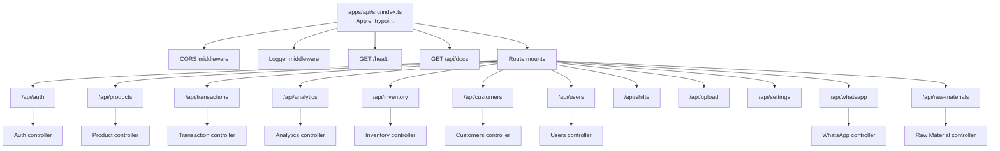
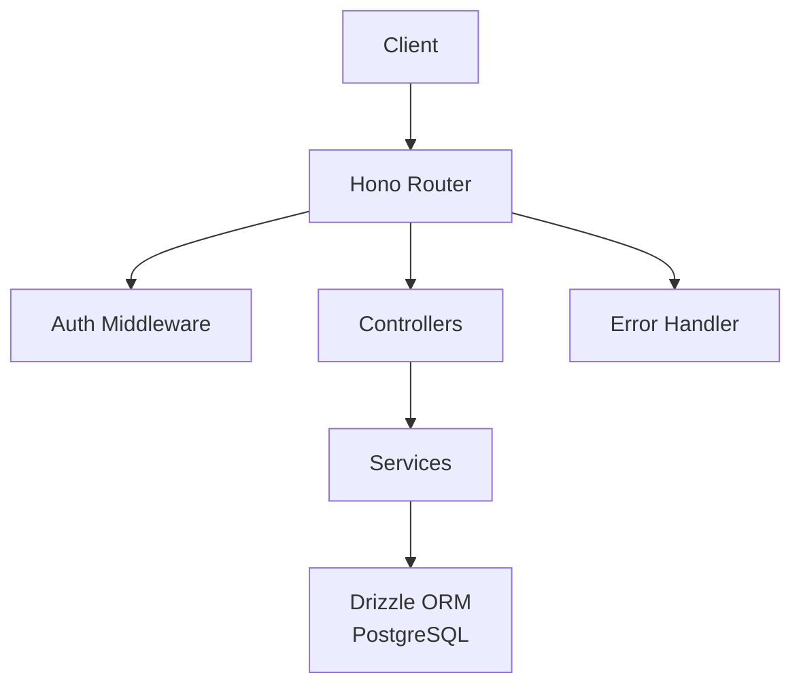
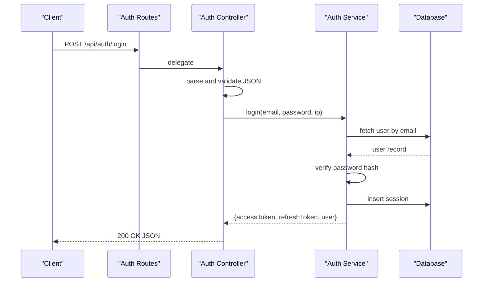
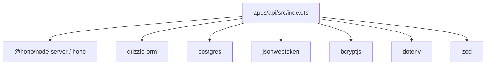

# Backend API Documentation

<cite>
**Referenced Files in This Document**
- [apps/api/src/index.ts](file://apps/api/src/index.ts)
- [apps/api/src/middleware/auth.ts](file://apps/api/src/middleware/auth.ts)
- [apps/api/src/middleware/errorHandler.ts](file://apps/api/src/middleware/errorHandler.ts)
- [apps/api/src/lib/db.ts](file://apps/api/src/lib/db.ts)
- [apps/api/package.json](file://apps/api/package.json)
- [apps/api/public/openapi.json](file://apps/api/public/openapi.json)
- [apps/api/src/routes/auth.routes.ts](file://apps/api/src/routes/auth.routes.ts)
- [apps/api/src/controllers/auth.controller.ts](file://apps/api/src/controllers/auth.controller.ts)
- [apps/api/src/services/auth.service.ts](file://apps/api/src/services/auth.service.ts)
- [apps/api/src/routes/product.routes.ts](file://apps/api/src/routes/product.routes.ts)
- [apps/api/src/routes/transaction.routes.ts](file://apps/api/src/routes/transaction.routes.ts)
- [apps/api/src/routes/analytics.routes.ts](file://apps/api/src/routes/analytics.routes.ts)
- [apps/api/src/routes/inventory.routes.ts](file://apps/api/src/routes/inventory.routes.ts)
- [apps/api/src/routes/customers.routes.ts](file://apps/api/src/routes/customers.routes.ts)
- [apps/api/src/routes/users.routes.ts](file://apps/api/src/routes/users.routes.ts)
- [apps/api/src/routes/whatsapp.routes.ts](file://apps/api/src/routes/whatsapp.routes.ts)
- [apps/api/src/routes/rawMaterial.routes.ts](file://apps/api/src/routes/rawMaterial.routes.ts)
</cite>

## Table of Contents
1. [Introduction](#introduction)
2. [Project Structure](#project-structure)
3. [Core Components](#core-components)
4. [Architecture Overview](#architecture-overview)
5. [Detailed Component Analysis](#detailed-component-analysis)
6. [Dependency Analysis](#dependency-analysis)
7. [Performance Considerations](#performance-considerations)
8. [Troubleshooting Guide](#troubleshooting-guide)
9. [Conclusion](#conclusion)
10. [Appendices](#appendices)

## Introduction
This document provides comprehensive API documentation for the ARHAT POS backend services built with Hono. It covers all RESTful endpoints grouped by functional modules, including Authentication, Product Management, Transaction Processing, Analytics, Inventory, Customers, Users, and WhatsApp Integration. For each endpoint, you will find HTTP methods, URL patterns, request/response schemas, authentication requirements, and error handling behavior. The document also explains the middleware stack, service layer architecture, data access patterns, API versioning strategy, rate limiting considerations, and security measures. Practical usage examples and integration guidelines for frontend applications are included.

## Project Structure
The backend is organized around a modular routing pattern with dedicated route files per module, controllers for request handling, services for business logic, and middleware for cross-cutting concerns. The application entrypoint wires up CORS, logging, health checks, OpenAPI documentation, and mounts all module routes.

**Diagram sources**
- [apps/api/src/index.ts:80-92](file://apps/api/src/index.ts#L80-L92)
- [apps/api/src/routes/auth.routes.ts:1-18](file://apps/api/src/routes/auth.routes.ts#L1-L18)
- [apps/api/src/routes/product.routes.ts:1-19](file://apps/api/src/routes/product.routes.ts#L1-L19)
- [apps/api/src/routes/transaction.routes.ts:1-23](file://apps/api/src/routes/transaction.routes.ts#L1-L23)
- [apps/api/src/routes/analytics.routes.ts:1-15](file://apps/api/src/routes/analytics.routes.ts#L1-L15)
- [apps/api/src/routes/inventory.routes.ts:1-110](file://apps/api/src/routes/inventory.routes.ts#L1-L110)
- [apps/api/src/routes/customers.routes.ts:1-116](file://apps/api/src/routes/customers.routes.ts#L1-L116)
- [apps/api/src/routes/users.routes.ts](file://apps/api/src/routes/users.routes.ts)
- [apps/api/src/routes/whatsapp.routes.ts](file://apps/api/src/routes/whatsapp.routes.ts)
- [apps/api/src/routes/rawMaterial.routes.ts](file://apps/api/src/routes/rawMaterial.routes.ts)

**Section sources**
- [apps/api/src/index.ts:19-44](file://apps/api/src/index.ts#L19-L44)
- [apps/api/src/index.ts:80-99](file://apps/api/src/index.ts#L80-L99)

## Core Components
- Application entrypoint and middleware stack:
  - CORS configured with allowed origins and credentials support.
  - Request logging via Hono logger.
  - Health check endpoint returning a simple JSON payload.
  - OpenAPI documentation served via Swagger UI, referencing the static OpenAPI spec.
- Route registration:
  - All module routes mounted under /api/{module}.
- Error handling:
  - Centralized error handler converts AppError instances to structured JSON responses with appropriate HTTP status codes; unknown errors are logged and returned as internal server errors.

Key behaviors:
- CORS origin validation allows requests with no origin (e.g., CLI tools) and supports configured origins.
- Logging provides request tracing for debugging and monitoring.
- OpenAPI documentation is served at /api/docs and references /openapi.json.

**Section sources**
- [apps/api/src/index.ts:19-44](file://apps/api/src/index.ts#L19-L44)
- [apps/api/src/index.ts:47-78](file://apps/api/src/index.ts#L47-L78)
- [apps/api/src/index.ts:80-99](file://apps/api/src/index.ts#L80-L99)
- [apps/api/src/middleware/errorHandler.ts:1-11](file://apps/api/src/middleware/errorHandler.ts#L1-L11)

## Architecture Overview
The backend follows a layered architecture:
- Routing layer: Hono routes define endpoint contracts and bind to controllers.
- Controller layer: Handles request parsing, validation, and response formatting.
- Service layer: Encapsulates business logic and orchestrates data operations.
- Data access layer: Uses Drizzle ORM with PostgreSQL via a shared database client.
- Middleware layer: Authentication, error handling, and request validation.

**Diagram sources**
- [apps/api/src/index.ts:1-17](file://apps/api/src/index.ts#L1-L17)
- [apps/api/src/middleware/auth.ts:1-34](file://apps/api/src/middleware/auth.ts#L1-L34)
- [apps/api/src/middleware/errorHandler.ts:1-11](file://apps/api/src/middleware/errorHandler.ts#L1-L11)
- [apps/api/src/lib/db.ts:1-27](file://apps/api/src/lib/db.ts#L1-L27)

## Detailed Component Analysis

### Authentication Module (/api/auth)
Endpoints:
- POST /api/auth/register-tenant
  - Purpose: Register a new tenant and initial admin user.
  - Authentication: Not protected by auth middleware.
  - Request body schema: Includes tenant name, email, password, and owner full name.
  - Response: Created resource with tenant, outlet, and user details.
  - Errors: Validation errors mapped to 400; duplicate email mapped to 409; server misconfiguration mapped to 500.
- POST /api/auth/register
  - Purpose: Register a new user for an existing tenant.
  - Authentication: Not protected by auth middleware.
  - Request body schema: Email, password, full name, and tenant identifier.
  - Response: Created user and verification token metadata.
  - Errors: Validation errors mapped to 400; duplicate email mapped to 409.
- POST /api/auth/login
  - Purpose: Authenticate user by email/password and issue tokens.
  - Authentication: Not protected by auth middleware.
  - Request body schema: Email and password.
  - Response: Access token, refresh token, and user profile.
  - Errors: Invalid credentials mapped to 401; unverified email mapped to 403.
- POST /api/auth/login-pin
  - Purpose: Authenticate user by PIN and issue tokens.
  - Authentication: Not protected by auth middleware.
  - Request body schema: PIN.
  - Response: Access token, refresh token, and user profile.
  - Errors: Invalid PIN mapped to 401.
- GET /api/auth/me
  - Purpose: Retrieve current user profile.
  - Authentication: Protected by auth middleware; requires Bearer token.
  - Response: Current user object with id, tenantId, role, and email.
  - Errors: Unauthorized if token missing/invalid/expired.

Security and validation:
- Password validation performed during registration.
- JWT access and refresh tokens generated with expiration.
- Sessions recorded upon successful login.

**Diagram sources**
- [apps/api/src/routes/auth.routes.ts:7-10](file://apps/api/src/routes/auth.routes.ts#L7-L10)
- [apps/api/src/controllers/auth.controller.ts:56-71](file://apps/api/src/controllers/auth.controller.ts#L56-L71)
- [apps/api/src/services/auth.service.ts:140-177](file://apps/api/src/services/auth.service.ts#L140-L177)

**Section sources**
- [apps/api/src/routes/auth.routes.ts:1-18](file://apps/api/src/routes/auth.routes.ts#L1-L18)
- [apps/api/src/controllers/auth.controller.ts:25-90](file://apps/api/src/controllers/auth.controller.ts#L25-L90)
- [apps/api/src/services/auth.service.ts:9-254](file://apps/api/src/services/auth.service.ts#L9-L254)
- [apps/api/src/middleware/auth.ts:1-34](file://apps/api/src/middleware/auth.ts#L1-L34)

### Product Management Module (/api/products)
Endpoints:
- GET /api/products
  - Purpose: List products (search without query returns all active products).
  - Authentication: Protected by auth middleware.
  - Query parameters: Optional search term.
  - Response: Array of products.
- GET /api/products/search
  - Purpose: Search products with optional filters.
  - Authentication: Protected by auth middleware.
  - Response: Array of products matching criteria.
- GET /api/products/:id
  - Purpose: Retrieve a product by ID.
  - Authentication: Protected by auth middleware.
  - Response: Single product object.
- POST /api/products/
  - Purpose: Create a new product.
  - Authentication: Protected by auth middleware.
  - Response: Created product object.
- PUT /api/products/:id
  - Purpose: Update an existing product.
  - Authentication: Protected by auth middleware.
  - Response: Updated product object.
- DELETE /api/products/:id
  - Purpose: Delete a product.
  - Authentication: Protected by auth middleware.
  - Response: Deletion confirmation.

Validation and error handling:
- All endpoints protected by auth middleware; unauthorized requests receive 401.
- Business logic delegated to product service; errors propagate as AppError or mapped HTTP statuses.

**Section sources**
- [apps/api/src/routes/product.routes.ts:1-19](file://apps/api/src/routes/product.routes.ts#L1-L19)

### Transaction Processing Module (/api/transactions)
Endpoints:
- GET /api/transactions/
  - Purpose: List transactions.
  - Authentication: Protected by auth middleware.
  - Response: Array of transactions.
- POST /api/transactions/
  - Purpose: Create a new transaction.
  - Authentication: Protected by auth middleware.
  - Response: Created transaction object.
- POST /api/transactions/offline-sync
  - Purpose: Sync offline transactions.
  - Authentication: Protected by auth middleware.
  - Response: Sync result.
- POST /api/transactions/:id/checkout
  - Purpose: Finalize checkout for a transaction.
  - Authentication: Protected by auth middleware.
  - Response: Checkout result.
- POST /api/transactions/hold
  - Purpose: Hold a transaction.
  - Authentication: Protected by auth middleware.
  - Response: Held transaction object.
- GET /api/transactions/held
  - Purpose: Retrieve held transactions.
  - Authentication: Protected by auth middleware.
  - Response: Array of held transactions.
- POST /api/transactions/:id/resume
  - Purpose: Resume a held transaction.
  - Authentication: Protected by auth middleware.
  - Response: Resumed transaction object.
- POST /api/transactions/:id/refund
  - Purpose: Refund a transaction.
  - Authentication: Protected by auth middleware.
  - Response: Refund result.
- POST /api/transactions/:id/void
  - Purpose: Void a transaction.
  - Authentication: Protected by auth middleware.
  - Response: Void result.

Processing logic:
- End-to-end transaction lifecycle managed via transaction service.
- Offline sync supports reconciliation of client-side operations.

**Section sources**
- [apps/api/src/routes/transaction.routes.ts:1-23](file://apps/api/src/routes/transaction.routes.ts#L1-L23)

### Analytics Module (/api/analytics)
Endpoints:
- GET /api/analytics/dashboard
  - Purpose: Retrieve dashboard summary metrics.
  - Authentication: Protected by auth middleware.
  - Response: Dashboard metrics.
- GET /api/analytics/sales
  - Purpose: Retrieve sales analytics.
  - Authentication: Protected by auth middleware.
  - Response: Sales data.
- GET /api/analytics/products
  - Purpose: Retrieve product performance analytics.
  - Authentication: Protected by auth middleware.
  - Response: Product analytics.
- GET /api/analytics/profit-loss
  - Purpose: Retrieve profit and loss analytics.
  - Authentication: Protected by auth middleware.
  - Response: Profit/loss data.
- GET /api/analytics/customers
  - Purpose: Retrieve customer analytics.
  - Authentication: Protected by auth middleware.
  - Response: Customer analytics.

**Section sources**
- [apps/api/src/routes/analytics.routes.ts:1-15](file://apps/api/src/routes/analytics.routes.ts#L1-L15)

### Inventory Module (/api/inventory)
Endpoints:
- GET /api/inventory/movements
  - Purpose: List stock movements for tenant.
  - Authentication: Protected by auth middleware.
  - Response: Array of movements.
- GET /api/inventory/outlets
  - Purpose: List outlets for tenant.
  - Authentication: Protected by auth middleware.
  - Response: Array of outlets.
- POST /api/inventory/outlets
  - Purpose: Create a new outlet.
  - Authentication: Protected by auth middleware.
  - Request body: Outlet name and optional address.
  - Response: Created outlet.
- GET /api/inventory/outlets/:outletId/products
  - Purpose: List product stocks for a specific outlet.
  - Authentication: Protected by auth middleware.
  - Response: Array of product stocks.
- POST /api/inventory/movements
  - Purpose: Record a stock movement (in/out/adjustment).
  - Authentication: Protected by auth middleware.
  - Request body: outletId, productId, type, quantity, optional reason.
  - Response: Recorded movement.
- GET /api/inventory/outlets/:outletId/adjustments
  - Purpose: List adjustments for an outlet.
  - Authentication: Protected by auth middleware.
  - Response: Array of adjustments.
- POST /api/inventory/outlets/:outletId/adjustments
  - Purpose: Create an adjustment.
  - Authentication: Protected by auth middleware.
  - Request body: items array.
  - Response: Created adjustment.
- PATCH /api/inventory/adjustments/:id/approve
  - Purpose: Approve an adjustment.
  - Authentication: Protected by auth middleware.
  - Response: Approved adjustment.
- POST /api/inventory/outlets/:outletId/opname
  - Purpose: Initiate a stock count opname.
  - Authentication: Protected by auth middleware.
  - Response: New opname.
- POST /api/inventory/opname/:id/complete
  - Purpose: Complete an opname with counted items.
  - Authentication: Protected by auth middleware.
  - Request body: items array.
  - Response: Completed opname.
- POST /api/inventory/transfers
  - Purpose: Create a transfer between outlets.
  - Authentication: Protected by auth middleware.
  - Request body: sourceOutletId, destinationOutletId, items array.
  - Response: Created transfer.
- PATCH /api/inventory/transfers/:id/receive
  - Purpose: Receive a transfer at destination outlet.
  - Authentication: Protected by auth middleware.
  - Response: Received transfer.

Validation:
- Many endpoints validate required fields and return 400 on missing data.

**Section sources**
- [apps/api/src/routes/inventory.routes.ts:1-110](file://apps/api/src/routes/inventory.routes.ts#L1-L110)

### Customers Module (/api/customers)
Endpoints:
- GET /api/customers/
  - Purpose: List customers for the tenant, with optional search by name or phone.
  - Authentication: Protected by tenant-aware auth middleware.
  - Query parameters: q=search term.
  - Response: Array of customers.
- GET /api/customers/:id
  - Purpose: Retrieve a customer by ID.
  - Authentication: Protected by tenant-aware auth middleware.
  - Response: Single customer object.
- POST /api/customers/
  - Purpose: Create a new customer.
  - Authentication: Protected by tenant-aware auth middleware.
  - Response: Created customer.
- PUT /api/customers/:id
  - Purpose: Update an existing customer.
  - Authentication: Protected by tenant-aware auth middleware.
  - Response: Updated customer.
- GET /api/customers/:id/transactions
  - Purpose: Retrieve recent completed transactions for a customer.
  - Authentication: Protected by tenant-aware auth middleware.
  - Response: Array of transactions.

Ownership and tenant scoping:
- All endpoints enforce tenant isolation; requests outside the tenant return 404.

**Section sources**
- [apps/api/src/routes/customers.routes.ts:1-116](file://apps/api/src/routes/customers.routes.ts#L1-L116)

### Users Module (/api/users)
Endpoints:
- GET /api/users/
  - Purpose: List users for the tenant.
  - Authentication: Protected by tenant-aware auth middleware.
  - Response: Array of users.
- GET /api/users/:id
  - Purpose: Retrieve a user by ID.
  - Authentication: Protected by tenant-aware auth middleware.
  - Response: Single user object.
- POST /api/users/
  - Purpose: Create a new user.
  - Authentication: Protected by tenant-aware auth middleware.
  - Response: Created user.
- PUT /api/users/:id
  - Purpose: Update an existing user.
  - Authentication: Protected by tenant-aware auth middleware.
  - Response: Updated user.
- DELETE /api/users/:id
  - Purpose: Delete a user.
  - Authentication: Protected by tenant-aware auth middleware.
  - Response: Deletion confirmation.

Note: Specific controller/service implementations are defined in the routes file; refer to the route file for endpoint signatures and behavior.

**Section sources**
- [apps/api/src/routes/users.routes.ts](file://apps/api/src/routes/users.routes.ts)

### WhatsApp Integration Module (/api/whatsapp)
Endpoints:
- POST /api/whatsapp/send-message
  - Purpose: Send a message via WhatsApp.
  - Authentication: Protected by auth middleware.
  - Response: Message send result.
- POST /api/whatsapp/send-template
  - Purpose: Send a templated message via WhatsApp.
  - Authentication: Protected by auth middleware.
  - Response: Template send result.
- POST /api/whatsapp/webhook
  - Purpose: Handle incoming webhook events.
  - Authentication: Protected by auth middleware.
  - Response: Webhook processing result.

Note: Specific controller/service implementations are defined in the routes file; refer to the route file for endpoint signatures and behavior.

**Section sources**
- [apps/api/src/routes/whatsapp.routes.ts](file://apps/api/src/routes/whatsapp.routes.ts)

### Raw Materials Module (/api/raw-materials)
Endpoints:
- GET /api/raw-materials/
  - Purpose: List raw materials for the tenant.
  - Authentication: Protected by auth middleware.
  - Response: Array of raw materials.
- GET /api/raw-materials/:id
  - Purpose: Retrieve a raw material by ID.
  - Authentication: Protected by auth middleware.
  - Response: Single raw material object.
- POST /api/raw-materials/
  - Purpose: Create a new raw material.
  - Authentication: Protected by auth middleware.
  - Response: Created raw material.
- PUT /api/raw-materials/:id
  - Purpose: Update an existing raw material.
  - Authentication: Protected by auth middleware.
  - Response: Updated raw material.
- DELETE /api/raw-materials/:id
  - Purpose: Delete a raw material.
  - Authentication: Protected by auth middleware.
  - Response: Deletion confirmation.

Note: Specific controller/service implementations are defined in the routes file; refer to the route file for endpoint signatures and behavior.

**Section sources**
- [apps/api/src/routes/rawMaterial.routes.ts](file://apps/api/src/routes/rawMaterial.routes.ts)

## Dependency Analysis
External dependencies and their roles:
- Hono: Web framework for routing and middleware.
- Drizzle ORM + postgres: Database access and migrations.
- jsonwebtoken: JWT signing/verification for authentication.
- bcryptjs: Password hashing.
- dotenv: Environment variable loading.
- zod: Request validation schemas.

**Diagram sources**
- [apps/api/package.json:13-24](file://apps/api/package.json#L13-L24)
- [apps/api/src/index.ts:1-17](file://apps/api/src/index.ts#L1-L17)

**Section sources**
- [apps/api/package.json:13-37](file://apps/api/package.json#L13-L37)

## Performance Considerations
- Database connection management:
  - The database client is initialized once with SSL enabled and prepared statements disabled. Ensure proper connection pooling and consider environment-specific tuning.
- Request validation:
  - Zod schemas reduce runtime errors and improve predictability; keep schemas minimal and focused.
- Middleware overhead:
  - CORS and logger are applied globally; ensure they are configured appropriately for production environments.
- Rate limiting:
  - No built-in rate limiting is present. Consider integrating a rate-limiting middleware or platform-level controls for production deployments.

[No sources needed since this section provides general guidance]

## Troubleshooting Guide
Common issues and resolutions:
- Unauthorized errors (401):
  - Ensure Authorization header includes a valid Bearer token. Verify JWT_SECRET is set in environment variables.
- Invalid or expired token:
  - Regenerate tokens via login endpoints; verify token expiration and signing secrets.
- Database connectivity:
  - Confirm DATABASE_URL is set; missing value logs a critical warning and initializes a dummy connection string.
- Validation errors (400):
  - Review request payloads against documented schemas; Zod validation errors are surfaced with specific messages.
- Internal server errors (500):
  - Check server logs for unhandled exceptions; the centralized error handler returns generic messages for non-AppError exceptions.

**Section sources**
- [apps/api/src/middleware/auth.ts:14-33](file://apps/api/src/middleware/auth.ts#L14-L33)
- [apps/api/src/lib/db.ts:9-26](file://apps/api/src/lib/db.ts#L9-L26)
- [apps/api/src/middleware/errorHandler.ts:4-10](file://apps/api/src/middleware/errorHandler.ts#L4-L10)

## Conclusion
The ARHAT POS backend provides a modular, middleware-driven API with clear separation between routing, controllers, services, and data access. Authentication relies on JWT with robust validation and session recording. The service layer encapsulates business logic and integrates with PostgreSQL via Drizzle ORM. The OpenAPI documentation is available at /api/docs, and CORS/logging are configured for development and deployment readiness. For production, consider adding rate limiting, stricter CORS policies, and comprehensive monitoring.

[No sources needed since this section summarizes without analyzing specific files]

## Appendices

### API Versioning Strategy
- The OpenAPI specification declares version 1.0.0. There is no URL-based versioning scheme visible in the routes; versioning is indicated in the OpenAPI metadata.

**Section sources**
- [apps/api/public/openapi.json:1-58](file://apps/api/public/openapi.json#L1-L58)

### Security Considerations
- Authentication:
  - Bearer token required for most endpoints; JWT verification enforced by middleware.
  - Tokens include user identity, role, and tenant context.
- Data protection:
  - Passwords hashed with bcrypt; sensitive environment variables guarded by dotenv.
- Transport security:
  - Database connections configured with SSL requirement.

**Section sources**
- [apps/api/src/middleware/auth.ts:14-33](file://apps/api/src/middleware/auth.ts#L14-L33)
- [apps/api/src/services/auth.service.ts:211-250](file://apps/api/src/services/auth.service.ts#L211-L250)
- [apps/api/src/lib/db.ts:19](file://apps/api/src/lib/db.ts#L19)

### Practical Usage Examples
- Authentication flow:
  - Register a tenant: POST /api/auth/register-tenant with tenant and owner details.
  - Login: POST /api/auth/login with email and password; use returned access token in subsequent requests.
  - Fetch profile: GET /api/auth/me with Authorization: Bearer <token>.
- Product management:
  - List products: GET /api/products with optional search query.
  - Create product: POST /api/products with product details.
- Transactions:
  - Create transaction: POST /api/transactions/ with cart items.
  - Checkout: POST /api/transactions/:id/checkout with payment details.
- Inventory:
  - Create outlet: POST /api/inventory/outlets with name/address.
  - Record movement: POST /api/inventory/movements with outletId, productId, type, quantity.
- Analytics:
  - Dashboard metrics: GET /api/analytics/dashboard.
- Customers:
  - Create customer: POST /api/customers/ with name/phone/email.
  - View customer transactions: GET /api/customers/:id/transactions.
- Users:
  - Create user: POST /api/users/ with user details.
- WhatsApp:
  - Send message: POST /api/whatsapp/send-message with recipient and message.
- Raw Materials:
  - Create raw material: POST /api/raw-materials/ with details.

Integration guidelines for frontend:
- Store access tokens securely (e.g., HttpOnly cookies or secure storage).
- Prefix Authorization header with "Bearer " followed by the token.
- Use HTTPS endpoints in production.
- Implement retry/backoff for transient failures and handle 401 responses by prompting re-authentication.

[No sources needed since this section provides general guidance]