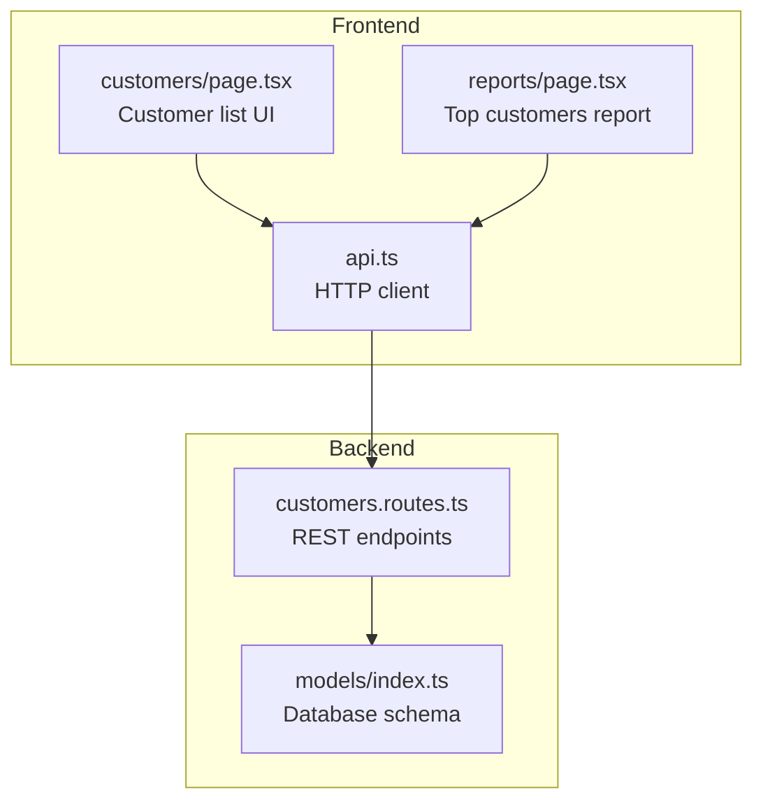
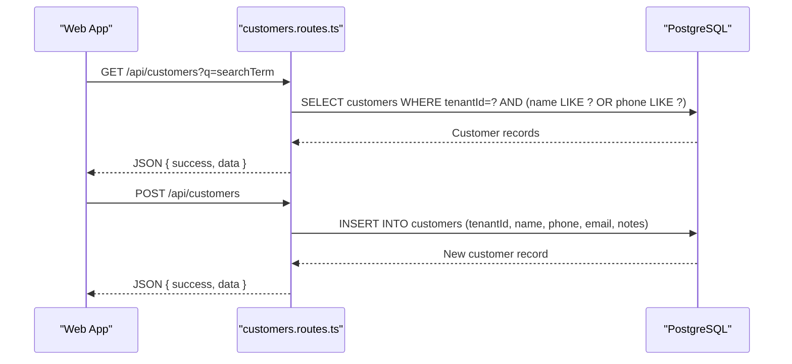
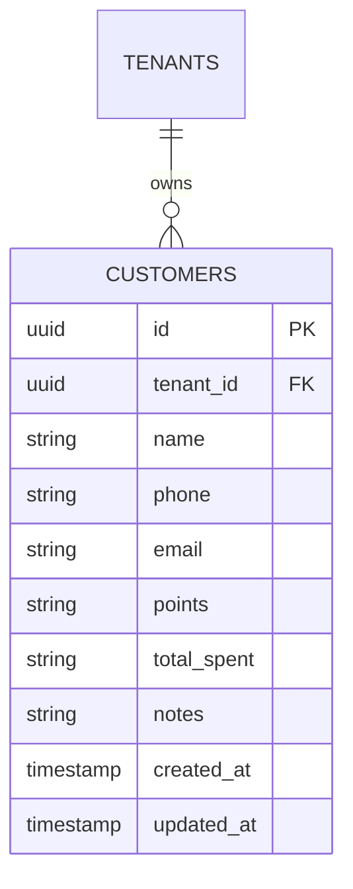
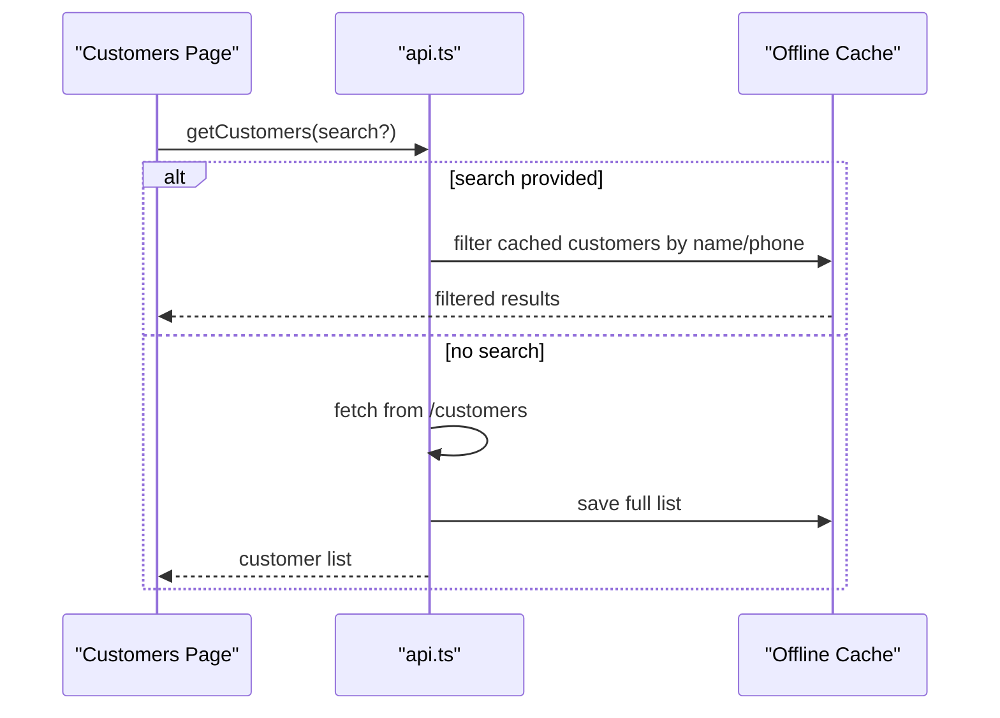
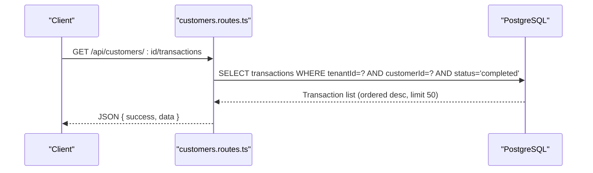
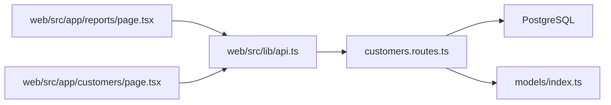

# Customer Management API

<cite>
**Referenced Files in This Document**
- [customers.routes.ts](file://apps/api/src/routes/customers.routes.ts)
- [customers.routes.js](file://apps/api/src/routes/customers.routes.js)
- [index.ts](file://apps/api/src/models/index.ts)
- [0000_snapshot.json](file://apps/api/drizzle/meta/0000_snapshot.json)
- [0003_snapshot.json](file://apps/api/migrations/meta/0003_snapshot.json)
- [api.ts](file://apps/web/src/lib/api.ts)
- [page.tsx](file://apps/web/src/app/customers/page.tsx)
- [page.tsx](file://apps/web/src/app/reports/page.tsx)
</cite>

## Table of Contents
1. [Introduction](#introduction)
2. [Project Structure](#project-structure)
3. [Core Components](#core-components)
4. [Architecture Overview](#architecture-overview)
5. [Detailed Component Analysis](#detailed-component-analysis)
6. [Dependency Analysis](#dependency-analysis)
7. [Performance Considerations](#performance-considerations)
8. [Troubleshooting Guide](#troubleshooting-guide)
9. [Conclusion](#conclusion)
10. [Appendices](#appendices)

## Introduction
This document provides comprehensive API documentation for the Customer Management module within the ARHAT POS system. It covers all customer endpoints, data models, search and filtering capabilities, purchase history retrieval, and integration patterns with the frontend. The module supports customer registration, profile updates, transaction history viewing, and basic customer segmentation via lifetime spending tiers visible in the frontend.

## Project Structure
The Customer Management module spans backend routes, database models, and frontend integration:

- Backend routes define REST endpoints for customer CRUD operations and transaction history retrieval.
- Database models define the customer schema, including fields for contact information, loyalty metrics, and metadata.
- Frontend components integrate with the API to display customer lists, search, and tier-based segmentation.

**Diagram sources**
- [customers.routes.ts:1-115](file://apps/api/src/routes/customers.routes.ts#L1-L115)
- [index.ts:104-117](file://apps/api/src/models/index.ts#L104-L117)
- [api.ts:418-449](file://apps/web/src/lib/api.ts#L418-L449)
- [page.tsx:174-235](file://apps/web/src/app/customers/page.tsx#L174-L235)
- [page.tsx:372-389](file://apps/web/src/app/reports/page.tsx#L372-L389)

**Section sources**
- [customers.routes.ts:1-115](file://apps/api/src/routes/customers.routes.ts#L1-L115)
- [index.ts:104-117](file://apps/api/src/models/index.ts#L104-L117)
- [api.ts:418-449](file://apps/web/src/lib/api.ts#L418-L449)
- [page.tsx:174-235](file://apps/web/src/app/customers/page.tsx#L174-L235)
- [page.tsx:372-389](file://apps/web/src/app/reports/page.tsx#L372-L389)

## Core Components
- Customer routes: Define endpoints for listing/searching customers, creating customers, updating profiles, retrieving purchase history, and deactivating customers.
- Customer model: Defines the database schema including contact info, loyalty fields, and audit timestamps.
- Frontend integration: Provides customer search, caching, and tier-based display.

Key capabilities:
- Directory search with query parameter support.
- Registration with contact and note fields.
- Profile updates with ownership verification.
- Purchase history retrieval filtered by completion status.
- Basic customer segmentation via total spent field.

**Section sources**
- [customers.routes.ts:28-115](file://apps/api/src/routes/customers.routes.ts#L28-L115)
- [index.ts:104-117](file://apps/api/src/models/index.ts#L104-L117)
- [api.ts:418-449](file://apps/web/src/lib/api.ts#L418-L449)

## Architecture Overview
The Customer Management API follows a layered architecture:
- HTTP layer: Routes handle incoming requests and responses.
- Data access layer: Drizzle ORM queries the PostgreSQL database.
- Frontend integration: Web app consumes endpoints for customer operations and reporting.

**Diagram sources**
- [customers.routes.ts:28-63](file://apps/api/src/routes/customers.routes.ts#L28-L63)
- [index.ts:104-117](file://apps/api/src/models/index.ts#L104-L117)

## Detailed Component Analysis

### Customer Endpoints

#### GET /api/customers
Purpose: Retrieve customer directory with optional search and filtering.

Behavior:
- Supports query parameter q for name or phone search.
- Returns paginated or full list depending on frontend usage.
- Uses tenant scoping via tenantId.

Response format:
- success: Boolean indicating operation outcome.
- data: Array of customer objects.

Search behavior (frontend):
- When no search term is provided, caches the full list.
- When a search term is provided, filters cached results by name or phone.

**Section sources**
- [customers.routes.ts:28-31](file://apps/api/src/routes/customers.routes.ts#L28-L31)
- [api.ts:418-438](file://apps/web/src/lib/api.ts#L418-L438)

#### POST /api/customers
Purpose: Register a new customer.

Request body fields:
- name: Required string.
- phone: Optional string.
- email: Optional string.
- notes: Optional string.

Behavior:
- Creates a new customer record under the authenticated tenant.
- Returns the created customer object.

**Section sources**
- [customers.routes.ts:50-64](file://apps/api/src/routes/customers.routes.ts#L50-L64)
- [api.ts:440-449](file://apps/web/src/lib/api.ts#L440-L449)

#### GET /api/customers/:id
Purpose: Retrieve a single customer profile.

Behavior:
- Verifies tenant ownership before returning data.
- Returns customer object if found; otherwise 404.

Notes:
- The current implementation does not expose a dedicated GET by ID endpoint in the route file. The frontend primarily uses the directory endpoint with search. If a GET by ID is required, it should be added to the routes.

**Section sources**
- [customers.routes.ts:28-31](file://apps/api/src/routes/customers.routes.ts#L28-L31)

#### PUT /api/customers/:id
Purpose: Update customer profile.

Request body fields:
- name: Optional string.
- phone: Optional string.
- email: Optional string.
- notes: Optional string.

Behavior:
- Verifies tenant ownership before updating.
- Updates modified timestamp.
- Returns the updated customer object.

**Section sources**
- [customers.routes.ts:66-87](file://apps/api/src/routes/customers.routes.ts#L66-L87)

#### DELETE /api/customers/:id
Purpose: Deactivate a customer.

Current status:
- No DELETE endpoint is implemented in the route file.
- If deactivation is required, add a DELETE handler that sets an inactive flag or removes the record per business policy.

**Section sources**
- [customers.routes.ts:66-87](file://apps/api/src/routes/customers.routes.ts#L66-L87)

#### GET /api/customers/:id/transactions
Purpose: Retrieve purchase history for a customer.

Behavior:
- Verifies tenant ownership.
- Returns up to 50 most recent completed transactions for the customer.
- Results ordered by creation date descending.

**Section sources**
- [customers.routes.ts:89-113](file://apps/api/src/routes/customers.routes.ts#L89-L113)

### Data Model: Customer Schema
The customer table includes the following fields:
- id: UUID primary key.
- tenantId: UUID foreign key to tenants.
- name: String, required.
- phone: String (up to 50 characters).
- email: String (up to 255 characters).
- points: String (loyalty points, default 0).
- totalSpent: String representing lifetime value (default 0).
- notes: String (up to 1000 characters).
- createdAt: Timestamp with default now().
- updatedAt: Timestamp with default now().

Index:
- Phone index for efficient lookups.

**Diagram sources**
- [index.ts:104-117](file://apps/api/src/models/index.ts#L104-L117)
- [0000_snapshot.json:99-153](file://apps/api/drizzle/meta/0000_snapshot.json#L99-L153)
- [0003_snapshot.json:99-153](file://apps/api/migrations/meta/0003_snapshot.json#L99-L153)

**Section sources**
- [index.ts:104-117](file://apps/api/src/models/index.ts#L104-L117)
- [0000_snapshot.json:99-153](file://apps/api/drizzle/meta/0000_snapshot.json#L99-L153)
- [0003_snapshot.json:99-153](file://apps/api/migrations/meta/0003_snapshot.json#L99-L153)

### Frontend Integration Patterns
- Customer search and caching: The frontend fetches customer lists and caches them, applying client-side filtering for search queries.
- Tier-based segmentation: The customer list displays membership tiers derived from totalSpent.
- Reporting: Top customers report aggregates revenue and transaction counts.

**Diagram sources**
- [api.ts:418-438](file://apps/web/src/lib/api.ts#L418-L438)
- [page.tsx:174-235](file://apps/web/src/app/customers/page.tsx#L174-L235)

**Section sources**
- [api.ts:418-449](file://apps/web/src/lib/api.ts#L418-L449)
- [page.tsx:174-235](file://apps/web/src/app/customers/page.tsx#L174-L235)
- [page.tsx:372-389](file://apps/web/src/app/reports/page.tsx#L372-L389)

### Purchase History Retrieval Flow

**Diagram sources**
- [customers.routes.ts:89-113](file://apps/api/src/routes/customers.routes.ts#L89-L113)

**Section sources**
- [customers.routes.ts:89-113](file://apps/api/src/routes/customers.routes.ts#L89-L113)

## Dependency Analysis
- Tenant scoping: All customer operations verify tenant ownership using tenantId.
- Database relationships: Customers belong to tenants via foreign key.
- Frontend dependencies: Web app depends on API endpoints for customer CRUD and reporting.

**Diagram sources**
- [customers.routes.ts:1-115](file://apps/api/src/routes/customers.routes.ts#L1-L115)
- [index.ts:104-117](file://apps/api/src/models/index.ts#L104-L117)
- [api.ts:418-449](file://apps/web/src/lib/api.ts#L418-L449)
- [page.tsx:372-389](file://apps/web/src/app/reports/page.tsx#L372-L389)
- [page.tsx:174-235](file://apps/web/src/app/customers/page.tsx#L174-L235)

**Section sources**
- [customers.routes.ts:1-115](file://apps/api/src/routes/customers.routes.ts#L1-L115)
- [index.ts:104-117](file://apps/api/src/models/index.ts#L104-L117)
- [api.ts:418-449](file://apps/web/src/lib/api.ts#L418-L449)
- [page.tsx:372-389](file://apps/web/src/app/reports/page.tsx#L372-L389)
- [page.tsx:174-235](file://apps/web/src/app/customers/page.tsx#L174-L235)

## Performance Considerations
- Indexing: Phone column is indexed to optimize search performance.
- Pagination: Transaction history limits results to 50 entries to control payload size.
- Caching: Frontend caches customer lists and applies client-side filtering to reduce network requests during search.

Recommendations:
- Consider adding name indexing for improved search performance.
- Implement server-side pagination for customer directory when lists grow large.
- Add rate limiting and input sanitization for search endpoints.

**Section sources**
- [index.ts:115-117](file://apps/api/src/models/index.ts#L115-L117)
- [customers.routes.ts:89-113](file://apps/api/src/routes/customers.routes.ts#L89-L113)
- [api.ts:418-438](file://apps/web/src/lib/api.ts#L418-L438)

## Troubleshooting Guide
Common issues and resolutions:
- 404 Not Found: Occurs when customer does not exist or tenant ownership verification fails. Ensure the tenantId is set and the customer belongs to the authenticated tenant.
- Search yields empty results: Verify search terms and confirm that the customer list is cached. Clear cache or refresh the page to reload data.
- Update failures: Confirm that the customer exists and belongs to the tenant before attempting updates.

**Section sources**
- [customers.routes.ts:28-31](file://apps/api/src/routes/customers.routes.ts#L28-L31)
- [customers.routes.ts:66-87](file://apps/api/src/routes/customers.routes.ts#L66-L87)
- [api.ts:418-438](file://apps/web/src/lib/api.ts#L418-L438)

## Conclusion
The Customer Management module provides essential customer lifecycle operations with tenant scoping, search capabilities, and purchase history retrieval. The frontend integrates seamlessly with the API to deliver a responsive customer directory and reporting features. Extending the module with a GET by ID endpoint, a DELETE deactivation endpoint, and server-side pagination would further enhance functionality and scalability.

## Appendices

### API Endpoint Reference

- GET /api/customers
  - Description: Retrieve customer directory with optional search.
  - Query parameters: q=searchTerm
  - Response: JSON { success: boolean, data: array }

- POST /api/customers
  - Description: Register a new customer.
  - Request body: { name, phone?, email?, notes? }
  - Response: JSON { success: boolean, data: object }

- PUT /api/customers/:id
  - Description: Update customer profile.
  - Path parameters: id
  - Request body: { name?, phone?, email?, notes? }
  - Response: JSON { success: boolean, data: object }

- GET /api/customers/:id/transactions
  - Description: Retrieve purchase history for a customer.
  - Path parameters: id
  - Response: JSON { success: boolean, data: array }

Note: GET by ID and DELETE endpoints are not currently implemented in the route file. If needed, add handlers to support these operations.

**Section sources**
- [customers.routes.ts:28-113](file://apps/api/src/routes/customers.routes.ts#L28-L113)
- [api.ts:418-449](file://apps/web/src/lib/api.ts#L418-L449)