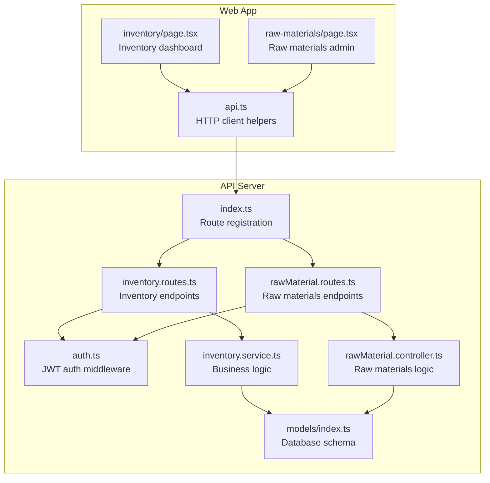
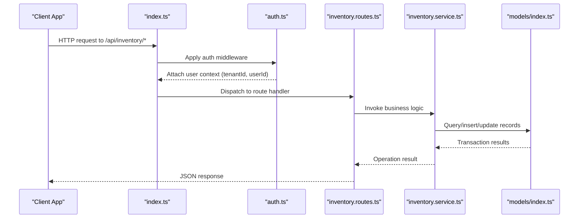
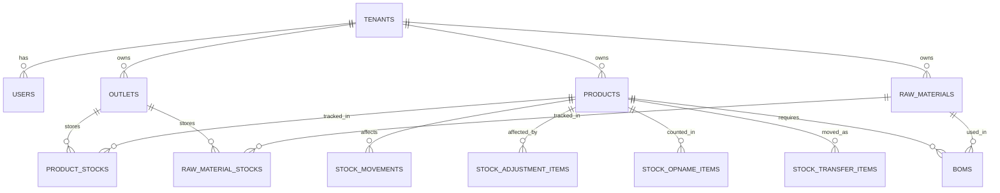
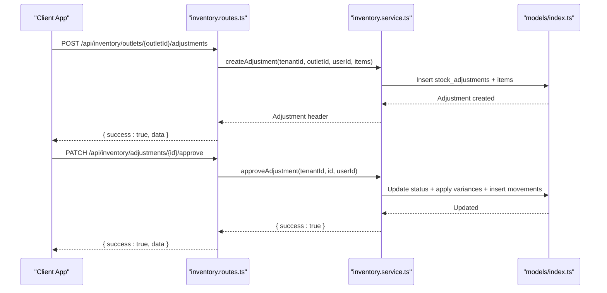
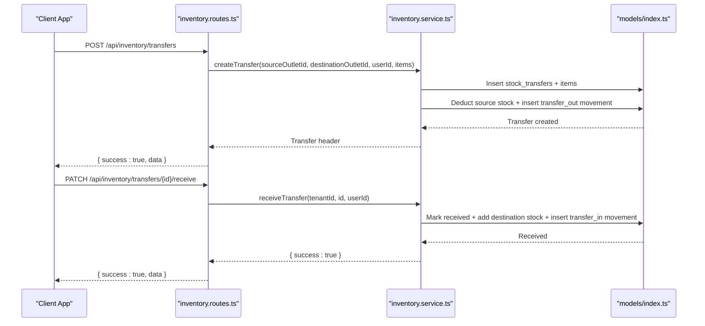
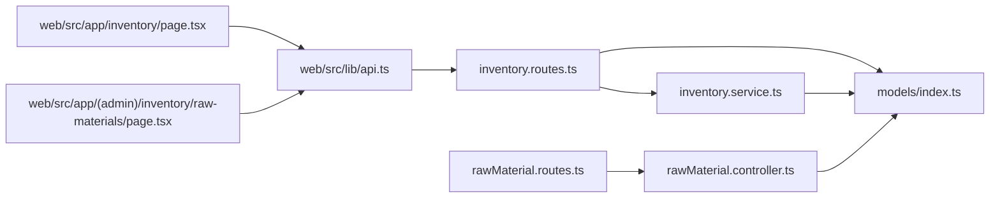

# Inventory Management API

<cite>
**Referenced Files in This Document**
- [index.ts](file://apps/api/src/index.ts)
- [auth.ts](file://apps/api/src/middleware/auth.ts)
- [inventory.routes.ts](file://apps/api/src/routes/inventory.routes.ts)
- [inventory.service.ts](file://apps/api/src/services/inventory.service.ts)
- [rawMaterial.routes.ts](file://apps/api/src/routes/rawMaterial.routes.ts)
- [rawMaterial.controller.ts](file://apps/api/src/controllers/rawMaterial.controller.ts)
- [models/index.ts](file://apps/api/src/models/index.ts)
- [api.ts](file://apps/web/src/lib/api.ts)
- [inventory/page.tsx](file://apps/web/src/app/inventory/page.tsx)
- [raw-materials/page.tsx](file://apps/web/src/app/(admin)/inventory/raw-materials/page.tsx)
</cite>

## Table of Contents
1. [Introduction](#introduction)
2. [Project Structure](#project-structure)
3. [Core Components](#core-components)
4. [Architecture Overview](#architecture-overview)
5. [Detailed Component Analysis](#detailed-component-analysis)
6. [Dependency Analysis](#dependency-analysis)
7. [Performance Considerations](#performance-considerations)
8. [Troubleshooting Guide](#troubleshooting-guide)
9. [Conclusion](#conclusion)
10. [Appendices](#appendices)

## Introduction
This document provides comprehensive API documentation for the Inventory Management module of the ARHAT POS system. It covers endpoints for stock level monitoring, stock corrections, low-stock alerts, internal transfers, and audit trails. It also documents raw material tracking, Bill of Materials (BOM), supplier integration points, batch management, expiration date handling, automated reorder point calculations, inventory valuation methods, cost of goods sold tracking, and multi-location inventory support. The documentation includes practical workflows, integration guidance with procurement systems, and troubleshooting tips.

## Project Structure
The Inventory Management module is implemented as part of the Hono-based API server with TypeScript. The backend exposes REST endpoints under `/api/inventory` and `/api/raw-materials`. Frontend dashboards in the Next.js web app consume these APIs to present inventory operations and reporting.

**Diagram sources**
- [index.ts:80-92](file://apps/api/src/index.ts#L80-L92)
- [auth.ts:5-33](file://apps/api/src/middleware/auth.ts#L5-L33)
- [inventory.routes.ts:1-110](file://apps/api/src/routes/inventory.routes.ts#L1-L110)
- [inventory.service.ts:11-366](file://apps/api/src/services/inventory.service.ts#L11-L366)
- [rawMaterial.routes.ts:1-18](file://apps/api/src/routes/rawMaterial.routes.ts#L1-L18)
- [rawMaterial.controller.ts:1-155](file://apps/api/src/controllers/rawMaterial.controller.ts#L1-L155)
- [models/index.ts:1-307](file://apps/api/src/models/index.ts#L1-L307)
- [api.ts:326-349](file://apps/web/src/lib/api.ts#L326-L349)
- [inventory/page.tsx:13-194](file://apps/web/src/app/inventory/page.tsx#L13-L194)
- [raw-materials/page.tsx:15-264](file://apps/web/src/app/(admin)/inventory/raw-materials/page.tsx#L15-L264)

**Section sources**
- [index.ts:80-92](file://apps/api/src/index.ts#L80-L92)
- [inventory.routes.ts:1-110](file://apps/api/src/routes/inventory.routes.ts#L1-L110)
- [rawMaterial.routes.ts:1-18](file://apps/api/src/routes/rawMaterial.routes.ts#L1-L18)

## Core Components
- Authentication middleware enforces JWT-based authorization for all inventory routes.
- Inventory routes define endpoints for stock movements, adjustments, opname (audit), transfers, and outlet management.
- Inventory service encapsulates business logic for stock updates, approval workflows, and audit trail generation.
- Raw materials routes and controller manage raw material master data, BOM, and stock tracking per outlet.
- Database models define normalized tables for products, outlets, stock movements, adjustments, opname, transfers, and raw materials.

Key capabilities:
- Multi-outlet inventory with per-outlet stock quantities and minimum levels.
- Audit trail via stock movements with reference types and reasons.
- Approval workflow for stock adjustments.
- Internal transfers with immediate source deduction and later destination receipt.
- Raw material tracking with units, cost per unit, and BOM linkage to products.

**Section sources**
- [auth.ts:5-33](file://apps/api/src/middleware/auth.ts#L5-L33)
- [inventory.routes.ts:9-107](file://apps/api/src/routes/inventory.routes.ts#L9-L107)
- [inventory.service.ts:14-362](file://apps/api/src/services/inventory.service.ts#L14-L362)
- [rawMaterial.controller.ts:11-154](file://apps/api/src/controllers/rawMaterial.controller.ts#L11-L154)
- [models/index.ts:94-244](file://apps/api/src/models/index.ts#L94-L244)

## Architecture Overview
The API follows a layered architecture:
- Route handlers validate inputs and delegate to services.
- Services operate within database transactions to maintain consistency.
- Controllers for raw materials manage master data and BOM updates.
- Models define the schema and relationships.

**Diagram sources**
- [index.ts:80-92](file://apps/api/src/index.ts#L80-L92)
- [auth.ts:5-33](file://apps/api/src/middleware/auth.ts#L5-L33)
- [inventory.routes.ts:1-110](file://apps/api/src/routes/inventory.routes.ts#L1-L110)
- [inventory.service.ts:11-366](file://apps/api/src/services/inventory.service.ts#L11-L366)
- [models/index.ts:169-244](file://apps/api/src/models/index.ts#L169-L244)

## Detailed Component Analysis

### Authentication and Authorization
- All inventory endpoints require a Bearer token containing user claims (userId, tenantId, role).
- The middleware validates tokens and attaches user context to the request.

**Section sources**
- [auth.ts:5-33](file://apps/api/src/middleware/auth.ts#L5-L33)

### Inventory Endpoints

#### GET /api/inventory/movements
- Purpose: Retrieve recent stock movements across the tenant.
- Response: List of movements with product name, type, quantity, reason, and timestamp.
- Access: Requires authentication.

**Section sources**
- [inventory.routes.ts:9-13](file://apps/api/src/routes/inventory.routes.ts#L9-L13)
- [inventory.service.ts:14-28](file://apps/api/src/services/inventory.service.ts#L14-L28)

#### POST /api/inventory/movements
- Purpose: Record manual stock IN/OUT movements.
- Request body:
  - outletId: string
  - productId: string
  - type: "in" | "out"
  - quantity: number
  - reason: optional string
- Validation: Requires all fields; insufficient stock blocks OUT.
- Effects: Updates per-outlet stock, legacy total stock, and creates a movement record.

**Section sources**
- [inventory.routes.ts:39-50](file://apps/api/src/routes/inventory.routes.ts#L39-L50)
- [inventory.service.ts:66-122](file://apps/api/src/services/inventory.service.ts#L66-L122)

#### GET /api/inventory/outlets
- Purpose: List all outlets for the tenant.
- Response: Array of outlets with metadata.

**Section sources**
- [inventory.routes.ts:16-20](file://apps/api/src/routes/inventory.routes.ts#L16-L20)
- [inventory.service.ts:30-32](file://apps/api/src/services/inventory.service.ts#L30-L32)

#### POST /api/inventory/outlets
- Purpose: Create a new outlet.
- Request body: name (required), address (optional).
- Response: Created outlet object.

**Section sources**
- [inventory.routes.ts:22-28](file://apps/api/src/routes/inventory.routes.ts#L22-L28)
- [inventory.service.ts:34-41](file://apps/api/src/services/inventory.service.ts#L34-L41)

#### GET /api/inventory/outlets/{outletId}/products
- Purpose: Fetch products with current stock and minimum levels for a specific outlet.
- Response: Products with stockQuantity and minStockLevel.

**Section sources**
- [inventory.routes.ts:31-36](file://apps/api/src/routes/inventory.routes.ts#L31-L36)
- [inventory.service.ts:43-63](file://apps/api/src/services/inventory.service.ts#L43-L63)

#### GET /api/inventory/outlets/{outletId}/adjustments
- Purpose: List pending and approved stock adjustments for an outlet.
- Response: Adjustments with status and timestamps.

**Section sources**
- [inventory.routes.ts:53-58](file://apps/api/src/routes/inventory.routes.ts#L53-L58)
- [inventory.service.ts:125-130](file://apps/api/src/services/inventory.service.ts#L125-L130)

#### POST /api/inventory/outlets/{outletId}/adjustments
- Purpose: Create a stock adjustment request with items.
- Request body: items[] with productId, adjustedStock, reason.
- Response: Adjustment header with status "pending".

**Section sources**
- [inventory.routes.ts:60-66](file://apps/api/src/routes/inventory.routes.ts#L60-L66)
- [inventory.service.ts:132-162](file://apps/api/src/services/inventory.service.ts#L132-L162)

#### PATCH /api/inventory/adjustments/{id}/approve
- Purpose: Approve a pending adjustment; applies variances to stock and records movements.
- Response: Success confirmation.

**Section sources**
- [inventory.routes.ts:68-73](file://apps/api/src/routes/inventory.routes.ts#L68-L73)
- [inventory.service.ts:164-203](file://apps/api/src/services/inventory.service.ts#L164-L203)

#### POST /api/inventory/outlets/{outletId}/opname
- Purpose: Start a stock opname session for physical count.
- Response: Opname session with status "in_progress".

**Section sources**
- [inventory.routes.ts:76-81](file://apps/api/src/routes/inventory.routes.ts#L76-L81)
- [inventory.service.ts:206-216](file://apps/api/src/services/inventory.service.ts#L206-L216)

#### POST /api/inventory/opname/{id}/complete
- Purpose: Complete opname by submitting actual quantities; adjusts stock and records variances.
- Request body: items[] with productId, actualQuantity.
- Response: Success confirmation.

**Section sources**
- [inventory.routes.ts:83-89](file://apps/api/src/routes/inventory.routes.ts#L83-L89)
- [inventory.service.ts:218-271](file://apps/api/src/services/inventory.service.ts#L218-L271)

#### POST /api/inventory/transfers
- Purpose: Create an inter-outlet transfer request.
- Request body: sourceOutletId, destinationOutletId, items[] with productId and quantity.
- Effects: Deducts from source immediately, marks transfer as pending, records movements.

**Section sources**
- [inventory.routes.ts:92-100](file://apps/api/src/routes/inventory.routes.ts#L92-L100)
- [inventory.service.ts:274-319](file://apps/api/src/services/inventory.service.ts#L274-L319)

#### PATCH /api/inventory/transfers/{id}/receive
- Purpose: Receive a transfer at the destination outlet.
- Effects: Adds stock to destination, marks transfer as received, records movements.

**Section sources**
- [inventory.routes.ts:102-107](file://apps/api/src/routes/inventory.routes.ts#L102-L107)
- [inventory.service.ts:321-362](file://apps/api/src/services/inventory.service.ts#L321-L362)

### Raw Materials and BOM Endpoints

#### GET /api/raw-materials
- Purpose: List raw materials with aggregated stock and per-outlet stock details.
- Response: Materials enriched with total stock and outlet-specific stock records.

**Section sources**
- [rawMaterial.routes.ts:9-10](file://apps/api/src/routes/rawMaterial.routes.ts#L9-L10)
- [rawMaterial.controller.ts:11-25](file://apps/api/src/controllers/rawMaterial.controller.ts#L11-L25)

#### POST /api/raw-materials
- Purpose: Create a new raw material.
- Optional request fields: sku, unit, costPerUnit, initialStock, outletId.
- Effects: Inserts raw material; optionally inserts initial stock at outlet.

**Section sources**
- [rawMaterial.routes.ts:10-11](file://apps/api/src/routes/rawMaterial.routes.ts#L10-L11)
- [rawMaterial.controller.ts:27-66](file://apps/api/src/controllers/rawMaterial.controller.ts#L27-L66)

#### PUT /api/raw-materials/{id}
- Purpose: Update raw material master data (name, sku, unit, costPerUnit).

**Section sources**
- [rawMaterial.routes.ts:12-12](file://apps/api/src/routes/rawMaterial.routes.ts#L12-L12)
- [rawMaterial.controller.ts:68-91](file://apps/api/src/controllers/rawMaterial.controller.ts#L68-L91)

#### DELETE /api/raw-materials/{id}
- Purpose: Delete a raw material after removing dependencies (BOM, stock).
- Response: Success confirmation.

**Section sources**
- [rawMaterial.routes.ts:13-13](file://apps/api/src/routes/rawMaterial.routes.ts#L13-L13)
- [rawMaterial.controller.ts:93-108](file://apps/api/src/controllers/rawMaterial.controller.ts#L93-L108)

#### GET /api/raw-materials/boms/{productId}
- Purpose: Retrieve BOM for a product (raw materials and quantities).
- Response: Array of BOM items with raw material details.

**Section sources**
- [rawMaterial.routes.ts:14-14](file://apps/api/src/routes/rawMaterial.routes.ts#L14-L14)
- [rawMaterial.controller.ts:114-131](file://apps/api/src/controllers/rawMaterial.controller.ts#L114-L131)

#### POST /api/raw-materials/boms/{productId}
- Purpose: Replace the entire BOM for a product with provided items.
- Request body: Array of { rawMaterialId, quantity }.

**Section sources**
- [rawMaterial.routes.ts:15-15](file://apps/api/src/routes/rawMaterial.routes.ts#L15-L15)
- [rawMaterial.controller.ts:133-154](file://apps/api/src/controllers/rawMaterial.controller.ts#L133-L154)

### Data Models and Relationships

**Diagram sources**
- [models/index.ts:9-307](file://apps/api/src/models/index.ts#L9-L307)

**Section sources**
- [models/index.ts:94-244](file://apps/api/src/models/index.ts#L94-L244)

### API Workflows and Examples

#### Stock Adjustment Procedure

**Diagram sources**
- [inventory.routes.ts:60-73](file://apps/api/src/routes/inventory.routes.ts#L60-L73)
- [inventory.service.ts:132-203](file://apps/api/src/services/inventory.service.ts#L132-L203)

#### Internal Transfer Workflow

**Diagram sources**
- [inventory.routes.ts:92-107](file://apps/api/src/routes/inventory.routes.ts#L92-L107)
- [inventory.service.ts:274-362](file://apps/api/src/services/inventory.service.ts#L274-L362)

#### Low-Stock Alerts and Monitoring
- The frontend monitors current stock and highlights items at or below minStockLevel.
- Recent movements are fetched to show stock activity.

**Section sources**
- [inventory/page.tsx:198-283](file://apps/web/src/app/inventory/page.tsx#L198-L283)
- [api.ts:326-349](file://apps/web/src/lib/api.ts#L326-L349)

### Integration with Procurement Systems
- Manual stock IN via `/api/inventory/movements` supports adding reasons/references for supplier POs or purchases.
- Raw materials endpoint accepts initialStock and outletId for onboarding suppliers' materials.
- BOM endpoints enable linking raw materials to products, supporting procurement planning.

**Section sources**
- [inventory.routes.ts:39-50](file://apps/api/src/routes/inventory.routes.ts#L39-L50)
- [rawMaterial.controller.ts:27-66](file://apps/api/src/controllers/rawMaterial.controller.ts#L27-L66)
- [rawMaterial.controller.ts:133-154](file://apps/api/src/controllers/rawMaterial.controller.ts#L133-L154)

## Dependency Analysis
- Route handlers depend on the inventory service for business logic.
- Services depend on database models and Drizzle ORM for queries.
- Controllers for raw materials depend on models for CRUD and BOM management.
- Frontend uses a shared API client to call inventory endpoints.

**Diagram sources**
- [inventory.routes.ts:1-110](file://apps/api/src/routes/inventory.routes.ts#L1-L110)
- [inventory.service.ts:1-366](file://apps/api/src/services/inventory.service.ts#L1-L366)
- [rawMaterial.routes.ts:1-18](file://apps/api/src/routes/rawMaterial.routes.ts#L1-L18)
- [rawMaterial.controller.ts:1-155](file://apps/api/src/controllers/rawMaterial.controller.ts#L1-L155)
- [models/index.ts:1-307](file://apps/api/src/models/index.ts#L1-L307)
- [api.ts:326-349](file://apps/web/src/lib/api.ts#L326-L349)
- [inventory/page.tsx:13-194](file://apps/web/src/app/inventory/page.tsx#L13-L194)
- [raw-materials/page.tsx:15-264](file://apps/web/src/app/(admin)/inventory/raw-materials/page.tsx#L15-L264)

**Section sources**
- [index.ts:80-92](file://apps/api/src/index.ts#L80-L92)
- [inventory.routes.ts:1-110](file://apps/api/src/routes/inventory.routes.ts#L1-L110)
- [rawMaterial.routes.ts:1-18](file://apps/api/src/routes/rawMaterial.routes.ts#L1-L18)

## Performance Considerations
- Use pagination or limits for movement lists to avoid large payloads.
- Batch operations for adjustments and transfers reduce round trips.
- Indexes on frequently queried fields (tenantId, outletId, productId) improve query performance.
- Minimize concurrent writes to the same product/outlet combination to reduce contention.

## Troubleshooting Guide
Common issues and resolutions:
- Unauthorized: Ensure Authorization header includes a valid Bearer token.
- Missing required fields: Verify request bodies include all mandatory fields for each endpoint.
- Insufficient stock: OUT movements fail if available stock is less than requested quantity.
- Invalid adjustment/opname/transfer: Operations require valid IDs and appropriate statuses.

**Section sources**
- [auth.ts:8-10](file://apps/api/src/middleware/auth.ts#L8-L10)
- [inventory.routes.ts:42-44](file://apps/api/src/routes/inventory.routes.ts#L42-L44)
- [inventory.service.ts:93-93](file://apps/api/src/services/inventory.service.ts#L93-L93)
- [inventory.service.ts:167-167](file://apps/api/src/services/inventory.service.ts#L167-L167)
- [inventory.service.ts:221-221](file://apps/api/src/services/inventory.service.ts#L221-L221)
- [inventory.service.ts:293-293](file://apps/api/src/services/inventory.service.ts#L293-L293)

## Conclusion
The Inventory Management API provides robust support for multi-outlet stock operations, approvals, audits, and internal transfers. It integrates raw materials and BOMs for recipe-driven consumption and offers clear audit trails. The modular design with services and controllers enables extensibility for advanced features like batch/expiration tracking, automated reorder points, and supplier integrations.

## Appendices

### API Definitions and Examples

- GET /api/inventory/movements
  - Description: Retrieve recent stock movements for the tenant.
  - Response: Array of movement objects with product name, type, quantity, reason, and timestamp.

- POST /api/inventory/movements
  - Description: Record a stock IN or OUT movement.
  - Body: { outletId, productId, type: "in"|"out", quantity, reason }
  - Example: POST /api/inventory/movements with type "in" and reason "Supplier PO #123".

- GET /api/inventory/outlets
  - Description: List all outlets for the tenant.

- POST /api/inventory/outlets
  - Description: Create a new outlet.
  - Body: { name, address }

- GET /api/inventory/outlets/{outletId}/products
  - Description: Products with current stock and minimum levels for the outlet.

- GET /api/inventory/outlets/{outletId}/adjustments
  - Description: Pending and approved adjustments for the outlet.

- POST /api/inventory/outlets/{outletId}/adjustments
  - Description: Create a stock adjustment request.
  - Body: { items: [{ productId, adjustedStock, reason }] }

- PATCH /api/inventory/adjustments/{id}/approve
  - Description: Approve an adjustment and apply variances.

- POST /api/inventory/outlets/{outletId}/opname
  - Description: Start a stock opname session.

- POST /api/inventory/opname/{id}/complete
  - Description: Complete opname with actual counts.
  - Body: { items: [{ productId, actualQuantity }] }

- POST /api/inventory/transfers
  - Description: Create an inter-outlet transfer.
  - Body: { sourceOutletId, destinationOutletId, items: [{ productId, quantity }] }

- PATCH /api/inventory/transfers/{id}/receive
  - Description: Receive a transfer at the destination.

- GET /api/raw-materials
  - Description: List raw materials with aggregated stock.

- POST /api/raw-materials
  - Description: Create a raw material.
  - Body: { name, sku, unit, costPerUnit, initialStock, outletId }

- PUT /api/raw-materials/{id}
  - Description: Update raw material master data.

- DELETE /api/raw-materials/{id}
  - Description: Delete a raw material after removing dependencies.

- GET /api/raw-materials/boms/{productId}
  - Description: Retrieve BOM for a product.

- POST /api/raw-materials/boms/{productId}
  - Description: Replace BOM for a product.
  - Body: Array of { rawMaterialId, quantity }

**Section sources**
- [inventory.routes.ts:9-107](file://apps/api/src/routes/inventory.routes.ts#L9-L107)
- [rawMaterial.routes.ts:9-15](file://apps/api/src/routes/rawMaterial.routes.ts#L9-L15)
- [rawMaterial.controller.ts:11-154](file://apps/api/src/controllers/rawMaterial.controller.ts#L11-L154)

### Data Model Notes
- Stock quantities are stored as strings to accommodate large numbers and avoid precision loss.
- Movement types include "in", "out", "adjustment", "transfer_out", "transfer_in".
- Adjustments and opname create movements with reference types ("adjustment", "opname") and reference IDs for traceability.

**Section sources**
- [models/index.ts:169-244](file://apps/api/src/models/index.ts#L169-L244)