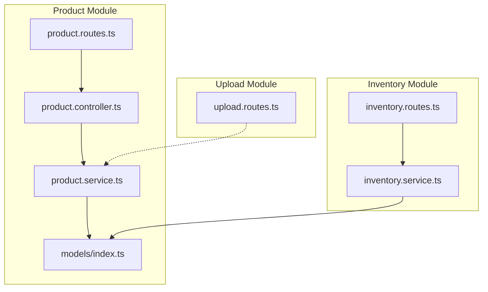
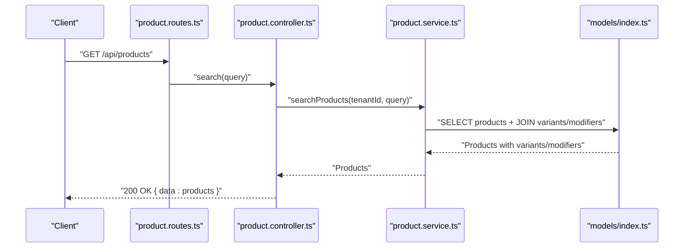
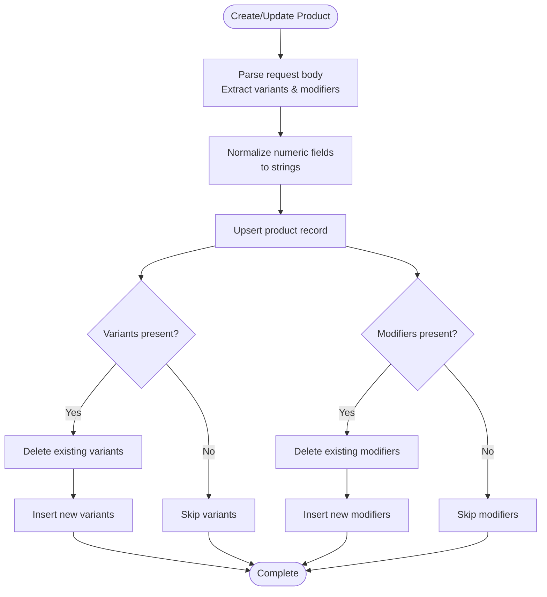
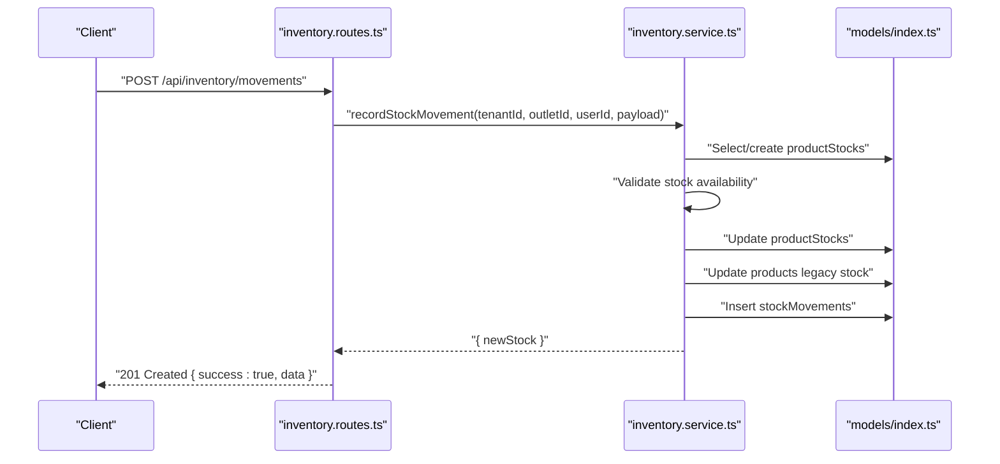
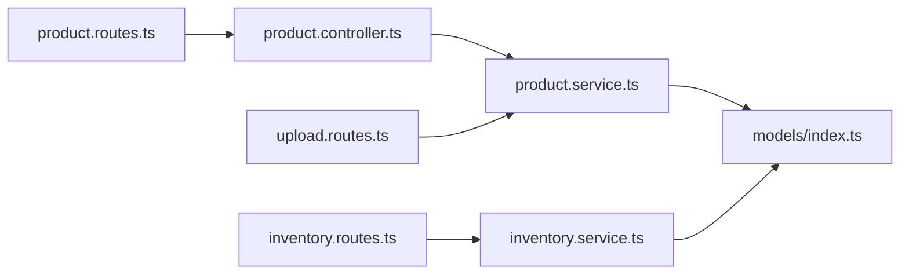
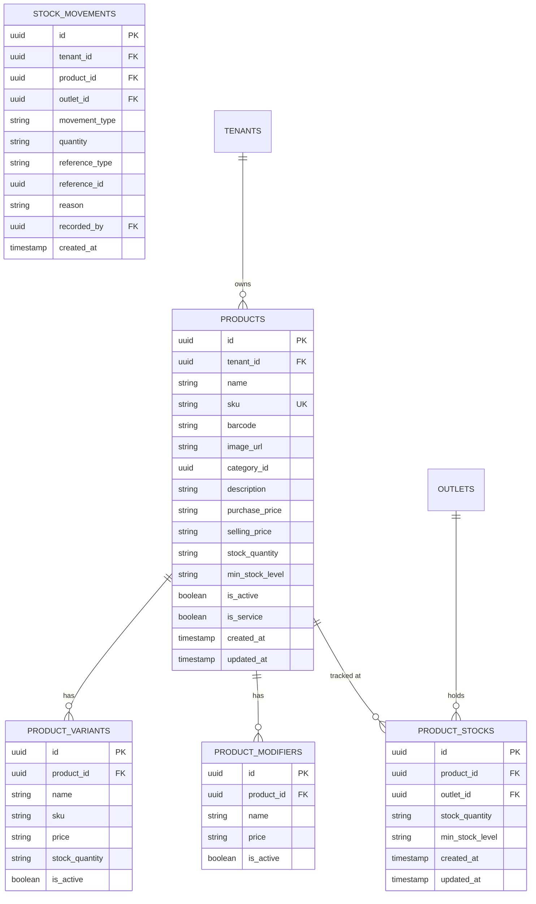

# Product Management API

<cite>
**Referenced Files in This Document**
- [product.routes.ts](file://apps/api/src/routes/product.routes.ts)
- [product.controller.ts](file://apps/api/src/controllers/product.controller.ts)
- [product.service.ts](file://apps/api/src/services/product.service.ts)
- [index.ts](file://apps/api/src/models/index.ts)
- [upload.routes.ts](file://apps/api/src/routes/upload.routes.ts)
- [inventory.routes.ts](file://apps/api/src/routes/inventory.routes.ts)
- [inventory.service.ts](file://apps/api/src/services/inventory.service.ts)
</cite>

## Table of Contents
1. [Introduction](#introduction)
2. [Project Structure](#project-structure)
3. [Core Components](#core-components)
4. [Architecture Overview](#architecture-overview)
5. [Detailed Component Analysis](#detailed-component-analysis)
6. [Dependency Analysis](#dependency-analysis)
7. [Performance Considerations](#performance-considerations)
8. [Troubleshooting Guide](#troubleshooting-guide)
9. [Conclusion](#conclusion)
10. [Appendices](#appendices)

## Introduction
This document provides comprehensive API documentation for the Product Management module. It covers product CRUD operations, variant and modifier management, pricing and stock handling, image upload integration, and inventory synchronization. The module follows a layered architecture with routes, controllers, services, and database models.

## Project Structure
The Product Management module is organized into routes, controllers, services, and models. Routes define endpoint contracts, controllers handle HTTP requests and responses, services encapsulate business logic, and models define the database schema.

**Diagram sources**
- [product.routes.ts:1-19](file://apps/api/src/routes/product.routes.ts#L1-L19)
- [product.controller.ts:1-73](file://apps/api/src/controllers/product.controller.ts#L1-L73)
- [product.service.ts:1-139](file://apps/api/src/services/product.service.ts#L1-L139)
- [index.ts:57-92](file://apps/api/src/models/index.ts#L57-L92)
- [upload.routes.ts:1-43](file://apps/api/src/routes/upload.routes.ts#L1-L43)
- [inventory.routes.ts:1-110](file://apps/api/src/routes/inventory.routes.ts#L1-L110)
- [inventory.service.ts:1-366](file://apps/api/src/services/inventory.service.ts#L1-L366)

**Section sources**
- [product.routes.ts:1-19](file://apps/api/src/routes/product.routes.ts#L1-L19)
- [product.controller.ts:1-73](file://apps/api/src/controllers/product.controller.ts#L1-L73)
- [product.service.ts:1-139](file://apps/api/src/services/product.service.ts#L1-L139)
- [index.ts:57-92](file://apps/api/src/models/index.ts#L57-L92)
- [upload.routes.ts:1-43](file://apps/api/src/routes/upload.routes.ts#L1-L43)
- [inventory.routes.ts:1-110](file://apps/api/src/routes/inventory.routes.ts#L1-L110)
- [inventory.service.ts:1-366](file://apps/api/src/services/inventory.service.ts#L1-L366)

## Core Components
- Routes: Define product endpoints and apply authentication middleware.
- Controller: Implements request handling, validation, and response formatting.
- Service: Encapsulates product business logic including variants and modifiers.
- Models: Define database tables for products, variants, modifiers, and related entities.

Key capabilities:
- Product listing with search by name, SKU, or barcode.
- Product CRUD operations with tenant scoping.
- Variant and modifier management during create/update.
- Pricing normalization to string values for decimal precision.
- Image upload endpoint for product media.
- Inventory integration via stock movements and outlet-specific stock.

**Section sources**
- [product.routes.ts:1-19](file://apps/api/src/routes/product.routes.ts#L1-L19)
- [product.controller.ts:1-73](file://apps/api/src/controllers/product.controller.ts#L1-L73)
- [product.service.ts:1-139](file://apps/api/src/services/product.service.ts#L1-L139)
- [index.ts:57-92](file://apps/api/src/models/index.ts#L57-L92)
- [upload.routes.ts:1-43](file://apps/api/src/routes/upload.routes.ts#L1-L43)
- [inventory.routes.ts:1-110](file://apps/api/src/routes/inventory.routes.ts#L1-L110)

## Architecture Overview
The Product Management API follows a clean architecture pattern:
- HTTP layer (routes) handles routing and middleware.
- Application layer (controller) manages request/response and error handling.
- Domain layer (service) enforces business rules and data transformations.
- Data layer (models) maps to PostgreSQL tables via Drizzle ORM.

**Diagram sources**
- [product.routes.ts:10-12](file://apps/api/src/routes/product.routes.ts#L10-L12)
- [product.controller.ts:5-11](file://apps/api/src/controllers/product.controller.ts#L5-L11)
- [product.service.ts:36-60](file://apps/api/src/services/product.service.ts#L36-L60)
- [index.ts:57-92](file://apps/api/src/models/index.ts#L57-L92)

## Detailed Component Analysis

### Product Endpoints
- GET /api/products
  - Purpose: List products with optional search query.
  - Query parameters: q (search term).
  - Response: Array of products with embedded variants and modifiers.
  - Authentication: Required.
  - Notes: Returns only active products scoped by tenant.

- GET /api/products/:id
  - Purpose: Retrieve a single product by ID.
  - Path parameters: id (product UUID).
  - Response: Product with variants and modifiers.
  - Authentication: Required.

- POST /api/products
  - Purpose: Create a new product.
  - Request body: Product fields including optional variants and modifiers.
  - Response: Created product.
  - Authentication: Required.
  - Validation: SKU uniqueness enforced; conflict returns 400 with localized message.

- PUT /api/products/:id
  - Purpose: Update an existing product.
  - Path parameters: id (product UUID).
  - Request body: Partial product fields; variants and modifiers can be replaced.
  - Response: Updated product.
  - Authentication: Required.
  - Validation: SKU uniqueness enforced; conflict returns 400 with localized message.

- DELETE /api/products/:id
  - Purpose: Delete a product.
  - Path parameters: id (product UUID).
  - Response: Deleted product.
  - Authentication: Required.

- GET /api/products/:id/variants
  - Purpose: Retrieve product variants (conceptual endpoint).
  - Current implementation: Variants are included in GET /api/products/:id response via service join.
  - Recommendation: Expose dedicated variants endpoint for clarity.

Request validation highlights:
- SKU empty string normalized to NULL in database.
- Price, cost, and stock values converted to strings for decimal precision.
- Tenant scoping ensures data isolation.

Response examples (paths):
- Product listing: [product.controller.ts:5-11](file://apps/api/src/controllers/product.controller.ts#L5-L11)
- Single product: [product.controller.ts:13-23](file://apps/api/src/controllers/product.controller.ts#L13-L23)
- Create product: [product.controller.ts:25-41](file://apps/api/src/controllers/product.controller.ts#L25-L41)
- Update product: [product.controller.ts:43-58](file://apps/api/src/controllers/product.controller.ts#L43-L58)
- Delete product: [product.controller.ts:60-71](file://apps/api/src/controllers/product.controller.ts#L60-L71)

**Section sources**
- [product.routes.ts:10-16](file://apps/api/src/routes/product.routes.ts#L10-L16)
- [product.controller.ts:5-71](file://apps/api/src/controllers/product.controller.ts#L5-L71)
- [product.service.ts:9-31](file://apps/api/src/services/product.service.ts#L9-L31)
- [index.ts:57-74](file://apps/api/src/models/index.ts#L57-L74)

### Product Variant and Modifier Management
Variants and modifiers are managed alongside products:
- Creation: On product create, variants and modifiers are inserted with productId linkage.
- Retrieval: Product queries join variants and modifiers for enriched responses.
- Updates: Replacing variants/modifiers deletes existing entries and inserts new ones.

**Diagram sources**
- [product.service.ts:9-31](file://apps/api/src/services/product.service.ts#L9-L31)
- [product.service.ts:88-124](file://apps/api/src/services/product.service.ts#L88-L124)

**Section sources**
- [product.service.ts:24-30](file://apps/api/src/services/product.service.ts#L24-L30)
- [product.service.ts:51-60](file://apps/api/src/services/product.service.ts#L51-L60)
- [product.service.ts:75-82](file://apps/api/src/services/product.service.ts#L75-L82)
- [product.service.ts:109-121](file://apps/api/src/services/product.service.ts#L109-L121)

### Pricing Calculations and Data Types
- Decimal fields are stored as strings to avoid floating-point precision issues.
- Conversion rules:
  - sellingPrice: price value converted to string; defaults to "0".
  - purchasePrice: cost value converted to string; defaults to "0".
  - stockQuantity: stock value converted to string; defaults to "0".
- SKU normalization: Empty string becomes NULL in database.

Implications:
- Frontend should send numeric values; backend converts to strings.
- Legacy compatibility maintained via product.stockQuantity for total/simple stock mode.

**Section sources**
- [product.service.ts:13-19](file://apps/api/src/services/product.service.ts#L13-L19)
- [product.service.ts:91-95](file://apps/api/src/services/product.service.ts#L91-L95)
- [index.ts:66-73](file://apps/api/src/models/index.ts#L66-L73)

### Barcode Integration
- Products support barcode field for identification.
- Search endpoint includes barcode match alongside name and SKU.

Usage:
- Use GET /api/products with query parameter q to search by barcode.

**Section sources**
- [index.ts:62-62](file://apps/api/src/models/index.ts#L62-L62)
- [product.service.ts:42-44](file://apps/api/src/services/product.service.ts#L42-L44)

### Image Upload Endpoints
- POST /api/upload
  - Purpose: Upload product images.
  - Request: Form-data with file field.
  - Response: Public URL for uploaded image.
  - Implementation: Saves file to public/uploads with unique filename.

Integration:
- Store returned URL in product.image_url.

**Section sources**
- [upload.routes.ts:9-40](file://apps/api/src/routes/upload.routes.ts#L9-L40)
- [index.ts:63-63](file://apps/api/src/models/index.ts#L63-L63)

### Stock Level Synchronization
- Outlet-specific stock tracking via productStocks table.
- Movement recording via stockMovements table with types: in, out, adjustment, transfer_in, transfer_out.
- Inventory operations include:
  - Manual stock movements (in/out).
  - Stock adjustments (approve workflow).
  - Stock opname (session completion with variance).
  - Stock transfers (create and receive).

**Diagram sources**
- [inventory.routes.ts:39-50](file://apps/api/src/routes/inventory.routes.ts#L39-L50)
- [inventory.service.ts:66-122](file://apps/api/src/services/inventory.service.ts#L66-L122)
- [index.ts:94-102](file://apps/api/src/models/index.ts#L94-L102)

**Section sources**
- [inventory.routes.ts:9-50](file://apps/api/src/routes/inventory.routes.ts#L9-L50)
- [inventory.service.ts:66-122](file://apps/api/src/services/inventory.service.ts#L66-L122)
- [index.ts:94-102](file://apps/api/src/models/index.ts#L94-L102)

### Bulk Operations
- No explicit bulk endpoints are defined in the current implementation.
- Recommended approach:
  - Batch create/update via repeated POST/PUT calls with client-side batching.
  - Use transactional wrapper in service layer for consistency.
  - Consider adding bulk endpoints for variants/modifiers if frequently used.

[No sources needed since this section provides general guidance]

## Dependency Analysis
The product module depends on:
- Drizzle ORM for database operations.
- Authentication middleware applied to all product routes.
- Models for products, variants, modifiers, and inventory tables.

**Diagram sources**
- [product.routes.ts:1-19](file://apps/api/src/routes/product.routes.ts#L1-L19)
- [product.controller.ts:1-73](file://apps/api/src/controllers/product.controller.ts#L1-L73)
- [product.service.ts:1-139](file://apps/api/src/services/product.service.ts#L1-L139)
- [index.ts:57-92](file://apps/api/src/models/index.ts#L57-L92)
- [upload.routes.ts:1-43](file://apps/api/src/routes/upload.routes.ts#L1-L43)
- [inventory.routes.ts:1-110](file://apps/api/src/routes/inventory.routes.ts#L1-L110)
- [inventory.service.ts:1-366](file://apps/api/src/services/inventory.service.ts#L1-L366)

**Section sources**
- [product.routes.ts:1-19](file://apps/api/src/routes/product.routes.ts#L1-L19)
- [product.controller.ts:1-73](file://apps/api/src/controllers/product.controller.ts#L1-L73)
- [product.service.ts:1-139](file://apps/api/src/services/product.service.ts#L1-L139)
- [index.ts:57-92](file://apps/api/src/models/index.ts#L57-L92)
- [upload.routes.ts:1-43](file://apps/api/src/routes/upload.routes.ts#L1-L43)
- [inventory.routes.ts:1-110](file://apps/api/src/routes/inventory.routes.ts#L1-L110)
- [inventory.service.ts:1-366](file://apps/api/src/services/inventory.service.ts#L1-L366)

## Performance Considerations
- Indexing: Products table includes tenantId and isActive for efficient filtering.
- Query patterns: Search uses OR conditions across name, SKU, and barcode; consider adding GIN indexes for ILIKE patterns if performance degrades.
- Batch joins: Product listing joins variants and modifiers; limit result size with pagination if needed.
- Numeric storage: String-based decimal fields prevent precision loss but require numeric parsing on read.

[No sources needed since this section provides general guidance]

## Troubleshooting Guide
Common issues and resolutions:
- SKU Conflict (400): Occurs when attempting to create or update a product with an existing SKU. Use a unique SKU or leave blank to auto-generate.
- Product Not Found (404): Returned when retrieving/updating/deleting a product that does not exist or belongs to another tenant.
- Insufficient Stock (400): Inventory movement fails if resulting stock would be negative.
- Missing Fields (400): Inventory endpoints validate required fields; ensure outletId, productId, type, and quantity are provided.

**Section sources**
- [product.controller.ts:36-38](file://apps/api/src/controllers/product.controller.ts#L36-L38)
- [product.controller.ts:52-55](file://apps/api/src/controllers/product.controller.ts#L52-L55)
- [inventory.service.ts:93-93](file://apps/api/src/services/inventory.service.ts#L93-L93)
- [inventory.routes.ts:42-44](file://apps/api/src/routes/inventory.routes.ts#L42-L44)

## Conclusion
The Product Management API provides robust CRUD operations with integrated variant/modifier support, pricing normalization, and image upload capabilities. It integrates with the inventory system for accurate stock tracking across outlets. Future enhancements could include dedicated variants endpoint, bulk operations, and advanced search/filtering.

## Appendices

### API Definitions

- GET /api/products
  - Query: q (optional)
  - Response: { data: Product[] }

- GET /api/products/:id
  - Path: id (UUID)
  - Response: { data: Product }

- POST /api/products
  - Body: Product (variants, modifiers optional)
  - Response: { message: string, data: Product }

- PUT /api/products/:id
  - Path: id (UUID)
  - Body: Product (partial)
  - Response: { message: string, data: Product }

- DELETE /api/products/:id
  - Path: id (UUID)
  - Response: { message: string, data: Product }

- POST /api/upload
  - Body: form-data with file
  - Response: { success: boolean, data: { url: string } }

- GET /api/inventory/outlets/:outletId/products
  - Path: outletId (UUID)
  - Response: { success: boolean, data: ProductStockView[] }

- POST /api/inventory/movements
  - Body: { outletId: UUID, productId: UUID, type: 'in'|'out', quantity: number, reason?: string }
  - Response: { success: boolean, data: { newStock: number } }

- POST /api/inventory/outlets/:outletId/adjustments
  - Path: outletId (UUID)
  - Body: { items: { productId: UUID, adjustedStock: number, reason: string }[] }
  - Response: { success: boolean, data: Adjustment }

- PATCH /api/inventory/adjustments/:id/approve
  - Path: id (UUID)
  - Response: { success: boolean, data: { success: boolean } }

- POST /api/inventory/outlets/:outletId/opname
  - Path: outletId (UUID)
  - Response: { success: boolean, data: OpnameSession }

- POST /api/inventory/opname/:id/complete
  - Path: id (UUID)
  - Body: { items: { productId: UUID, actualQuantity: number }[] }
  - Response: { success: boolean, data: { success: boolean } }

- POST /api/inventory/transfers
  - Body: { sourceOutletId: UUID, destinationOutletId: UUID, items: { productId: UUID, quantity: number }[] }
  - Response: { success: boolean, data: Transfer }

- PATCH /api/inventory/transfers/:id/receive
  - Path: id (UUID)
  - Response: { success: boolean, data: { success: boolean } }

### Data Models

**Diagram sources**
- [index.ts:57-92](file://apps/api/src/models/index.ts#L57-L92)
- [index.ts:94-102](file://apps/api/src/models/index.ts#L94-L102)