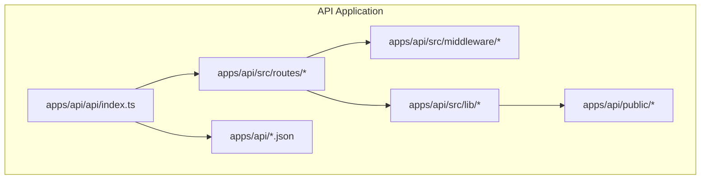
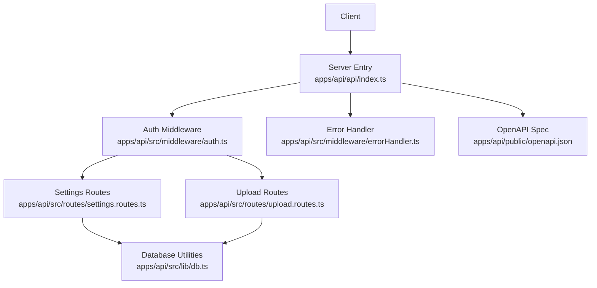
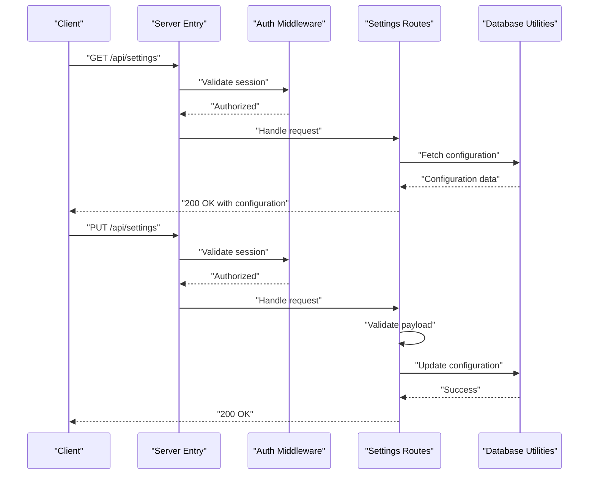
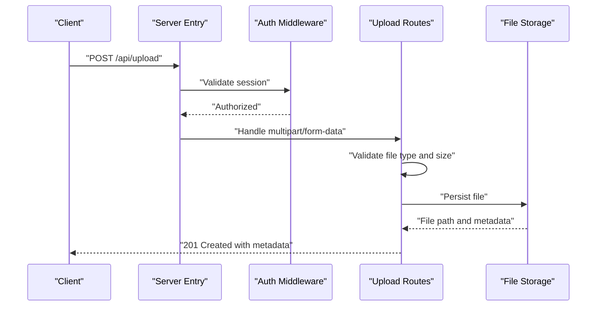
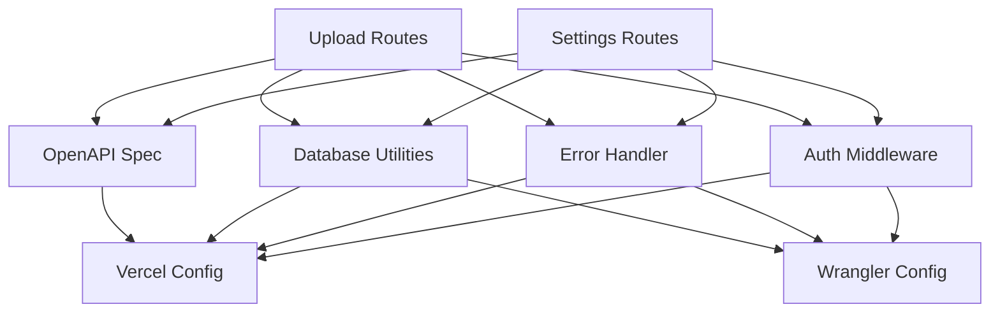

# System Utilities API

<cite>
**Referenced Files in This Document**
- [index.ts](file://apps/api/api/index.ts)
- [settings.routes.ts](file://apps/api/src/routes/settings.routes.ts)
- [upload.routes.ts](file://apps/api/src/routes/upload.routes.ts)
- [auth.ts](file://apps/api/src/middleware/auth.ts)
- [errorHandler.ts](file://apps/api/src/middleware/errorHandler.ts)
- [db.ts](file://apps/api/src/lib/db.ts)
- [errors.ts](file://apps/api/src/lib/errors.ts)
- [openapi.json](file://apps/api/public/openapi.json)
- [vercel.json](file://apps/api/vercel.json)
- [wrangler.toml](file://apps/api/wrangler.toml)
</cite>

## Table of Contents
1. [Introduction](#introduction)
2. [Project Structure](#project-structure)
3. [Core Components](#core-components)
4. [Architecture Overview](#architecture-overview)
5. [Detailed Component Analysis](#detailed-component-analysis)
6. [Dependency Analysis](#dependency-analysis)
7. [Performance Considerations](#performance-considerations)
8. [Troubleshooting Guide](#troubleshooting-guide)
9. [Conclusion](#conclusion)

## Introduction
This document provides comprehensive API documentation for the System Utilities module within the ARHAT POS platform. It focuses on utility endpoints for file uploads, system configuration management, and related administrative operations. The module integrates with file storage systems, database persistence, and middleware for authentication and error handling. It also covers CORS configuration, file validation rules, storage quotas, and cleanup procedures.

## Project Structure
The System Utilities module resides in the API application (`apps/api`). Key components include:
- Entry point and server configuration
- Route definitions for settings and uploads
- Middleware for authentication and error handling
- Database integration utilities
- OpenAPI specification for endpoint documentation
- Platform-specific deployment configurations (Vercel and Wrangler)

**Diagram sources**
- [index.ts](file://apps/api/api/index.ts)
- [settings.routes.ts](file://apps/api/src/routes/settings.routes.ts)
- [upload.routes.ts](file://apps/api/src/routes/upload.routes.ts)
- [auth.ts](file://apps/api/src/middleware/auth.ts)
- [errorHandler.ts](file://apps/api/src/middleware/errorHandler.ts)
- [db.ts](file://apps/api/src/lib/db.ts)
- [errors.ts](file://apps/api/src/lib/errors.ts)
- [openapi.json](file://apps/api/public/openapi.json)
- [vercel.json](file://apps/api/vercel.json)
- [wrangler.toml](file://apps/api/wrangler.toml)

**Section sources**
- [index.ts](file://apps/api/api/index.ts)
- [settings.routes.ts](file://apps/api/src/routes/settings.routes.ts)
- [upload.routes.ts](file://apps/api/src/routes/upload.routes.ts)
- [openapi.json](file://apps/api/public/openapi.json)

## Core Components
This section documents the primary endpoints and their responsibilities:

- POST /api/upload
  - Purpose: Upload files to the system for product images and related assets.
  - Authentication: Required via middleware.
  - Validation: Enforced by route-level checks for file type and size.
  - Storage: Files are persisted to the configured file storage location.
  - Response: Returns metadata about the uploaded file.

- GET /api/settings
  - Purpose: Retrieve current system configuration values.
  - Authentication: Required via middleware.
  - Persistence: Reads configuration from the database.
  - Response: Returns a JSON object containing configuration keys and values.

- PUT /api/settings
  - Purpose: Update system configuration values.
  - Authentication: Required via middleware.
  - Validation: Validates incoming configuration keys and values.
  - Persistence: Writes updates to the database.
  - Response: Confirms successful update.

Additional administrative utilities:
- Backup and restore operations: Implemented through database migration scripts and seed utilities.
- Cleanup procedures: Managed via migration scripts and maintenance tasks.
- Storage quotas: Enforced by file validation rules and platform limits.

**Section sources**
- [settings.routes.ts](file://apps/api/src/routes/settings.routes.ts)
- [upload.routes.ts](file://apps/api/src/routes/upload.routes.ts)
- [auth.ts](file://apps/api/src/middleware/auth.ts)
- [errorHandler.ts](file://apps/api/src/middleware/errorHandler.ts)
- [db.ts](file://apps/api/src/lib/db.ts)

## Architecture Overview
The System Utilities module follows a layered architecture:
- Entry point initializes the server and loads configuration.
- Routes define endpoint contracts and delegate to controllers/services.
- Middleware handles authentication and error management.
- Database utilities manage persistence and schema operations.
- Deployment configurations (Vercel and Wrangler) define runtime behavior.

**Diagram sources**
- [index.ts](file://apps/api/api/index.ts)
- [auth.ts](file://apps/api/src/middleware/auth.ts)
- [errorHandler.ts](file://apps/api/src/middleware/errorHandler.ts)
- [settings.routes.ts](file://apps/api/src/routes/settings.routes.ts)
- [upload.routes.ts](file://apps/api/src/routes/upload.routes.ts)
- [db.ts](file://apps/api/src/lib/db.ts)
- [openapi.json](file://apps/api/public/openapi.json)

## Detailed Component Analysis

### Settings Management Endpoints
The settings endpoints provide configuration retrieval and updates:
- GET /api/settings
  - Retrieves system configuration from the database.
  - Requires authentication.
  - Returns configuration as JSON.

- PUT /api/settings
  - Updates system configuration values.
  - Requires authentication.
  - Validates configuration keys and values.
  - Persists changes to the database.

**Diagram sources**
- [settings.routes.ts](file://apps/api/src/routes/settings.routes.ts)
- [auth.ts](file://apps/api/src/middleware/auth.ts)
- [db.ts](file://apps/api/src/lib/db.ts)

**Section sources**
- [settings.routes.ts](file://apps/api/src/routes/settings.routes.ts)
- [auth.ts](file://apps/api/src/middleware/auth.ts)
- [db.ts](file://apps/api/src/lib/db.ts)

### File Upload Endpoint
The upload endpoint manages file uploads for images and assets:
- POST /api/upload
  - Validates file type and size.
  - Stores files to the configured file storage location.
  - Returns metadata about the uploaded file.

**Diagram sources**
- [upload.routes.ts](file://apps/api/src/routes/upload.routes.ts)
- [auth.ts](file://apps/api/src/middleware/auth.ts)

**Section sources**
- [upload.routes.ts](file://apps/api/src/routes/upload.routes.ts)
- [auth.ts](file://apps/api/src/middleware/auth.ts)

### Administrative Operations
- Backup and Restore
  - Implemented through database migration scripts and seed utilities.
  - Supports schema evolution and initial data population.

- Cleanup Procedures
  - Managed via migration scripts and maintenance tasks.
  - Ensures database consistency and performance.

- Storage Quotas
  - Enforced by file validation rules and platform limits.
  - Prevents excessive resource consumption.

**Section sources**
- [migrate.ts](file://apps/api/migrate.ts)
- [seed.ts](file://apps/api/src/scripts/seed.ts)
- [upload.routes.ts](file://apps/api/src/routes/upload.routes.ts)

## Dependency Analysis
The System Utilities module depends on:
- Authentication middleware for secure access.
- Database utilities for configuration persistence.
- Error handler middleware for consistent error responses.
- OpenAPI specification for endpoint documentation.
- Platform configurations for deployment behavior.

**Diagram sources**
- [settings.routes.ts](file://apps/api/src/routes/settings.routes.ts)
- [upload.routes.ts](file://apps/api/src/routes/upload.routes.ts)
- [auth.ts](file://apps/api/src/middleware/auth.ts)
- [errorHandler.ts](file://apps/api/src/middleware/errorHandler.ts)
- [db.ts](file://apps/api/src/lib/db.ts)
- [openapi.json](file://apps/api/public/openapi.json)
- [vercel.json](file://apps/api/vercel.json)
- [wrangler.toml](file://apps/api/wrangler.toml)

**Section sources**
- [settings.routes.ts](file://apps/api/src/routes/settings.routes.ts)
- [upload.routes.ts](file://apps/api/src/routes/upload.routes.ts)
- [auth.ts](file://apps/api/src/middleware/auth.ts)
- [errorHandler.ts](file://apps/api/src/middleware/errorHandler.ts)
- [db.ts](file://apps/api/src/lib/db.ts)
- [openapi.json](file://apps/api/public/openapi.json)
- [vercel.json](file://apps/api/vercel.json)
- [wrangler.toml](file://apps/api/wrangler.toml)

## Performance Considerations
- File uploads: Optimize storage I/O and enforce size limits to prevent resource exhaustion.
- Database queries: Use efficient queries and indexing for settings retrieval and updates.
- Middleware overhead: Keep authentication and error handling lightweight to minimize latency.
- Caching: Consider caching frequently accessed configuration values to reduce database load.

## Troubleshooting Guide
Common issues and resolutions:
- Authentication failures: Verify session tokens and middleware configuration.
- Upload errors: Check file type validation and storage permissions.
- Database errors: Review connection settings and migration scripts.
- CORS issues: Ensure proper headers are set for cross-origin requests.

**Section sources**
- [auth.ts](file://apps/api/src/middleware/auth.ts)
- [errorHandler.ts](file://apps/api/src/middleware/errorHandler.ts)
- [errors.ts](file://apps/api/src/lib/errors.ts)

## Conclusion
The System Utilities module provides essential endpoints for file uploads and system configuration management. It integrates authentication, validation, storage, and database persistence while supporting administrative operations like backups, restores, and cleanup. Proper configuration of CORS, file validation rules, and storage quotas ensures reliable operation across platforms.