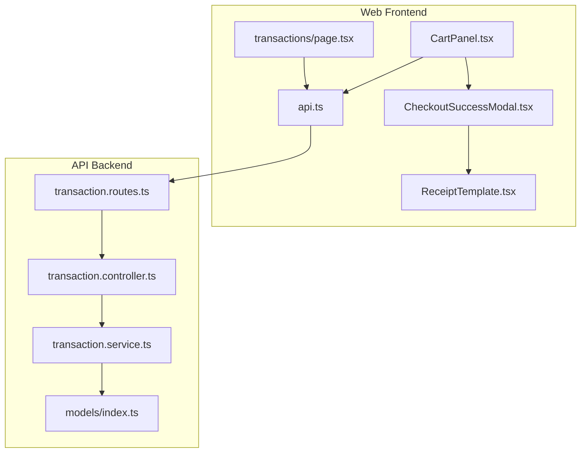
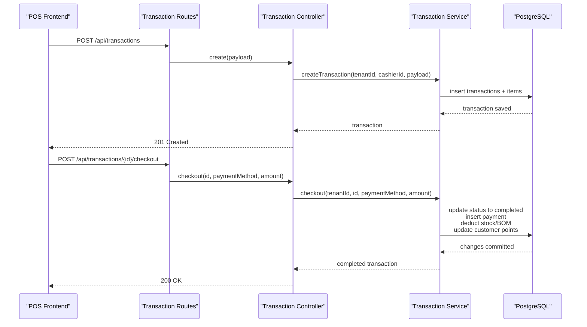
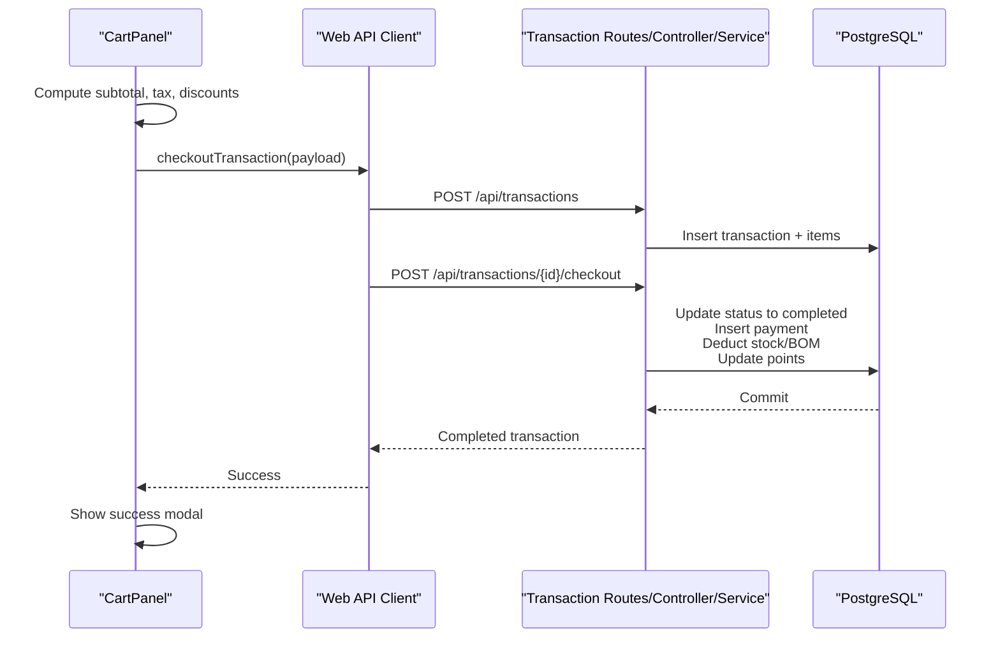
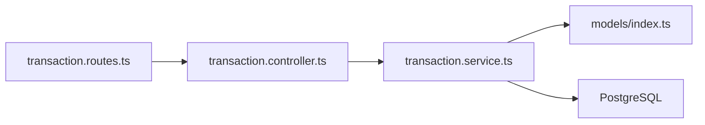

# Transaction Processing API

<cite>
**Referenced Files in This Document**
- [transaction.controller.ts](file://apps/api/src/controllers/transaction.controller.ts)
- [transaction.routes.ts](file://apps/api/src/routes/transaction.routes.ts)
- [transaction.service.ts](file://apps/api/src/services/transaction.service.ts)
- [models/index.ts](file://apps/api/src/models/index.ts)
- [api.ts](file://apps/web/src/lib/api.ts)
- [CartPanel.tsx](file://apps/web/src/components/pos/CartPanel.tsx)
- [CheckoutSuccessModal.tsx](file://apps/web/src/components/pos/CheckoutSuccessModal.tsx)
- [ReceiptTemplate.tsx](file://apps/web/src/components/pos/ReceiptTemplate.tsx)
- [transactions/page.tsx](file://apps/web/src/app/transactions/page.tsx)
- [analytics.service.ts](file://apps/api/src/services/analytics.service.ts)
</cite>

## Table of Contents
1. [Introduction](#introduction)
2. [Project Structure](#project-structure)
3. [Core Components](#core-components)
4. [Architecture Overview](#architecture-overview)
5. [Detailed Component Analysis](#detailed-component-analysis)
6. [Dependency Analysis](#dependency-analysis)
7. [Performance Considerations](#performance-considerations)
8. [Troubleshooting Guide](#troubleshooting-guide)
9. [Conclusion](#conclusion)

## Introduction
This document provides comprehensive API documentation for the Transaction Processing module in the ARHAT POS system. It covers all transaction endpoints, payment processing integration for cash, card, and QRIS (digital) payments, receipt generation, transaction status management, and real-time checkout workflows. It also explains inventory deduction logic, tax calculation, discount application, and multi-item transaction handling, with practical examples of complete checkout flows and transaction reporting patterns.

## Project Structure
The Transaction Processing module spans backend API controllers, services, and routes, along with frontend POS components that orchestrate the checkout experience and receipt printing.

**Diagram sources**
- [transaction.routes.ts:1-23](file://apps/api/src/routes/transaction.routes.ts#L1-L23)
- [transaction.controller.ts:1-142](file://apps/api/src/controllers/transaction.controller.ts#L1-L142)
- [transaction.service.ts:1-414](file://apps/api/src/services/transaction.service.ts#L1-L414)
- [models/index.ts:119-181](file://apps/api/src/models/index.ts#L119-L181)
- [api.ts:66-169](file://apps/web/src/lib/api.ts#L66-L169)
- [CartPanel.tsx:12-497](file://apps/web/src/components/pos/CartPanel.tsx#L12-L497)
- [CheckoutSuccessModal.tsx:12-150](file://apps/web/src/components/pos/CheckoutSuccessModal.tsx#L12-L150)
- [ReceiptTemplate.tsx:4-159](file://apps/web/src/components/pos/ReceiptTemplate.tsx#L4-L159)
- [transactions/page.tsx:8-158](file://apps/web/src/app/transactions/page.tsx#L8-L158)

**Section sources**
- [transaction.routes.ts:1-23](file://apps/api/src/routes/transaction.routes.ts#L1-L23)
- [transaction.controller.ts:1-142](file://apps/api/src/controllers/transaction.controller.ts#L1-L142)
- [transaction.service.ts:1-414](file://apps/api/src/services/transaction.service.ts#L1-L414)
- [models/index.ts:119-181](file://apps/api/src/models/index.ts#L119-L181)
- [api.ts:66-169](file://apps/web/src/lib/api.ts#L66-L169)
- [CartPanel.tsx:12-497](file://apps/web/src/components/pos/CartPanel.tsx#L12-L497)
- [CheckoutSuccessModal.tsx:12-150](file://apps/web/src/components/pos/CheckoutSuccessModal.tsx#L12-L150)
- [ReceiptTemplate.tsx:4-159](file://apps/web/src/components/pos/ReceiptTemplate.tsx#L4-L159)
- [transactions/page.tsx:8-158](file://apps/web/src/app/transactions/page.tsx#L8-L158)

## Core Components
- Transaction Routes: Define authentication middleware and expose endpoints for listing, creating, offline synchronization, checkout, holding, retrieving held transactions, resuming, refunding, and voiding transactions.
- Transaction Controller: Implements route handlers that delegate to the Transaction Service and trigger optional WhatsApp receipt notifications.
- Transaction Service: Orchestrates transaction creation, checkout completion (including payment recording, inventory deduction, stock movements, and customer points), held transactions, resuming, refunding, and voiding with database transactions for atomicity.
- Models: Define the schema for transactions, transaction items, payments, stock movements, products, customers, shifts, and related entities.
- Web API Client: Provides frontend functions to create transactions, process checkout, hold/resume transactions, refund, void, and fetch transactions.
- POS Components: Manage cart, taxes, discounts, payment methods, and receipt printing/modals.

Key responsibilities:
- Real-time checkout: Create transaction, then immediately complete checkout with payment and inventory adjustments.
- Offline sync: Create and immediately checkout for offline scenarios.
- Multi-item support: Each transaction can include multiple items with variants and modifiers.
- Payment methods: Cash, Card, QRIS supported in frontend; backend accepts paymentMethod and amount.
- Receipt generation: Frontend receipt template and modal; optional WhatsApp receipt sending.

**Section sources**
- [transaction.routes.ts:7-22](file://apps/api/src/routes/transaction.routes.ts#L7-L22)
- [transaction.controller.ts:5-142](file://apps/api/src/controllers/transaction.controller.ts#L5-L142)
- [transaction.service.ts:19-414](file://apps/api/src/services/transaction.service.ts#L19-L414)
- [models/index.ts:119-181](file://apps/api/src/models/index.ts#L119-L181)
- [api.ts:66-169](file://apps/web/src/lib/api.ts#L66-L169)
- [CartPanel.tsx:46-103](file://apps/web/src/components/pos/CartPanel.tsx#L46-L103)

## Architecture Overview
The Transaction Processing API follows a layered architecture:
- Route Layer: Hono routes with authentication middleware.
- Controller Layer: Request handling and delegation to services.
- Service Layer: Business logic with database transactions for consistency.
- Data Layer: Drizzle ORM models and PostgreSQL schema.

**Diagram sources**
- [transaction.routes.ts:10-13](file://apps/api/src/routes/transaction.routes.ts#L10-L13)
- [transaction.controller.ts:16-55](file://apps/api/src/controllers/transaction.controller.ts#L16-L55)
- [transaction.service.ts:31-234](file://apps/api/src/services/transaction.service.ts#L31-L234)

## Detailed Component Analysis

### Transaction Endpoints

#### POST /api/transactions
Purpose: Create a new pending transaction (cart save).
- Authentication: Required.
- Request Body: Includes tenantId, cashierId, optional customerId, customerPhone, pointsRedeemed, paymentMethod, subtotal, taxAmount, discountAmount, totalAmount, and items array with productId, variantId/Name, modifiers, quantity, unitPrice, and subtotal.
- Response: Returns the created transaction with status pending.

Processing highlights:
- Generates a unique transaction number.
- Inserts transaction header with pending status.
- Inserts transaction items.
- Optionally triggers asynchronous WhatsApp receipt if customerPhone is provided.

**Section sources**
- [transaction.routes.ts:10-11](file://apps/api/src/routes/transaction.routes.ts#L10-L11)
- [transaction.controller.ts:16-37](file://apps/api/src/controllers/transaction.controller.ts#L16-L37)
- [transaction.service.ts:31-102](file://apps/api/src/services/transaction.service.ts#L31-L102)

#### POST /api/transactions/:id/checkout
Purpose: Complete a transaction by marking it as completed, recording payment, and performing inventory deductions.
- Authentication: Required.
- Path Params: id (transaction ID).
- Request Body: paymentMethod (Cash/Card/QRIS), amount (totalAmount).
- Response: Returns the completed transaction.

Processing highlights:
- Updates transaction status to completed, sets paymentMethod and paymentStatus, records completedAt.
- Inserts a payment record with status completed.
- Deducts stock: For finished products, updates product stock and records stock movement; for BOM-enabled products, deducts raw material stocks based on BOM quantities.
- Handles customer points: Calculates points earned based on totalAmount and customer tier, updates customer points and totalSpent.

**Section sources**
- [transaction.routes.ts:13](file://apps/api/src/routes/transaction.routes.ts#L13)
- [transaction.controller.ts:39-55](file://apps/api/src/controllers/transaction.controller.ts#L39-L55)
- [transaction.service.ts:107-234](file://apps/api/src/services/transaction.service.ts#L107-L234)

#### POST /api/transactions/offline-sync
Purpose: Offline-first workflow to create and immediately checkout a transaction.
- Authentication: Required.
- Request Body: Same as POST /api/transactions plus paymentMethod and totalAmount.
- Response: Returns the completed transaction after offline sync.

Processing highlights:
- Creates transaction (pending).
- Immediately performs checkout (same as POST /api/transactions/:id/checkout).
- Triggers optional WhatsApp receipt.

**Section sources**
- [transaction.routes.ts:12](file://apps/api/src/routes/transaction.routes.ts#L12)
- [transaction.controller.ts:57-86](file://apps/api/src/controllers/transaction.controller.ts#L57-L86)
- [transaction.service.ts:107-234](file://apps/api/src/services/transaction.service.ts#L107-L234)

#### POST /api/transactions/hold
Purpose: Save a cart as a held transaction for later completion.
- Authentication: Required.
- Request Body: notes, items (with productId, variantId/Name, modifiers, quantity, unitPrice, discount, tax, subtotal), subtotal, taxAmount, discountAmount, totalAmount.
- Response: Returns the held transaction with status held.

Processing highlights:
- Generates a unique held transaction number.
- Sets status to held and heldUntil to 24 hours in the future.
- Inserts items linked to the held transaction.

**Section sources**
- [transaction.routes.ts:15](file://apps/api/src/routes/transaction.routes.ts#L15)
- [transaction.controller.ts:88-97](file://apps/api/src/controllers/transaction.controller.ts#L88-L97)
- [transaction.service.ts:239-295](file://apps/api/src/services/transaction.service.ts#L239-L295)

#### GET /api/transactions/held
Purpose: Retrieve all held transactions for the tenant.
- Authentication: Required.
- Response: Returns an array of held transactions with their items joined.

Processing highlights:
- Queries transactions with status held.
- Joins transactionItems and products to enrich each held transaction with product details.

**Section sources**
- [transaction.routes.ts:16](file://apps/api/src/routes/transaction.routes.ts#L16)
- [transaction.controller.ts:99-107](file://apps/api/src/controllers/transaction.controller.ts#L99-L107)
- [transaction.service.ts:299-330](file://apps/api/src/services/transaction.service.ts#L299-L330)

#### POST /api/transactions/:id/resume
Purpose: Resume a held transaction by moving it back to pending.
- Authentication: Required.
- Path Params: id (held transaction ID).
- Response: Returns the resumed transaction.

Processing highlights:
- Updates status from held to pending.

**Section sources**
- [transaction.routes.ts:17](file://apps/api/src/routes/transaction.routes.ts#L17)
- [transaction.controller.ts:109-118](file://apps/api/src/controllers/transaction.controller.ts#L109-L118)
- [transaction.service.ts:335-347](file://apps/api/src/services/transaction.service.ts#L335-L347)

#### POST /api/transactions/:id/refund
Purpose: Refund a completed transaction.
- Authentication: Required.
- Path Params: id (transaction ID).
- Response: Returns the refunded transaction.

Processing highlights:
- Updates transaction status to refunded.
- Marks associated payment as refunded.
- Restores stock quantities and records stock movements with reason "Refund".

**Section sources**
- [transaction.routes.ts:19](file://apps/api/src/routes/transaction.routes.ts#L19)
- [transaction.controller.ts:120-129](file://apps/api/src/controllers/transaction.controller.ts#L120-L129)
- [transaction.service.ts:352-396](file://apps/api/src/services/transaction.service.ts#L352-L396)

#### POST /api/transactions/:id/void
Purpose: Void a pending or uncompleted transaction.
- Authentication: Required.
- Path Params: id (transaction ID).
- Response: Returns the voided transaction.

Processing highlights:
- Updates transaction status to voided.

**Section sources**
- [transaction.routes.ts:20](file://apps/api/src/routes/transaction.routes.ts#L20)
- [transaction.controller.ts:131-140](file://apps/api/src/controllers/transaction.controller.ts#L131-L140)
- [transaction.service.ts:401-412](file://apps/api/src/services/transaction.service.ts#L401-L412)

### Payment Processing Integration
Supported payment methods in the frontend: Cash, Card, QRIS. The backend accepts paymentMethod and amount during checkout.

Real-time checkout flow:
1. Create transaction (POST /api/transactions) → returns pending transaction.
2. Checkout transaction (POST /api/transactions/{id}/checkout) → completes payment, deducts stock, updates points.

Offline sync flow:
1. POST /api/transactions/offline-sync → creates and immediately checks out transaction.

WhatsApp receipt:
- Optional customerPhone in transaction creation triggers asynchronous WhatsApp receipt sending.

**Section sources**
- [CartPanel.tsx:46-52](file://apps/web/src/components/pos/CartPanel.tsx#L46-L52)
- [CartPanel.tsx:58-103](file://apps/web/src/components/pos/CartPanel.tsx#L58-L103)
- [api.ts:75-119](file://apps/web/src/lib/api.ts#L75-L119)
- [transaction.controller.ts:27-31](file://apps/api/src/controllers/transaction.controller.ts#L27-L31)
- [transaction.service.ts:107-234](file://apps/api/src/services/transaction.service.ts#L107-L234)

### Receipt Generation Endpoints and Workflows
- Frontend receipt template: [ReceiptTemplate.tsx:4-159](file://apps/web/src/components/pos/ReceiptTemplate.tsx#L4-L159) renders a thermal-style receipt.
- Print portal: [PrintReceiptPortal:139-159](file://apps/web/src/components/pos/ReceiptTemplate.tsx#L139-L159) wraps the receipt for printing.
- Success modal: [CheckoutSuccessModal.tsx:12-150](file://apps/web/src/components/pos/CheckoutSuccessModal.tsx#L12-L150) provides options to print receipt or send via WhatsApp.

Note: The backend does not expose a dedicated receipt endpoint; receipts are generated client-side from transaction data.

**Section sources**
- [ReceiptTemplate.tsx:4-159](file://apps/web/src/components/pos/ReceiptTemplate.tsx#L4-L159)
- [CheckoutSuccessModal.tsx:12-150](file://apps/web/src/components/pos/CheckoutSuccessModal.tsx#L12-L150)
- [transactions/page.tsx:50-56](file://apps/web/src/app/transactions/page.tsx#L50-L56)

### Transaction Status Management
Status lifecycle:
- pending: newly created transaction.
- completed: after successful checkout.
- held: saved cart awaiting future completion.
- refunded: fully refunded transaction.
- voided: canceled pending transaction.

Status transitions are enforced by service methods and route handlers.

**Section sources**
- [transaction.service.ts:114-127](file://apps/api/src/services/transaction.service.ts#L114-L127)
- [transaction.service.ts:263-274](file://apps/api/src/services/transaction.service.ts#L263-L274)
- [transaction.service.ts:354-363](file://apps/api/src/services/transaction.service.ts#L354-L363)
- [transaction.service.ts:402-409](file://apps/api/src/services/transaction.service.ts#L402-L409)

### Real-Time Checkout Workflows
End-to-end checkout sequence:
1. CartPanel computes subtotal, tax (11%), global discount, and points discount.
2. Initiates checkout with selected payment method.
3. Calls checkoutTransaction API which:
   - POSTs to /api/transactions to create a pending transaction.
   - POSTs to /api/transactions/{id}/checkout to complete payment and inventory adjustments.
4. On success, displays CheckoutSuccessModal with options to print receipt or send via WhatsApp.

**Diagram sources**
- [CartPanel.tsx:46-103](file://apps/web/src/components/pos/CartPanel.tsx#L46-L103)
- [api.ts:75-119](file://apps/web/src/lib/api.ts#L75-L119)
- [transaction.routes.ts:10-13](file://apps/api/src/routes/transaction.routes.ts#L10-L13)
- [transaction.controller.ts:16-55](file://apps/api/src/controllers/transaction.controller.ts#L16-L55)
- [transaction.service.ts:31-234](file://apps/api/src/services/transaction.service.ts#L31-L234)

### Inventory Deduction Logic
- Finished Products: Decrease product stockQuantity and record a stock movement with reason "POS Sale".
- BOM-enabled Products: For each bill of material item, compute required quantity (BOM quantity × sold quantity) and decrease raw material stockQuantity accordingly.

Edge cases:
- Service items (isService) are not subject to stock deduction.
- If insufficient stock exists, the transaction will fail at the database level.

**Section sources**
- [transaction.service.ts:139-190](file://apps/api/src/services/transaction.service.ts#L139-L190)
- [models/index.ts:57-74](file://apps/api/src/models/index.ts#L57-L74)
- [models/index.ts:289-307](file://apps/api/src/models/index.ts#L289-L307)

### Tax Calculation and Discount Application
- Tax: 11% applied to subtotal after global discount and points discount.
- Discounts: Global discount (per transaction) and per-item discount; points discount equals pointsRedeemed × 10.
- Total computation: subtotal - totalDiscount - pointsDiscount + tax.

Frontend logic:
- CartPanel calculates tax and total based on isTaxEnabled flag and applies global discount and points discount.

**Section sources**
- [CartPanel.tsx:39-44](file://apps/web/src/components/pos/CartPanel.tsx#L39-L44)
- [CartPanel.tsx:334-382](file://apps/web/src/components/pos/CartPanel.tsx#L334-L382)

### Multi-Item Transaction Handling
- Each transaction can include multiple items.
- Each item supports variantId/Name and modifiers.
- Subtotal per item is computed as unitPrice × quantity minus item discount.
- During checkout, all items are processed for inventory deduction and stock movements.

**Section sources**
- [transaction.service.ts:85-98](file://apps/api/src/services/transaction.service.ts#L85-L98)
- [transaction.service.ts:140-190](file://apps/api/src/services/transaction.service.ts#L140-L190)

### Transaction Reporting Patterns
Available analytics endpoints (related to transactions):
- Sales Analytics: Aggregates completed transactions by total revenue, total transactions, payment method distribution, and daily revenue chart.
- Product Analytics: Top products by quantity and revenue, and slow-moving products.
- Profit & Loss: Revenue and COGS over the last 30 days.

These endpoints rely on completed transactions and transaction items.

**Section sources**
- [analytics.service.ts:131-199](file://apps/api/src/services/analytics.service.ts#L131-L199)
- [analytics.service.ts:202-258](file://apps/api/src/services/analytics.service.ts#L202-L258)
- [analytics.service.ts:260-295](file://apps/api/src/services/analytics.service.ts#L260-L295)

## Dependency Analysis
The Transaction Processing module depends on:
- Authentication middleware for route protection.
- Drizzle ORM models for schema definitions and queries.
- Database transactions for atomic operations across multiple writes.

**Diagram sources**
- [transaction.routes.ts:1-23](file://apps/api/src/routes/transaction.routes.ts#L1-L23)
- [transaction.controller.ts:1-142](file://apps/api/src/controllers/transaction.controller.ts#L1-L142)
- [transaction.service.ts:1-414](file://apps/api/src/services/transaction.service.ts#L1-L414)
- [models/index.ts:119-181](file://apps/api/src/models/index.ts#L119-L181)

**Section sources**
- [transaction.routes.ts:1-23](file://apps/api/src/routes/transaction.routes.ts#L1-L23)
- [transaction.controller.ts:1-142](file://apps/api/src/controllers/transaction.controller.ts#L1-L142)
- [transaction.service.ts:1-414](file://apps/api/src/services/transaction.service.ts#L1-L414)
- [models/index.ts:119-181](file://apps/api/src/models/index.ts#L119-L181)

## Performance Considerations
- Database Transactions: All critical operations (create, checkout, refund, hold/resume) use database transactions to ensure consistency and rollback on failure.
- Batch Operations: Item insertion uses bulk inserts for transaction items.
- Indexes: Transactions table includes indexes on transactionNumber and createdAt to optimize listing and search.
- Asynchronous Notifications: WhatsApp receipt sending is asynchronous to avoid blocking API responses.

## Troubleshooting Guide
Common issues and resolutions:
- Transaction not found: Ensure the transaction exists and belongs to the authenticated user's tenant. Some operations throw explicit errors if the transaction is missing or not in the expected state.
- Insufficient stock: Inventory deduction fails if stock becomes negative; verify product or raw material stock levels.
- Payment mismatch: Ensure amount matches totalAmount during checkout.
- Session expired: Frontend automatically redirects to login when receiving 401 Unauthorized.

**Section sources**
- [transaction.service.ts:129](file://apps/api/src/services/transaction.service.ts#L129)
- [transaction.service.ts:365](file://apps/api/src/services/transaction.service.ts#L365)
- [api.ts:17-27](file://apps/web/src/lib/api.ts#L17-L27)

## Conclusion
The Transaction Processing module provides a robust, real-time checkout system with offline support, comprehensive inventory management, flexible payment methods, and integrated receipt generation. Its service-layer design ensures data consistency through database transactions, while the frontend components deliver a smooth, UXM-focused POS experience. Reporting endpoints enable business insights based on completed transactions.