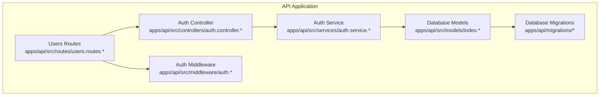
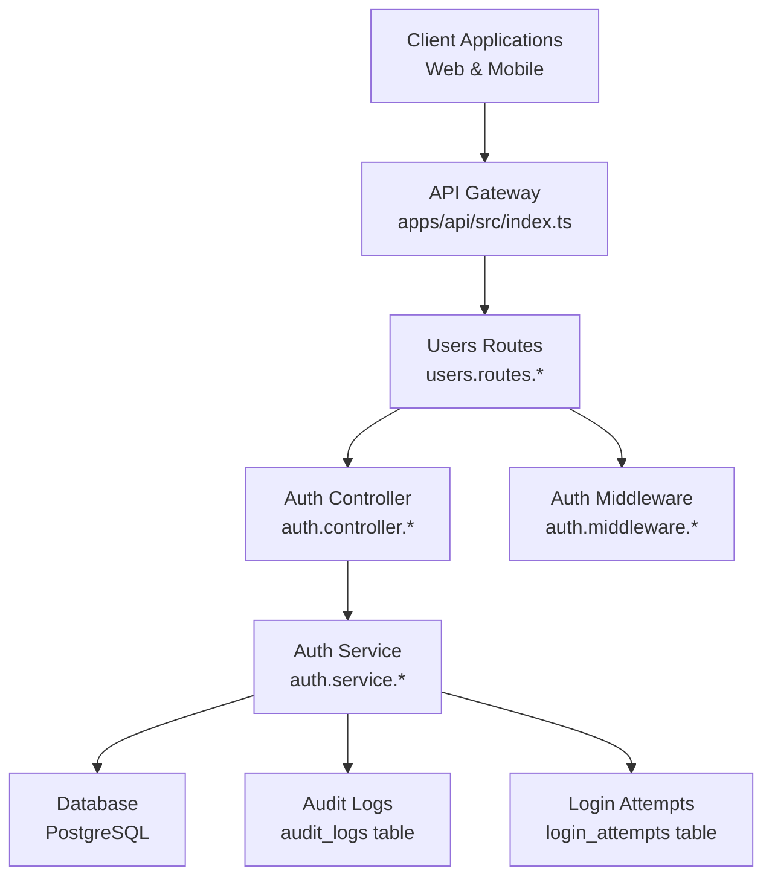
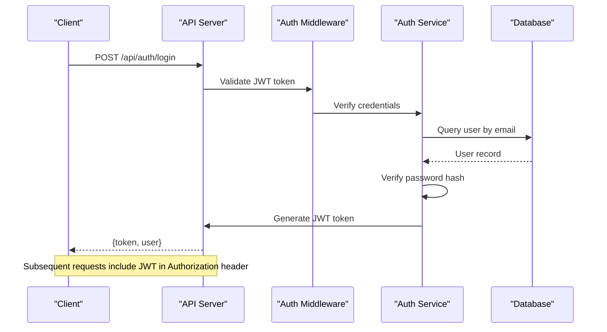
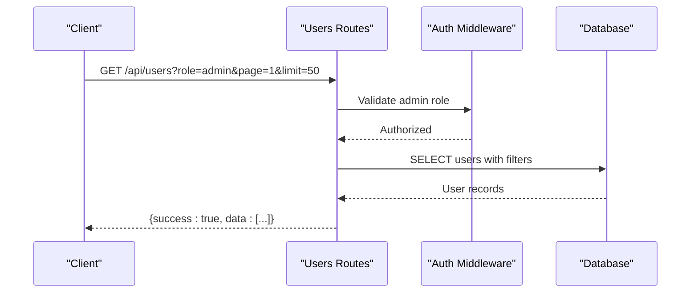
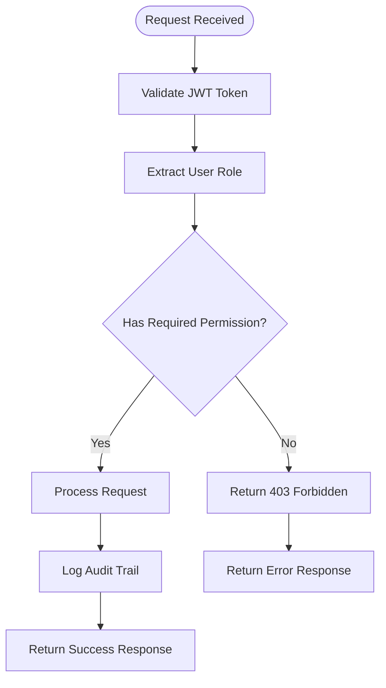
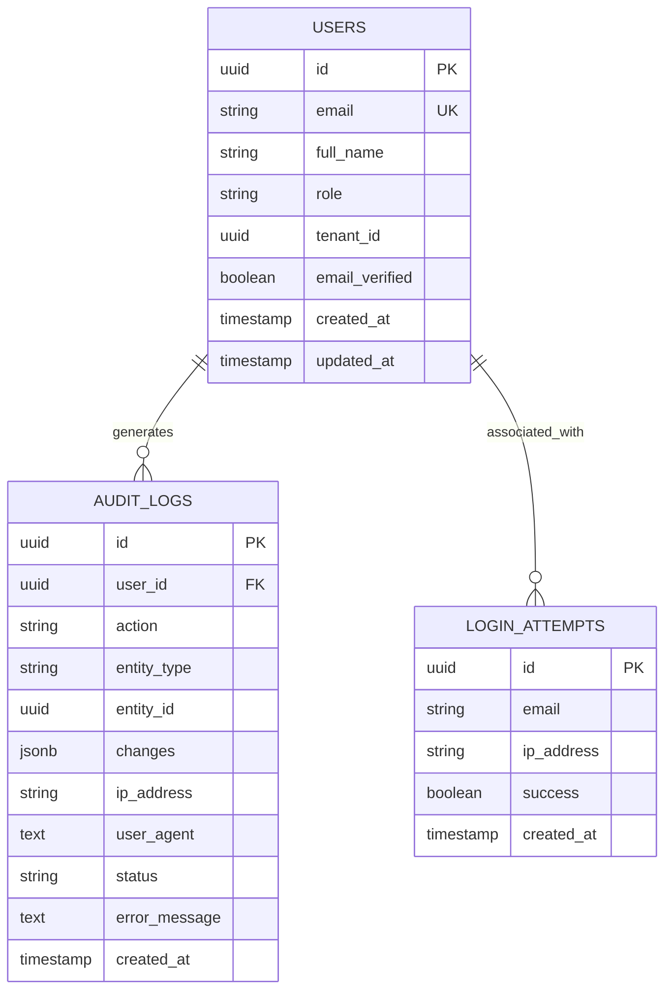
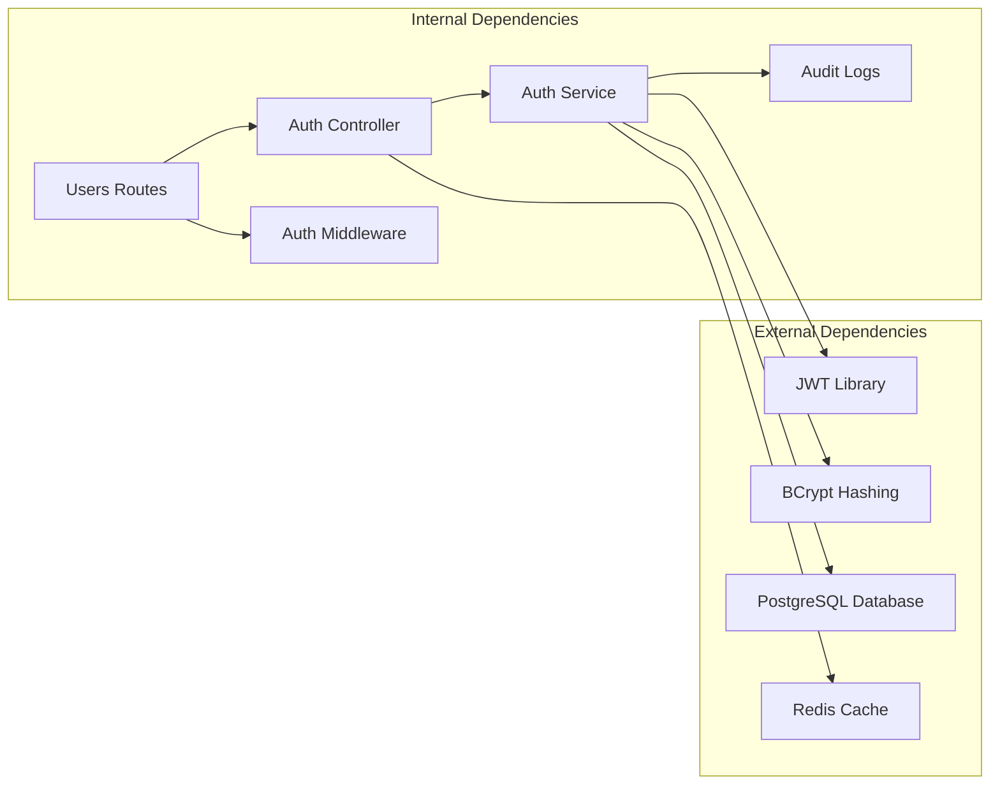

# User Administration API

<cite>
**Referenced Files in This Document**
- [users.routes.ts](file://apps/api/src/routes/users.routes.ts)
- [users.routes.js](file://apps/api/src/routes/users.routes.js)
- [auth.controller.ts](file://apps/api/src/controllers/auth.controller.ts)
- [auth.controller.js](file://apps/api/src/controllers/auth.controller.js)
- [auth.middleware.ts](file://apps/api/src/middleware/auth.ts)
- [auth.middleware.js](file://apps/api/src/middleware/auth.js)
- [auth.service.ts](file://apps/api/src/services/auth.service.ts)
- [auth.service.js](file://apps/api/src/services/auth.service.js)
- [api.ts](file://apps/web/src/lib/api.ts)
- [001_initial_setup.sql](file://apps/api/migrations/001_initial_setup.sql)
- [index.ts](file://apps/api/src/index.ts)
</cite>

## Table of Contents
1. [Introduction](#introduction)
2. [Project Structure](#project-structure)
3. [Core Components](#core-components)
4. [Architecture Overview](#architecture-overview)
5. [Detailed Component Analysis](#detailed-component-analysis)
6. [Dependency Analysis](#dependency-analysis)
7. [Performance Considerations](#performance-considerations)
8. [Troubleshooting Guide](#troubleshooting-guide)
9. [Conclusion](#conclusion)
10. [Appendices](#appendices)

## Introduction
This document provides comprehensive API documentation for the User Administration module within the ARHAT POS system. It covers all user management endpoints, role-based access control, permission management, audit trail functionality, authentication logs, session management, and security clearance levels. The documentation includes practical examples for user onboarding, role assignment workflows, and administrative access patterns.

## Project Structure
The User Administration module is implemented in the API application under the apps/api directory. Key components include:
- Routes: Define HTTP endpoints and request validation
- Controllers: Handle business logic and orchestrate service calls
- Services: Implement authentication and user management operations
- Middleware: Enforce authentication and authorization policies
- Migrations: Define database schema for users, roles, permissions, audit logs, and login attempts

**Diagram sources**
- [users.routes.ts:1-150](file://apps/api/src/routes/users.routes.ts#L1-L150)
- [auth.controller.ts:1-200](file://apps/api/src/controllers/auth.controller.ts#L1-L200)
- [auth.service.ts:1-200](file://apps/api/src/services/auth.service.ts#L1-L200)
- [auth.middleware.ts:1-200](file://apps/api/src/middleware/auth.ts#L1-L200)
- [001_initial_setup.sql:155-194](file://apps/api/migrations/001_initial_setup.sql#L155-L194)

**Section sources**
- [users.routes.ts:1-150](file://apps/api/src/routes/users.routes.ts#L1-L150)
- [auth.controller.ts:1-200](file://apps/api/src/controllers/auth.controller.ts#L1-L200)
- [auth.service.ts:1-200](file://apps/api/src/services/auth.service.ts#L1-L200)
- [auth.middleware.ts:1-200](file://apps/api/src/middleware/auth.ts#L1-L200)
- [001_initial_setup.sql:155-194](file://apps/api/migrations/001_initial_setup.sql#L155-L194)

## Core Components
This section outlines the primary components involved in user administration and their responsibilities:
- Users Routes: Define endpoints for listing, creating, retrieving, updating, and deleting users, with role-based access control enforcement
- Auth Controller: Manages authentication operations including registration, login, logout, and password changes
- Auth Service: Implements core authentication logic, including user registration, password hashing, and session management
- Auth Middleware: Validates JWT tokens and enforces role-based authorization policies
- Audit Logging: Tracks user actions, IP addresses, user agents, and error conditions for compliance and security monitoring
- Login Attempts: Records login attempts for rate limiting and security monitoring

Key capabilities:
- Role-based access control with admin-only user management
- Password hashing and secure credential storage
- Audit trail for all user-related actions
- Session management via JWT tokens
- Tenant-aware user operations

**Section sources**
- [users.routes.ts:36-144](file://apps/api/src/routes/users.routes.ts#L36-L144)
- [auth.controller.ts:1-200](file://apps/api/src/controllers/auth.controller.ts#L1-L200)
- [auth.service.ts:1-200](file://apps/api/src/services/auth.service.ts#L1-L200)
- [auth.middleware.ts:1-200](file://apps/api/src/middleware/auth.ts#L1-L200)
- [001_initial_setup.sql:165-194](file://apps/api/migrations/001_initial_setup.sql#L165-L194)

## Architecture Overview
The User Administration API follows a layered architecture with clear separation of concerns:
- Presentation Layer: HTTP routes handle incoming requests and responses
- Application Layer: Controllers coordinate business logic and service interactions
- Domain Layer: Services implement core authentication and user management operations
- Infrastructure Layer: Middleware handles authentication and authorization
- Data Layer: Database models and migrations define schema and persistence

**Diagram sources**
- [index.ts:1-200](file://apps/api/src/index.ts#L1-L200)
- [users.routes.ts:1-150](file://apps/api/src/routes/users.routes.ts#L1-L150)
- [auth.controller.ts:1-200](file://apps/api/src/controllers/auth.controller.ts#L1-L200)
- [auth.service.ts:1-200](file://apps/api/src/services/auth.service.ts#L1-L200)
- [auth.middleware.ts:1-200](file://apps/api/src/middleware/auth.ts#L1-L200)
- [001_initial_setup.sql:165-194](file://apps/api/migrations/001_initial_setup.sql#L165-L194)

## Detailed Component Analysis

### Authentication and Authorization
The authentication system implements JWT-based session management with role-based access control:
- JWT token validation through auth middleware
- Role hierarchy: admin > supervisor > cashier
- Tenant isolation for multi-tenant deployments
- Password hashing with bcrypt
- Session timeout and refresh mechanisms

**Diagram sources**
- [auth.middleware.ts:1-200](file://apps/api/src/middleware/auth.ts#L1-L200)
- [auth.service.ts:1-200](file://apps/api/src/services/auth.service.ts#L1-L200)
- [auth.controller.ts:1-200](file://apps/api/src/controllers/auth.controller.ts#L1-L200)

**Section sources**
- [auth.middleware.ts:1-200](file://apps/api/src/middleware/auth.ts#L1-L200)
- [auth.service.ts:1-200](file://apps/api/src/services/auth.service.ts#L1-L200)
- [auth.controller.ts:1-200](file://apps/api/src/controllers/auth.controller.ts#L1-L200)

### User Management Endpoints

#### GET /api/users
Retrieves all users with optional role filtering and pagination support. Admin privileges required.

**Diagram sources**
- [users.routes.ts:1-50](file://apps/api/src/routes/users.routes.ts#L1-L50)

#### POST /api/users
Creates a new user with admin privileges. Requires admin role and tenant context.

**Section sources**
- [users.routes.ts:36-86](file://apps/api/src/routes/users.routes.ts#L36-L86)

#### GET /api/users/:id
Retrieves user profile details by ID with comprehensive personal and security information.

**Section sources**
- [users.routes.ts:1-35](file://apps/api/src/routes/users.routes.ts#L1-L35)

#### PUT /api/users/:id
Updates user information including role assignments, password changes, and PIN updates.

**Section sources**
- [users.routes.ts:88-122](file://apps/api/src/routes/users.routes.ts#L88-L122)

#### DELETE /api/users/:id
Deactivates a user account with admin-only access and self-deactivation prevention.

**Section sources**
- [users.routes.ts:124-144](file://apps/api/src/routes/users.routes.ts#L124-L144)

#### POST /api/users/:id/password
Changes user password with validation and audit logging.

**Section sources**
- [users.routes.ts:145-200](file://apps/api/src/routes/users.routes.ts#L145-L200)

### Role-Based Access Control
The system implements hierarchical role-based access control:
- Super Admin: Full system access
- Admin: User management and system configuration
- Supervisor: Operational oversight
- Cashier: Point-of-sale operations

**Diagram sources**
- [auth.middleware.ts:1-200](file://apps/api/src/middleware/auth.ts#L1-L200)
- [users.routes.ts:36-55](file://apps/api/src/routes/users.routes.ts#L36-L55)

**Section sources**
- [auth.middleware.ts:1-200](file://apps/api/src/middleware/auth.ts#L1-L200)
- [users.routes.ts:36-55](file://apps/api/src/routes/users.routes.ts#L36-L55)

### Audit Trail Functionality
The audit logging system tracks all user-related actions with comprehensive metadata:
- Action type (create, update, delete, login, password change)
- Entity identification and changes made
- IP address and user agent for security monitoring
- Timestamps for compliance and forensic analysis

**Diagram sources**
- [001_initial_setup.sql:165-194](file://apps/api/migrations/001_initial_setup.sql#L165-L194)

**Section sources**
- [001_initial_setup.sql:165-194](file://apps/api/migrations/001_initial_setup.sql#L165-L194)

### Employee Scheduling Integration
The user administration module integrates with the scheduling system through:
- Role-based access to schedule management
- Tenant isolation for multi-location deployments
- Audit trails for schedule modifications
- Real-time synchronization of user availability

## Dependency Analysis
The User Administration module exhibits strong cohesion within its domain while maintaining loose coupling with external systems:

**Diagram sources**
- [users.routes.ts:1-150](file://apps/api/src/routes/users.routes.ts#L1-L150)
- [auth.controller.ts:1-200](file://apps/api/src/controllers/auth.controller.ts#L1-L200)
- [auth.service.ts:1-200](file://apps/api/src/services/auth.service.ts#L1-L200)
- [auth.middleware.ts:1-200](file://apps/api/src/middleware/auth.ts#L1-L200)

**Section sources**
- [users.routes.ts:1-150](file://apps/api/src/routes/users.routes.ts#L1-L150)
- [auth.controller.ts:1-200](file://apps/api/src/controllers/auth.controller.ts#L1-L200)
- [auth.service.ts:1-200](file://apps/api/src/services/auth.service.ts#L1-L200)
- [auth.middleware.ts:1-200](file://apps/api/src/middleware/auth.ts#L1-L200)

## Performance Considerations
- Database indexing on frequently queried fields (email, tenant_id, role)
- JWT token caching for reduced cryptographic overhead
- Pagination for large user directories
- Connection pooling for database operations
- Audit log batching for high-volume operations

## Troubleshooting Guide
Common issues and resolutions:
- Authentication failures: Verify JWT token validity and expiration
- Authorization errors: Confirm user role has required permissions
- Database connection issues: Check connection pool configuration
- Audit log performance: Implement log rotation and indexing strategies
- Password reset failures: Validate password complexity requirements

**Section sources**
- [auth.middleware.ts:1-200](file://apps/api/src/middleware/auth.ts#L1-L200)
- [auth.service.ts:1-200](file://apps/api/src/services/auth.service.ts#L1-L200)
- [001_initial_setup.sql:165-194](file://apps/api/migrations/001_initial_setup.sql#L165-L194)

## Conclusion
The User Administration API provides a robust, secure, and scalable foundation for managing users within the ARHAT POS ecosystem. Its comprehensive role-based access control, detailed audit trails, and integration capabilities make it suitable for enterprise-level deployments requiring strict compliance and security controls.

## Appendices

### API Endpoint Reference
- GET /api/users - List users with filtering and pagination
- POST /api/users - Create new user (admin only)
- GET /api/users/:id - Retrieve user profile
- PUT /api/users/:id - Update user information (admin only)
- DELETE /api/users/:id - Deactivate user (admin only)
- POST /api/users/:id/password - Change user password

### Security Clearance Levels
- Level 1: Cashier (POS operations only)
- Level 2: Supervisor (operational oversight)
- Level 3: Admin (full user management)
- Level 4: Super Admin (system administration)

### User Onboarding Procedures
1. Admin creates user with initial role assignment
2. System sends welcome email with temporary credentials
3. User authenticates and sets permanent password
4. Admin verifies email verification status
5. User granted access based on role permissions

### Administrative Access Patterns
- Multi-factor authentication for admin accounts
- Session timeout after inactivity
- IP whitelist for sensitive operations
- Audit trail for all administrative actions
- Role escalation requires approval workflow