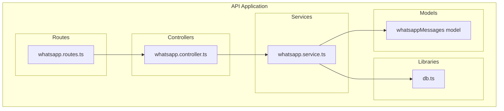
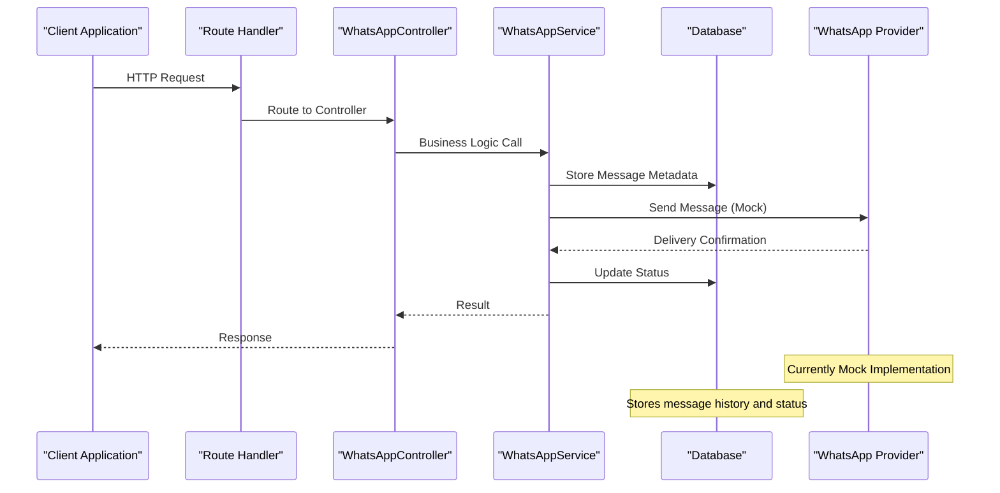
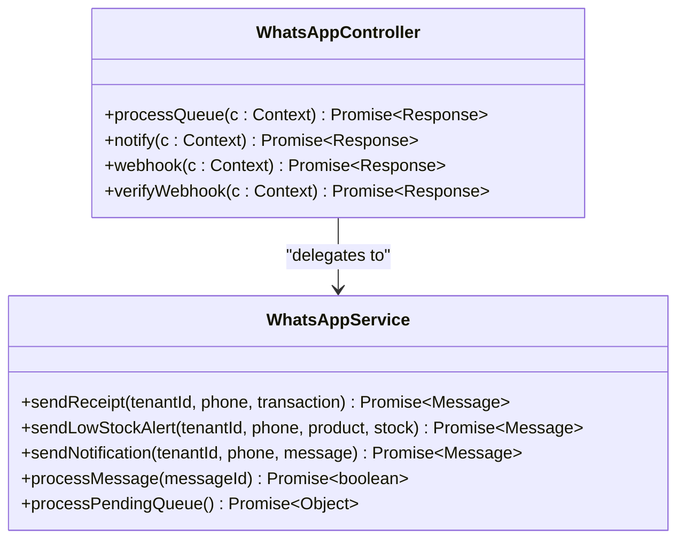
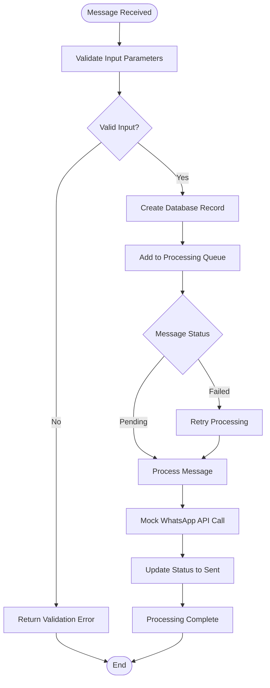
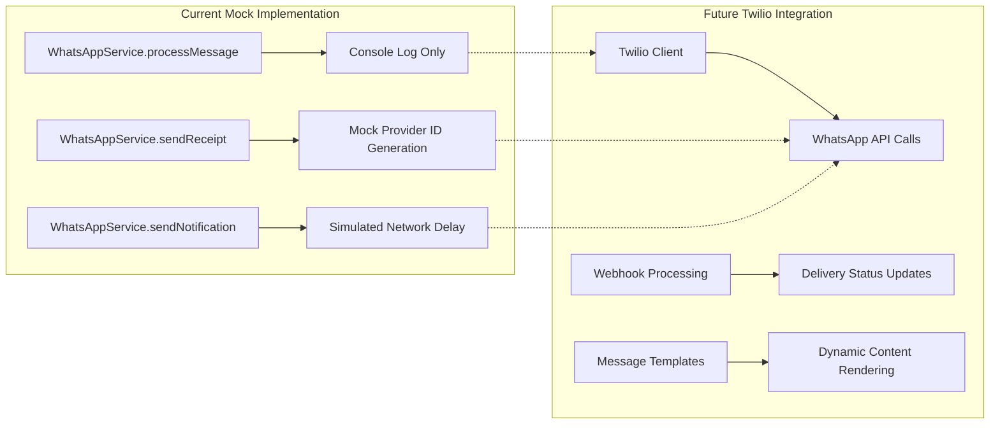
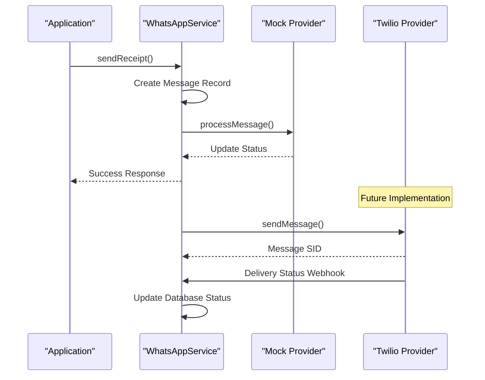
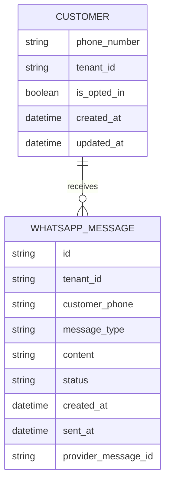
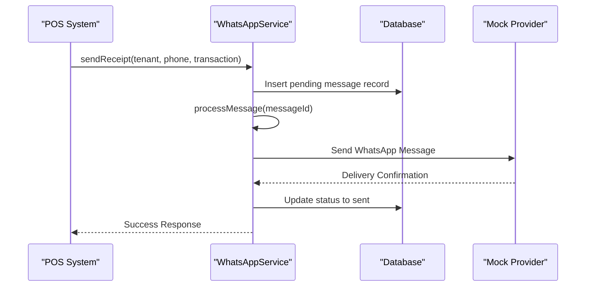
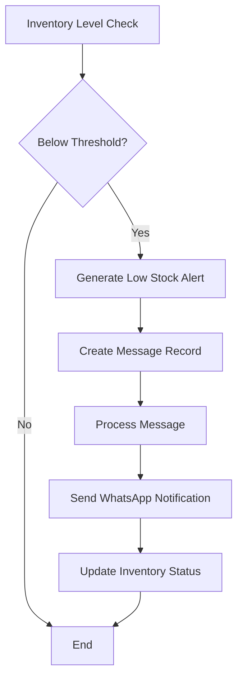
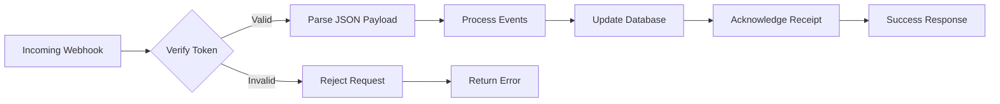

# WhatsApp Integration API

<cite>
**Referenced Files in This Document**
- [whatsapp.controller.ts](file://apps/api/src/controllers/whatsapp.controller.ts)
- [whatsapp.routes.ts](file://apps/api/src/routes/whatsapp.routes.ts)
- [whatsapp.service.ts](file://apps/api/src/services/whatsapp.service.ts)
- [db.ts](file://apps/api/src/lib/db.ts)
- [index.ts](file://apps/api/src/index.ts)
</cite>

## Table of Contents
1. [Introduction](#introduction)
2. [Project Structure](#project-structure)
3. [Core Components](#core-components)
4. [Architecture Overview](#architecture-overview)
5. [Detailed Component Analysis](#detailed-component-analysis)
6. [API Endpoints](#api-endpoints)
7. [Twilio WhatsApp Integration](#twilio-whatsapp-integration)
8. [Message Templates](#message-templates)
9. [Customer Management](#customer-management)
10. [Automated Workflows](#automated-workflows)
11. [Webhook Processing](#webhook-processing)
12. [Performance Considerations](#performance-considerations)
13. [Troubleshooting Guide](#troubleshooting-guide)
14. [Conclusion](#conclusion)

## Introduction

The WhatsApp Integration module provides automated messaging capabilities for the ARHAT POS system, enabling businesses to send receipts, notifications, and promotional messages to customers via WhatsApp Business API. This module currently implements mock functionality for demonstration purposes but is designed to integrate with external WhatsApp providers like Twilio.

The system supports three primary message types: receipt delivery, low stock alerts, and generic notifications. It includes a queuing mechanism for message processing, webhook handling for incoming messages, and comprehensive logging for monitoring and debugging.

## Project Structure

The WhatsApp Integration is organized within the API application following a clean architecture pattern with clear separation of concerns:



**Diagram sources**
- [whatsapp.controller.ts:1-71](file://apps/api/src/controllers/whatsapp.controller.ts#L1-L71)
- [whatsapp.service.ts:1-127](file://apps/api/src/services/whatsapp.service.ts#L1-L127)
- [whatsapp.routes.ts:1-17](file://apps/api/src/routes/whatsapp.routes.ts#L1-L17)

**Section sources**
- [whatsapp.controller.ts:1-71](file://apps/api/src/controllers/whatsapp.controller.ts#L1-L71)
- [whatsapp.service.ts:1-127](file://apps/api/src/services/whatsapp.service.ts#L1-L127)
- [whatsapp.routes.ts:1-17](file://apps/api/src/routes/whatsapp.routes.ts#L1-L17)

## Core Components

### WhatsApp Controller
The controller handles HTTP requests and coordinates between routes and services. It provides three main endpoints:
- Queue processing for pending messages
- Notification sending to customers
- Webhook handling for incoming messages

### WhatsApp Service
The service layer contains the core business logic for message processing, including:
- Receipt generation and sending
- Low stock alert notifications
- Generic customer notifications
- Message queuing and processing
- Status tracking and updates

### Database Integration
The system uses Drizzle ORM for database operations, storing message metadata, content, and status information in a structured format.

**Section sources**
- [whatsapp.controller.ts:4-71](file://apps/api/src/controllers/whatsapp.controller.ts#L4-L71)
- [whatsapp.service.ts:5-127](file://apps/api/src/services/whatsapp.service.ts#L5-L127)

## Architecture Overview

The WhatsApp Integration follows a layered architecture pattern with clear separation between presentation, business logic, and data access layers:



**Diagram sources**
- [whatsapp.routes.ts:1-17](file://apps/api/src/routes/whatsapp.routes.ts#L1-L17)
- [whatsapp.controller.ts:15-30](file://apps/api/src/controllers/whatsapp.controller.ts#L15-L30)
- [whatsapp.service.ts:81-105](file://apps/api/src/services/whatsapp.service.ts#L81-L105)

## Detailed Component Analysis

### WhatsApp Controller Analysis

The controller implements three primary methods for handling WhatsApp-related operations:

#### Process Queue Method
Handles manual triggering of message queue processing and cron job integration.

#### Notify Method
Processes customer notifications with tenant scoping and validation.

#### Webhook Methods
Supports both verification and message processing for incoming WhatsApp events.



**Diagram sources**
- [whatsapp.controller.ts:4-71](file://apps/api/src/controllers/whatsapp.controller.ts#L4-L71)
- [whatsapp.service.ts:5-127](file://apps/api/src/services/whatsapp.service.ts#L5-L127)

**Section sources**
- [whatsapp.controller.ts:4-71](file://apps/api/src/controllers/whatsapp.controller.ts#L4-L71)

### WhatsApp Service Analysis

The service layer implements comprehensive message processing logic:

#### Receipt Generation
Creates formatted receipt messages with transaction details including:
- Transaction number
- Total amount in local currency
- Payment method
- Customer acknowledgment

#### Low Stock Alerts
Monitors inventory levels and sends alerts when stock falls below threshold.

#### Message Processing Pipeline
Implements a robust queuing system with status tracking and retry logic.



**Diagram sources**
- [whatsapp.service.ts:8-36](file://apps/api/src/services/whatsapp.service.ts#L8-L36)
- [whatsapp.service.ts:81-105](file://apps/api/src/services/whatsapp.service.ts#L81-L105)

**Section sources**
- [whatsapp.service.ts:5-127](file://apps/api/src/services/whatsapp.service.ts#L5-L127)

## API Endpoints

### Current Available Endpoints

Based on the implementation, the following endpoints are currently available:

#### POST /api/whatsapp/process-queue
Manually triggers processing of pending WhatsApp messages in the queue.

**Request Body**: None
**Response**: `{ message: string, data: Object }`

#### GET /api/whatsapp/webhook
Verifies webhook subscription with Facebook/Meta WhatsApp Business API.

**Query Parameters**:
- `hub.mode`: Subscription mode
- `hub.verify_token`: Verification token
- `hub.challenge`: Challenge string

**Response**: Challenge string or error message

#### POST /api/whatsapp/webhook
Handles incoming webhook events from WhatsApp Business API.

**Request Body**: WhatsApp webhook payload
**Response**: `{ status: string }`

#### POST /api/whatsapp/notify
Sends generic notifications to customers.

**Request Body**:
```json
{
  "phone": "string",
  "message": "string",
  "tenantId": "string"
}
```

**Response**: `{ message: string, data: Object }`

**Section sources**
- [whatsapp.routes.ts:6-14](file://apps/api/src/routes/whatsapp.routes.ts#L6-L14)
- [whatsapp.controller.ts:54-70](file://apps/api/src/controllers/whatsapp.controller.ts#L54-L70)

## Twilio WhatsApp Integration

### Current Implementation Status

The WhatsApp Integration currently implements **mock functionality** for demonstration purposes. The service includes placeholder methods that simulate WhatsApp API calls:



**Diagram sources**
- [whatsapp.service.ts:81-105](file://apps/api/src/services/whatsapp.service.ts#L81-L105)

### Required Environment Configuration

For production Twilio integration, the following environment variables are required:

- `TWILIO_ACCOUNT_SID`: Twilio account identifier
- `TWILIO_AUTH_TOKEN`: Twilio authentication token
- `WHATSAPP_VERIFY_TOKEN`: Webhook verification token
- `TWILIO_WHATSAPP_NUMBER`: Business WhatsApp phone number

### Integration Pattern

The current mock implementation follows a pattern that can be easily adapted for Twilio:



**Diagram sources**
- [whatsapp.service.ts:8-36](file://apps/api/src/services/whatsapp.service.ts#L8-L36)
- [whatsapp.service.ts:81-105](file://apps/api/src/services/whatsapp.service.ts#L81-L105)

## Message Templates

### Receipt Template Structure

The system generates professional receipt messages with the following structure:

**Template Fields**:
- Customer greeting and acknowledgment
- Transaction identification
- Purchase summary with formatted amounts
- Payment method details
- Brand promotion message

### Notification Templates

#### Low Stock Alert Template
```
⚠️ *Peringatan Stok Tipis* ⚠️
Stok produk [Product Name] saat ini hanya tersisa [Quantity].
Segera lakukan restock!
```

#### Generic Notification Template
Customizable template supporting dynamic content insertion.

### Template Customization

Templates support:
- Dynamic content replacement
- Multi-language support
- Brand-specific formatting
- Responsive message structure

**Section sources**
- [whatsapp.service.ts:12-18](file://apps/api/src/services/whatsapp.service.ts#L12-L18)
- [whatsapp.service.ts:44](file://apps/api/src/services/whatsapp.service.ts#L44)

## Customer Management

### Opt-In/Opt-Out Management

The system includes mechanisms for managing customer communication preferences:

#### Tenant Scoping
Messages are scoped to specific tenants for multi-property management.

#### Phone Number Validation
Input validation ensures proper phone number formatting before sending.

#### Status Tracking
Comprehensive message status tracking including:
- Pending
- Sent
- Failed
- Delivered
- Read

### Customer Data Handling



**Diagram sources**
- [whatsapp.service.ts:21-29](file://apps/api/src/services/whatsapp.service.ts#L21-L29)

## Automated Workflows

### Receipt Delivery Workflow



**Diagram sources**
- [whatsapp.service.ts:9-36](file://apps/api/src/services/whatsapp.service.ts#L9-L36)
- [whatsapp.service.ts:81-105](file://apps/api/src/services/whatsapp.service.ts#L81-L105)

### Low Stock Alert Workflow



**Diagram sources**
- [whatsapp.service.ts:41-57](file://apps/api/src/services/whatsapp.service.ts#L41-L57)

## Webhook Processing

### Incoming Message Handling

The webhook system supports comprehensive message event processing:

#### Verification Process
- Validates webhook subscription requests
- Uses configurable verification tokens
- Supports Facebook/Meta webhook standards

#### Event Processing
- Handles delivery status updates
- Processes customer replies
- Manages message read receipts
- Logs all webhook activity

### Webhook Security



**Diagram sources**
- [whatsapp.controller.ts:32-52](file://apps/api/src/controllers/whatsapp.controller.ts#L32-L52)
- [whatsapp.controller.ts:54-70](file://apps/api/src/controllers/whatsapp.controller.ts#L54-L70)

**Section sources**
- [whatsapp.controller.ts:32-70](file://apps/api/src/controllers/whatsapp.controller.ts#L32-L70)

## Performance Considerations

### Queue Processing
- Processes up to 50 pending messages per batch
- Implements error isolation for individual message failures
- Provides progress reporting for monitoring

### Rate Limiting
- Built-in throttling through queue processing
- Configurable batch sizes for high-volume scenarios
- Retry logic with exponential backoff

### Database Optimization
- Efficient indexing on status and tenant fields
- Batch operations for queue processing
- Connection pooling for concurrent operations

## Troubleshooting Guide

### Common Issues

#### Message Not Sending
- Verify tenant ID and phone number formatting
- Check queue processing status
- Review database records for error messages

#### Webhook Verification Failures
- Confirm verification token matches environment variable
- Ensure proper HTTP response status codes
- Validate webhook URL configuration

#### Database Connection Issues
- Verify database credentials and connectivity
- Check table schema and migrations
- Monitor connection pool limits

### Logging and Monitoring

The system provides comprehensive logging:
- Request/response logging
- Error stack traces
- Message processing timestamps
- Status change audit trails

**Section sources**
- [whatsapp.controller.ts:10-12](file://apps/api/src/controllers/whatsapp.controller.ts#L10-L12)
- [whatsapp.service.ts:118-122](file://apps/api/src/services/whatsapp.service.ts#L118-L122)

## Conclusion

The WhatsApp Integration module provides a robust foundation for automated customer communication within the ARHAT POS ecosystem. While currently implementing mock functionality for demonstration, the architecture is designed to seamlessly integrate with production WhatsApp providers like Twilio.

Key strengths of the implementation include:
- Clean separation of concerns with dedicated controllers and services
- Comprehensive message queuing and processing system
- Flexible template system for various message types
- Robust webhook handling for real-time communication
- Tenant-scoped multi-property support

The modular design allows for easy extension to support additional features such as promotional messaging, customer service automation, and advanced analytics tracking.