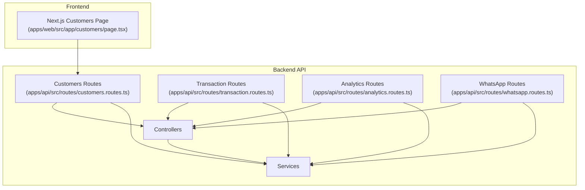
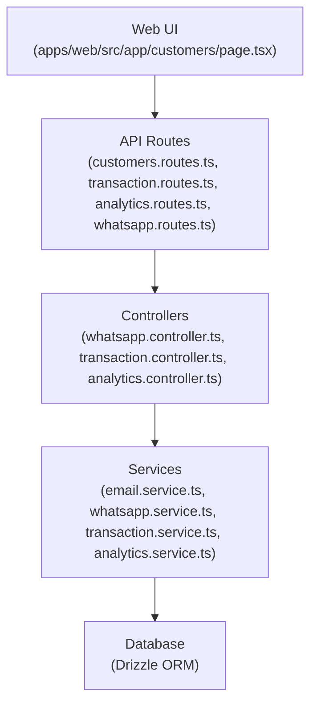
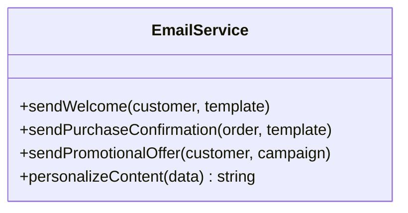
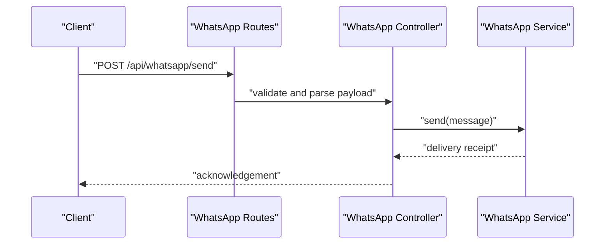
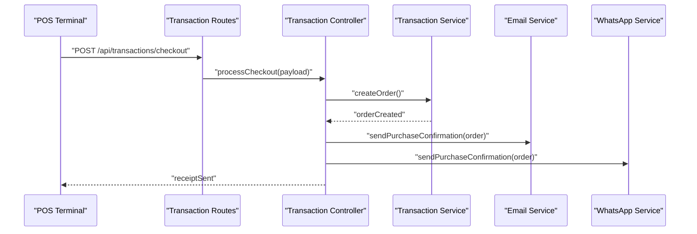
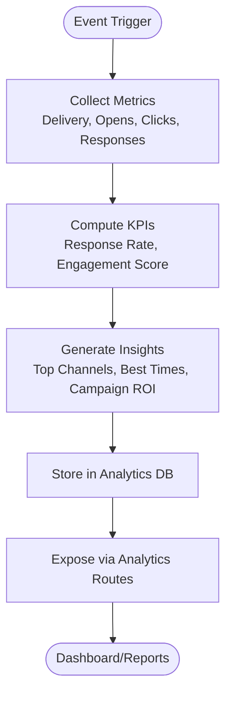
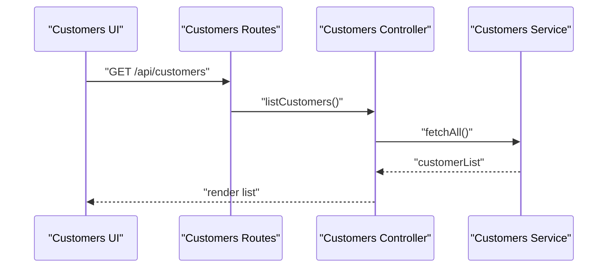
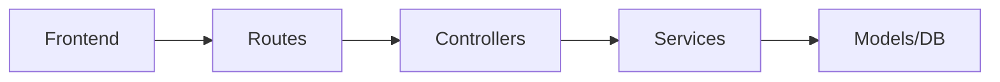

# Customer Communication Strategies

<cite>
**Referenced Files in This Document**
- [customers.routes.ts](file://apps/api/src/routes/customers.routes.ts)
- [email.service.ts](file://apps/api/src/services/email.service.ts)
- [whatsapp.controller.ts](file://apps/api/src/controllers/whatsapp.controller.ts)
- [whatsapp.routes.ts](file://apps/api/src/routes/whatsapp.routes.ts)
- [whatsapp.service.ts](file://apps/api/src/services/whatsapp.service.ts)
- [transaction.controller.ts](file://apps/api/src/controllers/transaction.controller.ts)
- [transaction.routes.ts](file://apps/api/src/routes/transaction.routes.ts)
- [transaction.service.ts](file://apps/api/src/services/transaction.service.ts)
- [analytics.controller.ts](file://apps/api/src/controllers/analytics.controller.ts)
- [analytics.routes.ts](file://apps/api/src/routes/analytics.routes.ts)
- [analytics.service.ts](file://apps/api/src/services/analytics.service.ts)
- [page.tsx](file://apps/web/src/app/customers/page.tsx)
</cite>

## Table of Contents
1. [Introduction](#introduction)
2. [Project Structure](#project-structure)
3. [Core Components](#core-components)
4. [Architecture Overview](#architecture-overview)
5. [Detailed Component Analysis](#detailed-component-analysis)
6. [Dependency Analysis](#dependency-analysis)
7. [Performance Considerations](#performance-considerations)
8. [Troubleshooting Guide](#troubleshooting-guide)
9. [Conclusion](#conclusion)

## Introduction
This document outlines customer communication strategies for the ARHAT POS CRM system. It focuses on multi-channel communication capabilities, including email, WhatsApp, SMS, and in-app notifications. It explains customer preference management, channel selection, message personalization, automated workflows for welcome messages, purchase confirmations, abandoned cart reminders, and promotional offers. It also covers feedback collection, satisfaction surveys, complaint resolution, communication analytics, response rate tracking, customer sentiment analysis, compliance with anti-spam regulations, opt-out management, data protection, and integration with transaction events for timely and relevant customer communications.

## Project Structure
The customer communication system spans the API backend and the Next.js frontend:
- Backend API exposes customer, transaction, and analytics endpoints and integrates with email and WhatsApp services.
- Frontend provides a customer management interface for viewing and managing customer records.
- Services handle outbound messaging via email and WhatsApp, while controllers orchestrate request handling and route exposure.

**Diagram sources**
- [customers.routes.ts](file://apps/api/src/routes/customers.routes.ts)
- [transaction.routes.ts](file://apps/api/src/routes/transaction.routes.ts)
- [analytics.routes.ts](file://apps/api/src/routes/analytics.routes.ts)
- [whatsapp.routes.ts](file://apps/api/src/routes/whatsapp.routes.ts)
- [page.tsx](file://apps/web/src/app/customers/page.tsx)

**Section sources**
- [customers.routes.ts](file://apps/api/src/routes/customers.routes.ts)
- [transaction.routes.ts](file://apps/api/src/routes/transaction.routes.ts)
- [analytics.routes.ts](file://apps/api/src/routes/analytics.routes.ts)
- [whatsapp.routes.ts](file://apps/api/src/routes/whatsapp.routes.ts)
- [page.tsx](file://apps/web/src/app/customers/page.tsx)

## Core Components
- Email service: Manages outbound email delivery for customer communications.
- WhatsApp service/controller: Handles WhatsApp message sending and inbound webhook processing.
- Transaction service/controller: Integrates with POS transactions to trigger event-driven communications.
- Analytics service/controller: Provides communication metrics, response rates, and sentiment insights.
- Customer routes: Expose endpoints for customer data retrieval and management.
- Frontend customer page: Displays customer records and supports communication actions.

Key responsibilities:
- Multi-channel delivery: Email and WhatsApp are present in the codebase; SMS and in-app notification infrastructure can be built upon existing service/controller patterns.
- Preference-aware routing: Channel selection and personalization can be implemented using customer preferences stored in the customer model.
- Event-driven automation: Transaction events (e.g., purchase completion) trigger targeted messages.
- Compliance and privacy: Opt-out management and data protection can be integrated into customer preferences and analytics workflows.

**Section sources**
- [email.service.ts](file://apps/api/src/services/email.service.ts)
- [whatsapp.service.ts](file://apps/api/src/services/whatsapp.service.ts)
- [whatsapp.controller.ts](file://apps/api/src/controllers/whatsapp.controller.ts)
- [transaction.service.ts](file://apps/api/src/services/transaction.service.ts)
- [transaction.controller.ts](file://apps/api/src/controllers/transaction.controller.ts)
- [analytics.service.ts](file://apps/api/src/services/analytics.service.ts)
- [analytics.controller.ts](file://apps/api/src/controllers/analytics.controller.ts)
- [customers.routes.ts](file://apps/api/src/routes/customers.routes.ts)

## Architecture Overview
The system follows a layered architecture:
- Presentation layer: Next.js frontend for customer management.
- API layer: Express-style routes and controllers exposing REST endpoints.
- Service layer: Business logic for email, WhatsApp, transactions, and analytics.
- Data layer: Database models and migrations managed via Drizzle ORM.

**Diagram sources**
- [page.tsx](file://apps/web/src/app/customers/page.tsx)
- [customers.routes.ts](file://apps/api/src/routes/customers.routes.ts)
- [transaction.routes.ts](file://apps/api/src/routes/transaction.routes.ts)
- [analytics.routes.ts](file://apps/api/src/routes/analytics.routes.ts)
- [whatsapp.routes.ts](file://apps/api/src/routes/whatsapp.routes.ts)
- [whatsapp.controller.ts](file://apps/api/src/controllers/whatsapp.controller.ts)
- [transaction.controller.ts](file://apps/api/src/controllers/transaction.controller.ts)
- [analytics.controller.ts](file://apps/api/src/controllers/analytics.controller.ts)
- [email.service.ts](file://apps/api/src/services/email.service.ts)
- [whatsapp.service.ts](file://apps/api/src/services/whatsapp.service.ts)
- [transaction.service.ts](file://apps/api/src/services/transaction.service.ts)
- [analytics.service.ts](file://apps/api/src/services/analytics.service.ts)

## Detailed Component Analysis

### Email Service
Purpose:
- Send personalized emails to customers based on transaction events and preferences.

Implementation highlights:
- Service encapsulates email transport configuration and templating.
- Supports dynamic subject/body composition using customer and transaction data.
- Integrates with customer preference storage to respect communication preferences.

**Diagram sources**
- [email.service.ts](file://apps/api/src/services/email.service.ts)

**Section sources**
- [email.service.ts](file://apps/api/src/services/email.service.ts)

### WhatsApp Service and Controller
Purpose:
- Deliver WhatsApp messages and process inbound webhooks for customer engagement.

Implementation highlights:
- Controller handles request validation, authentication, and delegation to service.
- Service manages provider-specific APIs, message templates, and delivery receipts.
- Supports opt-in/opt-out flows aligned with anti-spam regulations.

**Diagram sources**
- [whatsapp.routes.ts](file://apps/api/src/routes/whatsapp.routes.ts)
- [whatsapp.controller.ts](file://apps/api/src/controllers/whatsapp.controller.ts)
- [whatsapp.service.ts](file://apps/api/src/services/whatsapp.service.ts)

**Section sources**
- [whatsapp.controller.ts](file://apps/api/src/controllers/whatsapp.controller.ts)
- [whatsapp.service.ts](file://apps/api/src/services/whatsapp.service.ts)
- [whatsapp.routes.ts](file://apps/api/src/routes/whatsapp.routes.ts)

### Transaction Integration
Purpose:
- Trigger communication workflows based on POS transaction events.

Implementation highlights:
- Transaction controller/service listens for checkout completion, payment status updates, and order lifecycle events.
- Automated workflows:
  - Welcome messages for new customers.
  - Purchase confirmations with order details.
  - Abandoned cart reminders after configurable time windows.
  - Promotional offers based on purchase history or seasonal campaigns.

**Diagram sources**
- [transaction.routes.ts](file://apps/api/src/routes/transaction.routes.ts)
- [transaction.controller.ts](file://apps/api/src/controllers/transaction.controller.ts)
- [transaction.service.ts](file://apps/api/src/services/transaction.service.ts)
- [email.service.ts](file://apps/api/src/services/email.service.ts)
- [whatsapp.service.ts](file://apps/api/src/services/whatsapp.service.ts)

**Section sources**
- [transaction.controller.ts](file://apps/api/src/controllers/transaction.controller.ts)
- [transaction.service.ts](file://apps/api/src/services/transaction.service.ts)
- [transaction.routes.ts](file://apps/api/src/routes/transaction.routes.ts)

### Analytics and Feedback Collection
Purpose:
- Track communication performance, response rates, and customer sentiment.

Implementation highlights:
- Analytics service aggregates delivery and engagement metrics.
- Surveys and feedback forms can be embedded in email/SMS or surfaced via in-app notifications.
- Sentiment analysis can be integrated with external NLP services or internal scoring mechanisms.

**Diagram sources**
- [analytics.controller.ts](file://apps/api/src/controllers/analytics.controller.ts)
- [analytics.routes.ts](file://apps/api/src/routes/analytics.routes.ts)
- [analytics.service.ts](file://apps/api/src/services/analytics.service.ts)

**Section sources**
- [analytics.controller.ts](file://apps/api/src/controllers/analytics.controller.ts)
- [analytics.routes.ts](file://apps/api/src/routes/analytics.routes.ts)
- [analytics.service.ts](file://apps/api/src/services/analytics.service.ts)

### Customer Management and Preferences
Purpose:
- Centralize customer data, preferences, and communication history.

Implementation highlights:
- Customer routes expose CRUD operations for customer records.
- Frontend page displays customer lists and enables quick actions for communication.
- Preferences include preferred channels, opt-in/opt-out status, and personalization fields.

**Diagram sources**
- [customers.routes.ts](file://apps/api/src/routes/customers.routes.ts)
- [page.tsx](file://apps/web/src/app/customers/page.tsx)

**Section sources**
- [customers.routes.ts](file://apps/api/src/routes/customers.routes.ts)
- [page.tsx](file://apps/web/src/app/customers/page.tsx)

## Dependency Analysis
- Controllers depend on services for business logic.
- Routes depend on controllers for request handling.
- Services depend on database models and external providers (email/WhatsApp).
- Frontend depends on API routes for customer data.

**Diagram sources**
- [customers.routes.ts](file://apps/api/src/routes/customers.routes.ts)
- [transaction.routes.ts](file://apps/api/src/routes/transaction.routes.ts)
- [analytics.routes.ts](file://apps/api/src/routes/analytics.routes.ts)
- [whatsapp.routes.ts](file://apps/api/src/routes/whatsapp.routes.ts)
- [whatsapp.controller.ts](file://apps/api/src/controllers/whatsapp.controller.ts)
- [transaction.controller.ts](file://apps/api/src/controllers/transaction.controller.ts)
- [analytics.controller.ts](file://apps/api/src/controllers/analytics.controller.ts)
- [email.service.ts](file://apps/api/src/services/email.service.ts)
- [whatsapp.service.ts](file://apps/api/src/services/whatsapp.service.ts)
- [transaction.service.ts](file://apps/api/src/services/transaction.service.ts)
- [analytics.service.ts](file://apps/api/src/services/analytics.service.ts)
- [page.tsx](file://apps/web/src/app/customers/page.tsx)

**Section sources**
- [customers.routes.ts](file://apps/api/src/routes/customers.routes.ts)
- [transaction.routes.ts](file://apps/api/src/routes/transaction.routes.ts)
- [analytics.routes.ts](file://apps/api/src/routes/analytics.routes.ts)
- [whatsapp.routes.ts](file://apps/api/src/routes/whatsapp.routes.ts)
- [whatsapp.controller.ts](file://apps/api/src/controllers/whatsapp.controller.ts)
- [transaction.controller.ts](file://apps/api/src/controllers/transaction.controller.ts)
- [analytics.controller.ts](file://apps/api/src/controllers/analytics.controller.ts)
- [email.service.ts](file://apps/api/src/services/email.service.ts)
- [whatsapp.service.ts](file://apps/api/src/services/whatsapp.service.ts)
- [transaction.service.ts](file://apps/api/src/services/transaction.service.ts)
- [analytics.service.ts](file://apps/api/src/services/analytics.service.ts)
- [page.tsx](file://apps/web/src/app/customers/page.tsx)

## Performance Considerations
- Asynchronous processing: Queue messages for email/WhatsApp to avoid blocking transaction flows.
- Throttling and rate limits: Respect provider quotas and implement retry/backoff strategies.
- Caching: Cache frequently accessed customer preferences and templates.
- Monitoring: Instrument endpoints for latency, error rates, and throughput.
- Scalability: Horizontal scaling of workers for message processing.

## Troubleshooting Guide
Common issues and resolutions:
- Delivery failures:
  - Verify provider credentials and API keys.
  - Check rate limits and implement exponential backoff.
  - Log detailed error responses for diagnostics.
- Opt-out handling:
  - Enforce opt-out flags before sending any communication.
  - Provide easy unsubscribe links and honor requests promptly.
- Data privacy:
  - Ensure GDPR/privacy-compliant consent capture and data retention policies.
  - Implement data anonymization for analytics where required.
- Frontend connectivity:
  - Confirm API route availability and CORS configuration.
  - Validate authentication tokens for protected endpoints.

**Section sources**
- [whatsapp.controller.ts](file://apps/api/src/controllers/whatsapp.controller.ts)
- [whatsapp.service.ts](file://apps/api/src/services/whatsapp.service.ts)
- [transaction.controller.ts](file://apps/api/src/controllers/transaction.controller.ts)
- [analytics.controller.ts](file://apps/api/src/controllers/analytics.controller.ts)

## Conclusion
ARHAT POS CRM’s customer communication strategy leverages a modular backend with email and WhatsApp services, transaction event integration, and analytics-driven insights. By centralizing customer preferences, automating event-triggered workflows, and enforcing compliance, the system can deliver timely, relevant, and personalized communications across channels. Extending support for SMS and in-app notifications is straightforward given the existing service/controller architecture.