# Customer Profile Management

<cite>
**Referenced Files in This Document**
- [PRD.md](file://PRD/PRD.md)
- [customers.routes.ts](file://apps/api/src/routes/customers.routes.ts)
- [customers.routes.js](file://apps/api/src/routes/customers.routes.js)
- [index.ts](file://apps/api/src/models/index.ts)
- [api.ts](file://apps/web/src/lib/api.ts)
- [CartPanel.tsx](file://apps/web/src/components/pos/CartPanel.tsx)
- [page.tsx](file://apps/web/src/app/customers/page.tsx)
- [0003_tearful_supernaut.sql](file://apps/api/migrations/0003_tearful_supernaut.sql)
- [0000_snapshot.json](file://apps/api/drizzle/meta/0000_snapshot.json)
- [0003_snapshot.json](file://apps/api/migrations/meta/0003_snapshot.json)
</cite>

## Table of Contents
1. [Introduction](#introduction)
2. [Project Structure](#project-structure)
3. [Core Components](#core-components)
4. [Architecture Overview](#architecture-overview)
5. [Detailed Component Analysis](#detailed-component-analysis)
6. [Dependency Analysis](#dependency-analysis)
7. [Performance Considerations](#performance-considerations)
8. [Troubleshooting Guide](#troubleshooting-guide)
9. [Conclusion](#conclusion)
10. [Appendices](#appendices)

## Introduction
This document describes customer profile management in the ARHAT POS CRM system. It covers customer registration and onboarding workflows, data fields, segmentation strategies, search and filtering, duplicate detection, validation rules, editing/updating profiles, privacy controls, import/export capabilities, external database integrations, lifecycle stages, and automated classification based on purchase behavior. The content is derived from the repository's API routes, frontend integration, PRD specifications, and database schema.

## Project Structure
Customer profile management spans three primary areas:
- Backend API routes for CRUD operations and transaction linkage
- Frontend integration for customer selection during POS checkout and listing
- Database schema supporting customer profiles, optional loyalty, segments, and notes

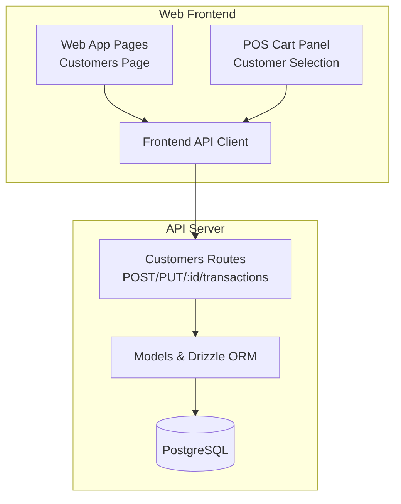

**Diagram sources**
- [api.ts:414-493](file://apps/web/src/lib/api.ts#L414-L493)
- [customers.routes.ts:50-92](file://apps/api/src/routes/customers.routes.ts#L50-L92)
- [index.ts:104-117](file://apps/api/src/models/index.ts#L104-L117)

**Section sources**
- [api.ts:414-493](file://apps/web/src/lib/api.ts#L414-L493)
- [customers.routes.ts:50-92](file://apps/api/src/routes/customers.routes.ts#L50-L92)
- [index.ts:104-117](file://apps/api/src/models/index.ts#L104-L117)

## Core Components
- Customer entity model with tenant scoping, contact info, points, spending, and audit timestamps
- API endpoints for creating, updating, retrieving customer profiles, and fetching recent transactions
- Frontend integration enabling customer selection in POS and listing via search
- Offline caching and fallback for customer listings
- Transaction association to compute purchase behavior and support segmentation/classification

Key implementation references:
- Model definition and indexes: [index.ts:104-117](file://apps/api/src/models/index.ts#L104-L117)
- API routes: [customers.routes.ts:50-92](file://apps/api/src/routes/customers.routes.ts#L50-L92)
- Frontend API client: [api.ts:414-493](file://apps/web/src/lib/api.ts#L414-L493)
- POS customer selection: [CartPanel.tsx:167-187](file://apps/web/src/components/pos/CartPanel.tsx#L167-L187)

**Section sources**
- [index.ts:104-117](file://apps/api/src/models/index.ts#L104-L117)
- [customers.routes.ts:50-92](file://apps/api/src/routes/customers.routes.ts#L50-L92)
- [api.ts:414-493](file://apps/web/src/lib/api.ts#L414-L493)
- [CartPanel.tsx:167-187](file://apps/web/src/components/pos/CartPanel.tsx#L167-L187)

## Architecture Overview
The customer profile system integrates frontend UX with backend APIs and persistent storage. The flow below illustrates the end-to-end process for customer creation and retrieval.

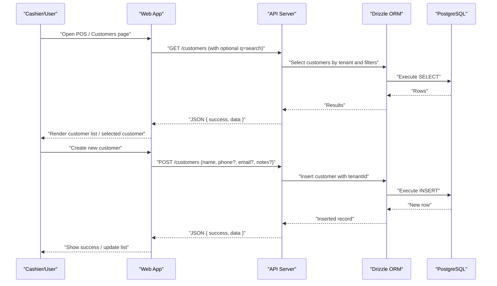

**Diagram sources**
- [api.ts:414-493](file://apps/web/src/lib/api.ts#L414-L493)
- [customers.routes.ts:50-92](file://apps/api/src/routes/customers.routes.ts#L50-L92)
- [index.ts:104-117](file://apps/api/src/models/index.ts#L104-L117)

## Detailed Component Analysis

### Customer Entity and Data Model
The customer entity stores essential identifiers and attributes:
- Identifiers: id, tenantId
- Personal: name
- Contact: phone, email
- Loyalty/spending: points, totalSpent
- Administrative: notes, timestamps
- Index: phone for efficient lookups

Schema references:
- Model fields and index: [index.ts:104-117](file://apps/api/src/models/index.ts#L104-L117)
- Migration snapshot (field definitions): [0003_snapshot.json:99-153](file://apps/api/migrations/meta/0003_snapshot.json#L99-L153)

Validation and constraints:
- Name is required
- Phone and email are optional
- Points and totalSpent default to zero
- Created/updated timestamps auto-populate

**Section sources**
- [index.ts:104-117](file://apps/api/src/models/index.ts#L104-L117)
- [0003_snapshot.json:99-153](file://apps/api/migrations/meta/0003_snapshot.json#L99-L153)

### Customer Registration and Onboarding Workflow
End-to-end flow:
1. User submits customer registration form (name, optional phone/email/notes)
2. Frontend posts to API endpoint
3. API validates tenant context and inserts customer
4. Response returns the created customer record

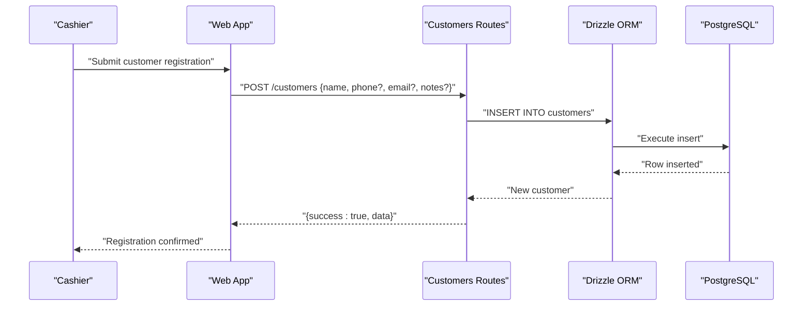

**Diagram sources**
- [api.ts:440-449](file://apps/web/src/lib/api.ts#L440-L449)
- [customers.routes.ts:50-64](file://apps/api/src/routes/customers.routes.ts#L50-L64)

**Section sources**
- [api.ts:440-449](file://apps/web/src/lib/api.ts#L440-L449)
- [customers.routes.ts:50-64](file://apps/api/src/routes/customers.routes.ts#L50-L64)

### Customer Search, Filtering, and Duplicate Detection
- Search capability: GET /customers with optional query parameter q=searchTerm
- Frontend fallback: When network fails, search within cached customer list by name or phone substring
- Index on phone field supports efficient phone-based lookup

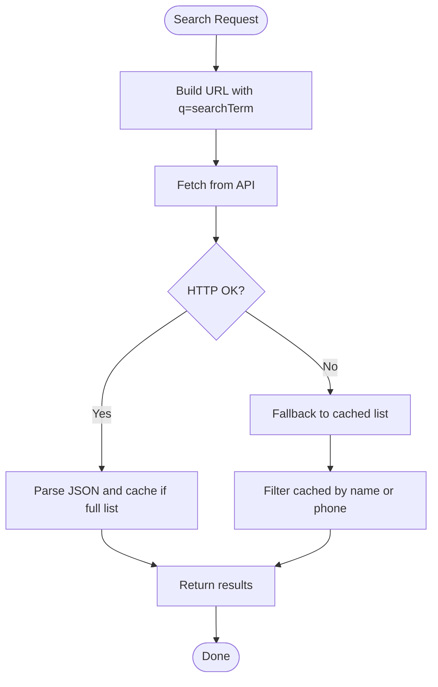

**Diagram sources**
- [api.ts:418-438](file://apps/web/src/lib/api.ts#L418-L438)

**Section sources**
- [api.ts:418-438](file://apps/web/src/lib/api.ts#L418-L438)
- [index.ts:115-117](file://apps/api/src/models/index.ts#L115-L117)

### Customer Profile Editing and Updates
- PUT /customers/:id updates name, phone, email, notes
- Tenant ownership verification prevents cross-tenant edits
- Updated timestamp is refreshed automatically

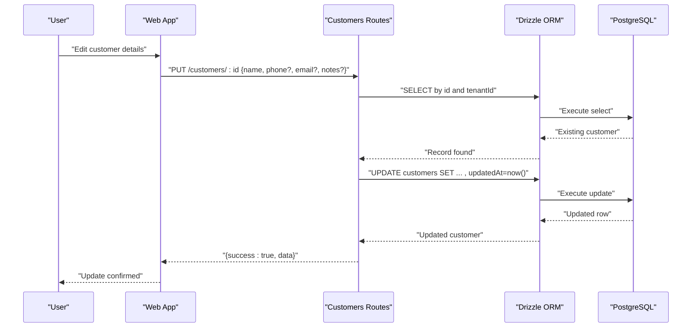

**Diagram sources**
- [api.ts:451-460](file://apps/web/src/lib/api.ts#L451-L460)
- [customers.routes.ts:66-87](file://apps/api/src/routes/customers.routes.ts#L66-L87)

**Section sources**
- [api.ts:451-460](file://apps/web/src/lib/api.ts#L451-L460)
- [customers.routes.ts:66-87](file://apps/api/src/routes/customers.routes.ts#L66-L87)

### Customer Transaction History and Purchase Behavior
- Endpoint GET /customers/:id/transactions returns recent completed transactions for the customer under the current tenant
- Used to derive purchase behavior for segmentation/classification

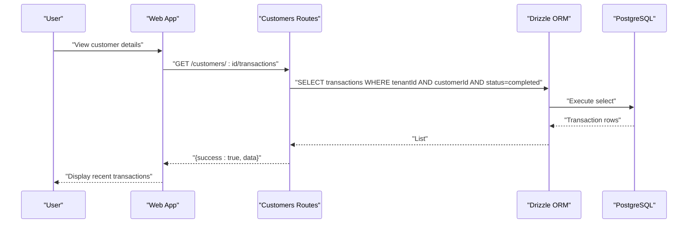

**Diagram sources**
- [api.ts:462-469](file://apps/web/src/lib/api.ts#L462-L469)
- [customers.routes.ts:89-92](file://apps/api/src/routes/customers.routes.ts#L89-L92)

**Section sources**
- [api.ts:462-469](file://apps/web/src/lib/api.ts#L462-L469)
- [customers.routes.ts:89-92](file://apps/api/src/routes/customers.routes.ts#L89-L92)

### Customer Segmentation Strategies
Based on PRD, segmentation is designed around behavioral rules:
- Frequency of purchases
- Total amount spent
- Recency of last purchase
- Manual segment creation with dynamic rules
- Segment membership tracking

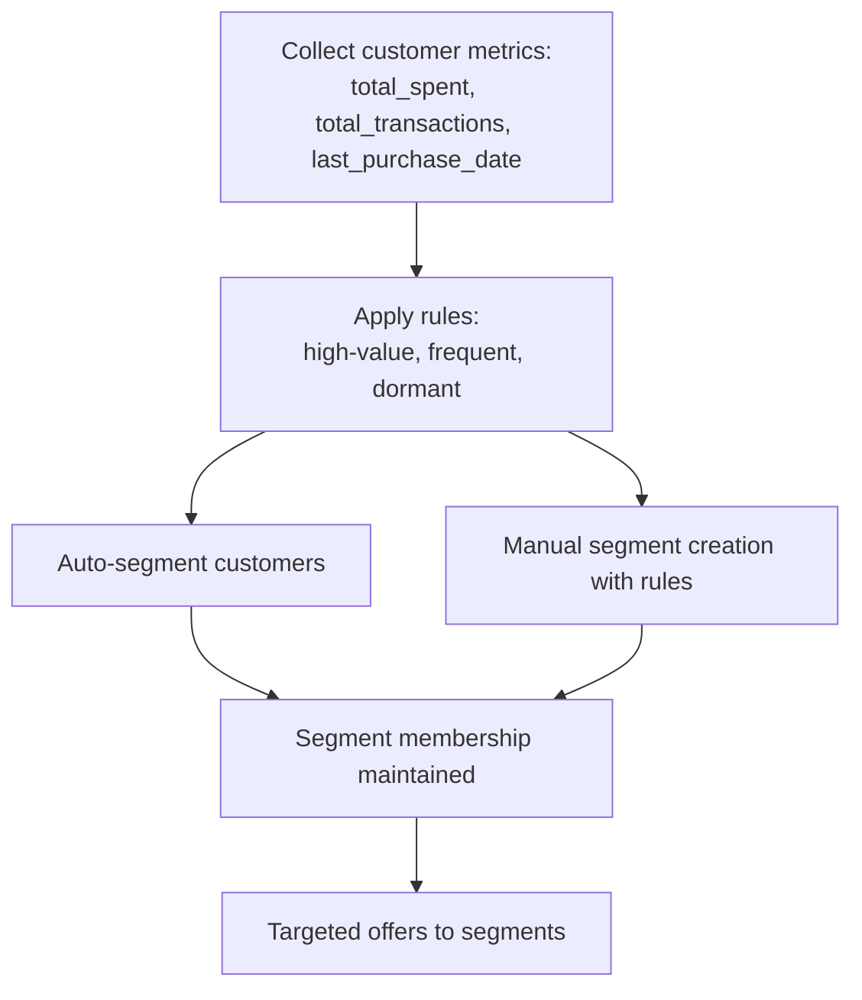

**Diagram sources**
- [PRD.md:940-952](file://PRD/PRD.md#L940-L952)

**Section sources**
- [PRD.md:940-952](file://PRD/PRD.md#L940-L952)

### Automated Customer Classification and Loyalty Program
PRD defines:
- Loyalty points: 1 point per Rupiah spent
- Tiered membership: Silver, Gold, Platinum
- Automatic tier upgrades based on thresholds
- Notes and preferences for personalized service

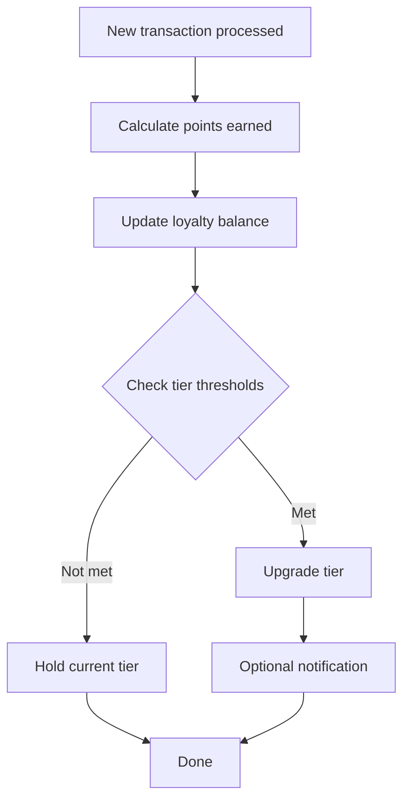

**Diagram sources**
- [PRD.md:954-966](file://PRD/PRD.md#L954-L966)

**Section sources**
- [PRD.md:954-966](file://PRD/PRD.md#L954-L966)

### Customer Lifecycle Stages
PRD outlines lifecycle stages:
- Registration (new customer)
- Onboarding (initial purchase, preference capture)
- Active (frequent, high-value)
- At-risk (dormant)
- Recovery (targeted campaigns)

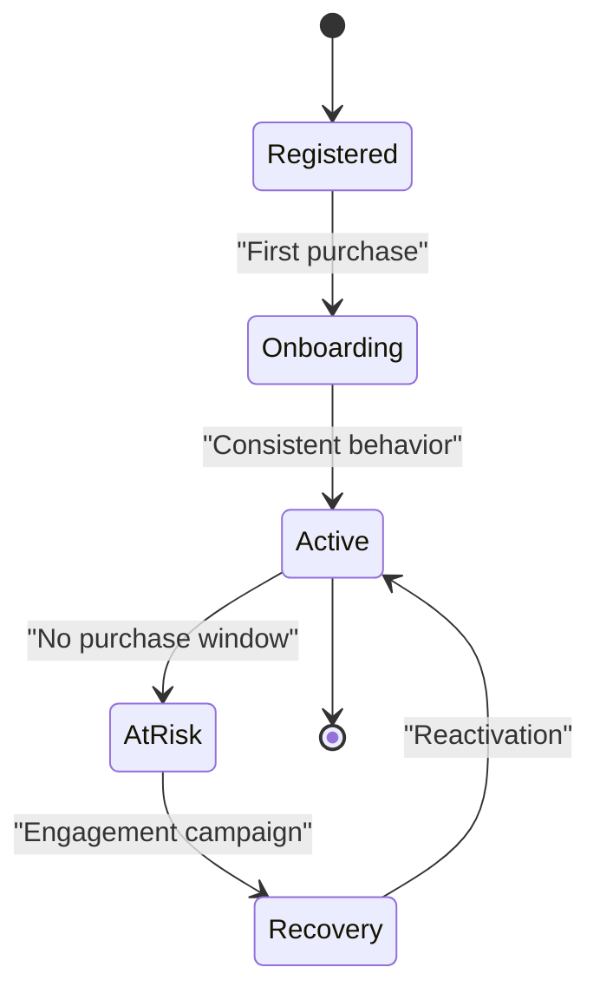

**Diagram sources**
- [PRD.md:926-938](file://PRD/PRD.md#L926-L938)

**Section sources**
- [PRD.md:926-938](file://PRD/PRD.md#L926-L938)

### Data Privacy Controls
- Tenant scoping ensures isolation between organizations
- Ownership checks on reads/writes prevent unauthorized access
- Internal notes and preferences are stored per customer and can be restricted by role

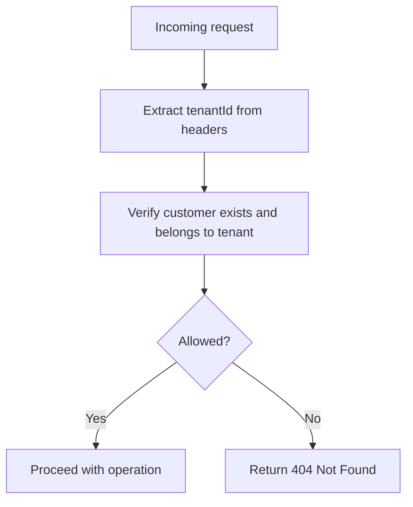

**Diagram sources**
- [customers.routes.ts:72-76](file://apps/api/src/routes/customers.routes.ts#L72-L76)

**Section sources**
- [customers.routes.ts:72-76](file://apps/api/src/routes/customers.routes.ts#L72-L76)

### Import/Export and External Database Integration
- Import/export capabilities are not present in the current API routes
- External database integration would require:
  - Bulk import endpoints
  - Conflict resolution (by phone/email or unique ID)
  - Synchronization jobs
  - GDPR-compliant anonymization/removal hooks

Current limitations:
- No explicit endpoints for bulk operations
- No duplicate detection logic in routes
- No export endpoints for customer data

Recommendations:
- Add CSV upload endpoint for customer bulk import
- Implement de-duplication by phone/email with conflict resolution UI
- Provide CSV export of customer lists and transaction histories
- Add webhook or scheduled sync for external CRMs

**Section sources**
- [customers.routes.ts:50-92](file://apps/api/src/routes/customers.routes.ts#L50-L92)
- [api.ts:414-493](file://apps/web/src/lib/api.ts#L414-L493)

## Dependency Analysis
The customer module depends on:
- Drizzle ORM for database abstraction
- PostgreSQL for persistence
- Frontend API client for HTTP communication
- POS UI for customer selection

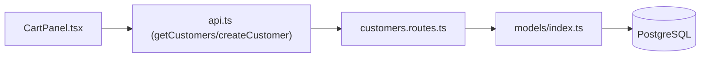

**Diagram sources**
- [CartPanel.tsx:167-187](file://apps/web/src/components/pos/CartPanel.tsx#L167-L187)
- [api.ts:414-493](file://apps/web/src/lib/api.ts#L414-L493)
- [customers.routes.ts:50-92](file://apps/api/src/routes/customers.routes.ts#L50-L92)
- [index.ts:104-117](file://apps/api/src/models/index.ts#L104-L117)

**Section sources**
- [CartPanel.tsx:167-187](file://apps/web/src/components/pos/CartPanel.tsx#L167-L187)
- [api.ts:414-493](file://apps/web/src/lib/api.ts#L414-L493)
- [customers.routes.ts:50-92](file://apps/api/src/routes/customers.routes.ts#L50-L92)
- [index.ts:104-117](file://apps/api/src/models/index.ts#L104-L117)

## Performance Considerations
- Use the phone index for fast lookups when searching by phone number
- Cache full customer lists locally and filter client-side for quick search fallback
- Limit transaction history queries to recent entries to avoid heavy scans
- Batch updates for bulk operations when adding import/export support

## Troubleshooting Guide
Common issues and resolutions:
- Network failure during customer fetch: The frontend falls back to cached data and filters by name or phone substring
- Unauthorized access attempts: Tenant ownership verification returns 404 Not Found
- Missing customer data: Ensure required fields are populated and optional fields validated before submission

**Section sources**
- [api.ts:418-438](file://apps/web/src/lib/api.ts#L418-L438)
- [customers.routes.ts:72-76](file://apps/api/src/routes/customers.routes.ts#L72-L76)

## Conclusion
The ARHAT POS CRM currently provides robust customer registration, search, editing, and transaction history retrieval with tenant scoping and offline caching. The PRD outlines advanced capabilities such as segmentation, loyalty tiers, and lifecycle management that align with the existing customer and transaction data. To meet enterprise needs, future enhancements should include import/export, duplicate detection, and external integration points while maintaining strong privacy and performance characteristics.

## Appendices

### Customer Data Fields Reference
- id: Unique identifier
- tenantId: Tenant scoping
- name: Required
- phone: Optional, indexed
- email: Optional
- points: Loyalty points (default 0)
- totalSpent: Total amount spent (default 0)
- notes: Internal notes
- createdAt/updatedAt: Audit timestamps

**Section sources**
- [index.ts:104-117](file://apps/api/src/models/index.ts#L104-L117)
- [0003_snapshot.json:99-153](file://apps/api/migrations/meta/0003_snapshot.json#L99-L153)

### API Endpoints Summary
- GET /customers?q=searchTerm
- POST /customers
- PUT /customers/:id
- GET /customers/:id/transactions

**Section sources**
- [api.ts:414-493](file://apps/web/src/lib/api.ts#L414-L493)
- [customers.routes.ts:50-92](file://apps/api/src/routes/customers.routes.ts#L50-L92)