# Customer Relationship Management

<cite>
**Referenced Files in This Document**
- [PRD.md](file://PRD/PRD.md)
- [README.md](file://README.md)
- [customers.routes.ts](file://apps/api/src/routes/customers.routes.ts)
- [customers.routes.js](file://apps/api/src/routes/customers.routes.js)
- [whatsapp.controller.ts](file://apps/api/src/controllers/whatsapp.controller.ts)
- [whatsapp.controller.js](file://apps/api/src/controllers/whatsapp.controller.js)
- [whatsapp.service.ts](file://apps/api/src/services/whatsapp.service.ts)
- [whatsapp.service.js](file://apps/api/src/services/whatsapp.service.js)
- [transaction.service.ts](file://apps/api/src/services/transaction.service.ts)
- [transaction.service.js](file://apps/api/src/services/transaction.service.js)
- [analytics.service.ts](file://apps/api/src/services/analytics.service.ts)
- [analytics.service.js](file://apps/api/src/services/analytics.service.js)
- [CartPanel.tsx](file://apps/web/src/components/pos/CartPanel.tsx)
- [page.tsx](file://apps/web/src/app/customers/page.tsx)
- [0000_dashing_albert_cleary.sql](file://apps/api/drizzle/0000_dashing_albert_cleary.sql)
- [001_initial_setup.sql](file://apps/api/migrations/001_initial_setup.sql)
- [0000_snapshot.json](file://apps/api/drizzle/meta/0000_snapshot.json)
- [0003_snapshot.json](file://apps/api/migrations/meta/0003_snapshot.json)
</cite>

## Table of Contents
1. [Introduction](#introduction)
2. [Project Structure](#project-structure)
3. [Core Components](#core-components)
4. [Architecture Overview](#architecture-overview)
5. [Detailed Component Analysis](#detailed-component-analysis)
6. [Dependency Analysis](#dependency-analysis)
7. [Performance Considerations](#performance-considerations)
8. [Troubleshooting Guide](#troubleshooting-guide)
9. [Conclusion](#conclusion)
10. [Appendices](#appendices)

## Introduction
This document provides comprehensive Customer Relationship Management (CRM) documentation for the ARHAT POS customer management system. It covers customer profile management, purchase history tracking, transaction analysis, WhatsApp integration for automated receipts and notifications, customer notes and communication history, loyalty program mechanics, segmentation, retention strategies, and POS integration. Privacy and consent considerations are addressed alongside practical workflows for onboarding and transaction linkage.

## Project Structure
The CRM functionality spans backend API routes and services, frontend pages and POS components, and database schemas/migrations. Key areas include:
- Customer management routes and services
- WhatsApp webhook verification and message processing
- Transaction service for purchase history and loyalty point calculation
- Analytics service for customer insights
- Frontend customer list and POS customer selection
- Database schema snapshots and initial migrations

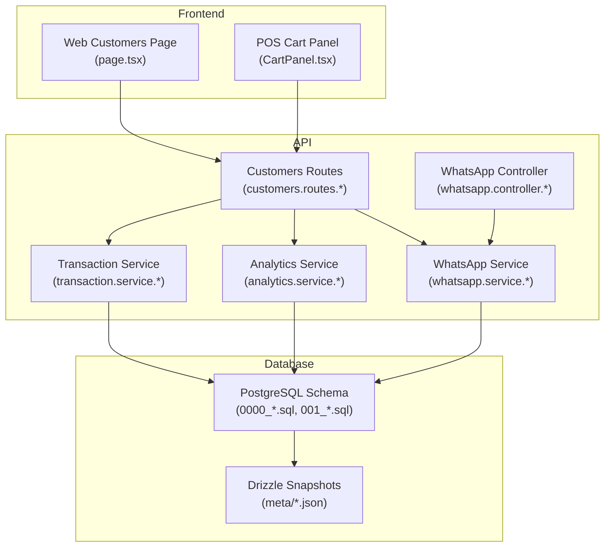

**Diagram sources**
- [customers.routes.ts](file://apps/api/src/routes/customers.routes.ts)
- [whatsapp.controller.ts](file://apps/api/src/controllers/whatsapp.controller.ts)
- [whatsapp.service.ts](file://apps/api/src/services/whatsapp.service.ts)
- [transaction.service.ts](file://apps/api/src/services/transaction.service.ts)
- [analytics.service.ts](file://apps/api/src/services/analytics.service.ts)
- [page.tsx](file://apps/web/src/app/customers/page.tsx)
- [CartPanel.tsx](file://apps/web/src/components/pos/CartPanel.tsx)
- [0000_dashing_albert_cleary.sql](file://apps/api/drizzle/0000_dashing_albert_cleary.sql)
- [001_initial_setup.sql](file://apps/api/migrations/001_initial_setup.sql)
- [0000_snapshot.json](file://apps/api/drizzle/meta/0000_snapshot.json)

**Section sources**
- [README.md:238-262](file://README.md#L238-L262)
- [PRD.md:981-1021](file://PRD/PRD.md#L981-L1021)

## Core Components
- Customer Profile Management: CRUD endpoints, quick search by phone, purchase history retrieval, and segmentation membership.
- Purchase History and Transaction Analysis: Transaction service computes points, updates totals, and integrates with analytics for top customers and retention metrics.
- WhatsApp Integration: Webhook verification, receipt and notification sending, and mock message processing.
- Customer Notes and Communication History: Notes stored per customer with creation metadata.
- Loyalty Program: Points balances, tier levels, and transaction records with redemption and tier bonuses.
- Segmentation: Dynamic segment rules and membership tracking.
- POS Integration: Customer selection in POS, optional points redemption during checkout.

**Section sources**
- [PRD.md:981-1089](file://PRD/PRD.md#L981-L1089)
- [customers.routes.ts](file://apps/api/src/routes/customers.routes.ts)
- [customers.routes.js](file://apps/api/src/routes/customers.routes.js)
- [transaction.service.ts](file://apps/api/src/services/transaction.service.ts)
- [transaction.service.js](file://apps/api/src/services/transaction.service.js)
- [analytics.service.ts](file://apps/api/src/services/analytics.service.ts)
- [analytics.service.js](file://apps/api/src/services/analytics.service.js)
- [whatsapp.controller.ts](file://apps/api/src/controllers/whatsapp.controller.ts)
- [whatsapp.controller.js](file://apps/api/src/controllers/whatsapp.controller.js)
- [whatsapp.service.ts](file://apps/api/src/services/whatsapp.service.ts)
- [whatsapp.service.js](file://apps/api/src/services/whatsapp.service.js)
- [CartPanel.tsx](file://apps/web/src/components/pos/CartPanel.tsx)
- [page.tsx](file://apps/web/src/app/customers/page.tsx)

## Architecture Overview
The CRM system integrates frontend customer views with backend APIs for customer management, transaction processing, analytics, and WhatsApp messaging. POS checkout links customer profiles to transactions, enabling purchase history and loyalty point computation.

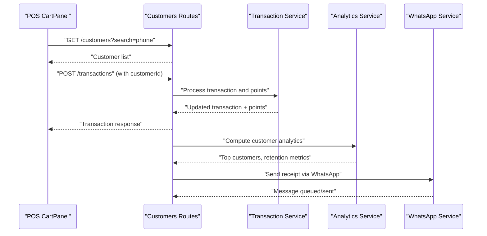

**Diagram sources**
- [CartPanel.tsx](file://apps/web/src/components/pos/CartPanel.tsx)
- [customers.routes.ts](file://apps/api/src/routes/customers.routes.ts)
- [transaction.service.ts](file://apps/api/src/services/transaction.service.ts)
- [analytics.service.ts](file://apps/api/src/services/analytics.service.ts)
- [whatsapp.service.ts](file://apps/api/src/services/whatsapp.service.ts)

## Detailed Component Analysis

### Customer Profile Management
- Purpose: Store and manage customer personal information, contact details, and registration metadata.
- Data model highlights: Unique phone/email, name, address, birthday, customer type, spending metrics, and timestamps.
- Frontend usage: Customer list displays phone, email, total spent, and points; POS allows selecting a customer for checkout.

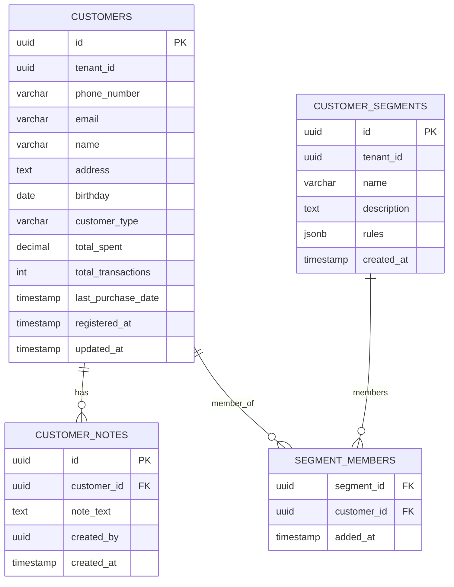

**Diagram sources**
- [PRD.md:1023-1089](file://PRD/PRD.md#L1023-L1089)
- [0000_dashing_albert_cleary.sql](file://apps/api/drizzle/0000_dashing_albert_cleary.sql)
- [001_initial_setup.sql](file://apps/api/migrations/001_initial_setup.sql)
- [0000_snapshot.json](file://apps/api/drizzle/meta/0000_snapshot.json)
- [0003_snapshot.json](file://apps/api/migrations/meta/0003_snapshot.json)

**Section sources**
- [PRD.md:1023-1089](file://PRD/PRD.md#L1023-L1089)
- [page.tsx:234-260](file://apps/web/src/app/customers/page.tsx#L234-L260)

### Purchase History Tracking and Transaction Analysis
- Purchase history endpoint: Retrieve a customer’s transaction history for reporting and insights.
- Transaction service logic:
  - Computes base points per unit amount.
  - Applies tier-based bonus multipliers based on total spent thresholds.
  - Updates transaction with actual points earned and adjusts customer totals.
- Analytics service:
  - Aggregates top customers by total spent.
  - Tracks new customers over recent periods.
  - Provides placeholders for average transactions per customer.

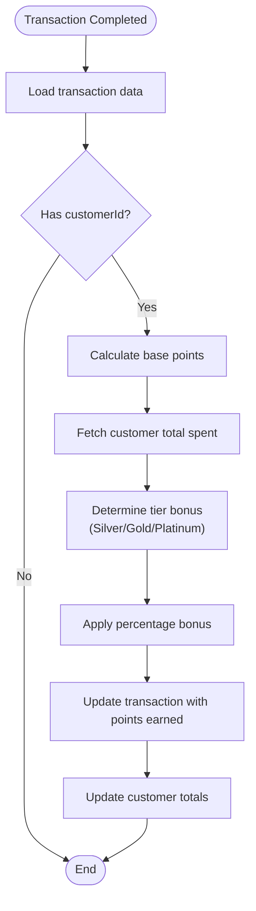

**Diagram sources**
- [transaction.service.ts:192-221](file://apps/api/src/services/transaction.service.ts#L192-L221)
- [transaction.service.js:129-151](file://apps/api/src/services/transaction.service.js#L129-L151)
- [analytics.service.ts:333-382](file://apps/api/src/services/analytics.service.ts#L333-L382)
- [analytics.service.js:174-315](file://apps/api/src/services/analytics.service.js#L174-L315)

**Section sources**
- [PRD.md:981-1004](file://PRD/PRD.md#L981-L1004)
- [transaction.service.ts:192-221](file://apps/api/src/services/transaction.service.ts#L192-L221)
- [transaction.service.js:129-151](file://apps/api/src/services/transaction.service.js#L129-L151)
- [analytics.service.ts:333-382](file://apps/api/src/services/analytics.service.ts#L333-L382)

### WhatsApp Integration for Automated Receipts and Notifications
- Webhook verification: Validates subscription requests using a shared verify token.
- Receipt delivery: Generates localized receipt content and inserts a pending message record; attempts immediate processing.
- Notifications: Sends low stock alerts to store owners and generic notifications to customers.
- Message lifecycle: Pending -> Sent (mock processing simulates network delay and status update).

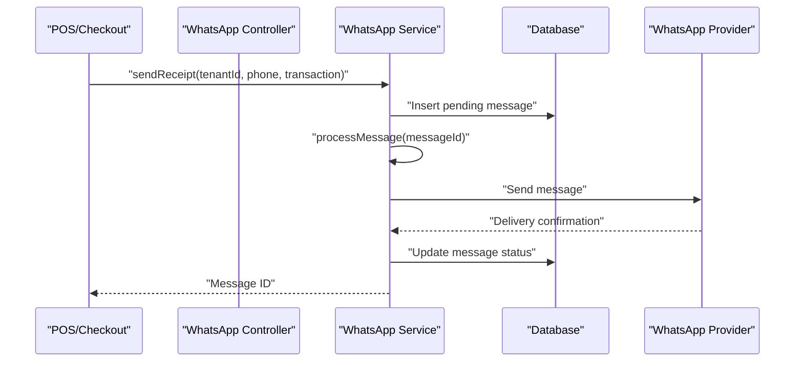

**Diagram sources**
- [whatsapp.controller.ts:32-70](file://apps/api/src/controllers/whatsapp.controller.ts#L32-L70)
- [whatsapp.controller.js:26-62](file://apps/api/src/controllers/whatsapp.controller.js#L26-L62)
- [whatsapp.service.ts:1-36](file://apps/api/src/services/whatsapp.service.ts#L1-L36)
- [whatsapp.service.js:1-81](file://apps/api/src/services/whatsapp.service.js#L1-L81)

**Section sources**
- [README.md:180-185](file://README.md#L180-L185)
- [whatsapp.controller.ts:32-70](file://apps/api/src/controllers/whatsapp.controller.ts#L32-L70)
- [whatsapp.service.ts:1-36](file://apps/api/src/services/whatsapp.service.ts#L1-L36)

### Customer Notes, Communication History, and Relationship Building Tools
- Notes: Stored per customer with free-text content and creator metadata; supports internal relationship building.
- Communication history: Implemented via message records (pending/sent/delivered) linked to transactions and customers.

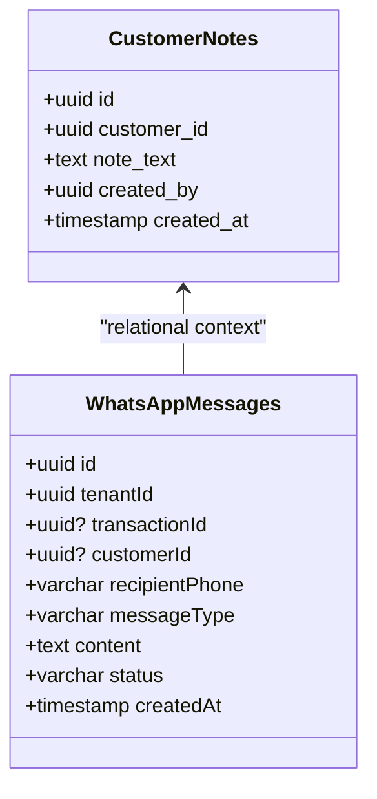

**Diagram sources**
- [PRD.md:1063-1070](file://PRD/PRD.md#L1063-L1070)
- [PRD.md:1023-1089](file://PRD/PRD.md#L1023-L1089)
- [whatsapp.service.ts:1-36](file://apps/api/src/services/whatsapp.service.ts#L1-L36)

**Section sources**
- [PRD.md:1063-1070](file://PRD/PRD.md#L1063-L1070)
- [PRD.md:1023-1089](file://PRD/PRD.md#L1023-L1089)

### Loyalty Program Implementation
- Points balances and tier levels: Per-customer balances with upgrade timestamps.
- Transactions: Earn/redemption records linked to references (e.g., transactions).
- POS integration: Customer selection enables points-to-redeem input; discount computed and applied.

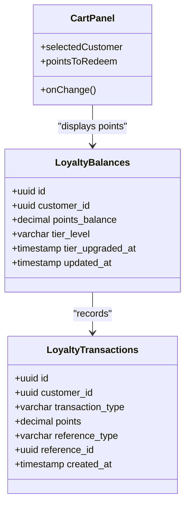

**Diagram sources**
- [PRD.md:1042-1061](file://PRD/PRD.md#L1042-L1061)
- [CartPanel.tsx:167-245](file://apps/web/src/components/pos/CartPanel.tsx#L167-L245)

**Section sources**
- [PRD.md:1042-1061](file://PRD/PRD.md#L1042-L1061)
- [CartPanel.tsx:167-245](file://apps/web/src/components/pos/CartPanel.tsx#L167-L245)

### Customer Segmentation
- Segments: Named groups with dynamic rules and membership tracking.
- Membership: Many-to-many relationship between segments and customers.

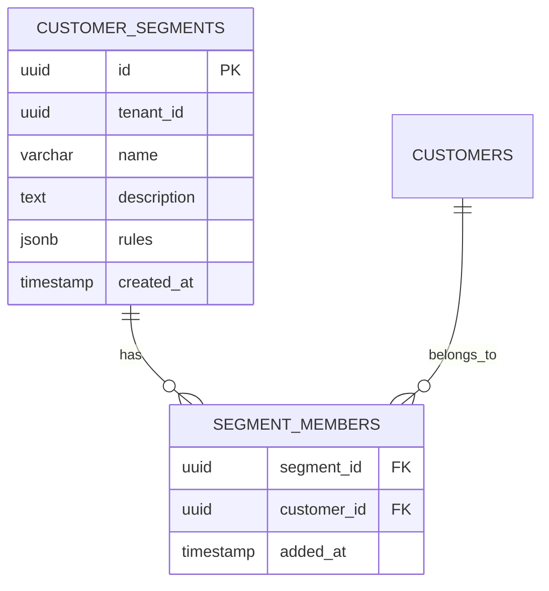

**Diagram sources**
- [PRD.md:1072-1089](file://PRD/PRD.md#L1072-L1089)

**Section sources**
- [PRD.md:1072-1089](file://PRD/PRD.md#L1072-L1089)

### Customer Retention Strategies and Lifetime Value
- Repeat customer identification: Top customers ranked by total spent.
- New customer tracking: Count of registrations within a recent period.
- Average transactions per customer: Available as a computed metric requiring transaction joins.
- POS linkage: Customer selection during checkout ties transactions to customer profiles, enabling accurate LTV calculations.

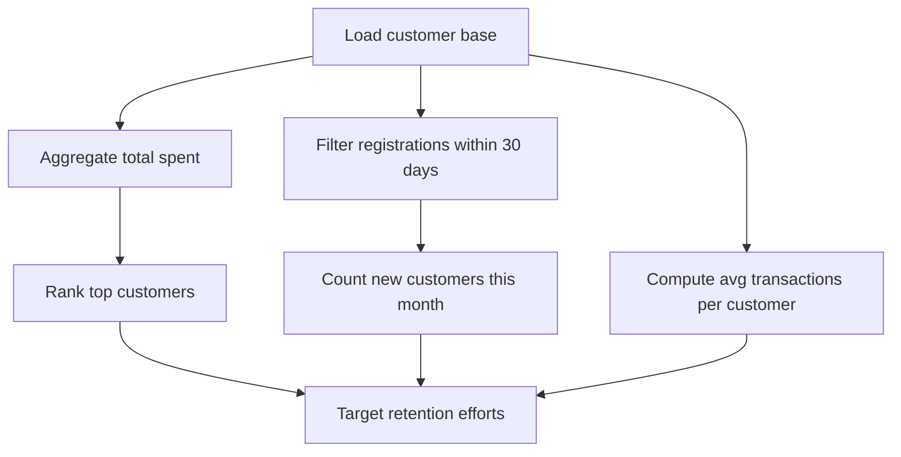

**Diagram sources**
- [analytics.service.ts:333-382](file://apps/api/src/services/analytics.service.ts#L333-L382)
- [analytics.service.js:174-315](file://apps/api/src/services/analytics.service.js#L174-L315)

**Section sources**
- [analytics.service.ts:333-382](file://apps/api/src/services/analytics.service.ts#L333-L382)
- [analytics.service.js:174-315](file://apps/api/src/services/analytics.service.js#L174-L315)

### Customer Data Privacy, Consent Management, and Data Protection
- Personal data fields: Phone, email, address, birthday, and customer type indicate sensitive attributes.
- Consent and protection: Implement data minimization, secure storage, access controls, and retention policies aligned with privacy regulations.
- Recommendations: Add explicit consent fields, data subject request handlers, and audit logs for data access.

[No sources needed since this section provides general guidance]

### Customer Onboarding Workflows and POS Integration
- Onboarding: Create customer profiles with phone/email/contact details; optionally pre-register with segmentation rules.
- POS integration: Select customer from a datalist; points-to-redeem input reduces payable amount; receipt sent via WhatsApp.

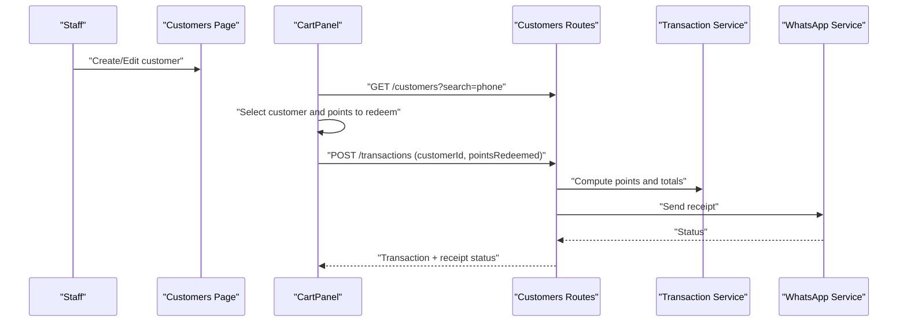

**Diagram sources**
- [page.tsx:234-260](file://apps/web/src/app/customers/page.tsx#L234-L260)
- [CartPanel.tsx:167-245](file://apps/web/src/components/pos/CartPanel.tsx#L167-L245)
- [customers.routes.ts](file://apps/api/src/routes/customers.routes.ts)
- [transaction.service.ts:192-221](file://apps/api/src/services/transaction.service.ts#L192-L221)
- [whatsapp.service.ts:1-36](file://apps/api/src/services/whatsapp.service.ts#L1-L36)

**Section sources**
- [page.tsx:234-260](file://apps/web/src/app/customers/page.tsx#L234-L260)
- [CartPanel.tsx:167-245](file://apps/web/src/components/pos/CartPanel.tsx#L167-L245)

## Dependency Analysis
- Controllers depend on services for business logic.
- Services depend on database models and Drizzle ORM for persistence.
- Frontend components depend on API routes for data.
- Analytics service depends on joined datasets across customers, transactions, and products.

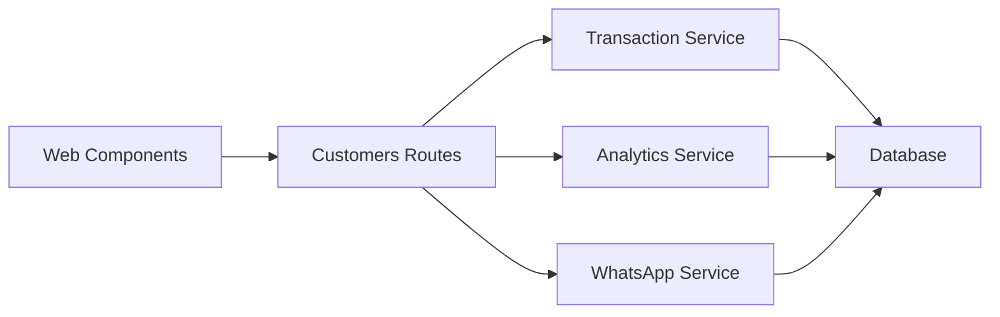

**Diagram sources**
- [customers.routes.ts](file://apps/api/src/routes/customers.routes.ts)
- [transaction.service.ts](file://apps/api/src/services/transaction.service.ts)
- [analytics.service.ts](file://apps/api/src/services/analytics.service.ts)
- [whatsapp.service.ts](file://apps/api/src/services/whatsapp.service.ts)

**Section sources**
- [customers.routes.ts](file://apps/api/src/routes/customers.routes.ts)
- [transaction.service.ts](file://apps/api/src/services/transaction.service.ts)
- [analytics.service.ts](file://apps/api/src/services/analytics.service.ts)
- [whatsapp.service.ts](file://apps/api/src/services/whatsapp.service.ts)

## Performance Considerations
- Indexes: Phone number indexing improves search performance; consider composite indexes for frequent filters.
- Caching: Cache frequently accessed customer lists and top customers; invalidate on write operations.
- Batch processing: Queue WhatsApp messages to avoid blocking transaction completion.
- Pagination: Implement pagination for customer lists and purchase histories.
- Analytics: Pre-aggregate metrics where feasible to reduce join costs.

[No sources needed since this section provides general guidance]

## Troubleshooting Guide
- WhatsApp webhook verification fails: Confirm verify token matches environment configuration and mode/token/challenge parameters are correctly passed.
- Messages not sent: Check message status transitions and simulate retry logic; ensure provider credentials are configured.
- Incorrect points calculation: Verify tier thresholds and base point computation align with business rules; confirm transaction updates occur after totals are finalized.
- Missing purchase history: Ensure customerId is included in transactions and analytics queries join on completed transactions.

**Section sources**
- [whatsapp.controller.ts:54-70](file://apps/api/src/controllers/whatsapp.controller.ts#L54-L70)
- [whatsapp.service.ts:66-81](file://apps/api/src/services/whatsapp.service.ts#L66-L81)
- [transaction.service.ts:192-221](file://apps/api/src/services/transaction.service.ts#L192-L221)

## Conclusion
ARHAT POS provides a robust foundation for CRM through customer profiles, purchase history, segmentation, and a WhatsApp integration for automated receipts and notifications. The transaction service powers loyalty points with tier-based bonuses, while analytics surfaces retention and top customer insights. Integrating customer selection in POS enhances the customer journey, enabling personalized experiences and data-driven retention strategies. Future enhancements should focus on formal consent management, advanced segmentation rules, and expanded analytics for LTV modeling.

## Appendices
- API endpoints for CRM and loyalty are defined in the PRD, covering customer CRUD, purchase history, loyalty balance, and segmentation operations.

**Section sources**
- [PRD.md:981-1004](file://PRD/PRD.md#L981-L1004)