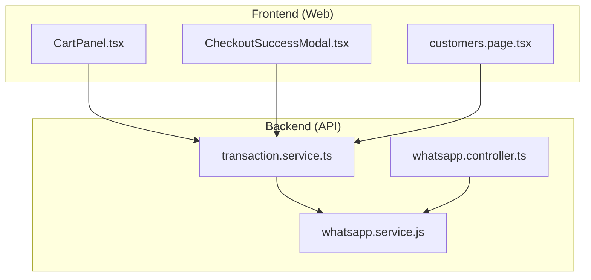
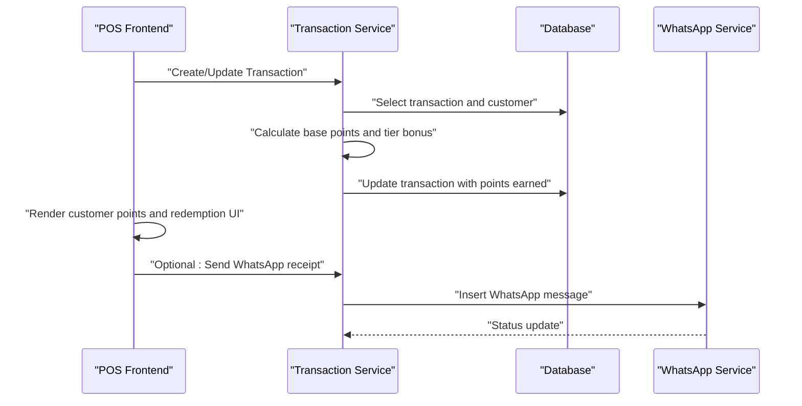
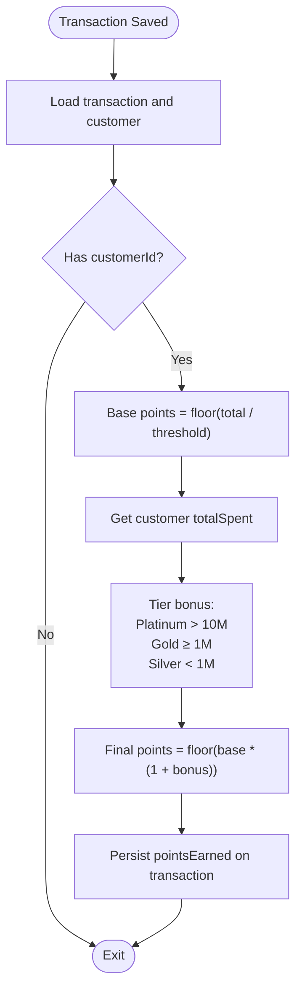
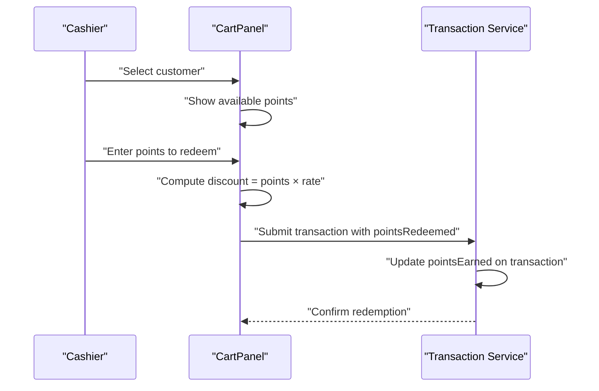
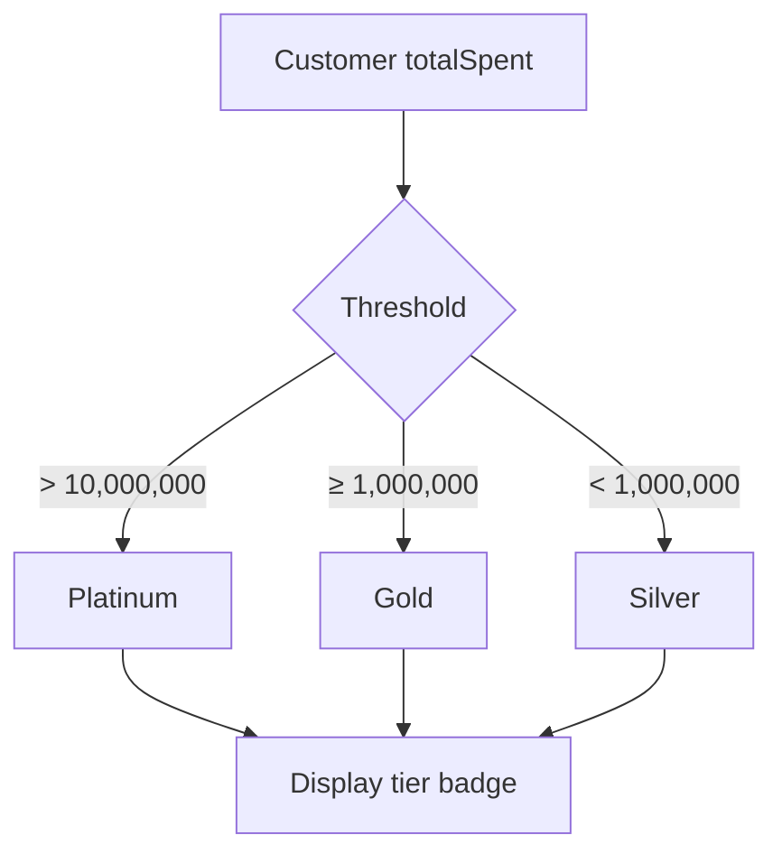
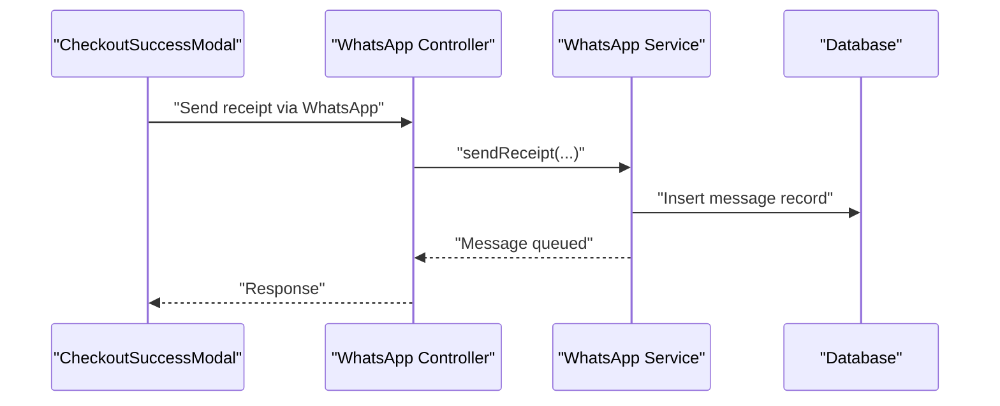
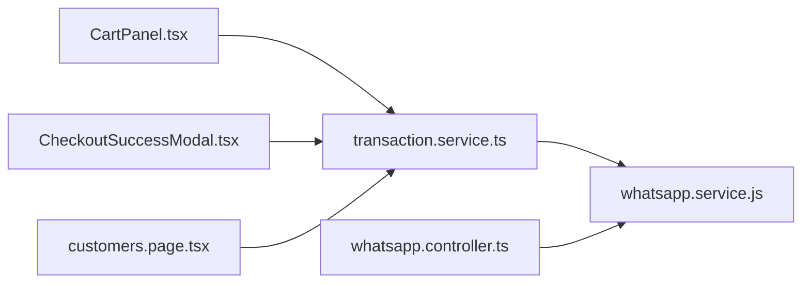

# Loyalty & Rewards Program

<cite>
**Referenced Files in This Document**
- [transaction.service.ts](file://apps/api/src/services/transaction.service.ts)
- [transaction.service.js](file://apps/api/src/services/transaction.service.js)
- [CartPanel.tsx](file://apps/web/src/components/pos/CartPanel.tsx)
- [CheckoutSuccessModal.tsx](file://apps/web/src/components/pos/CheckoutSuccessModal.tsx)
- [customers.page.tsx](file://apps/web/src/app/customers/page.tsx)
- [whatsapp.service.js](file://apps/api/src/services/whatsapp.service.js)
- [whatsapp.controller.ts](file://apps/api/src/controllers/whatsapp.controller.ts)
</cite>

## Table of Contents
1. [Introduction](#introduction)
2. [Project Structure](#project-structure)
3. [Core Components](#core-components)
4. [Architecture Overview](#architecture-overview)
5. [Detailed Component Analysis](#detailed-component-analysis)
6. [Dependency Analysis](#dependency-analysis)
7. [Performance Considerations](#performance-considerations)
8. [Troubleshooting Guide](#troubleshooting-guide)
9. [Conclusion](#conclusion)

## Introduction
This document describes the loyalty and rewards program implementation in ARHAT POS CRM. It covers reward point calculation algorithms, point accumulation rules, and redemption mechanics integrated with purchase transactions. It also documents membership tiers, status-based benefits, and progression criteria, along with cashback and discount structures, promotional offer management, voucher/coupon systems, and special offer distribution via WhatsApp. Finally, it outlines analytics, engagement tracking, and program effectiveness measurement capabilities, including point expiration policies, transfer mechanisms, and customization options.

## Project Structure
The loyalty program spans the backend API and the frontend POS interface:
- Backend services calculate points, manage redemptions, and orchestrate WhatsApp notifications.
- Frontend components enable customer selection, point redemption, and receipt sharing via WhatsApp.
- Controllers and services coordinate transaction updates and messaging workflows.

**Diagram sources**
- [CartPanel.tsx](file://apps/web/src/components/pos/CartPanel.tsx)
- [CheckoutSuccessModal.tsx](file://apps/web/src/components/pos/CheckoutSuccessModal.tsx)
- [customers.page.tsx](file://apps/web/src/app/customers/page.tsx)
- [transaction.service.ts](file://apps/api/src/services/transaction.service.ts)
- [whatsapp.service.js](file://apps/api/src/services/whatsapp.service.js)
- [whatsapp.controller.ts](file://apps/api/src/controllers/whatsapp.controller.ts)

**Section sources**
- [CartPanel.tsx](file://apps/web/src/components/pos/CartPanel.tsx)
- [CheckoutSuccessModal.tsx](file://apps/web/src/components/pos/CheckoutSuccessModal.tsx)
- [customers.page.tsx](file://apps/web/src/app/customers/page.tsx)
- [transaction.service.ts](file://apps/api/src/services/transaction.service.ts)
- [whatsapp.service.js](file://apps/api/src/services/whatsapp.service.js)
- [whatsapp.controller.ts](file://apps/api/src/controllers/whatsapp.controller.ts)

## Core Components
- Point calculation engine: Computes base points per purchase and applies tier-based bonuses.
- Redemption UI: Allows selecting a customer, specifying points to redeem, and applying point discounts.
- Transaction update pipeline: Persists points earned and redeemed during checkout.
- WhatsApp receipt delivery: Sends transaction receipts to customer phones.
- Customer tier display: Shows membership tier and points in the customer list.

Key behaviors:
- Base points: Earned as integer division of total amount by a fixed threshold.
- Tier bonus: Applied based on cumulative spending thresholds to increase effective points.
- Redemption: Converts points to monetary discount at a fixed rate.
- Receipt sharing: Optional WhatsApp delivery of the purchase receipt.

**Section sources**
- [transaction.service.ts](file://apps/api/src/services/transaction.service.ts)
- [transaction.service.js](file://apps/api/src/services/transaction.service.js)
- [CartPanel.tsx](file://apps/web/src/components/pos/CartPanel.tsx)
- [customers.page.tsx](file://apps/web/src/app/customers/page.tsx)
- [whatsapp.service.js](file://apps/api/src/services/whatsapp.service.js)

## Architecture Overview
The loyalty program integrates purchase transactions with point accounting and optional WhatsApp notifications.

**Diagram sources**
- [transaction.service.ts](file://apps/api/src/services/transaction.service.ts)
- [CartPanel.tsx](file://apps/web/src/components/pos/CartPanel.tsx)
- [whatsapp.service.js](file://apps/api/src/services/whatsapp.service.js)

## Detailed Component Analysis

### Point Calculation Engine
The backend service computes points per transaction and applies tier bonuses based on customer lifetime spending.

**Diagram sources**
- [transaction.service.ts](file://apps/api/src/services/transaction.service.ts)

**Section sources**
- [transaction.service.ts](file://apps/api/src/services/transaction.service.ts)
- [transaction.service.js](file://apps/api/src/services/transaction.service.js)

### Redemption Workflow
The POS UI enables selecting a customer and specifying points to redeem, converting points to a discount at a fixed rate.

**Diagram sources**
- [CartPanel.tsx](file://apps/web/src/components/pos/CartPanel.tsx)
- [transaction.service.ts](file://apps/api/src/services/transaction.service.ts)

**Section sources**
- [CartPanel.tsx](file://apps/web/src/components/pos/CartPanel.tsx)
- [transaction.service.ts](file://apps/api/src/services/transaction.service.ts)

### Membership Tiers and Status Benefits
Membership tiers are derived from cumulative spending thresholds and displayed alongside customer records.

**Diagram sources**
- [customers.page.tsx](file://apps/web/src/app/customers/page.tsx)

**Section sources**
- [customers.page.tsx](file://apps/web/src/app/customers/page.tsx)

### Discount Structures and Promotions
- Per-item/global discounts are supported in the POS UI.
- Point-to-currency conversion is applied as a line-item discount during checkout.
- Promotional offers can be modeled as additional discount logic layered on top of the existing discount pipeline.

**Section sources**
- [CartPanel.tsx](file://apps/web/src/components/pos/CartPanel.tsx)

### Voucher Generation and Coupon Systems
- The codebase does not include explicit voucher or coupon models or services.
- To implement vouchers/coupons, extend the transaction pipeline to:
  - Validate coupon codes against a new model.
  - Apply fixed or percentage discounts.
  - Track usage limits and expiration dates.
  - Integrate with the receipt workflow for distribution.

[No sources needed since this section proposes extensions without analyzing specific files]

### Special Offer Distribution via WhatsApp
- The backend supports inserting WhatsApp messages for receipts and notifications.
- The frontend provides an option to share receipts via WhatsApp after a successful checkout.

**Diagram sources**
- [CheckoutSuccessModal.tsx](file://apps/web/src/components/pos/CheckoutSuccessModal.tsx)
- [whatsapp.controller.ts](file://apps/api/src/controllers/whatsapp.controller.ts)
- [whatsapp.service.js](file://apps/api/src/services/whatsapp.service.js)

**Section sources**
- [CheckoutSuccessModal.tsx](file://apps/web/src/components/pos/CheckoutSuccessModal.tsx)
- [whatsapp.controller.ts](file://apps/api/src/controllers/whatsapp.controller.ts)
- [whatsapp.service.js](file://apps/api/src/services/whatsapp.service.js)

### Analytics, Engagement Tracking, and Effectiveness Measurement
- Customer list displays total spending and points, enabling basic cohort analysis.
- Transaction-level pointsEarned and pointsRedeemed can be aggregated for program metrics.
- Receipt sharing via WhatsApp can be tracked through message status updates.

Recommendations:
- Add analytics endpoints for:
  - Monthly active members with point deltas.
  - Redemption rates by tier.
  - Revenue impact from point redemptions.
  - Campaign effectiveness via coupon usage.
- Track engagement via:
  - Frequency of purchases and average order value per tier.
  - Receipt sharing rates and opt-in preferences.

[No sources needed since this section provides general guidance]

### Point Expiration Policies and Transfer Mechanisms
- No expiration or transfer logic is currently implemented in the codebase.
- To add expiration:
  - Store point expiry timestamps per point allocation.
  - Filter expiring points in queries and dashboards.
- To add transfers:
  - Add transfer requests and approvals.
  - Enforce balance checks and audit logs.

[No sources needed since this section proposes extensions without analyzing specific files]

### Integration with Purchase Transactions
- Points are calculated and persisted when transactions are saved.
- Redemption is applied as a discount during checkout and reflected in the final amount.

**Section sources**
- [transaction.service.ts](file://apps/api/src/services/transaction.service.ts)
- [CartPanel.tsx](file://apps/web/src/components/pos/CartPanel.tsx)

### Customer Tier Upgrades and Downgrades
- Tiers are computed dynamically from totalSpent.
- Downgrades occur automatically when totalSpent falls below thresholds.
- Consider adding a grace period or minimum spend buffer to prevent churn.

**Section sources**
- [customers.page.tsx](file://apps/web/src/app/customers/page.tsx)

### Loyalty Program Customization Options
- Thresholds and bonus percentages are embedded in the calculation logic.
- To customize:
  - Externalize thresholds and rates to settings.
  - Support per-product or per-category point multipliers.
  - Allow campaign-based point boosts.

**Section sources**
- [transaction.service.ts](file://apps/api/src/services/transaction.service.ts)

## Dependency Analysis
The following diagram shows the primary dependencies among components involved in the loyalty program.

**Diagram sources**
- [CartPanel.tsx](file://apps/web/src/components/pos/CartPanel.tsx)
- [CheckoutSuccessModal.tsx](file://apps/web/src/components/pos/CheckoutSuccessModal.tsx)
- [customers.page.tsx](file://apps/web/src/app/customers/page.tsx)
- [transaction.service.ts](file://apps/api/src/services/transaction.service.ts)
- [whatsapp.service.js](file://apps/api/src/services/whatsapp.service.js)
- [whatsapp.controller.ts](file://apps/api/src/controllers/whatsapp.controller.ts)

**Section sources**
- [CartPanel.tsx](file://apps/web/src/components/pos/CartPanel.tsx)
- [CheckoutSuccessModal.tsx](file://apps/web/src/components/pos/CheckoutSuccessModal.tsx)
- [customers.page.tsx](file://apps/web/src/app/customers/page.tsx)
- [transaction.service.ts](file://apps/api/src/services/transaction.service.ts)
- [whatsapp.service.js](file://apps/api/src/services/whatsapp.service.js)
- [whatsapp.controller.ts](file://apps/api/src/controllers/whatsapp.controller.ts)

## Performance Considerations
- Point calculations are O(1) per transaction and lightweight.
- Tier determination is constant-time lookups based on thresholds.
- Consider indexing customer totalSpent and transaction timestamps for analytics queries.
- Batch message processing for WhatsApp can improve throughput.

[No sources needed since this section provides general guidance]

## Troubleshooting Guide
Common issues and resolutions:
- Points not updating:
  - Verify customerId is present on the transaction.
  - Confirm totalAmount is numeric and greater than zero.
  - Check that pointsEarned is being written to the transaction record.
- Redemption not applied:
  - Ensure pointsRedeemed is submitted and within available balance.
  - Confirm discount computation aligns with the point-to-currency rate.
- WhatsApp receipt not sent:
  - Validate phone number exists on the customer.
  - Check message insertion and provider status updates.
  - Review webhook verification and error logs.

**Section sources**
- [transaction.service.ts](file://apps/api/src/services/transaction.service.ts)
- [CartPanel.tsx](file://apps/web/src/components/pos/CartPanel.tsx)
- [whatsapp.service.js](file://apps/api/src/services/whatsapp.service.js)
- [whatsapp.controller.ts](file://apps/api/src/controllers/whatsapp.controller.ts)

## Conclusion
ARHAT POS CRM implements a practical, extensible foundation for a loyalty and rewards program. The backend calculates points with tier-based bonuses and persists redemption data, while the frontend enables customer selection and point redemption. WhatsApp integration supports receipt delivery. Future enhancements can introduce expiration, transfers, coupons, and advanced analytics to maximize engagement and program effectiveness.