# Purchase History & Transaction Analysis

<cite>
**Referenced Files in This Document**
- [analytics.service.ts](file://apps/api/src/services/analytics.service.ts)
- [transaction.service.ts](file://apps/api/src/services/transaction.service.ts)
- [transaction.controller.ts](file://apps/api/src/controllers/transaction.controller.ts)
- [PRD.md](file://PRD/PRD.md)
- [page.tsx](file://apps/web/src/app/customers/page.tsx)
- [test_checkout.ts](file://apps/api/test_checkout.ts)
- [0003_snapshot.json](file://apps/api/migrations/meta/0003_snapshot.json)
- [0002_snapshot.json](file://apps/api/migrations/meta/0002_snapshot.json)
- [0001_snapshot.json](file://apps/api/migrations/meta/0001_snapshot.json)
- [0000_snapshot.json](file://apps/api/drizzle/meta/0000_snapshot.json)
</cite>

## Table of Contents
1. [Introduction](#introduction)
2. [Project Structure](#project-structure)
3. [Core Components](#core-components)
4. [Architecture Overview](#architecture-overview)
5. [Detailed Component Analysis](#detailed-component-analysis)
6. [Dependency Analysis](#dependency-analysis)
7. [Performance Considerations](#performance-considerations)
8. [Troubleshooting Guide](#troubleshooting-guide)
9. [Conclusion](#conclusion)
10. [Appendices](#appendices)

## Introduction
This document explains how ARHAT POS CRM records purchases, maintains customer purchase histories, and performs transaction analysis. It covers transaction recording, customer history maintenance, pattern analysis, spending behavior tracking, frequency metrics, average transaction value calculations, filtering capabilities, purchase journey mapping, product preferences, cross-selling opportunities, customer lifetime value (CLV), retention rates, profitability assessment, reporting and trend analysis, seasonal pattern recognition, and integration with POS transactions and offline synchronization.

## Project Structure
The purchase history and transaction analysis functionality spans backend services and controllers, frontend customer history views, and database schema snapshots that define transaction, item, and customer entities.

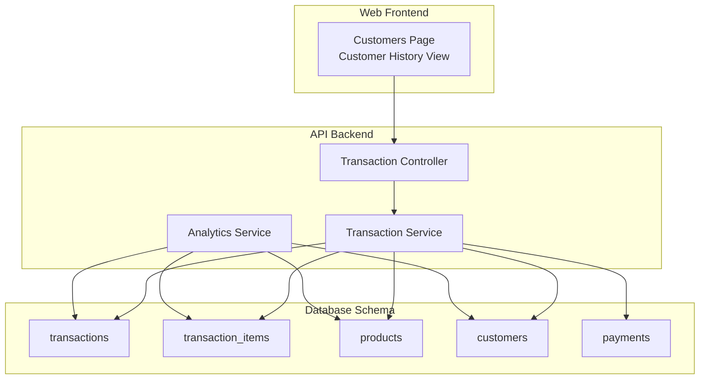

**Diagram sources**
- [page.tsx:1-426](file://apps/web/src/app/customers/page.tsx#L1-L426)
- [transaction.controller.ts:1-63](file://apps/api/src/controllers/transaction.controller.ts#L1-L63)
- [transaction.service.ts:1-66](file://apps/api/src/services/transaction.service.ts#L1-L66)
- [analytics.service.ts:1-382](file://apps/api/src/services/analytics.service.ts#L1-L382)
- [0003_snapshot.json:2090-2242](file://apps/api/migrations/meta/0003_snapshot.json#L2090-L2242)
- [0002_snapshot.json:1799-1844](file://apps/api/migrations/meta/0002_snapshot.json#L1799-L1844)
- [0001_snapshot.json:1782-1997](file://apps/api/migrations/meta/0001_snapshot.json#L1782-L1997)
- [0000_snapshot.json:2042-2242](file://apps/api/drizzle/meta/0000_snapshot.json#L2042-L2242)

**Section sources**
- [page.tsx:1-426](file://apps/web/src/app/customers/page.tsx#L1-L426)
- [transaction.controller.ts:1-63](file://apps/api/src/controllers/transaction.controller.ts#L1-L63)
- [transaction.service.ts:1-66](file://apps/api/src/services/transaction.service.ts#L1-L66)
- [analytics.service.ts:1-382](file://apps/api/src/services/analytics.service.ts#L1-L382)
- [0003_snapshot.json:2090-2242](file://apps/api/migrations/meta/0003_snapshot.json#L2090-L2242)
- [0002_snapshot.json:1799-1844](file://apps/api/migrations/meta/0002_snapshot.json#L1799-L1844)
- [0001_snapshot.json:1782-1997](file://apps/api/migrations/meta/0001_snapshot.json#L1782-L1997)
- [0000_snapshot.json:2042-2242](file://apps/api/drizzle/meta/0000_snapshot.json#L2042-L2242)

## Core Components
- Transaction Recording and Synchronization
  - Creates transactions via the Transaction Service and persists them with items and payments.
  - Supports offline sync by combining creation and checkout in a single operation.
- Customer Purchase History Maintenance
  - Stores per-customer totals and timestamps for registration and updates.
  - Exposes customer lists and top spenders for analytics.
- Transaction Analysis
  - Computes daily revenue charts, payment method mix, top products by quantity and revenue, slow-moving items, and profit/loss over time.
  - Provides customer analytics including top spenders and new customer counts.

**Section sources**
- [transaction.service.ts:1-66](file://apps/api/src/services/transaction.service.ts#L1-L66)
- [transaction.controller.ts:1-63](file://apps/api/src/controllers/transaction.controller.ts#L1-L63)
- [analytics.service.ts:5-382](file://apps/api/src/services/analytics.service.ts#L5-L382)
- [page.tsx:1-426](file://apps/web/src/app/customers/page.tsx#L1-L426)

## Architecture Overview
The system integrates POS transactions with analytics and customer history. The frontend triggers transaction operations, which are handled by controllers and services. Services persist data and expose analytics endpoints.

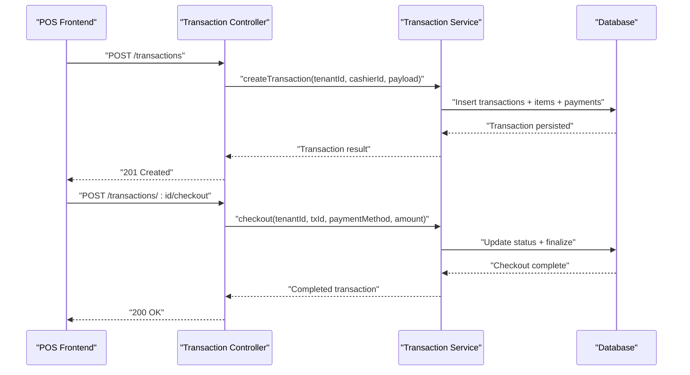

**Diagram sources**
- [transaction.controller.ts:14-41](file://apps/api/src/controllers/transaction.controller.ts#L14-L41)
- [transaction.service.ts:19-66](file://apps/api/src/services/transaction.service.ts#L19-L66)
- [PRD.md:465-476](file://PRD/PRD.md#L465-L476)

## Detailed Component Analysis

### Transaction Recording and Offline Sync
- Endpoint coverage includes creation, checkout, hold/resume, refund, void, and receipts.
- Offline sync combines creation and immediate checkout to support disconnected environments.
- The service ensures atomicity using database transactions and links items and payments to the transaction.

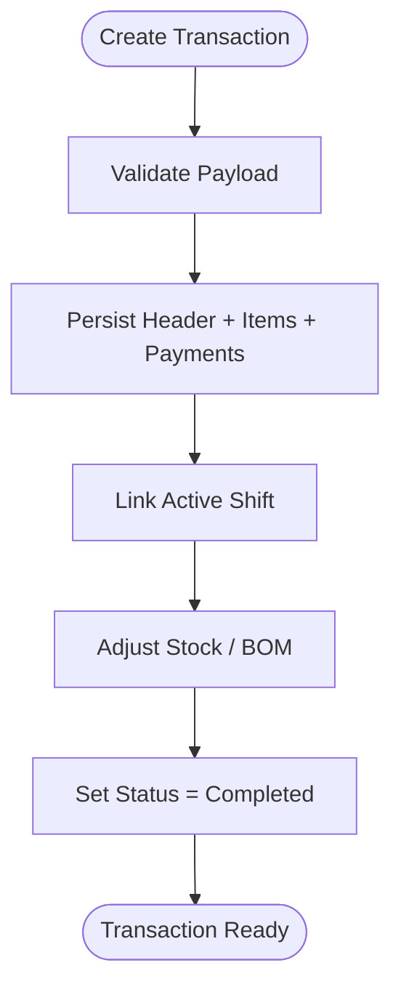

**Diagram sources**
- [transaction.controller.ts:14-41](file://apps/api/src/controllers/transaction.controller.ts#L14-L41)
- [transaction.service.ts:19-66](file://apps/api/src/services/transaction.service.ts#L19-L66)
- [test_checkout.ts:20-36](file://apps/api/test_checkout.ts#L20-L36)

**Section sources**
- [PRD.md:465-476](file://PRD/PRD.md#L465-L476)
- [transaction.controller.ts:1-63](file://apps/api/src/controllers/transaction.controller.ts#L1-L63)
- [transaction.service.ts:1-66](file://apps/api/src/services/transaction.service.ts#L1-L66)
- [test_checkout.ts:1-43](file://apps/api/test_checkout.ts#L1-L43)

### Customer Purchase History Maintenance
- Customer entity stores total spent and timestamps for registration/update.
- The customer history modal lists past transactions per customer, enabling purchase journey mapping.
- Top spenders are computed for prioritization and retention strategies.

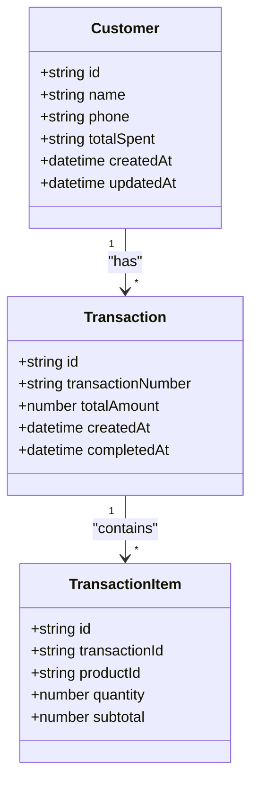

**Diagram sources**
- [0003_snapshot.json:2090-2242](file://apps/api/migrations/meta/0003_snapshot.json#L2090-L2242)
- [0002_snapshot.json:1799-1844](file://apps/api/migrations/meta/0002_snapshot.json#L1799-L1844)
- [page.tsx:18-45](file://apps/web/src/app/customers/page.tsx#L18-L45)

**Section sources**
- [page.tsx:1-426](file://apps/web/src/app/customers/page.tsx#L1-L426)
- [analytics.service.ts:333-382](file://apps/api/src/services/analytics.service.ts#L333-L382)

### Purchase Pattern Analysis
- Daily revenue charts aggregate completed transactions over a period.
- Payment method distribution and top products by quantity/revenue enable category and channel insights.
- Slow-moving products help identify underperforming SKUs for markdown or promotions.

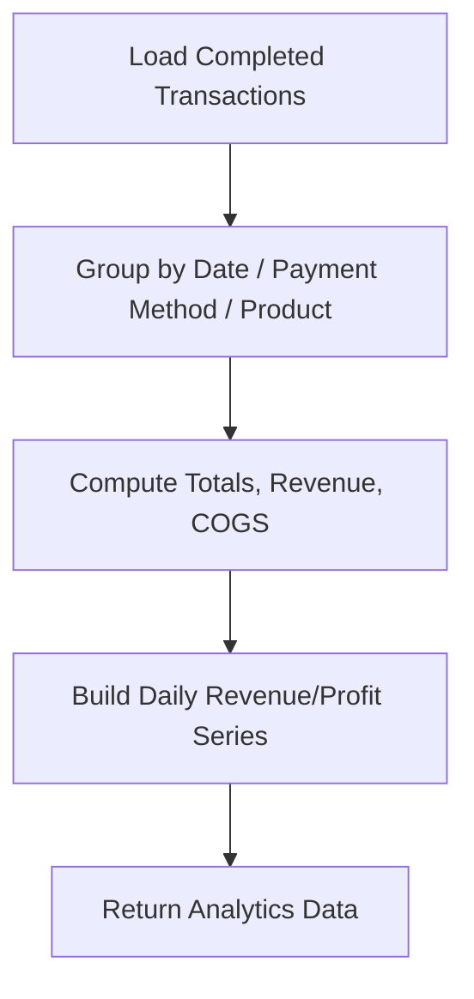

**Diagram sources**
- [analytics.service.ts:131-199](file://apps/api/src/services/analytics.service.ts#L131-L199)
- [analytics.service.ts:202-258](file://apps/api/src/services/analytics.service.ts#L202-L258)
- [analytics.service.ts:260-332](file://apps/api/src/services/analytics.service.ts#L260-L332)

**Section sources**
- [analytics.service.ts:131-332](file://apps/api/src/services/analytics.service.ts#L131-L332)

### Spending Behavior Tracking and Frequency
- Top customers are derived from total spent, enabling behavioral segmentation.
- New customer acquisition over the last 30 days supports growth tracking.
- Average transactions per customer requires joining transactions and is currently a placeholder in the returned dataset.

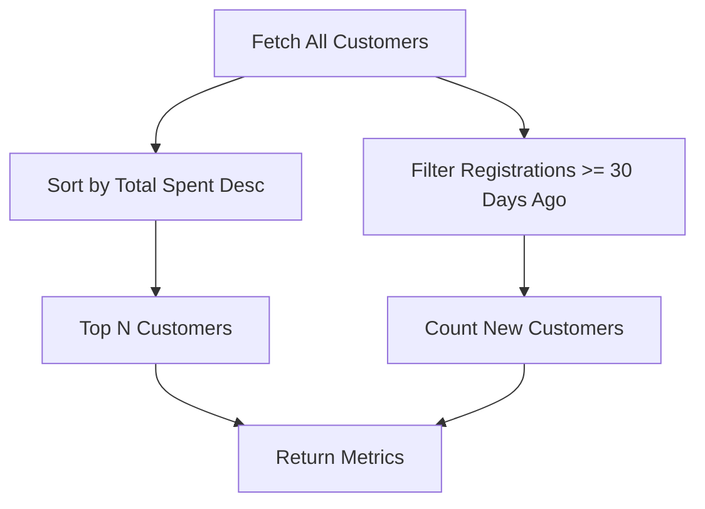

**Diagram sources**
- [analytics.service.ts:333-382](file://apps/api/src/services/analytics.service.ts#L333-L382)

**Section sources**
- [analytics.service.ts:333-382](file://apps/api/src/services/analytics.service.ts#L333-L382)

### Average Transaction Value (ATV) Calculation
- ATV is computed as total revenue divided by total transactions for completed transactions.
- Requires a join between transactions and transaction items to derive accurate values.

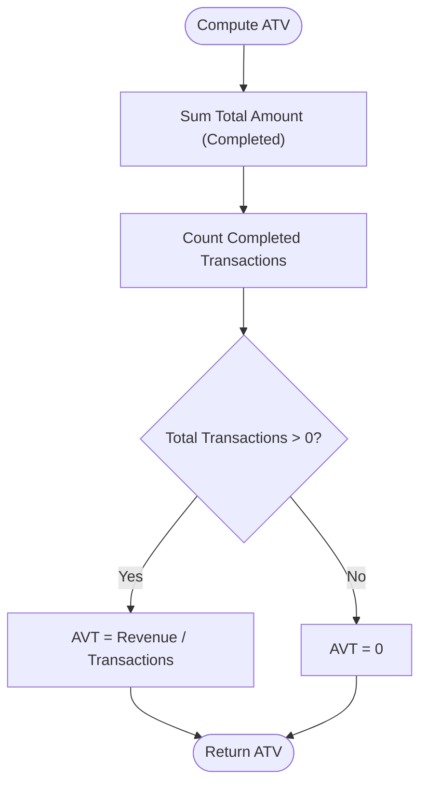

**Diagram sources**
- [analytics.service.ts:131-199](file://apps/api/src/services/analytics.service.ts#L131-L199)

**Section sources**
- [analytics.service.ts:131-199](file://apps/api/src/services/analytics.service.ts#L131-L199)

### Filtering Purchase History
- Date range filtering is supported by date-keyed chart series in analytics.
- Category/product filters can be achieved by joining transaction items with products and aggregating by product/category.
- Transaction type filtering (e.g., completed vs. held) leverages transaction status fields.

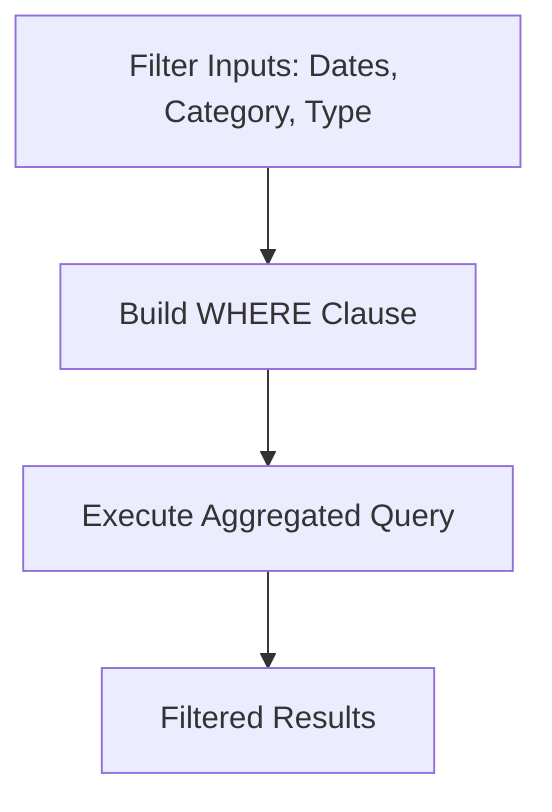

**Diagram sources**
- [analytics.service.ts:131-199](file://apps/api/src/services/analytics.service.ts#L131-L199)
- [0003_snapshot.json:2090-2242](file://apps/api/migrations/meta/0003_snapshot.json#L2090-L2242)

**Section sources**
- [analytics.service.ts:131-199](file://apps/api/src/services/analytics.service.ts#L131-L199)
- [0003_snapshot.json:2090-2242](file://apps/api/migrations/meta/0003_snapshot.json#L2090-L2242)

### Purchase Journey Mapping and Product Preferences
- Customer history view lists transactions with dates and amounts, enabling journey mapping.
- Top products by quantity and revenue reveal preferences and cross-selling opportunities.

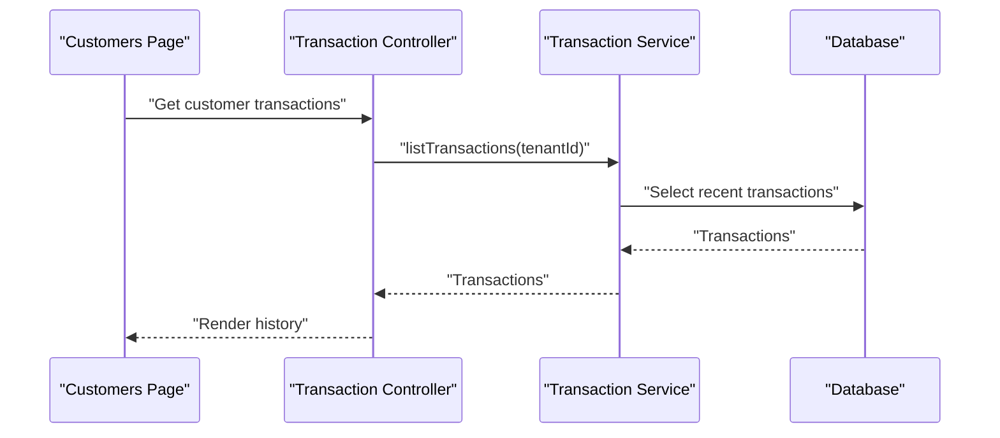

**Diagram sources**
- [page.tsx:1-426](file://apps/web/src/app/customers/page.tsx#L1-L426)
- [transaction.controller.ts:4-13](file://apps/api/src/controllers/transaction.controller.ts#L4-L13)
- [transaction.service.ts:8-15](file://apps/api/src/services/transaction.service.ts#L8-L15)

**Section sources**
- [page.tsx:1-426](file://apps/web/src/app/customers/page.tsx#L1-L426)
- [transaction.controller.ts:4-13](file://apps/api/src/controllers/transaction.controller.ts#L4-L13)
- [transaction.service.ts:8-15](file://apps/api/src/services/transaction.service.ts#L8-L15)

### Cross-Selling Opportunities
- Top products by revenue and quantity highlight bestsellers.
- Slow-moving items indicate potential bundling or promotional opportunities.

**Section sources**
- [analytics.service.ts:202-258](file://apps/api/src/services/analytics.service.ts#L202-L258)

### Customer Lifetime Value (CLV) and Retention
- CLV can be estimated using average transaction value and purchase frequency; current implementation returns placeholders for frequency metrics.
- Retention is approximated by new customer counts over the last 30 days.

**Section sources**
- [analytics.service.ts:333-382](file://apps/api/src/services/analytics.service.ts#L333-L382)
- [analytics.service.ts:131-199](file://apps/api/src/services/analytics.service.ts#L131-L199)

### Profitability Assessment
- Profit/loss analytics computes revenue, cost of goods sold (COGS), gross profit, and margin over a 30-day window.
- COGS is derived from transaction item quantities and product purchase prices.

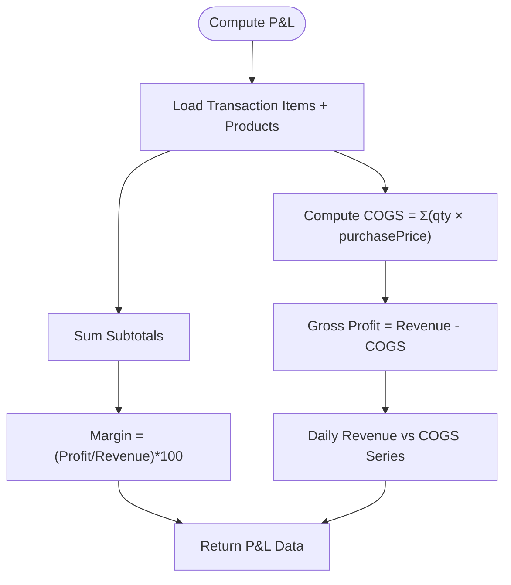

**Diagram sources**
- [analytics.service.ts:260-332](file://apps/api/src/services/analytics.service.ts#L260-L332)

**Section sources**
- [analytics.service.ts:260-332](file://apps/api/src/services/analytics.service.ts#L260-L332)

### Reporting, Trend Analysis, and Seasonality
- Daily revenue charts support trend analysis and seasonal pattern recognition.
- Payment method distribution helps identify channel trends.

**Section sources**
- [analytics.service.ts:131-199](file://apps/api/src/services/analytics.service.ts#L131-L199)
- [analytics.service.ts:260-332](file://apps/api/src/services/analytics.service.ts#L260-L332)

### Real-Time Purchase Data Synchronization
- Offline sync endpoint creates and immediately checks out a transaction, ensuring real-time availability of purchase data after reconciliation.

**Section sources**
- [transaction.controller.ts:42-59](file://apps/api/src/controllers/transaction.controller.ts#L42-L59)

## Dependency Analysis
The analytics and transaction services depend on the database schema snapshots that define tables and relationships.

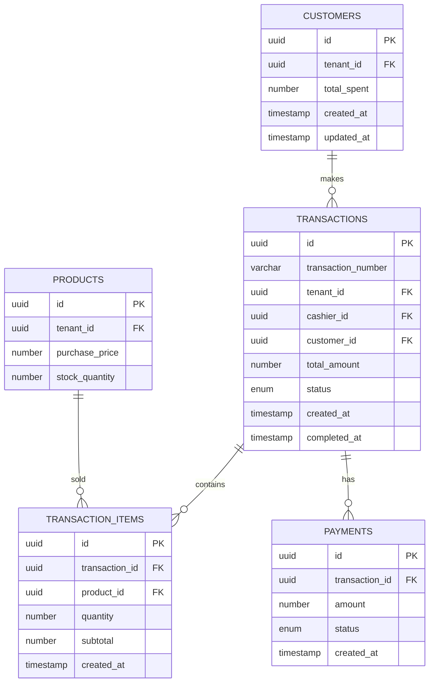

**Diagram sources**
- [0003_snapshot.json:2090-2242](file://apps/api/migrations/meta/0003_snapshot.json#L2090-L2242)
- [0002_snapshot.json:1799-1844](file://apps/api/migrations/meta/0002_snapshot.json#L1799-L1844)
- [0001_snapshot.json:1782-1997](file://apps/api/migrations/meta/0001_snapshot.json#L1782-L1997)
- [0000_snapshot.json:2042-2242](file://apps/api/drizzle/meta/0000_snapshot.json#L2042-L2242)

**Section sources**
- [0003_snapshot.json:2090-2242](file://apps/api/migrations/meta/0003_snapshot.json#L2090-L2242)
- [0002_snapshot.json:1799-1844](file://apps/api/migrations/meta/0002_snapshot.json#L1799-L1844)
- [0001_snapshot.json:1782-1997](file://apps/api/migrations/meta/0001_snapshot.json#L1782-L1997)
- [0000_snapshot.json:2042-2242](file://apps/api/drizzle/meta/0000_snapshot.json#L2042-L2242)

## Performance Considerations
- Use database indexes on frequently filtered columns (e.g., transaction_number, created_at) to improve query performance.
- Prefer server-side aggregation for analytics to avoid large client-side computations.
- Batch reads/writes for offline sync to reduce round trips.
- Cache frequently accessed dashboards and top lists to minimize repeated heavy queries.

## Troubleshooting Guide
- Transaction creation failures: Verify payload completeness and active shift existence.
- Checkout errors: Confirm payment method availability and sufficient stock.
- Analytics computation delays: Ensure proper indexing and limit result sets for charts.
- Customer history empty: Confirm customer exists and has completed transactions.

**Section sources**
- [transaction.controller.ts:14-41](file://apps/api/src/controllers/transaction.controller.ts#L14-L41)
- [transaction.service.ts:19-66](file://apps/api/src/services/transaction.service.ts#L19-L66)
- [analytics.service.ts:131-332](file://apps/api/src/services/analytics.service.ts#L131-L332)

## Conclusion
ARHAT POS CRM provides robust transaction recording, customer history maintenance, and analytics for purchase pattern analysis. With endpoints for creation, checkout, and offline sync, plus analytics for revenue, profitability, and customer insights, the system supports informed decisions around pricing, promotions, and customer retention. Extending analytics to include precise frequency and ATV metrics would further enhance CLV modeling and retention strategies.

## Appendices
- API Endpoints for Transactions and Payments are documented in the PRD.

**Section sources**
- [PRD.md:460-483](file://PRD/PRD.md#L460-L483)