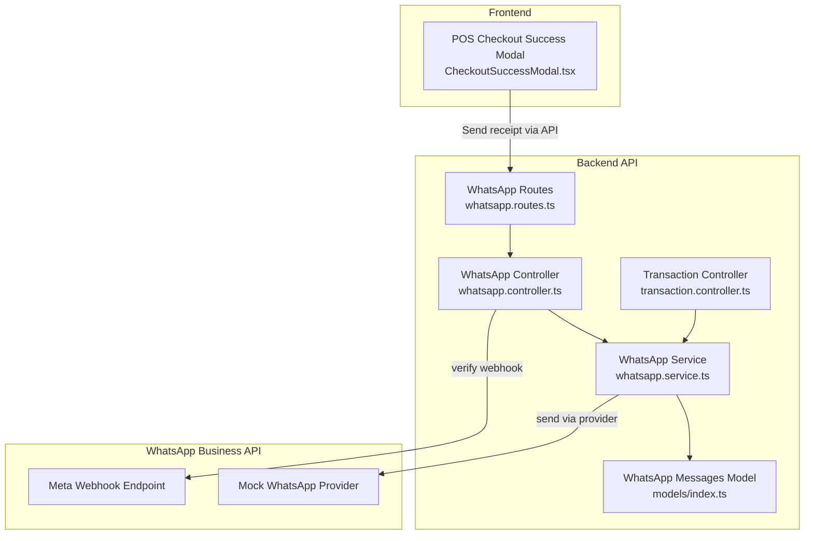
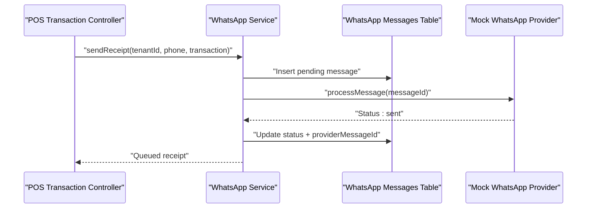
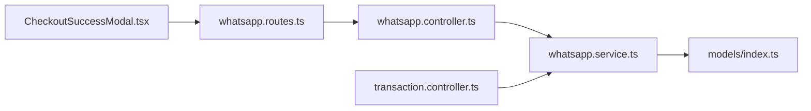

# WhatsApp Communication Integration

<cite>
**Referenced Files in This Document**
- [whatsapp.routes.ts](file://apps/api/src/routes/whatsapp.routes.ts)
- [whatsapp.controller.ts](file://apps/api/src/controllers/whatsapp.controller.ts)
- [whatsapp.service.ts](file://apps/api/src/services/whatsapp.service.ts)
- [transaction.controller.ts](file://apps/api/src/controllers/transaction.controller.ts)
- [index.ts](file://apps/api/src/index.ts)
- [api.ts](file://apps/web/src/lib/api.ts)
- [CheckoutSuccessModal.tsx](file://apps/web/src/components/pos/CheckoutSuccessModal.tsx)
- [index.ts](file://apps/api/src/models/index.ts)
- [PRD.md](file://PRD/PRD.md)
</cite>

## Table of Contents
1. [Introduction](#introduction)
2. [Project Structure](#project-structure)
3. [Core Components](#core-components)
4. [Architecture Overview](#architecture-overview)
5. [Detailed Component Analysis](#detailed-component-analysis)
6. [Dependency Analysis](#dependency-analysis)
7. [Performance Considerations](#performance-considerations)
8. [Troubleshooting Guide](#troubleshooting-guide)
9. [Conclusion](#conclusion)
10. [Appendices](#appendices)

## Introduction
This document describes the WhatsApp integration in ARHAT POS CRM, focusing on automated receipt delivery, customer notifications, and promotional campaigns. It explains the current implementation, which currently uses a mock WhatsApp API to queue and send messages, and outlines how it integrates with POS transactions to automatically trigger order confirmations and receipts. It also covers webhook verification, queue processing, and the frontend capability to send WhatsApp receipts after a successful checkout.

## Project Structure
The WhatsApp integration spans backend routes, controllers, services, and models, plus frontend components that prepare and send receipt messages. The backend exposes endpoints for webhook verification, webhook reception, manual queue processing, and generic notifications. The POS transaction controller triggers WhatsApp receipt sending upon successful transaction creation. The frontend provides a checkout success modal that can format and send WhatsApp receipts.

**Diagram sources**
- [whatsapp.routes.ts:1-16](file://apps/api/src/routes/whatsapp.routes.ts#L1-L16)
- [whatsapp.controller.ts:1-70](file://apps/api/src/controllers/whatsapp.controller.ts#L1-L70)
- [whatsapp.service.ts:1-126](file://apps/api/src/services/whatsapp.service.ts#L1-L126)
- [transaction.controller.ts:1-86](file://apps/api/src/controllers/transaction.controller.ts#L1-L86)
- [index.ts:14-90](file://apps/api/src/index.ts#L14-L90)
- [CheckoutSuccessModal.tsx:35-66](file://apps/web/src/components/pos/CheckoutSuccessModal.tsx#L35-L66)

**Section sources**
- [whatsapp.routes.ts:1-16](file://apps/api/src/routes/whatsapp.routes.ts#L1-L16)
- [whatsapp.controller.ts:1-70](file://apps/api/src/controllers/whatsapp.controller.ts#L1-L70)
- [whatsapp.service.ts:1-126](file://apps/api/src/services/whatsapp.service.ts#L1-L126)
- [transaction.controller.ts:1-86](file://apps/api/src/controllers/transaction.controller.ts#L1-L86)
- [index.ts:14-90](file://apps/api/src/index.ts#L14-L90)
- [CheckoutSuccessModal.tsx:35-66](file://apps/web/src/components/pos/CheckoutSuccessModal.tsx#L35-L66)

## Core Components
- WhatsApp Routes: Expose endpoints for webhook verification, webhook reception, queue processing, and generic notifications.
- WhatsApp Controller: Implements webhook verification, webhook handler, queue processor, and notification sender.
- WhatsApp Service: Provides methods to send receipts, generic notifications, and processes the message queue. Currently uses a mock provider.
- Transaction Controller: Triggers WhatsApp receipt sending after successful transaction creation or offline sync.
- WhatsApp Messages Model: Defines the database table for storing queued WhatsApp messages and their status.
- Frontend Receipt Sender: Formats receipt text and sends it via the backend notification endpoint.

Key responsibilities:
- Automated receipt delivery: triggered by POS transactions.
- Customer notifications: generic notifications endpoint for targeted messages.
- Queue management: batch processing of pending messages.
- Webhook support: verification and placeholder for status updates.

**Section sources**
- [whatsapp.routes.ts:1-16](file://apps/api/src/routes/whatsapp.routes.ts#L1-L16)
- [whatsapp.controller.ts:1-70](file://apps/api/src/controllers/whatsapp.controller.ts#L1-L70)
- [whatsapp.service.ts:1-126](file://apps/api/src/services/whatsapp.service.ts#L1-L126)
- [transaction.controller.ts:1-86](file://apps/api/src/controllers/transaction.controller.ts#L1-L86)
- [index.ts:259-270](file://apps/api/src/models/index.ts#L259-L270)
- [api.ts:471-480](file://apps/web/src/lib/api.ts#L471-L480)
- [CheckoutSuccessModal.tsx:35-66](file://apps/web/src/components/pos/CheckoutSuccessModal.tsx#L35-L66)

## Architecture Overview
The system follows a queue-first pattern: upon POS transaction completion, a receipt message is inserted into the database with a pending status and sent asynchronously. The service simulates sending via a provider and updates the record with a sent status and a provider message ID. Webhooks from the provider would update delivery/read statuses, but the current implementation logs incoming webhooks and leaves status updates commented out for future integration.

**Diagram sources**
- [transaction.controller.ts:16-36](file://apps/api/src/controllers/transaction.controller.ts#L16-L36)
- [whatsapp.service.ts:9-36](file://apps/api/src/services/whatsapp.service.ts#L9-L36)
- [index.ts:259-270](file://apps/api/src/models/index.ts#L259-L270)

**Section sources**
- [transaction.controller.ts:16-36](file://apps/api/src/controllers/transaction.controller.ts#L16-L36)
- [whatsapp.service.ts:9-36](file://apps/api/src/services/whatsapp.service.ts#L9-L36)
- [index.ts:259-270](file://apps/api/src/models/index.ts#L259-L270)

## Detailed Component Analysis

### WhatsApp Routes
- Exposes:
  - GET /api/whatsapp/webhook: Verifies webhook subscription using a verify token.
  - POST /api/whatsapp/webhook: Receives webhook events (placeholder for status updates).
  - POST /api/whatsapp/process-queue: Manually triggers queue processing.
  - POST /api/whatsapp/notify: Queues a generic notification to a customer.

Operational notes:
- The webhook verification compares the hub mode, verify token, and challenge parameters.
- The notify endpoint requires phone and message fields and supports tenant scoping.

**Section sources**
- [whatsapp.routes.ts:1-16](file://apps/api/src/routes/whatsapp.routes.ts#L1-L16)
- [whatsapp.controller.ts:5-70](file://apps/api/src/controllers/whatsapp.controller.ts#L5-L70)

### WhatsApp Controller
- verifyWebhook: Validates Meta's webhook verification challenge using a stored verify token.
- webhook: Logs incoming webhook payloads; status update logic is present as commented code for future integration.
- processQueue: Invokes service to process pending and failed messages in batches.
- notify: Validates input, scopes by tenant, and enqueues a generic notification.

Error handling:
- Returns structured JSON responses with appropriate HTTP status codes for success and failure scenarios.

**Section sources**
- [whatsapp.controller.ts:54-70](file://apps/api/src/controllers/whatsapp.controller.ts#L54-L70)
- [whatsapp.controller.ts:32-52](file://apps/api/src/controllers/whatsapp.controller.ts#L32-L52)
- [whatsapp.controller.ts:5-13](file://apps/api/src/controllers/whatsapp.controller.ts#L5-L13)
- [whatsapp.controller.ts:15-30](file://apps/api/src/controllers/whatsapp.controller.ts#L15-L30)

### WhatsApp Service
- sendReceipt: Builds a receipt message from transaction details, inserts a pending message, and attempts immediate send via processMessage.
- sendNotification: Queues a generic notification for a given phone number.
- processMessage: Simulates sending by logging and updating the message status to sent with a mock provider message ID.
- processPendingQueue: Selects up to 50 pending or failed messages and processes them sequentially.

Mock behavior:
- Uses console logs to simulate provider behavior.
- Updates database records with sent timestamps and provider message identifiers.

**Section sources**
- [whatsapp.service.ts:9-36](file://apps/api/src/services/whatsapp.service.ts#L9-L36)
- [whatsapp.service.ts:53-65](file://apps/api/src/services/whatsapp.service.ts#L53-L65)
- [whatsapp.service.ts:69-105](file://apps/api/src/services/whatsapp.service.ts#L69-L105)
- [whatsapp.service.ts:110-125](file://apps/api/src/services/whatsapp.service.ts#L110-L125)

### Transaction Controller Integration
- On successful transaction creation or offline sync, if a customer phone number is provided, the controller asynchronously triggers WhatsApp receipt sending.
- This ensures the API response is not blocked by the messaging operation.

**Section sources**
- [transaction.controller.ts:16-36](file://apps/api/src/controllers/transaction.controller.ts#L16-L36)
- [transaction.controller.ts:57-86](file://apps/api/src/controllers/transaction.controller.ts#L57-L86)

### WhatsApp Messages Model
- Defines the whatsapp_messages table with fields for tenant scoping, transaction/customer linkage, recipient phone, message type, content, status, timestamps, and provider message ID.
- Used by the service to insert pending messages and update statuses.

**Section sources**
- [index.ts:259-270](file://apps/api/src/models/index.ts#L259-L270)

### Frontend Receipt Sending
- The checkout success modal prepares a formatted receipt text and sends it via the backend notify endpoint.
- The frontend composes a multi-line message including store name, transaction number, date, items, totals, and payment method.

**Section sources**
- [CheckoutSuccessModal.tsx:35-66](file://apps/web/src/components/pos/CheckoutSuccessModal.tsx#L35-L66)
- [api.ts:471-480](file://apps/web/src/lib/api.ts#L471-L480)

## Dependency Analysis
The integration exhibits clear separation of concerns:
- Routes depend on the controller.
- Controller depends on the service.
- Service depends on the database model and performs queue operations.
- Transaction controller depends on the service to send receipts.
- Frontend depends on the routes to send notifications.

**Diagram sources**
- [whatsapp.routes.ts:1-16](file://apps/api/src/routes/whatsapp.routes.ts#L1-L16)
- [whatsapp.controller.ts:1-70](file://apps/api/src/controllers/whatsapp.controller.ts#L1-L70)
- [whatsapp.service.ts:1-126](file://apps/api/src/services/whatsapp.service.ts#L1-L126)
- [index.ts:259-270](file://apps/api/src/models/index.ts#L259-L270)
- [transaction.controller.ts:1-86](file://apps/api/src/controllers/transaction.controller.ts#L1-L86)
- [CheckoutSuccessModal.tsx:35-66](file://apps/web/src/components/pos/CheckoutSuccessModal.tsx#L35-L66)

**Section sources**
- [whatsapp.routes.ts:1-16](file://apps/api/src/routes/whatsapp.routes.ts#L1-L16)
- [whatsapp.controller.ts:1-70](file://apps/api/src/controllers/whatsapp.controller.ts#L1-L70)
- [whatsapp.service.ts:1-126](file://apps/api/src/services/whatsapp.service.ts#L1-L126)
- [transaction.controller.ts:1-86](file://apps/api/src/controllers/transaction.controller.ts#L1-L86)
- [index.ts:259-270](file://apps/api/src/models/index.ts#L259-L270)
- [CheckoutSuccessModal.tsx:35-66](file://apps/web/src/components/pos/CheckoutSuccessModal.tsx#L35-L66)

## Performance Considerations
- Queue batching: The service processes up to 50 pending or failed messages per batch to avoid long-running operations.
- Asynchronous sending: Receipts are sent asynchronously from transaction creation to prevent blocking API responses.
- Logging overhead: Console logs during mock sending should be monitored in production environments.
- Database indexing: Consider adding indexes on status, tenantId, and timestamps for efficient queue processing.

## Troubleshooting Guide
Common issues and resolutions:
- Webhook verification failures:
  - Ensure the verify token matches the environment variable and the challenge is returned on success.
- Queue processing errors:
  - Check the processPendingQueue method for exceptions and verify database connectivity.
- Notification endpoint errors:
  - Confirm phone and message fields are provided; verify tenant scoping.
- Missing message status updates:
  - The webhook handler currently logs events; enable the commented status update logic to reflect provider statuses.

**Section sources**
- [whatsapp.controller.ts:54-70](file://apps/api/src/controllers/whatsapp.controller.ts#L54-L70)
- [whatsapp.controller.ts:32-52](file://apps/api/src/controllers/whatsapp.controller.ts#L32-L52)
- [whatsapp.service.ts:110-125](file://apps/api/src/services/whatsapp.service.ts#L110-L125)

## Conclusion
The current WhatsApp integration in ARHAT POS CRM provides a robust foundation for automated receipt delivery and customer notifications. It leverages a queue-based approach with asynchronous processing, integrates seamlessly with POS transactions, and includes webhook verification and queue management. Future enhancements should focus on enabling real provider integration, implementing status updates from webhooks, and expanding promotional campaign capabilities while maintaining compliance and consent tracking.

## Appendices

### API Endpoints Summary
- GET /api/whatsapp/webhook: Verify webhook subscription.
- POST /api/whatsapp/webhook: Receive webhook events.
- POST /api/whatsapp/process-queue: Process pending messages.
- POST /api/whatsapp/notify: Queue a generic notification.

**Section sources**
- [whatsapp.routes.ts:1-16](file://apps/api/src/routes/whatsapp.routes.ts#L1-L16)
- [whatsapp.controller.ts:5-70](file://apps/api/src/controllers/whatsapp.controller.ts#L5-L70)

### Message Types and Statuses
- Message types: receipt, notification.
- Statuses: pending, failed, sent.
- Additional statuses (to be supported): delivered, read.

**Section sources**
- [whatsapp.service.ts:21-29](file://apps/api/src/services/whatsapp.service.ts#L21-L29)
- [index.ts:259-270](file://apps/api/src/models/index.ts#L259-L270)

### Compliance and Consent Considerations
- Opt-in/Opt-out management and consent tracking are not implemented in the current codebase. These should be added alongside customer profiles and message preferences to ensure compliance with messaging regulations.

**Section sources**
- [PRD.md:981-1089](file://PRD/PRD.md#L981-L1089)