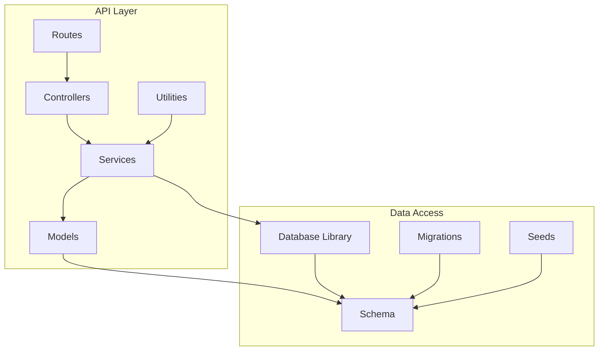
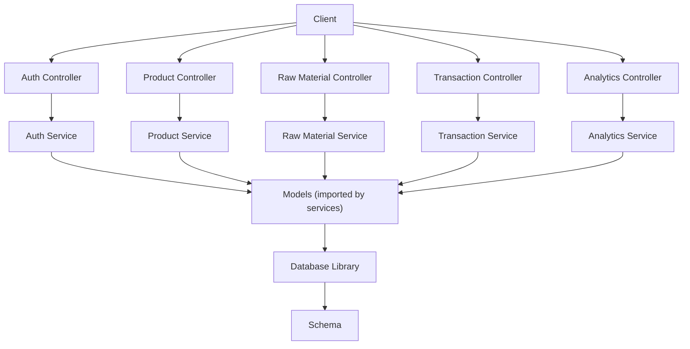
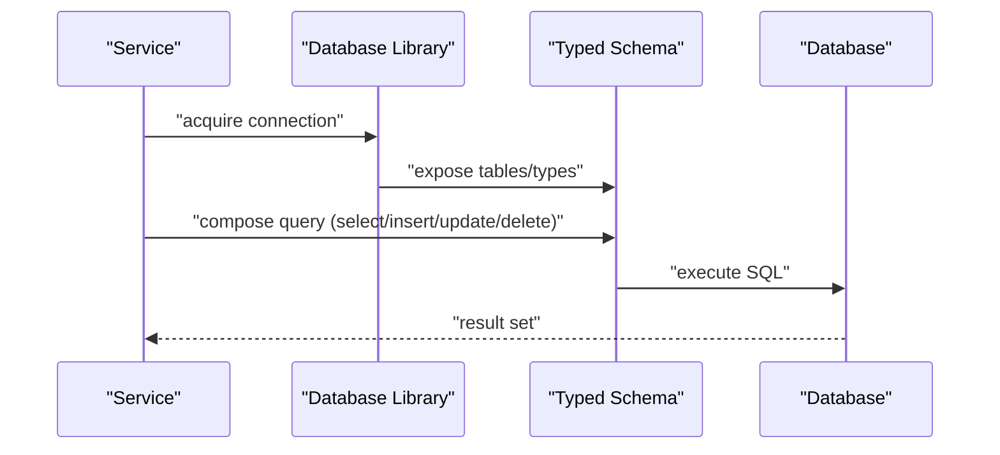
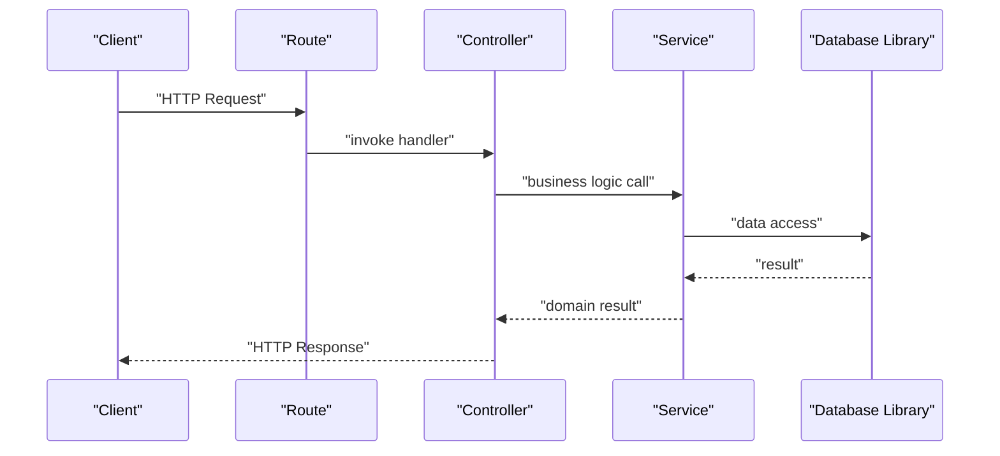
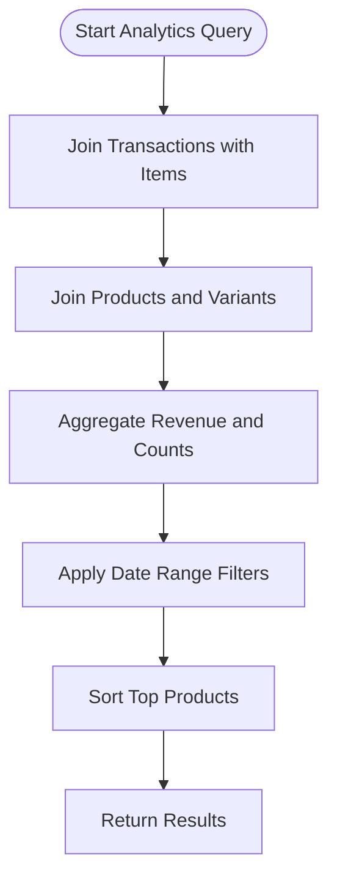
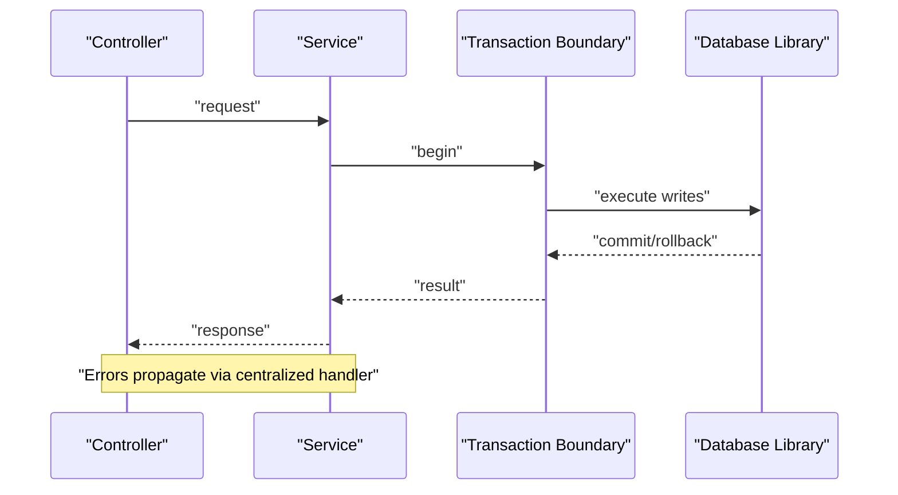
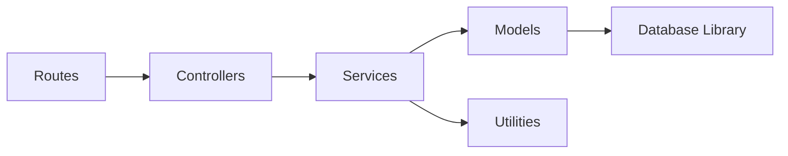

# Data Models & Services

<cite>
**Referenced Files in This Document**
- [db.ts](file://apps/api/src/lib/db.ts)
- [errors.ts](file://apps/api/src/lib/errors.ts)
- [index.ts](file://apps/api/src/index.ts)
- [migrate.ts](file://apps/api/migrate.ts)
- [drizzle.config.ts](file://apps/api/drizzle.config.ts)
- [seed.ts](file://apps/api/src/scripts/seed.ts)
- [seed.ts](file://apps/api/src/seed.ts)
- [auth.controller.ts](file://apps/api/src/controllers/auth.controller.ts)
- [product.controller.ts](file://apps/api/src/controllers/product.controller.ts)
- [rawMaterial.controller.ts](file://apps/api/src/controllers/rawMaterial.controller.ts)
- [transaction.controller.ts](file://apps/api/src/controllers/transaction.controller.ts)
- [analytics.controller.ts](file://apps/api/src/controllers/analytics.controller.ts)
- [auth.service.ts](file://apps/api/src/services/auth.service.ts)
- [product.service.ts](file://apps/api/src/services/product.service.ts)
- [rawMaterial.service.ts](file://apps/api/src/services/rawMaterial.service.ts)
- [transaction.service.ts](file://apps/api/src/services/transaction.service.ts)
- [analytics.service.ts](file://apps/api/src/services/analytics.service.ts)
- [shift.service.ts](file://apps/api/src/services/shift.service.ts)
- [cache.ts](file://apps/api/src/utils/cache.ts)
- [users.routes.ts](file://apps/api/src/routes/users.routes.ts)
- [customers.routes.ts](file://apps/api/src/routes/customers.routes.ts)
- [products.routes.ts](file://apps/api/src/routes/products.routes.ts)
- [rawMaterial.routes.ts](file://apps/api/src/routes/rawMaterial.routes.ts)
- [transaction.routes.ts](file://apps/api/src/routes/transaction.routes.ts)
- [analytics.routes.ts](file://apps/api/src/routes/analytics.routes.ts)
- [auth.routes.ts](file://apps/api/src/routes/auth.routes.ts)
- [settings.routes.ts](file://apps/api/src/routes/settings.routes.ts)
- [inventory.routes.ts](file://apps/api/src/routes/inventory.routes.ts)
- [shifts.routes.ts](file://apps/api/src/routes/shifts.routes.ts)
- [upload.routes.ts](file://apps/api/src/routes/upload.routes.ts)
- [whatsapp.routes.ts](file://apps/api/src/routes/whatsapp.routes.ts)
- [index.ts](file://apps/api/api/index.ts)
- [check-db.ts](file://apps/api/check-db.ts)
- [fix-pin.ts](file://apps/api/fix-pin.ts)
- [update-images.ts](file://apps/api/src/update-images.ts)
- [scratch_test_drizzle.ts](file://apps/api/src/scratch_test_drizzle.ts)
- [scratch_test_search.ts](file://apps/api/src/scratch_test_search.ts)
- [test_select.ts](file://apps/api/src/test_select.ts)
- [test_checkout.ts](file://apps/api/src/test_checkout.ts)
- [alter_db.ts](file://apps/api/src/alter_db.ts)
- [run_migration.ts](file://apps/api/scripts/run_migration.ts)
- [0000_dashing_albert_cleary.sql](file://apps/api/drizzle/0000_dashing_albert_cleary.sql)
- [0000_wide_runaways.sql](file://apps/api/migrations/0000_wide_runaways.sql)
- [0001_damp_sunfire.sql](file://apps/api/migrations/0001_damp_sunfire.sql)
- [0002_light_katie_power.sql](file://apps/api/migrations/0002_light_katie_power.sql)
- [0003_tearful_supernaut.sql](file://apps/api/migrations/0003_tearful_supernaut.sql)
- [001_initial_setup.sql](file://apps/api/migrations/001_initial_setup.sql)
</cite>

## Table of Contents
1. [Introduction](#introduction)
2. [Project Structure](#project-structure)
3. [Core Components](#core-components)
4. [Architecture Overview](#architecture-overview)
5. [Detailed Component Analysis](#detailed-component-analysis)
6. [Dependency Analysis](#dependency-analysis)
7. [Performance Considerations](#performance-considerations)
8. [Troubleshooting Guide](#troubleshooting-guide)
9. [Conclusion](#conclusion)
10. [Appendices](#appendices)

## Introduction
This document explains the data models and service layer integration for ARHAT POS, focusing on how Drizzle ORM models map to database tables and handle CRUD operations, the service layer architecture that encapsulates business logic, and the relationships among models, services, and controllers. It also covers complex queries, joins, data transformations, caching strategies, query optimization, validation, error handling, and transaction management.

## Project Structure
The API application organizes data access and business logic into layered components:
- Database connection and schema: centralized in the database library
- Models: imported across services and controllers
- Services: encapsulate business logic and orchestrate data operations
- Controllers: handle HTTP requests and delegate to services
- Routes: define endpoint mappings
- Utilities: caching and shared helpers
- Migrations and seeds: manage schema and initial data



**Section sources**
- [db.ts:1-50](file://apps/api/src/lib/db.ts#L1-L50)
- [index.ts:1-100](file://apps/api/src/index.ts#L1-L100)

## Core Components
- Database library initializes the Drizzle connection and exposes a typed schema for queries.
- Models are imported by services and controllers to perform CRUD and complex operations.
- Services encapsulate business rules and coordinate model interactions.
- Controllers translate HTTP requests into service calls and return structured responses.
- Routes bind endpoints to controllers.
- Utilities provide caching and shared error handling.

Key responsibilities:
- Data modeling and schema mapping via Drizzle ORM
- Transaction boundaries and error propagation
- Validation and transformation of inputs/outputs
- Query composition and optimization
- Caching for read-heavy workloads

**Section sources**
- [db.ts:1-50](file://apps/api/src/lib/db.ts#L1-L50)
- [errors.ts:1-100](file://apps/api/src/lib/errors.ts#L1-L100)
- [auth.service.ts:1-120](file://apps/api/src/services/auth.service.ts#L1-L120)
- [product.service.ts:1-120](file://apps/api/src/services/product.service.ts#L1-L120)
- [rawMaterial.service.ts:1-120](file://apps/api/src/services/rawMaterial.service.ts#L1-L120)
- [transaction.service.ts:1-120](file://apps/api/src/services/transaction.service.ts#L1-L120)
- [analytics.service.ts:1-120](file://apps/api/src/services/analytics.service.ts#L1-L120)

## Architecture Overview
The layered architecture separates concerns:
- Presentation: controllers expose endpoints
- Application: services implement business logic
- Persistence: models and database library handle data access
- Infrastructure: migrations, seeds, and configuration support schema evolution



**Diagram sources**
- [auth.controller.ts:1-120](file://apps/api/src/controllers/auth.controller.ts#L1-L120)
- [product.controller.ts:1-120](file://apps/api/src/controllers/product.controller.ts#L1-L120)
- [rawMaterial.controller.ts:1-120](file://apps/api/src/controllers/rawMaterial.controller.ts#L1-L120)
- [transaction.controller.ts:1-120](file://apps/api/src/controllers/transaction.controller.ts#L1-L120)
- [analytics.controller.ts:1-120](file://apps/api/src/controllers/analytics.controller.ts#L1-L120)
- [auth.service.ts:1-120](file://apps/api/src/services/auth.service.ts#L1-L120)
- [product.service.ts:1-120](file://apps/api/src/services/product.service.ts#L1-L120)
- [rawMaterial.service.ts:1-120](file://apps/api/src/services/rawMaterial.service.ts#L1-L120)
- [transaction.service.ts:1-120](file://apps/api/src/services/transaction.service.ts#L1-L120)
- [analytics.service.ts:1-120](file://apps/api/src/services/analytics.service.ts#L1-L120)
- [db.ts:1-50](file://apps/api/src/lib/db.ts#L1-L50)

## Detailed Component Analysis

### Database Library and Schema
- The database library initializes the Drizzle client and exports a typed schema for use across the application.
- The schema is imported by services and controllers to build queries and enforce type safety.
- Migration and configuration files define the evolving schema and Drizzle setup.



**Diagram sources**
- [db.ts:1-50](file://apps/api/src/lib/db.ts#L1-L50)
- [drizzle.config.ts:1-100](file://apps/api/drizzle.config.ts#L1-L100)

**Section sources**
- [db.ts:1-50](file://apps/api/src/lib/db.ts#L1-L50)
- [drizzle.config.ts:1-100](file://apps/api/drizzle.config.ts#L1-L100)
- [migrate.ts:1-100](file://apps/api/migrate.ts#L1-L100)

### Models Import and Usage Across Services
- Services import models to perform CRUD and complex operations.
- Example imports include users, products, variants, modifiers, transactions, items, customers, raw materials, stocks, and BOMs.
- Controllers import models for specialized endpoints and route handlers.

```mermaid
classDiagram
class AuthService {
+register(userData)
+login(credentials)
+logout(userId)
}
class ProductService {
+createProduct(productData)
+updateProduct(id, data)
+deleteProduct(id)
+findProducts(filters)
}
class RawMaterialService {
+createRawMaterial(data)
+updateStock(itemId, delta)
+calculateBOM(productId)
}
class TransactionService {
+createCheckout(cart, customer)
+settlePayment(txId, method)
+cancelTransaction(txId)
}
class AnalyticsService {
+revenueByPeriod(start, end)
+topProducts(limit)
+salesByCategory()
}
AuthService --> "Models" : "imports"
ProductService --> "Models" : "imports"
RawMaterialService --> "Models" : "imports"
TransactionService --> "Models" : "imports"
AnalyticsService --> "Models" : "imports"
```

**Diagram sources**
- [auth.service.ts:1-120](file://apps/api/src/services/auth.service.ts#L1-L120)
- [product.service.ts:1-120](file://apps/api/src/services/product.service.ts#L1-L120)
- [rawMaterial.service.ts:1-120](file://apps/api/src/services/rawMaterial.service.ts#L1-L120)
- [transaction.service.ts:1-120](file://apps/api/src/services/transaction.service.ts#L1-L120)
- [analytics.service.ts:1-120](file://apps/api/src/services/analytics.service.ts#L1-L120)

**Section sources**
- [auth.service.ts:1-120](file://apps/api/src/services/auth.service.ts#L1-L120)
- [product.service.ts:1-120](file://apps/api/src/services/product.service.ts#L1-L120)
- [rawMaterial.service.ts:1-120](file://apps/api/src/services/rawMaterial.service.ts#L1-L120)
- [transaction.service.ts:1-120](file://apps/api/src/services/transaction.service.ts#L1-L120)
- [analytics.service.ts:1-120](file://apps/api/src/services/analytics.service.ts#L1-L120)

### Controllers and Route Integration
- Controllers receive HTTP requests, validate inputs, and delegate to services.
- Routes define endpoint mappings and bind controllers to paths.
- Example routes include users, customers, products, raw materials, transactions, analytics, settings, inventory, shifts, and uploads.



**Diagram sources**
- [users.routes.ts:1-100](file://apps/api/src/routes/users.routes.ts#L1-L100)
- [customers.routes.ts:1-100](file://apps/api/src/routes/customers.routes.ts#L1-L100)
- [products.routes.ts:1-100](file://apps/api/src/routes/products.routes.ts#L1-L100)
- [rawMaterial.routes.ts:1-100](file://apps/api/src/routes/rawMaterial.routes.ts#L1-L100)
- [transaction.routes.ts:1-100](file://apps/api/src/routes/transaction.routes.ts#L1-L100)
- [analytics.routes.ts:1-100](file://apps/api/src/routes/analytics.routes.ts#L1-L100)
- [auth.routes.ts:1-100](file://apps/api/src/routes/auth.routes.ts#L1-L100)
- [settings.routes.ts:1-100](file://apps/api/src/routes/settings.routes.ts#L1-L100)
- [inventory.routes.ts:1-100](file://apps/api/src/routes/inventory.routes.ts#L1-L100)
- [shifts.routes.ts:1-100](file://apps/api/src/routes/shifts.routes.ts#L1-L100)
- [upload.routes.ts:1-100](file://apps/api/src/routes/upload.routes.ts#L1-L100)
- [whatsapp.routes.ts:1-100](file://apps/api/src/routes/whatsapp.routes.ts#L1-L100)

**Section sources**
- [auth.controller.ts:1-120](file://apps/api/src/controllers/auth.controller.ts#L1-L120)
- [product.controller.ts:1-120](file://apps/api/src/controllers/product.controller.ts#L1-L120)
- [rawMaterial.controller.ts:1-120](file://apps/api/src/controllers/rawMaterial.controller.ts#L1-L120)
- [transaction.controller.ts:1-120](file://apps/api/src/controllers/transaction.controller.ts#L1-L120)
- [analytics.controller.ts:1-120](file://apps/api/src/controllers/analytics.controller.ts#L1-L120)

### Complex Queries, Joins, and Transformations
- Analytics service performs revenue aggregation and top-product reporting using joins across transactions, items, and products.
- Transaction service composes checkout workflows with payment settlement and cancellation logic.
- Raw material service calculates BOM impacts and updates stock quantities atomically.
- Product service manages variants and modifiers for dynamic pricing and customization.



**Diagram sources**
- [analytics.service.ts:1-120](file://apps/api/src/services/analytics.service.ts#L1-L120)

**Section sources**
- [analytics.service.ts:1-120](file://apps/api/src/services/analytics.service.ts#L1-L120)
- [transaction.service.ts:1-120](file://apps/api/src/services/transaction.service.ts#L1-L120)
- [rawMaterial.service.ts:1-120](file://apps/api/src/services/rawMaterial.service.ts#L1-L120)
- [product.service.ts:1-120](file://apps/api/src/services/product.service.ts#L1-L120)

### Caching Strategies and Query Optimization
- A caching utility exists for read-heavy operations to reduce database load.
- Recommendations include:
  - Using selective field projections to minimize payload sizes
  - Applying pagination for large result sets
  - Indexing frequently filtered columns (e.g., product categories, dates)
  - Leveraging connection pooling and prepared statements
  - Implementing cache invalidation on write operations

**Section sources**
- [cache.ts:1-100](file://apps/api/src/utils/cache.ts#L1-L100)

### Validation, Error Handling, and Transactions
- Centralized error handling ensures consistent error responses across services.
- Services should wrap critical sequences in transactions to maintain atomicity.
- Validation occurs at controller boundaries and within services for business rules.



**Diagram sources**
- [errors.ts:1-100](file://apps/api/src/lib/errors.ts#L1-L100)
- [auth.service.ts:1-120](file://apps/api/src/services/auth.service.ts#L1-L120)
- [transaction.service.ts:1-120](file://apps/api/src/services/transaction.service.ts#L1-L120)

**Section sources**
- [errors.ts:1-100](file://apps/api/src/lib/errors.ts#L1-L100)
- [auth.service.ts:1-120](file://apps/api/src/services/auth.service.ts#L1-L120)
- [transaction.service.ts:1-120](file://apps/api/src/services/transaction.service.ts#L1-L120)

## Dependency Analysis
- Controllers depend on services for business logic.
- Services depend on models and the database library.
- Routes depend on controllers.
- Utilities depend on services for caching and shared logic.
- Models depend on the typed schema exported by the database library.



**Diagram sources**
- [users.routes.ts:1-100](file://apps/api/src/routes/users.routes.ts#L1-L100)
- [auth.controller.ts:1-120](file://apps/api/src/controllers/auth.controller.ts#L1-L120)
- [auth.service.ts:1-120](file://apps/api/src/services/auth.service.ts#L1-L120)
- [db.ts:1-50](file://apps/api/src/lib/db.ts#L1-L50)

**Section sources**
- [users.routes.ts:1-100](file://apps/api/src/routes/users.routes.ts#L1-L100)
- [auth.controller.ts:1-120](file://apps/api/src/controllers/auth.controller.ts#L1-L120)
- [auth.service.ts:1-120](file://apps/api/src/services/auth.service.ts#L1-L120)
- [db.ts:1-50](file://apps/api/src/lib/db.ts#L1-L50)

## Performance Considerations
- Prefer batch operations for bulk inserts/updates
- Use indexes on join and filter keys
- Minimize N+1 queries via eager loading or single-query joins
- Cache frequently accessed lookup tables (e.g., categories, units)
- Monitor slow queries and apply query plan analysis
- Keep DTOs minimal; avoid unnecessary columns in selects

[No sources needed since this section provides general guidance]

## Troubleshooting Guide
- Use the centralized error handler to standardize error responses and logging.
- Verify database connectivity and schema alignment using migration and seed scripts.
- Inspect controller-to-service call flows to isolate failures.
- Validate transaction boundaries around critical updates.

**Section sources**
- [errors.ts:1-100](file://apps/api/src/lib/errors.ts#L1-L100)
- [check-db.ts:1-100](file://apps/api/check-db.ts#L1-L100)
- [fix-pin.ts:1-100](file://apps/api/fix-pin.ts#L1-L100)

## Conclusion
ARHAT POS employs a clean layered architecture with Drizzle ORM for type-safe data access. Services encapsulate business logic and orchestrate model interactions, while controllers and routes provide a clear HTTP boundary. The design supports complex queries, joins, and transformations, with room for caching and optimization. Robust error handling and transaction management ensure reliability across the data access layer.

[No sources needed since this section summarizes without analyzing specific files]

## Appendices

### Schema Evolution and Seeding
- Migrations define incremental schema changes.
- Seeds populate initial data for development and testing.
- Migration runner scripts automate deployment steps.

**Section sources**
- [migrate.ts:1-100](file://apps/api/migrate.ts#L1-L100)
- [run_migration.ts:1-100](file://apps/api/scripts/run_migration.ts#L1-L100)
- [seed.ts:1-100](file://apps/api/src/scripts/seed.ts#L1-L100)
- [seed.ts:1-100](file://apps/api/src/seed.ts#L1-L100)
- [0000_dashing_albert_cleary.sql:1-200](file://apps/api/drizzle/0000_dashing_albert_cleary.sql#L1-L200)
- [0000_wide_runaways.sql:1-200](file://apps/api/migrations/0000_wide_runaways.sql#L1-L200)
- [0001_damp_sunfire.sql:1-200](file://apps/api/migrations/0001_damp_sunfire.sql#L1-L200)
- [0002_light_katie_power.sql:1-200](file://apps/api/migrations/0002_light_katie_power.sql#L1-L200)
- [0003_tearful_supernaut.sql:1-200](file://apps/api/migrations/0003_tearful_supernaut.sql#L1-L200)
- [001_initial_setup.sql:1-200](file://apps/api/migrations/001_initial_setup.sql#L1-L200)

### Testing and Development Utilities
- Drizzle scratch tests demonstrate query patterns and data transformations.
- Checkout and selection tests exercise transaction workflows.
- Image update utilities support media management.

**Section sources**
- [scratch_test_drizzle.ts:1-100](file://apps/api/src/scratch_test_drizzle.ts#L1-L100)
- [scratch_test_search.ts:1-100](file://apps/api/src/scratch_test_search.ts#L1-L100)
- [test_select.ts:1-100](file://apps/api/src/test_select.ts#L1-L100)
- [test_checkout.ts:1-100](file://apps/api/src/test_checkout.ts#L1-L100)
- [update-images.ts:1-100](file://apps/api/src/update-images.ts#L1-L100)