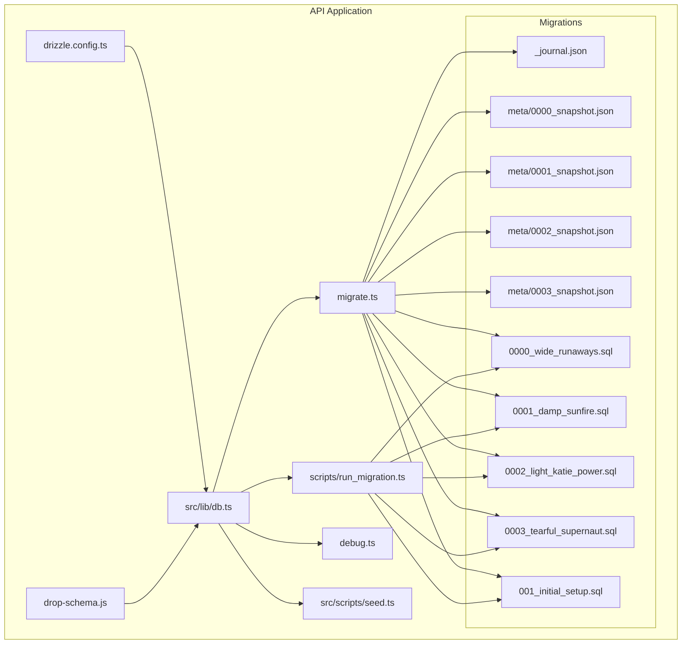
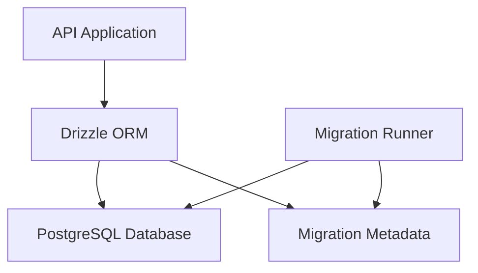
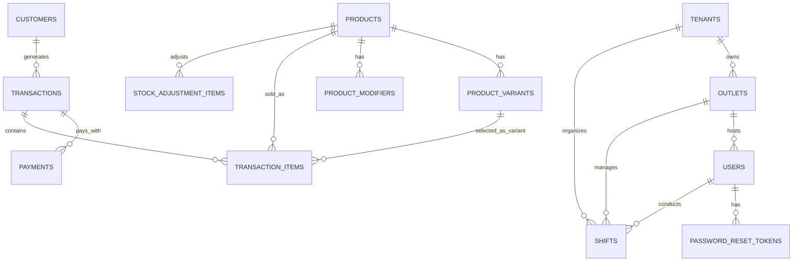
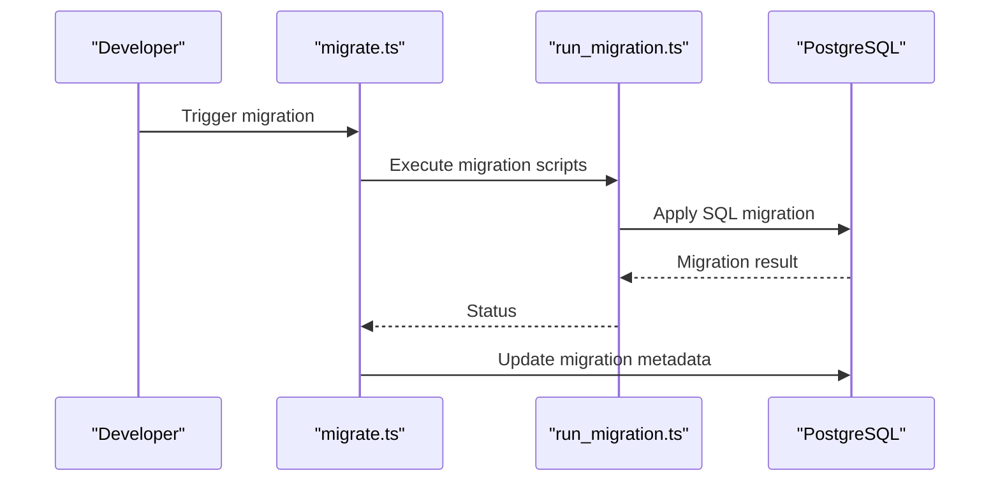
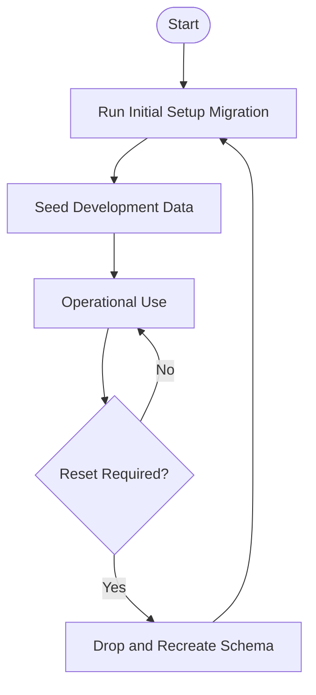
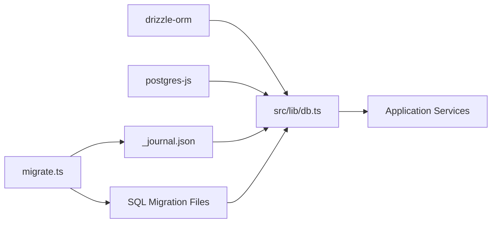

# Database Design & Management

<cite>
**Referenced Files in This Document**
- [db.ts](file://apps/api/src/lib/db.ts)
- [drizzle.config.ts](file://apps/api/drizzle.config.ts)
- [migrate.ts](file://apps/api/migrate.ts)
- [run_migration.ts](file://apps/api/scripts/run_migration.ts)
- [run-migration-0003.js](file://apps/api/run-migration-0003.js)
- [migrate_variants.ts](file://apps/api/migrate_variants.ts)
- [drop-schema.js](file://apps/api/drop-schema.js)
- [debug.ts](file://apps/api/debug.ts)
- [seed.ts](file://apps/api/src/scripts/seed.ts)
- [0000_wide_runaways.sql](file://apps/api/migrations/0000_wide_runaways.sql)
- [0001_damp_sunfire.sql](file://apps/api/migrations/0001_damp_sunfire.sql)
- [0002_light_katie_power.sql](file://apps/api/migrations/0002_light_katie_power.sql)
- [0003_tearful_supernaut.sql](file://apps/api/migrations/0003_tearful_supernaut.sql)
- [001_initial_setup.sql](file://apps/api/migrations/001_initial_setup.sql)
- [0000_snapshot.json](file://apps/api/migrations/meta/0000_snapshot.json)
- [0001_snapshot.json](file://apps/api/migrations/meta/0001_snapshot.json)
- [0002_snapshot.json](file://apps/api/migrations/meta/0002_snapshot.json)
- [0003_snapshot.json](file://apps/api/migrations/meta/0003_snapshot.json)
- [0000_dashing_albert_cleary.sql](file://apps/api/drizzle/0000_dashing_albert_cleary.sql)
- [0000_snapshot.json](file://apps/api/drizzle/meta/0000_snapshot.json)
- [_journal.json](file://apps/api/migrations/meta/_journal.json)
- [package.json](file://apps/api/package.json)
</cite>

## Table of Contents
1. [Introduction](#introduction)
2. [Project Structure](#project-structure)
3. [Core Components](#core-components)
4. [Architecture Overview](#architecture-overview)
5. [Detailed Component Analysis](#detailed-component-analysis)
6. [Dependency Analysis](#dependency-analysis)
7. [Performance Considerations](#performance-considerations)
8. [Troubleshooting Guide](#troubleshooting-guide)
9. [Conclusion](#conclusion)
10. [Appendices](#appendices)

## Introduction
This document provides comprehensive database design and management documentation for the ARHAT POS system. It covers the entity relationship model, field definitions, constraints, indexes, and referential integrity enforced via Drizzle ORM. It also documents schema evolution through migration management, data access patterns, caching strategies, performance considerations, lifecycle and retention policies, migration paths and rollbacks, security and privacy controls, and operational procedures such as initialization, seeding, and maintenance.

## Project Structure
The database layer is implemented in the API application using Drizzle ORM with PostgreSQL. Migrations are managed via SQL scripts and Drizzle’s migration metadata snapshots. The database connection is configured centrally and used across services.

**Diagram sources**
- [drizzle.config.ts](file://apps/api/drizzle.config.ts)
- [db.ts](file://apps/api/src/lib/db.ts)
- [migrate.ts](file://apps/api/migrate.ts)
- [run_migration.ts](file://apps/api/scripts/run_migration.ts)
- [drop-schema.js](file://apps/api/drop-schema.js)
- [debug.ts](file://apps/api/debug.ts)
- [seed.ts](file://apps/api/src/scripts/seed.ts)
- [_journal.json](file://apps/api/migrations/meta/_journal.json)
- [0000_snapshot.json](file://apps/api/migrations/meta/0000_snapshot.json)
- [0001_snapshot.json](file://apps/api/migrations/meta/0001_snapshot.json)
- [0002_snapshot.json](file://apps/api/migrations/meta/0002_snapshot.json)
- [0003_snapshot.json](file://apps/api/migrations/meta/0003_snapshot.json)
- [0000_wide_runaways.sql](file://apps/api/migrations/0000_wide_runaways.sql)
- [0001_damp_sunfire.sql](file://apps/api/migrations/0001_damp_sunfire.sql)
- [0002_light_katie_power.sql](file://apps/api/migrations/0002_light_katie_power.sql)
- [0003_tearful_supernaut.sql](file://apps/api/migrations/0003_tearful_supernaut.sql)
- [001_initial_setup.sql](file://apps/api/migrations/001_initial_setup.sql)

**Section sources**
- [drizzle.config.ts](file://apps/api/drizzle.config.ts)
- [db.ts](file://apps/api/src/lib/db.ts)
- [migrate.ts](file://apps/api/migrate.ts)
- [run_migration.ts](file://apps/api/scripts/run_migration.ts)
- [drop-schema.js](file://apps/api/drop-schema.js)
- [debug.ts](file://apps/api/debug.ts)
- [seed.ts](file://apps/api/src/scripts/seed.ts)
- [_journal.json](file://apps/api/migrations/meta/_journal.json)
- [0000_snapshot.json](file://apps/api/migrations/meta/0000_snapshot.json)
- [0001_snapshot.json](file://apps/api/migrations/meta/0001_snapshot.json)
- [0002_snapshot.json](file://apps/api/migrations/meta/0002_snapshot.json)
- [0003_snapshot.json](file://apps/api/migrations/meta/0003_snapshot.json)
- [0000_wide_runaways.sql](file://apps/api/migrations/0000_wide_runaways.sql)
- [0001_damp_sunfire.sql](file://apps/api/migrations/0001_damp_sunfire.sql)
- [0002_light_katie_power.sql](file://apps/api/migrations/0002_light_katie_power.sql)
- [0003_tearful_supernaut.sql](file://apps/api/migrations/0003_tearful_supernaut.sql)
- [001_initial_setup.sql](file://apps/api/migrations/001_initial_setup.sql)

## Core Components
- Database connection and schema binding: Centralized in the database library module, which initializes the PostgreSQL client and binds it to the Drizzle ORM schema.
- Migration orchestration: A dedicated migration script coordinates applying SQL migrations and updating Drizzle’s migration metadata.
- Migration runtime runner: A script executes individual migration SQL files against the target database.
- Schema reset: A maintenance script drops and recreates the public schema for controlled resets.
- Debugging and testing: A small script demonstrates querying transactions for diagnostics.
- Seeding: A seed script initializes baseline data for development and testing.

Key responsibilities:
- Connection management and environment-driven configuration
- Migration execution and metadata synchronization
- Operational maintenance and diagnostics
- Data initialization

**Section sources**
- [db.ts](file://apps/api/src/lib/db.ts)
- [migrate.ts](file://apps/api/migrate.ts)
- [run_migration.ts](file://apps/api/scripts/run_migration.ts)
- [drop-schema.js](file://apps/api/drop-schema.js)
- [debug.ts](file://apps/api/debug.ts)
- [seed.ts](file://apps/api/src/scripts/seed.ts)

## Architecture Overview
The database architecture centers on PostgreSQL with Drizzle ORM for schema modeling and migrations. The API application configures the database connection and exposes migration and maintenance utilities.

**Diagram sources**
- [db.ts](file://apps/api/src/lib/db.ts)
- [migrate.ts](file://apps/api/migrate.ts)
- [drizzle.config.ts](file://apps/api/drizzle.config.ts)

## Detailed Component Analysis

### Entity Relationship Model
The ER model is derived from migration snapshots and SQL scripts. The following entities and relationships are established:

- Tenants: Top-level tenant container.
- Outlets: Physical locations under tenants.
- Users: Personnel associated with outlets and tenants.
- Password Reset Tokens: Tokenized password reset records linked to Users.
- Products: Core product catalog.
- Product Variants: Product variants with SKU and pricing.
- Product Modifiers: Product modifiers with optional pricing.
- Transaction Items: Line items within Transactions, optionally linked to Product Variants and modifiers.
- Payments: Payment records linked to Transactions.
- Customers: Customer profiles.
- Shifts: Cashier shift records linking Users, Outlets, and Tenants.
- Stock Adjustment Items: Inventory adjustment line items.
- Transactions: Sale records with transaction number, totals, and timestamps.

**Diagram sources**
- [0000_snapshot.json](file://apps/api/migrations/meta/0000_snapshot.json)
- [0001_snapshot.json](file://apps/api/migrations/meta/0001_snapshot.json)
- [0002_snapshot.json](file://apps/api/migrations/meta/0002_snapshot.json)
- [0003_snapshot.json](file://apps/api/migrations/meta/0003_snapshot.json)

### Field Definitions, Data Types, Keys, Indexes, and Constraints
Below are the core tables and their attributes, keys, indexes, and constraints inferred from migration snapshots and SQL scripts.

- Tenants
  - Fields: id (uuid, PK), name (varchar), created_at (timestamp), updated_at (timestamp)
  - Constraints: Composite primary key (none), unique constraints (none), foreign keys (none)
  - Indexes: none

- Outlets
  - Fields: id (uuid, PK), tenant_id (uuid, FK), name (varchar), location (text), created_at (timestamp), updated_at (timestamp)
  - Constraints: Foreign key to Tenants.id
  - Indexes: none

- Users
  - Fields: id (uuid, PK), outlet_id (uuid, FK), email (varchar, unique), password_hash (varchar), role (varchar), created_at (timestamp), updated_at (timestamp)
  - Constraints: Unique constraint on email, Foreign key to Outlets.id
  - Indexes: none

- Password Reset Tokens
  - Fields: id (uuid, PK), user_id (uuid, FK), token (varchar, unique), expires_at (timestamp), used_at (timestamp)
  - Constraints: Unique constraint on token, Foreign key to Users.id
  - Indexes: none

- Products
  - Fields: id (uuid, PK), outlet_id (uuid, FK), name (varchar), description (text), category (varchar), created_at (timestamp), updated_at (timestamp)
  - Constraints: Foreign key to Outlets.id
  - Indexes: none

- Product Variants
  - Fields: id (uuid, PK), product_id (uuid, FK), name (varchar), sku (varchar), price (varchar), stock_quantity (varchar), is_active (boolean)
  - Constraints: Foreign key to Products.id
  - Indexes: none

- Product Modifiers
  - Fields: id (uuid, PK), product_id (uuid, FK), name (varchar), price (varchar), is_active (boolean)
  - Constraints: Foreign key to Products.id
  - Indexes: none

- Customers
  - Fields: id (uuid, PK), outlet_id (uuid, FK), name (varchar), phone (varchar), email (varchar), created_at (timestamp), updated_at (timestamp)
  - Constraints: Foreign key to Outlets.id
  - Indexes: none

- Transactions
  - Fields: id (uuid, PK), outlet_id (uuid, FK), customer_id (uuid, FK), transaction_number (varchar), subtotal (varchar), tax (varchar), total_amount (varchar), status (varchar), created_at (timestamp), updated_at (timestamp)
  - Constraints: Foreign keys to Outlets.id and Customers.id
  - Indexes: transaction_number, created_at

- Transaction Items
  - Fields: id (uuid, PK), transaction_id (uuid, FK), product_id (uuid, FK), quantity (numeric), unit_price (varchar), total_price (varchar), variant_id (uuid, FK), variant_name (varchar), modifiers (varchar)
  - Constraints: Foreign keys to Transactions.id, Products.id, Product Variants.id
  - Indexes: none

- Payments
  - Fields: id (uuid, PK), transaction_id (uuid, FK), payment_method (varchar), amount (varchar), reference_number (varchar), status (varchar), created_at (timestamp)
  - Constraints: Foreign key to Transactions.id
  - Indexes: none

- Shifts
  - Fields: id (uuid, PK), tenant_id (uuid, FK), cashier_id (uuid, FK), outlet_id (uuid, FK), start_time (timestamp), end_time (timestamp), created_at (timestamp)
  - Constraints: Foreign keys to Tenants.id, Users.id, Outlets.id
  - Indexes: none

- Stock Adjustment Items
  - Fields: id (uuid, PK), product_id (uuid, FK), quantity_adjusted (numeric), reason (varchar), created_at (timestamp)
  - Constraints: Foreign key to Products.id
  - Indexes: none

Notes:
- Data types are inferred from snapshots and SQL scripts.
- Primary keys are explicitly marked.
- Unique constraints are explicitly listed in snapshots.
- Foreign keys are explicitly listed in snapshots.
- Indexes are explicitly created in later migrations.

**Section sources**
- [0000_snapshot.json](file://apps/api/migrations/meta/0000_snapshot.json)
- [0001_snapshot.json](file://apps/api/migrations/meta/0001_snapshot.json)
- [0002_snapshot.json](file://apps/api/migrations/meta/0002_snapshot.json)
- [0003_snapshot.json](file://apps/api/migrations/meta/0003_snapshot.json)
- [0000_wide_runaways.sql](file://apps/api/migrations/0000_wide_runaways.sql)
- [0001_damp_sunfire.sql](file://apps/api/migrations/0001_damp_sunfire.sql)
- [0002_light_katie_power.sql](file://apps/api/migrations/0002_light_katie_power.sql)
- [0003_tearful_supernaut.sql](file://apps/api/migrations/0003_tearful_supernaut.sql)
- [001_initial_setup.sql](file://apps/api/migrations/001_initial_setup.sql)

### Data Validation Rules and Business Rules
- Uniqueness: Email uniqueness for Users; token uniqueness for Password Reset Tokens; transaction_number uniqueness for Transactions.
- Referential integrity: All foreign keys enforce parent-child relationships across Tenants, Outlets, Users, Products, Product Variants, Product Modifiers, Customers, Transactions, Transaction Items, Payments, and Shifts.
- Enum-like constraints: Fields such as status and payment_method are constrained to predefined string values; enforcement occurs at application level or via database checks if defined.
- Numeric precision: Monetary fields are stored as variable-length strings to avoid floating-point rounding issues; application-level parsing is expected.
- Timestamps: created_at and updated_at fields track record lifecycle; updated_at is typically updated on row modifications.

**Section sources**
- [0000_snapshot.json](file://apps/api/migrations/meta/0000_snapshot.json)
- [0001_snapshot.json](file://apps/api/migrations/meta/0001_snapshot.json)
- [0002_snapshot.json](file://apps/api/migrations/meta/0002_snapshot.json)
- [0003_snapshot.json](file://apps/api/migrations/meta/0003_snapshot.json)

### Database Schema Evolution Through Migration Management
- Drizzle-based migrations: The project maintains migration metadata snapshots and SQL scripts. The migration orchestrator applies SQL files and updates metadata.
- Manual migrations: Additional migrations (e.g., adding variants and modifiers) are executed via standalone scripts that create tables and alter existing ones.
- Index creation: Subsequent migrations introduce indexes on frequently queried columns (e.g., customers.phone, transactions.transaction_number, transactions.created_at).
- Journal tracking: A journal file tracks applied migrations to prevent reapplication.

**Diagram sources**
- [migrate.ts](file://apps/api/migrate.ts)
- [run_migration.ts](file://apps/api/scripts/run_migration.ts)
- [_journal.json](file://apps/api/migrations/meta/_journal.json)

**Section sources**
- [migrate.ts](file://apps/api/migrate.ts)
- [run_migration.ts](file://apps/api/scripts/run_migration.ts)
- [0000_dashing_albert_cleary.sql](file://apps/api/drizzle/0000_dashing_albert_cleary.sql)
- [0000_snapshot.json](file://apps/api/drizzle/meta/0000_snapshot.json)
- [0000_snapshot.json](file://apps/api/migrations/meta/0000_snapshot.json)
- [0001_snapshot.json](file://apps/api/migrations/meta/0001_snapshot.json)
- [0002_snapshot.json](file://apps/api/migrations/meta/0002_snapshot.json)
- [0003_snapshot.json](file://apps/api/migrations/meta/0003_snapshot.json)
- [0000_wide_runaways.sql](file://apps/api/migrations/0000_wide_runaways.sql)
- [0001_damp_sunfire.sql](file://apps/api/migrations/0001_damp_sunfire.sql)
- [0002_light_katie_power.sql](file://apps/api/migrations/0002_light_katie_power.sql)
- [0003_tearful_supernaut.sql](file://apps/api/migrations/0003_tearful_supernaut.sql)
- [001_initial_setup.sql](file://apps/api/migrations/001_initial_setup.sql)

### Data Access Patterns, Caching Strategies, and Performance Considerations
- Connection pooling and prepared statements: The database client is configured to disable preparation to align with serverless environments; consider enabling prepared statements in traditional deployments for performance.
- Indexes: Indexes on customers.phone, transactions.transaction_number, and transactions.created_at improve query performance for common filters.
- Partitioning and materialization: For high-volume reporting, consider partitioning transactions by date or creating summary tables.
- Caching: Implement application-level caching for frequently accessed product catalogs and customer profiles; cache invalidation should occur on write operations.
- Batch operations: Use batch inserts for seeding and bulk data loads to reduce round trips.

**Section sources**
- [db.ts](file://apps/api/src/lib/db.ts)
- [run-migration-0003.js](file://apps/api/run-migration-0003.js)

### Data Lifecycle, Retention Policies, and Archival Rules
- Retention: Define tenant-level retention policies for transactions and related records (e.g., retain completed transactions for 7 years).
- Archival: Archive old transactions to cold storage or separate schema/tablespace after retention period.
- Purging: Implement scheduled purges with soft-delete flags or logical deletion to preserve audit trails.
- Compliance: Ensure compliance with local regulations for financial data retention and anonymization.

[No sources needed since this section provides general guidance]

### Data Security, Privacy, and Access Control
- Secrets management: Store DATABASE_URL and other secrets in environment variables; avoid committing credentials to source control.
- SSL/TLS: Enforce SSL connections for database connectivity.
- Least privilege: Grant minimal required privileges per environment (development, staging, production).
- Encryption: Encrypt sensitive fields at rest if required by policy.
- Audit logging: Track schema changes and critical data modifications.

**Section sources**
- [db.ts](file://apps/api/src/lib/db.ts)
- [package.json](file://apps/api/package.json)

### Database Initialization, Seeding, and Maintenance Procedures
- Initialization: Run the initial setup migration to create base schema.
- Seeding: Use the seed script to populate development data.
- Maintenance: Drop and recreate the public schema when resetting the environment.
- Diagnostics: Use the debug script to validate connectivity and basic queries.

**Diagram sources**
- [001_initial_setup.sql](file://apps/api/migrations/001_initial_setup.sql)
- [seed.ts](file://apps/api/src/scripts/seed.ts)
- [drop-schema.js](file://apps/api/drop-schema.js)

**Section sources**
- [001_initial_setup.sql](file://apps/api/migrations/001_initial_setup.sql)
- [seed.ts](file://apps/api/src/scripts/seed.ts)
- [drop-schema.js](file://apps/api/drop-schema.js)
- [debug.ts](file://apps/api/debug.ts)

## Dependency Analysis
The database layer depends on Drizzle ORM and PostgreSQL. Migration orchestration depends on migration scripts and metadata. The application depends on the database library for all data operations.

**Diagram sources**
- [db.ts](file://apps/api/src/lib/db.ts)
- [migrate.ts](file://apps/api/migrate.ts)
- [_journal.json](file://apps/api/migrations/meta/_journal.json)
- [0000_wide_runaways.sql](file://apps/api/migrations/0000_wide_runaways.sql)
- [0001_damp_sunfire.sql](file://apps/api/migrations/0001_damp_sunfire.sql)
- [0002_light_katie_power.sql](file://apps/api/migrations/0002_light_katie_power.sql)
- [0003_tearful_supernaut.sql](file://apps/api/migrations/0003_tearful_supernaut.sql)
- [001_initial_setup.sql](file://apps/api/migrations/001_initial_setup.sql)

**Section sources**
- [db.ts](file://apps/api/src/lib/db.ts)
- [migrate.ts](file://apps/api/migrate.ts)
- [_journal.json](file://apps/api/migrations/meta/_journal.json)
- [0000_wide_runaways.sql](file://apps/api/migrations/0000_wide_runaways.sql)
- [0001_damp_sunfire.sql](file://apps/api/migrations/0001_damp_sunfire.sql)
- [0002_light_katie_power.sql](file://apps/api/migrations/0002_light_katie_power.sql)
- [0003_tearful_supernaut.sql](file://apps/api/migrations/0003_tearful_supernaut.sql)
- [001_initial_setup.sql](file://apps/api/migrations/001_initial_setup.sql)

## Performance Considerations
- Use indexes on frequently filtered columns (e.g., customers.phone, transactions.transaction_number, transactions.created_at).
- Normalize for integrity; denormalize selectively for read-heavy reporting workloads.
- Monitor slow queries and add composite indexes as needed.
- Consider connection limits and pooling strategies aligned with deployment model.

[No sources needed since this section provides general guidance]

## Troubleshooting Guide
- Connection failures: Verify DATABASE_URL and environment configuration; confirm SSL settings.
- Migration errors: Review migration SQL and metadata; ensure journal alignment; rerun migration scripts individually.
- Schema inconsistencies: Drop and recreate schema as a last resort; backup before proceeding.
- Query diagnostics: Use the debug script to validate connectivity and basic transaction queries.

**Section sources**
- [db.ts](file://apps/api/src/lib/db.ts)
- [migrate.ts](file://apps/api/migrate.ts)
- [run_migration.ts](file://apps/api/scripts/run_migration.ts)
- [drop-schema.js](file://apps/api/drop-schema.js)
- [debug.ts](file://apps/api/debug.ts)

## Conclusion
ARHAT POS employs a robust, Drizzle ORM–backed PostgreSQL design with explicit migrations and metadata tracking. The schema enforces referential integrity and supports core POS operations including products, variants, modifiers, transactions, payments, customers, shifts, and inventory adjustments. Operational procedures cover initialization, seeding, maintenance, and diagnostics. Security and performance considerations are addressed through environment-driven configuration, indexing, and access control.

[No sources needed since this section summarizes without analyzing specific files]

## Appendices
- Sample data structures: See seed script for typical rows and relationships.
- Migration rollback: Revert to previous snapshot and reapply selective migrations; maintain backups.

**Section sources**
- [seed.ts](file://apps/api/src/scripts/seed.ts)
- [0000_snapshot.json](file://apps/api/migrations/meta/0000_snapshot.json)
- [0001_snapshot.json](file://apps/api/migrations/meta/0001_snapshot.json)
- [0002_snapshot.json](file://apps/api/migrations/meta/0002_snapshot.json)
- [0003_snapshot.json](file://apps/api/migrations/meta/0003_snapshot.json)