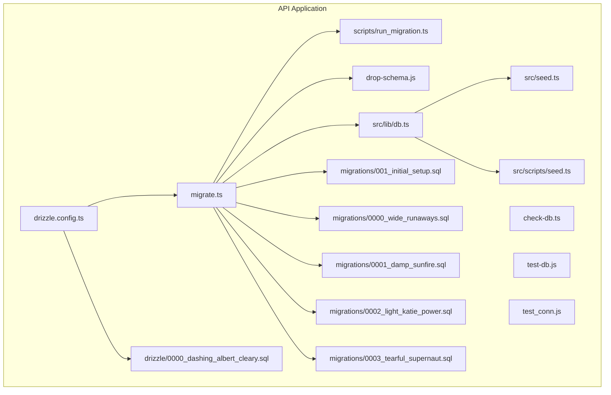
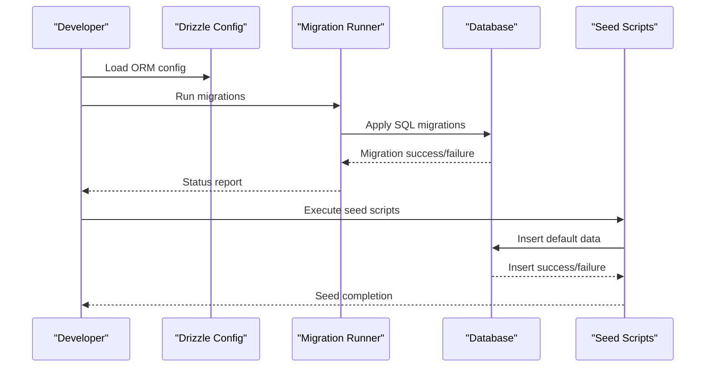
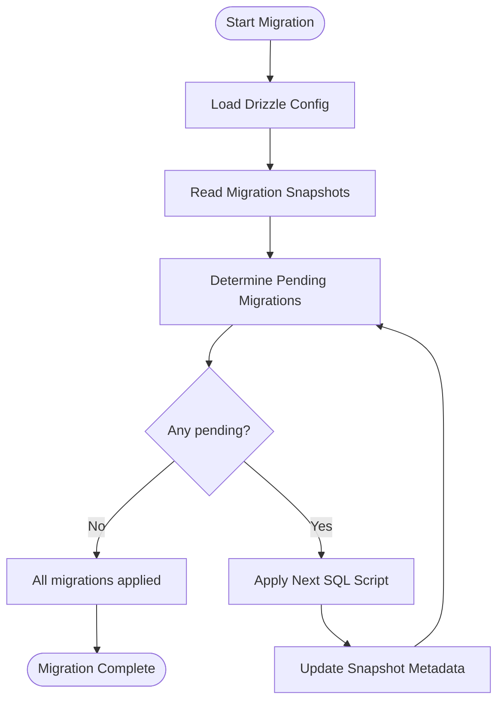
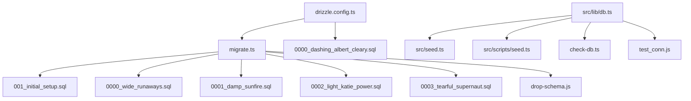

# Database Initialization & Seeding

<cite>
**Referenced Files in This Document**
- [drizzle.config.ts](file://apps/api/drizzle.config.ts)
- [migrate.ts](file://apps/api/migrate.ts)
- [run_migration.ts](file://apps/api/scripts/run_migration.ts)
- [drop-schema.js](file://apps/api/drop-schema.js)
- [check-db.ts](file://apps/api/check-db.ts)
- [test-db.js](file://apps/api/test-db.js)
- [test_conn.js](file://apps/api/test_conn.js)
- [db.ts](file://apps/api/src/lib/db.ts)
- [seed.ts](file://apps/api/src/seed.ts)
- [seed.ts](file://apps/api/src/scripts/seed.ts)
- [001_initial_setup.sql](file://apps/api/migrations/001_initial_setup.sql)
- [0000_wide_runaways.sql](file://apps/api/migrations/0000_wide_runaways.sql)
- [0001_damp_sunfire.sql](file://apps/api/migrations/0001_damp_sunfire.sql)
- [0002_light_katie_power.sql](file://apps/api/migrations/0002_light_katie_power.sql)
- [0003_tearful_supernaut.sql](file://apps/api/migrations/0003_tearful_supernaut.sql)
- [0000_dashing_albert_cleary.sql](file://apps/api/drizzle/0000_dashing_albert_cleary.sql)
- [package.json](file://apps/api/package.json)
- [vercel.json](file://apps/api/vercel.json)
- [wrangler.toml](file://apps/api/wrangler.toml)
- [docker-compose.yml](file://docker-compose.yml)
</cite>

## Table of Contents
1. [Introduction](#introduction)
2. [Project Structure](#project-structure)
3. [Core Components](#core-components)
4. [Architecture Overview](#architecture-overview)
5. [Detailed Component Analysis](#detailed-component-analysis)
6. [Dependency Analysis](#dependency-analysis)
7. [Performance Considerations](#performance-considerations)
8. [Troubleshooting Guide](#troubleshooting-guide)
9. [Conclusion](#conclusion)
10. [Appendices](#appendices)

## Introduction
This document explains the ARHAT POS database initialization and data seeding procedures. It covers schema creation via migrations, initial data population through seed scripts, environment-specific setup for development, staging, and production, as well as cleanup/reset procedures, backups, restores, health checks, and connection management. The goal is to provide a clear, actionable guide for developers and operators to reliably set up and maintain the database across environments.

## Project Structure
The database-related assets are primarily located under the API application (`apps/api`). Key areas include:
- Drizzle ORM configuration and migration snapshots
- SQL migration scripts for schema evolution
- Migration runner and schema drop utilities
- Health check and connectivity testing scripts
- Database connection library and seed scripts
- Environment configuration for Vercel and Cloudflare Workers

**Diagram sources**
- [drizzle.config.ts](file://apps/api/drizzle.config.ts)
- [migrate.ts](file://apps/api/migrate.ts)
- [run_migration.ts](file://apps/api/scripts/run_migration.ts)
- [drop-schema.js](file://apps/api/drop-schema.js)
- [check-db.ts](file://apps/api/check-db.ts)
- [test-db.js](file://apps/api/test-db.js)
- [test_conn.js](file://apps/api/test_conn.js)
- [db.ts](file://apps/api/src/lib/db.ts)
- [seed.ts](file://apps/api/src/seed.ts)
- [seed.ts](file://apps/api/src/scripts/seed.ts)
- [001_initial_setup.sql](file://apps/api/migrations/001_initial_setup.sql)
- [0000_wide_runaways.sql](file://apps/api/migrations/0000_wide_runaways.sql)
- [0001_damp_sunfire.sql](file://apps/api/migrations/0001_damp_sunfire.sql)
- [0002_light_katie_power.sql](file://apps/api/migrations/0002_light_katie_power.sql)
- [0003_tearful_supernaut.sql](file://apps/api/migrations/0003_tearful_supernaut.sql)
- [0000_dashing_albert_cleary.sql](file://apps/api/drizzle/0000_dashing_albert_cleary.sql)

**Section sources**
- [drizzle.config.ts](file://apps/api/drizzle.config.ts)
- [migrate.ts](file://apps/api/migrate.ts)
- [run_migration.ts](file://apps/api/scripts/run_migration.ts)
- [drop-schema.js](file://apps/api/drop-schema.js)
- [check-db.ts](file://apps/api/check-db.ts)
- [test-db.js](file://apps/api/test-db.js)
- [test_conn.js](file://apps/api/test_conn.js)
- [db.ts](file://apps/api/src/lib/db.ts)
- [seed.ts](file://apps/api/src/seed.ts)
- [seed.ts](file://apps/api/src/scripts/seed.ts)
- [001_initial_setup.sql](file://apps/api/migrations/001_initial_setup.sql)
- [0000_wide_runaways.sql](file://apps/api/migrations/0000_wide_runaways.sql)
- [0001_damp_sunfire.sql](file://apps/api/migrations/0001_damp_sunfire.sql)
- [0002_light_katie_power.sql](file://apps/api/migrations/0002_light_katie_power.sql)
- [0003_tearful_supernaut.sql](file://apps/api/migrations/0003_tearful_supernaut.sql)
- [0000_dashing_albert_cleary.sql](file://apps/api/drizzle/0000_dashing_albert_cleary.sql)

## Core Components
- Drizzle ORM configuration defines database connection settings and migration behavior.
- Migration system manages schema evolution through SQL scripts and snapshot metadata.
- Seed scripts populate default data such as admin users, categories, and system configurations.
- Schema drop script resets the database to a clean state.
- Health and connectivity scripts validate database readiness and connection stability.
- Environment configuration files define deployment-specific settings for Vercel and Cloudflare Workers.

**Section sources**
- [drizzle.config.ts](file://apps/api/drizzle.config.ts)
- [migrate.ts](file://apps/api/migrate.ts)
- [seed.ts](file://apps/api/src/seed.ts)
- [seed.ts](file://apps/api/src/scripts/seed.ts)
- [drop-schema.js](file://apps/api/drop-schema.js)
- [check-db.ts](file://apps/api/check-db.ts)
- [test_conn.js](file://apps/api/test_conn.js)
- [vercel.json](file://apps/api/vercel.json)
- [wrangler.toml](file://apps/api/wrangler.toml)

## Architecture Overview
The database lifecycle follows a predictable flow: configuration → migrations → seeding → operational use → optional cleanup/reset.

**Diagram sources**
- [drizzle.config.ts](file://apps/api/drizzle.config.ts)
- [migrate.ts](file://apps/api/migrate.ts)
- [seed.ts](file://apps/api/src/seed.ts)
- [seed.ts](file://apps/api/src/scripts/seed.ts)

## Detailed Component Analysis

### Drizzle ORM Configuration
- Purpose: Centralizes database connection settings, schema path, and migration configuration.
- Key responsibilities:
  - Define connection parameters and driver behavior.
  - Point to migration directories and snapshot metadata.
  - Control schema generation and snapshot updates during development.

Operational notes:
- Ensure environment variables for credentials are present when loading the configuration.
- Keep migration snapshots synchronized with applied SQL scripts.

**Section sources**
- [drizzle.config.ts](file://apps/api/drizzle.config.ts)

### Migration System
- Purpose: Automate schema creation and evolution across environments.
- Components:
  - Migration runner orchestrates applying SQL scripts in order.
  - SQL scripts define schema changes (tables, indexes, constraints).
  - Snapshot metadata tracks applied migrations and current schema state.

Key migration scripts:
- Initial setup script creates foundational tables and constraints.
- Subsequent scripts introduce incremental changes (e.g., new tables, columns, indexes).
- Drizzle snapshot SQL captures the current schema state for ORM operations.

**Diagram sources**
- [migrate.ts](file://apps/api/migrate.ts)
- [run_migration.ts](file://apps/api/scripts/run_migration.ts)
- [001_initial_setup.sql](file://apps/api/migrations/001_initial_setup.sql)
- [0000_wide_runaways.sql](file://apps/api/migrations/0000_wide_runaways.sql)
- [0001_damp_sunfire.sql](file://apps/api/migrations/0001_damp_sunfire.sql)
- [0002_light_katie_power.sql](file://apps/api/migrations/0002_light_katie_power.sql)
- [0003_tearful_supernaut.sql](file://apps/api/migrations/0003_tearful_supernaut.sql)
- [0000_dashing_albert_cleary.sql](file://apps/api/drizzle/0000_dashing_albert_cleary.sql)

**Section sources**
- [migrate.ts](file://apps/api/migrate.ts)
- [run_migration.ts](file://apps/api/scripts/run_migration.ts)
- [001_initial_setup.sql](file://apps/api/migrations/001_initial_setup.sql)
- [0000_wide_runaways.sql](file://apps/api/migrations/0000_wide_runaways.sql)
- [0001_damp_sunfire.sql](file://apps/api/migrations/0001_damp_sunfire.sql)
- [0002_light_katie_power.sql](file://apps/api/migrations/0002_light_katie_power.sql)
- [0003_tearful_supernaut.sql](file://apps/api/migrations/0003_tearful_supernaut.sql)
- [0000_dashing_albert_cleary.sql](file://apps/api/drizzle/0000_dashing_albert_cleary.sql)

### Database Connection Library
- Purpose: Provides a centralized database client instance for the application.
- Responsibilities:
  - Initialize connection pool with appropriate settings.
  - Export a shared client for use across services and models.
  - Support graceful shutdown and error handling.

Best practices:
- Configure pool size and timeouts based on expected concurrency.
- Use environment-specific settings for development vs production.

**Section sources**
- [db.ts](file://apps/api/src/lib/db.ts)

### Seed Scripts
- Purpose: Populate default data for a fresh database (admin users, categories, system configurations).
- Execution:
  - Seed scripts connect to the database and insert baseline records.
  - They should be idempotent where possible or include safeguards against duplicates.

Recommended approach:
- Separate environment-specific seeds (development vs production).
- Validate seed outcomes and log results for auditability.

**Section sources**
- [seed.ts](file://apps/api/src/seed.ts)
- [seed.ts](file://apps/api/src/scripts/seed.ts)

### Schema Drop Utility
- Purpose: Reset the database to a clean state by dropping all schema objects.
- Use cases:
  - Local development cleanup.
  - CI pipeline resets.
  - Recovery from corrupted states.

Caution:
- This operation is destructive; ensure backups are taken when applicable.
- Confirm environment before execution.

**Section sources**
- [drop-schema.js](file://apps/api/drop-schema.js)

### Health Checks and Connectivity Tests
- Purpose: Verify database availability and responsiveness.
- Tools:
  - Health check script validates connectivity and basic query capability.
  - Connectivity test isolates network and credential issues.

Operational tips:
- Schedule periodic health checks in production.
- Integrate with monitoring systems for alerting.

**Section sources**
- [check-db.ts](file://apps/api/check-db.ts)
- [test-db.js](file://apps/api/test-db.js)
- [test_conn.js](file://apps/api/test_conn.js)

### Environment-Specific Initialization
- Development:
  - Use local database credentials and smaller connection pools.
  - Enable verbose logging for debugging.
- Staging:
  - Mirror production schema and data volume for realistic testing.
  - Use dedicated service accounts with restricted permissions.
- Production:
  - Enforce strict connection limits and timeouts.
  - Secure secrets management and rotation.
  - Configure read replicas and failover mechanisms as needed.

Deployment configuration:
- Vercel configuration file defines environment variables and build settings.
- Cloudflare Workers configuration sets runtime behavior and secrets exposure.

**Section sources**
- [vercel.json](file://apps/api/vercel.json)
- [wrangler.toml](file://apps/api/wrangler.toml)
- [package.json](file://apps/api/package.json)

## Dependency Analysis
The database stack exhibits clear separation of concerns:
- Drizzle configuration depends on environment variables and migration metadata.
- Migration runner depends on SQL scripts and snapshot state.
- Seed scripts depend on a working database connection.
- Health and connectivity scripts depend on the database client.

**Diagram sources**
- [drizzle.config.ts](file://apps/api/drizzle.config.ts)
- [migrate.ts](file://apps/api/migrate.ts)
- [001_initial_setup.sql](file://apps/api/migrations/001_initial_setup.sql)
- [0000_wide_runaways.sql](file://apps/api/migrations/0000_wide_runaways.sql)
- [0001_damp_sunfire.sql](file://apps/api/migrations/0001_damp_sunfire.sql)
- [0002_light_katie_power.sql](file://apps/api/migrations/0002_light_katie_power.sql)
- [0003_tearful_supernaut.sql](file://apps/api/migrations/0003_tearful_supernaut.sql)
- [0000_dashing_albert_cleary.sql](file://apps/api/drizzle/0000_dashing_albert_cleary.sql)
- [db.ts](file://apps/api/src/lib/db.ts)
- [seed.ts](file://apps/api/src/seed.ts)
- [seed.ts](file://apps/api/src/scripts/seed.ts)
- [check-db.ts](file://apps/api/check-db.ts)
- [test_conn.js](file://apps/api/test_conn.js)
- [drop-schema.js](file://apps/api/drop-schema.js)

**Section sources**
- [drizzle.config.ts](file://apps/api/drizzle.config.ts)
- [migrate.ts](file://apps/api/migrate.ts)
- [db.ts](file://apps/api/src/lib/db.ts)
- [seed.ts](file://apps/api/src/seed.ts)
- [seed.ts](file://apps/api/src/scripts/seed.ts)
- [check-db.ts](file://apps/api/check-db.ts)
- [test_conn.js](file://apps/api/test_conn.js)
- [drop-schema.js](file://apps/api/drop-schema.js)

## Performance Considerations
- Connection pooling:
  - Tune pool size and timeouts according to expected concurrent requests.
  - Monitor wait times and adjust pool limits to prevent saturation.
- Migration performance:
  - Batch large data inserts during seeding to reduce transaction overhead.
  - Index newly created tables after bulk loads.
- Health checks:
  - Keep health queries lightweight to avoid impacting production load.
- Environment tuning:
  - Use read replicas for reporting workloads.
  - Enable compression and keep-alive settings where supported.

## Troubleshooting Guide
Common issues and resolutions:
- Migration failures:
  - Verify snapshot alignment with applied SQL scripts.
  - Check for conflicting changes or missing prerequisites.
- Seed failures:
  - Confirm database connectivity and schema readiness.
  - Review seed script logs for constraint violations or duplicates.
- Connectivity problems:
  - Validate credentials and network access.
  - Use connectivity tests to isolate environment-specific issues.
- Schema reset:
  - Back up data before dropping schema.
  - Re-run migrations and seeds afterward.

**Section sources**
- [migrate.ts](file://apps/api/migrate.ts)
- [seed.ts](file://apps/api/src/seed.ts)
- [check-db.ts](file://apps/api/check-db.ts)
- [test_conn.js](file://apps/api/test_conn.js)
- [drop-schema.js](file://apps/api/drop-schema.js)

## Conclusion
ARHAT POS provides a robust, script-driven approach to database initialization and maintenance. By leveraging Drizzle ORM, structured migrations, and seed scripts, teams can reliably provision databases across development, staging, and production. Health checks and environment-specific configurations further strengthen operational reliability. Following the procedures outlined here ensures consistent, repeatable database lifecycle management.

## Appendices

### Backup and Restore Procedures
- Backup:
  - Use database-native tools to export schema and data.
  - Store backups securely and test restore procedures periodically.
- Restore:
  - Apply schema migrations first, then restore data.
  - Validate application-level integrity after restoration.

### Database Maintenance Tasks
- Regular maintenance:
  - Vacuum/analyze tables to maintain query performance.
  - Archive old data and monitor storage growth.
- Monitoring:
  - Track migration status and seed outcomes.
  - Alert on prolonged migration times or repeated failures.

### Connection Management and Pooling
- Pool configuration:
  - Set minimum and maximum connections based on workload.
  - Configure idle timeouts and connection lifetime.
- Environment isolation:
  - Use separate pools per environment.
  - Limit concurrent connections to database capacity.

### Environment Configuration Examples
- Development:
  - Local credentials and relaxed security settings.
- Staging:
  - Similar to production but with test data and limited access.
- Production:
  - Strict secrets management, read replicas, and failover support.

**Section sources**
- [vercel.json](file://apps/api/vercel.json)
- [wrangler.toml](file://apps/api/wrangler.toml)
- [package.json](file://apps/api/package.json)
- [docker-compose.yml](file://docker-compose.yml)