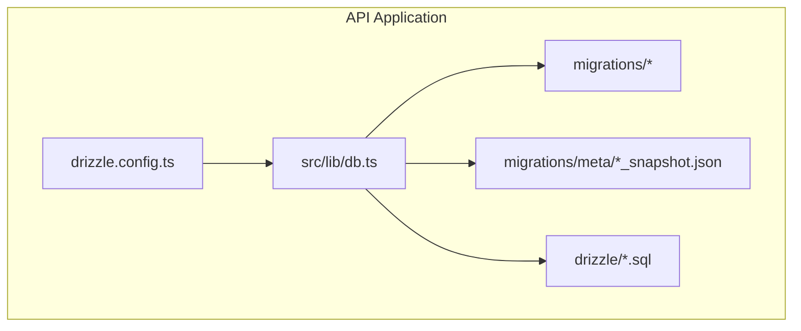
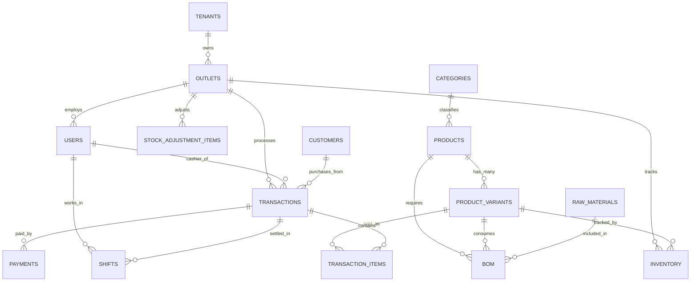
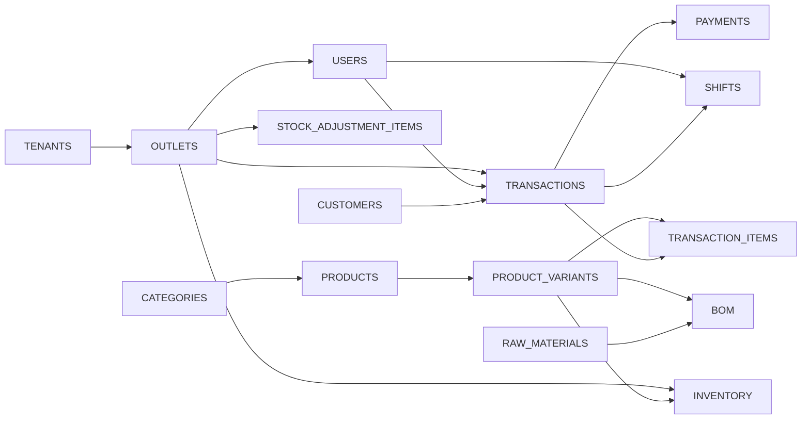

# Database Schema Design

<cite>
**Referenced Files in This Document**
- [0000_wide_runaways.sql](file://apps/api/migrations/0000_wide_runaways.sql)
- [0001_damp_sunfire.sql](file://apps/api/migrations/0001_damp_sunfire.sql)
- [0002_light_katie_power.sql](file://apps/api/migrations/0002_light_katie_power.sql)
- [0003_tearful_supernaut.sql](file://apps/api/migrations/0003_tearful_supernaut.sql)
- [001_initial_setup.sql](file://apps/api/migrations/001_initial_setup.sql)
- [0000_dashing_albert_cleary.sql](file://apps/api/drizzle/0000_dashing_albert_cleary.sql)
- [drizzle.config.ts](file://apps/api/drizzle.config.ts)
- [db.ts](file://apps/api/src/lib/db.ts)
- [0000_snapshot.json](file://apps/api/migrations/meta/0000_snapshot.json)
- [0001_snapshot.json](file://apps/api/migrations/meta/0001_snapshot.json)
- [0002_snapshot.json](file://apps/api/migrations/meta/0002_snapshot.json)
- [0003_snapshot.json](file://apps/api/migrations/meta/0003_snapshot.json)
</cite>

## Table of Contents
1. [Introduction](#introduction)
2. [Project Structure](#project-structure)
3. [Core Components](#core-components)
4. [Architecture Overview](#architecture-overview)
5. [Detailed Component Analysis](#detailed-component-analysis)
6. [Dependency Analysis](#dependency-analysis)
7. [Performance Considerations](#performance-considerations)
8. [Troubleshooting Guide](#troubleshooting-guide)
9. [Conclusion](#conclusion)
10. [Appendices](#appendices)

## Introduction
This document presents the comprehensive database schema design for ARHAT POS, focusing on the normalized relational model and entity relationships among Users, Products, Transactions, Customers, Inventory, Raw Materials, and supporting entities. It consolidates schema definitions from migration files and Drizzle metadata snapshots, documents field definitions, data types, primary and foreign keys, indexes, constraints, and referential integrity rules. It also outlines validation and business rules, normalization choices, and operational considerations derived from the repository’s database artifacts.

## Project Structure
The database schema is managed via Drizzle ORM with PostgreSQL migrations and snapshot metadata. The schema evolves through incremental SQL migrations stored under the migrations directory, while Drizzle maintains JSON snapshots representing the current schema state. The connection and configuration are centralized in the API application.

**Diagram sources**
- [drizzle.config.ts](file://apps/api/drizzle.config.ts)
- [db.ts](file://apps/api/src/lib/db.ts)
- [0000_wide_runaways.sql](file://apps/api/migrations/0000_wide_runaways.sql)
- [0001_damp_sunfire.sql](file://apps/api/migrations/0001_damp_sunfire.sql)
- [0002_light_katie_power.sql](file://apps/api/migrations/0002_light_katie_power.sql)
- [0003_tearful_supernaut.sql](file://apps/api/migrations/0003_tearful_supernaut.sql)
- [001_initial_setup.sql](file://apps/api/migrations/001_initial_setup.sql)
- [0000_dashing_albert_cleary.sql](file://apps/api/drizzle/0000_dashing_albert_cleary.sql)

**Section sources**
- [drizzle.config.ts](file://apps/api/drizzle.config.ts)
- [db.ts](file://apps/api/src/lib/db.ts)

## Core Components
This section summarizes the core entities and their roles in ARHAT POS, as evidenced by the migration and snapshot files:

- Tenants: Multi-tenant container for logical isolation of data.
- Outlets: Physical locations or branches associated with tenants.
- Users: System users (cashiers, admins) linked to outlets and tenants.
- Categories: Product classification hierarchy.
- Products: Sellable items with variants and optional barcode identifiers.
- Product Variants: Specific configurations of products (size, flavor).
- Customers: End-users who purchase products; supports loyalty and contact info.
- Transactions: Sale records linking outlet, cashier, customer, and timestamps.
- Transaction Items: Line items within transactions with pricing and variant linkage.
- Payments: Payment methods and amounts per transaction.
- Inventory: Stock tracking per product variant at outlet level.
- Stock Adjustment Items: Records for inventory adjustments (additions/removals).
- Raw Materials: Ingredients used in product manufacturing.
- Bill of Materials (BOM): Specifies quantities of raw materials per product variant.
- Password Reset Tokens: Temporary tokens for secure password resets.
- Shifts: Work periods for cashiers with opening/closing balances and outlet association.

These entities collectively support POS operations, inventory control, financial reconciliation, and tenant/outlet segmentation.

**Section sources**
- [0000_wide_runaways.sql](file://apps/api/migrations/0000_wide_runaways.sql)
- [0001_damp_sunfire.sql](file://apps/api/migrations/0001_damp_sunfire.sql)
- [0002_light_katie_power.sql](file://apps/api/migrations/0002_light_katie_power.sql)
- [0003_tearful_supernaut.sql](file://apps/api/migrations/0003_tearful_supernaut.sql)
- [001_initial_setup.sql](file://apps/api/migrations/001_initial_setup.sql)
- [0000_dashing_albert_cleary.sql](file://apps/api/drizzle/0000_dashing_albert_cleary.sql)
- [0000_snapshot.json](file://apps/api/migrations/meta/0000_snapshot.json)
- [0001_snapshot.json](file://apps/api/migrations/meta/0001_snapshot.json)
- [0002_snapshot.json](file://apps/api/migrations/meta/0002_snapshot.json)
- [0003_snapshot.json](file://apps/api/migrations/meta/0003_snapshot.json)

## Architecture Overview
The database architecture follows a normalized relational design with explicit foreign key relationships and tenant/outlet scoping. The following diagram maps the primary entities and their relationships:

**Diagram sources**
- [0000_wide_runaways.sql](file://apps/api/migrations/0000_wide_runaways.sql)
- [0001_damp_sunfire.sql](file://apps/api/migrations/0001_damp_sunfire.sql)
- [0002_light_katie_power.sql](file://apps/api/migrations/0002_light_katie_power.sql)
- [0003_tearful_supernaut.sql](file://apps/api/migrations/0003_tearful_supernaut.sql)
- [001_initial_setup.sql](file://apps/api/migrations/001_initial_setup.sql)

## Detailed Component Analysis

### Tenants
- Purpose: Logical container for multi-tenancy.
- Primary Key: id (UUID).
- Constraints: Not null; generated UUID default.
- Notes: Used as a foreign key in outlets and other tenant-scoped entities.

**Section sources**
- [0000_wide_runaways.sql](file://apps/api/migrations/0000_wide_runaways.sql)
- [0001_damp_sunfire.sql](file://apps/api/migrations/0001_damp_sunfire.sql)
- [0000_snapshot.json](file://apps/api/migrations/meta/0000_snapshot.json)

### Outlets
- Purpose: Physical branch/location scoped under a tenant.
- Primary Key: id (UUID).
- Foreign Keys: tenant_id -> tenants(id).
- Constraints: Not null; generated UUID default.
- Indexes: None explicitly defined in snapshots.

**Section sources**
- [0000_wide_runaways.sql](file://apps/api/migrations/0000_wide_runaways.sql)
- [0001_damp_sunfire.sql](file://apps/api/migrations/0001_damp_sunfire.sql)
- [0001_snapshot.json](file://apps/api/migrations/meta/0001_snapshot.json)

### Users
- Purpose: System users (cashiers/admins) linked to outlets and tenants.
- Primary Key: id (UUID).
- Foreign Keys: outlet_id -> outlets(id); tenant_id -> tenants(id).
- Constraints: Not null; generated UUID default; email uniqueness enforced via unique constraint.
- Indexes: None explicitly defined in snapshots.

**Section sources**
- [0000_wide_runaways.sql](file://apps/api/migrations/0000_wide_runaways.sql)
- [0001_damp_sunfire.sql](file://apps/api/migrations/0001_damp_sunfire.sql)
- [0001_snapshot.json](file://apps/api/migrations/meta/0001_snapshot.json)

### Categories
- Purpose: Hierarchical product classification.
- Primary Key: id (UUID).
- Constraints: Not null; generated UUID default.
- Notes: Supports category nesting via parent_id; indexes not defined in snapshots.

**Section sources**
- [0000_wide_runaways.sql](file://apps/api/migrations/0000_wide_runaways.sql)
- [0002_light_katie_power.sql](file://apps/api/migrations/0002_light_katie_power.sql)
- [0002_snapshot.json](file://apps/api/migrations/meta/0002_snapshot.json)

### Products
- Purpose: Sellable items with optional barcode and category linkage.
- Primary Key: id (UUID).
- Foreign Keys: category_id -> categories(id).
- Constraints: Not null; generated UUID default; barcode uniqueness enforced via unique constraint.
- Indexes: None explicitly defined in snapshots.

**Section sources**
- [0000_wide_runaways.sql](file://apps/api/migrations/0000_wide_runaways.sql)
- [0002_light_katie_power.sql](file://apps/api/migrations/0002_light_katie_power.sql)
- [0002_snapshot.json](file://apps/api/migrations/meta/0002_snapshot.json)

### Product Variants
- Purpose: Specific configurations of products (size/flavor/etc.).
- Primary Key: id (UUID).
- Foreign Keys: product_id -> products(id).
- Constraints: Not null; generated UUID default; SKU uniqueness enforced via unique constraint.
- Indexes: None explicitly defined in snapshots.

**Section sources**
- [0000_wide_runaways.sql](file://apps/api/migrations/0000_wide_runaways.sql)
- [0002_light_katie_power.sql](file://apps/api/migrations/0002_light_katie_power.sql)
- [0002_snapshot.json](file://apps/api/migrations/meta/0002_snapshot.json)

### Customers
- Purpose: End-user profiles for purchases.
- Primary Key: id (UUID).
- Constraints: Not null; generated UUID default.
- Indexes: None explicitly defined in snapshots.

**Section sources**
- [0000_wide_runaways.sql](file://apps/api/migrations/0000_wide_runaways.sql)
- [0003_tearful_supernaut.sql](file://apps/api/migrations/0003_tearful_supernaut.sql)
- [0003_snapshot.json](file://apps/api/migrations/meta/0003_snapshot.json)

### Transactions
- Purpose: Sale records linking outlet, cashier, customer, and timestamps.
- Primary Key: id (UUID).
- Foreign Keys: outlet_id -> outlets(id); cashier_id -> users(id); customer_id -> customers(id).
- Constraints: Not null; generated UUID default.
- Indexes: None explicitly defined in snapshots.

**Section sources**
- [0000_wide_runaways.sql](file://apps/api/migrations/0000_wide_runaways.sql)
- [0001_damp_sunfire.sql](file://apps/api/migrations/0001_damp_sunfire.sql)
- [0001_snapshot.json](file://apps/api/migrations/meta/0001_snapshot.json)

### Transaction Items
- Purpose: Line items within transactions with pricing and variant linkage.
- Primary Key: id (UUID).
- Foreign Keys: transaction_id -> transactions(id); variant_id -> product_variants(id).
- Constraints: Not null; generated UUID default.
- Indexes: None explicitly defined in snapshots.

**Section sources**
- [0000_wide_runaways.sql](file://apps/api/migrations/0000_wide_runaways.sql)
- [0001_damp_sunfire.sql](file://apps/api/migrations/0001_damp_sunfire.sql)
- [0001_snapshot.json](file://apps/api/migrations/meta/0001_snapshot.json)

### Payments
- Purpose: Payment method and amount per transaction.
- Primary Key: id (UUID).
- Foreign Keys: transaction_id -> transactions(id).
- Constraints: Not null; generated UUID default.
- Notes: payment_method and status are constrained by varchar limits; indexes not defined in snapshots.

**Section sources**
- [0000_wide_runaways.sql](file://apps/api/migrations/0000_wide_runaways.sql)
- [0001_damp_sunfire.sql](file://apps/api/migrations/0001_damp_sunfire.sql)
- [0001_snapshot.json](file://apps/api/migrations/meta/0001_snapshot.json)

### Inventory
- Purpose: Stock tracking per product variant at outlet level.
- Primary Key: id (UUID).
- Foreign Keys: outlet_id -> outlets(id); variant_id -> product_variants(id).
- Constraints: Not null; generated UUID default; unique constraint ensures one inventory record per variant per outlet.
- Indexes: None explicitly defined in snapshots.

**Section sources**
- [0000_wide_runaways.sql](file://apps/api/migrations/0000_wide_runaways.sql)
- [0002_light_katie_power.sql](file://apps/api/migrations/0002_light_katie_power.sql)
- [0002_snapshot.json](file://apps/api/migrations/meta/0002_snapshot.json)

### Stock Adjustment Items
- Purpose: Records for inventory adjustments (additions/removals).
- Primary Key: id (UUID).
- Foreign Keys: outlet_id -> outlets(id); variant_id -> product_variants(id).
- Constraints: Not null; generated UUID default.
- Indexes: None explicitly defined in snapshots.

**Section sources**
- [0000_wide_runaways.sql](file://apps/api/migrations/0000_wide_runaways.sql)
- [0002_light_katie_power.sql](file://apps/api/migrations/0002_light_katie_power.sql)
- [0002_snapshot.json](file://apps/api/migrations/meta/0002_snapshot.json)

### Raw Materials
- Purpose: Ingredients used in product manufacturing.
- Primary Key: id (UUID).
- Constraints: Not null; generated UUID default.
- Indexes: None explicitly defined in snapshots.

**Section sources**
- [0000_wide_runaways.sql](file://apps/api/migrations/0000_wide_runaways.sql)
- [0002_light_katie_power.sql](file://apps/api/migrations/0002_light_katie_power.sql)
- [0002_snapshot.json](file://apps/api/migrations/meta/0002_snapshot.json)

### Bill of Materials (BOM)
- Purpose: Specifies quantities of raw materials per product variant.
- Primary Key: id (UUID).
- Foreign Keys: variant_id -> product_variants(id); raw_material_id -> raw_materials(id).
- Constraints: Not null; generated UUID default.
- Indexes: None explicitly defined in snapshots.

**Section sources**
- [0000_wide_runaways.sql](file://apps/api/migrations/0000_wide_runaways.sql)
- [0002_light_katie_power.sql](file://apps/api/migrations/0002_light_katie_power.sql)
- [0002_snapshot.json](file://apps/api/migrations/meta/0002_snapshot.json)

### Password Reset Tokens
- Purpose: Temporary tokens for secure password resets.
- Primary Key: id (UUID).
- Constraints: Not null; generated UUID default; token uniqueness enforced via unique constraint.
- Indexes: None explicitly defined in snapshots.

**Section sources**
- [0000_wide_runaways.sql](file://apps/api/migrations/0000_wide_runaways.sql)
- [0001_damp_sunfire.sql](file://apps/api/migrations/0001_damp_sunfire.sql)
- [0001_snapshot.json](file://apps/api/migrations/meta/0001_snapshot.json)

### Shifts
- Purpose: Work periods for cashiers with opening/closing balances and outlet association.
- Primary Key: id (UUID).
- Foreign Keys: tenant_id -> tenants(id); cashier_id -> users(id); outlet_id -> outlets(id).
- Constraints: Not null; generated UUID default.
- Indexes: None explicitly defined in snapshots.

**Section sources**
- [0000_wide_runaways.sql](file://apps/api/migrations/0000_wide_runaways.sql)
- [0001_damp_sunfire.sql](file://apps/api/migrations/0001_damp_sunfire.sql)
- [0001_snapshot.json](file://apps/api/migrations/meta/0001_snapshot.json)

## Dependency Analysis
The schema exhibits strict referential integrity enforced by foreign keys. The following diagram highlights key dependency chains:

**Diagram sources**
- [0000_wide_runaways.sql](file://apps/api/migrations/0000_wide_runaways.sql)
- [0001_damp_sunfire.sql](file://apps/api/migrations/0001_damp_sunfire.sql)
- [0002_light_katie_power.sql](file://apps/api/migrations/0002_light_katie_power.sql)
- [0003_tearful_supernaut.sql](file://apps/api/migrations/0003_tearful_supernaut.sql)

**Section sources**
- [0001_snapshot.json](file://apps/api/migrations/meta/0001_snapshot.json)
- [0002_snapshot.json](file://apps/api/migrations/meta/0002_snapshot.json)
- [0003_snapshot.json](file://apps/api/migrations/meta/0003_snapshot.json)

## Performance Considerations
- Indexing Strategy: No explicit indexes are defined in the snapshots. Consider adding indexes on frequently filtered/sorted columns such as:
  - users.email (for login)
  - products.barcode (for scanning)
  - inventory.variant_id and inventory.outlet_id (for stock queries)
  - transactions.outlet_id, transactions.cashier_id, transactions.customer_id (for reporting)
  - payments.transaction_id (for payment aggregation)
- Partitioning: For large-scale deployments, consider partitioning transactions by date.
- Query Patterns: Optimize analytical queries with appropriate composite indexes and materialized summaries where necessary.

[No sources needed since this section provides general guidance]

## Troubleshooting Guide
- Migration Conflicts: If schema drift occurs, re-run migrations and reconcile snapshot differences.
- Unique Constraint Violations: Ensure uniqueness constraints are respected (e.g., email, barcode, SKU, reset token).
- Foreign Key Violations: Verify parent records exist before inserting child records (e.g., outlet and user before transaction).
- Data Type Mismatches: Confirm varchar limits align with business requirements (e.g., payment_method length).

**Section sources**
- [0001_snapshot.json](file://apps/api/migrations/meta/0001_snapshot.json)
- [0002_snapshot.json](file://apps/api/migrations/meta/0002_snapshot.json)
- [0003_snapshot.json](file://apps/api/migrations/meta/0003_snapshot.json)

## Conclusion
ARHAT POS employs a normalized relational schema designed for multi-tenancy, outlet segmentation, and robust POS operations. The schema establishes clear entity boundaries and referential integrity through foreign keys. While the current snapshots do not define explicit indexes, strategic indexing and partitioning can significantly improve performance. Adhering to the documented constraints and relationships ensures data integrity and supports scalable growth.

[No sources needed since this section summarizes without analyzing specific files]

## Appendices

### Sample Data Structures
- Users: id, email, outlet_id, tenant_id, created_at, updated_at
- Products: id, name, description, barcode, category_id, created_at, updated_at
- Product Variants: id, product_id, name, sku, price, created_at, updated_at
- Inventory: id, outlet_id, variant_id, quantity, created_at, updated_at
- Transactions: id, outlet_id, cashier_id, customer_id, total_amount, created_at, updated_at
- Transaction Items: id, transaction_id, variant_id, quantity, unit_price, total_price
- Payments: id, transaction_id, payment_method, amount, reference_number, status
- Raw Materials: id, name, unit, created_at, updated_at
- Bill of Materials: id, variant_id, raw_material_id, quantity_required
- Password Reset Tokens: id, user_id, token, expires_at
- Shifts: id, tenant_id, cashier_id, outlet_id, start_time, end_time, opening_balance, closing_balance

[No sources needed since this section provides general guidance]