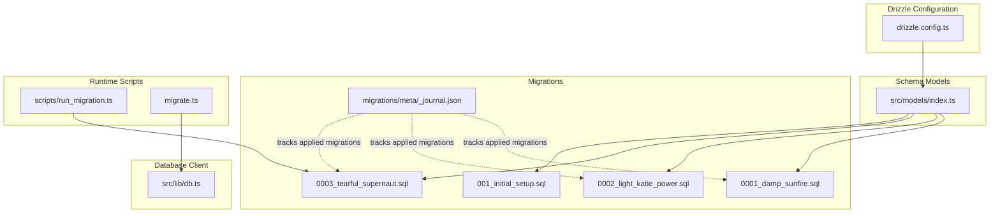
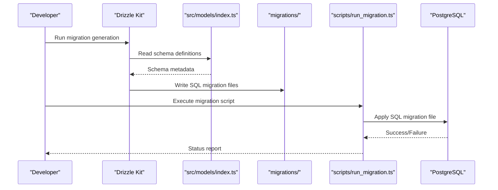
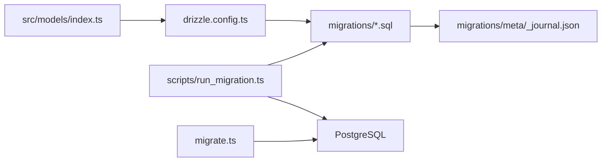

# Migration Management

<cite>
**Referenced Files in This Document**
- [drizzle.config.ts](file://apps/api/drizzle.config.ts)
- [db.ts](file://apps/api/src/lib/db.ts)
- [index.ts](file://apps/api/src/models/index.ts)
- [migrate.ts](file://apps/api/migrate.ts)
- [run_migration.ts](file://apps/api/scripts/run_migration.ts)
- [0001_damp_sunfire.sql](file://apps/api/migrations/0001_damp_sunfire.sql)
- [0002_light_katie_power.sql](file://apps/api/migrations/0002_light_katie_power.sql)
- [0003_tearful_supernaut.sql](file://apps/api/migrations/0003_tearful_supernaut.sql)
- [0000_dashing_albert_cleary.sql](file://apps/api/drizzle/0000_dashing_albert_cleary.sql)
- [0000_wide_runaways.sql](file://apps/api/migrations/0000_wide_runaways.sql)
- [_journal.json](file://apps/api/migrations/meta/_journal.json)
- [001_initial_setup.sql](file://apps/api/migrations/001_initial_setup.sql)
</cite>

## Table of Contents
1. [Introduction](#introduction)
2. [Project Structure](#project-structure)
3. [Core Components](#core-components)
4. [Architecture Overview](#architecture-overview)
5. [Detailed Component Analysis](#detailed-component-analysis)
6. [Dependency Analysis](#dependency-analysis)
7. [Performance Considerations](#performance-considerations)
8. [Troubleshooting Guide](#troubleshooting-guide)
9. [Conclusion](#conclusion)
10. [Appendices](#appendices)

## Introduction
This document explains how ARHAT POS manages database migrations using Drizzle ORM. It covers the migration workflow, creation of new migrations, execution procedures, file structure and naming conventions, version control, rollback strategies, error handling, and best practices for development, testing, and deployment across environments. It also clarifies how migration files relate to database state management and provides practical examples for schema changes, data migrations, and constraint modifications.

## Project Structure
The migration system is organized around Drizzle Kit configuration, TypeScript models, SQL migration files, and runtime scripts for applying migrations.

- Drizzle configuration defines schema location, output directory, dialect, and credentials.
- TypeScript models define the canonical schema used by Drizzle ORM.
- SQL migration files represent discrete changes applied to the database.
- Scripts provide programmatic ways to apply or test migrations.

**Diagram sources**
- [drizzle.config.ts:1-13](file://apps/api/drizzle.config.ts#L1-L13)
- [index.ts:1-307](file://apps/api/src/models/index.ts#L1-L307)
- [0001_damp_sunfire.sql:1-85](file://apps/api/migrations/0001_damp_sunfire.sql#L1-L85)
- [0002_light_katie_power.sql:1-3](file://apps/api/migrations/0002_light_katie_power.sql#L1-L3)
- [0003_tearful_supernaut.sql:1-35](file://apps/api/migrations/0003_tearful_supernaut.sql#L1-L35)
- [001_initial_setup.sql:1-231](file://apps/api/migrations/001_initial_setup.sql#L1-L231)
- [run_migration.ts:1-21](file://apps/api/scripts/run_migration.ts#L1-L21)
- [migrate.ts:1-46](file://apps/api/migrate.ts#L1-L46)
- [db.ts:1-27](file://apps/api/src/lib/db.ts#L1-L27)

**Section sources**
- [drizzle.config.ts:1-13](file://apps/api/drizzle.config.ts#L1-L13)
- [index.ts:1-307](file://apps/api/src/models/index.ts#L1-L307)
- [0001_damp_sunfire.sql:1-85](file://apps/api/migrations/0001_damp_sunfire.sql#L1-L85)
- [0002_light_katie_power.sql:1-3](file://apps/api/migrations/0002_light_katie_power.sql#L1-L3)
- [0003_tearful_supernaut.sql:1-35](file://apps/api/migrations/0003_tearful_supernaut.sql#L1-L35)
- [001_initial_setup.sql:1-231](file://apps/api/migrations/001_initial_setup.sql#L1-L231)
- [run_migration.ts:1-21](file://apps/api/scripts/run_migration.ts#L1-L21)
- [migrate.ts:1-46](file://apps/api/migrate.ts#L1-L46)
- [db.ts:1-27](file://apps/api/src/lib/db.ts#L1-L27)

## Core Components
- Drizzle configuration: Defines schema path, output directory for migrations, PostgreSQL dialect, and database credentials.
- Schema models: TypeScript definitions of tables and relationships used by Drizzle ORM.
- Migration files: SQL scripts representing ordered changes to the database.
- Runtime scripts: Utilities to programmatically apply migrations and interact with the database.

Key responsibilities:
- drizzle.config.ts: Centralizes migration generation and execution configuration.
- src/models/index.ts: Declares the authoritative schema used by Drizzle ORM.
- migrations/*: Stores generated SQL migrations and metadata journal.
- scripts/run_migration.ts: Applies a specific migration file via raw SQL execution.
- migrate.ts: Demonstrates imperative migration steps using raw SQL with defensive checks.

**Section sources**
- [drizzle.config.ts:1-13](file://apps/api/drizzle.config.ts#L1-L13)
- [index.ts:1-307](file://apps/api/src/models/index.ts#L1-L307)
- [run_migration.ts:1-21](file://apps/api/scripts/run_migration.ts#L1-L21)
- [migrate.ts:1-46](file://apps/api/migrate.ts#L1-L46)

## Architecture Overview
The migration architecture connects Drizzle ORM models to SQL migration files and runtime scripts. Drizzle Kit generates SQL from TypeScript models, while runtime scripts apply those SQL files to the database.

**Diagram sources**
- [drizzle.config.ts:1-13](file://apps/api/drizzle.config.ts#L1-L13)
- [index.ts:1-307](file://apps/api/src/models/index.ts#L1-L307)
- [run_migration.ts:1-21](file://apps/api/scripts/run_migration.ts#L1-L21)

## Detailed Component Analysis

### Drizzle Configuration
- Purpose: Configure Drizzle Kit to generate migrations from TypeScript models.
- Key settings:
  - schema: Path to the schema definition file.
  - out: Output directory for generated SQL migrations.
  - dialect: PostgreSQL.
  - dbCredentials.url: Database connection string from environment.

Operational impact:
- Ensures migrations are generated consistently from models.
- Controls where migration files are written and how they are named.

**Section sources**
- [drizzle.config.ts:1-13](file://apps/api/drizzle.config.ts#L1-L13)

### Schema Models
- Purpose: Define the canonical database schema using Drizzle ORM primitives.
- Coverage: Includes tables for tenants, users, products, transactions, shifts, raw materials, and related entities.
- Indexes: Explicitly declared indexes for performance (e.g., customer phone, transaction number, created_at).

Operational impact:
- Generated migrations reflect these definitions.
- Runtime database client uses these models to connect and query.

**Section sources**
- [index.ts:1-307](file://apps/api/src/models/index.ts#L1-L307)

### Migration Files
- Naming convention: Zero-padded numeric prefixes followed by a descriptive slug (e.g., 0001_damp_sunfire.sql).
- Content: SQL statements separated by a statement break marker, including table creation, column additions, and foreign key constraints.
- Examples:
  - 0001_damp_sunfire.sql: Creates customers, product variants, shifts, and adds columns to existing tables.
  - 0002_light_katie_power.sql: Adds indexes on customer phone and transaction identifiers.
  - 0003_tearful_supernaut.sql: Introduces raw materials, BOMs, and related constraints.
  - 001_initial_setup.sql: Initial bootstrap including extensions, base tables, indexes, triggers, and privileges.

Version control:
- Treat migration files as immutable history.
- Do not modify applied migrations; create new migrations for subsequent changes.

**Section sources**
- [0001_damp_sunfire.sql:1-85](file://apps/api/migrations/0001_damp_sunfire.sql#L1-L85)
- [0002_light_katie_power.sql:1-3](file://apps/api/migrations/0002_light_katie_power.sql#L1-L3)
- [0003_tearful_supernaut.sql:1-35](file://apps/api/migrations/0003_tearful_supernaut.sql#L1-L35)
- [001_initial_setup.sql:1-231](file://apps/api/migrations/001_initial_setup.sql#L1-L231)

### Runtime Migration Scripts
- scripts/run_migration.ts:
  - Reads a specific migration file from the migrations directory.
  - Executes the SQL using a raw SQL client.
  - Handles errors and ensures connection closure.
- migrate.ts:
  - Demonstrates imperative migration steps using raw SQL.
  - Includes defensive checks for idempotent operations (e.g., checking for existing columns).

Operational impact:
- Provides deterministic, reproducible migration application.
- Supports controlled execution with explicit error handling.

**Section sources**
- [run_migration.ts:1-21](file://apps/api/scripts/run_migration.ts#L1-L21)
- [migrate.ts:1-46](file://apps/api/migrate.ts#L1-L46)

### Database Client Initialization
- Purpose: Initialize a Drizzle client with PostgreSQL connection.
- Behavior:
  - Uses environment variable for connection string.
  - Falls back to a dummy URL if the environment variable is missing.
  - Handles potential bundling issues with the PostgreSQL client import.
- Impact:
  - Enables ORM operations when a valid connection is available.
  - Prevents fatal crashes during initialization failures.

**Section sources**
- [db.ts:1-27](file://apps/api/src/lib/db.ts#L1-L27)

### Migration Journal and State Tracking
- Purpose: Track which migrations have been applied to the database.
- Location: migrations/meta/_journal.json.
- Role:
  - Records applied migrations to prevent reapplication.
  - Serves as a state checkpoint for migration tooling.

Best practice:
- Commit the journal file alongside migrations.
- Do not manually edit the journal; rely on Drizzle Kit or migration scripts to update it.

**Section sources**
- [_journal.json](file://apps/api/migrations/meta/_journal.json)

## Dependency Analysis
The migration system exhibits clear separation of concerns:
- Drizzle Kit depends on schema models to generate SQL.
- Migration files depend on the order defined by numeric prefixes.
- Runtime scripts depend on the presence of migration files and database connectivity.
- The journal enforces ordering and prevents duplicate application.

**Diagram sources**
- [drizzle.config.ts:1-13](file://apps/api/drizzle.config.ts#L1-L13)
- [index.ts:1-307](file://apps/api/src/models/index.ts#L1-L307)
- [run_migration.ts:1-21](file://apps/api/scripts/run_migration.ts#L1-L21)
- [migrate.ts:1-46](file://apps/api/migrate.ts#L1-L46)
- [_journal.json](file://apps/api/migrations/meta/_journal.json)

**Section sources**
- [drizzle.config.ts:1-13](file://apps/api/drizzle.config.ts#L1-L13)
- [index.ts:1-307](file://apps/api/src/models/index.ts#L1-L307)
- [run_migration.ts:1-21](file://apps/api/scripts/run_migration.ts#L1-L21)
- [migrate.ts:1-46](file://apps/api/migrate.ts#L1-L46)
- [_journal.json](file://apps/api/migrations/meta/_journal.json)

## Performance Considerations
- Indexes: Applied in dedicated migrations (e.g., customer phone and transaction identifiers) improve query performance for common filters and joins.
- Constraints: Foreign keys and unique constraints ensure referential integrity and enable efficient joins.
- Triggers and functions: Initial setup includes triggers to maintain updated timestamps, reducing application-level complexity.
- Large migrations: Prefer incremental migrations to minimize downtime and simplify rollbacks.

[No sources needed since this section provides general guidance]

## Troubleshooting Guide
Common issues and resolutions:
- Missing DATABASE_URL:
  - Symptom: Warning about missing database URL and fallback to dummy URL.
  - Resolution: Set DATABASE_URL in the environment before running migrations.
- Migration fails due to existing objects:
  - Symptom: Error indicating an object already exists.
  - Resolution: Use defensive checks (e.g., try/catch blocks) to handle idempotency.
- Connection errors:
  - Symptom: Failure to initialize the PostgreSQL client.
  - Resolution: Verify connection string, network access, and SSL requirements.
- Migration not applied:
  - Symptom: Changes not reflected in the database.
  - Resolution: Confirm the migration file exists, is readable, and the journal reflects the applied state.

**Section sources**
- [db.ts:1-27](file://apps/api/src/lib/db.ts#L1-L27)
- [migrate.ts:1-46](file://apps/api/migrate.ts#L1-L46)
- [run_migration.ts:1-21](file://apps/api/scripts/run_migration.ts#L1-L21)

## Conclusion
ARHAT POS employs a robust migration strategy centered on Drizzle ORM models and SQL migration files. The system supports deterministic, versioned schema evolution with explicit state tracking via the journal. By following the naming conventions, creating incremental migrations, and using defensive execution patterns, teams can reliably develop, test, and deploy schema changes across environments.

[No sources needed since this section summarizes without analyzing specific files]

## Appendices

### Migration Workflow Summary
- Generate migrations from models using Drizzle Kit.
- Review and commit migration files and the journal.
- Apply migrations using runtime scripts or Drizzle Kit commands.
- Monitor for idempotency and handle errors gracefully.

[No sources needed since this section provides general guidance]

### Practical Examples

- Creating schema changes:
  - Add a new table or columns in a new migration file with appropriate constraints and indexes.
  - Example reference: [0003_tearful_supernaut.sql:1-35](file://apps/api/migrations/0003_tearful_supernaut.sql#L1-L35)

- Data migrations:
  - Use raw SQL to populate or transform data in a controlled manner.
  - Example reference: [001_initial_setup.sql:1-231](file://apps/api/migrations/001_initial_setup.sql#L1-L231)

- Constraint modifications:
  - Add foreign keys or unique constraints in a new migration.
  - Example reference: [0001_damp_sunfire.sql:75-85](file://apps/api/migrations/0001_damp_sunfire.sql#L75-L85)

- Rollback procedures:
  - Since migrations are typically forward-only, create a compensating migration to reverse desired changes.
  - Ensure the journal remains consistent after applying reversals.

- Best practices:
  - Keep migrations small and focused.
  - Test migrations on staging before production.
  - Use defensive programming to avoid breaking existing deployments.
  - Document rationale for each migration in comments or release notes.

[No sources needed since this section provides general guidance]