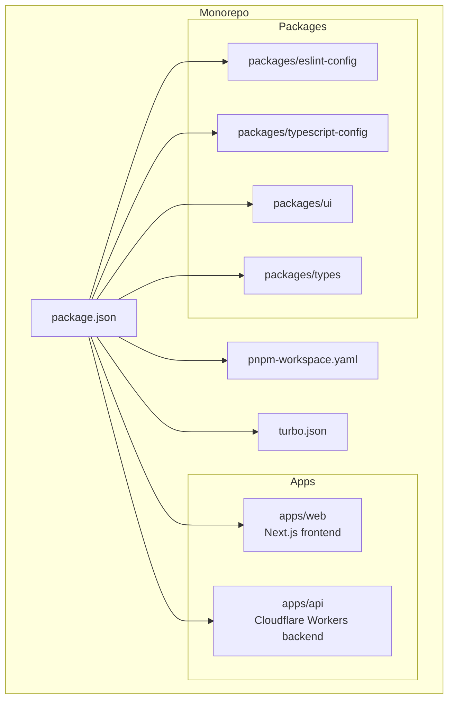
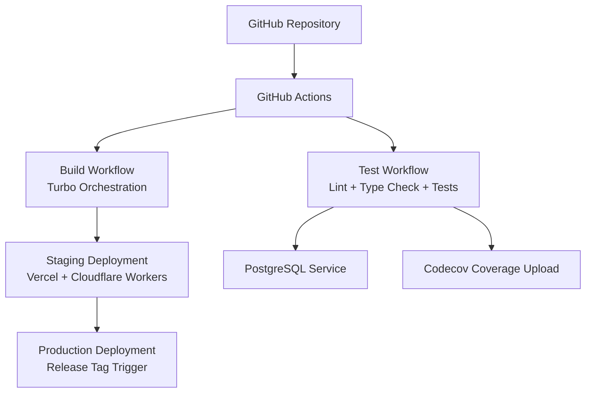
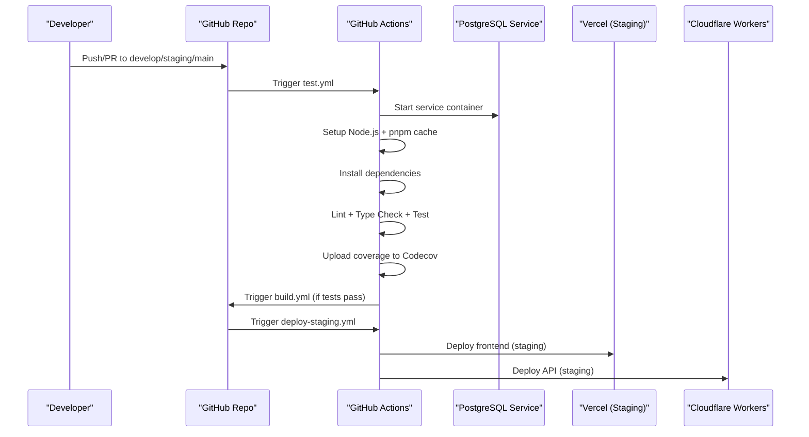
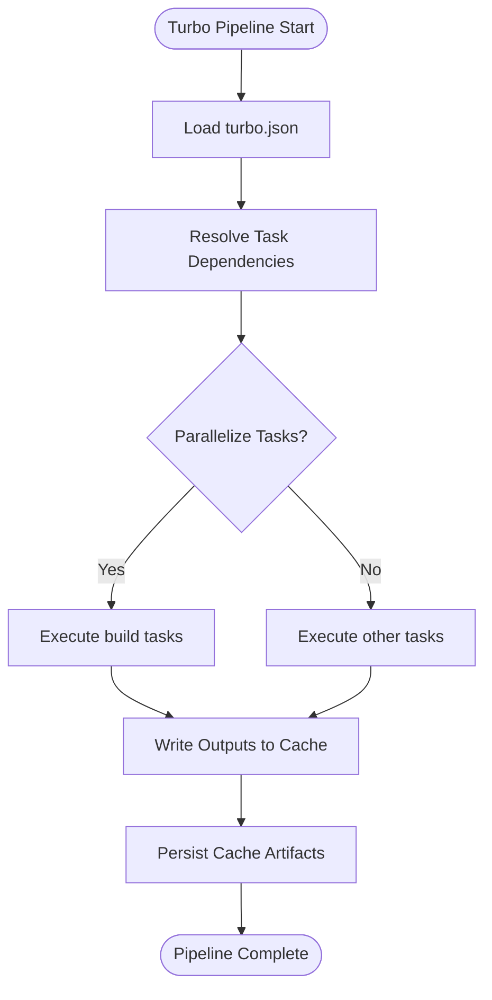
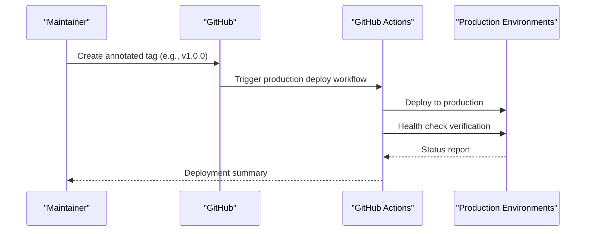
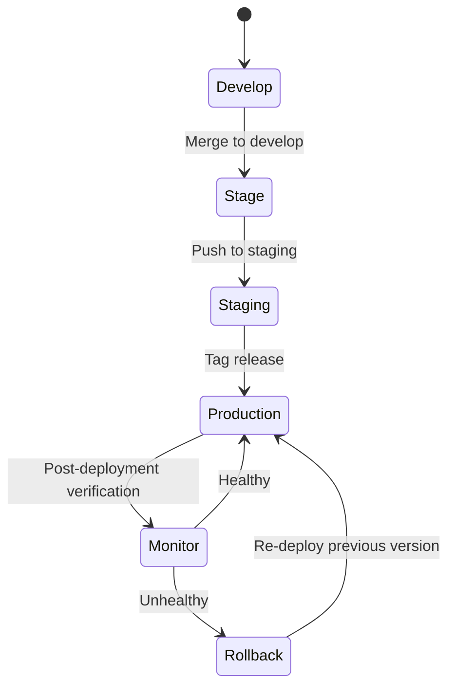
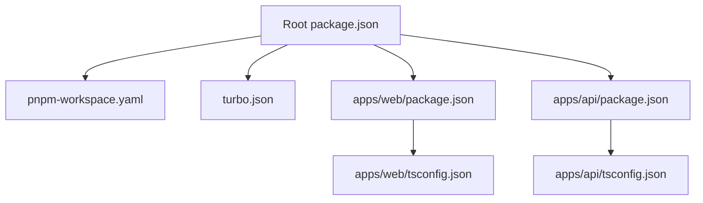

# CI/CD Pipeline & Automation

<cite>
**Referenced Files in This Document**
- [PRD.md](file://PRD/PRD.md)
- [SETUP_GUIDE.md](file://PRD/SETUP_GUIDE.md)
- [IMPLEMENTATION_CHECKLIST.md](file://PRD/IMPLEMENTATION_CHECKLIST.md)
- [turbo.json](file://turbo.json)
- [pnpm-workspace.yaml](file://pnpm-workspace.yaml)
- [package.json](file://package.json)
- [docker-compose.yml](file://docker-compose.yml)
- [apps/web/package.json](file://apps/web/package.json)
- [apps/api/package.json](file://apps/api/package.json)
- [apps/web/tsconfig.json](file://apps/web/tsconfig.json)
- [apps/api/tsconfig.json](file://apps/api/tsconfig.json)
- [apps/web/next.config.ts](file://apps/web/next.config.ts)
- [apps/api/wrangler.toml](file://apps/api/wrangler.toml)
- [apps/api/drizzle.config.ts](file://apps/api/drizzle.config.ts)
- [apps/api/migrations/001_initial_setup.sql](file://apps/api/migrations/001_initial_setup.sql)
- [apps/api/scripts/run_migration.ts](file://apps/api/scripts/run_migration.ts)
- [apps/api/src/index.ts](file://apps/api/src/index.ts)
- [apps/web/src/app/page.tsx](file://apps/web/src/app/page.tsx)
- [apps/web/src/components/ui/Logo.tsx](file://apps/web/src/components/ui/Logo.tsx)
- [apps/web/src/hooks/useBarcodeScanner.ts](file://apps/web/src/hooks/useBarcodeScanner.ts)
</cite>

## Table of Contents
1. [Introduction](#introduction)
2. [Project Structure](#project-structure)
3. [Core Components](#core-components)
4. [Architecture Overview](#architecture-overview)
5. [Detailed Component Analysis](#detailed-component-analysis)
6. [Dependency Analysis](#dependency-analysis)
7. [Performance Considerations](#performance-considerations)
8. [Troubleshooting Guide](#troubleshooting-guide)
9. [Conclusion](#conclusion)
10. [Appendices](#appendices)

## Introduction
This document describes the CI/CD pipeline and automation workflows for ARHAT POS, covering GitHub Actions configuration for automated testing, building, and deployment across development, staging, and production environments. It explains pipeline stages including code quality checks, unit and integration testing, and deployment processes. It also documents monorepo build optimization using Turbo for parallel execution and caching strategies, environment-specific deployment triggers, branch protection and release management workflows, automated dependency updates, security scanning, and vulnerability assessment. Finally, it covers deployment strategy for multiple environments, monitoring, failure notifications, manual intervention procedures, rollback automation, and deployment verification.

## Project Structure
ARHAT POS follows a monorepo architecture with two primary applications:
- Web application built with Next.js (apps/web)
- API built with Hono and deployed to Cloudflare Workers (apps/api)
Shared tooling and configuration include:
- Workspace management via pnpm workspaces
- Build orchestration via Turbo
- Root package.json and shared configuration files

**Diagram sources**
- [pnpm-workspace.yaml](file://pnpm-workspace.yaml)
- [turbo.json](file://turbo.json)
- [package.json](file://package.json)

**Section sources**
- [PRD.md:1450-1695](file://PRD/PRD.md#L1450-L1695)
- [pnpm-workspace.yaml](file://pnpm-workspace.yaml)
- [turbo.json](file://turbo.json)
- [package.json](file://package.json)

## Core Components
- GitHub Actions workflows for automated testing, building, and deployment
- Monorepo build orchestration with Turbo for parallel execution and caching
- Environment-specific deployment to Vercel (frontend) and Cloudflare Workers (API)
- Local development and Docker Compose support for database and cache services
- Logging and monitoring configuration for observability

Key pipeline components:
- Test workflow: runs linting, type checking, and tests against a PostgreSQL service
- Build workflow: builds the monorepo after successful tests
- Deploy workflows: automated deployments to staging and production environments
- Local development: docker-compose for database and cache, pnpm dev for incremental builds

**Section sources**
- [PRD.md:1941-2019](file://PRD/PRD.md#L1941-L2019)
- [PRD.md:2238-2282](file://PRD/PRD.md#L2238-L2282)
- [SETUP_GUIDE.md:623-717](file://PRD/SETUP_GUIDE.md#L623-L717)
- [docker-compose.yml](file://docker-compose.yml)

## Architecture Overview
The CI/CD architecture integrates GitHub Actions with deployment targets and monorepo build orchestration. The pipeline enforces quality gates, executes tests, builds artifacts, and deploys to staging and production environments with environment-specific triggers.

**Diagram sources**
- [PRD.md:1941-2019](file://PRD/PRD.md#L1941-L2019)
- [PRD.md:2021-2052](file://PRD/PRD.md#L2021-L2052)

## Detailed Component Analysis

### GitHub Actions Workflows
The repository defines multiple GitHub Actions workflows for testing, building, and deploying across environments. These workflows are triggered on specific branches and leverage services like PostgreSQL for integration testing.

**Diagram sources**
- [PRD.md:1941-2019](file://PRD/PRD.md#L1941-L2019)
- [PRD.md:2021-2052](file://PRD/PRD.md#L2021-L2052)

**Section sources**
- [PRD.md:1941-2019](file://PRD/PRD.md#L1941-L2019)
- [PRD.md:2021-2052](file://PRD/PRD.md#L2021-L2052)

### Monorepo Build Optimization with Turbo
Turbo orchestrates parallel builds, caching, and dependency-aware execution across the monorepo. It defines pipeline tasks for build, lint, type-check, test, and dev with cacheable outputs and global dependencies.

**Diagram sources**
- [turbo.json:623-656](file://turbo.json#L623-L656)

**Section sources**
- [SETUP_GUIDE.md:623-656](file://PRD/SETUP_GUIDE.md#L623-L656)
- [turbo.json](file://turbo.json)

### Environment-Specific Deployment Triggers
- Staging: automatic deployment on push to the staging branch to Vercel (frontend) and Cloudflare Workers (API)
- Production: manual release tagging triggers production deployment; includes post-deployment verification and rollback procedures

**Diagram sources**
- [PRD.md:2265-2282](file://PRD/PRD.md#L2265-L2282)

**Section sources**
- [PRD.md:2253-2282](file://PRD/PRD.md#L2253-L2282)

### Automated Dependency Updates and Security Scanning
- Regular security audits and dependency reviews are recommended as part of the security checklist
- Automated dependency updates can be integrated via Dependabot or similar tools configured at the repository level

**Section sources**
- [IMPLEMENTATION_CHECKLIST.md:596-615](file://PRD/IMPLEMENTATION_CHECKLIST.md#L596-L615)

### Vulnerability Assessment Processes
- Input validation, SQL injection prevention, XSS sanitization, CSRF protection, rate limiting, and secure error handling are required for every feature
- Regular audits and penetration testing are scheduled as part of ongoing security maintenance

**Section sources**
- [IMPLEMENTATION_CHECKLIST.md:596-615](file://PRD/IMPLEMENTATION_CHECKLIST.md#L596-L615)

### Deployment Strategy Across Environments
- Development: local Docker Compose for database and cache, pnpm dev for incremental builds
- Staging: automatic deployment on push to staging branch
- Production: release tagging triggers deployment with health checks and rollback capability

**Diagram sources**
- [PRD.md:2240-2282](file://PRD/PRD.md#L2240-L2282)

**Section sources**
- [PRD.md:2240-2282](file://PRD/PRD.md#L2240-L2282)

### Pipeline Monitoring, Failure Notifications, and Manual Intervention
- Code coverage upload to Codecov during the test workflow
- Manual approval steps recommended for staging testing and production deployment
- Health checks and monitoring dashboards should be consulted post-deployment

**Section sources**
- [PRD.md:1941-2019](file://PRD/PRD.md#L1941-L2019)
- [PRD.md:2054-2082](file://PRD/PRD.md#L2054-L2082)

### Rollback Automation and Deployment Verification
- Rollback procedure involves git revert to a previous commit
- Post-deployment verification includes health checks and monitoring metrics review

**Section sources**
- [PRD.md:2265-2282](file://PRD/PRD.md#L2265-L2282)

## Dependency Analysis
The monorepo relies on pnpm workspaces and Turbo for build orchestration. The root package.json coordinates workspace members, while Turbo manages task dependencies and caching. The web and API applications define their own configurations and dependencies.

**Diagram sources**
- [package.json](file://package.json)
- [pnpm-workspace.yaml](file://pnpm-workspace.yaml)
- [turbo.json](file://turbo.json)
- [apps/web/package.json](file://apps/web/package.json)
- [apps/api/package.json](file://apps/api/package.json)
- [apps/web/tsconfig.json](file://apps/web/tsconfig.json)
- [apps/api/tsconfig.json](file://apps/api/tsconfig.json)

**Section sources**
- [package.json](file://package.json)
- [pnpm-workspace.yaml](file://pnpm-workspace.yaml)
- [turbo.json](file://turbo.json)

## Performance Considerations
- Use Turbo’s caching and parallelism to minimize build times across the monorepo
- Keep task outputs cacheable where appropriate (e.g., build artifacts, coverage)
- Prefer incremental builds during development and rely on CI for full test suites

[No sources needed since this section provides general guidance]

## Troubleshooting Guide
Common CI/CD issues and resolutions:
- Test failures due to missing database service: ensure PostgreSQL service is healthy and reachable in the test job
- Build failures due to missing cache: verify pnpm cache configuration and Turbo cache persistence
- Deployment failures to staging/production: confirm environment variables and secrets are properly configured in GitHub Actions
- Local development connectivity: verify docker-compose services and port mappings

**Section sources**
- [PRD.md:1941-2019](file://PRD/PRD.md#L1941-L2019)
- [PRD.md:2238-2282](file://PRD/PRD.md#L2238-L2282)
- [docker-compose.yml](file://docker-compose.yml)

## Conclusion
ARHAT POS employs a robust CI/CD pipeline leveraging GitHub Actions, Turbo for monorepo orchestration, and environment-specific deployments. The pipeline enforces quality gates, automates testing and building, and supports safe deployments to staging and production with rollback capabilities. By integrating security practices, monitoring, and manual approvals, the pipeline ensures reliable and observable releases across environments.

[No sources needed since this section summarizes without analyzing specific files]

## Appendices

### Appendix A: Branch Protection and Release Management
- Branch strategy supports feature, bugfix, develop, staging, and main (production) branches
- Release management includes annotated tags and post-deployment verification

**Section sources**
- [IMPLEMENTATION_CHECKLIST.md:618-654](file://PRD/IMPLEMENTATION_CHECKLIST.md#L618-L654)

### Appendix B: Local Development and Docker Compose
- Local development uses Docker Compose for database and cache services
- Incremental development via pnpm dev

**Section sources**
- [SETUP_GUIDE.md:701-717](file://PRD/SETUP_GUIDE.md#L701-L717)
- [docker-compose.yml](file://docker-compose.yml)

### Appendix C: Configuration References
- Next.js configuration for the web application
- Cloudflare Workers configuration for the API
- Drizzle ORM configuration and initial migration

**Section sources**
- [apps/web/next.config.ts](file://apps/web/next.config.ts)
- [apps/api/wrangler.toml](file://apps/api/wrangler.toml)
- [apps/api/drizzle.config.ts](file://apps/api/drizzle.config.ts)
- [apps/api/migrations/001_initial_setup.sql](file://apps/api/migrations/001_initial_setup.sql)