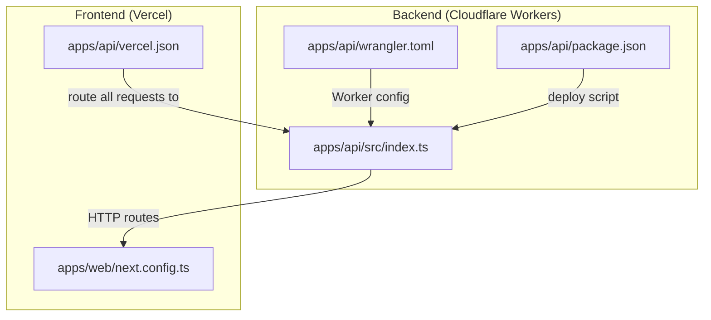
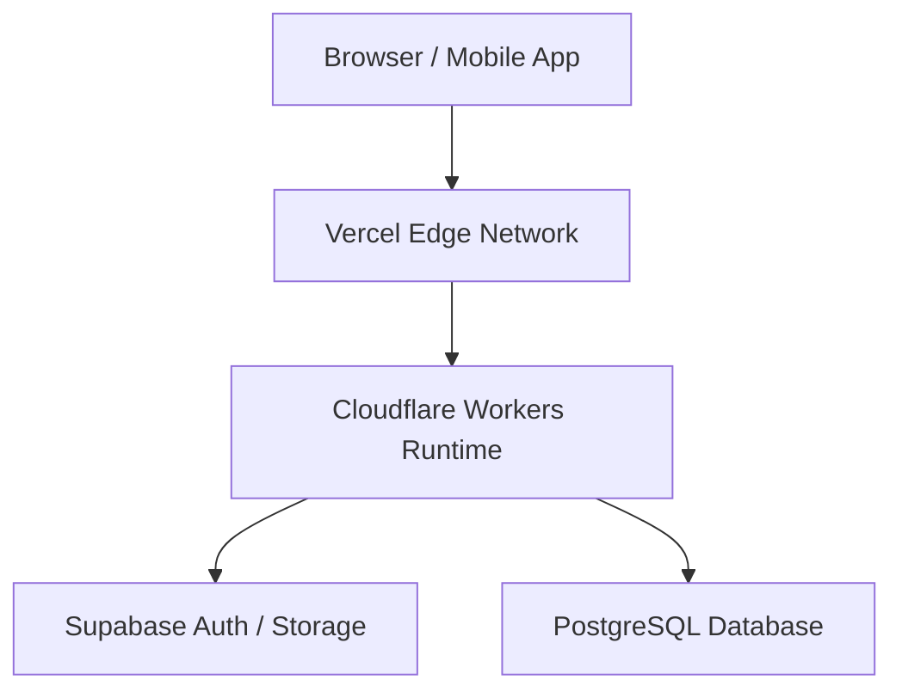
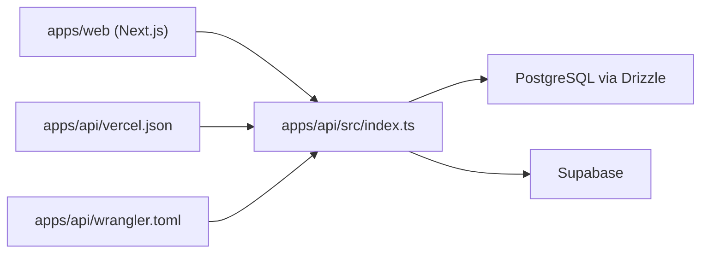

# Cloud Deployment

<cite>
**Referenced Files in This Document**
- [apps/api/wrangler.toml](file://apps/api/wrangler.toml)
- [apps/api/package.json](file://apps/api/package.json)
- [apps/api/src/index.ts](file://apps/api/src/index.ts)
- [apps/api/src/local.ts](file://apps/api/src/local.ts)
- [apps/api/src/lib/db.ts](file://apps/api/src/lib/db.ts)
- [apps/api/drizzle.config.ts](file://apps/api/drizzle.config.ts)
- [apps/api/migrate.ts](file://apps/api/migrate.ts)
- [apps/api/public/openapi.json](file://apps/api/public/openapi.json)
- [apps/web/package.json](file://apps/web/package.json)
- [apps/web/next.config.ts](file://apps/web/next.config.ts)
- [apps/api/vercel.json](file://apps/api/vercel.json)
- [PRD/SETUP_GUIDE.md](file://PRD/SETUP_GUIDE.md)
</cite>

## Table of Contents
1. [Introduction](#introduction)
2. [Project Structure](#project-structure)
3. [Core Components](#core-components)
4. [Architecture Overview](#architecture-overview)
5. [Detailed Component Analysis](#detailed-component-analysis)
6. [Dependency Analysis](#dependency-analysis)
7. [Performance Considerations](#performance-considerations)
8. [Troubleshooting Guide](#troubleshooting-guide)
9. [Conclusion](#conclusion)
10. [Appendices](#appendices)

## Introduction
This document explains the cloud deployment strategy for ARHAT POS using a serverless approach:
- Backend API: Cloudflare Workers
- Frontend Application: Vercel

It covers the benefits of serverless (auto-scaling, cost optimization, reduced infrastructure management), configuration files for both platforms, step-by-step deployment procedures, environment setup, domain configuration, separation of concerns, CDN and edge computing advantages, troubleshooting, rollback procedures, and monitoring guidance.

## Project Structure
The repository is organized into two primary applications:
- apps/api: TypeScript-based backend built with Hono, exposing REST endpoints and serving OpenAPI documentation.
- apps/web: Next.js frontend application configured for Vercel deployment.

Key deployment-relevant files:
- Cloudflare Workers: wrangler.toml, package.json scripts, and the Hono app entry.
- Vercel: vercel.json for route and build configuration.
- Database: Drizzle ORM configuration and migration scripts for PostgreSQL.

**Diagram sources**
- [apps/api/src/index.ts:1-99](file://apps/api/src/index.ts#L1-L99)
- [apps/api/wrangler.toml:1-10](file://apps/api/wrangler.toml#L1-L10)
- [apps/api/package.json:1-37](file://apps/api/package.json#L1-L37)
- [apps/api/vercel.json:1-16](file://apps/api/vercel.json#L1-L16)
- [apps/web/next.config.ts:1-17](file://apps/web/next.config.ts#L1-L17)

**Section sources**
- [apps/api/wrangler.toml:1-10](file://apps/api/wrangler.toml#L1-L10)
- [apps/api/package.json:1-37](file://apps/api/package.json#L1-L37)
- [apps/api/src/index.ts:1-99](file://apps/api/src/index.ts#L1-L99)
- [apps/api/vercel.json:1-16](file://apps/api/vercel.json#L1-L16)
- [apps/web/next.config.ts:1-17](file://apps/web/next.config.ts#L1-L17)

## Core Components
- Backend API (Hono on Cloudflare Workers)
  - Entry point defines CORS, logging, health checks, OpenAPI documentation, and routes grouped under /api/*.
  - Environment variables are consumed via dotenv and process.env for database connectivity and optional JWT/SUPABASE settings.
  - Local development uses @hono/node-server with a dedicated local.ts entry.

- Frontend (Next.js on Vercel)
  - Next.js configuration allows remote image fetching from specific hosts.
  - Vercel routes all incoming requests to the backend worker via vercel.json.

- Database and Migrations
  - Drizzle ORM configuration reads DATABASE_URL from environment variables.
  - Migration scripts and Drizzle kit configuration support schema evolution.

**Section sources**
- [apps/api/src/index.ts:1-99](file://apps/api/src/index.ts#L1-L99)
- [apps/api/src/local.ts:1-8](file://apps/api/src/local.ts#L1-L8)
- [apps/api/src/lib/db.ts:1-27](file://apps/api/src/lib/db.ts#L1-L27)
- [apps/api/drizzle.config.ts:1-13](file://apps/api/drizzle.config.ts#L1-L13)
- [apps/api/migrate.ts:1-46](file://apps/api/migrate.ts#L1-L46)
- [apps/web/next.config.ts:1-17](file://apps/web/next.config.ts#L1-L17)
- [apps/api/vercel.json:1-16](file://apps/api/vercel.json#L1-L16)

## Architecture Overview
The system follows a serverless architecture:
- Edge compute: Cloudflare Workers handle API requests with automatic global distribution and scaling.
- CDN: Requests traverse Cloudflare’s network, reducing latency and improving availability.
- Frontend hosting: Vercel serves the Next.js application with optimized static generation and edge delivery.
- Separation of concerns: The frontend consumes the backend API via HTTPS; the backend manages data access and business logic.

[No sources needed since this diagram shows conceptual workflow, not actual code structure]

## Detailed Component Analysis

### Cloudflare Workers Configuration (wrangler.toml)
- Worker identity and entry: name and main module path.
- Compatibility date and flags enable modern Node.js compatibility mode.
- vars section holds environment variables; current template sets NODE_ENV and reserves a placeholder for DB connection strings.

Recommended additions for production:
- Add secrets for DATABASE_URL, JWT_SECRET, SUPABASE_URL, SUPABASE_ANON_KEY, and CLOUDFLARE_ACCOUNT_ID/CLOUDFLARE_API_TOKEN via Wrangler CLI or dashboard.
- Define environment-specific vars blocks for staging and production.
- Configure routes to expose only necessary paths and enforce HTTPS.

Operational notes:
- The deploy script in package.json invokes wrangler deploy with minification.
- Local development uses tsx and a Node server entry via src/local.ts.

**Section sources**
- [apps/api/wrangler.toml:1-10](file://apps/api/wrangler.toml#L1-L10)
- [apps/api/package.json:5-11](file://apps/api/package.json#L5-L11)
- [apps/api/src/local.ts:1-8](file://apps/api/src/local.ts#L1-L8)

### Backend API Entry Point (Hono App)
- CORS policy supports localhost origins and can be extended for production domains.
- Logging middleware and centralized error handling.
- Health check endpoint returns runtime status.
- OpenAPI documentation served via Swagger UI and static openapi.json.
- Route groups for auth, products, transactions, analytics, uploads, inventory, customers, shifts, whatsapp, and raw materials.

Deployment implications:
- All routes are prefixed with /api; ensure Vercel routes match this pattern.
- Static uploads are disabled on Vercel due to ephemeral filesystem; use external storage (e.g., Supabase Storage) for assets.

**Section sources**
- [apps/api/src/index.ts:1-99](file://apps/api/src/index.ts#L1-L99)
- [apps/api/public/openapi.json](file://apps/api/public/openapi.json)

### Vercel Frontend Configuration (vercel.json)
- Build pipeline uses @vercel/node to target the backend entry.
- Route all incoming requests to the backend worker entrypoint.
- This configuration ensures the frontend acts as a thin client while API traffic reaches the serverless backend.

**Section sources**
- [apps/api/vercel.json:1-16](file://apps/api/vercel.json#L1-L16)

### Database Connectivity and Migrations
- Drizzle configuration reads DATABASE_URL from environment variables.
- The database client initialization logs warnings if DATABASE_URL is missing and falls back to a dummy URL to avoid crashes.
- Migration scripts and Drizzle kit configuration support evolving the schema.

**Section sources**
- [apps/api/drizzle.config.ts:1-13](file://apps/api/drizzle.config.ts#L1-L13)
- [apps/api/src/lib/db.ts:1-27](file://apps/api/src/lib/db.ts#L1-L27)
- [apps/api/migrate.ts:1-46](file://apps/api/migrate.ts#L1-L46)

### Environment Variables and Secrets Management
- Environment variables include database credentials, JWT secret, Supabase configuration, and Cloudflare account tokens.
- For Cloudflare Workers, use Wrangler secrets to manage sensitive values securely.
- For Vercel, configure environment variables in the project settings.

**Section sources**
- [PRD/SETUP_GUIDE.md:357-380](file://PRD/SETUP_GUIDE.md#L357-L380)
- [apps/api/src/lib/db.ts:1-27](file://apps/api/src/lib/db.ts#L1-L27)

## Dependency Analysis
- Backend depends on Hono for routing, middleware, and error handling; uses Drizzle ORM and PostgreSQL for persistence; integrates with Supabase for auth/storage.
- Frontend depends on Next.js and consumes the backend API.
- Vercel routes all traffic to the backend worker; the worker handles all business logic and data access.

**Diagram sources**
- [apps/api/src/index.ts:1-99](file://apps/api/src/index.ts#L1-L99)
- [apps/api/vercel.json:1-16](file://apps/api/vercel.json#L1-L16)
- [apps/api/wrangler.toml:1-10](file://apps/api/wrangler.toml#L1-L10)

**Section sources**
- [apps/api/src/index.ts:1-99](file://apps/api/src/index.ts#L1-L99)
- [apps/api/vercel.json:1-16](file://apps/api/vercel.json#L1-L16)
- [apps/api/wrangler.toml:1-10](file://apps/api/wrangler.toml#L1-L10)

## Performance Considerations
- Auto-scaling: Cloudflare Workers scale automatically with request volume; Vercel also autoscales the frontend.
- Reduced cold starts: Keep the backend minimal and pre-warm critical paths where applicable.
- CDN proximity: Edge compute reduces latency; ensure assets are served efficiently.
- Database connection pooling: Reuse connections and avoid unnecessary reconnects.
- Static assets: Serve images and assets from CDNs or external storage to reduce backend load.

[No sources needed since this section provides general guidance]

## Troubleshooting Guide
Common issues and resolutions:
- Missing DATABASE_URL
  - Symptom: Database client initialization logs warnings or fails.
  - Resolution: Set DATABASE_URL in Cloudflare Workers secrets and ensure Vercel environment variables are configured if using Vercel for backend.
  - Reference: [apps/api/src/lib/db.ts:10-15](file://apps/api/src/lib/db.ts#L10-L15)

- CORS errors in browser
  - Symptom: Cross-origin requests blocked.
  - Resolution: Add production domains to ALLOWED_ORIGINS in the backend entry and redeploy.
  - Reference: [apps/api/src/index.ts:19-25](file://apps/api/src/index.ts#L19-L25)

- Health check failures
  - Symptom: Monitoring systems report downtime.
  - Resolution: Verify /health endpoint and ensure worker remains warm; consider adding keep-alive if needed.
  - Reference: [apps/api/src/index.ts:42-44](file://apps/api/src/index.ts#L42-L44)

- OpenAPI documentation not loading
  - Symptom: Swagger UI blank or 404.
  - Resolution: Confirm openapi.json is present and route matches the frontend configuration.
  - Reference: [apps/api/public/openapi.json](file://apps/api/public/openapi.json)

- Vercel route misconfiguration
  - Symptom: Frontend requests not reaching backend.
  - Resolution: Ensure vercel.json routes all paths to the backend entry.
  - Reference: [apps/api/vercel.json:9-14](file://apps/api/vercel.json#L9-L14)

**Section sources**
- [apps/api/src/lib/db.ts:10-15](file://apps/api/src/lib/db.ts#L10-L15)
- [apps/api/src/index.ts:19-25](file://apps/api/src/index.ts#L19-L25)
- [apps/api/src/index.ts:42-44](file://apps/api/src/index.ts#L42-L44)
- [apps/api/public/openapi.json](file://apps/api/public/openapi.json)
- [apps/api/vercel.json:9-14](file://apps/api/vercel.json#L9-L14)

## Conclusion
Deploying ARHAT POS with Cloudflare Workers for the backend and Vercel for the frontend leverages serverless benefits: auto-scaling, cost efficiency, and minimal operational overhead. By separating frontend and backend concerns, using edge compute, and managing environment variables and secrets securely, the system achieves high availability and performance. Follow the step-by-step procedures below to deploy, monitor, and maintain the platform effectively.

[No sources needed since this section summarizes without analyzing specific files]

## Appendices

### Step-by-Step Deployment Procedures

- Prerequisites
  - Install dependencies for both apps.
  - Prepare environment variables and secrets for Cloudflare Workers and Vercel.
  - Ensure database is provisioned and reachable.

- Backend (Cloudflare Workers)
  1. Set secrets:
     - DATABASE_URL, JWT_SECRET, SUPABASE_URL, SUPABASE_ANON_KEY, CLOUDFLARE_ACCOUNT_ID, CLOUDFLARE_API_TOKEN.
  2. Configure wrangler.toml:
     - Add environment blocks for staging/production.
     - Define routes and compatibility settings.
  3. Deploy:
     - Use the deploy script to push the worker.
  4. Verify:
     - Test /health and API endpoints.
     - Confirm OpenAPI documentation is accessible.

- Frontend (Vercel)
  1. Configure vercel.json:
     - Ensure all routes forward to the backend entry.
  2. Deploy:
     - Push to Vercel; review build logs.
  3. Verify:
     - Confirm frontend loads and API calls succeed.

- Domain Configuration
  - Cloudflare: Point custom domains to Cloudflare; configure DNS and SSL.
  - Vercel: Add custom domains and enforce HTTPS.
  - CORS: Update ALLOWED_ORIGINS in the backend to include production domains.

- Rollback Procedures
  - Cloudflare Workers: Use Wrangler to roll back to a previous published version.
  - Vercel: Revert to a previous successful deployment in the dashboard.

- Monitoring Setup
  - Cloudflare: Enable Logs and integrate with a log aggregation service.
  - Vercel: Use built-in metrics and logs; optionally connect to external monitoring.
  - Database: Monitor connection pool usage and query performance.

**Section sources**
- [apps/api/wrangler.toml:1-10](file://apps/api/wrangler.toml#L1-L10)
- [apps/api/package.json:5-11](file://apps/api/package.json#L5-L11)
- [apps/api/src/index.ts:19-25](file://apps/api/src/index.ts#L19-L25)
- [apps/api/vercel.json:1-16](file://apps/api/vercel.json#L1-L16)
- [PRD/SETUP_GUIDE.md:357-380](file://PRD/SETUP_GUIDE.md#L357-L380)