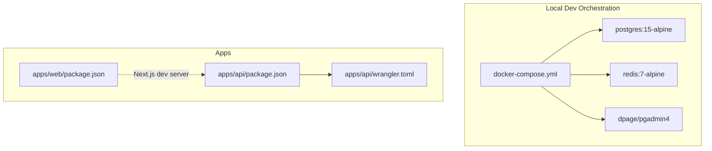
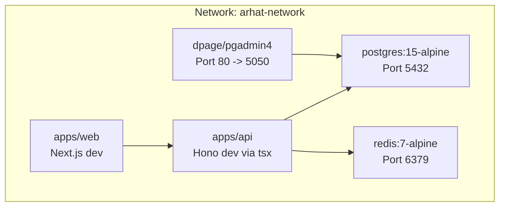
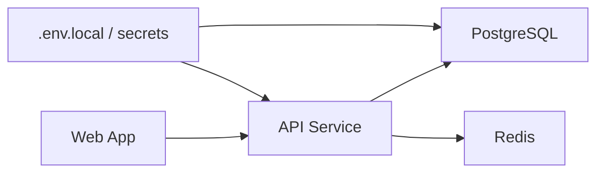

# Containerization & Local Development

<cite>
**Referenced Files in This Document**
- [docker-compose.yml](file://docker-compose.yml)
- [apps/api/package.json](file://apps/api/package.json)
- [apps/api/src/index.ts](file://apps/api/src/index.ts)
- [apps/api/src/index.js](file://apps/api/src/index.js)
- [apps/api/src/lib/db.ts](file://apps/api/src/lib/db.ts)
- [apps/api/drizzle.config.ts](file://apps/api/drizzle.config.ts)
- [apps/api/wrangler.toml](file://apps/api/wrangler.toml)
- [apps/web/package.json](file://apps/web/package.json)
- [pnpm-workspace.yaml](file://pnpm-workspace.yaml)
- [apps/web/pnpm-workspace.yaml](file://apps/web/pnpm-workspace.yaml)
- [turbo.json](file://turbo.json)
- [PRD/SETUP_GUIDE.md](file://PRD/SETUP_GUIDE.md)
- [PRD/PRD.md](file://PRD/PRD.md)
</cite>

## Table of Contents
1. [Introduction](#introduction)
2. [Project Structure](#project-structure)
3. [Core Components](#core-components)
4. [Architecture Overview](#architecture-overview)
5. [Detailed Component Analysis](#detailed-component-analysis)
6. [Dependency Analysis](#dependency-analysis)
7. [Performance Considerations](#performance-considerations)
8. [Troubleshooting Guide](#troubleshooting-guide)
9. [Conclusion](#conclusion)
10. [Appendices](#appendices)

## Introduction
This document explains how to containerize and develop the ARHAT POS system locally using Docker and Docker Compose. It covers orchestration of the database, API server, and frontend application; networking, volumes, and environment variables; local development workflows; build processes and optimization strategies; debugging and logging; health checks; and the transition from local containers to cloud deployment. It also outlines security best practices, resource limits, and performance tuning.

## Project Structure
The repository follows a monorepo layout with two primary applications:
- API service under apps/api, built with Hono and deployed via Cloudflare Workers.
- Web application under apps/web, a Next.js app.

Development is coordinated with Docker Compose for local services (PostgreSQL, Redis, pgAdmin), while the API and Web apps run natively via their respective package scripts during development.

**Diagram sources**
- [docker-compose.yml:1-43](file://docker-compose.yml#L1-L43)
- [apps/api/package.json:1-37](file://apps/api/package.json#L1-L37)
- [apps/web/package.json:1-40](file://apps/web/package.json#L1-L40)
- [apps/api/wrangler.toml:1-9](file://apps/api/wrangler.toml#L1-L9)

**Section sources**
- [docker-compose.yml:1-43](file://docker-compose.yml#L1-L43)
- [apps/api/package.json:1-37](file://apps/api/package.json#L1-L37)
- [apps/web/package.json:1-40](file://apps/web/package.json#L1-L40)
- [pnpm-workspace.yaml:1-10](file://pnpm-workspace.yaml#L1-L10)
- [apps/web/pnpm-workspace.yaml:1-8](file://apps/web/pnpm-workspace.yaml#L1-L8)
- [turbo.json:1-27](file://turbo.json#L1-L27)

## Core Components
- PostgreSQL service for relational data persistence.
- Redis service for caching and session-like state.
- pgAdmin service for database administration.
- API service configured for local development and Cloudflare Workers deployment.
- Web application configured for Next.js development.

Key runtime behaviors:
- The API exposes a health endpoint and serves OpenAPI documentation.
- The API reads environment variables for database connectivity and JWT secrets.
- The Web app runs a Next.js dev server locally.

**Section sources**
- [docker-compose.yml:1-43](file://docker-compose.yml#L1-L43)
- [apps/api/src/index.js:1-36](file://apps/api/src/index.js#L1-L36)
- [apps/api/src/index.ts:80-99](file://apps/api/src/index.ts#L80-L99)
- [apps/api/src/lib/db.ts:1-27](file://apps/api/src/lib/db.ts#L1-L27)
- [apps/api/drizzle.config.ts:1-13](file://apps/api/drizzle.config.ts#L1-L13)
- [apps/api/wrangler.toml:1-9](file://apps/api/wrangler.toml#L1-L9)
- [apps/web/package.json:1-40](file://apps/web/package.json#L1-L40)

## Architecture Overview
The local development architecture centers on a shared Docker network connecting the database, cache, and admin tooling. The API and Web apps connect to these services using container hostnames and exposed ports. The API is also prepared for Cloudflare Workers deployment via Wrangler.

**Diagram sources**
- [docker-compose.yml:3-42](file://docker-compose.yml#L3-L42)
- [apps/api/src/index.js:19-36](file://apps/api/src/index.js#L19-L36)
- [apps/api/src/lib/db.ts:10-24](file://apps/api/src/lib/db.ts#L10-L24)

## Detailed Component Analysis

### Database Service (PostgreSQL)
- Image: postgres:15-alpine
- Exposed port: 5432 mapped to localhost
- Persistent volume: postgres_data mounted inside the container
- Network: arhat-network
- Environment variables: POSTGRES_USER, POSTGRES_PASSWORD, POSTGRES_DB

Operational notes:
- Use the pgAdmin service to manage schema and data.
- For migrations, Drizzle Kit reads DATABASE_URL from environment variables.

**Section sources**
- [docker-compose.yml:4-16](file://docker-compose.yml#L4-L16)
- [apps/api/src/lib/db.ts:10-15](file://apps/api/src/lib/db.ts#L10-L15)
- [apps/api/drizzle.config.ts:9-12](file://apps/api/drizzle.config.ts#L9-L12)

### Cache Service (Redis)
- Image: redis:7-alpine
- Exposed port: 6379 mapped to localhost
- Network: arhat-network

Operational notes:
- Intended for caching and session-like state.
- Can be used by the API for rate limiting, sessions, or transient data.

**Section sources**
- [docker-compose.yml:18-24](file://docker-compose.yml#L18-L24)

### Database Administration (pgAdmin)
- Image: dpage/pgadmin4
- Exposed port: 80 mapped to 5050
- Network: arhat-network
- Environment variables: PGADMIN_DEFAULT_EMAIL, PGADMIN_DEFAULT_PASSWORD

Operational notes:
- Access at http://localhost:5050 with default credentials.
- Connect to the Postgres service using the container hostname and port.

**Section sources**
- [docker-compose.yml:26-35](file://docker-compose.yml#L26-L35)

### API Service (Hono + Cloudflare Workers)
- Local development: tsx watches and runs src/local.ts.
- Routes are registered in src/index.ts.
- Health check endpoint: GET /health.
- OpenAPI docs served from public/openapi.json.
- Wrangler configuration defines compatibility and placeholder vars.

Environment and configuration:
- DATABASE_URL drives the database connection.
- JWT_SECRET and other secrets are managed via environment variables.
- Wrangler vars include NODE_ENV and placeholders for DB connection strings.

Build and deployment:
- Build script currently skips building for Workers deployments.
- Deployment uses Wrangler targeting Cloudflare Workers.

**Section sources**
- [apps/api/package.json:5-12](file://apps/api/package.json#L5-L12)
- [apps/api/src/index.ts:80-99](file://apps/api/src/index.ts#L80-L99)
- [apps/api/src/index.js:19-36](file://apps/api/src/index.js#L19-L36)
- [apps/api/wrangler.toml:1-9](file://apps/api/wrangler.toml#L1-L9)
- [PRD/SETUP_GUIDE.md:357-380](file://PRD/SETUP_GUIDE.md#L357-L380)

### Web Application (Next.js)
- Local development: next dev.
- Build and production start scripts are provided.
- Workspace configuration supports monorepo builds.

**Section sources**
- [apps/web/package.json:5-10](file://apps/web/package.json#L5-L10)
- [pnpm-workspace.yaml:1-3](file://pnpm-workspace.yaml#L1-L3)
- [apps/web/pnpm-workspace.yaml:1-8](file://apps/web/pnpm-workspace.yaml#L1-L8)

### Health Checks and Logging
- Health endpoint: GET /health returns a JSON status.
- Logger middleware logs requests.
- Winston-based logging is documented for application logs.

**Section sources**
- [apps/api/src/index.js:29-36](file://apps/api/src/index.js#L29-L36)
- [apps/api/src/index.js:26](file://apps/api/src/index.js#L26)
- [PRD/PRD.md:2054-2082](file://PRD/PRD.md#L2054-L2082)

### Local Development Workflow
Recommended steps:
1. Start services: docker compose up -d
2. Initialize database: run migrations using Drizzle CLI via the API package scripts.
3. Seed data if needed using provided scripts.
4. Start API: npm run dev in apps/api (tsx watches src/local.ts).
5. Start Web: npm run dev in apps/web.
6. Access:
   - Web: http://localhost:3000
   - pgAdmin: http://localhost:5050
   - API docs: http://localhost:3000/api/docs (when API is running)

**Section sources**
- [docker-compose.yml:1-43](file://docker-compose.yml#L1-L43)
- [apps/api/package.json:5-12](file://apps/api/package.json#L5-L12)
- [apps/web/package.json:5-10](file://apps/web/package.json#L5-L10)
- [apps/api/src/index.js:34-36](file://apps/api/src/index.js#L34-L36)

### Container Networking and Volume Mounting
- Network: arhat-network bridge ensures service discovery by service name.
- Volumes:
  - postgres_data persists Postgres data.
- Port mappings:
  - Postgres: 5432
  - Redis: 6379
  - pgAdmin: 5050
- Environment variables:
  - Postgres credentials and DB name.
  - pgAdmin credentials.
  - API DATABASE_URL and JWT secret.

**Section sources**
- [docker-compose.yml:3-42](file://docker-compose.yml#L3-L42)
- [apps/api/src/lib/db.ts:10-15](file://apps/api/src/lib/db.ts#L10-L15)
- [PRD/SETUP_GUIDE.md:357-380](file://PRD/SETUP_GUIDE.md#L357-L380)

### Container Build Processes and Image Optimization
- Current state:
  - API uses Wrangler for Cloudflare Workers deployment; local dev runs tsx.
  - No explicit Dockerfile is present in the repository for the API.
- Recommendations:
  - Create a Dockerfile for the API to enable local containerized development and CI builds.
  - Use multi-stage builds to minimize image size:
    - Stage 1: Install dependencies and build assets.
    - Stage 2: Copy only runtime artifacts into a minimal base image.
  - Enable build caching in CI and leverage .dockerignore to exclude unnecessary files.

[No sources needed since this section provides general guidance]

### Transition from Containers to Cloud Deployment
- Cloudflare Workers:
  - The API is configured for Workers via wrangler.toml and deployment scripts.
  - Secrets (DATABASE_URL, JWT_SECRET) are injected via CI/CD.
- Future VPS/Nginx deployment (planned):
  - A separate docker-compose.yml targets VPS deployment with Nginx, API, Postgres, and Redis.
  - Environment variables are passed via .env and compose overrides.

**Section sources**
- [apps/api/wrangler.toml:1-9](file://apps/api/wrangler.toml#L1-L9)
- [PRD/PRD.md:2021-2052](file://PRD/PRD.md#L2021-L2052)
- [PRD/PRD.md:2284-2339](file://PRD/PRD.md#L2284-L2339)

### Debugging Techniques Within Containers
- Attach to running containers using docker exec to inspect logs or shell into the container.
- For the API, run the dev script locally (tsx) to leverage hot reload and breakpoints.
- For the Web app, use Next.js dev server with browser developer tools.
- Use pgAdmin to inspect database state and run queries.

**Section sources**
- [apps/api/package.json:6](file://apps/api/package.json#L6)
- [apps/web/package.json:6](file://apps/web/package.json#L6)
- [docker-compose.yml:26-35](file://docker-compose.yml#L26-L35)

### Log Aggregation
- Winston-based logging is documented for application logs.
- Suggested approach:
  - Stream container logs using docker compose logs -f.
  - Optionally integrate with a centralized logging solution (e.g., ELK stack) in staging/production.

**Section sources**
- [PRD/PRD.md:2054-2082](file://PRD/PRD.md#L2054-L2082)

### Security Best Practices
- Secrets management:
  - Store secrets outside the repository (.env.local).
  - Use CI/CD secret injection for Cloudflare Workers.
- Network isolation:
  - Keep services on an internal network (arhat-network).
- Least privilege:
  - Use non-root users in containers where feasible.
- TLS:
  - Configure HTTPS at the reverse proxy (Nginx) for VPS deployments.

**Section sources**
- [PRD/SETUP_GUIDE.md:357-380](file://PRD/SETUP_GUIDE.md#L357-L380)
- [PRD/PRD.md:2284-2339](file://PRD/PRD.md#L2284-L2339)

### Resource Limits and Performance Optimization
- Resource limits:
  - Set memory and CPU limits per service in docker-compose for stability.
- Database tuning:
  - Adjust Postgres and Redis memory settings as needed.
- API optimization:
  - Use production builds for Workers and enable minification.
- Frontend optimization:
  - Leverage Next.js build outputs and static generation.

**Section sources**
- [apps/api/package.json:7-8](file://apps/api/package.json#L7-L8)
- [apps/web/package.json:7-9](file://apps/web/package.json#L7-L9)
- [PRD/PRD.md:2284-2339](file://PRD/PRD.md#L2284-L2339)

## Dependency Analysis
The API depends on environment variables for database connectivity and JWT secrets. The Web app depends on the API being available at runtime. The monorepo workspace configuration coordinates builds across packages.

**Diagram sources**
- [apps/api/src/lib/db.ts:10-15](file://apps/api/src/lib/db.ts#L10-L15)
- [PRD/SETUP_GUIDE.md:357-380](file://PRD/SETUP_GUIDE.md#L357-L380)
- [pnpm-workspace.yaml:1-3](file://pnpm-workspace.yaml#L1-L3)

**Section sources**
- [apps/api/src/lib/db.ts:10-15](file://apps/api/src/lib/db.ts#L10-L15)
- [apps/api/drizzle.config.ts:9-12](file://apps/api/drizzle.config.ts#L9-L12)
- [pnpm-workspace.yaml:1-3](file://pnpm-workspace.yaml#L1-L3)

## Performance Considerations
- Use multi-stage builds for the API to reduce image size and attack surface.
- Enable gzip/HTTP/2 at the reverse proxy for the Web app.
- Tune database connections and pool sizes.
- Monitor container resource usage and adjust limits accordingly.

[No sources needed since this section provides general guidance]

## Troubleshooting Guide
Common issues and resolutions:
- Database connectivity failures:
  - Verify DATABASE_URL and service availability.
  - Confirm the Postgres container is healthy and volume is mounted.
- CORS errors:
  - Ensure the API allows the Web origin in development.
- Health check failures:
  - Confirm the API is running and the /health route is reachable.
- pgAdmin connection problems:
  - Use the container hostname and port mapping; confirm credentials.

**Section sources**
- [apps/api/src/lib/db.ts:10-15](file://apps/api/src/lib/db.ts#L10-L15)
- [apps/api/src/index.js:20-25](file://apps/api/src/index.js#L20-L25)
- [apps/api/src/index.js:29-36](file://apps/api/src/index.js#L29-L36)
- [docker-compose.yml:4-16](file://docker-compose.yml#L4-L16)

## Conclusion
The current setup provides a solid foundation for local development using Docker Compose for infrastructure and native dev servers for the API and Web apps. To strengthen the pipeline, introduce a Dockerfile for the API, implement multi-stage builds, and formalize secrets management. The documented transition paths support moving from local containers to Cloudflare Workers and future VPS deployments with Nginx.

## Appendices

### Appendix A: Environment Variables Reference
- Database: DATABASE_URL
- JWT: JWT_SECRET
- Supabase: SUPABASE_URL, SUPABASE_ANON_KEY
- Cloudflare: CLOUDFLARE_ACCOUNT_ID, CLOUDFLARE_API_TOKEN
- Environment: NODE_ENV

**Section sources**
- [PRD/SETUP_GUIDE.md:357-380](file://PRD/SETUP_GUIDE.md#L357-L380)

### Appendix B: API Route Registration and Health Endpoint
- Routes are registered in src/index.ts.
- Health endpoint: GET /health.

**Section sources**
- [apps/api/src/index.ts:80-99](file://apps/api/src/index.ts#L80-L99)
- [apps/api/src/index.js:29-36](file://apps/api/src/index.js#L29-L36)

### Appendix C: Migration and Schema Tooling
- Drizzle config reads DATABASE_URL from environment variables.
- Use Drizzle Kit commands via the API package scripts to manage migrations.

**Section sources**
- [apps/api/drizzle.config.ts:1-13](file://apps/api/drizzle.config.ts#L1-L13)