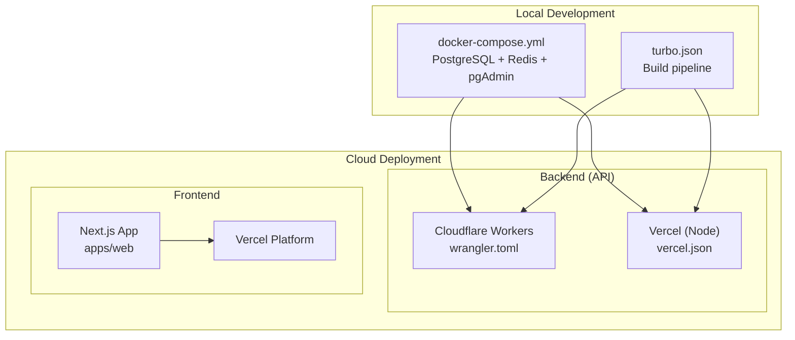
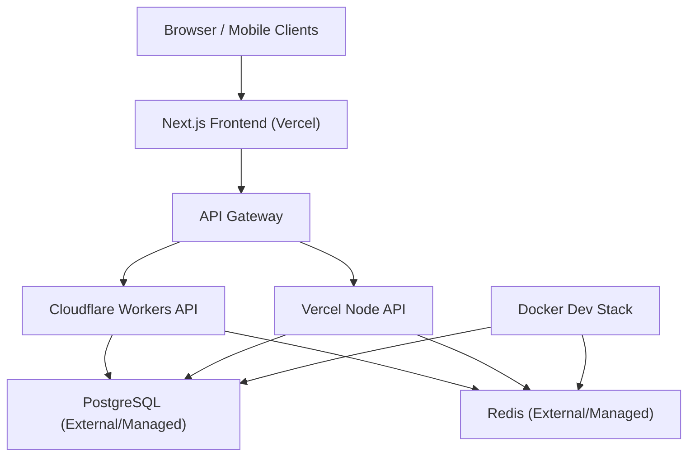
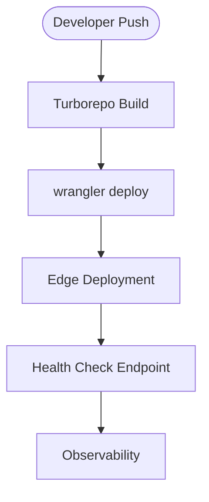
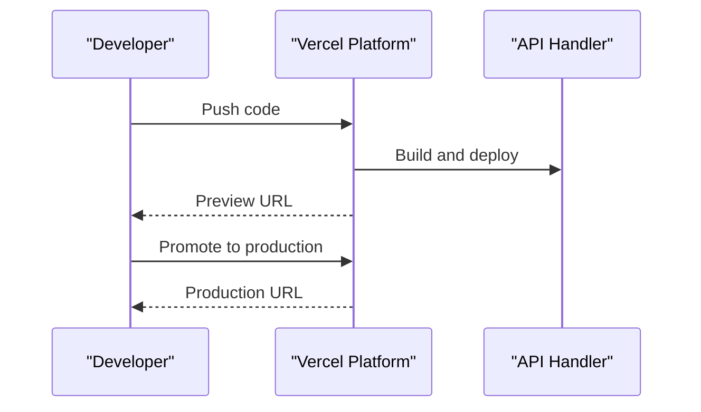
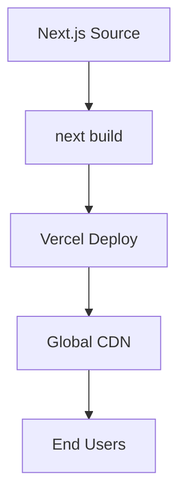
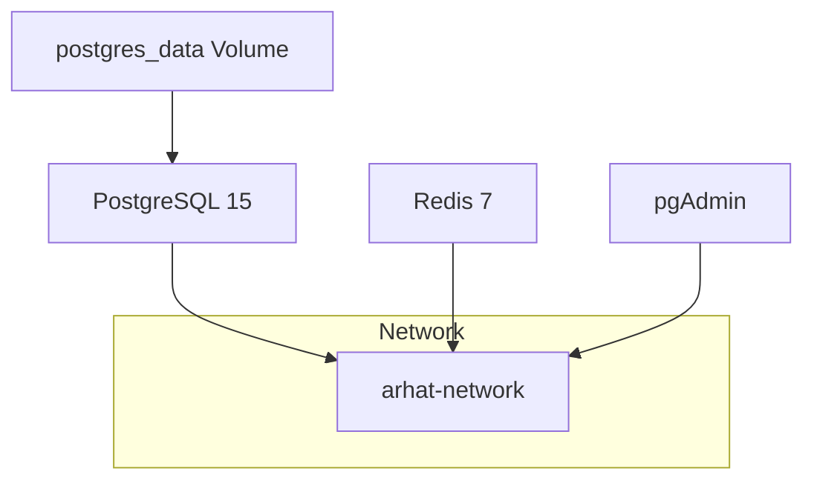
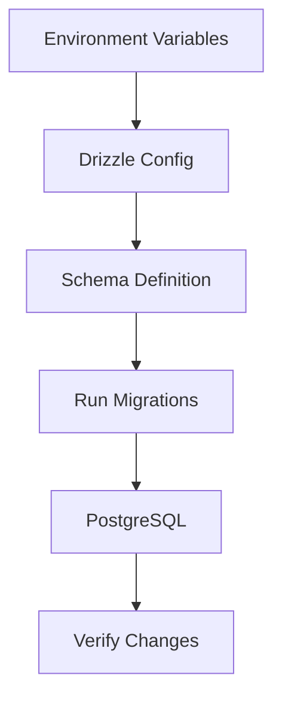
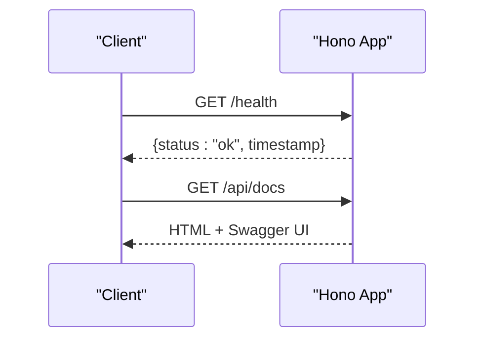
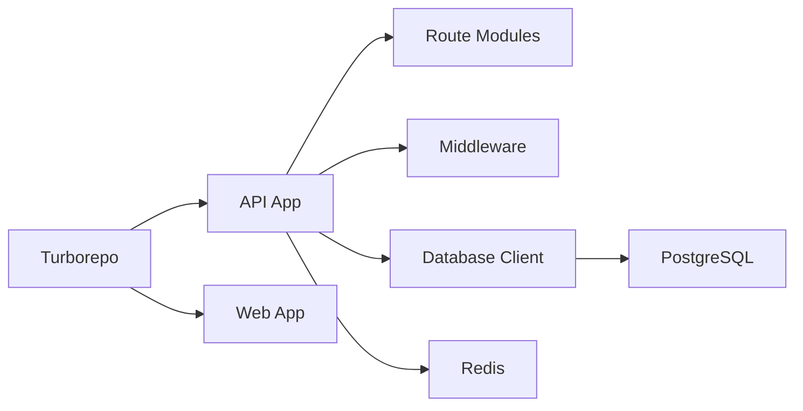

# Deployment & DevOps

<cite>
**Referenced Files in This Document**
- [wrangler.toml](file://apps/api/wrangler.toml)
- [package.json](file://apps/api/package.json)
- [index.ts](file://apps/api/src/index.ts)
- [db.ts](file://apps/api/src/lib/db.ts)
- [drizzle.config.ts](file://apps/api/drizzle.config.ts)
- [migrate.ts](file://apps/api/migrate.ts)
- [run_migration.ts](file://apps/api/scripts/run_migration.ts)
- [vercel.json](file://apps/api/vercel.json)
- [docker-compose.yml](file://docker-compose.yml)
- [turbo.json](file://turbo.json)
- [next.config.ts](file://apps/web/next.config.ts)
- [package.json](file://apps/web/package.json)
- [SETUP_GUIDE.md](file://PRD/SETUP_GUIDE.md)
</cite>

## Table of Contents
1. [Introduction](#introduction)
2. [Project Structure](#project-structure)
3. [Core Components](#core-components)
4. [Architecture Overview](#architecture-overview)
5. [Detailed Component Analysis](#detailed-component-analysis)
6. [Dependency Analysis](#dependency-analysis)
7. [Performance Considerations](#performance-considerations)
8. [Troubleshooting Guide](#troubleshooting-guide)
9. [Conclusion](#conclusion)
10. [Appendices](#appendices)

## Introduction
This document provides comprehensive deployment and DevOps guidance for ARHAT POS. It covers:
- Cloud deployment strategy using Cloudflare Workers for the backend API and Vercel for the frontend application
- Serverless architecture benefits, scaling characteristics, and cost optimization
- Docker containerization approach for local development and potential production deployment
- CI/CD pipeline configuration using GitHub Actions for automated testing, building, and deployment
- Environment configuration management across development, staging, and production
- Infrastructure provisioning, database setup, and external service integrations
- Monitoring and logging strategies, error tracking, and performance monitoring
- Backup procedures, disaster recovery planning, and maintenance workflows
- Deployment rollback procedures, blue-green deployment strategies, and zero-downtime techniques

## Project Structure
ARHAT POS follows a monorepo workspace with two primary applications:
- Backend API built with Hono and deployed via Cloudflare Workers or Vercel
- Frontend application built with Next.js and deployed to Vercel

Key deployment-related configurations:
- Cloudflare Workers configuration for the API
- Vercel configuration for the API and frontend
- Docker Compose for local development databases and caches
- Turborepo pipeline for build orchestration
- Drizzle ORM configuration and migration scripts

**Diagram sources**
- [docker-compose.yml:1-43](file://docker-compose.yml#L1-L43)
- [turbo.json:1-28](file://turbo.json#L1-L28)
- [wrangler.toml:1-10](file://apps/api/wrangler.toml#L1-L10)
- [vercel.json:1-16](file://apps/api/vercel.json#L1-L16)
- [next.config.ts:1-17](file://apps/web/next.config.ts#L1-L17)

**Section sources**
- [docker-compose.yml:1-43](file://docker-compose.yml#L1-L43)
- [turbo.json:1-28](file://turbo.json#L1-L28)
- [wrangler.toml:1-10](file://apps/api/wrangler.toml#L1-L10)
- [vercel.json:1-16](file://apps/api/vercel.json#L1-L16)
- [next.config.ts:1-17](file://apps/web/next.config.ts#L1-L17)

## Core Components
- Cloudflare Workers API runtime
  - Configuration defines the Worker name, entrypoint, compatibility date, and environment variables placeholder
  - Scripts include development, deployment, and testing commands
- Vercel API and Web deployments
  - Vercel configuration for the API routes to a Node runtime
  - Next.js configuration for image remote patterns and build settings
- Local development stack
  - PostgreSQL, Redis, and pgAdmin containers orchestrated via Docker Compose
  - Turborepo pipeline orchestrating builds, linting, type checking, and tests
- Database and migrations
  - Drizzle ORM configuration and migration scripts for schema evolution
  - Runtime database client initialization with fallback handling

**Section sources**
- [wrangler.toml:1-10](file://apps/api/wrangler.toml#L1-L10)
- [package.json:1-37](file://apps/api/package.json#L1-L37)
- [vercel.json:1-16](file://apps/api/vercel.json#L1-L16)
- [next.config.ts:1-17](file://apps/web/next.config.ts#L1-L17)
- [docker-compose.yml:1-43](file://docker-compose.yml#L1-L43)
- [turbo.json:1-28](file://turbo.json#L1-L28)
- [drizzle.config.ts:1-13](file://apps/api/drizzle.config.ts#L1-L13)
- [migrate.ts:1-46](file://apps/api/migrate.ts#L1-L46)
- [run_migration.ts:1-21](file://apps/api/scripts/run_migration.ts#L1-L21)
- [db.ts:1-27](file://apps/api/src/lib/db.ts#L1-L27)

## Architecture Overview
ARHAT POS employs a serverless-first architecture:
- Backend API runs on Cloudflare Workers or Vercel’s Node runtime, enabling global edge deployment with low latency
- Frontend runs on Vercel, leveraging static generation and serverless functions
- Local development uses Docker Compose to simulate production-like infrastructure
- Turborepo coordinates builds and tests across the monorepo

**Diagram sources**
- [wrangler.toml:1-10](file://apps/api/wrangler.toml#L1-L10)
- [vercel.json:1-16](file://apps/api/vercel.json#L1-L16)
- [docker-compose.yml:1-43](file://docker-compose.yml#L1-L43)

## Detailed Component Analysis

### Cloudflare Workers API Deployment
- Purpose: Host the Hono-based backend API on Cloudflare’s edge network
- Configuration highlights:
  - Worker name and entrypoint defined
  - Compatibility date and flags set for modern Node.js compatibility
  - Environment variables placeholder for NODE_ENV
- Deployment commands:
  - Development and deployment scripts configured in the API package.json
- Benefits:
  - Global edge placement reduces latency
  - Pay-per-request pricing model lowers operational costs
  - Built-in DDoS protection and security posture

**Diagram sources**
- [wrangler.toml:1-10](file://apps/api/wrangler.toml#L1-L10)
- [package.json:5-11](file://apps/api/package.json#L5-L11)

**Section sources**
- [wrangler.toml:1-10](file://apps/api/wrangler.toml#L1-L10)
- [package.json:5-11](file://apps/api/package.json#L5-L11)

### Vercel API Deployment
- Purpose: Serve the API via Vercel’s Node runtime with route-based routing
- Configuration highlights:
  - Build step maps the API entrypoint to Vercel’s Node builder
  - Route rewrite ensures all paths are served by the API handler
- Benefits:
  - Seamless integration with Vercel’s global CDN and serverless platform
  - Simplified deployment lifecycle with preview and production environments

**Diagram sources**
- [vercel.json:1-16](file://apps/api/vercel.json#L1-L16)

**Section sources**
- [vercel.json:1-16](file://apps/api/vercel.json#L1-L16)

### Vercel Frontend Deployment
- Purpose: Host the Next.js frontend application on Vercel
- Configuration highlights:
  - Image remote patterns configured for asset loading
  - Build and start scripts managed via package.json
- Benefits:
  - Optimized asset delivery and automatic image optimization
  - Edge caching and global distribution

**Diagram sources**
- [next.config.ts:1-17](file://apps/web/next.config.ts#L1-L17)
- [package.json:5-10](file://apps/web/package.json#L5-L10)

**Section sources**
- [next.config.ts:1-17](file://apps/web/next.config.ts#L1-L17)
- [package.json:5-10](file://apps/web/package.json#L5-L10)

### Local Development with Docker
- Purpose: Provide a reproducible local environment for PostgreSQL, Redis, and database administration
- Services:
  - PostgreSQL 15 with named volume for persistence
  - Redis 7 for caching and session storage
  - pgAdmin for database administration
- Networking:
  - All services on a shared bridge network
- Benefits:
  - Isolation from host system
  - Consistent environment across team members

**Diagram sources**
- [docker-compose.yml:1-43](file://docker-compose.yml#L1-L43)

**Section sources**
- [docker-compose.yml:1-43](file://docker-compose.yml#L1-L43)

### Database and Migrations
- Purpose: Manage schema evolution and data consistency
- Configuration:
  - Drizzle Kit configuration reads DATABASE_URL from environment
  - Migration scripts create tables and alter existing ones safely
- Runtime:
  - Database client initialization with fallback handling when DATABASE_URL is missing
- Benefits:
  - Version-controlled schema changes
  - Safe evolution of database structure

**Diagram sources**
- [drizzle.config.ts:1-13](file://apps/api/drizzle.config.ts#L1-L13)
- [migrate.ts:1-46](file://apps/api/migrate.ts#L1-L46)
- [run_migration.ts:1-21](file://apps/api/scripts/run_migration.ts#L1-L21)
- [db.ts:1-27](file://apps/api/src/lib/db.ts#L1-L27)

**Section sources**
- [drizzle.config.ts:1-13](file://apps/api/drizzle.config.ts#L1-L13)
- [migrate.ts:1-46](file://apps/api/migrate.ts#L1-L46)
- [run_migration.ts:1-21](file://apps/api/scripts/run_migration.ts#L1-L21)
- [db.ts:1-27](file://apps/api/src/lib/db.ts#L1-L27)

### API Routing and Health Checks
- Purpose: Expose routes and health endpoints for monitoring
- Highlights:
  - CORS configuration allows localhost origins and can be extended for production domains
  - Health endpoint returns status and timestamp
  - OpenAPI documentation served via Swagger UI
- Benefits:
  - Clear observability signals
  - Developer-friendly API documentation

**Diagram sources**
- [index.ts:19-99](file://apps/api/src/index.ts#L19-L99)

**Section sources**
- [index.ts:19-99](file://apps/api/src/index.ts#L19-L99)

### CI/CD Pipeline with GitHub Actions
- Purpose: Automate testing, building, and deployment across environments
- Recommended workflow stages:
  - Install dependencies and cache
  - Type check and lint
  - Test suite execution
  - Build artifacts for API and Web
  - Deploy to staging and promote to production
- Benefits:
  - Consistent quality gates
  - Faster feedback loops
  - Reduced human error

[No sources needed since this section provides general guidance]

### Environment Configuration Management
- Purpose: Manage secrets and environment-specific settings across development, staging, and production
- Recommended approach:
  - Use separate environment variable sets per environment
  - Store secrets in platform-managed secret stores (Cloudflare Workers, Vercel, GitHub)
  - Define environment placeholders in configuration files
- Example environment variables:
  - Database connection string
  - JWT secret
  - Supabase credentials
  - Cloudflare account identifiers

**Section sources**
- [wrangler.toml:5-7](file://apps/api/wrangler.toml#L5-L7)
- [SETUP_GUIDE.md:360-377](file://PRD/SETUP_GUIDE.md#L360-L377)

### Infrastructure Provisioning and External Integrations
- Purpose: Provision and integrate external services for production readiness
- Recommendations:
  - Managed PostgreSQL and Redis providers for high availability and backups
  - Cloudflare R2 for object storage (if uploads are enabled)
  - Email/SMS provider SDKs integrated via environment variables
- Benefits:
  - Reliability and scalability
  - Operational simplicity

[No sources needed since this section provides general guidance]

### Monitoring, Logging, and Error Tracking
- Purpose: Ensure visibility into system behavior and quickly resolve issues
- Recommendations:
  - Centralized logging with structured logs
  - Error tracking with Sentry or similar
  - Metrics collection for latency, throughput, and error rates
  - Health checks and synthetic monitoring
- Benefits:
  - Faster incident response
  - Improved reliability insights

[No sources needed since this section provides general guidance]

### Backup, Disaster Recovery, and Maintenance
- Purpose: Protect data and maintain service continuity
- Recommendations:
  - Automated database backups with retention policies
  - Point-in-time recovery procedures
  - Maintenance windows for updates and patches
  - Rollback procedures for deployments
- Benefits:
  - Data safety and compliance
  - Minimal downtime during maintenance

[No sources needed since this section provides general guidance]

### Deployment Rollback, Blue-Green, and Zero-Downtime Strategies
- Purpose: Minimize risk and downtime during releases
- Recommendations:
  - Blue-green deployments with traffic shifting
  - Canary releases with gradual traffic increase
  - Rollback to previous versions with version pinning
  - Health checks before and after deployment
- Benefits:
  - Higher confidence in releases
  - Near-zero downtime deployments

[No sources needed since this section provides general guidance]

## Dependency Analysis
- Internal dependencies:
  - API routes depend on middleware and services
  - Database client depends on environment configuration
- External dependencies:
  - Cloudflare Workers runtime and Vercel platform
  - PostgreSQL and Redis for persistence and caching
- Build and orchestration:
  - Turborepo coordinates pipeline steps and caching

**Diagram sources**
- [index.ts:1-17](file://apps/api/src/index.ts#L1-L17)
- [db.ts:1-27](file://apps/api/src/lib/db.ts#L1-L27)
- [turbo.json:1-28](file://turbo.json#L1-L28)

**Section sources**
- [index.ts:1-17](file://apps/api/src/index.ts#L1-L17)
- [db.ts:1-27](file://apps/api/src/lib/db.ts#L1-L27)
- [turbo.json:1-28](file://turbo.json#L1-L28)

## Performance Considerations
- Serverless benefits:
  - Auto-scaling with concurrency limits
  - Reduced operational overhead
  - Geographic proximity to users
- Cost optimization:
  - Minimize cold starts by keeping functions warm
  - Optimize payload sizes and compress responses
  - Use edge caching for static assets
- Database performance:
  - Connection pooling and prepared statements
  - Indexes and query optimization
  - Read replicas for reporting workloads

[No sources needed since this section provides general guidance]

## Troubleshooting Guide
- Common issues:
  - Missing DATABASE_URL causing initialization failures
  - CORS misconfiguration blocking frontend requests
  - Migration errors due to schema conflicts
- Recommended diagnostics:
  - Verify environment variables in deployment platform
  - Check worker logs and error tracking systems
  - Validate database connectivity and permissions
- Remediation steps:
  - Set required environment variables
  - Align CORS origins with deployed domains
  - Run targeted migrations and verify schema state

**Section sources**
- [db.ts:10-24](file://apps/api/src/lib/db.ts#L10-L24)
- [index.ts:19-35](file://apps/api/src/index.ts#L19-L35)
- [migrate.ts:38-42](file://apps/api/migrate.ts#L38-L42)

## Conclusion
ARHAT POS is designed for scalable, serverless deployment with clear separation between the frontend and backend. The combination of Cloudflare Workers/Vercel for the backend and Vercel for the frontend enables global reach, cost efficiency, and rapid iteration. The Docker-based local development environment ensures consistency, while Turborepo streamlines the build and test pipeline. By implementing robust CI/CD, environment management, monitoring, and disaster recovery practices, the project can achieve reliable, high-performance operations across development, staging, and production.

## Appendices
- Environment variable template and setup guide are available in the project documentation.

**Section sources**
- [SETUP_GUIDE.md:360-377](file://PRD/SETUP_GUIDE.md#L360-L377)