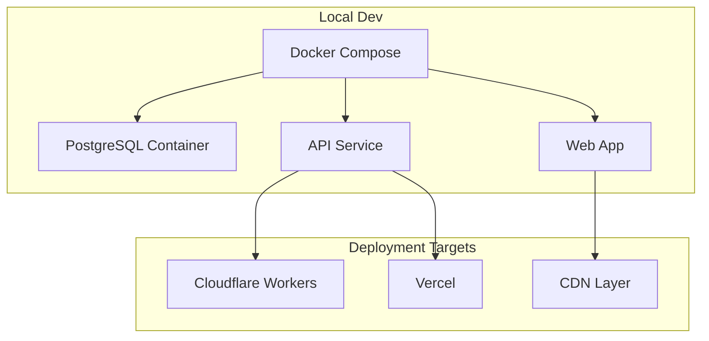
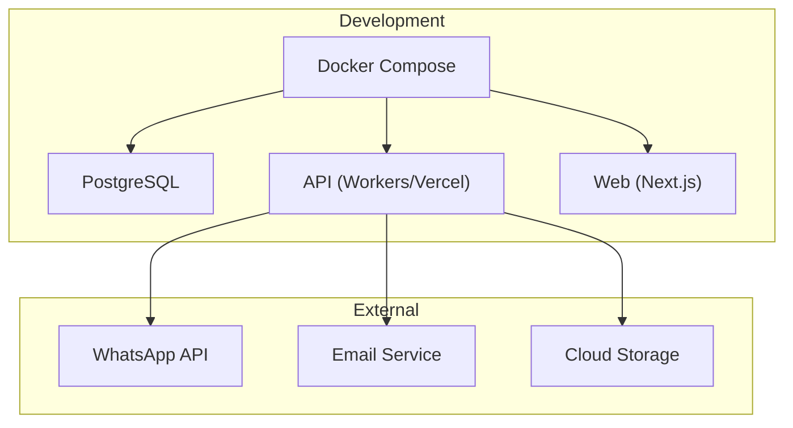
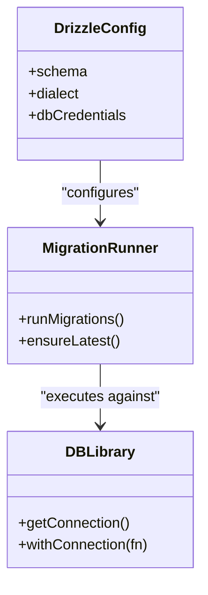
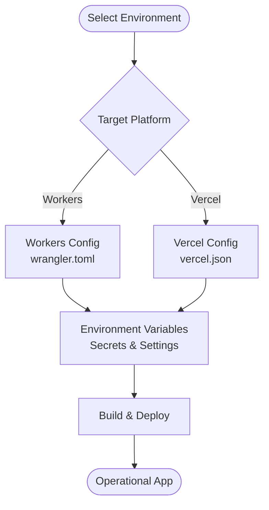
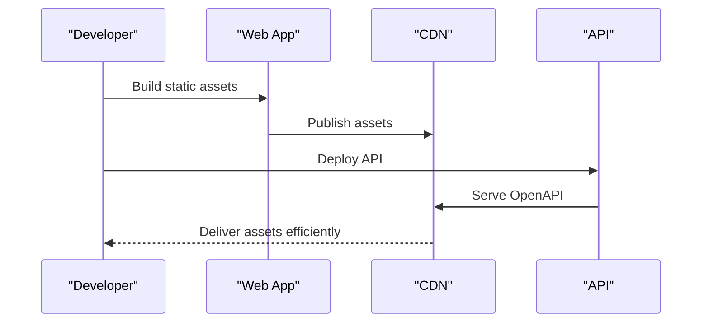
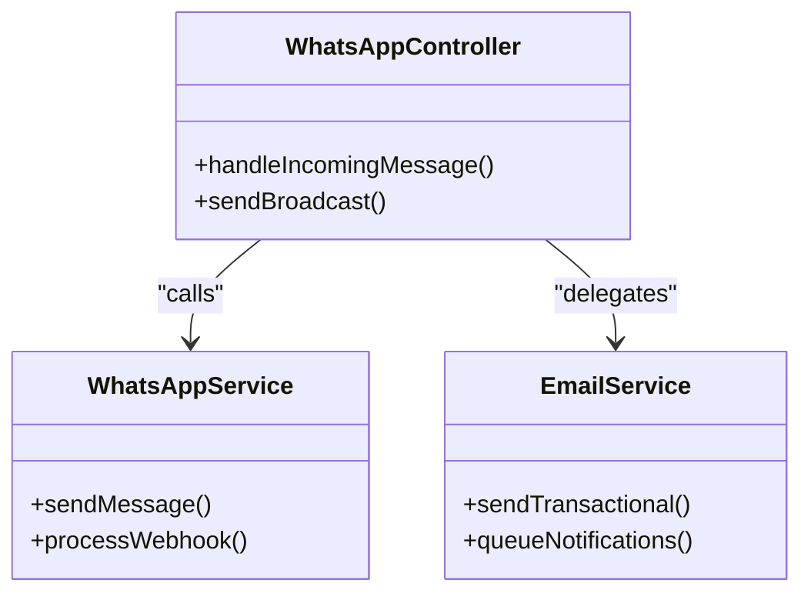
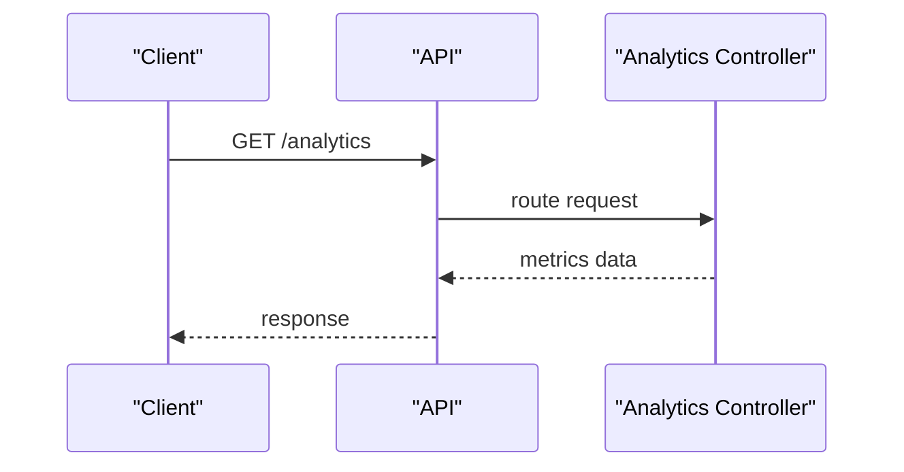
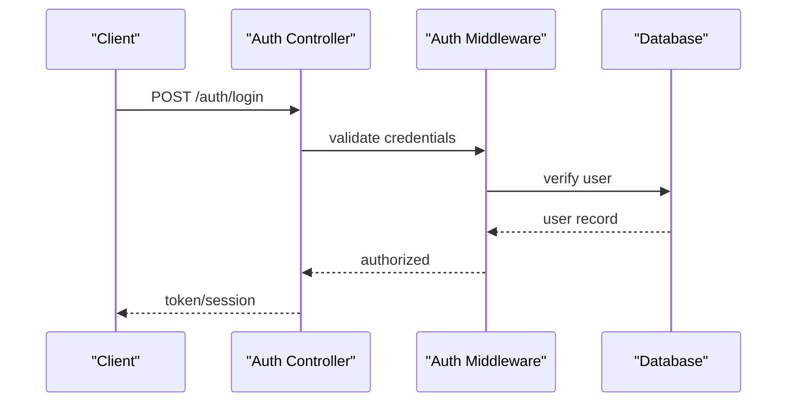
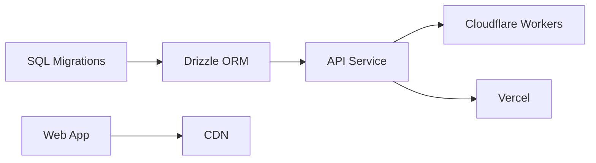

# Infrastructure & Environment Management

<cite>
**Referenced Files in This Document**
- [docker-compose.yml](file://docker-compose.yml)
- [apps/api/wrangler.toml](file://apps/api/wrangler.toml)
- [apps/api/vercel.json](file://apps/api/vercel.json)
- [apps/api/drizzle.config.ts](file://apps/api/drizzle.config.ts)
- [apps/api/migrations/0000_dashing_albert_cleary.sql](file://apps/api/migrations/0000_dashing_albert_cleary.sql)
- [apps/api/migrations/0001_damp_sunfire.sql](file://apps/api/migrations/0001_damp_sunfire.sql)
- [apps/api/migrations/0002_light_katie_power.sql](file://apps/api/migrations/0002_light_katie_power.sql)
- [apps/api/migrations/0003_tearful_supernaut.sql](file://apps/api/migrations/0003_tearful_supernaut.sql)
- [apps/api/scripts/run_migration.ts](file://apps/api/scripts/run_migration.ts)
- [apps/api/src/lib/db.ts](file://apps/api/src/lib/db.ts)
- [apps/api/src/services/whatsapp.service.ts](file://apps/api/src/services/whatsapp.service.ts)
- [apps/api/src/services/email.service.ts](file://apps/api/src/services/email.service.ts)
- [apps/api/src/controllers/whatsapp.controller.ts](file://apps/api/src/controllers/whatsapp.controller.ts)
- [apps/api/src/controllers/analytics.controller.ts](file://apps/api/src/controllers/analytics.controller.ts)
- [apps/api/src/controllers/auth.controller.ts](file://apps/api/src/controllers/auth.controller.ts)
- [apps/web/next.config.ts](file://apps/web/next.config.ts)
- [apps/web/package.json](file://apps/web/package.json)
- [apps/api/package.json](file://apps/api/package.json)
- [apps/api/public/openapi.json](file://apps/api/public/openapi.json)
</cite>

## Table of Contents
1. [Introduction](#introduction)
2. [Project Structure](#project-structure)
3. [Core Components](#core-components)
4. [Architecture Overview](#architecture-overview)
5. [Detailed Component Analysis](#detailed-component-analysis)
6. [Dependency Analysis](#dependency-analysis)
7. [Performance Considerations](#performance-considerations)
8. [Troubleshooting Guide](#troubleshooting-guide)
9. [Conclusion](#conclusion)
10. [Appendices](#appendices)

## Introduction
This document describes the infrastructure and environment management for ARHAT POS, focusing on provisioning strategy, environment separation, database setup with Drizzle ORM and migrations, CDN configuration, external service integrations (WhatsApp, email, cloud storage), monitoring and alerting, backups and disaster recovery, security controls, and capacity planning with cost optimization.

## Project Structure
The project is a monorepo with two primary applications:
- API service (Cloudflare Workers via Wrangler, optionally deployable to Vercel)
- Web application (Next.js)

Infrastructure orchestration is handled via Docker Compose for local development and deployment preparation. Database migrations are managed with Drizzle Kit and SQL migration files. CDN and static assets are served through the web app’s build pipeline and deployment targets.

**Section sources**
- [docker-compose.yml:1-200](file://docker-compose.yml#L1-L200)
- [apps/api/wrangler.toml:1-200](file://apps/api/wrangler.toml#L1-L200)
- [apps/api/vercel.json:1-200](file://apps/api/vercel.json#L1-L200)
- [apps/web/next.config.ts:1-200](file://apps/web/next.config.ts#L1-L200)

## Core Components
- Database and migrations: PostgreSQL with Drizzle ORM and SQL migration files under the API app.
- API runtime: Cloudflare Workers via Wrangler; optional Vercel target.
- Web app: Next.js serving static assets and acting as a frontend CDN consumer.
- CDN: Static assets and OpenAPI served via web app and deployment targets.
- External services: WhatsApp API and email service abstractions present in the API app.

**Section sources**
- [apps/api/drizzle.config.ts:1-200](file://apps/api/drizzle.config.ts#L1-L200)
- [apps/api/migrations/0000_dashing_albert_cleary.sql:1-200](file://apps/api/migrations/0000_dashing_albert_cleary.sql#L1-L200)
- [apps/api/migrations/0001_damp_sunfire.sql:1-200](file://apps/api/migrations/0001_damp_sunfire.sql#L1-L200)
- [apps/api/migrations/0002_light_katie_power.sql:1-200](file://apps/api/migrations/0002_light_katie_power.sql#L1-L200)
- [apps/api/migrations/0003_tearful_supernaut.sql:1-200](file://apps/api/migrations/0003_tearful_supernaut.sql#L1-L200)
- [apps/api/src/lib/db.ts:1-200](file://apps/api/src/lib/db.ts#L1-L200)
- [apps/api/src/services/whatsapp.service.ts:1-200](file://apps/api/src/services/whatsapp.service.ts#L1-L200)
- [apps/api/src/services/email.service.ts:1-200](file://apps/api/src/services/email.service.ts#L1-L200)
- [apps/api/public/openapi.json:1-200](file://apps/api/public/openapi.json#L1-L200)

## Architecture Overview
The system comprises:
- Local development orchestrated by Docker Compose with a PostgreSQL container.
- API deployed to Cloudflare Workers (Wrangler) and/or Vercel.
- Web app built and served statically; CDN benefits from Next.js output and deployment targets.
- External integrations for messaging and email through dedicated services.

**Diagram sources**
- [docker-compose.yml:1-200](file://docker-compose.yml#L1-L200)
- [apps/api/wrangler.toml:1-200](file://apps/api/wrangler.toml#L1-L200)
- [apps/api/vercel.json:1-200](file://apps/api/vercel.json#L1-L200)
- [apps/api/src/services/whatsapp.service.ts:1-200](file://apps/api/src/services/whatsapp.service.ts#L1-L200)
- [apps/api/src/services/email.service.ts:1-200](file://apps/api/src/services/email.service.ts#L1-L200)

## Detailed Component Analysis

### Database Infrastructure and Drizzle ORM
- Drizzle configuration defines schema and dialect settings for PostgreSQL.
- Migrations are stored as SQL files and tracked via snapshot metadata.
- Migration runner script executes migrations at startup or CI/CD steps.
- Database connection management is encapsulated in the database library module.

**Diagram sources**
- [apps/api/drizzle.config.ts:1-200](file://apps/api/drizzle.config.ts#L1-L200)
- [apps/api/scripts/run_migration.ts:1-200](file://apps/api/scripts/run_migration.ts#L1-L200)
- [apps/api/src/lib/db.ts:1-200](file://apps/api/src/lib/db.ts#L1-L200)

**Section sources**
- [apps/api/drizzle.config.ts:1-200](file://apps/api/drizzle.config.ts#L1-L200)
- [apps/api/migrations/0000_dashing_albert_cleary.sql:1-200](file://apps/api/migrations/0000_dashing_albert_cleary.sql#L1-L200)
- [apps/api/migrations/0001_damp_sunfire.sql:1-200](file://apps/api/migrations/0001_damp_sunfire.sql#L1-L200)
- [apps/api/migrations/0002_light_katie_power.sql:1-200](file://apps/api/migrations/0002_light_katie_power.sql#L1-L200)
- [apps/api/migrations/0003_tearful_supernaut.sql:1-200](file://apps/api/migrations/0003_tearful_supernaut.sql#L1-L200)
- [apps/api/scripts/run_migration.ts:1-200](file://apps/api/scripts/run_migration.ts#L1-L200)
- [apps/api/src/lib/db.ts:1-200](file://apps/api/src/lib/db.ts#L1-L200)

### Environment Configuration Management
- API supports multiple deployment targets (Workers via Wrangler and Vercel), enabling environment separation.
- Environment variables are referenced in deployment configuration files for Workers and Vercel.
- Web app configuration supports build-time and runtime environment handling.

**Diagram sources**
- [apps/api/wrangler.toml:1-200](file://apps/api/wrangler.toml#L1-L200)
- [apps/api/vercel.json:1-200](file://apps/api/vercel.json#L1-L200)
- [apps/web/next.config.ts:1-200](file://apps/web/next.config.ts#L1-L200)

**Section sources**
- [apps/api/wrangler.toml:1-200](file://apps/api/wrangler.toml#L1-L200)
- [apps/api/vercel.json:1-200](file://apps/api/vercel.json#L1-L200)
- [apps/web/next.config.ts:1-200](file://apps/web/next.config.ts#L1-L200)

### CDN Configuration and Static Assets
- Static assets and OpenAPI documentation are exposed via the web app and deployment targets.
- CDN benefits from Next.js output and platform-specific deployment settings.

**Diagram sources**
- [apps/web/next.config.ts:1-200](file://apps/web/next.config.ts#L1-L200)
- [apps/api/public/openapi.json:1-200](file://apps/api/public/openapi.json#L1-L200)

**Section sources**
- [apps/web/next.config.ts:1-200](file://apps/web/next.config.ts#L1-L200)
- [apps/api/public/openapi.json:1-200](file://apps/api/public/openapi.json#L1-L200)

### External Service Integrations
- WhatsApp API integration is implemented via a controller and service layer.
- Email service integration is implemented via a service layer.
- Both integrations are designed as modular services for maintainability and testing.

**Diagram sources**
- [apps/api/src/controllers/whatsapp.controller.ts:1-200](file://apps/api/src/controllers/whatsapp.controller.ts#L1-L200)
- [apps/api/src/services/whatsapp.service.ts:1-200](file://apps/api/src/services/whatsapp.service.ts#L1-L200)
- [apps/api/src/services/email.service.ts:1-200](file://apps/api/src/services/email.service.ts#L1-L200)

**Section sources**
- [apps/api/src/controllers/whatsapp.controller.ts:1-200](file://apps/api/src/controllers/whatsapp.controller.ts#L1-L200)
- [apps/api/src/services/whatsapp.service.ts:1-200](file://apps/api/src/services/whatsapp.service.ts#L1-L200)
- [apps/api/src/services/email.service.ts:1-200](file://apps/api/src/services/email.service.ts#L1-L200)

### Analytics and Monitoring
- Analytics controller exposes endpoints for reporting and insights.
- Monitoring and alerting are not explicitly configured in the repository; however, the presence of analytics endpoints indicates a foundation for observability.

**Diagram sources**
- [apps/api/src/controllers/analytics.controller.ts:1-200](file://apps/api/src/controllers/analytics.controller.ts#L1-L200)

**Section sources**
- [apps/api/src/controllers/analytics.controller.ts:1-200](file://apps/api/src/controllers/analytics.controller.ts#L1-L200)

### Authentication and Access Control
- Authentication controller and middleware provide foundational access control mechanisms.
- Secret management and environment separation are supported by deployment configurations.

**Diagram sources**
- [apps/api/src/controllers/auth.controller.ts:1-200](file://apps/api/src/controllers/auth.controller.ts#L1-L200)

**Section sources**
- [apps/api/src/controllers/auth.controller.ts:1-200](file://apps/api/src/controllers/auth.controller.ts#L1-L200)

## Dependency Analysis
- API depends on Drizzle ORM for database operations and migration management.
- Web app depends on Next.js configuration for asset handling and deployment.
- Deployment targets (Workers and Vercel) depend on environment variable configuration.

**Diagram sources**
- [apps/api/drizzle.config.ts:1-200](file://apps/api/drizzle.config.ts#L1-L200)
- [apps/api/wrangler.toml:1-200](file://apps/api/wrangler.toml#L1-L200)
- [apps/api/vercel.json:1-200](file://apps/api/vercel.json#L1-L200)
- [apps/web/next.config.ts:1-200](file://apps/web/next.config.ts#L1-L200)

**Section sources**
- [apps/api/drizzle.config.ts:1-200](file://apps/api/drizzle.config.ts#L1-L200)
- [apps/api/wrangler.toml:1-200](file://apps/api/wrangler.toml#L1-L200)
- [apps/api/vercel.json:1-200](file://apps/api/vercel.json#L1-L200)
- [apps/web/next.config.ts:1-200](file://apps/web/next.config.ts#L1-L200)

## Performance Considerations
- Use connection pooling and keep-alive settings in the database library for efficient resource utilization.
- Enable compression and caching in the web app and CDN for reduced latency.
- Optimize migration execution timing to minimize downtime during deployments.
- Monitor API response times and throughput via analytics endpoints and platform dashboards.

[No sources needed since this section provides general guidance]

## Troubleshooting Guide
- Verify database connectivity and credentials in the database library module.
- Confirm migration runner executes successfully before application startup.
- Check environment variable configuration for Workers and Vercel deployments.
- Review analytics controller logs for insight into operational health.

**Section sources**
- [apps/api/src/lib/db.ts:1-200](file://apps/api/src/lib/db.ts#L1-L200)
- [apps/api/scripts/run_migration.ts:1-200](file://apps/api/scripts/run_migration.ts#L1-L200)
- [apps/api/wrangler.toml:1-200](file://apps/api/wrangler.toml#L1-L200)
- [apps/api/vercel.json:1-200](file://apps/api/vercel.json#L1-L200)
- [apps/api/src/controllers/analytics.controller.ts:1-200](file://apps/api/src/controllers/analytics.controller.ts#L1-L200)

## Conclusion
ARHAT POS employs a modular infrastructure leveraging Drizzle ORM, SQL migrations, and flexible deployment targets (Workers and Vercel). The web app provides CDN-ready static assets, while external services integrate via dedicated controllers and services. Observability foundations exist through analytics endpoints, and environment separation is supported by deployment configurations. Further enhancements can focus on explicit monitoring/alerting, hardened security controls, and documented backup/disaster recovery procedures.

[No sources needed since this section summarizes without analyzing specific files]

## Appendices

### Appendix A: Environment Separation Matrix
- Development: Local Docker Compose with PostgreSQL container.
- Staging: Workers/Vercel with staging environment variables.
- Production: Workers/Vercel with production environment variables.

**Section sources**
- [docker-compose.yml:1-200](file://docker-compose.yml#L1-L200)
- [apps/api/wrangler.toml:1-200](file://apps/api/wrangler.toml#L1-L200)
- [apps/api/vercel.json:1-200](file://apps/api/vercel.json#L1-L200)

### Appendix B: Database Migration Lifecycle
- Initialize schema and snapshots.
- Apply incremental SQL migrations.
- Run migration script during deployment.

**Section sources**
- [apps/api/drizzle.config.ts:1-200](file://apps/api/drizzle.config.ts#L1-L200)
- [apps/api/migrations/0000_dashing_albert_cleary.sql:1-200](file://apps/api/migrations/0000_dashing_albert_cleary.sql#L1-L200)
- [apps/api/migrations/0001_damp_sunfire.sql:1-200](file://apps/api/migrations/0001_damp_sunfire.sql#L1-L200)
- [apps/api/migrations/0002_light_katie_power.sql:1-200](file://apps/api/migrations/0002_light_katie_power.sql#L1-L200)
- [apps/api/migrations/0003_tearful_supernaut.sql:1-200](file://apps/api/migrations/0003_tearful_supernaut.sql#L1-L200)
- [apps/api/scripts/run_migration.ts:1-200](file://apps/api/scripts/run_migration.ts#L1-L200)

### Appendix C: External Services Inventory
- WhatsApp API: Implemented via controller and service.
- Email Service: Implemented via service.
- Cloud Storage: Not explicitly configured in the repository.

**Section sources**
- [apps/api/src/controllers/whatsapp.controller.ts:1-200](file://apps/api/src/controllers/whatsapp.controller.ts#L1-L200)
- [apps/api/src/services/whatsapp.service.ts:1-200](file://apps/api/src/services/whatsapp.service.ts#L1-L200)
- [apps/api/src/services/email.service.ts:1-200](file://apps/api/src/services/email.service.ts#L1-L200)