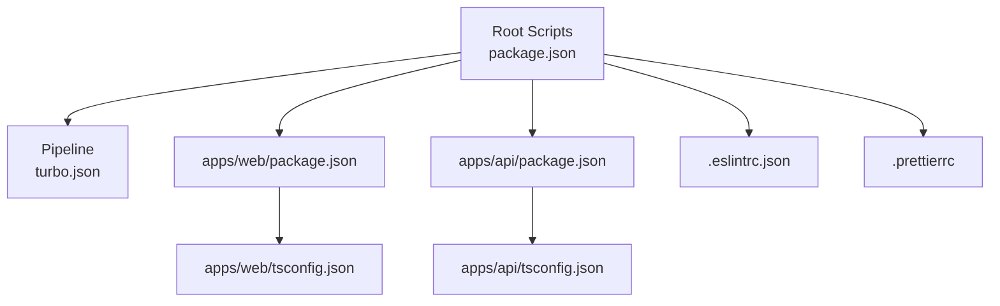
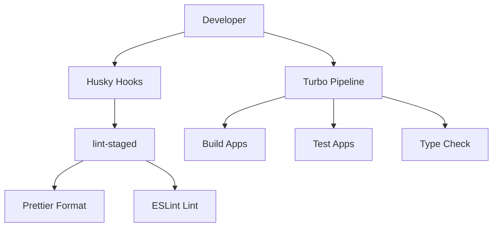
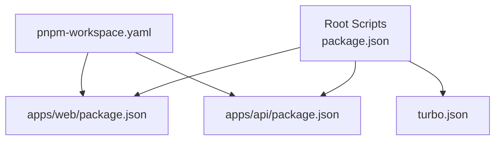
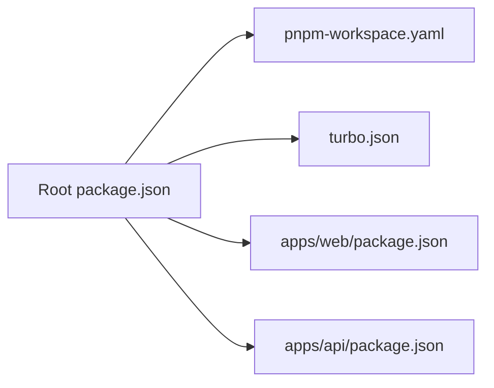

# Development Guidelines

<cite>
**Referenced Files in This Document**
- [package.json](file://package.json)
- [pnpm-workspace.yaml](file://pnpm-workspace.yaml)
- [turbo.json](file://turbo.json)
- [.eslintrc.json](file://.eslintrc.json)
- [.prettierrc](file://.prettierrc)
- [apps/web/eslint.config.mjs](file://apps/web/eslint.config.mjs)
- [apps/web/package.json](file://apps/web/package.json)
- [apps/api/package.json](file://apps/api/package.json)
- [apps/web/tsconfig.json](file://apps/web/tsconfig.json)
- [apps/api/tsconfig.json](file://apps/api/tsconfig.json)
- [apps/web/next.config.ts](file://apps/web/next.config.ts)
- [README.md](file://README.md)
</cite>

## Table of Contents
1. [Introduction](#introduction)
2. [Project Structure](#project-structure)
3. [Core Components](#core-components)
4. [Architecture Overview](#architecture-overview)
5. [Detailed Component Analysis](#detailed-component-analysis)
6. [Dependency Analysis](#dependency-analysis)
7. [Performance Considerations](#performance-considerations)
8. [Security Coding Practices](#security-coding-practices)
9. [Accessibility Standards](#accessibility-standards)
10. [Debugging and Profiling](#debugging-and-profiling)
11. [Contribution Guidelines](#contribution-guidelines)
12. [Code Review and Quality Gates](#code-review-and-quality-gates)
13. [Git Workflow and Branching](#git-workflow-and-branching)
14. [Monorepo Development with pnpm Workspace and Turbo](#monorepo-development-with-pnpm-workspace-and-turbo)
15. [Dependency Management and Versioning](#dependency-management-and-versioning)
16. [Release Procedures](#release-procedures)
17. [Development Environment Setup](#development-environment-setup)
18. [Onboarding and Mentorship](#onboarding-and-mentorship)
19. [Troubleshooting Guide](#troubleshooting-guide)
20. [Conclusion](#conclusion)

## Introduction
This document defines the contributor development guidelines for ARHAT POS. It consolidates code style standards (ESLint, Prettier, TypeScript), Git workflow, code review and quality gates, monorepo practices with pnpm and Turbo, dependency and versioning strategies, release procedures, performance and security practices, accessibility standards, debugging and profiling, contribution and collaboration norms, onboarding, and troubleshooting.

## Project Structure
ARHAT POS is a monorepo organized into:
- apps: Application packages (web frontend and api backend)
- packages: Shared packages (e.g., eslint-config)
- Root scripts and tooling for linting, formatting, building, testing, and type checking orchestrated via Turbo

**Diagram sources**
- [package.json:10-18](file://package.json#L10-L18)
- [turbo.json:1-28](file://turbo.json#L1-L28)
- [apps/web/package.json:1-40](file://apps/web/package.json#L1-L40)
- [apps/api/package.json:1-37](file://apps/api/package.json#L1-L37)
- [.eslintrc.json:1-4](file://.eslintrc.json#L1-L4)
- [.prettierrc:1-9](file://.prettierrc#L1-L9)
- [apps/web/tsconfig.json:1-35](file://apps/web/tsconfig.json#L1-L35)
- [apps/api/tsconfig.json:1-19](file://apps/api/tsconfig.json#L1-L19)

**Section sources**
- [package.json:10-18](file://package.json#L10-L18)
- [pnpm-workspace.yaml:1-10](file://pnpm-workspace.yaml#L1-L10)
- [turbo.json:1-28](file://turbo.json#L1-L28)

## Core Components
- Code Style
  - ESLint: Root extends a shared config package; web app uses Next-specific ESLint configuration.
  - Prettier: Centralized formatting rules applied across the repo.
  - TypeScript: Strict compiler options per app with path aliases and module resolution tailored to Next and Cloudflare Workers environments.
- Tooling
  - Husky and lint-staged for pre-commit enforcement.
  - Turbo pipeline orchestrating build, lint, type-check, test, and dev tasks.
  - Root scripts for dev, build, test, lint, type-check, and format.

**Section sources**
- [.eslintrc.json:1-4](file://.eslintrc.json#L1-L4)
- [apps/web/eslint.config.mjs:1-19](file://apps/web/eslint.config.mjs#L1-L19)
- [.prettierrc:1-9](file://.prettierrc#L1-L9)
- [apps/web/tsconfig.json:1-35](file://apps/web/tsconfig.json#L1-L35)
- [apps/api/tsconfig.json:1-19](file://apps/api/tsconfig.json#L1-L19)
- [package.json:10-18](file://package.json#L10-L18)

## Architecture Overview
High-level development workflow across the monorepo:

**Diagram sources**
- [package.json:19-28](file://package.json#L19-L28)
- [turbo.json:1-28](file://turbo.json#L1-L28)

## Detailed Component Analysis

### Code Style Standards

#### ESLint Rules
- Root extends a shared config package for consistent lint rules across apps.
- The web app uses Next’s ESLint configuration and overrides default ignores to include generated types and app sources.

Recommended actions:
- Run lint before committing to catch issues early.
- Keep shared rules in the config package aligned with team preferences.

**Section sources**
- [.eslintrc.json:1-4](file://.eslintrc.json#L1-L4)
- [apps/web/eslint.config.mjs:1-19](file://apps/web/eslint.config.mjs#L1-L19)

#### Prettier Formatting Configuration
- Centralized formatting rules enforce consistent code appearance.
- Root format script applies formatting across TypeScript, TypeScript React, Markdown, and JSON files.

Recommended actions:
- Configure editor integrations to format on save.
- Run formatting as part of pre-commit checks.

**Section sources**
- [.prettierrc:1-9](file://.prettierrc#L1-L9)
- [package.json:16](file://package.json#L16)

#### TypeScript Coding Conventions
- Strict compiler options enabled for both apps.
- Path aliases (@/*) configured for clean imports.
- Module resolution and JSX settings tailored to Next and Cloudflare Workers environments.

Recommended actions:
- Prefer strict mode and incremental builds.
- Use path aliases consistently.
- Align JSX settings with framework requirements.

**Section sources**
- [apps/web/tsconfig.json:1-35](file://apps/web/tsconfig.json#L1-L35)
- [apps/api/tsconfig.json:1-19](file://apps/api/tsconfig.json#L1-L19)

### Git Workflow and Branching
- Use feature branches for work-in-progress.
- Keep commits focused and atomic.
- Follow commit message conventions (see Contribution Guidelines).
- Open pull requests for code review before merging.

[No sources needed since this section provides general guidance]

### Code Review and Quality Gates
- Pull requests require at least one approving review.
- All quality gates must pass: lint, type-check, and tests.
- Merge after successful CI checks and approvals.

[No sources needed since this section provides general guidance]

### Monorepo Development with pnpm Workspace and Turbo

**Diagram sources**
- [pnpm-workspace.yaml:1-10](file://pnpm-workspace.yaml#L1-L10)
- [turbo.json:1-28](file://turbo.json#L1-L28)
- [apps/web/package.json:1-40](file://apps/web/package.json#L1-L40)
- [apps/api/package.json:1-37](file://apps/api/package.json#L1-L37)
- [package.json:10-18](file://package.json#L10-L18)

**Section sources**
- [pnpm-workspace.yaml:1-10](file://pnpm-workspace.yaml#L1-L10)
- [turbo.json:1-28](file://turbo.json#L1-L28)
- [package.json:10-18](file://package.json#L10-L18)

### Dependency Management and Versioning
- Dependencies are managed at the workspace root and per-app level.
- Use workspace:* for internal package references.
- Keep Node and pnpm versions aligned with engines and devDependencies.

Recommended actions:
- Pin versions carefully; prefer caret ranges for libraries.
- Use workspace references for internal packages.
- Regularly audit dependencies and update as needed.

**Section sources**
- [apps/api/package.json:25-35](file://apps/api/package.json#L25-L35)
- [apps/web/package.json:29-38](file://apps/web/package.json#L29-L38)
- [package.json:6-9](file://package.json#L6-L9)

### Release Procedures
- Tag releases following semantic versioning.
- Publish internal packages to the workspace registry or private feed as appropriate.
- For apps, build artifacts are produced via Turbo; ensure deployment configurations are updated accordingly.

[No sources needed since this section provides general guidance]

### Performance Considerations
- Enable strict TypeScript checks to catch performance pitfalls early.
- Use incremental builds and caching in Turbo where applicable.
- Optimize asset loading and image handling in the Next app.

[No sources needed since this section provides general guidance]

### Security Coding Practices
- Validate and sanitize inputs; use Zod for runtime validation.
- Enforce HTTPS and secure headers in Next configuration.
- Manage secrets via environment variables and avoid committing sensitive data.

**Section sources**
- [apps/api/package.json:13-23](file://apps/api/package.json#L13-L23)
- [apps/web/next.config.ts:1-17](file://apps/web/next.config.ts#L1-L17)

### Accessibility Standards
- Use semantic HTML and ARIA attributes where needed.
- Ensure keyboard navigation and screen reader compatibility.
- Test color contrast and focus indicators.

[No sources needed since this section provides general guidance]

### Debugging and Profiling
- Use framework-specific dev servers (Next dev, Cloudflare Workers local).
- Leverage browser devtools and React DevTools for frontend debugging.
- Profile network requests and rendering performance.

**Section sources**
- [apps/web/package.json:5-6](file://apps/web/package.json#L5-L6)
- [apps/api/package.json:5-7](file://apps/api/package.json#L5-L7)

### Contribution Guidelines
- Fork and branch from the default branch.
- Follow commit message conventions and keep messages clear and descriptive.
- Open a pull request with a concise description and links to related issues.

[No sources needed since this section provides general guidance]

### Onboarding and Mentorship
- New contributors should review the README and setup guide.
- Pair with a mentor for initial tasks and code walkthroughs.
- Participate in stand-ups and knowledge sharing sessions.

[No sources needed since this section provides general guidance]

## Dependency Analysis

**Diagram sources**
- [package.json:1-30](file://package.json#L1-L30)
- [pnpm-workspace.yaml:1-10](file://pnpm-workspace.yaml#L1-L10)
- [turbo.json:1-28](file://turbo.json#L1-L28)
- [apps/web/package.json:1-40](file://apps/web/package.json#L1-L40)
- [apps/api/package.json:1-37](file://apps/api/package.json#L1-L37)

**Section sources**
- [package.json:1-30](file://package.json#L1-L30)
- [pnpm-workspace.yaml:1-10](file://pnpm-workspace.yaml#L1-L10)
- [turbo.json:1-28](file://turbo.json#L1-L28)

## Performance Considerations
- Enable strict TypeScript checks to catch performance pitfalls early.
- Use incremental builds and caching in Turbo where applicable.
- Optimize asset loading and image handling in the Next app.

[No sources needed since this section provides general guidance]

## Security Coding Practices
- Validate and sanitize inputs; use Zod for runtime validation.
- Enforce HTTPS and secure headers in Next configuration.
- Manage secrets via environment variables and avoid committing sensitive data.

**Section sources**
- [apps/api/package.json:13-23](file://apps/api/package.json#L13-L23)
- [apps/web/next.config.ts:1-17](file://apps/web/next.config.ts#L1-L17)

## Accessibility Standards
- Use semantic HTML and ARIA attributes where needed.
- Ensure keyboard navigation and screen reader compatibility.
- Test color contrast and focus indicators.

[No sources needed since this section provides general guidance]

## Debugging and Profiling
- Use framework-specific dev servers (Next dev, Cloudflare Workers local).
- Leverage browser devtools and React DevTools for frontend debugging.
- Profile network requests and rendering performance.

**Section sources**
- [apps/web/package.json:5-6](file://apps/web/package.json#L5-L6)
- [apps/api/package.json:5-7](file://apps/api/package.json#L5-L7)

## Contribution Guidelines
- Fork and branch from the default branch.
- Follow commit message conventions and keep messages clear and descriptive.
- Open a pull request with a concise description and links to related issues.

[No sources needed since this section provides general guidance]

## Code Review and Quality Gates
- Pull requests require at least one approving review.
- All quality gates must pass: lint, type-check, and tests.
- Merge after successful CI checks and approvals.

[No sources needed since this section provides general guidance]

## Git Workflow and Branching
- Use feature branches for work-in-progress.
- Keep commits focused and atomic.
- Follow commit message conventions (see Contribution Guidelines).
- Open pull requests for code review before merging.

[No sources needed since this section provides general guidance]

## Monorepo Development with pnpm Workspace and Turbo

**Diagram sources**
- [pnpm-workspace.yaml:1-10](file://pnpm-workspace.yaml#L1-L10)
- [turbo.json:1-28](file://turbo.json#L1-L28)
- [apps/web/package.json:1-40](file://apps/web/package.json#L1-L40)
- [apps/api/package.json:1-37](file://apps/api/package.json#L1-L37)
- [package.json:10-18](file://package.json#L10-L18)

**Section sources**
- [pnpm-workspace.yaml:1-10](file://pnpm-workspace.yaml#L1-L10)
- [turbo.json:1-28](file://turbo.json#L1-L28)
- [package.json:10-18](file://package.json#L10-L18)

## Dependency Management and Versioning
- Dependencies are managed at the workspace root and per-app level.
- Use workspace:* for internal package references.
- Keep Node and pnpm versions aligned with engines and devDependencies.

Recommended actions:
- Pin versions carefully; prefer caret ranges for libraries.
- Use workspace references for internal packages.
- Regularly audit dependencies and update as needed.

**Section sources**
- [apps/api/package.json:25-35](file://apps/api/package.json#L25-L35)
- [apps/web/package.json:29-38](file://apps/web/package.json#L29-L38)
- [package.json:6-9](file://package.json#L6-L9)

## Release Procedures
- Tag releases following semantic versioning.
- Publish internal packages to the workspace registry or private feed as appropriate.
- For apps, build artifacts are produced via Turbo; ensure deployment configurations are updated accordingly.

[No sources needed since this section provides general guidance]

## Development Environment Setup
- Install Node and pnpm as defined in engines.
- Install Husky hooks locally.
- Run the monorepo scripts for development, building, testing, linting, and type-checking.

**Section sources**
- [package.json:6-9](file://package.json#L6-L9)
- [package.json:17](file://package.json#L17)
- [package.json:10-18](file://package.json#L10-L18)

## Onboarding and Mentorship
- New contributors should review the README and setup guide.
- Pair with a mentor for initial tasks and code walkthroughs.
- Participate in stand-ups and knowledge sharing sessions.

[No sources needed since this section provides general guidance]

## Troubleshooting Guide
- If lint fails, resolve reported issues and re-run lint.
- If type-check fails, address TypeScript errors and re-run type-check.
- If tests fail, investigate failing tests and fix logic or mocks.
- If formatting conflicts occur, run the formatter and commit again.

**Section sources**
- [package.json:14-16](file://package.json#L14-L16)
- [turbo.json:10-21](file://turbo.json#L10-L21)

## Conclusion
These guidelines standardize development across ARHAT POS. By adhering to the established code style, Git workflow, review process, monorepo practices, and quality gates, contributors can collaborate effectively and maintain a high-quality codebase.