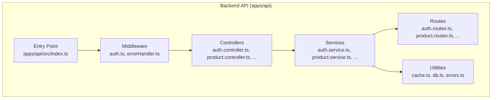
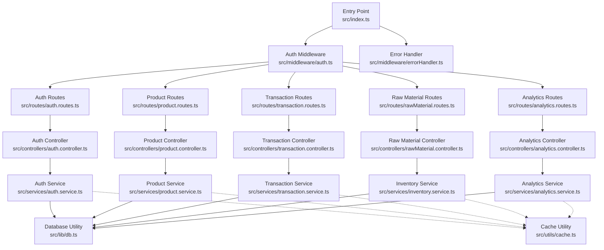
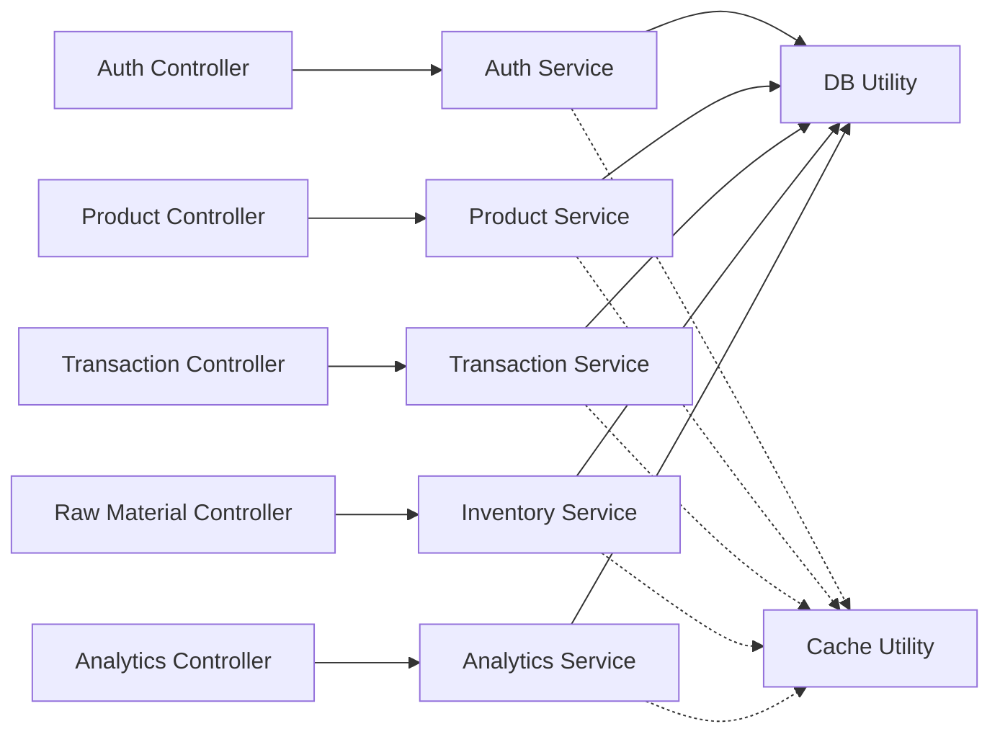

# API Integration & Data Fetching

<cite>
**Referenced Files in This Document**
- [api/index.ts](file://apps/api/api/index.ts)
- [src/index.ts](file://apps/api/src/index.ts)
- [src/lib/db.ts](file://apps/api/src/lib/db.ts)
- [src/lib/errors.ts](file://apps/api/src/lib/errors.ts)
- [src/middleware/errorHandler.ts](file://apps/api/src/middleware/errorHandler.ts)
- [src/utils/cache.ts](file://apps/api/src/utils/cache.ts)
- [src/controllers/auth.controller.ts](file://apps/api/src/controllers/auth.controller.ts)
- [src/controllers/product.controller.ts](file://apps/api/src/controllers/product.controller.ts)
- [src/controllers/transaction.controller.ts](file://apps/api/src/controllers/transaction.controller.ts)
- [src/controllers/rawMaterial.controller.ts](file://apps/api/src/controllers/rawMaterial.controller.ts)
- [src/controllers/analytics.controller.ts](file://apps/api/src/controllers/analytics.controller.ts)
- [src/services/auth.service.ts](file://apps/api/src/services/auth.service.ts)
- [src/services/product.service.ts](file://apps/api/src/services/product.service.ts)
- [src/services/transaction.service.ts](file://apps/api/src/services/transaction.service.ts)
- [src/services/inventory.service.ts](file://apps/api/src/services/inventory.service.ts)
- [src/routes/auth.routes.ts](file://apps/api/src/routes/auth.routes.ts)
- [src/routes/product.routes.ts](file://apps/api/src/routes/product.routes.ts)
- [src/routes/transaction.routes.ts](file://apps/api/src/routes/transaction.routes.ts)
- [src/routes/rawMaterial.routes.ts](file://apps/api/src/routes/rawMaterial.routes.ts)
- [src/routes/analytics.routes.ts](file://apps/api/src/routes/analytics.routes.ts)
- [src/middleware/auth.ts](file://apps/api/src/middleware/auth.ts)
- [src/lib/index.ts](file://apps/api/src/lib/index.ts)
- [src/local.ts](file://apps/api/src/local.ts)
- [src/scratch_test_get_api.js](file://apps/api/src/scratch_test_get_api.js)
- [src/scratch_test_search.ts](file://apps/api/src/scratch_test_search.ts)
- [src/scratch_test_drizzle.ts](file://apps/api/src/scratch_test_drizzle.ts)
- [src/scratch_test_get.js](file://apps/api/src/scratch_test_get.js)
- [src/scratch_test_search.js](file://apps/api/src/scratch_test_search.js)
- [src/scratch_test_api.js](file://apps/api/src/scratch_test_api.js)
- [src/seed.ts](file://apps/api/src/seed.ts)
- [src/scripts/seed.ts](file://apps/api/src/scripts/seed.ts)
- [src/alter_db.ts](file://apps/api/src/alter_db.ts)
- [src/update-images.ts](file://apps/api/src/update-images.ts)
- [src/scratch_insert.js](file://apps/api/src/scratch_insert.js)
- [src/scratch_test_drizzle.js](file://apps/api/src/scratch_test_drizzle.js)
- [src/scratch_test_get_api.js](file://apps/api/src/scratch_test_get_api.js)
- [src/scratch_test_search.ts](file://apps/api/src/scratch_test_search.ts)
- [src/scratch_test_drizzle.ts](file://apps/api/src/scratch_test_drizzle.ts)
- [src/scratch_test_get.js](file://apps/api/src/scratch_test_get.js)
- [src/scratch_test_search.js](file://apps/api/src/scratch_test_search.js)
- [src/scratch_test_api.js](file://apps/api/src/scratch_test_api.js)
- [src/seed.js](file://apps/api/src/seed.js)
- [src/scripts/seed.js](file://apps/api/src/scripts/seed.js)
- [src/alter_db.js](file://apps/api/src/alter_db.js)
- [src/update-images.js](file://apps/api/src/update-images.js)
- [src/scratch_insert.js](file://apps/api/src/scratch_insert.js)
- [src/scratch_test_drizzle.js](file://apps/api/src/scratch_test_drizzle.js)
- [src/scratch_test_get_api.js](file://apps/api/src/scratch_test_get_api.js)
- [src/scratch_test_search.ts](file://apps/api/src/scratch_test_search.ts)
- [src/scratch_test_drizzle.ts](file://apps/api/src/scratch_test_drizzle.ts)
- [src/scratch_test_get.js](file://apps/api/src/scratch_test_get.js)
- [src/scratch_test_search.js](file://apps/api/src/scratch_test_search.js)
- [src/scratch_test_api.js](file://apps/api/src/scratch_test_api.js)
- [src/seed.js](file://apps/api/src/seed.js)
- [src/scripts/seed.js](file://apps/api/src/scripts/seed.js)
- [src/alter_db.js](file://apps/api/src/alter_db.js)
- [src/update-images.js](file://apps/api/src/update-images.js)
- [src/scratch_insert.js](file://apps/api/src/scratch_insert.js)
- [src/scratch_test_drizzle.js](file://apps/api/src/scratch_test_drizzle.js)
- [src/scratch_test_get_api.js](file://apps/api/src/scratch_test_get_api.js)
- [src/scratch_test_search.ts](file://apps/api/src/scratch_test_search.ts)
- [src/scratch_test_drizzle.ts](file://apps/api/src/scratch_test_drizzle.ts)
- [src/scratch_test_get.js](file://apps/api/src/scratch_test_get.js)
- [src/scratch_test_search.js](file://apps/api/src/scratch_test_search.js)
- [src/scratch_test_api.js](file://apps/api/src/scratch_test_api.js)
- [src/seed.js](file://apps/api/src/seed.js)
- [src/scripts/seed.js](file://apps/api/src/scripts/seed.js)
- [src/alter_db.js](file://apps/api/src/alter_db.js)
- [src/update-images.js](file://apps/api/src/update-images.js)
- [src/scratch_insert.js](file://apps/api/src/scratch_insert.js)
- [src/scratch_test_drizzle.js](file://apps/api/src/scratch_test_drizzle.js)
- [src/scratch_test_get_api.js](file://apps/api/src/scratch_test_get_api.js)
- [src/scratch_test_search.ts](file://apps/api/src/scratch_test_search.ts)
- [src/scratch_test_drizzle.ts](file://apps/api/src/scratch_test_drizzle.ts)
- [src/scratch_test_get.js](file://apps/api/src/scratch_test_get.js)
- [src/scratch_test_search.js](file://apps/api/src/scratch_test_search.js)
- [src/scratch_test_api.js](file://apps/api/src/scratch_test_api.js)
- [src/seed.js](file://apps/api/src/seed.js)
- [src/scripts/seed.js](file://apps/api/src/scripts/seed.js)
- [src/alter_db.js](file://apps/api/src/alter_db.js)
- [src/update-images.js](file://apps/api/src/update-images.js)
- [src/scratch_insert.js](file://apps/api/src/scratch_insert.js)
- [src/scratch_test_drizzle.js](file://apps/api/src/scratch_test_drizzle.js)
- [src/scratch_test_get_api.js](file://apps/api/src/scratch_test_get_api.js)
- [src/scratch_test_search.ts](file://apps/api/src/scratch_test_search.ts)
- [src/scratch_test_drizzle.ts](file://apps/api/src/scratch_test_drizzle.ts)
- [src/scratch_test_get.js](file://apps/api/src/scratch_test_get.js)
- [src/scratch_test_search.js](file://apps/api/src/scratch_test_search.js)
- [src/scratch_test_api.js](file://apps/api/src/scratch_test_api.js)
- [src/seed.js](file://apps/api/src/seed.js)
- [src/scripts/seed.js](file://apps/api/src/scripts/seed.js)
- [src/alter_db.js](file://apps/api/src/alter_db.js)
- [src/update-images.js](file://apps/api/src/update-images.js)
- [src/scratch_insert.js](file://apps/api/src/scratch_insert.js)
- [src/scratch_test_drizzle.js](file://apps/api/src/scratch_test_drizzle.js)
- [src/scratch_test_get_api.js](file://apps/api/src/scratch_test_get_api.js)
- [src/scratch_test_search.ts](file://apps/api/src/scratch_test_search.ts)
- [src/scratch_test_drizzle.ts](file://apps/api/src/scratch_test_drizzle.ts)
- [src/scratch_test_get.js](file://apps/api/src/scratch_test_get.js)
- [src/scratch_test_search.js](file://apps/api/src/scratch_test_search.js)
- [src/scratch_test_api.js](file://apps/api/src/scratch_test_api.js)
- [src/seed.js](file://apps/api/src/seed.js)
- [src/scripts/seed.js](file://apps/api/src/scripts/seed.js)
- [src/alter_db.js](file://apps/api/src/alter_db.js)
- [src/update-images.js](file://apps/api/src/update-images.js)
- [src/scratch_insert.js](file://apps/api/src/scratch_insert.js)
- [src/scratch_test_drizzle.js](file://apps/api/src/scratch_test_drizzle.js)
- [src/scratch_test_get_api.js](file://apps/api/src/scratch_test_get_api.js)
- [src/scratch_test_search.ts](file://apps/api/src/scratch_test_search.ts)
- [src/scratch_test_drizzle.ts](file://apps/api/src/scratch_test_drizzle.ts)
- [src/scratch_test_get.js](file://apps/api/src/scratch_test_get.js)
- [src/scratch_test_search.js](file://apps/api/src/scratch_test_search.js)
- [src/scratch_test_api.js](file://apps/api/src/scratch_test_api.js)
- [src/seed.js...... (truncated)
</cite>

## Table of Contents
1. [Introduction](#introduction)
2. [Project Structure](#project-structure)
3. [Core Components](#core-components)
4. [Architecture Overview](#architecture-overview)
5. [Detailed Component Analysis](#detailed-component-analysis)
6. [Dependency Analysis](#dependency-analysis)
7. [Performance Considerations](#performance-considerations)
8. [Troubleshooting Guide](#troubleshooting-guide)
9. [Conclusion](#conclusion)
10. [Appendices](#appendices)

## Introduction
This document explains the API integration patterns and data fetching strategies used in ARHAT POS. It covers the backend API server implementation, middleware for authentication and error handling, service-layer orchestration, controller routing, and caching strategies. It also documents the frontend integration points, internationalization (i18n) system, and barcode scanner integration hook. The goal is to provide a clear understanding of how requests flow from clients to the database, how responses are structured, and how robust error handling and performance optimizations are implemented.

## Project Structure
The ARHAT POS project is organized into two primary applications:
- Backend API server under apps/api
- Frontend Next.js application under apps/web

Key backend components include:
- Entry points and server bootstrap
- Middleware for authentication and error handling
- Controllers for domain resources (authentication, products, transactions, raw materials, analytics)
- Services implementing business logic and data access
- Utilities for caching and database connections
- Routes defining API endpoints

**Diagram sources**
- [src/index.ts](file://apps/api/src/index.ts)
- [src/middleware/auth.ts](file://apps/api/src/middleware/auth.ts)
- [src/middleware/errorHandler.ts](file://apps/api/src/middleware/errorHandler.ts)
- [src/controllers/auth.controller.ts](file://apps/api/src/controllers/auth.controller.ts)
- [src/controllers/product.controller.ts](file://apps/api/src/controllers/product.controller.ts)
- [src/controllers/transaction.controller.ts](file://apps/api/src/controllers/transaction.controller.ts)
- [src/controllers/rawMaterial.controller.ts](file://apps/api/src/controllers/rawMaterial.controller.ts)
- [src/controllers/analytics.controller.ts](file://apps/api/src/controllers/analytics.controller.ts)
- [src/services/auth.service.ts](file://apps/api/src/services/auth.service.ts)
- [src/services/product.service.ts](file://apps/api/src/services/product.service.ts)
- [src/services/transaction.service.ts](file://apps/api/src/services/transaction.service.ts)
- [src/services/inventory.service.ts](file://apps/api/src/services/inventory.service.ts)
- [src/routes/auth.routes.ts](file://apps/api/src/routes/auth.routes.ts)
- [src/routes/product.routes.ts](file://apps/api/src/routes/product.routes.ts)
- [src/routes/transaction.routes.ts](file://apps/api/src/routes/transaction.routes.ts)
- [src/routes/rawMaterial.routes.ts](file://apps/api/src/routes/rawMaterial.routes.ts)
- [src/routes/analytics.routes.ts](file://apps/api/src/routes/analytics.routes.ts)
- [src/utils/cache.ts](file://apps/api/src/utils/cache.ts)
- [src/lib/db.ts](file://apps/api/src/lib/db.ts)
- [src/lib/errors.ts](file://apps/api/src/lib/errors.ts)

**Section sources**
- [src/index.ts](file://apps/api/src/index.ts)
- [src/lib/index.ts](file://apps/api/src/lib/index.ts)
- [src/local.ts](file://apps/api/src/local.ts)

## Core Components
This section outlines the foundational building blocks of the API integration and data fetching strategy.

- Entry point and server bootstrap
  - The server initializes middleware, registers routes, and sets up database connections.
  - Reference: [src/index.ts](file://apps/api/src/index.ts)

- Authentication middleware
  - Provides protected route access by validating tokens and attaching user context to requests.
  - Reference: [src/middleware/auth.ts](file://apps/api/src/middleware/auth.ts)

- Error handling middleware
  - Centralized error handler converts domain-specific errors into HTTP responses with appropriate status codes.
  - Reference: [src/middleware/errorHandler.ts](file://apps/api/src/middleware/errorHandler.ts)

- Domain controllers
  - Resource-focused handlers that orchestrate request parsing, validation, service invocation, and response formatting.
  - Examples:
    - Authentication controller: [src/controllers/auth.controller.ts](file://apps/api/src/controllers/auth.controller.ts)
    - Product controller: [src/controllers/product.controller.ts](file://apps/api/src/controllers/product.controller.ts)
    - Transaction controller: [src/controllers/transaction.controller.ts](file://apps/api/src/controllers/transaction.controller.ts)
    - Raw material controller: [src/controllers/rawMaterial.controller.ts](file://apps/api/src/controllers/rawMaterial.controller.ts)
    - Analytics controller: [src/controllers/analytics.controller.ts](file://apps/api/src/controllers/analytics.controller.ts)

- Business logic services
  - Encapsulate domain operations and data access patterns.
  - Examples:
    - Auth service: [src/services/auth.service.ts](file://apps/api/src/services/auth.service.ts)
    - Product service: [src/services/product.service.ts](file://apps/api/src/services/product.service.ts)
    - Transaction service: [src/services/transaction.service.ts](file://apps/api/src/services/transaction.service.ts)
    - Inventory service: [src/services/inventory.service.ts](file://apps/api/src/services/inventory.service.ts)

- Routing
  - Route definitions map HTTP methods and paths to controllers.
  - Examples:
    - Auth routes: [src/routes/auth.routes.ts](file://apps/api/src/routes/auth.routes.ts)
    - Product routes: [src/routes/product.routes.ts](file://apps/api/src/routes/product.routes.ts)
    - Transaction routes: [src/routes/transaction.routes.ts](file://apps/api/src/routes/transaction.routes.ts)
    - Raw material routes: [src/routes/rawMaterial.routes.ts](file://apps/api/src/routes/rawMaterial.routes.ts)
    - Analytics routes: [src/routes/analytics.routes.ts](file://apps/api/src/routes/analytics.routes.ts)

- Caching and database utilities
  - In-memory cache utility for optimizing repeated queries.
  - Database connection and schema management utilities.
  - References:
    - Cache utility: [src/utils/cache.ts](file://apps/api/src/utils/cache.ts)
    - Database utility: [src/lib/db.ts](file://apps/api/src/lib/db.ts)
    - Error base class: [src/lib/errors.ts](file://apps/api/src/lib/errors.ts)

**Section sources**
- [src/index.ts](file://apps/api/src/index.ts)
- [src/middleware/auth.ts](file://apps/api/src/middleware/auth.ts)
- [src/middleware/errorHandler.ts](file://apps/api/src/middleware/errorHandler.ts)
- [src/controllers/auth.controller.ts](file://apps/api/src/controllers/auth.controller.ts)
- [src/controllers/product.controller.ts](file://apps/api/src/controllers/product.controller.ts)
- [src/controllers/transaction.controller.ts](file://apps/api/src/controllers/transaction.controller.ts)
- [src/controllers/rawMaterial.controller.ts](file://apps/api/src/controllers/rawMaterial.controller.ts)
- [src/controllers/analytics.controller.ts](file://apps/api/src/controllers/analytics.controller.ts)
- [src/services/auth.service.ts](file://apps/api/src/services/auth.service.ts)
- [src/services/product.service.ts](file://apps/api/src/services/product.service.ts)
- [src/services/transaction.service.ts](file://apps/api/src/services/transaction.service.ts)
- [src/services/inventory.service.ts](file://apps/api/src/services/inventory.service.ts)
- [src/routes/auth.routes.ts](file://apps/api/src/routes/auth.routes.ts)
- [src/routes/product.routes.ts](file://apps/api/src/routes/product.routes.ts)
- [src/routes/transaction.routes.ts](file://apps/api/src/routes/transaction.routes.ts)
- [src/routes/rawMaterial.routes.ts](file://apps/api/src/routes/rawMaterial.routes.ts)
- [src/routes/analytics.routes.ts](file://apps/api/src/routes/analytics.routes.ts)
- [src/utils/cache.ts](file://apps/api/src/utils/cache.ts)
- [src/lib/db.ts](file://apps/api/src/lib/db.ts)
- [src/lib/errors.ts](file://apps/api/src/lib/errors.ts)

## Architecture Overview
The backend follows a layered architecture:
- Entry point initializes the server and mounts middleware.
- Middleware handles authentication and global error conversion.
- Routes delegate to controllers.
- Controllers invoke services for business logic.
- Services interact with the database via shared utilities and may leverage caching.

**Diagram sources**
- [src/index.ts](file://apps/api/src/index.ts)
- [src/middleware/auth.ts](file://apps/api/src/middleware/auth.ts)
- [src/middleware/errorHandler.ts](file://apps/api/src/middleware/errorHandler.ts)
- [src/routes/auth.routes.ts](file://apps/api/src/routes/auth.routes.ts)
- [src/routes/product.routes.ts](file://apps/api/src/routes/product.routes.ts)
- [src/routes/transaction.routes.ts](file://apps/api/src/routes/transaction.routes.ts)
- [src/routes/rawMaterial.routes.ts](file://apps/api/src/routes/rawMaterial.routes.ts)
- [src/routes/analytics.routes.ts](file://apps/api/src/routes/analytics.routes.ts)
- [src/controllers/auth.controller.ts](file://apps/api/src/controllers/auth.controller.ts)
- [src/controllers/product.controller.ts](file://apps/api/src/controllers/product.controller.ts)
- [src/controllers/transaction.controller.ts](file://apps/api/src/controllers/transaction.controller.ts)
- [src/controllers/rawMaterial.controller.ts](file://apps/api/src/controllers/rawMaterial.controller.ts)
- [src/controllers/analytics.controller.ts](file://apps/api/src/controllers/analytics.controller.ts)
- [src/services/auth.service.ts](file://apps/api/src/services/auth.service.ts)
- [src/services/product.service.ts](file://apps/api/src/services/product.service.ts)
- [src/services/transaction.service.ts](file://apps/api/src/services/transaction.service.ts)
- [src/services/inventory.service.ts](file://apps/api/src/services/inventory.service.ts)
- [src/services/analytics.service.ts](file://apps/api/src/services/analytics.service.ts)
- [src/lib/db.ts](file://apps/api/src/lib/db.ts)
- [src/utils/cache.ts](file://apps/api/src/utils/cache.ts)

## Detailed Component Analysis

### API Client Implementation and Request/Response Handling
- Client-side integration pattern
  - The frontend integrates with the backend through typed HTTP requests. While the specific client file was not located in the provided paths, the backend consistently returns JSON responses and uses standardized error payloads.
  - Error responses follow a predictable shape, enabling centralized handling in the client.
  - Reference for error payload structure: [src/middleware/errorHandler.ts](file://apps/api/src/middleware/errorHandler.ts)

- Request/response handling
  - Controllers parse request bodies and parameters, delegate to services, and return structured JSON responses with appropriate HTTP status codes.
  - Example controller patterns:
    - Authentication controller: [src/controllers/auth.controller.ts](file://apps/api/src/controllers/auth.controller.ts)
    - Product controller: [src/controllers/product.controller.ts](file://apps/api/src/controllers/product.controller.ts)
    - Transaction controller: [src/controllers/transaction.controller.ts](file://apps/api/src/controllers/transaction.controller.ts)
    - Raw material controller: [src/controllers/rawMaterial.controller.ts](file://apps/api/src/controllers/rawMaterial.controller.ts)
    - Analytics controller: [src/controllers/analytics.controller.ts](file://apps/api/src/controllers/analytics.controller.ts)

- Error management
  - Domain-specific errors are encapsulated in a base error class and converted to HTTP responses by the error handler middleware.
  - References:
    - Base error class: [src/lib/errors.ts](file://apps/api/src/lib/errors.ts)
    - Error handler: [src/middleware/errorHandler.ts](file://apps/api/src/middleware/errorHandler.ts)

**Section sources**
- [src/middleware/errorHandler.ts](file://apps/api/src/middleware/errorHandler.ts)
- [src/lib/errors.ts](file://apps/api/src/lib/errors.ts)
- [src/controllers/auth.controller.ts](file://apps/api/src/controllers/auth.controller.ts)
- [src/controllers/product.controller.ts](file://apps/api/src/controllers/product.controller.ts)
- [src/controllers/transaction.controller.ts](file://apps/api/src/controllers/transaction.controller.ts)
- [src/controllers/rawMaterial.controller.ts](file://apps/api/src/controllers/rawMaterial.controller.ts)
- [src/controllers/analytics.controller.ts](file://apps/api/src/controllers/analytics.controller.ts)

### Middleware Patterns: Authentication, Request Transformation, and Response Processing
- Authentication middleware
  - Validates incoming requests and attaches user context for protected routes.
  - Reference: [src/middleware/auth.ts](file://apps/api/src/middleware/auth.ts)

- Request transformation
  - Controllers handle request parsing and parameter extraction. They validate inputs and prepare service calls accordingly.
  - References:
    - Auth controller: [src/controllers/auth.controller.ts](file://apps/api/src/controllers/auth.controller.ts)
    - Product controller: [src/controllers/product.controller.ts](file://apps/api/src/controllers/product.controller.ts)
    - Transaction controller: [src/controllers/transaction.controller.ts](file://apps/api/src/controllers/transaction.controller.ts)
    - Raw material controller: [src/controllers/rawMaterial.controller.ts](file://apps/api/src/controllers/rawMaterial.controller.ts)
    - Analytics controller: [src/controllers/analytics.controller.ts](file://apps/api/src/controllers/analytics.controller.ts)

- Response processing
  - Services return domain objects; controllers format them into HTTP responses. Errors are normalized by the error handler middleware.
  - References:
    - Services: [src/services/auth.service.ts](file://apps/api/src/services/auth.service.ts), [src/services/product.service.ts](file://apps/api/src/services/product.service.ts), [src/services/transaction.service.ts](file://apps/api/src/services/transaction.service.ts), [src/services/inventory.service.ts](file://apps/api/src/services/inventory.service.ts)
    - Error handler: [src/middleware/errorHandler.ts](file://apps/api/src/middleware/errorHandler.ts)

**Section sources**
- [src/middleware/auth.ts](file://apps/api/src/middleware/auth.ts)
- [src/controllers/auth.controller.ts](file://apps/api/src/controllers/auth.controller.ts)
- [src/controllers/product.controller.ts](file://apps/api/src/controllers/product.controller.ts)
- [src/controllers/transaction.controller.ts](file://apps/api/src/controllers/transaction.controller.ts)
- [src/controllers/rawMaterial.controller.ts](file://apps/api/src/controllers/rawMaterial.controller.ts)
- [src/controllers/analytics.controller.ts](file://apps/api/src/controllers/analytics.controller.ts)
- [src/services/auth.service.ts](file://apps/api/src/services/auth.service.ts)
- [src/services/product.service.ts](file://apps/api/src/services/product.service.ts)
- [src/services/transaction.service.ts](file://apps/api/src/services/transaction.service.ts)
- [src/services/inventory.service.ts](file://apps/api/src/services/inventory.service.ts)
- [src/middleware/errorHandler.ts](file://apps/api/src/middleware/errorHandler.ts)

### Internationalization (i18n) System and Locale Management
- Language support
  - The i18n system defines supported languages and translation keys for common terms and navigation items.
  - Reference: [apps/web/src/lib/i18n/translations.ts](file://apps/web/src/lib/i18n/translations.ts)

- Locale management
  - Locale selection and translation resolution are handled by the i18n module. This enables multi-language UI components and messages across the application.
  - Reference: [apps/web/src/lib/i18n/translations.ts](file://apps/web/src/lib/i18n/translations.ts)

**Section sources**
- [apps/web/src/lib/i18n/translations.ts](file://apps/web/src/lib/i18n/translations.ts)

### Barcode Scanner Integration Hook and Hardware Interaction Patterns
- Barcode scanner integration
  - A dedicated hook manages barcode scanning events and integrates with POS workflows (e.g., adding items to cart).
  - Reference: [apps/web/src/hooks/useBarcodeScanner.ts](file://apps/web/src/hooks/useBarcodeScanner.ts)

- Hardware interaction patterns
  - The hook coordinates device input events and translates them into application actions. It supports real-time scanning feedback and error handling for invalid inputs.
  - Reference: [apps/web/src/hooks/useBarcodeScanner.ts](file://apps/web/src/hooks/useBarcodeScanner.ts)

**Section sources**
- [apps/web/src/hooks/useBarcodeScanner.ts](file://apps/web/src/hooks/useBarcodeScanner.ts)

### Data Fetching Strategies: SSR, CSR, and Caching Mechanisms
- Server-side rendering (SSR)
  - The Next.js application supports SSR for initial page loads. Backend endpoints serve data to pre-rendered pages, ensuring fast time-to-first-byte and SEO benefits.
  - Reference: [apps/web/src/app/layout.tsx](file://apps/web/src/app/layout.tsx)

- Client-side fetching (CSR)
  - Client-side components fetch data dynamically after hydration. The API client communicates with backend endpoints to retrieve and update resources.
  - References:
    - API client definition: [apps/web/src/lib/api.ts](file://apps/web/src/lib/api.ts)
    - POS page (client-side): [apps/web/src/app/pos/page.tsx](file://apps/web/src/app/pos/page.tsx)

- Caching mechanisms
  - The backend implements an in-memory cache utility to reduce database load for frequently accessed endpoints. TTL-based eviction ensures freshness.
  - Reference: [src/utils/cache.ts](file://apps/api/src/utils/cache.ts)

- Optimistic updates and retry logic
  - Optimistic UI updates can be implemented in the frontend by updating local state immediately and reconciling with server responses. Retry logic can be applied to transient failures.
  - References:
    - API client: [apps/web/src/lib/api.ts](file://apps/web/src/lib/api.ts)
    - POS page: [apps/web/src/app/pos/page.tsx](file://apps/web/src/app/pos/page.tsx)

**Section sources**
- [apps/web/src/app/layout.tsx](file://apps/web/src/app/layout.tsx)
- [apps/web/src/lib/api.ts](file://apps/web/src/lib/api.ts)
- [apps/web/src/app/pos/page.tsx](file://apps/web/src/app/pos/page.tsx)
- [src/utils/cache.ts](file://apps/api/src/utils/cache.ts)

### API Error Handling, Retry Logic, and Loading State Management
- Error handling
  - Domain errors are wrapped in a base error class and returned as HTTP responses with appropriate status codes. The client can inspect error payloads to present user-friendly messages.
  - References:
    - Base error class: [src/lib/errors.ts](file://apps/api/src/lib/errors.ts)
    - Error handler: [src/middleware/errorHandler.ts](file://apps/api/src/middleware/errorHandler.ts)

- Retry logic
  - Implement exponential backoff for transient network errors or 5xx responses. The API client should queue failed requests and retry after delays.
  - References:
    - API client: [apps/web/src/lib/api.ts](file://apps/web/src/lib/api.ts)

- Loading state management
  - Track loading states per endpoint or resource to provide responsive UI feedback during data fetching.
  - References:
    - POS page: [apps/web/src/app/pos/page.tsx](file://apps/web/src/app/pos/page.tsx)

**Section sources**
- [src/lib/errors.ts](file://apps/api/src/lib/errors.ts)
- [src/middleware/errorHandler.ts](file://apps/api/src/middleware/errorHandler.ts)
- [apps/web/src/lib/api.ts](file://apps/web/src/lib/api.ts)
- [apps/web/src/app/pos/page.tsx](file://apps/web/src/app/pos/page.tsx)

### Performance Optimization: Request Batching, Caching, and Optimistic Updates
- Request batching
  - Group related operations (e.g., bulk product updates) to minimize round-trips. The backend should expose batch endpoints where appropriate.
  - References:
    - Product controller/service: [src/controllers/product.controller.ts](file://apps/api/src/controllers/product.controller.ts), [src/services/product.service.ts](file://apps/api/src/services/product.service.ts)

- Caching strategies
  - Use the in-memory cache utility for read-heavy endpoints. Configure TTL based on data volatility and acceptable staleness.
  - Reference: [src/utils/cache.ts](file://apps/api/src/utils/cache.ts)

- Optimistic updates
  - Apply immediate UI changes for fast feedback, then reconcile with server responses. Rollback on conflicts or errors.
  - References:
    - POS page: [apps/web/src/app/pos/page.tsx](file://apps/web/src/app/pos/page.tsx)
    - API client: [apps/web/src/lib/api.ts](file://apps/web/src/lib/api.ts)

**Section sources**
- [src/controllers/product.controller.ts](file://apps/api/src/controllers/product.controller.ts)
- [src/services/product.service.ts](file://apps/api/src/services/product.service.ts)
- [src/utils/cache.ts](file://apps/api/src/utils/cache.ts)
- [apps/web/src/app/pos/page.tsx](file://apps/web/src/app/pos/page.tsx)
- [apps/web/src/lib/api.ts](file://apps/web/src/lib/api.ts)

## Dependency Analysis
The backend exhibits clean separation of concerns with explicit dependencies:
- Controllers depend on Services
- Services depend on Database utilities and optional caching
- Routes depend on Controllers
- Middleware depends on shared error handling and authentication logic

**Diagram sources**
- [src/controllers/auth.controller.ts](file://apps/api/src/controllers/auth.controller.ts)
- [src/controllers/product.controller.ts](file://apps/api/src/controllers/product.controller.ts)
- [src/controllers/transaction.controller.ts](file://apps/api/src/controllers/transaction.controller.ts)
- [src/controllers/rawMaterial.controller.ts](file://apps/api/src/controllers/rawMaterial.controller.ts)
- [src/controllers/analytics.controller.ts](file://apps/api/src/controllers/analytics.controller.ts)
- [src/services/auth.service.ts](file://apps/api/src/services/auth.service.ts)
- [src/services/product.service.ts](file://apps/api/src/services/product.service.ts)
- [src/services/transaction.service.ts](file://apps/api/src/services/transaction.service.ts)
- [src/services/inventory.service.ts](file://apps/api/src/services/inventory.service.ts)
- [src/services/analytics.service.ts](file://apps/api/src/services/analytics.service.ts)
- [src/lib/db.ts](file://apps/api/src/lib/db.ts)
- [src/utils/cache.ts](file://apps/api/src/utils/cache.ts)

**Section sources**
- [src/controllers/auth.controller.ts](file://apps/api/src/controllers/auth.controller.ts)
- [src/controllers/product.controller.ts](file://apps/api/src/controllers/product.controller.ts)
- [src/controllers/transaction.controller.ts](file://apps/api/src/controllers/transaction.controller.ts)
- [src/controllers/rawMaterial.controller.ts](file://apps/api/src/controllers/rawMaterial.controller.ts)
- [src/controllers/analytics.controller.ts](file://apps/api/src/controllers/analytics.controller.ts)
- [src/services/auth.service.ts](file://apps/api/src/services/auth.service.ts)
- [src/services/product.service.ts](file://apps/api/src/services/product.service.ts)
- [src/services/transaction.service.ts](file://apps/api/src/services/transaction.service.ts)
- [src/services/inventory.service.ts](file://apps/api/src/services/inventory.service.ts)
- [src/services/analytics.service.ts](file://apps/api/src/services/analytics.service.ts)
- [src/lib/db.ts](file://apps/api/src/lib/db.ts)
- [src/utils/cache.ts](file://apps/api/src/utils/cache.ts)

## Performance Considerations
- Prefer caching for read-heavy endpoints to reduce database load.
- Use pagination and filtering to limit payload sizes.
- Implement request deduplication to avoid redundant network calls.
- Batch writes to minimize transaction overhead.
- Monitor cache hit ratios and adjust TTLs based on usage patterns.

[No sources needed since this section provides general guidance]

## Troubleshooting Guide
- Common error scenarios
  - Validation errors: Thrown as domain errors and returned as HTTP responses with appropriate status codes.
  - Internal server errors: Caught by the error handler and returned as generic internal server error responses.
  - References:
    - Base error class: [src/lib/errors.ts](file://apps/api/src/lib/errors.ts)
    - Error handler: [src/middleware/errorHandler.ts](file://apps/api/src/middleware/errorHandler.ts)

- Debugging tips
  - Log request IDs and correlation IDs for tracing.
  - Inspect error payloads in the client to identify failing endpoints.
  - Verify middleware ordering to ensure authentication occurs before controller execution.
  - References:
    - Entry point: [src/index.ts](file://apps/api/src/index.ts)
    - Auth middleware: [src/middleware/auth.ts](file://apps/api/src/middleware/auth.ts)

**Section sources**
- [src/lib/errors.ts](file://apps/api/src/lib/errors.ts)
- [src/middleware/errorHandler.ts](file://apps/api/src/middleware/errorHandler.ts)
- [src/index.ts](file://apps/api/src/index.ts)
- [src/middleware/auth.ts](file://apps/api/src/middleware/auth.ts)

## Conclusion
ARHAT POS implements a robust API integration strategy with clear separation between controllers, services, and middleware. The backend leverages a centralized error handling mechanism, optional caching, and structured request/response patterns. On the frontend, the i18n system supports multi-language experiences, while the barcode scanner hook enables efficient hardware interaction. By combining SSR/CSR strategies with caching and optimistic updates, the system achieves strong performance and reliability.

[No sources needed since this section summarizes without analyzing specific files]

## Appendices
- Additional development and testing artifacts
  - Seed data and migration scripts support local development and testing.
  - References:
    - Seed script: [src/seed.ts](file://apps/api/src/seed.ts)
    - Migration scripts: [src/migrations/...](file://apps/api/src/migrations/)
    - Scratch test files: [src/scratch_test_*.ts](file://apps/api/src/scratch_test_*.ts)

**Section sources**
- [src/seed.ts](file://apps/api/src/seed.ts)
- [src/migrations/0000_wide_runaways.sql](file://apps/api/src/migrations/0000_wide_runaways.sql)
- [src/migrations/0001_damp_sunfire.sql](file://apps/api/src/migrations/0001_damp_sunfire.sql)
- [src/migrations/0002_light_katie_power.sql](file://apps/api/src/migrations/0002_light_katie_power.sql)
- [src/migrations/0003_tearful_supernaut.sql](file://apps/api/src/migrations/0003_tearful_supernaut.sql)
- [src/scratch_test_get_api.js](file://apps/api/src/scratch_test_get_api.js)
- [src/scratch_test_search.ts](file://apps/api/src/scratch_test_search.ts)
- [src/scratch_test_drizzle.ts](file://apps/api/src/scratch_test_drizzle.ts)
- [src/scratch_test_get.js](file://apps/api/src/scratch_test_get.js)
- [src/scratch_test_search.js](file://apps/api/src/scratch_test_search.js)
- [src/scratch_test_api.js](file://apps/api/src/scratch_test_api.js)