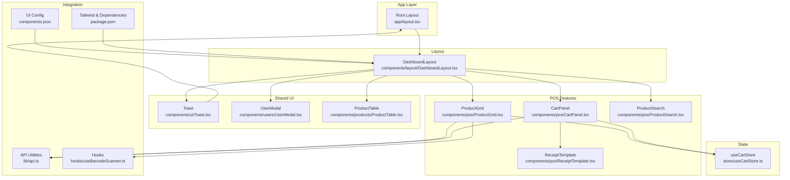
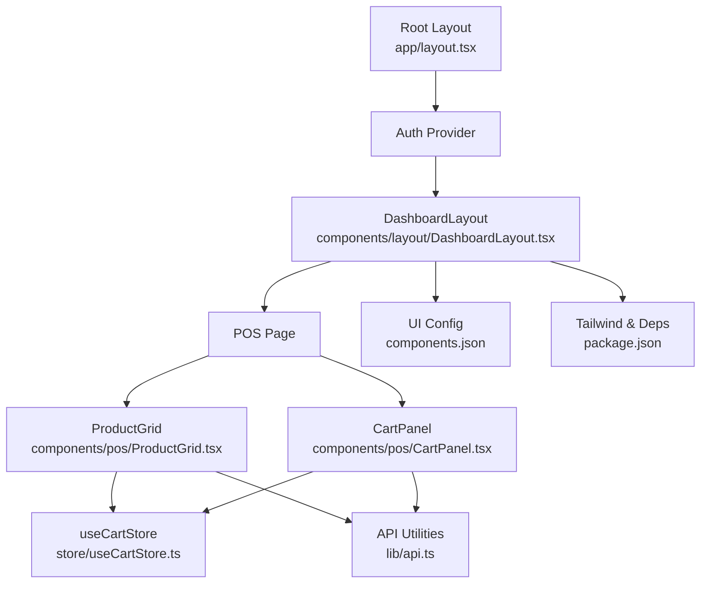
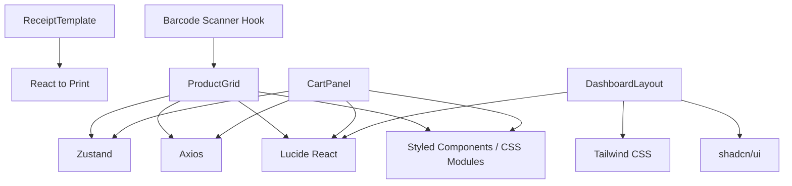
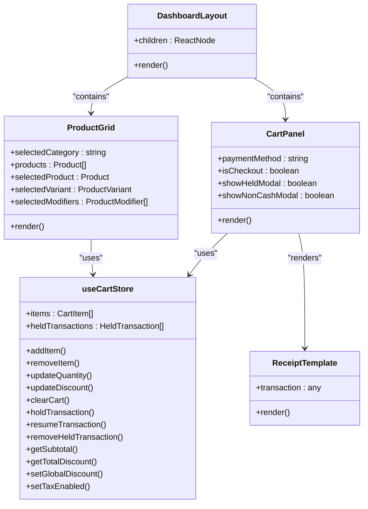

# Component Architecture & UI Library

<cite>
**Referenced Files in This Document**
- [DashboardLayout.tsx](file://apps/web/src/components/layout/DashboardLayout.tsx)
- [layout.tsx](file://apps/web/src/app/layout.tsx)
- [ProductGrid.tsx](file://apps/web/src/components/pos/ProductGrid.tsx)
- [CartPanel.tsx](file://apps/web/src/components/pos/CartPanel.tsx)
- [useCartStore.ts](file://apps/web/src/store/useCartStore.ts)
- [ReceiptTemplate.tsx](file://apps/web/src/components/pos/ReceiptTemplate.tsx)
- [Toast.tsx](file://apps/web/src/components/ui/Toast.tsx)
- [ProductTable.tsx](file://apps/web/src/components/products/ProductTable.tsx)
- [ProductSearch.tsx](file://apps/web/src/components/pos/ProductSearch.tsx)
- [UserModal.tsx](file://apps/web/src/components/users/UserModal.tsx)
- [components.json](file://apps/web/components.json)
- [package.json](file://apps/web/package.json)
- [api.ts](file://apps/web/src/lib/api.ts)
- [useBarcodeScanner.ts](file://apps/web/src/hooks/useBarcodeScanner.ts)
</cite>

## Table of Contents
1. [Introduction](#introduction)
2. [Project Structure](#project-structure)
3. [Core Components](#core-components)
4. [Architecture Overview](#architecture-overview)
5. [Detailed Component Analysis](#detailed-component-analysis)
6. [Dependency Analysis](#dependency-analysis)
7. [Performance Considerations](#performance-considerations)
8. [Troubleshooting Guide](#troubleshooting-guide)
9. [Conclusion](#conclusion)
10. [Appendices](#appendices)

## Introduction
This document describes the frontend component architecture for ARHAT POS, focusing on layout composition, POS-specific components, shared UI elements, and the integration of Tailwind CSS with shadcn/ui. It explains component hierarchy, prop interfaces, reusability strategies, state management, modal systems, forms, and specialized POS components such as ProductGrid and CartPanel. It also covers UI library integration, accessibility, performance optimization, testing strategies, and guidelines for building new components.

## Project Structure
The frontend is organized as a Next.js application under apps/web. Key areas:
- app: App router pages and root layout
- components: Feature-specific and shared UI components
- store: Zustand-based global state for cart and related POS logic
- lib: API utilities and offline caching
- hooks: Reusable hooks (e.g., barcode scanner)
- contexts: Authentication provider
- types: Type definitions (referenced in store)

**Diagram sources**
- [layout.tsx:41-59](file://apps/web/src/app/layout.tsx#L41-L59)
- [DashboardLayout.tsx:23-182](file://apps/web/src/components/layout/DashboardLayout.tsx#L23-L182)
- [ProductGrid.tsx:23-248](file://apps/web/src/components/pos/ProductGrid.tsx#L23-L248)
- [CartPanel.tsx:12-497](file://apps/web/src/components/pos/CartPanel.tsx#L12-L497)
- [useCartStore.ts:72-184](file://apps/web/src/store/useCartStore.ts#L72-L184)
- [ReceiptTemplate.tsx:4-159](file://apps/web/src/components/pos/ReceiptTemplate.tsx#L4-L159)
- [ProductSearch.tsx:5-17](file://apps/web/src/components/pos/ProductSearch.tsx#L5-L17)
- [ProductTable.tsx:11-118](file://apps/web/src/components/products/ProductTable.tsx#L11-L118)
- [UserModal.tsx:10-180](file://apps/web/src/components/users/UserModal.tsx#L10-L180)
- [Toast.tsx:15-45](file://apps/web/src/components/ui/Toast.tsx#L15-L45)
- [api.ts:42-64](file://apps/web/src/lib/api.ts#L42-L64)
- [useBarcodeScanner.ts:12-53](file://apps/web/src/hooks/useBarcodeScanner.ts#L12-L53)
- [components.json:1-26](file://apps/web/components.json#L1-L26)
- [package.json:11-28](file://apps/web/package.json#L11-L28)

**Section sources**
- [layout.tsx:41-59](file://apps/web/src/app/layout.tsx#L41-L59)
- [DashboardLayout.tsx:23-182](file://apps/web/src/components/layout/DashboardLayout.tsx#L23-L182)

## Core Components
- DashboardLayout: Provides responsive navigation, role-based menu filtering, and mobile drawer. Wraps page content and includes a sync manager.
- ProductGrid: Renders product cards with category filtering, variant/modifier selection, and barcode scanning integration.
- CartPanel: Manages cart items, totals, discounts, taxes, customer association, payment methods, and checkout flow.
- useCartStore: Centralized state for cart items, held transactions, and cart-level settings (global discount, tax).
- ReceiptTemplate: Thermal receipt rendering with React Portal for printing.
- Shared UI: Toast notifications and reusable form/modal components.

**Section sources**
- [DashboardLayout.tsx:23-182](file://apps/web/src/components/layout/DashboardLayout.tsx#L23-L182)
- [ProductGrid.tsx:23-248](file://apps/web/src/components/pos/ProductGrid.tsx#L23-L248)
- [CartPanel.tsx:12-497](file://apps/web/src/components/pos/CartPanel.tsx#L12-L497)
- [useCartStore.ts:72-184](file://apps/web/src/store/useCartStore.ts#L72-L184)
- [ReceiptTemplate.tsx:4-159](file://apps/web/src/components/pos/ReceiptTemplate.tsx#L4-L159)
- [Toast.tsx:15-45](file://apps/web/src/components/ui/Toast.tsx#L15-L45)

## Architecture Overview
The POS UI follows a layered pattern:
- App shell: Root layout initializes providers and fonts.
- Layout shell: DashboardLayout manages sidebar, mobile drawer, and user area.
- Feature shells: POS pages embed ProductGrid and CartPanel.
- State: useCartStore orchestrates cart logic and calculations.
- Integration: API utilities encapsulate HTTP calls and offline fallbacks.
- UI library: Tailwind CSS with shadcn/ui configuration and Lucide icons.

**Diagram sources**
- [layout.tsx:41-59](file://apps/web/src/app/layout.tsx#L41-L59)
- [DashboardLayout.tsx:23-182](file://apps/web/src/components/layout/DashboardLayout.tsx#L23-L182)
- [ProductGrid.tsx:23-248](file://apps/web/src/components/pos/ProductGrid.tsx#L23-L248)
- [CartPanel.tsx:12-497](file://apps/web/src/components/pos/CartPanel.tsx#L12-L497)
- [useCartStore.ts:72-184](file://apps/web/src/store/useCartStore.ts#L72-L184)
- [api.ts:42-64](file://apps/web/src/lib/api.ts#L42-L64)
- [components.json:1-26](file://apps/web/components.json#L1-L26)
- [package.json:11-28](file://apps/web/package.json#L11-L28)

## Detailed Component Analysis

### DashboardLayout
Responsibilities:
- Role-aware menu generation and active-state highlighting
- Desktop and mobile navigation drawers
- User profile and logout action
- Sync manager integration

Composition patterns:
- Conditional rendering based on user role
- Pathname-driven active state
- Mobile overlay and drawer with controlled visibility
- Sticky header for mobile

Accessibility and UX:
- Proper focus order and keyboard navigation
- Clear affordances for active states and hover effects
- Responsive breakpoints for desktop/mobile

**Section sources**
- [DashboardLayout.tsx:8-29](file://apps/web/src/components/layout/DashboardLayout.tsx#L8-L29)
- [DashboardLayout.tsx:42-62](file://apps/web/src/components/layout/DashboardLayout.tsx#L42-L62)
- [DashboardLayout.tsx:96-154](file://apps/web/src/components/layout/DashboardLayout.tsx#L96-L154)
- [DashboardLayout.tsx:157-179](file://apps/web/src/components/layout/DashboardLayout.tsx#L157-L179)

### ProductGrid
Responsibilities:
- Load and render product cards
- Category filtering and sticky pill navigation
- Variant and modifier selection modal
- Barcode scanning integration via hook
- Image fallback and gradient generation

State and props:
- Local state for category, loading, selected product, variants, and modifiers
- Uses cart store to add items
- Accepts API utilities for product fetching

Interaction model:
- Click or scan to select product
- Optional variant/modifier selection
- Add to cart action triggers store update

**Section sources**
- [ProductGrid.tsx:23-56](file://apps/web/src/components/pos/ProductGrid.tsx#L23-L56)
- [ProductGrid.tsx:69-71](file://apps/web/src/components/pos/ProductGrid.tsx#L69-L71)
- [ProductGrid.tsx:102-159](file://apps/web/src/components/pos/ProductGrid.tsx#L102-L159)
- [ProductGrid.tsx:162-244](file://apps/web/src/components/pos/ProductGrid.tsx#L162-L244)
- [useBarcodeScanner.ts:12-53](file://apps/web/src/hooks/useBarcodeScanner.ts#L12-L53)

### CartPanel
Responsibilities:
- Manage cart items, quantities, and per-item discounts
- Compute subtotal, global discount, tax, and total
- Customer selection and points redemption
- Payment method selection (Cash, QRIS, Card)
- Checkout flow with API integration
- Success modal and receipt printing

State and props:
- Uses cart store selectors and actions
- Manages local UI state for payment, customer, and modals
- Receives transaction data for success modal

Integration:
- API utilities for checkout, hold, resume, and customer lookup
- ReceiptTemplate via portal for thermal printing

**Section sources**
- [CartPanel.tsx:12-31](file://apps/web/src/components/pos/CartPanel.tsx#L12-L31)
- [CartPanel.tsx:36-44](file://apps/web/src/components/pos/CartPanel.tsx#L36-L44)
- [CartPanel.tsx:46-103](file://apps/web/src/components/pos/CartPanel.tsx#L46-L103)
- [CartPanel.tsx:105-139](file://apps/web/src/components/pos/CartPanel.tsx#L105-L139)
- [CartPanel.tsx:471-491](file://apps/web/src/components/pos/CartPanel.tsx#L471-L491)
- [api.ts:75-119](file://apps/web/src/lib/api.ts#L75-L119)

### useCartStore
Responsibilities:
- Define product, cart item, and held transaction interfaces
- Provide actions: add/remove/update quantity/discount, clear cart
- Support hold/resume/remove held transactions
- Expose selectors for subtotal and total discount
- Global settings: global discount and tax toggle

Data model:
- CartItem derived from Product with computed fields
- Unique cartItemId based on product, variant, and sorted modifiers

Complexity:
- Add/update/remove operate in O(n) over items
- Subtotal and discount computed via reduce over items

**Section sources**
- [useCartStore.ts:3-36](file://apps/web/src/store/useCartStore.ts#L3-L36)
- [useCartStore.ts:45-70](file://apps/web/src/store/useCartStore.ts#L45-L70)
- [useCartStore.ts:78-114](file://apps/web/src/store/useCartStore.ts#L78-L114)
- [useCartStore.ts:170-179](file://apps/web/src/store/useCartStore.ts#L170-L179)

### ReceiptTemplate and Print Portal
Responsibilities:
- Render a thermal receipt template with inline styles
- Portal wrapper to isolate print-only DOM subtree
- Print-only container with fixed dimensions and print rules

Integration:
- Receives transaction payload from CartPanel
- Triggered via a state flag and cleanup after print

**Section sources**
- [ReceiptTemplate.tsx:4-159](file://apps/web/src/components/pos/ReceiptTemplate.tsx#L4-L159)

### Shared UI Components
- Toast: Notification component with type-based styling and auto-dismiss
- ProductTable: Searchable table with edit/delete/manage BOM actions
- ProductSearch: Sticky search input for POS
- UserModal: Form modal for creating/editing users with validation

**Section sources**
- [Toast.tsx:15-45](file://apps/web/src/components/ui/Toast.tsx#L15-L45)
- [ProductTable.tsx:11-118](file://apps/web/src/components/products/ProductTable.tsx#L11-L118)
- [ProductSearch.tsx:5-17](file://apps/web/src/components/pos/ProductSearch.tsx#L5-L17)
- [UserModal.tsx:10-180](file://apps/web/src/components/users/UserModal.tsx#L10-L180)

### API Integration and Offline Fallback
Responsibilities:
- Centralized API client with bearer token injection
- Offline fallback via IndexedDB queue for checkout
- Cache-first product/customer queries with fallback to cache

Patterns:
- Network error detection and offline queueing
- Cache persistence for products/customers
- Multi-step checkout flow with separate endpoints

**Section sources**
- [api.ts:4-27](file://apps/web/src/lib/api.ts#L4-L27)
- [api.ts:42-64](file://apps/web/src/lib/api.ts#L42-L64)
- [api.ts:75-119](file://apps/web/src/lib/api.ts#L75-L119)

### UI Library Integration (Tailwind CSS + shadcn/ui)
- Tailwind CSS configured via package.json dependencies
- shadcn/ui schema configured in components.json
- Icons from Lucide React integrated across components
- Consistent spacing, typography, and color tokens applied

**Section sources**
- [package.json:11-28](file://apps/web/package.json#L11-L28)
- [components.json:1-26](file://apps/web/components.json#L1-L26)

### Component Composition Patterns and Prop Interfaces
- Props are explicit and minimalistic; most components rely on stores and context
- Composition via portals for modals and receipts
- Event handlers manage local UI state while delegating side effects to stores/API

Examples of prop interfaces:
- ProductGrid: no required props; manages internal state
- CartPanel: no required props; uses store and API
- Toast: message, type, onClose, optional duration
- ProductTable: products[], onEdit, onDelete, optional onManageBom
- UserModal: optional user, onClose, onSubmit

**Section sources**
- [ProductGrid.tsx:23-248](file://apps/web/src/components/pos/ProductGrid.tsx#L23-L248)
- [CartPanel.tsx:12-497](file://apps/web/src/components/pos/CartPanel.tsx#L12-L497)
- [Toast.tsx:8-13](file://apps/web/src/components/ui/Toast.tsx#L8-L13)
- [ProductTable.tsx:4-9](file://apps/web/src/components/products/ProductTable.tsx#L4-L9)
- [UserModal.tsx:4-8](file://apps/web/src/components/users/UserModal.tsx#L4-L8)

### Component Reusability Strategies
- Hooks encapsulate cross-cutting concerns (e.g., barcode scanning)
- Stores centralize state logic for POS features
- Shared UI components (Toast, ProductSearch) are self-contained and composable
- Layout components provide consistent navigation and branding

**Section sources**
- [useBarcodeScanner.ts:12-53](file://apps/web/src/hooks/useBarcodeScanner.ts#L12-L53)
- [useCartStore.ts:72-184](file://apps/web/src/store/useCartStore.ts#L72-L184)
- [Toast.tsx:15-45](file://apps/web/src/components/ui/Toast.tsx#L15-L45)
- [ProductSearch.tsx:5-17](file://apps/web/src/components/pos/ProductSearch.tsx#L5-L17)

### Modal System
- ProductGrid uses an internal modal for variant/modifier selection
- CartPanel composes multiple modals (non-cash payment, success, held transactions)
- UserModal handles create/edit flows
- Toast provides transient feedback

**Section sources**
- [ProductGrid.tsx:162-244](file://apps/web/src/components/pos/ProductGrid.tsx#L162-L244)
- [CartPanel.tsx:459-491](file://apps/web/src/components/pos/CartPanel.tsx#L459-L491)
- [UserModal.tsx:10-180](file://apps/web/src/components/users/UserModal.tsx#L10-L180)
- [Toast.tsx:15-45](file://apps/web/src/components/ui/Toast.tsx#L15-L45)

### Form Components
- UserModal: Controlled form with validation and submit handling
- ProductSearch: Uncontrolled input with focus styles
- ProductTable: Read-only presentation with action buttons

Validation patterns:
- Client-side checks for required fields and format
- Disabled fields for immutable data (e.g., email on edit)

**Section sources**
- [UserModal.tsx:35-52](file://apps/web/src/components/users/UserModal.tsx#L35-L52)
- [ProductSearch.tsx:5-17](file://apps/web/src/components/pos/ProductSearch.tsx#L5-L17)
- [ProductTable.tsx:46-114](file://apps/web/src/components/products/ProductTable.tsx#L46-L114)

### Specialized POS Components
- ProductGrid: Grid of product cards with category filtering and variant/modifier selection
- CartPanel: Cart management, totals computation, payment methods, and checkout
- ReceiptTemplate: Thermal receipt rendering with print-only styles

**Section sources**
- [ProductGrid.tsx:23-248](file://apps/web/src/components/pos/ProductGrid.tsx#L23-L248)
- [CartPanel.tsx:12-497](file://apps/web/src/components/pos/CartPanel.tsx#L12-L497)
- [ReceiptTemplate.tsx:4-159](file://apps/web/src/components/pos/ReceiptTemplate.tsx#L4-L159)

### Component State Management, Event Handling, and Data Binding
- State management: Zustand store for cart and held transactions
- Event handling: Controlled components for forms, callbacks for modals, and event listeners for barcode scanning
- Data binding: Store selectors compute derived values; props pass configuration and callbacks

**Section sources**
- [useCartStore.ts:72-184](file://apps/web/src/store/useCartStore.ts#L72-L184)
- [CartPanel.tsx:12-31](file://apps/web/src/components/pos/CartPanel.tsx#L12-L31)
- [useBarcodeScanner.ts:16-51](file://apps/web/src/hooks/useBarcodeScanner.ts#L16-L51)

### Guidelines for Creating New Components
- Keep components small and focused; favor composition over monolithic components
- Prefer controlled components for forms; validate early and provide clear feedback
- Encapsulate cross-cutting logic in hooks (e.g., scanning, offline sync)
- Use stores for shared state; avoid prop drilling
- Leverage Tailwind utilities and shadcn/ui primitives for consistency
- Export explicit prop interfaces and keep them minimal
- Use portals for modals and print-only content

[No sources needed since this section provides general guidance]

### Component Testing Strategies
- Unit tests for hooks and store selectors using mocked dependencies
- Snapshot tests for static UI components
- Integration tests for checkout flow using mock APIs
- Accessibility tests for keyboard navigation and screen reader support
- Visual regression tests for critical layouts (POS grid, cart panel)

[No sources needed since this section provides general guidance]

### Accessibility Considerations
- Ensure focus management in modals and drawers
- Provide keyboard navigation for interactive elements
- Use semantic HTML and ARIA attributes where necessary
- Maintain sufficient color contrast and readable typography
- Offer skip links and clear focus indicators

[No sources needed since this section provides general guidance]

## Dependency Analysis
External dependencies and integrations:
- Zustand for state management
- Lucide React for icons
- React to Print for receipt printing
- Axios for HTTP requests
- Tailwind CSS and shadcn/ui for styling

**Diagram sources**
- [package.json:11-28](file://apps/web/package.json#L11-L28)
- [useCartStore.ts:72-184](file://apps/web/src/store/useCartStore.ts#L72-L184)
- [ProductGrid.tsx:23-248](file://apps/web/src/components/pos/ProductGrid.tsx#L23-L248)
- [CartPanel.tsx:12-497](file://apps/web/src/components/pos/CartPanel.tsx#L12-L497)
- [ReceiptTemplate.tsx:4-159](file://apps/web/src/components/pos/ReceiptTemplate.tsx#L4-L159)
- [DashboardLayout.tsx:23-182](file://apps/web/src/components/layout/DashboardLayout.tsx#L23-L182)
- [useBarcodeScanner.ts:12-53](file://apps/web/src/hooks/useBarcodeScanner.ts#L12-L53)

**Section sources**
- [package.json:11-28](file://apps/web/package.json#L11-L28)

## Performance Considerations
- Optimize rendering: Memoize expensive computations in store selectors; avoid unnecessary re-renders
- Lazy loading: Consider dynamic imports for heavy modals and reports
- Virtualization: For large lists (e.g., product grids), implement virtual scrolling
- Images: Lazy-load product images and use appropriate sizes
- Offline caching: Use IndexedDB for products and customers to reduce network calls
- Debounce search: Apply debounced input for search fields
- Event throttling: Throttle resize and scroll events where applicable

[No sources needed since this section provides general guidance]

## Troubleshooting Guide
Common issues and resolutions:
- Authentication failures: Token invalidation clears session and redirects to login
- Network errors during checkout: Falls back to offline sync queue and simulates success
- Product/customer search: Falls back to cached data when server is unavailable
- Barcode scanning conflicts: Hook ignores input fields and filters by timing

**Section sources**
- [api.ts:17-27](file://apps/web/src/lib/api.ts#L17-L27)
- [api.ts:98-118](file://apps/web/src/lib/api.ts#L98-L118)
- [api.ts:55-63](file://apps/web/src/lib/api.ts#L55-L63)
- [useBarcodeScanner.ts:16-44](file://apps/web/src/hooks/useBarcodeScanner.ts#L16-L44)

## Conclusion
ARHAT POS frontend employs a clean separation of concerns: layout components provide consistent navigation, feature components encapsulate POS logic, and a centralized store manages cart state. The integration of Tailwind CSS and shadcn/ui ensures a cohesive design system, while hooks and API utilities handle cross-cutting concerns. The architecture supports scalability, maintainability, and a smooth user experience across devices.

[No sources needed since this section summarizes without analyzing specific files]

## Appendices

### Component Class Diagram

**Diagram sources**
- [DashboardLayout.tsx:23-182](file://apps/web/src/components/layout/DashboardLayout.tsx#L23-L182)
- [ProductGrid.tsx:23-248](file://apps/web/src/components/pos/ProductGrid.tsx#L23-L248)
- [CartPanel.tsx:12-497](file://apps/web/src/components/pos/CartPanel.tsx#L12-L497)
- [useCartStore.ts:72-184](file://apps/web/src/store/useCartStore.ts#L72-L184)
- [ReceiptTemplate.tsx:4-159](file://apps/web/src/components/pos/ReceiptTemplate.tsx#L4-L159)