# Frontend Application Guide

<cite>
**Referenced Files in This Document**
- [package.json](file://apps/web/package.json)
- [next.config.ts](file://apps/web/next.config.ts)
- [layout.tsx](file://apps/web/src/app/layout.tsx)
- [page.tsx](file://apps/web/src/app/page.tsx)
- [pos/page.tsx](file://apps/web/src/app/pos/page.tsx)
- [dashboard/page.tsx](file://apps/web/src/app/dashboard/page.tsx)
- [useCartStore.ts](file://apps/web/src/store/useCartStore.ts)
- [AuthContext.tsx](file://apps/web/src/contexts/AuthContext.tsx)
- [components.json](file://apps/web/components.json)
- [api.ts](file://apps/web/src/lib/api.ts)
- [PwaRegister.tsx](file://apps/web/src/components/PwaRegister.tsx)
- [DashboardLayout.tsx](file://apps/web/src/components/layout/DashboardLayout.tsx)
- [CartPanel.tsx](file://apps/web/src/components/pos/CartPanel.tsx)
- [ProductGrid.tsx](file://apps/web/src/components/pos/ProductGrid.tsx)
- [ProductSearch.tsx](file://apps/web/src/components/pos/ProductSearch.tsx)
- [indexeddb.ts](file://apps/web/src/lib/indexeddb.ts)
- [sw.js](file://apps/web/public/sw.js)
</cite>

## Table of Contents
1. [Introduction](#introduction)
2. [Project Structure](#project-structure)
3. [Core Components](#core-components)
4. [Architecture Overview](#architecture-overview)
5. [Detailed Component Analysis](#detailed-component-analysis)
6. [Dependency Analysis](#dependency-analysis)
7. [Performance Considerations](#performance-considerations)
8. [Troubleshooting Guide](#troubleshooting-guide)
9. [Conclusion](#conclusion)
10. [Appendices](#appendices)

## Introduction
This guide documents the ARHAT POS frontend application built with Next.js App Router. It explains the file-based routing, page organization, component architecture, state management with Zustand, authentication context, PWA capabilities, UI integration with Tailwind CSS and shadcn/ui, API integration patterns, offline-first strategies, and extension guidelines.

## Project Structure
The frontend is organized under apps/web with:
- App Router pages under src/app
- Shared components under src/components
- Feature-specific components under src/components/pos, src/components/products, etc.
- Global store under src/store
- Authentication context under src/contexts
- API utilities and offline storage under src/lib
- PWA service worker under public/sw.js
- Tailwind and shadcn/ui configuration under components.json

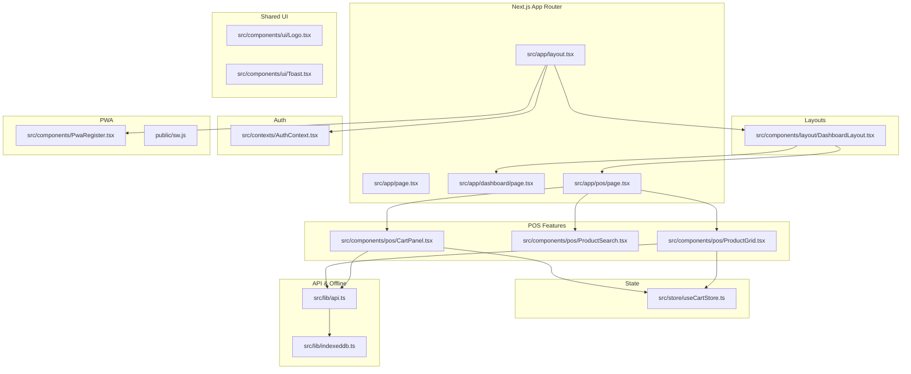

**Diagram sources**
- [layout.tsx:1-60](file://apps/web/src/app/layout.tsx#L1-L60)
- [page.tsx:1-6](file://apps/web/src/app/page.tsx#L1-L6)
- [dashboard/page.tsx:1-166](file://apps/web/src/app/dashboard/page.tsx#L1-L166)
- [pos/page.tsx:1-134](file://apps/web/src/app/pos/page.tsx#L1-L134)
- [DashboardLayout.tsx:1-182](file://apps/web/src/components/layout/DashboardLayout.tsx#L1-L182)
- [ProductGrid.tsx:1-248](file://apps/web/src/components/pos/ProductGrid.tsx#L1-L248)
- [ProductSearch.tsx:1-17](file://apps/web/src/components/pos/ProductSearch.tsx#L1-L17)
- [CartPanel.tsx:1-497](file://apps/web/src/components/pos/CartPanel.tsx#L1-L497)
- [useCartStore.ts:1-184](file://apps/web/src/store/useCartStore.ts#L1-L184)
- [AuthContext.tsx:1-84](file://apps/web/src/contexts/AuthContext.tsx#L1-L84)
- [api.ts:1-618](file://apps/web/src/lib/api.ts#L1-L618)
- [indexeddb.ts:1-147](file://apps/web/src/lib/indexeddb.ts#L1-L147)
- [PwaRegister.tsx:1-23](file://apps/web/src/components/PwaRegister.tsx#L1-L23)
- [sw.js:1-19](file://apps/web/public/sw.js#L1-L19)

**Section sources**
- [layout.tsx:1-60](file://apps/web/src/app/layout.tsx#L1-L60)
- [components.json:1-26](file://apps/web/components.json#L1-L26)

## Core Components
- App shell and metadata: Root layout configures fonts, manifest, icons, viewport, and wraps children with AuthProvider and PWA registration.
- Authentication context: Provides user session state, login/logout, and route protection.
- Global cart store: Centralized POS cart state with actions for add/remove/update items, global discount, tax toggle, and held transactions.
- Dashboard layout: Role-aware sidebar navigation, responsive mobile drawer, and content area.
- POS page: Shift management, product search/grid, and cart panel integration.
- API utilities: Unified fetch wrapper with auth headers, 401 handling, offline fallbacks, and IndexedDB-backed cache/queue.
- PWA: Service worker registration and basic caching strategy.

**Section sources**
- [layout.tsx:1-60](file://apps/web/src/app/layout.tsx#L1-L60)
- [AuthContext.tsx:1-84](file://apps/web/src/contexts/AuthContext.tsx#L1-L84)
- [useCartStore.ts:1-184](file://apps/web/src/store/useCartStore.ts#L1-L184)
- [DashboardLayout.tsx:1-182](file://apps/web/src/components/layout/DashboardLayout.tsx#L1-L182)
- [pos/page.tsx:1-134](file://apps/web/src/app/pos/page.tsx#L1-L134)
- [api.ts:1-618](file://apps/web/src/lib/api.ts#L1-L618)
- [PwaRegister.tsx:1-23](file://apps/web/src/components/PwaRegister.tsx#L1-L23)

## Architecture Overview
The frontend follows a layered architecture:
- Presentation layer: Pages and components (POS, Dashboard, UI).
- State layer: Zustand stores for cart and derived computations.
- Domain layer: API utilities encapsulate HTTP calls and offline behavior.
- Infrastructure layer: IndexedDB for caching and sync queue; service worker for PWA.

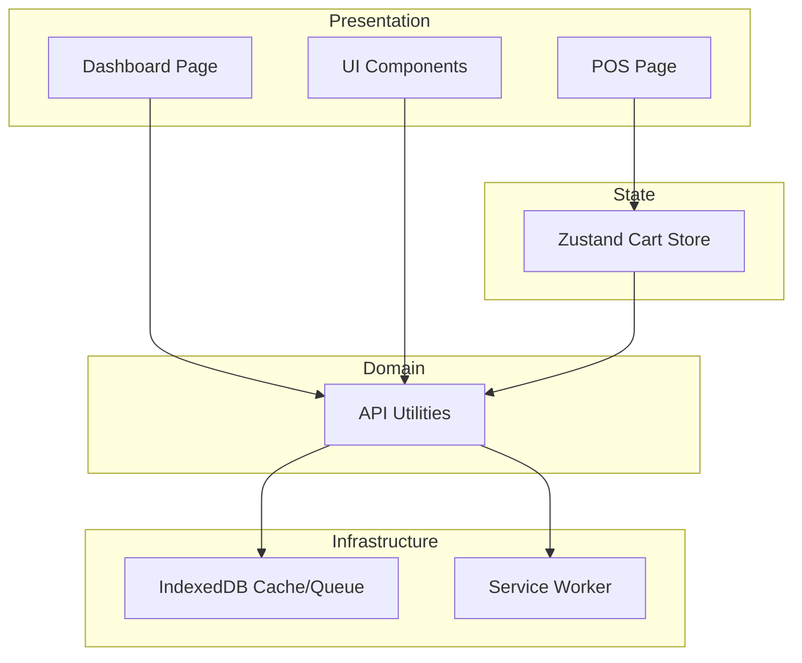

**Diagram sources**
- [pos/page.tsx:1-134](file://apps/web/src/app/pos/page.tsx#L1-L134)
- [dashboard/page.tsx:1-166](file://apps/web/src/app/dashboard/page.tsx#L1-L166)
- [useCartStore.ts:1-184](file://apps/web/src/store/useCartStore.ts#L1-L184)
- [api.ts:1-618](file://apps/web/src/lib/api.ts#L1-L618)
- [indexeddb.ts:1-147](file://apps/web/src/lib/indexeddb.ts#L1-L147)
- [sw.js:1-19](file://apps/web/public/sw.js#L1-L19)

## Detailed Component Analysis

### App Router and Pages
- Root layout sets metadata, manifest, icons, viewport, and wraps children with AuthProvider and PWA registration.
- Home redirects to login.
- POS page orchestrates shift checks, product search/grid, and cart panel.
- Dashboard page loads analytics and renders charts and summaries.

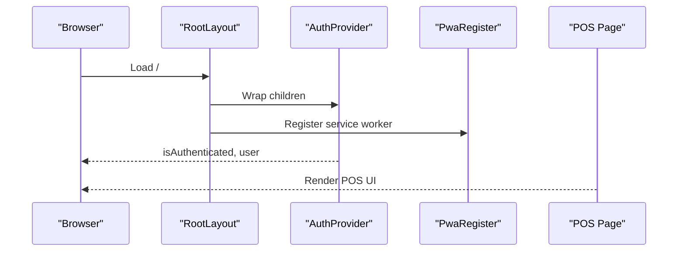

**Diagram sources**
- [layout.tsx:1-60](file://apps/web/src/app/layout.tsx#L1-L60)
- [PwaRegister.tsx:1-23](file://apps/web/src/components/PwaRegister.tsx#L1-L23)
- [AuthContext.tsx:1-84](file://apps/web/src/contexts/AuthContext.tsx#L1-L84)
- [pos/page.tsx:1-134](file://apps/web/src/app/pos/page.tsx#L1-L134)

**Section sources**
- [layout.tsx:1-60](file://apps/web/src/app/layout.tsx#L1-L60)
- [page.tsx:1-6](file://apps/web/src/app/page.tsx#L1-L6)
- [pos/page.tsx:1-134](file://apps/web/src/app/pos/page.tsx#L1-L134)
- [dashboard/page.tsx:1-166](file://apps/web/src/app/dashboard/page.tsx#L1-L166)

### Authentication Context
- Manages isAuthenticated flag and user profile.
- On mount, checks cookie for token and validates against /auth/me.
- Redirects unauthenticated users away from protected routes.
- Provides logout that clears tokens and navigates to login.

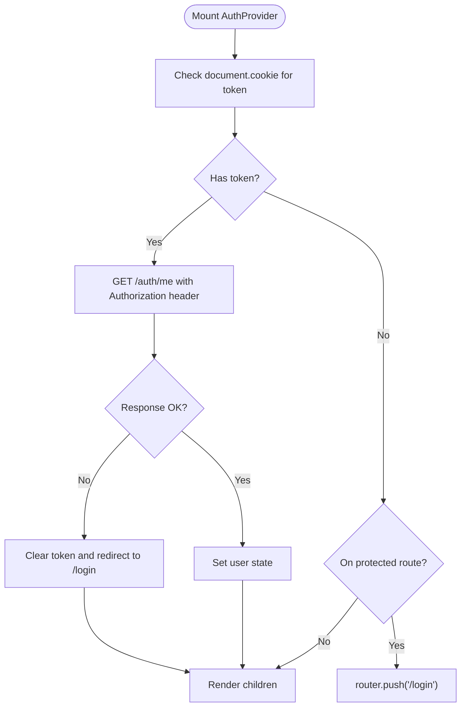

**Diagram sources**
- [AuthContext.tsx:1-84](file://apps/web/src/contexts/AuthContext.tsx#L1-L84)

**Section sources**
- [AuthContext.tsx:1-84](file://apps/web/src/contexts/AuthContext.tsx#L1-L84)

### State Management with Zustand (Cart Store)
- Defines Product, ProductVariant, ProductModifier, CartItem, and HeldTransaction types.
- Exposes actions: addItem, removeItem, updateQuantity, updateDiscount, clearCart, holdTransaction, resumeTransaction, removeHeldTransaction.
- Selectors: getSubtotal, getTotalDiscount, plus globalDiscount and isTaxEnabled toggles.
- Cart item identity combines productId, selected variant, and sorted modifier IDs to prevent duplicates.

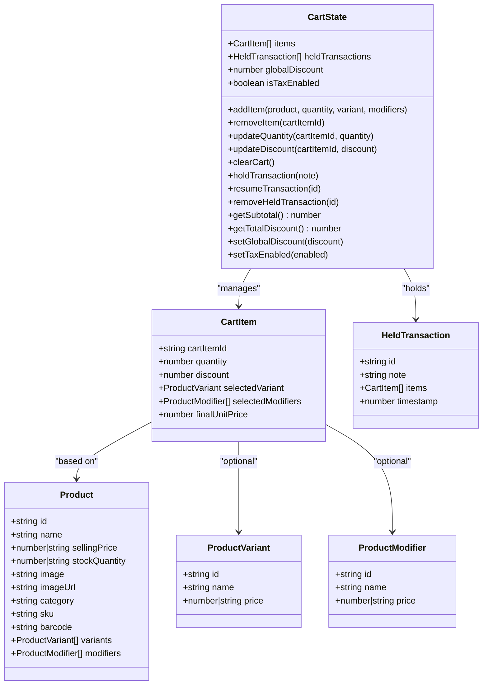

**Diagram sources**
- [useCartStore.ts:1-184](file://apps/web/src/store/useCartStore.ts#L1-L184)

**Section sources**
- [useCartStore.ts:1-184](file://apps/web/src/store/useCartStore.ts#L1-L184)

### POS Page Composition
- Loads current shift on mount; supports opening/closing shifts.
- Renders top navbar with logo, product search, and header actions.
- Left column: ProductGrid with category filtering and variant/modifier selection.
- Right column: CartPanel with customer selection, payment methods, taxes, discounts, and checkout flow.

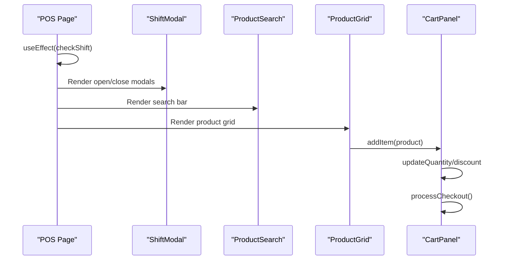

**Diagram sources**
- [pos/page.tsx:1-134](file://apps/web/src/app/pos/page.tsx#L1-L134)
- [ProductGrid.tsx:1-248](file://apps/web/src/components/pos/ProductGrid.tsx#L1-L248)
- [ProductSearch.tsx:1-17](file://apps/web/src/components/pos/ProductSearch.tsx#L1-L17)
- [CartPanel.tsx:1-497](file://apps/web/src/components/pos/CartPanel.tsx#L1-L497)

**Section sources**
- [pos/page.tsx:1-134](file://apps/web/src/app/pos/page.tsx#L1-L134)

### Cart Panel Logic
- Calculates subtotal, global discount, tax (11% if enabled), and points-based discount.
- Supports Cash, QRIS, and Card payment methods; Cash mode requires tendered amount.
- Integrates with API for checkout and holds; shows success modal and optional receipt printing.
- Uses toast notifications for feedback.

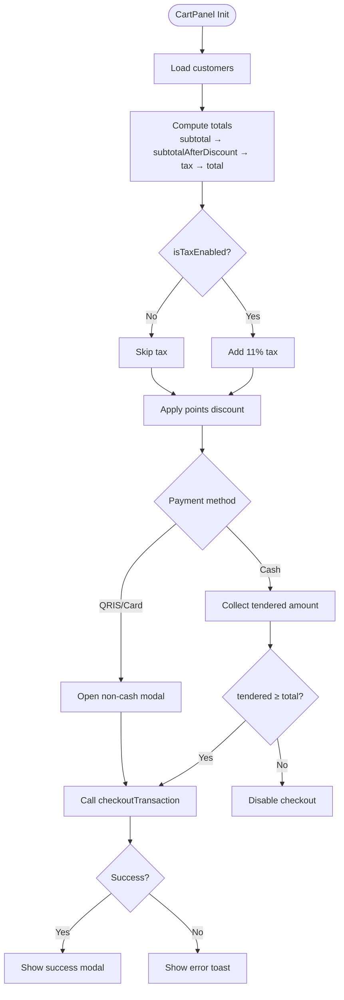

**Diagram sources**
- [CartPanel.tsx:1-497](file://apps/web/src/components/pos/CartPanel.tsx#L1-L497)
- [api.ts:75-119](file://apps/web/src/lib/api.ts#L75-L119)

**Section sources**
- [CartPanel.tsx:1-497](file://apps/web/src/components/pos/CartPanel.tsx#L1-L497)

### Product Grid and Search
- Loads products with offline cache fallback.
- Supports category filtering and barcode scanning via global listener.
- Opens variant/modifier modal when applicable; otherwise adds to cart immediately.

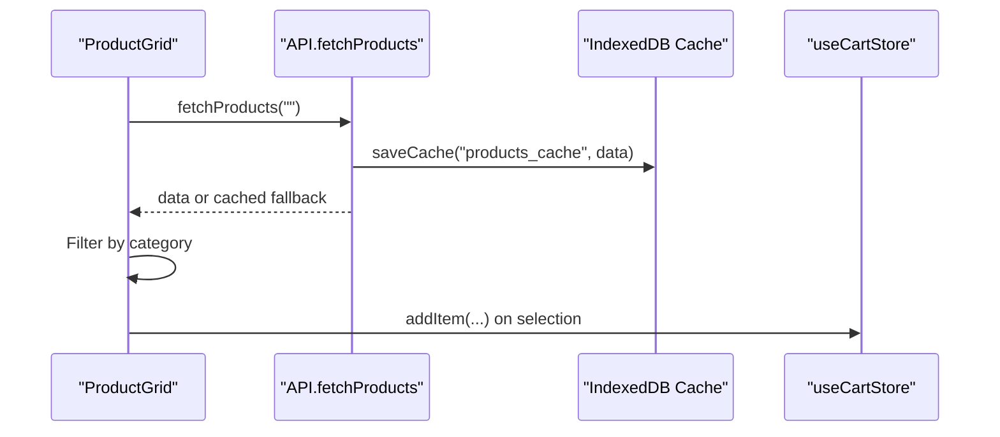

**Diagram sources**
- [ProductGrid.tsx:1-248](file://apps/web/src/components/pos/ProductGrid.tsx#L1-L248)
- [api.ts:42-64](file://apps/web/src/lib/api.ts#L42-L64)
- [indexeddb.ts:45-86](file://apps/web/src/lib/indexeddb.ts#L45-L86)
- [useCartStore.ts:72-114](file://apps/web/src/store/useCartStore.ts#L72-L114)

**Section sources**
- [ProductGrid.tsx:1-248](file://apps/web/src/components/pos/ProductGrid.tsx#L1-L248)
- [ProductSearch.tsx:1-17](file://apps/web/src/components/pos/ProductSearch.tsx#L1-L17)

### Dashboard Layout
- Role-aware menu items (admin, supervisor, cashier).
- Responsive desktop sidebar and mobile drawer.
- Logout integration and sync manager placeholder.

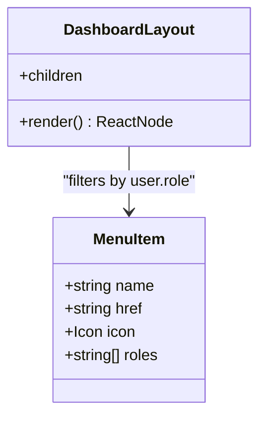

**Diagram sources**
- [DashboardLayout.tsx:1-182](file://apps/web/src/components/layout/DashboardLayout.tsx#L1-L182)

**Section sources**
- [DashboardLayout.tsx:1-182](file://apps/web/src/components/layout/DashboardLayout.tsx#L1-L182)

### API Integration Patterns and Offline Behavior
- Centralized fetch wrapper with token extraction and 401 handling.
- Offline-first data fetching: server-first with cache persistence; on failure, serve cached data.
- Offline transaction queue: when network fails, enqueue POST /transactions/offline-sync and return a simulated success response.
- Analytics and other endpoints follow similar patterns.

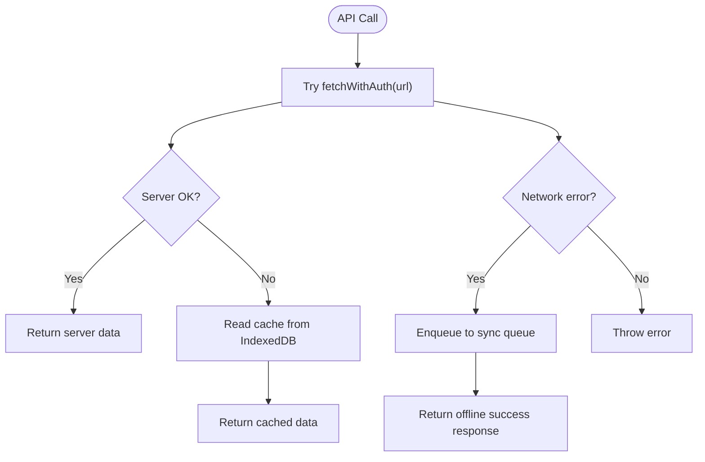

**Diagram sources**
- [api.ts:17-27](file://apps/web/src/lib/api.ts#L17-L27)
- [api.ts:42-64](file://apps/web/src/lib/api.ts#L42-L64)
- [api.ts:75-119](file://apps/web/src/lib/api.ts#L75-L119)
- [indexeddb.ts:88-145](file://apps/web/src/lib/indexeddb.ts#L88-L145)

**Section sources**
- [api.ts:1-618](file://apps/web/src/lib/api.ts#L1-L618)
- [indexeddb.ts:1-147](file://apps/web/src/lib/indexeddb.ts#L1-L147)

### PWA and Offline Capabilities
- Service worker registration via PWA component.
- Basic service worker script caches root path and serves from cache if network fails.
- Offline data caching and sync queue complement the service worker for robust offline operation.

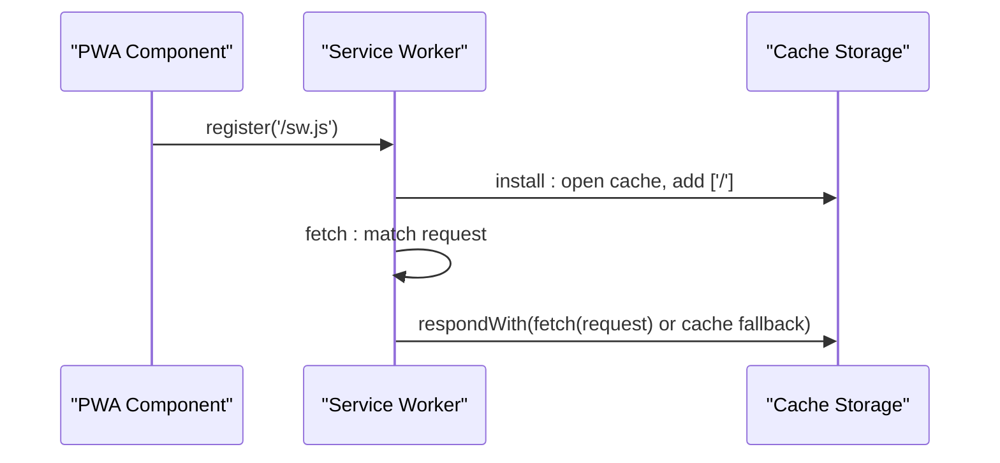

**Diagram sources**
- [PwaRegister.tsx:1-23](file://apps/web/src/components/PwaRegister.tsx#L1-L23)
- [sw.js:1-19](file://apps/web/public/sw.js#L1-L19)

**Section sources**
- [PwaRegister.tsx:1-23](file://apps/web/src/components/PwaRegister.tsx#L1-L23)
- [sw.js:1-19](file://apps/web/public/sw.js#L1-L19)

## Dependency Analysis
- UI framework: Tailwind CSS and shadcn/ui configured via components.json.
- State management: Zustand for cart and application state.
- Routing: Next.js App Router with file-based routes.
- Authentication: Context provider with cookie-based token and protected routes.
- PWA: Service worker registration and basic caching.
- Offline: IndexedDB for cache and sync queue.

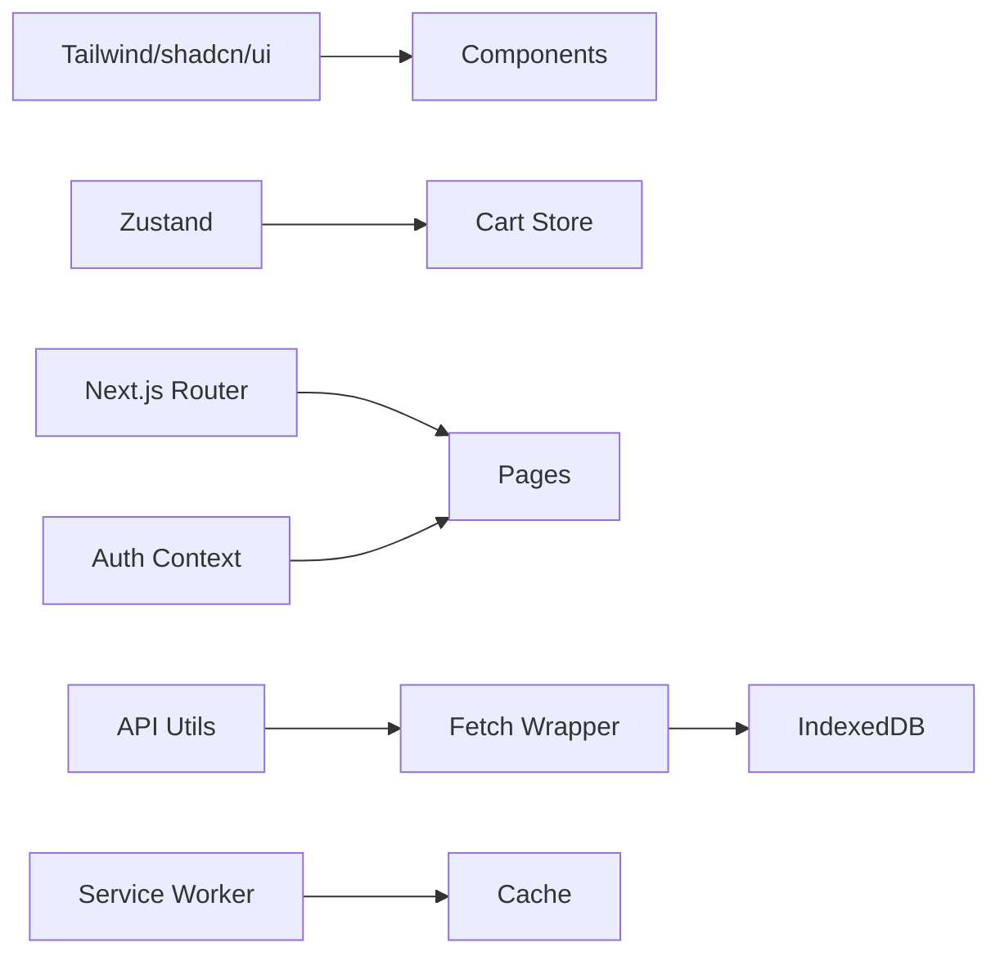

**Diagram sources**
- [components.json:1-26](file://apps/web/components.json#L1-L26)
- [useCartStore.ts:1-184](file://apps/web/src/store/useCartStore.ts#L1-L184)
- [layout.tsx:1-60](file://apps/web/src/app/layout.tsx#L1-L60)
- [AuthContext.tsx:1-84](file://apps/web/src/contexts/AuthContext.tsx#L1-L84)
- [api.ts:1-618](file://apps/web/src/lib/api.ts#L1-L618)
- [indexeddb.ts:1-147](file://apps/web/src/lib/indexeddb.ts#L1-L147)
- [sw.js:1-19](file://apps/web/public/sw.js#L1-L19)

**Section sources**
- [components.json:1-26](file://apps/web/components.json#L1-L26)
- [package.json:1-40](file://apps/web/package.json#L1-L40)

## Performance Considerations
- Prefer client-side caching for product/customer lists with IndexedDB to reduce network requests.
- Use memoization and selectors in Zustand to minimize re-renders.
- Lazy-load heavy components and images; leverage Next.js image optimization.
- Debounce search input to limit API calls.
- Keep cart operations batched to reduce store updates.

## Troubleshooting Guide
- Authentication issues: Verify token cookie presence and validity; ensure /auth/me endpoint responds with 200.
- Checkout failures: Check network connectivity; confirm offline queue is being processed; review simulated offline responses.
- Product search returning empty: Confirm cache exists and IndexedDB is accessible; verify server availability.
- PWA not registering: Ensure service worker path matches and browser supports service workers.

**Section sources**
- [AuthContext.tsx:33-62](file://apps/web/src/contexts/AuthContext.tsx#L33-L62)
- [api.ts:17-27](file://apps/web/src/lib/api.ts#L17-L27)
- [api.ts:100-118](file://apps/web/src/lib/api.ts#L100-L118)
- [indexeddb.ts:14-42](file://apps/web/src/lib/indexeddb.ts#L14-L42)
- [PwaRegister.tsx:6-19](file://apps/web/src/components/PwaRegister.tsx#L6-L19)

## Conclusion
ARHAT POS leverages Next.js App Router for structured routing, Zustand for efficient state management, and a cohesive API layer with offline-first strategies. The PWA setup and responsive layout deliver a robust, mobile-friendly POS experience suitable for real-world environments.

## Appendices
- Extension guidelines:
  - Add new pages under src/app with appropriate route segments.
  - Create reusable components under src/components and integrate via shared layouts.
  - Extend Zustand stores for new domain features; keep selectors pure and efficient.
  - Integrate new API endpoints in src/lib/api.ts with offline fallbacks.
  - Add new menu items in DashboardLayout.tsx with role gating.
  - Configure shadcn/ui components via components.json aliases and use them consistently.