# Next.js App Router & File-Based Routing

<cite>
**Referenced Files in This Document**
- [apps/web/src/app/layout.tsx](file://apps/web/src/app/layout.tsx)
- [apps/web/src/app/page.tsx](file://apps/web/src/app/page.tsx)
- [apps/web/src/middleware.ts](file://apps/web/src/middleware.ts)
- [apps/web/src/app/dashboard/page.tsx](file://apps/web/src/app/dashboard/page.tsx)
- [apps/web/src/app/pos/page.tsx](file://apps/web/src/app/pos/page.tsx)
- [apps/web/src/app/products/page.tsx](file://apps/web/src/app/products/page.tsx)
- [apps/web/src/app/customers/page.tsx](file://apps/web/src/app/customers/page.tsx)
- [apps/web/src/app/reports/page.tsx](file://apps/web/src/app/reports/page.tsx)
- [apps/web/src/app/inventory/page.tsx](file://apps/web/src/app/inventory/page.tsx)
- [apps/web/src/app/settings/page.tsx](file://apps/web/src/app/settings/page.tsx)
- [apps/web/src/app/transactions/page.tsx](file://apps/web/src/app/transactions/page.tsx)
- [apps/web/src/components/layout/DashboardLayout.tsx](file://apps/web/src/components/layout/DashboardLayout.tsx)
- [apps/web/src/components/ErrorBoundary.tsx](file://apps/web/src/components/ErrorBoundary.tsx)
- [apps/web/src/lib/api.ts](file://apps/web/src/lib/api.ts)
- [apps/web/next.config.ts](file://apps/web/next.config.ts)
- [apps/web/package.json](file://apps/web/package.json)
</cite>

## Table of Contents
1. [Introduction](#introduction)
2. [Project Structure](#project-structure)
3. [Core Components](#core-components)
4. [Architecture Overview](#architecture-overview)
5. [Detailed Component Analysis](#detailed-component-analysis)
6. [Dependency Analysis](#dependency-analysis)
7. [Performance Considerations](#performance-considerations)
8. [Troubleshooting Guide](#troubleshooting-guide)
9. [Conclusion](#conclusion)

## Introduction
This document explains the Next.js App Router implementation in ARHAT POS, focusing on file-based routing, page structure, and route organization patterns. It covers the differences between pages and layouts, nested routing with grouping folders, the main application pages (dashboard, POS interface, product management, customer management, reports, settings, transactions), route parameters and dynamic routes, catch-all patterns, root layout configuration, metadata handling, global styles, route protection via middleware, redirects, custom error handling, and performance optimization strategies such as automatic code splitting and route-level caching.

## Project Structure
ARHAT POS uses Next.js App Router under apps/web/src/app. Routes are derived from the filesystem hierarchy. The root layout defines global metadata, fonts, viewport, and providers. Authentication middleware protects protected routes. Each main functional area resides under dedicated folders with a page.tsx entry.

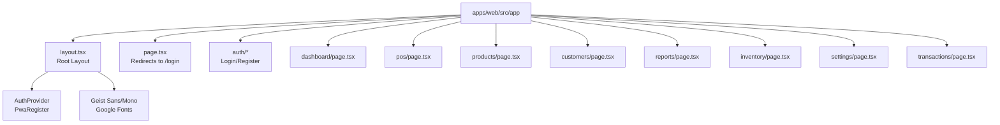

**Diagram sources**
- [apps/web/src/app/layout.tsx](file://apps/web/src/app/layout.tsx)
- [apps/web/src/app/page.tsx](file://apps/web/src/app/page.tsx)
- [apps/web/src/app/dashboard/page.tsx](file://apps/web/src/app/dashboard/page.tsx)
- [apps/web/src/app/pos/page.tsx](file://apps/web/src/app/pos/page.tsx)
- [apps/web/src/app/products/page.tsx](file://apps/web/src/app/products/page.tsx)
- [apps/web/src/app/customers/page.tsx](file://apps/web/src/app/customers/page.tsx)
- [apps/web/src/app/reports/page.tsx](file://apps/web/src/app/reports/page.tsx)
- [apps/web/src/app/inventory/page.tsx](file://apps/web/src/app/inventory/page.tsx)
- [apps/web/src/app/settings/page.tsx](file://apps/web/src/app/settings/page.tsx)
- [apps/web/src/app/transactions/page.tsx](file://apps/web/src/app/transactions/page.tsx)

**Section sources**
- [apps/web/src/app/layout.tsx](file://apps/web/src/app/layout.tsx)
- [apps/web/src/app/page.tsx](file://apps/web/src/app/page.tsx)

## Core Components
- Root Layout: Defines metadata, viewport, fonts, global CSS, and providers.
- Middleware: Enforces authentication and redirects for protected areas.
- Page Components: Each route folder’s page.tsx renders the UI and orchestrates data fetching.
- Shared Layout: DashboardLayout wraps most pages to maintain consistent navigation and shell.
- Error Boundary: Centralized error handling for rendering fallbacks.

Key responsibilities:
- Root layout: global providers, metadata, fonts, viewport.
- Middleware: enforce auth, redirect unauthenticated users to login; redirect authenticated users away from login.
- Pages: render UI, manage loading/error states, integrate with API service layer.
- Shared layout: consistent header, sidebar, and container for admin-facing pages.

**Section sources**
- [apps/web/src/app/layout.tsx](file://apps/web/src/app/layout.tsx)
- [apps/web/src/middleware.ts](file://apps/web/src/middleware.ts)
- [apps/web/src/components/layout/DashboardLayout.tsx](file://apps/web/src/components/layout/DashboardLayout.tsx)
- [apps/web/src/components/ErrorBoundary.tsx](file://apps/web/src/components/ErrorBoundary.tsx)

## Architecture Overview
The routing follows Next.js conventions:
- Filesystem determines routes.
- Groups like (admin) and (dashboard) are supported by Next.js and used to organize routes without affecting URLs.
- Protected routes enforced by middleware.
- Shared layout composes page content.

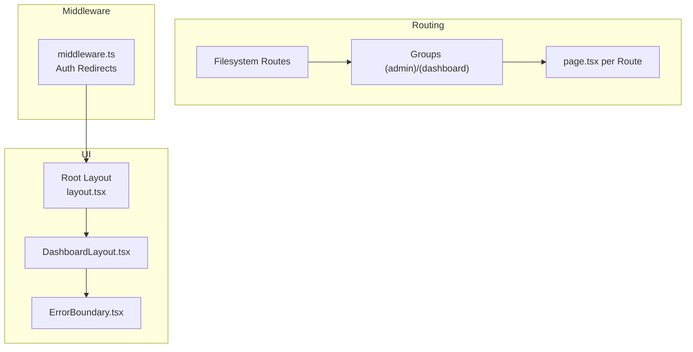

**Diagram sources**
- [apps/web/src/app/layout.tsx](file://apps/web/src/app/layout.tsx)
- [apps/web/src/middleware.ts](file://apps/web/src/middleware.ts)
- [apps/web/src/components/layout/DashboardLayout.tsx](file://apps/web/src/components/layout/DashboardLayout.tsx)
- [apps/web/src/components/ErrorBoundary.tsx](file://apps/web/src/components/ErrorBoundary.tsx)

## Detailed Component Analysis

### Root Layout and Metadata
- Defines metadata (title, description, manifest, icons, Apple WebApp settings).
- Sets viewport configuration.
- Loads Google Fonts (Geist Sans and Geist Mono) and global CSS.
- Wraps children with AuthProvider and PWA registration component.

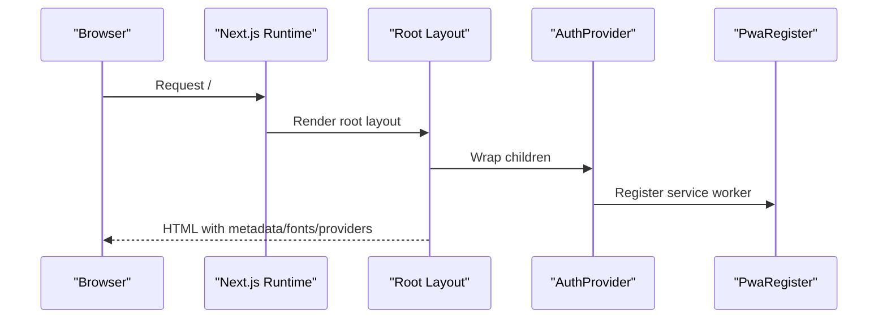

**Diagram sources**
- [apps/web/src/app/layout.tsx](file://apps/web/src/app/layout.tsx)

**Section sources**
- [apps/web/src/app/layout.tsx](file://apps/web/src/app/layout.tsx)

### Home Redirect
- Redirects anonymous users visiting the root to the login page.

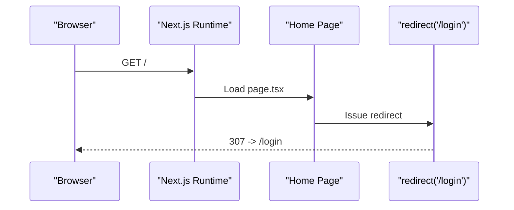

**Diagram sources**
- [apps/web/src/app/page.tsx](file://apps/web/src/app/page.tsx)

**Section sources**
- [apps/web/src/app/page.tsx](file://apps/web/src/app/page.tsx)

### Authentication Middleware
- Protects routes under /pos, /dashboard, /inventory, and login.
- Redirects unauthenticated users to login.
- Redirects authenticated users away from login.

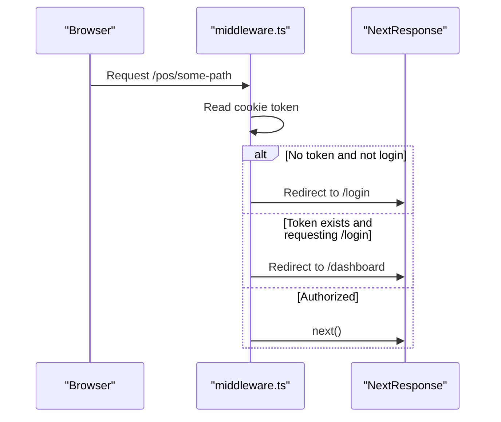

**Diagram sources**
- [apps/web/src/middleware.ts](file://apps/web/src/middleware.ts)

**Section sources**
- [apps/web/src/middleware.ts](file://apps/web/src/middleware.ts)

### Dashboard
- Client component with data fetching for analytics.
- Uses DashboardLayout and ErrorBoundary.
- Renders charts and summary cards.

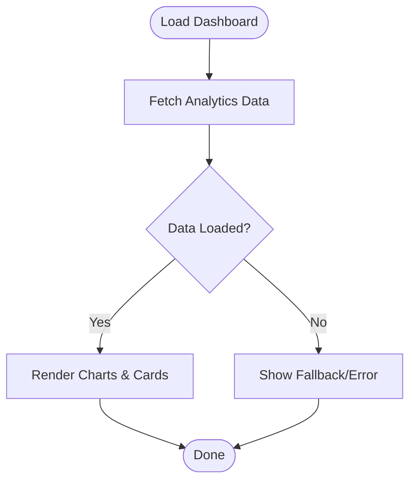

**Diagram sources**
- [apps/web/src/app/dashboard/page.tsx](file://apps/web/src/app/dashboard/page.tsx)

**Section sources**
- [apps/web/src/app/dashboard/page.tsx](file://apps/web/src/app/dashboard/page.tsx)

### Point of Sale (POS)
- Manages shift lifecycle (open/close).
- Integrates product search/grid and cart panel.
- Conditional modals for shift actions.

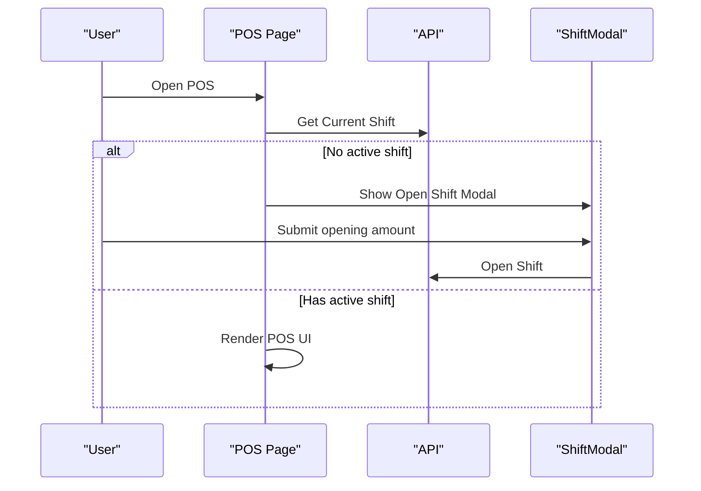

**Diagram sources**
- [apps/web/src/app/pos/page.tsx](file://apps/web/src/app/pos/page.tsx)

**Section sources**
- [apps/web/src/app/pos/page.tsx](file://apps/web/src/app/pos/page.tsx)

### Products Management
- CRUD operations for products.
- Uses modal forms and BOM management.
- Integrates with API service layer.

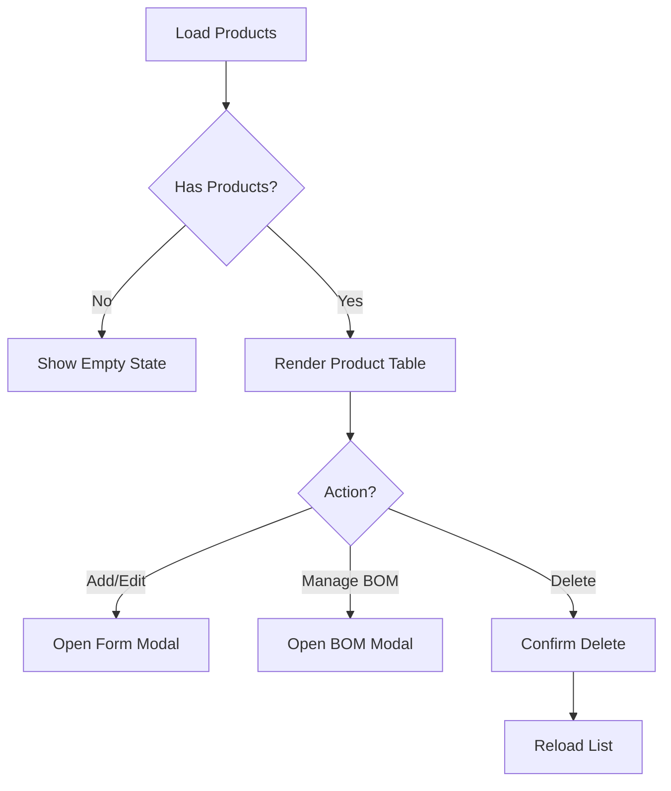

**Diagram sources**
- [apps/web/src/app/products/page.tsx](file://apps/web/src/app/products/page.tsx)

**Section sources**
- [apps/web/src/app/products/page.tsx](file://apps/web/src/app/products/page.tsx)

### Customers Management
- Full CRUD for customers.
- Search, tiering, notifications, and transaction history.
- Rich UI with modals for add/edit/history/notification.

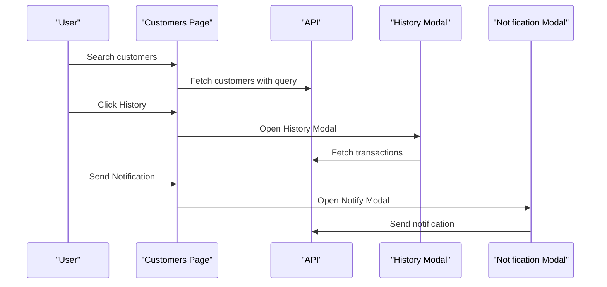

**Diagram sources**
- [apps/web/src/app/customers/page.tsx](file://apps/web/src/app/customers/page.tsx)

**Section sources**
- [apps/web/src/app/customers/page.tsx](file://apps/web/src/app/customers/page.tsx)

### Reports
- Multi-tab analytics dashboard with charts and export.
- Parallel data fetching for sales, product, profit/loss, and customer analytics.

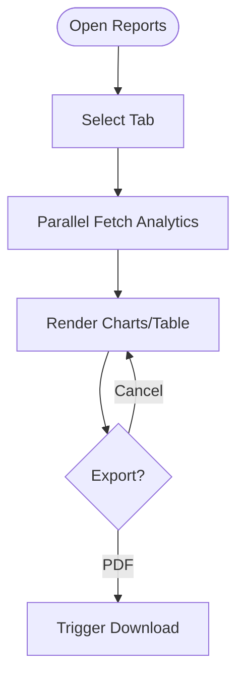

**Diagram sources**
- [apps/web/src/app/reports/page.tsx](file://apps/web/src/app/reports/page.tsx)

**Section sources**
- [apps/web/src/app/reports/page.tsx](file://apps/web/src/app/reports/page.tsx)

### Inventory Management
- Multi-outlet stock monitoring, stock movements, adjustments, opname (audit), and transfers.
- Tabbed interface with separate components for each operation.

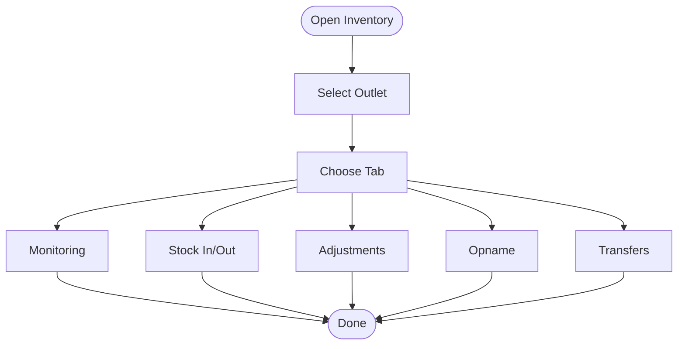

**Diagram sources**
- [apps/web/src/app/inventory/page.tsx](file://apps/web/src/app/inventory/page.tsx)

**Section sources**
- [apps/web/src/app/inventory/page.tsx](file://apps/web/src/app/inventory/page.tsx)

### Settings
- Store profile settings and user management.
- Role-based access control restricts user management to admin/owner.

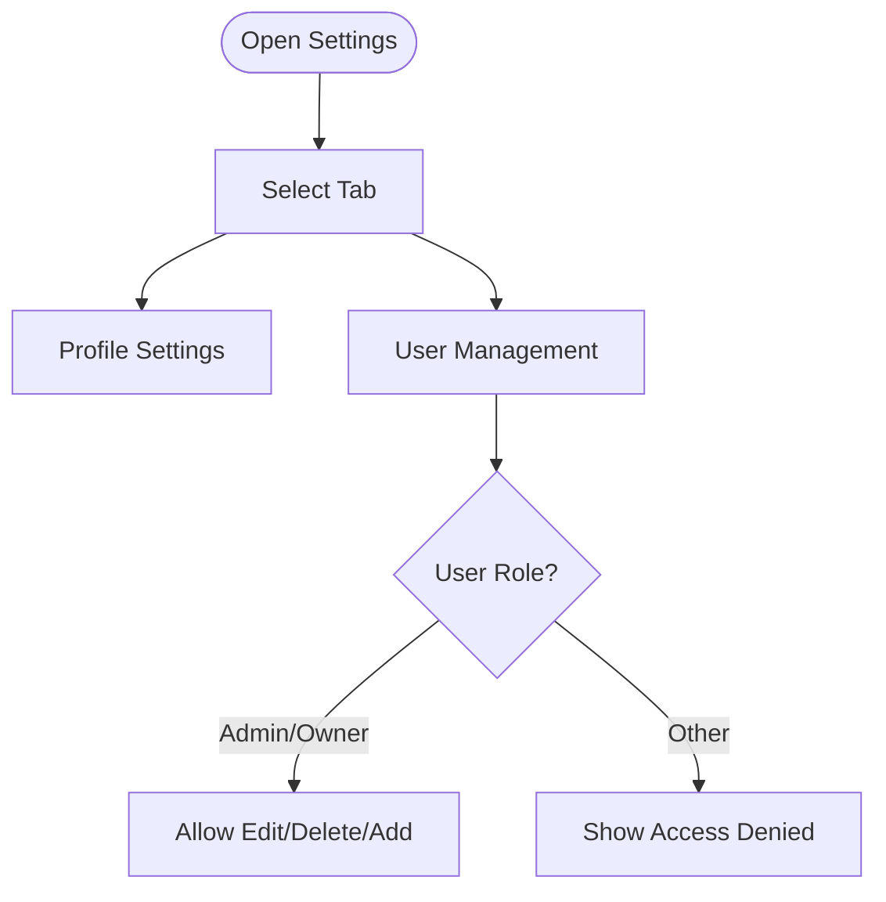

**Diagram sources**
- [apps/web/src/app/settings/page.tsx](file://apps/web/src/app/settings/page.tsx)

**Section sources**
- [apps/web/src/app/settings/page.tsx](file://apps/web/src/app/settings/page.tsx)

### Transactions
- View recent transactions, refund, void, and print receipts.

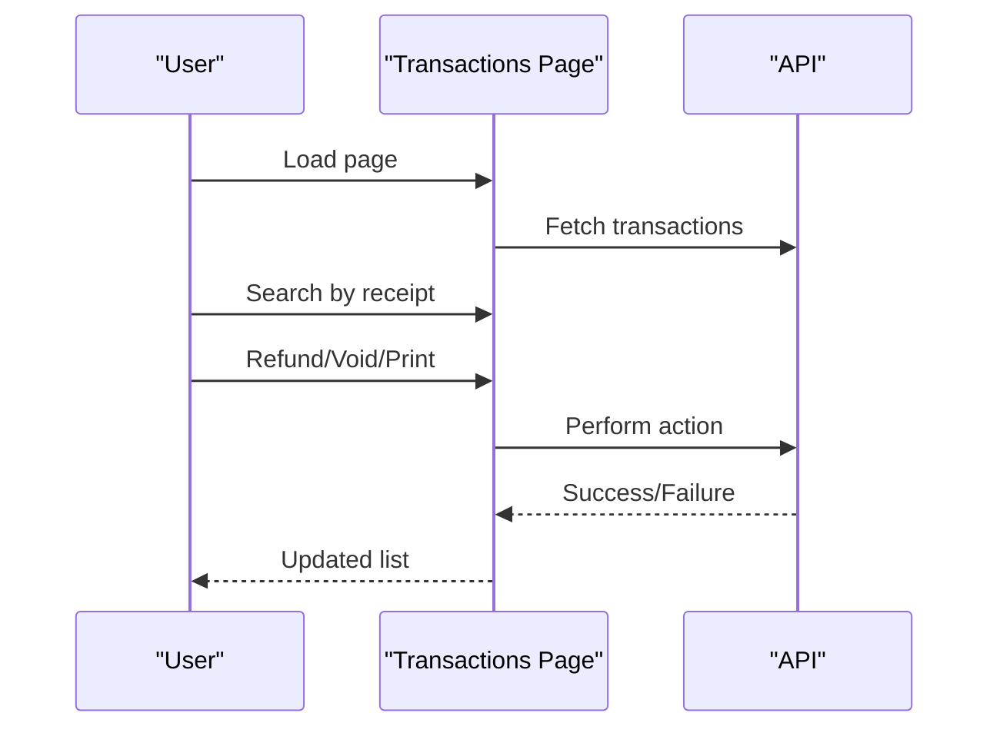

**Diagram sources**
- [apps/web/src/app/transactions/page.tsx](file://apps/web/src/app/transactions/page.tsx)

**Section sources**
- [apps/web/src/app/transactions/page.tsx](file://apps/web/src/app/transactions/page.tsx)

### Shared Layout and Error Handling
- DashboardLayout provides consistent shell for admin pages.
- ErrorBoundary wraps page content to gracefully handle rendering errors.

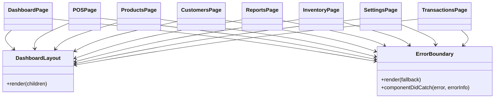

**Diagram sources**
- [apps/web/src/components/layout/DashboardLayout.tsx](file://apps/web/src/components/layout/DashboardLayout.tsx)
- [apps/web/src/components/ErrorBoundary.tsx](file://apps/web/src/components/ErrorBoundary.tsx)
- [apps/web/src/app/dashboard/page.tsx](file://apps/web/src/app/dashboard/page.tsx)
- [apps/web/src/app/pos/page.tsx](file://apps/web/src/app/pos/page.tsx)
- [apps/web/src/app/products/page.tsx](file://apps/web/src/app/products/page.tsx)
- [apps/web/src/app/customers/page.tsx](file://apps/web/src/app/customers/page.tsx)
- [apps/web/src/app/reports/page.tsx](file://apps/web/src/app/reports/page.tsx)
- [apps/web/src/app/inventory/page.tsx](file://apps/web/src/app/inventory/page.tsx)
- [apps/web/src/app/settings/page.tsx](file://apps/web/src/app/settings/page.tsx)
- [apps/web/src/app/transactions/page.tsx](file://apps/web/src/app/transactions/page.tsx)

**Section sources**
- [apps/web/src/components/layout/DashboardLayout.tsx](file://apps/web/src/components/layout/DashboardLayout.tsx)
- [apps/web/src/components/ErrorBoundary.tsx](file://apps/web/src/components/ErrorBoundary.tsx)

## Dependency Analysis
- Root layout depends on:
  - Google Fonts for typography.
  - Global CSS for base styles.
  - Auth provider for session state.
  - PWA registration component.
- Middleware depends on cookies and NextResponse for redirects.
- Pages depend on shared layout and API service layer.
- API service layer abstracts HTTP calls to backend.

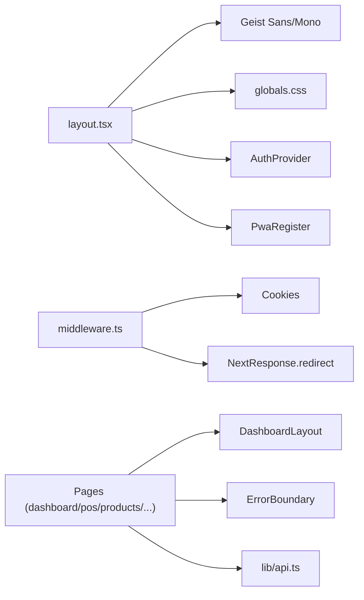

**Diagram sources**
- [apps/web/src/app/layout.tsx](file://apps/web/src/app/layout.tsx)
- [apps/web/src/middleware.ts](file://apps/web/src/middleware.ts)
- [apps/web/src/components/layout/DashboardLayout.tsx](file://apps/web/src/components/layout/DashboardLayout.tsx)
- [apps/web/src/components/ErrorBoundary.tsx](file://apps/web/src/components/ErrorBoundary.tsx)
- [apps/web/src/lib/api.ts](file://apps/web/src/lib/api.ts)

**Section sources**
- [apps/web/src/app/layout.tsx](file://apps/web/src/app/layout.tsx)
- [apps/web/src/middleware.ts](file://apps/web/src/middleware.ts)
- [apps/web/src/lib/api.ts](file://apps/web/src/lib/api.ts)

## Performance Considerations
- Automatic code splitting: Next.js splits route bundles automatically; each page component is bundled independently, reducing initial payload.
- Route-level caching: Pages can leverage server-side or client-side caching strategies. For example, analytics dashboards can cache chart data for a short TTL to reduce repeated network requests.
- Image optimization: Remote image patterns are configured to allow specific hosts, enabling optimized image delivery.
- Client components: Pages marked as use client benefit from React 18 concurrent features and selective re-rendering.
- Parallel data fetching: Reports page demonstrates Promise.all for concurrent API calls, minimizing total loading time.

Recommendations:
- Implement route-level caching for read-heavy pages (e.g., reports, inventory monitoring).
- Use Suspense boundaries and React.lazy for heavy components if needed.
- Consider SWR or React Query for client-side caching and background refetching.

**Section sources**
- [apps/web/next.config.ts](file://apps/web/next.config.ts)
- [apps/web/src/app/reports/page.tsx](file://apps/web/src/app/reports/page.tsx)

## Troubleshooting Guide
Common issues and resolutions:
- Unauthorized access to protected routes:
  - Ensure middleware reads the token cookie and redirects accordingly.
  - Verify matcher configuration targets intended paths.
- Login loop:
  - If authenticated but redirected to login, confirm token presence and validity.
  - If unauthenticated but on login, ensure redirect to dashboard is triggered.
- Page crashes:
  - Wrap page content with ErrorBoundary to prevent full-route failures.
  - Check API responses and surface user-friendly messages.
- Redirect loops:
  - Validate middleware logic and ensure login/logout paths are handled distinctly.

**Section sources**
- [apps/web/src/middleware.ts](file://apps/web/src/middleware.ts)
- [apps/web/src/components/ErrorBoundary.tsx](file://apps/web/src/components/ErrorBoundary.tsx)

## Conclusion
ARHAT POS leverages Next.js App Router to deliver a structured, scalable frontend. File-based routing simplifies navigation and deployment. The root layout centralizes metadata and providers, while middleware enforces authentication. Shared layout and error boundary components promote consistency and resilience. Pages implement robust data fetching and UI patterns, and performance is enhanced through automatic code splitting and route-level caching strategies.