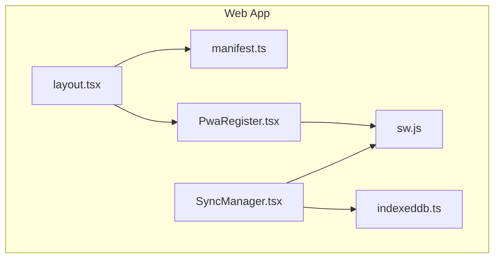
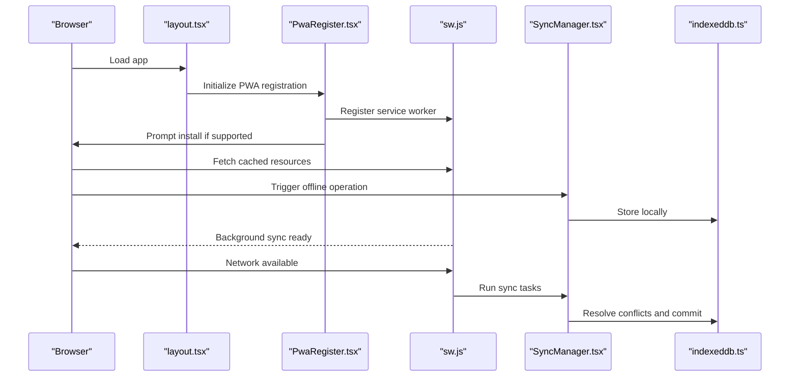
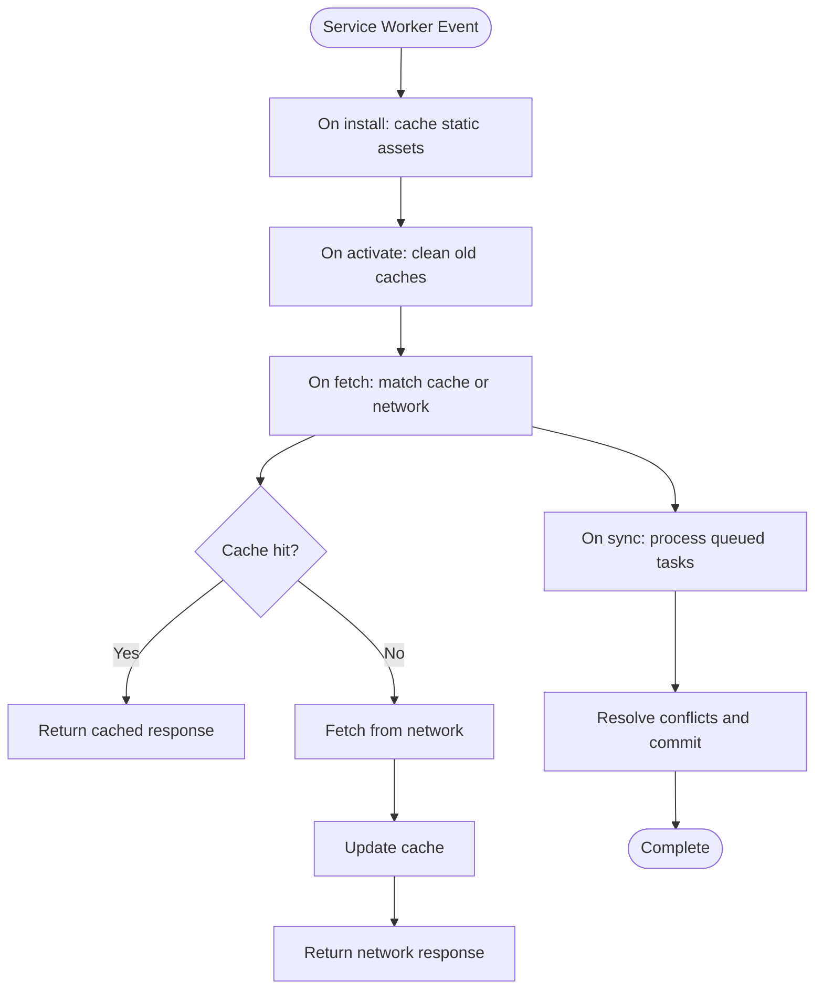
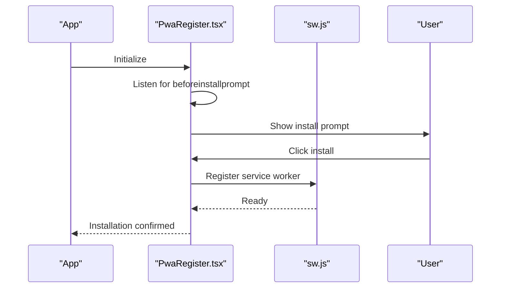
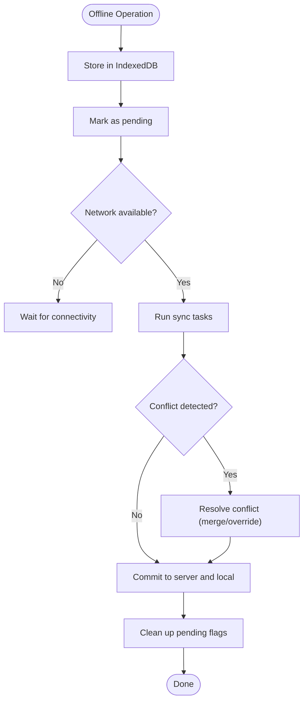
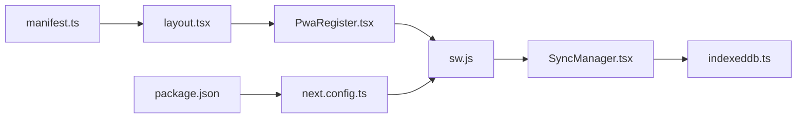

# Progressive Web App & Mobile Optimization

<cite>
**Referenced Files in This Document**
- [manifest.ts](file://apps/web/src/app/manifest.ts)
- [sw.js](file://apps/web/public/sw.js)
- [PwaRegister.tsx](file://apps/web/src/components/PwaRegister.tsx)
- [SyncManager.tsx](file://apps/web/src/components/SyncManager.tsx)
- [indexeddb.ts](file://apps/web/src/lib/indexeddb.ts)
- [layout.tsx](file://apps/web/src/app/layout.tsx)
- [next.config.ts](file://apps/web/next.config.ts)
- [package.json](file://apps/web/package.json)
</cite>

## Table of Contents
1. [Introduction](#introduction)
2. [Project Structure](#project-structure)
3. [Core Components](#core-components)
4. [Architecture Overview](#architecture-overview)
5. [Detailed Component Analysis](#detailed-component-analysis)
6. [Dependency Analysis](#dependency-analysis)
7. [Performance Considerations](#performance-considerations)
8. [Troubleshooting Guide](#troubleshooting-guide)
9. [Conclusion](#conclusion)

## Introduction
This document explains the Progressive Web App (PWA) implementation and mobile optimization features in ARHAT POS. It covers service worker functionality for offline capabilities, background synchronization, and push notification handling; the PWA registration process and manifest configuration; offline data synchronization strategies using IndexedDB; conflict resolution approaches; and mobile-specific optimizations including touch interactions, responsive design, and device features. It also provides testing guidelines, performance recommendations for mobile devices, and troubleshooting steps for common PWA issues.

## Project Structure
The PWA-related assets and logic are primarily located under the Next.js web application:
- Service Worker: [sw.js](file://apps/web/public/sw.js)
- Manifest configuration: [manifest.ts](file://apps/web/src/app/manifest.ts)
- PWA registration component: [PwaRegister.tsx](file://apps/web/src/components/PwaRegister.tsx)
- Offline synchronization manager: [SyncManager.tsx](file://apps/web/src/components/SyncManager.tsx)
- IndexedDB wrapper: [indexeddb.ts](file://apps/web/src/lib/indexeddb.ts)
- Application layout and metadata: [layout.tsx](file://apps/web/src/app/layout.tsx)
- Build configuration: [next.config.ts](file://apps/web/next.config.ts)
- Dependencies: [package.json](file://apps/web/package.json)

**Diagram sources**
- [layout.tsx](file://apps/web/src/app/layout.tsx)
- [manifest.ts](file://apps/web/src/app/manifest.ts)
- [PwaRegister.tsx](file://apps/web/src/components/PwaRegister.tsx)
- [SyncManager.tsx](file://apps/web/src/components/SyncManager.tsx)
- [indexeddb.ts](file://apps/web/src/lib/indexeddb.ts)
- [sw.js](file://apps/web/public/sw.js)

**Section sources**
- [layout.tsx](file://apps/web/src/app/layout.tsx)
- [manifest.ts](file://apps/web/src/app/manifest.ts)
- [PwaRegister.tsx](file://apps/web/src/components/PwaRegister.tsx)
- [SyncManager.tsx](file://apps/web/src/components/SyncManager.tsx)
- [indexeddb.ts](file://apps/web/src/lib/indexeddb.ts)
- [sw.js](file://apps/web/public/sw.js)

## Core Components
- Service Worker ([sw.js](file://apps/web/public/sw.js)): Implements caching strategies, background sync, and push notification handling. It manages offline resources and coordinates with the SyncManager for data synchronization.
- PWA Registration ([PwaRegister.tsx](file://apps/web/src/components/PwaRegister.tsx)): Handles the browser’s install prompt lifecycle and registers the service worker.
- Manifest ([manifest.ts](file://apps/web/src/app/manifest.ts)): Defines app metadata, icons, theme colors, and display mode for installation and home screen presence.
- Offline Sync Manager ([SyncManager.tsx](file://apps/web/src/components/SyncManager.tsx)): Orchestrates offline data operations and resolves conflicts when online.
- IndexedDB Wrapper ([indexeddb.ts](file://apps/web/src/lib/indexeddb.ts)): Provides structured local storage APIs for persistent offline data.

**Section sources**
- [sw.js](file://apps/web/public/sw.js)
- [PwaRegister.tsx](file://apps/web/src/components/PwaRegister.tsx)
- [manifest.ts](file://apps/web/src/app/manifest.ts)
- [SyncManager.tsx](file://apps/web/src/components/SyncManager.tsx)
- [indexeddb.ts](file://apps/web/src/lib/indexeddb.ts)

## Architecture Overview
The PWA architecture integrates the service worker with the frontend application to enable offline-first experiences and reliable background synchronization.

**Diagram sources**
- [layout.tsx](file://apps/web/src/app/layout.tsx)
- [PwaRegister.tsx](file://apps/web/src/components/PwaRegister.tsx)
- [sw.js](file://apps/web/public/sw.js)
- [SyncManager.tsx](file://apps/web/src/components/SyncManager.tsx)
- [indexeddb.ts](file://apps/web/src/lib/indexeddb.ts)

## Detailed Component Analysis

### Service Worker Implementation
The service worker manages:
- Caching strategies for static and dynamic resources
- Background sync for pending transactions
- Push notification handling for real-time updates
- Offline resource serving

Key responsibilities:
- Intercept network requests and serve cached assets when offline
- Queue background sync tasks for failed or pending operations
- Handle push events and notify the UI via postMessage
- Update caches on new deployments

**Diagram sources**
- [sw.js](file://apps/web/public/sw.js)

**Section sources**
- [sw.js](file://apps/web/public/sw.js)

### PWA Registration and Install Prompt
The PWA registration component:
- Detects browser support for PWA installation
- Listens for the beforeinstallprompt event
- Presents an install prompt to users
- Registers the service worker after successful installation

**Diagram sources**
- [PwaRegister.tsx](file://apps/web/src/components/PwaRegister.tsx)
- [sw.js](file://apps/web/public/sw.js)

**Section sources**
- [PwaRegister.tsx](file://apps/web/src/components/PwaRegister.tsx)

### Manifest Configuration
The manifest defines:
- App name, short name, and description
- Icons for various sizes and formats
- Theme color and background color
- Display mode (standalone)
- Orientation and start URL

Integration points:
- Linked from the application layout
- Consumed by browsers during installation
- Used to customize the home screen appearance

**Section sources**
- [manifest.ts](file://apps/web/src/app/manifest.ts)
- [layout.tsx](file://apps/web/src/app/layout.tsx)

### Offline Data Synchronization and Conflict Resolution
Offline synchronization uses IndexedDB to persist data locally and resolve conflicts when connectivity is restored.

**Diagram sources**
- [SyncManager.tsx](file://apps/web/src/components/SyncManager.tsx)
- [indexeddb.ts](file://apps/web/src/lib/indexeddb.ts)

**Section sources**
- [SyncManager.tsx](file://apps/web/src/components/SyncManager.tsx)
- [indexeddb.ts](file://apps/web/src/lib/indexeddb.ts)

### IndexedDB Usage for Local Storage
The IndexedDB wrapper provides:
- Database initialization and migrations
- CRUD operations for entities (e.g., transactions, products)
- Batch operations for improved performance
- Transaction isolation and error handling

Best practices:
- Use structured cloning for serializable data
- Implement optimistic updates with rollback on failure
- Maintain separate stores per entity type
- Version database schema carefully to avoid breaking changes

**Section sources**
- [indexeddb.ts](file://apps/web/src/lib/indexeddb.ts)

### Mobile-Specific Optimizations
Mobile optimizations include:
- Touch-friendly UI sizing and spacing
- Responsive breakpoints and flexible layouts
- Device-specific features (e.g., barcode scanner integration)
- Reduced data usage and efficient caching strategies
- Fast startup via pre-cached critical assets

Integration points:
- Component-level responsive design
- Global CSS and Tailwind configurations
- Next.js image optimization and caching headers

**Section sources**
- [layout.tsx](file://apps/web/src/app/layout.tsx)
- [next.config.ts](file://apps/web/next.config.ts)

## Dependency Analysis
The PWA stack depends on:
- Service worker registration and lifecycle management
- Manifest metadata for installation and presentation
- IndexedDB for offline persistence
- Background sync for reliable delivery of operations
- Push notifications for real-time updates

**Diagram sources**
- [manifest.ts](file://apps/web/src/app/manifest.ts)
- [layout.tsx](file://apps/web/src/app/layout.tsx)
- [PwaRegister.tsx](file://apps/web/src/components/PwaRegister.tsx)
- [sw.js](file://apps/web/public/sw.js)
- [SyncManager.tsx](file://apps/web/src/components/SyncManager.tsx)
- [indexeddb.ts](file://apps/web/src/lib/indexeddb.ts)
- [next.config.ts](file://apps/web/next.config.ts)
- [package.json](file://apps/web/package.json)

**Section sources**
- [package.json](file://apps/web/package.json)
- [next.config.ts](file://apps/web/next.config.ts)

## Performance Considerations
- Optimize bundle size and lazy-load non-critical features
- Preload critical fonts and icons via the manifest
- Use efficient caching strategies (cache-first for static assets, network-fallback for dynamic)
- Minimize IndexedDB write amplification by batching operations
- Reduce layout thrashing by avoiding forced synchronous layouts
- Profile on low-end devices and adjust thresholds for animations and rendering
- Leverage background sync to defer heavy operations until connectivity improves

## Troubleshooting Guide
Common PWA issues and resolutions:
- Service worker not registering
  - Verify the registration script runs after the DOM is ready
  - Check console for CORS errors affecting the service worker file
  - Confirm the service worker path matches the build output
- Install prompt not appearing
  - Ensure the beforeinstallprompt event fires and is not blocked by previous dismissals
  - Validate the manifest is served with correct MIME type and includes required fields
- Offline caching not working
  - Inspect the service worker cache storage and verify cache names
  - Confirm cache-first strategies are applied to static assets
- Background sync failing
  - Review sync task queuing and ensure tasks are registered with unique tags
  - Check network conditions and server availability
- IndexedDB conflicts
  - Implement deterministic conflict resolution (e.g., last-writer-wins or merge strategies)
  - Add retry logic with exponential backoff
- Push notifications not received
  - Validate VAPID keys and subscription tokens
  - Ensure push events are handled and forwarded to the UI

Testing checklist:
- Verify manifest validation using browser devtools
- Test install prompt on supported platforms
- Simulate offline scenarios and verify fallbacks
- Trigger background sync and confirm task completion
- Validate IndexedDB persistence across sessions
- Measure performance metrics on throttled networks

**Section sources**
- [PwaRegister.tsx](file://apps/web/src/components/PwaRegister.tsx)
- [sw.js](file://apps/web/public/sw.js)
- [SyncManager.tsx](file://apps/web/src/components/SyncManager.tsx)
- [indexeddb.ts](file://apps/web/src/lib/indexeddb.ts)

## Conclusion
ARHAT POS implements a robust PWA foundation with a service worker for offline capabilities, background sync for reliable data operations, and a manifest-driven installation experience. The combination of IndexedDB for persistence and conflict-aware synchronization ensures data integrity across online and offline modes. Mobile-specific optimizations and responsive design patterns deliver a smooth user experience on diverse devices. By following the testing and troubleshooting guidelines, teams can maintain a high-quality PWA that performs reliably in real-world conditions.