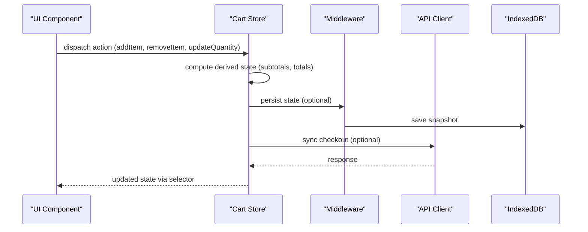
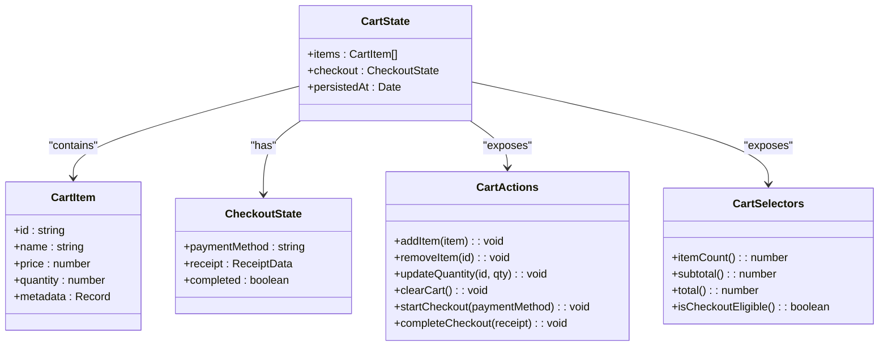
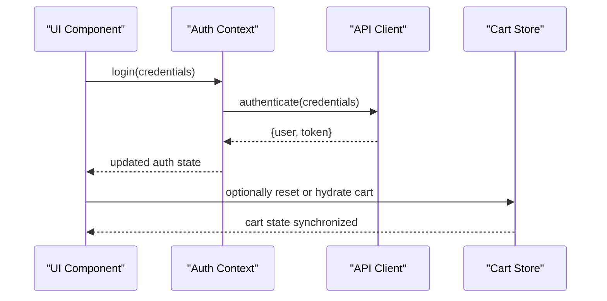
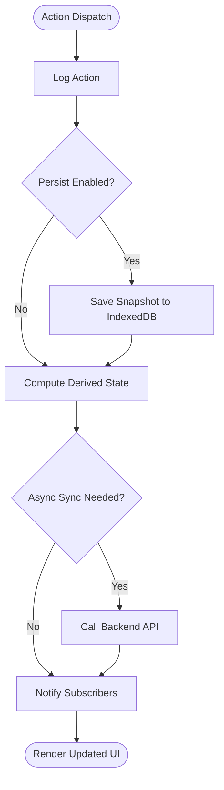
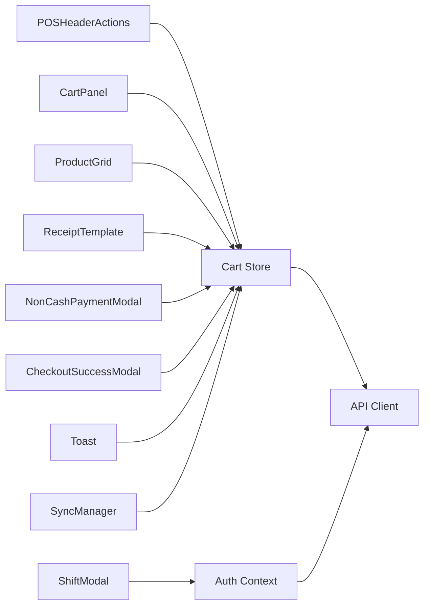
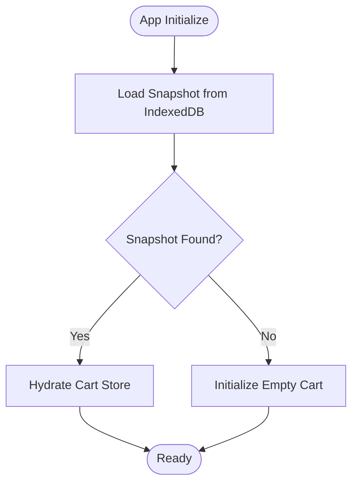
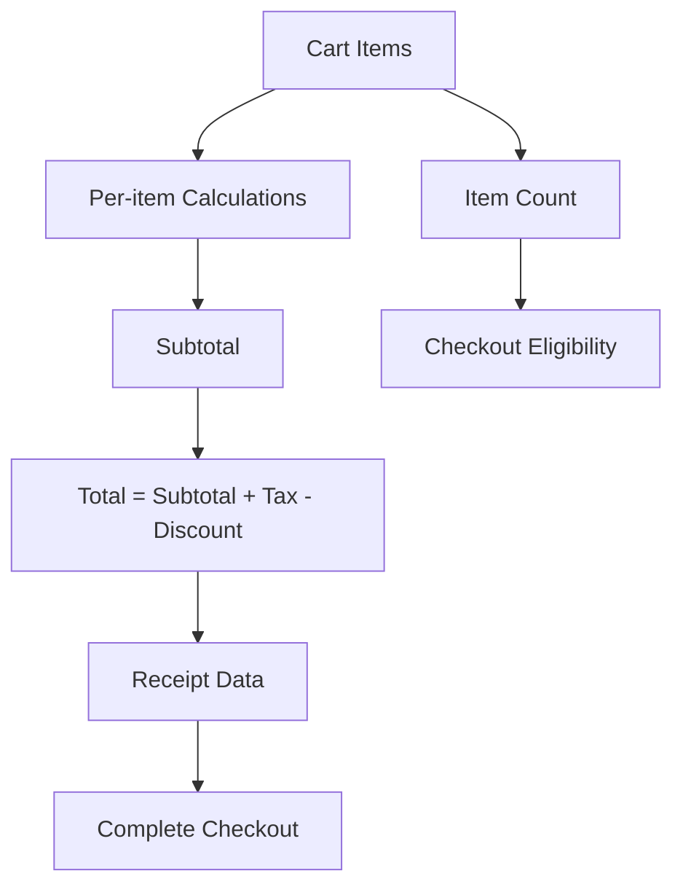
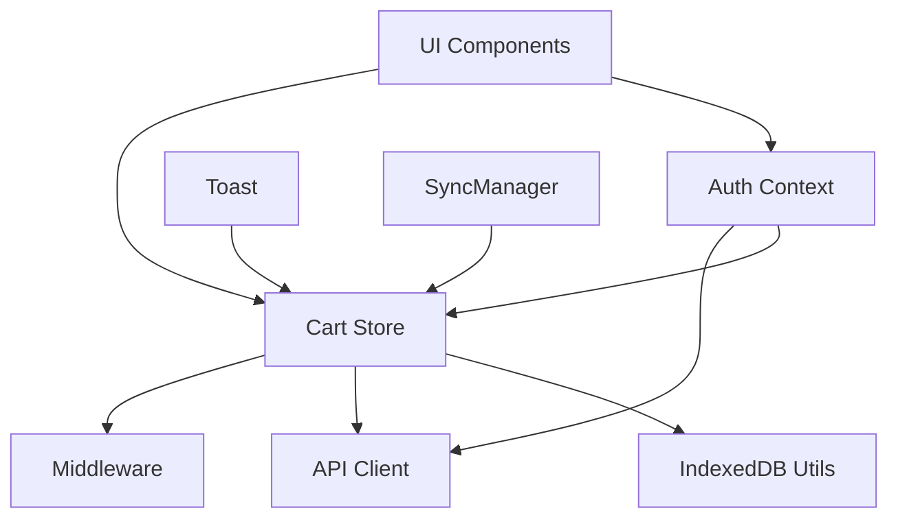

# State Management with Zustand

<cite>
**Referenced Files in This Document**
- [useCartStore.ts](file://apps/web/src/store/useCartStore.ts)
- [AuthContext.tsx](file://apps/web/src/contexts/AuthContext.tsx)
- [middleware.ts](file://apps/web/src/middleware.ts)
- [POSHeaderActions.tsx](file://apps/web/src/components/pos/POSHeaderActions.tsx)
- [CartPanel.tsx](file://apps/web/src/components/pos/CartPanel.tsx)
- [ProductGrid.tsx](file://apps/web/src/components/pos/ProductGrid.tsx)
- [ReceiptTemplate.tsx](file://apps/web/src/components/pos/ReceiptTemplate.tsx)
- [NonCashPaymentModal.tsx](file://apps/web/src/components/pos/NonCashPaymentModal.tsx)
- [CheckoutSuccessModal.tsx](file://apps/web/src/components/pos/CheckoutSuccessModal.tsx)
- [ShiftModal.tsx](file://apps/web/src/components/pos/ShiftModal.tsx)
- [Toast.tsx](file://apps/web/src/components/ui/Toast.tsx)
- [SyncManager.tsx](file://apps/web/src/components/SyncManager.tsx)
- [api.ts](file://apps/web/src/lib/api.ts)
- [indexeddb.ts](file://apps/web/src/lib/indexeddb.ts)
- [page.tsx](file://apps/web/src/app/pos/page.tsx)
</cite>

## Table of Contents
1. [Introduction](#introduction)
2. [Project Structure](#project-structure)
3. [Core Components](#core-components)
4. [Architecture Overview](#architecture-overview)
5. [Detailed Component Analysis](#detailed-component-analysis)
6. [Dependency Analysis](#dependency-analysis)
7. [Performance Considerations](#performance-considerations)
8. [Troubleshooting Guide](#troubleshooting-guide)
9. [Conclusion](#conclusion)

## Introduction
This document explains the state management implementation using Zustand in ARHAT POS. It focuses on the cart store for product selection and checkout, the authentication context for user sessions, and patterns for store creation, actions, selectors, persistence, hydration, and cross-component sharing. It also covers middleware usage for logging, persistence, and async operations, along with store composition, derived state, subscriptions, debugging, performance optimization, and memory management.

## Project Structure
The state management stack centers around:
- A Zustand-based cart store for POS operations
- An authentication context for user session lifecycle
- Middleware for cross-cutting concerns
- UI components that subscribe to and mutate state

```mermaid
graph TB
subgraph "Web Application"
POSPage["POS Page<br/>apps/web/src/app/pos/page.tsx"]
Header["POSHeaderActions<br/>apps/web/src/components/pos/POSHeaderActions.tsx"]
CartPanel["CartPanel<br/>apps/web/src/components/pos/CartPanel.tsx"]
ProductGrid["ProductGrid<br/>apps/web/src/components/pos/ProductGrid.tsx"]
Receipt["ReceiptTemplate<br/>apps/web/src/components/pos/ReceiptTemplate.tsx"]
NonCash["NonCashPaymentModal<br/>apps/web/src/components/pos/NonCashPaymentModal.tsx"]
Success["CheckoutSuccessModal<br/>apps/web/src/components/pos/CheckoutSuccessModal.tsx"]
Shift["ShiftModal<br/>apps/web/src/components/pos/ShiftModal.tsx"]
Toast["Toast<br/>apps/web/src/components/ui/Toast.tsx"]
SyncMgr["SyncManager<br/>apps/web/src/components/SyncManager.tsx"]
end
subgraph "State Layer"
CartStore["Cart Store<br/>apps/web/src/store/useCartStore.ts"]
AuthCtx["Auth Context<br/>apps/web/src/contexts/AuthContext.tsx"]
MW["Middleware<br/>apps/web/src/middleware.ts"]
end
subgraph "Infrastructure"
API["API Client<br/>apps/web/src/lib/api.ts"]
IDB["IndexedDB Utils<br/>apps/web/src/lib/indexeddb.ts"]
end
POSPage --> Header
POSPage --> CartPanel
POSPage --> ProductGrid
POSPage --> Receipt
POSPage --> NonCash
POSPage --> Success
POSPage --> Shift
POSPage --> Toast
POSPage --> SyncMgr
Header --> CartStore
CartPanel --> CartStore
ProductGrid --> CartStore
Receipt --> CartStore
NonCash --> CartStore
Success --> CartStore
Shift --> AuthCtx
CartStore --> API
CartStore --> IDB
AuthCtx --> API
MW --> CartStore
MW --> AuthCtx
```

**Diagram sources**
- [useCartStore.ts](file://apps/web/src/store/useCartStore.ts)
- [AuthContext.tsx](file://apps/web/src/contexts/AuthContext.tsx)
- [middleware.ts](file://apps/web/src/middleware.ts)
- [POSHeaderActions.tsx](file://apps/web/src/components/pos/POSHeaderActions.tsx)
- [CartPanel.tsx](file://apps/web/src/components/pos/CartPanel.tsx)
- [ProductGrid.tsx](file://apps/web/src/components/pos/ProductGrid.tsx)
- [ReceiptTemplate.tsx](file://apps/web/src/components/pos/ReceiptTemplate.tsx)
- [NonCashPaymentModal.tsx](file://apps/web/src/components/pos/NonCashPaymentModal.tsx)
- [CheckoutSuccessModal.tsx](file://apps/web/src/components/pos/CheckoutSuccessModal.tsx)
- [ShiftModal.tsx](file://apps/web/src/components/pos/ShiftModal.tsx)
- [Toast.tsx](file://apps/web/src/components/ui/Toast.tsx)
- [SyncManager.tsx](file://apps/web/src/components/SyncManager.tsx)
- [api.ts](file://apps/web/src/lib/api.ts)
- [indexeddb.ts](file://apps/web/src/lib/indexeddb.ts)
- [page.tsx](file://apps/web/src/app/pos/page.tsx)

**Section sources**
- [useCartStore.ts](file://apps/web/src/store/useCartStore.ts)
- [AuthContext.tsx](file://apps/web/src/contexts/AuthContext.tsx)
- [middleware.ts](file://apps/web/src/middleware.ts)
- [page.tsx](file://apps/web/src/app/pos/page.tsx)

## Core Components
- Cart Store: Centralized state for product selection, quantities, totals, and checkout state. Exposes actions to add/remove items, adjust quantities, calculate totals, and finalize checkout. Includes selectors for derived state like item counts and subtotals.
- Authentication Context: Manages user session lifecycle, login/logout, and provides shared auth state across components.
- Middleware: Provides cross-cutting capabilities such as logging, persistence, and async operations for stores and context.
- UI Components: Subscribe to stores via hooks, trigger actions, and render derived state.

Key responsibilities:
- Cart Store: Manage cart items, quantities, totals, tax, discounts, and checkout flow state.
- Auth Context: Track current user, session tokens, permissions, and handle auth transitions.
- Middleware: Enable persistence to IndexedDB, logging, and async orchestration.

**Section sources**
- [useCartStore.ts](file://apps/web/src/store/useCartStore.ts)
- [AuthContext.tsx](file://apps/web/src/contexts/AuthContext.tsx)
- [middleware.ts](file://apps/web/src/middleware.ts)

## Architecture Overview
Zustand-based stores coordinate with React components and middleware. The cart store encapsulates POS-specific logic, while the auth context coordinates user session state. Middleware handles persistence and logging.

**Diagram sources**
- [useCartStore.ts](file://apps/web/src/store/useCartStore.ts)
- [middleware.ts](file://apps/web/src/middleware.ts)
- [api.ts](file://apps/web/src/lib/api.ts)
- [indexeddb.ts](file://apps/web/src/lib/indexeddb.ts)

## Detailed Component Analysis

### Cart Store Implementation
The cart store manages:
- Items: product entries with identifiers, prices, quantities, and metadata
- Totals: subtotal, tax, discount, and grand total
- Checkout state: payment method, receipt data, and completion flag
- Derived state: item count, subtotals per item, and cart summary

Implementation highlights:
- Store creation pattern: Uses Zustand’s create with typed state and actions
- Actions: addItem, removeItem, updateQuantity, clearCart, startCheckout, completeCheckout
- Selectors: selectors for item counts, subtotals, and checkout eligibility
- Persistence: middleware persists state snapshots to IndexedDB
- Hydration: restores persisted state on initialization
- Async operations: integrates with API client for checkout synchronization

**Diagram sources**
- [useCartStore.ts](file://apps/web/src/store/useCartStore.ts)

**Section sources**
- [useCartStore.ts](file://apps/web/src/store/useCartStore.ts)

### Authentication Context
The auth context manages:
- User session: current user profile, tokens, and permissions
- Login/logout lifecycle: triggers auth state transitions
- Global coordination: shares auth state across components

Key aspects:
- Provider wraps application routes
- Hook exposes auth state and methods
- Integrates with backend APIs for authentication

**Diagram sources**
- [AuthContext.tsx](file://apps/web/src/contexts/AuthContext.tsx)
- [api.ts](file://apps/web/src/lib/api.ts)
- [useCartStore.ts](file://apps/web/src/store/useCartStore.ts)

**Section sources**
- [AuthContext.tsx](file://apps/web/src/contexts/AuthContext.tsx)

### Middleware for Logging, Persistence, and Async Operations
Middleware enables:
- Logging: action tracing and state diffs
- Persistence: automatic snapshotting to IndexedDB
- Async orchestration: background sync and retry logic

Patterns:
- Store middleware: wrap store with persistence and logging
- Context middleware: handle async auth flows and retries
- Cross-store coordination: synchronize cart and auth state during checkout

**Diagram sources**
- [middleware.ts](file://apps/web/src/middleware.ts)
- [indexeddb.ts](file://apps/web/src/lib/indexeddb.ts)
- [api.ts](file://apps/web/src/lib/api.ts)

**Section sources**
- [middleware.ts](file://apps/web/src/middleware.ts)
- [indexeddb.ts](file://apps/web/src/lib/indexeddb.ts)
- [api.ts](file://apps/web/src/lib/api.ts)

### Cross-Component State Sharing
Components subscribe to stores and react to state changes:
- POSHeaderActions: displays cart summary and opens checkout
- CartPanel: renders cart items, quantities, and totals
- ProductGrid: adds items to cart via product selection
- ReceiptTemplate: renders receipt from checkout state
- NonCashPaymentModal: updates checkout payment method
- CheckoutSuccessModal: finalizes and clears cart
- ShiftModal: coordinates user session transitions
- Toast: shows notifications for store events
- SyncManager: orchestrates offline/online synchronization

**Diagram sources**
- [POSHeaderActions.tsx](file://apps/web/src/components/pos/POSHeaderActions.tsx)
- [CartPanel.tsx](file://apps/web/src/components/pos/CartPanel.tsx)
- [ProductGrid.tsx](file://apps/web/src/components/pos/ProductGrid.tsx)
- [ReceiptTemplate.tsx](file://apps/web/src/components/pos/ReceiptTemplate.tsx)
- [NonCashPaymentModal.tsx](file://apps/web/src/components/pos/NonCashPaymentModal.tsx)
- [CheckoutSuccessModal.tsx](file://apps/web/src/components/pos/CheckoutSuccessModal.tsx)
- [ShiftModal.tsx](file://apps/web/src/components/pos/ShiftModal.tsx)
- [Toast.tsx](file://apps/web/src/components/ui/Toast.tsx)
- [SyncManager.tsx](file://apps/web/src/components/SyncManager.tsx)
- [useCartStore.ts](file://apps/web/src/store/useCartStore.ts)
- [AuthContext.tsx](file://apps/web/src/contexts/AuthContext.tsx)
- [api.ts](file://apps/web/src/lib/api.ts)

**Section sources**
- [POSHeaderActions.tsx](file://apps/web/src/components/pos/POSHeaderActions.tsx)
- [CartPanel.tsx](file://apps/web/src/components/pos/CartPanel.tsx)
- [ProductGrid.tsx](file://apps/web/src/components/pos/ProductGrid.tsx)
- [ReceiptTemplate.tsx](file://apps/web/src/components/pos/ReceiptTemplate.tsx)
- [NonCashPaymentModal.tsx](file://apps/web/src/components/pos/NonCashPaymentModal.tsx)
- [CheckoutSuccessModal.tsx](file://apps/web/src/components/pos/CheckoutSuccessModal.tsx)
- [ShiftModal.tsx](file://apps/web/src/components/pos/ShiftModal.tsx)
- [Toast.tsx](file://apps/web/src/components/ui/Toast.tsx)
- [SyncManager.tsx](file://apps/web/src/components/SyncManager.tsx)

### State Persistence Strategies and Hydration
- Persistence: Middleware saves cart snapshots to IndexedDB automatically after state changes
- Hydration: On app load, persisted state is restored into the cart store
- Fallback: If no persisted state exists, initializes with empty cart
- Offline-first: Enables checkout continuation when network is unavailable

**Diagram sources**
- [useCartStore.ts](file://apps/web/src/store/useCartStore.ts)
- [indexeddb.ts](file://apps/web/src/lib/indexeddb.ts)

**Section sources**
- [useCartStore.ts](file://apps/web/src/store/useCartStore.ts)
- [indexeddb.ts](file://apps/web/src/lib/indexeddb.ts)

### Derived State Calculations and Store Composition
- Derived state: Subtotal per item, cart item count, total amount, tax, and discount
- Store composition: Cart store depends on product catalog and pricing service; checkout state composes payment method and receipt data
- Selectors: Efficient recomputation of derived values without full re-renders

**Diagram sources**
- [useCartStore.ts](file://apps/web/src/store/useCartStore.ts)

**Section sources**
- [useCartStore.ts](file://apps/web/src/store/useCartStore.ts)

### State Subscription Patterns
- Component subscription: Components use hooks to subscribe to store slices
- Selector-based subscriptions: Subscribe to computed values to minimize re-renders
- Batch updates: Group related actions to reduce unnecessary renders

Examples of subscription patterns:
- Header subscribes to item count and total
- Cart panel subscribes to items and totals
- Product grid subscribes to add/remove actions

**Section sources**
- [POSHeaderActions.tsx](file://apps/web/src/components/pos/POSHeaderActions.tsx)
- [CartPanel.tsx](file://apps/web/src/components/pos/CartPanel.tsx)
- [ProductGrid.tsx](file://apps/web/src/components/pos/ProductGrid.tsx)

## Dependency Analysis
- Cart store depends on:
  - Middleware for persistence and logging
  - API client for checkout synchronization
  - IndexedDB utilities for persistence
- Auth context depends on:
  - API client for authentication
  - Cart store for session-aware cart resets
- UI components depend on:
  - Cart store for POS state
  - Auth context for session state
  - Toast and SyncManager for UX feedback

**Diagram sources**
- [useCartStore.ts](file://apps/web/src/store/useCartStore.ts)
- [AuthContext.tsx](file://apps/web/src/contexts/AuthContext.tsx)
- [middleware.ts](file://apps/web/src/middleware.ts)
- [api.ts](file://apps/web/src/lib/api.ts)
- [indexeddb.ts](file://apps/web/src/lib/indexeddb.ts)

**Section sources**
- [useCartStore.ts](file://apps/web/src/store/useCartStore.ts)
- [AuthContext.tsx](file://apps/web/src/contexts/AuthContext.tsx)
- [middleware.ts](file://apps/web/src/middleware.ts)
- [api.ts](file://apps/web/src/lib/api.ts)
- [indexeddb.ts](file://apps/web/src/lib/indexeddb.ts)

## Performance Considerations
- Minimize re-renders: Use selector-based subscriptions to subscribe to computed values
- Batch updates: Group cart mutations to avoid frequent renders
- Derived state caching: Cache expensive computations in selectors
- Persistence throttling: Debounce persistence writes to IndexedDB
- Memory cleanup: Clear temporary checkout data after completion
- Async orchestration: Use middleware to batch and retry async operations

## Troubleshooting Guide
Common issues and resolutions:
- State not persisting: Verify IndexedDB availability and middleware configuration
- Cart not hydrating: Ensure snapshot exists and middleware is initialized before store usage
- Checkout failures: Inspect API responses and middleware logs for async errors
- Session drift: Reset cart on logout and rehydrate on login
- UI not updating: Confirm component subscriptions and selector correctness

Debugging techniques:
- Enable logging middleware to trace actions and state diffs
- Inspect IndexedDB snapshots for hydration issues
- Use browser devtools to monitor store subscriptions and renders
- Add error boundaries and toast notifications for runtime errors

**Section sources**
- [middleware.ts](file://apps/web/src/middleware.ts)
- [indexeddb.ts](file://apps/web/src/lib/indexeddb.ts)
- [Toast.tsx](file://apps/web/src/components/ui/Toast.tsx)

## Conclusion
ARHAT POS leverages Zustand for efficient, typed, and composable state management. The cart store centralizes POS logic with robust actions, selectors, and derived state. The auth context coordinates user sessions globally. Middleware provides persistence, logging, and async orchestration. Together, these patterns enable reliable offline-first experiences, cross-component state sharing, and maintainable development practices.